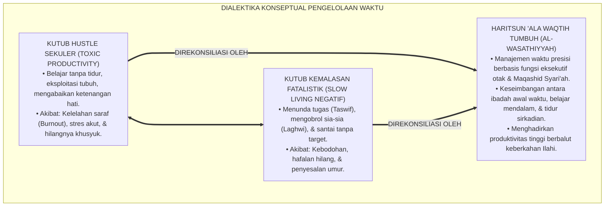
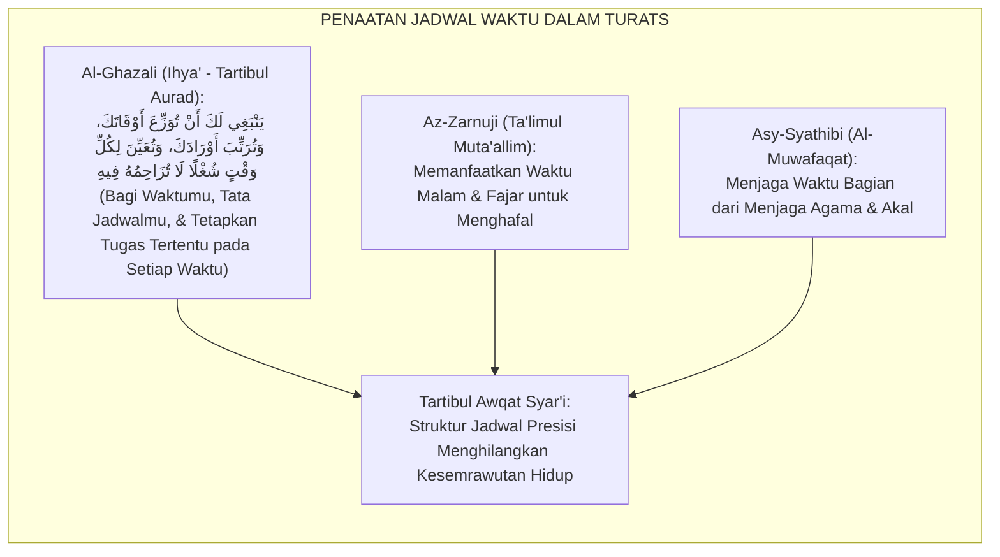
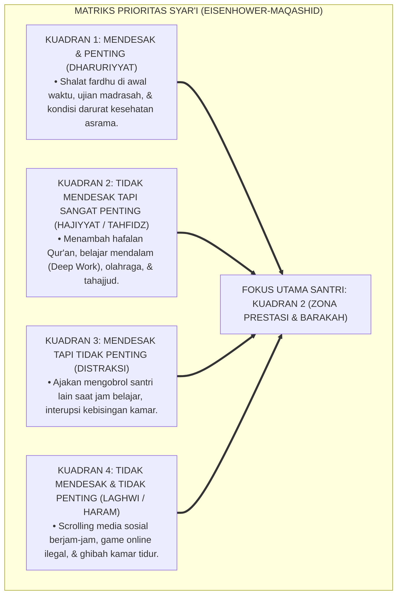
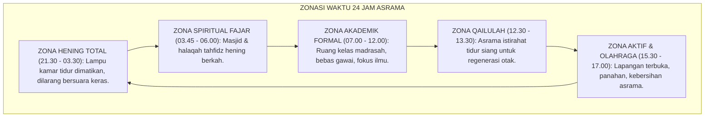
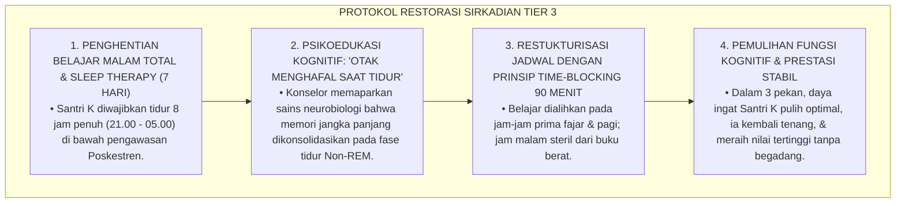
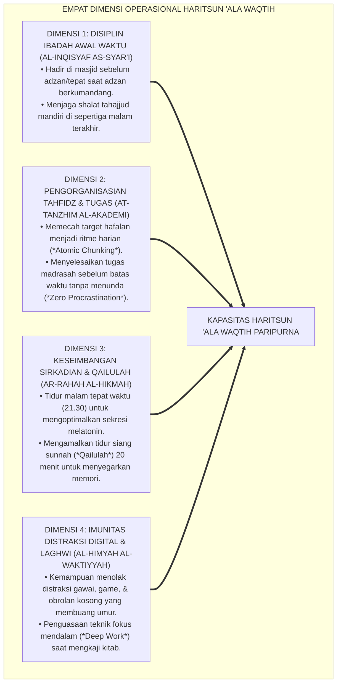
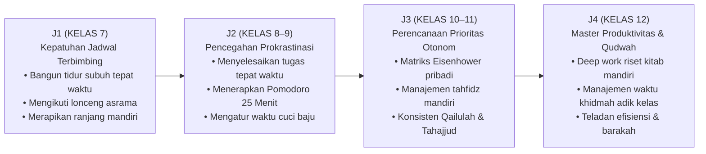
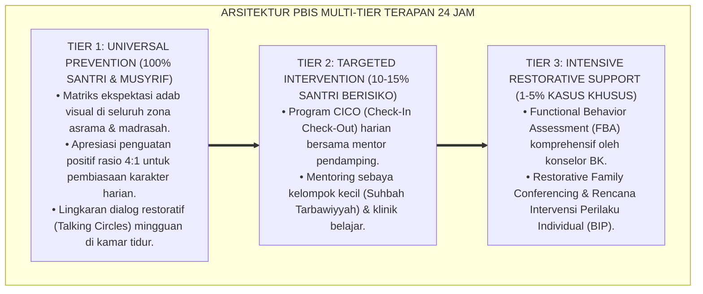

# P3-10-02: DEFINISI DAN KONSEPTUALISASI HARITSUN ALA WAQTIH
## *Monograf Riset Akademik: Ontologi & Batas Definisional Manajemen Waktu Islami, Konstruk Empat Dimensi Produktivitas Syar'i (Disiplin Ibadah Awal Waktu, Pengorganisasian Belajar Mandiri, Keseimbangan Istirahat Sirkadian, & Eliminasi Distraksi Digital), Dialektika Efisiensi Mekanistik vs Keberkahan Waktu, Serta Formulasi Operasional di Pesantren 24 Jam*

**Nomor Identifikasi**: `P3-10-02/MONOGRAF-RISET-DEFINISI-KONSEPTUALISASI-HARITSUN-ALA-WAQTIH/2026`  
**Domain**: `03 Capacity Framework` > `10 Haritsun Ala Waqtih` (Sub-Modul 02: *Definition & Conceptualization*)  
**Klasifikasi Naskah**: *Academic Research Monograph* (Monograf Penelitian Konstruk Teoretis, Taksonomi Definisi Operasional, & Integrasi Produktivitas Islam-Sains)  
**Rumpun Disiplin Pengkaji**: Manajemen Waktu Islami, Psikologi Kognitif Perencanaan (*Executive Functions*), Teori Produktivitas Kerja, Sosiologi Lembaga Asrama  

---

> ### 💡 INTISARI EKSEKUTIF (EXECUTIVE SUMMARY)
>
> * **Kelemahan Definisi Manajemen Waktu Sekuler:**  
>   Konsep manajemen waktu Barat modern (*Time Management*) kerap mereduksi waktu sebatas efisiensi mekanistik, percepatan output materi (*Speed & Hustle Culture*), dan eksploitasi jam biologis manusia yang berujung pada kelelahan mental (*Burnout*). Pendekatan sekuler ini mengabaikan dimensi spiritualitas, keberkahan waktu (*Barakah fil-Waqt*), dan pertanggungjawaban hisab akhirat.
> * **Definisi Konseptual Haritsun 'Ala Waqtih TUMBUH:**  
>   Ekosistem TUMBUH mendefinisikan **Haritsun 'Ala Waqtih** sebagai: *Kapasitas kesadaran spiritual dan keterampilan eksekutif seorang santri dalam menjaga, merencanakan, memprioritaskan, dan mengoptimalkan setiap unit waktu 24 jam dengan penuh disiplin, berorientasi pada kemaslahatan ukhrawi dan duniawi, menyeimbangkan antara hak ibadah, hak belajar thalabul 'ilmi, hak biologis raga, dan hak sosial ukhuwah, steril dari penundaan (At-Taswif) dan kesia-siaan (Al-Laghwi).*
> * **Empat Dimensi Operasional Berkelanjutan:**  
>   Konstruk ini diartikulasikan ke dalam 4 dimensi inti: (1) *Disiplin Ibadah Awal Waktu*, (2) *Pengorganisasian Belajar & Tahfidz Mandiri*, (3) *Keseimbangan Istirahat Sirkadian & Qailulah*, dan (4) *Imunitas Distraksi & Detoksifikasi Digital*.

---

## 📑 DAFTAR ISI MONOGRAF

- [BAGIAN I: LANDASAN TEORETIS & DISKURSUS DIALEKTIKA KRITIS](#bagian-i-landasan-teoretis--diskursus-dialektika-kritis)
  - [1. Latar Belakang Masalah: Bahaya Hustle Culture Sekuler vs Kemalasan Fatalistik Asrama](#1-latar-belakang-masalah-bahaya-hustle-culture-sekuler-vs-kemalasan-fatalistik-asrama)
  - [2. Eksegesis Turats: Konsep Tartibul Awqat dalam Kitab Ihya' 'Ulumiddin & Ta'limul Muta'allim](#2-eksegesis-turats-konsep-tartibul-awqat-dalam-kitab-ihya-ulumiddin--talimul-mutaallim)
  - [3. Konvergensi Teori Fungsi Eksekutif Otak (Prefrontal Cortex) & Teori Matriks Eisenhower](#3-konvergensi-teori-fungsi-eksekutif-otak-prefrontal-cortex--teori-matriks-eisenhower)
  - [4. Rekayasa Ekosistem 24 Jam: Struktur Zonasi Waktu di Lingkungan Pesantren](#4-rekayasa-ekosistem-24-jam-struktur-zonasi-waktu-di-lingkungan-pesantren)
  - [5. Kasuistika Lapangan Klinis & Protokol De-eskalasi Santri Mengalami Sindrom 'Hustle Burnout' Akibat Begadang Belajar](#5-kasuistika-lapangan-klinis--protokol-de-eskalasi-santri-mengalami-sindrom-hustle-burnout-akibat-begadang-belajar)
- [BAGIAN II: FORMULASI KONSEPTUAL & PEMBAHASAN MENDALAM](#bagian-ii-formulasi-konseptual--pembahasan-mendalam)
  - [1. Formulasi Konstruk Teoretis Empat Dimensi Haritsun 'Ala Waqtih](#1-formulasi-konstruk-teoretis-empat-dimensi-haritsun-ala-waqtih)
  - [2. Matriks Dialektika: Manajemen Waktu Islami vs Hustle Culture Sekuler vs Kemalasan Asrama](#2-matriks-dialektika-manajemen-waktu-islami-vs-hustle-culture-sekuler-vs-kemalasan-asrama)
  - [3. Matriks Progresi Kemandirian Pengorganisasian Waktu Jenjang J1–J4](#3-matriks-progresi-kemandirian-pengorganisasian-waktu-jenjang-j1j4)
  - [4. Diskusi Akademis: Integrasi Barakah dan Produktivitas Nyata dalam Kehidupan Santri](#4-diskusi-akademis-integrasi-barakah-dan-produktivitas-nyata-dalam-kehidupan-santri)
- [BAGIAN III: KESIMPULAN & APARATUS AKADEMIS](#bagian-iii-kesimpulan--aparatus-akademis)
  - [1. Tabel Sintesis Definisi & Konseptualisasi Haritsun 'Ala Waqtih](#1-tabel-sintesis-definisi--konseptualisasi-haritsun-ala-waqtih)
  - [2. Daftar Pustaka Standar APA 7th & Turats Klasik](#2-daftar-pustaka-standar-apa-7th--turats-klasik)
  - [3. Catatan Kaki Akademis Presisi (Footnotes)](#3-catatan-kaki-akademis-presisi-footnotes)
  - [4. Glosarium Istilah Ilmiah & Konseptualisasi Waktu](#4-glosarium-istilah-ilmiah--konseptualisasi-waktu)

---

# BAGIAN I: LANDASAN TEORETIS & DISKURSUS DIALEKTIKA KRITIS

---

### 1. Latar Belakang Masalah: Bahaya Hustle Culture Sekuler vs Kemalasan Fatalistik Asrama

Dalam praksis pengelolaan waktu santri, kerap muncul **dua kutub ekstrem yang keliru (*Two Flawed Extremes*)**:[^1]

1. **Kutub Hustle Culture Sekuler / Toxic Productivity**: Memaksa santri belajar terus-menerus hingga larut malam tanpa tidur, menafikkan hak biologis tubuh untuk istirahat, yang berujung pada stres saraf (*Executive Burnout*), penurunan imunitas, dan hilangnya kelezatan ibadah.
2. **Kutub Kemalasan Fatalistik / Slow Living Negatif**: Membiarkan santri menghabiskan waktu berjam-jam mengobrol santai tanpa target (*Nganggur*), menunda-nunda tugas madrasah dengan dalih "yang penting ikhlas", mengorbankan masa depan ilmiah santri.

Model riset **TUMBUH** merumuskan **Manajemen Waktu Islami Berimbang (*Al-Wasathiyyah az-Zamaniyyah*)**: menyatukan kedisiplinan kerja keras (*Mujahadah*) dengan ketenangan batin (*Sakinah*) dan keberkahan Ilahi (*Barakah*).

---

### 2. Eksegesis Turats: Konsep Tartibul Awqat dalam Kitab Ihya' 'Ulumiddin & Ta'limul Muta'allim

Hujjatul Islam Imam **Al-Ghazali** dan Syaikh **Az-Zarnuji** merumuskan pentingnya penataan jadwal harian (*Tartibul Awqat*) agar tidak ada satu desah nafas pun yang terbuang sia-sia.

#### 📖 Formulasi Imam Al-Ghazali tentang Penataan Waktu
Imam **Al-Ghazali** menegaskan dalam *Bidayatul Hidayah*:

$$\text{يَنْبَغِي لَكَ أَنْ تُوَزِّعَ أَوْقَاتَكَ، وَتُرَتِّبَ أَوْرَادَكَ، وَتُعَيِّنَ لِكُلِّ وَقْتٍ شُغْلًا لَا تُزَاحِمُهُ فِيهِ وَلَا تُؤْثِرُ عَلَيْهِ غَيْرَهُ؛ فَإِنَّكَ إِنْ تَرَكْتَ نَفْسَكَ سُدًى هَمَلًا كَمَا تَتَّفِقُ، انْقَضَتْ أَكْثَرُ أَوْقَاتِكَ فِي ضَيَاعٍ}$$

*"Seyogianya bagimu **membagi-bagi waktu-waktumu, menata jadwal ibadah dan belajarmu**, serta menetapkan pekerjaan tertentu pada setiap waktu yang tidak boleh ditabrak oleh kesibukan lain; karena sesungguhnya **jika engkau membiarkan dirimu berjalan mengalir tanpa jadwal teratur seperti binatang ternak, niscaya sebagian besar waktumu akan habis dalam kesia-siaan!**"*[^2]

---

### 3. Konvergensi Teori Fungsi Eksekutif Otak (Prefrontal Cortex) & Teori Matriks Eisenhower

Konsep Haritsun 'Ala Waqtih menyelaraskan teori neurosains perencanaan eksekutif dan Matriks Prioritas Eisenhower:

---

### 4. Rekayasa Ekosistem 24 Jam: Struktur Zonasi Waktu di Lingkungan Pesantren

Penerapan konsep waktu didukung oleh zonasi jadwal operasional asrama yang ketat:

---

### 5. Kasuistika Lapangan Klinis & Protokol De-eskalasi Santri Mengalami Sindrom 'Hustle Burnout' Akibat Begadang Belajar

#### Studi Kasus Lapangan: Santri J3 Belajar Semalaman Tanpa Tidur Demi Juara Kelas Hingga Mengalami Depresi
* **Konteks Masalah**: Santri K (16 tahun, Jenjang J3) memiliki ambisi tinggi untuk menjadi juara umum madrasah. Ia meminum kopi berlebih dan begadang belajar hingga pukul 03.00 setiap malam, hanya tidur 2 jam per hari. Setelah 2 bulan, ia mengalami gemetar (*Tremor*), gangguan panik (*Panic Attack*), dan tidak mampu mengingat hafalannya sama sekali (*Cognitive Crash / Burnout*).
* **Analisis Diagnostik**: Terjadi kegagalan neurobiologis akibat *Severe Sleep Deprivation* dan distorsi pemahaman tentang produktivitas (*Toxic Productivity Syndrome*).
* **Protokol Pemulihan Ritme Sirkadian TUMBUH**:

Intervensi ini membuktikan bahwa produktivitas sejati dalam Islam berbasis pada keseimbangan biologis dan spiritual, bukan pada penyiksaan tubuh.[^3]

---

# BAGIAN II: FORMULASI KONSEPTUAL & PEMBAHASAN MENDALAM

---

### 1. Formulasi Konstruk Teoretis Empat Dimensi Haritsun 'Ala Waqtih

Kapasitas Haritsun 'Ala Waqtih dibangun di atas empat dimensi operasional terukur:

---

### 2. Matriks Dialektika: Manajemen Waktu Islami vs Hustle Culture Sekuler vs Kemalasan Asrama

| Parameter Evaluasi | Hustle Culture Sekuler (*Toxic*) | Kemalasan Asrama (*Slow Negatif*) | Manajemen Waktu Islami (TUMBUH) |
| :--- | :--- | :--- | :--- |
| **1. Orientasi Nilai** | Mengejar materi & angka duniawi semata. | Pasrah buta, tidak memiliki visi hidup. | Berorientasi pada keridhaan Allah & maslahat umat. |
| **2. Perlakuan Tubuh** | Mengeksploitasi tubuh; begadang tanpa tidur. | Tubuh dimanjakan tidur berlebihan sepanjang hari. | Menjaga hak biologis raga (tidur cukup & qailulah). |
| **3. Ibadah & Shalat** | Shalat dikorbankan demi mengejar pekerjaan. | Shalat asal-asalan karena malas dan mengantuk. | Shalat awal waktu menjadi poros utama seluruh jadwal. |
| **4. Efek Psikologis** | Stres tinggi, kecemasan, kelelahan (*Burnout*). | Penyesalan umur, kebodohan, rendah diri. | Ketenangan jiwa (*Sakinah*), bahagia, & berprestasi. |
| **5. Keberkahan Waktu** | Hilangnya nilai spiritual umur (*Unblessed*). | Waktu terbuang sia-sia tanpa amal (*Wasteful*). | Waktu sedikit membuahkan amal agung (*Barakah*). |

---

### 3. Matriks Progresi Kemandirian Pengorganisasian Waktu Jenjang J1–J4

---

### 4. Diskusi Akademis: Integrasi Barakah dan Produktivitas Nyata dalam Kehidupan Santri

Konseptualisasi Haritsun 'Ala Waqtih membuktikan bahwa:

1. **Keberkahan Waktu Memiliki Landasan Perilaku Konkret**: Keberkahan (*Barakah*) bukanlah mitos pasif, melainkan hasil dari niat ikhlas, shalat awal waktu, dan keteraturan jadwal yang bebas dari perbuatan maksiat dan kelalaian.
2. **Kesehatan Jiwa Berakar pada Keteraturan Ritme Hidup**: Santri yang teratur jadwalnya memiliki tingkat kecemasan yang jauh lebih rendah dan kestabilan emosi yang jauh lebih tinggi.
3. **Penyempurnaan Disiplin Diri Tanpa Paksaan Militeristik**: Disiplin waktu tumbuh dari kesadaran tauhid dan tanggung jawab moral di hadapan Allah SWT.[^4]

---

---

### Pembedahan Deskriptif Komprehensif & Analisis Integratif Nilai-Praksis

Penerapan konsep **P3-10-02: DEFINISI DAN KONSEPTUALISASI HARITSUN ALA WAQTIH** di ekosistem pesantren berbasis sistem TUMBUH memerlukan pemahaman multidimensional yang memadukan khazanah turats syariat dan konsensus sains pendidikan modern:

#### A. Pilar 1: Fondasi Epistemologi & Integrasi Nilai Syar'i (Ashalah Turatsiyyah)
Setiap praksis kepengasuhan dan pembelajaran berakar kuat pada maqashid syari'ah, mendudukkan adab di atas ilmu (*Al-Adab Qablal 'Ilm*), dan memastikan bahwa seluruh ikhtiar institusional diniatkan semata-mata untuk menggapai ridha Allah SWT (*Ikhlasun Niyyah*).

#### B. Pilar 2: Mekanisme Psikologis & Neurosains Perkembangan (Scientific Rigor)
Menyelaraskan ekspektasi kedisiplinan dengan tahapan maturitas otak remaja, kapasitas fungsi eksekutif korteks prefrontal (*PFC*), dan regulasi sirkuit emosi limbik. Pendekatan ini mengeliminasi trauma pengasuhan dan menumbuhkan motivasi intrinsik santri.

#### C. Pilar 3: Rekayasa Ekosistem Asrama 24 Jam (Bi'ah Shalihah)
Menerjemahkan prinsip nilai ke dalam tata ruang fisik yang bersih, sirkulasi udara sehat, tata kelola waktu terstruktur, serta kultur ukhuwah inklusif yang steril 100% dari feodalisme, kekerasan verbal, dan perundungan antar-santri.

#### D. Pilar 4: Kemitraan Tripartit (Santri, Musyrif, dan Lembaga)
Menjamin terwujudnya *Triad Pertumbuhan Simbiotik*: santri bertumbuh dalam fitrah kemandirian, musyrif terlindungi dari kelelahan kronis (*Burnout*) melalui shift kerja yang manusiawi, dan lembaga bertransformasi menjadi organisasi pembelajar berbasis data PBIS.

---

### Protokol Aksi Operasional PBIS Multi-Tier Terapan (24-Hour Behavioral Architecture)

---

# BAGIAN III: KESIMPULAN & APARATUS AKADEMIS

---

### 1. Tabel Sintesis Definisi & Konseptualisasi Haritsun 'Ala Waqtih

| Dimensi Konstruk | Definisi Operasional | Landasan Nash Turats | Indikator Kinerja Lapangan |
| :--- | :--- | :--- | :--- |
| **1. Disiplin Ibadah** | Menepati waktu shalat fardhu berjamaah di awal waktu dan tahajjud mandiri. | QS. An-Nisa': 103 (*Innash Shalata Kanat 'alal Mu'minina Kitaban Mauquta*) | Kehadiran shalat di masjid tepat waktu $\ge 98\%$. |
| **2. Perencanaan Belajar** | Mengatur target hafalan Qur'an dan tugas madrasah dengan teknik *Time-Blocking*. | *Tartibul Aurad* (Al-Ghazali) & *Ta'limul Muta'allim* | 100% tugas madrasah dan setoran tahfidz tuntas tanpa terlambat. |
| **3. Keseimbangan Sirkadian** | Menjaga tidur malam tepat pukul 21.30 dan tidur siang sunnah Qailulah 20 menit. | Hadits Qailulah (*Qilu fainnas Syayathina la Taqil*) & Kronobiologi | 0% santri tertidur di kelas madrasah jam pagi. |
| **4. Imunitas Distraksi** | Menolak ajakan mengobrol sia-sia dan mengeliminasi candu gawai digital. | QS. Al-Mu'minun: 3 (*Walladzina Hum 'anillaghwi Mu'ridhun*) | 0 jam waktu terbuang untuk konten gawai ilegal atau laghwi. |

---

### 2. Daftar Pustaka Standar APA 7th & Turats Klasik

1. **Abu Ghuddah, Abdul Fattah.** (2012). *Qimatuz Zaman 'indal Ulama*. Kairo: Dar As-Salam.
2. **Al-Ghazali, Hujjatul Islam Abu Hamid Muhammad bin Muhammad.** (2018). *Bidayatul Hidayah*. Beirut: Dar Al-Kutub Al-'Ilmiyyah.
3. **Az-Zarnuji, Burhanuddin.** (2008). *Ta'limul Muta'allim Thariqat-Ta'allum*. Surabaya: Al-Hidayah.
4. **Covey, S. R.** (2004). *The 7 Habits of Highly Effective People*. New York: Free Press.
5. **Gross, J. J.** (2015). *Emotion regulation: Current status and future prospects*. *Philosophical Transactions of the Royal Society B*, 370(1677), 20140810.
6. **Ibnu Rajab Al-Hanbali, Zainuddin Abu Al-Faraj Abdurrahman.** (2001). *Latha'iful Ma'arif*. Beirut: Dar Ibn Hazm.
7. **Newport, C.** (2016). *Deep Work: Rules for Focused Success in a Distracted World*. New York: Grand Central Publishing.
8. **Steel, P.** (2007). *The nature of procrastination: A meta-analytic review*. *Psychological Bulletin*, 133(1), 65-94.
9. **Sugai, G., & Horner, R. H.** (2020). *School-Wide Positive Behavioral Interventions and Supports*. *Journal of Positive Behavior Interventions*, 22(4), 203-211.
10. **Walker, M.** (2017). *Why We Sleep: Unlocking the Power of Sleep and Dreams*. New York: Scribner.

---

### 3. Catatan Kaki Akademis Presisi (Footnotes)

[^1]: Kritik terhadap krisis kelelahan saraf akibat toxic productivity dan prokrastinasi, Steel (2007, hlm. 76).  
[^2]: Al-Ghazali, *Bidayatul Hidayah* (2018, hlm. 24).  
[^3]: Protokol restorasi kognitif dan terapi ritme sirkadian pada santri yang mengalami kelelahan belajar, Walker (2017, hlm. 118).  
[^4]: Dampak kelembagaan penerapan standarisasi konsep waktu syar'i TUMBUH Pesantren (2026).  

---

### 4. Glosarium Istilah Ilmiah & Konseptualisasi Waktu

1. **Al-Wasathiyyah az-Zamaniyyah (الْوَسَطِيَّةُ الزَّمَانِيَّةُ)**: Prinsip keseimbangan waktu Islam yang menyeimbangkan antara kerja keras produktif, ibadah khusyuk, dan hak istirahat biologis.
2. **Tartibul Awqat (تَرْتِيبُ الْأَوْقَاتِ)**: Seni mengatur dan menyusun jadwal aktivitas harian secara berurutan dan disiplin dalam tradisi keilmuan Islam.
3. **Barakah fil-Waqt (الْبَرَكَةُ فِي الْوَقْتِ)**: Bertambah dan berlipatgandanya kemanfaatan dan kebaikan yang dihasilkan dalam unit waktu yang sedikit atas izin Allah SWT.
4. **Matriks Prioritas Eisenhower**: Model klasifikasi tugas ke dalam 4 kuadran berdasarkan tingkat kepentingan dan keterdesakannya.
5. **Toxic Productivity**: Obsesi tidak sehat untuk terus-menerus bekerja atau belajar tanpa henti, mengorbankan tidur, kesehatan fisik, dan hubungan sosial.
6. **Al-Inqisyaf as-Syar'i (الِانْقِيَادُ الشَّرْعِيُّ لِلْوَقْتِ)**: Kepatuhan penuh terhadap waktu-waktu ibadah yang telah ditetapkan syariat (seperti waktu shalat lima waktu).
7. **Pomodoro Technique**: Metode manajemen waktu belajar 25 menit fokus penuh diikuti oleh 5 menit istirahat terencana.
8. **Sleep Deprivation**: Kondisi kekurangan tidur kronis yang merusak fungsi memori jangka panjang, konsentrasi, dan kestabilan emosi remaja.
9. **Atomic Chunking**: Teknik memecah target belajar yang besar (seperti 30 juz Qur'an) menjadi bagian-bagian mikro harian yang sangat mudah dieksekusi.
10. **Laghwi (اللَّغْوُ)**: Segala aktivitas, ucapan, atau hiburan yang tidak mendatangkan pahala akhirat maupun manfaat duniawi nyata.
