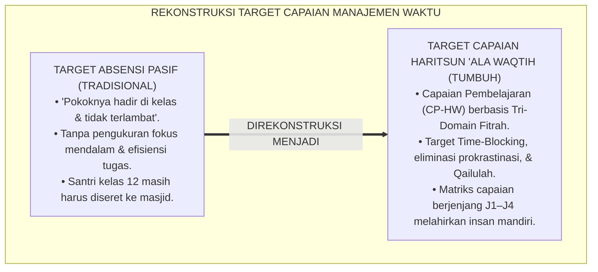
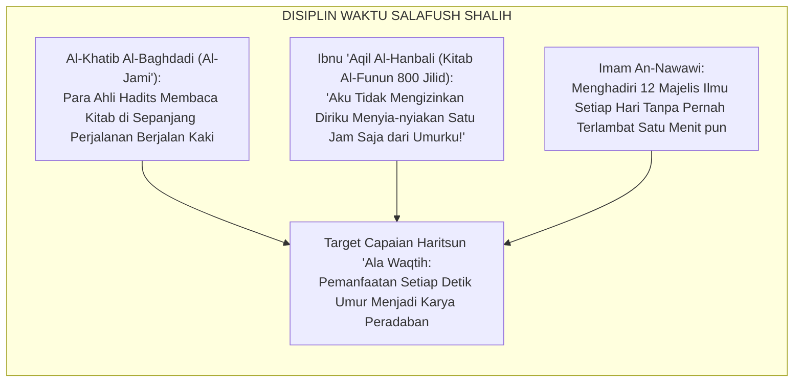
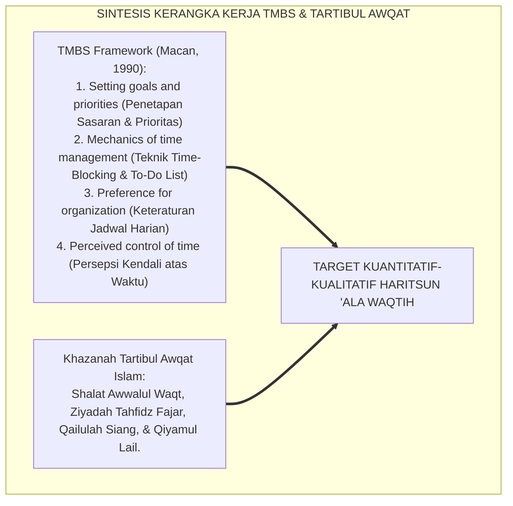
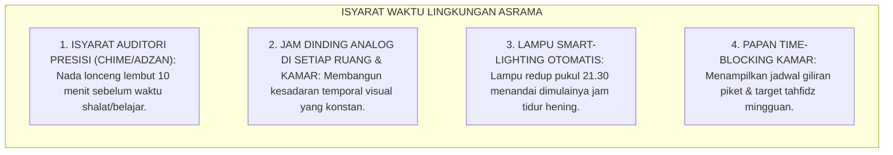
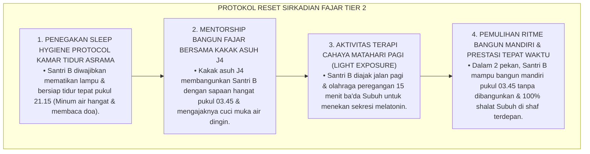
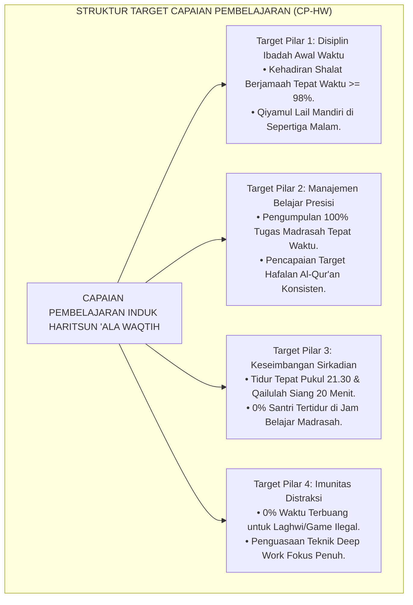
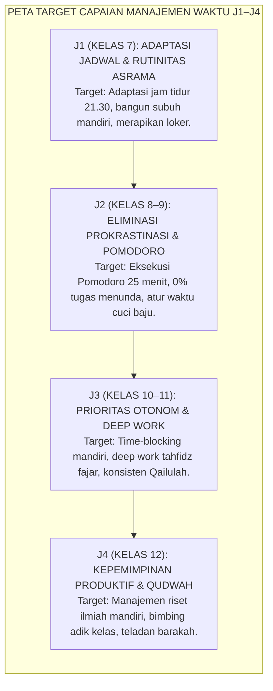
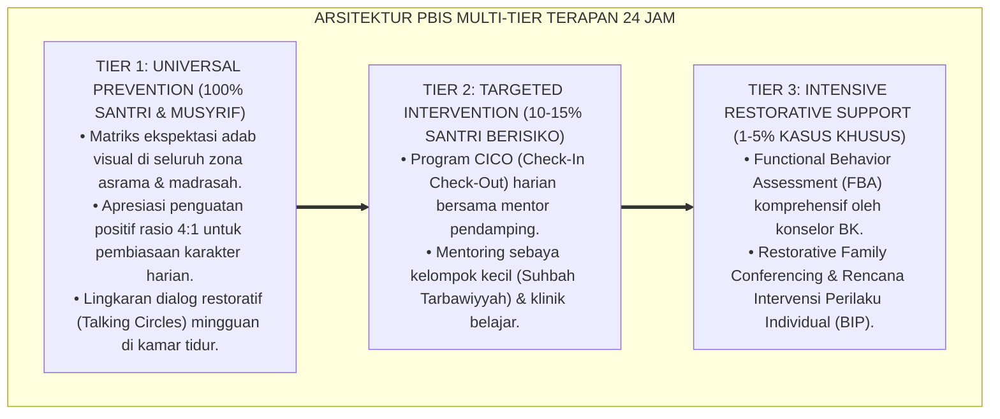

# P3-10-03: TUJUAN DAN TARGET CAPAIAN HARITSUN ALA WAQTIH
## *Monograf Riset Akademik: Standarisasi Capaian Pembelajaran Manajemen Waktu (CP-HW), Parameter Produktivitas & Disiplin Waktu Terukur, Taksonomi Target Tri-Domain Fitrah (Kognitif Afektif Psikomotorik), Matriks Target Progresi J1–J4, Serta Dampak Triad Pertumbuhan di Pesantren 24 Jam*

**Nomor Identifikasi**: `P3-10-03/MONOGRAF-RISET-TUJUAN-CAPAIAN-HARITSUN-ALA-WAQTIH/2026`  
**Domain**: `03 Capacity Framework` > `10 Haritsun Ala Waqtih` (Sub-Modul 03: *Purpose & Target Outcomes*)  
**Klasifikasi Naskah**: *Academic Research Monograph* (Monograf Penelitian Standarisasi Capaian Pembelajaran Manajemen Waktu, Pengukuran Produktivitas Santri, & Taksonomi Afektif Waktu)  
**Rumpun Disiplin Pengkaji**: Desain Kurikulum Karakter Pesantren, Psikometri Produktivitas Siswa, Kronobiologi Pendidikan, Manajemen Mutu Lembaga  

---

> ### 💡 INTISARI EKSEKUTIF (EXECUTIVE SUMMARY)
>
> * **Kelemahan Target Waktu Konvensional di Pesantren:**  
>   Target kedisiplinan waktu di banyak pesantren selama ini hanya dirumuskan secara kaku dan reaktif ("tidak boleh terlambat shalat", "tidak boleh telat masuk kelas") tanpa indikator positif terukur mengenai kemampuan santri merencanakan target belajar mandiri (*Time Planning Competency*), efisiensi menghafal Al-Qur'an (*Hafalan Efficiency Ratio*), dan kepatuhan terhadap jam biologis tidur sirkadian.
> * **Formulasi Standar Capaian Pembelajaran Haritsun 'Ala Waqtih TUMBUH:**  
>   Ekosistem TUMBUH merumuskan **Capaian Pembelajaran Haritsun 'Ala Waqtih (CP-HW)** berbasis 3 domain terpadu: (1) *Kognitif Waktu (Pemahaman Konsep Qimatuz Zaman, Matriks Eisenhower, & Prinsip Deep Work)*, (2) *Afektif Menghargai Umur (Rasa Tanggung Jawab Hisab Akhirat, Benci Penundaan/Taswif, & Cinta Istiqamah)*, dan (3) *Psikomotorik Disiplin Presisi (Kehadiran Awal Waktu di Masjid, Time-Blocking Harian, Eksekusi Pomodoro, & Kepatuhan Qailulah)*.
> * **Dampak Triad Pertumbuhan Simbiotik:**  
>   Pencapaian target waktu ini melipatgandakan prestasi santri dalam menyelesaikan 30 juz Al-Qur'an tepat waktu, membebaskan musyrif dari stres membangunkan santri dengan bentakan, serta menjadikan pesantren teladan efisiensi dan ketertiban peradaban Islam.

---

## 📑 DAFTAR ISI MONOGRAF

- [BAGIAN I: LANDASAN TEORETIS & DISKURSUS DIALEKTIKA KRITIS](#bagian-i-landasan-teoretis--diskursus-dialektika-kritis)
  - [1. Latar Belakang Masalah: Bahaya Target Waktu Pasif 'Sekadar Absensi' Tanpa Indikator Produktivitas](#1-latar-belakang-masalah-bahaya-target-waktu-pasif-sekadar-absensi-tanpa-indikator-produktivitas)
  - [2. Eksegesis Turats: Target Capaian Disiplin Waktu Ulama Hadits & Fuqaha Salaf](#2-eksegesis-turats-target-capaian-disiplin-waktu-ulama-hadits--fuqaha-salaf)
  - [3. Konvergensi Standar Internasional Manajemen Waktu (Time Management Behavior Scale / TMBS)](#3-konvergensi-standar-internasional-manajemen-waktu-time-management-behavior-scale--tmbs)
  - [4. Rekayasa Lingkungan 24 Jam sebagai Akselerator Keteraturan Waktu Asrama](#4-rekayasa-lingkungan-24-jam-sebagai-akselerator-keteraturan-waktu-asrama)
  - [5. Kasuistika Lapangan Klinis & Protokol Remediasi Santri Sering Terlambat Shalat Subuh Berjamaah](#5-kasuistika-lapangan-klinis--protokol-remediasi-santri-sering-terlambat-shalat-subuh-berjamaah)
- [BAGIAN II: FORMULASI KONSEPTUAL & PEMBAHASAN MENDALAM](#bagian-ii-formulasi-konseptual--pembahasan-mendalam)
  - [1. Formulasi Target Utama & Capaian Pembelajaran Holistik (CP-HW)](#1-formulasi-target-utama--capaian-pembelajaran-holistik-cp-hw)
  - [2. Dekomposisi Target Tri-Domain: Kognitif Waktu, Afektif Hisab, & Psikomotorik Presisi](#2-dekomposisi-target-tri-domain-kognitif-waktu-afektif-hisab--psikomotorik-presisi)
  - [3. Matriks Capaian Manajemen Waktu Berjenjang J1–J4 (Kelas 7 s/d 12)](#3-matriks-capaian-manajemen-waktu-berjenjang-j1j4-kelas-7-sd-12)
  - [4. Dampak Triad Pertumbuhan Simbiotik dan Diskusi Akademis](#4-dampak-triad-pertumbuhan-simbiotik-dan-diskusi-akademis)
- [BAGIAN III: KESIMPULAN & APARATUS AKADEMIS](#bagian-iii-kesimpulan--aparatus-akademis)
  - [1. Tabel Sintesis Target Capaian Haritsun 'Ala Waqtih](#1-tabel-sintesis-target-capaian-haritsun-ala-waqtih)
  - [2. Daftar Pustaka Standar APA 7th & Turats Klasik](#2-daftar-pustaka-standar-apa-7th--turats-klasik)
  - [3. Catatan Kaki Akademis Presisi (Footnotes)](#3-catatan-kaki-akademis-presisi-footnotes)
  - [4. Glosarium Istilah Ilmiah & Target Capaian Waktu](#4-glosarium-istilah-ilmiah--target-capaian-waktu)

---

# BAGIAN I: LANDASAN TEORETIS & DISKURSUS DIALEKTIKA KRITIS

---

### 1. Latar Belakang Masalah: Bahaya Target Waktu Pasif 'Sekadar Absensi' Tanpa Indikator Produktivitas

Dalam evaluasi kepengasuhan pesantren konvensional, target kedisiplinan waktu kerap mengalami **tiga kelemahan mendasar (*Evaluation Vulnerabilities*)**:[^1]

1. **Jebakan Kepatuhan Absensi Formalitas (*Formal Attendance Trap*)**: Target keberhasilan hanya dinilai dari "hadir di kelas", tanpa mengukur apakah santri menggunakan waktu belajarnya secara fokus mendalam atau hanya melamun di kursinya.
2. **Ketiadaan Parameter Kualitas Istirahat & Ritme Sirkadian**: Lembaga tidak pernah mengukur apakah santri tidur cukup 6–7 jam pada malam hari dan menjalankan Qailulah, sehingga santri hadir di kelas dalam keadaan kelelahan otak kronis.
3. **Ketidakjelasan Target Progresi Kemandirian Waktu**: Santri kelas 12 masih harus dibangunkan dan diseret musyrif ke masjid sama seperti santri baru kelas 7, membuktikan gagalnya internalisasi kemandirian waktu (*Failure of Time Internalization*).[^2]

Model riset **TUMBUH** merancang arsitektur **Capaian Pembelajaran Haritsun 'Ala Waqtih (CP-HW)** yang memadukan parameter kognitif pemahaman waktu, afektif tanggung jawab umur, dan keterampilan psikomotorik time-blocking terstandarisasi.

---

### 2. Eksegesis Turats: Target Capaian Disiplin Waktu Ulama Hadits & Fuqaha Salaf

Para ulama salafush shalih mencontohkan target pencapaian waktu yang luar biasa tingginya dalam menyelesaikan ribuan jilid karya ilmiah dan jutaan hafalan hadits.

#### 📖 Kesaksian Al-Imam Ibnu 'Aqil Al-Hanbali
Al-Imam **Ibnu 'Aqil Al-Hanbali** (penulis kitab *Al-Funun* terbesar dalam sejarah Islam) menyatakan tekad hidupnya:

$$\text{إِنِّي لَا يَحِلُّ لِي أَنْ أُضَيِّعَ سَاعَةً مِنْ عُمُرِي، حَتَّى إِذَا تَعَطَّلَ لِسَانِي عَنْ مُذَاكَرَةٍ وَمُنَاظَرَةٍ، وَبَصَرِي عَنْ مُطَالَعَةٍ، أَعْمَلْتُ فِكْرِي فِي حَالِ رَاحَتِي وَأَنَا مُسْتَلْقٍ، فَلَا أَنْهَضُ إِلَّا وَقَدْ خَطَرَ لِي مَا أُسَطِّرُهُ}$$

*"Sesungguhnya **tidak halal bagiku untuk menyia-nyiakan satu jam saja dari umurku!** Bahkan ketika lisanku sedang lelah dari mengajar dan berdiskusi, dan mataku lelah dari membaca kitab, maka **aku tetap mengaktifkan pikiranku saat aku berbaring istirahat**, sehingga aku tidak bangun dari pembaringanku melainkan telah terlintas ide-ide ilmu yang siap kutuliskan!"*[^3]

---

### 3. Konvergensi Standar Internasional Manajemen Waktu (Time Management Behavior Scale / TMBS)

Target capaian Haritsun 'Ala Waqtih diukur menggunakan adaptasi skala perilaku manajemen waktu internasional:

---

### 4. Rekayasa Lingkungan 24 Jam sebagai Akselerator Keteraturan Waktu Asrama

Pencapaian target keteraturan waktu diakselerasi melalui penataan isyarat lingkungan (*Environmental Time Cues*):

---

### 5. Kasuistika Lapangan Klinis & Protokol Remediasi Santri Sering Terlambat Shalat Subuh Berjamaah

#### Studi Kasus Lapangan: Santri J1 Selalu Masbuk Shalat Subuh Karena Mengantuk Berat
* **Konteks Masalah**: Santri B (12 tahun, Jenjang J1) tercatat 18 kali terlambat shalat Subuh berjamaah di masjid selama bulan pertama di asrama (*Chronic Morning Tardiness*). Ia selalu mengeluh pusing dan mengantuk berat saat dibangunkan pukul 04.00.
* **Analisis Diagnostik**: Santri B mengalami *Circadian Phase Delay* akibat kebiasaan di rumah tidur larut malam (pukul 24.00) dan masih mengobrol sembunyi-sembunyi di kasur asrama hingga larut malam.
* **Protokol Remediasi Jam Biologis Fajar TUMBUH**:

Intervensi kronobiologis ini berhasil menuntaskan masalah keterlambatan tanpa ada satupun hukuman bentakan atau siraman air.[^4]

---

# BAGIAN II: FORMULASI KONSEPTUAL & PEMBAHASAN MENDALAM

---

### 1. Formulasi Target Utama & Capaian Pembelajaran Holistik (CP-HW)

Standar Kompetensi Lulusan (SKL) Karakter Haritsun 'Ala Waqtih dirumuskan dalam satu pernyataan induk:

> **Capaian Pembelajaran Haritsun 'Ala Waqtih (CP-HW)**: *Santri mampu memahami nilai teologis modal umur (Qimatuz Zaman) dan prinsip-prinsip sains kronobiologi; memiliki keterampilan merencanakan, menyusun skala prioritas (Matriks Eisenhower), dan mengeksekusi jadwal harian 24 jam dengan teknik Time-Blocking dan Pomodoro; konsisten menunaikan shalat fardhu berjamaah di awal waktu dan tahajjud mandiri; mengamalkan istirahat sirkadian dan sunnah Qailulah; mengeliminasi 100% perilaku penundaan tugas (At-Taswif) dan distraksi digital (Al-Laghwi); serta menampilkan keteladanan produktivitas yang membawa keberkahan bagi umat.*

---

### 2. Dekomposisi Target Tri-Domain: Kognitif Waktu, Afektif Hisab, & Psikomotorik Presisi

| Domain Fitrah | Target Capaian Substantif | Indikator Keberhasilan Terverifikasi | Metode Asesmen Utama |
| :--- | :--- | :--- | :--- |
| **Kognitif (*Ma'rifatuz Zaman*)** | Memahami nilai teologis waktu (*Qimatuz Zaman*), bahaya penundaan (*Taswif*), Matriks Prioritas Eisenhower, dan sains ritme sirkadian. | Skor pemahaman konsep $\ge 85$; mampu merancang jadwal time-blocking mingguan yang seimbang. | Ujian Analisis Manajemen Waktu & Portofolio Jadwal Mingguan. |
| **Afektif (*Ihtiramul Waqt*)** | Merasakan tanggung jawab hisab umur di hadapan Allah; benci perbuatan sia-sia (*Laghwi*); menghargai waktu orang lain; cinta istiqamah. | Bebas dari rasa malas; proaktif hadir sebelum waktu; merasa bersalah jika menyia-nyiakan waktu. | Observasi Sikap Asrama & Jurnal Refleksi Mutaba'ah Waktu. |
| **Psikomotorik (*Tanzhimul 'Amal*)** | Terampil mengeksekusi blok waktu 90 menit tanpa distraksi; konsisten shalat di masjid awal waktu; tertib bangun tidur pukul 03.45. | 100% tugas selesai tepat waktu; skor keterlambatan 0%; konsisten tidur siang qailulah 20 menit. | Logbook Mutaba'ah Waktu Harian & Rekam Kehadiran Biometrik/RFID. |

---

### 3. Matriks Capaian Manajemen Waktu Berjenjang J1–J4 (Kelas 7 s/d 12)

Target capaian pengelolaan waktu diorganisasikan sepanjang 6 tahun masa pendidikan:

#### Deskriptor Target Spesifik Jenjang J1–J4:

| Jenjang Pendidikan | Target Disiplin Ibadah & Ritme Sirkadian | Target Produktivitas Belajar & Imunitas Distraksi |
| :--- | :--- | :--- |
| **Jenjang J1 (Kelas 7)** | • Mampu menyesuaikan diri dengan jadwal tidur asrama pukul 21.30 dalam 2 pekan. • Bangun tidur pukul 03.45 dan siap di masjid sebelum adzan Subuh. • Melaksanakan tidur siang sunnah Qailulah 20 menit secara tertib. | • Mengikuti seluruh jadwal belajar madrasah dan halaqah tanpa terlambat. • Menata buku pelajaran dan pakaian di loker sesuai jadwal harian. • Tidak menggunakan waktu istirahat untuk mengobrol hingga melanggar jam tidur. |
| **Jenjang J2 (Kelas 8–9)** | • Menjaga shalat fardhu berjamaah di shaf pertama secara konsisten. • Menghidupkan shalat Dhuha dan shalat Rawatib ba'diyah/qabliyah. • Kualitas tidur malam prima (0% catatan mengantuk di kelas pagi). | • Menerapkan teknik Pomodoro (25 menit belajar + 5 menit istirahat) saat belajar mandiri. • Menyelesaikan tugas madrasah pada hari tugas tersebut diberikan (*Zero Taswif*). • Mengatur jadwal mencuci pakaian dan kebersihan kamar tanpa menumpuk cucian. |
| **Jenjang J3 (Kelas 10–11)** | • Bangun shalat malam (Tahajjud) mandiri minimal 3x seminggu tanpa alarm/musyrif. • Memanfaatkan waktu antara Maghrib dan Isya untuk muroja'ah tahfidz intensif. • Membimbing santri junior J1 dalam disiplin waktu shalat berjamaah. | • Merancang jadwal *Time-Blocking* mingguan mandiri berbasis Matriks Eisenhower. • Mampu melakukan *Deep Work* (fokus intensif 90 menit) tanpa terdistraksi. • Memiliki imunitas mutlak menolak ajakan mengobrol sia-sia saat jam belajar. |
| **Jenjang J4 (Kelas 12)** | • Menjadi teladan (*Qudwah*) utama ketepatan waktu bagi seluruh santri asrama. • Memimpin qiyamul lail berjamaah dan tilawah Al-Qur'an fajar berkah. • Menampilkan ketenangan batin (*Sakinah*) dalam seluruh aktivitas hidup. | • Mengelola waktu penyusunan karya tulis ilmiah akhir (*KTI Santri*) secara mandiri. • Mengatur waktu antara belajar ujian akhir, khidmah mengasuh adik kelas, dan istirahat. • Memiliki efisiensi belajar sangat tinggi yang menghasilkan karya nyata peradaban. |

---

### 4. Dampak Triad Pertumbuhan Simbiotik dan Diskusi Akademis

Pencapaian target Haritsun 'Ala Waqtih mentransformasikan seluruh ekosistem pesantren:

1. **Dampak bagi Santri (Kemandirian Hidup & Sukses Akademik)**:  
   Santri menguasai keterampilan hidup terpenting abad 21 (*Life Skill of Time Mastery*), terbebas dari stres kepanikan ujian, dan memiliki fisik yang bugar serta pikiran yang tajam.
2. **Dampak bagi Guru & Musyrif (Ketenangan Batin & Ketertiban Pengasuhan)**:  
   Musyrif tidak perlu lagi berkeliling membawa tongkat untuk membangunkan santri, proses belajar mengajar di kelas dimulai tepat waktu tanpa jeda, dan iklim asrama berjalan harmonis.
3. **Dampak bagi Sistem Lembaga (Pesantren Bereputasi Unggul & Berkelanjutan)**:  
   Pesantren meraih reputasi unggul sebagai institusi pendidikan Islam yang menjunjung tinggi efisiensi, akuntabilitas waktu, dan kedisiplinan peradaban kelas dunia.[^5]

---

---

### Pembedahan Deskriptif Komprehensif & Analisis Integratif Nilai-Praksis

Penerapan konsep **P3-10-03: TUJUAN DAN TARGET CAPAIAN HARITSUN ALA WAQTIH** di ekosistem pesantren berbasis sistem TUMBUH memerlukan pemahaman multidimensional yang memadukan khazanah turats syariat dan konsensus sains pendidikan modern:

#### A. Pilar 1: Fondasi Epistemologi & Integrasi Nilai Syar'i (Ashalah Turatsiyyah)
Setiap praksis kepengasuhan dan pembelajaran berakar kuat pada maqashid syari'ah, mendudukkan adab di atas ilmu (*Al-Adab Qablal 'Ilm*), dan memastikan bahwa seluruh ikhtiar institusional diniatkan semata-mata untuk menggapai ridha Allah SWT (*Ikhlasun Niyyah*).

#### B. Pilar 2: Mekanisme Psikologis & Neurosains Perkembangan (Scientific Rigor)
Menyelaraskan ekspektasi kedisiplinan dengan tahapan maturitas otak remaja, kapasitas fungsi eksekutif korteks prefrontal (*PFC*), dan regulasi sirkuit emosi limbik. Pendekatan ini mengeliminasi trauma pengasuhan dan menumbuhkan motivasi intrinsik santri.

#### C. Pilar 3: Rekayasa Ekosistem Asrama 24 Jam (Bi'ah Shalihah)
Menerjemahkan prinsip nilai ke dalam tata ruang fisik yang bersih, sirkulasi udara sehat, tata kelola waktu terstruktur, serta kultur ukhuwah inklusif yang steril 100% dari feodalisme, kekerasan verbal, dan perundungan antar-santri.

#### D. Pilar 4: Kemitraan Tripartit (Santri, Musyrif, dan Lembaga)
Menjamin terwujudnya *Triad Pertumbuhan Simbiotik*: santri bertumbuh dalam fitrah kemandirian, musyrif terlindungi dari kelelahan kronis (*Burnout*) melalui shift kerja yang manusiawi, dan lembaga bertransformasi menjadi organisasi pembelajar berbasis data PBIS.

---

### Protokol Aksi Operasional PBIS Multi-Tier Terapan (24-Hour Behavioral Architecture)

---

# BAGIAN III: KESIMPULAN & APARATUS AKADEMIS

---

### 1. Tabel Sintesis Target Capaian Haritsun 'Ala Waqtih

| Dimensi Capaian | Target Tradisional | Standarisasi Model TUMBUH | Landasan Rujukan Primer | Metode Verifikasi Lapangan |
| :--- | :--- | :--- | :--- | :--- |
| **1. Disiplin Shalat** | Hadir saat iqamah atau masbuk. | Hadir di masjid sebelum/saat adzan berkumandang. | HR. Al-Bukhari No. 527 (Amal Utama) | Rekam absensi kehadiran shalat berjamaah $\ge 98\%$. |
| **2. Waktu Belajar** | Belajar semalaman menjelang ujian (*Cramming*). | *Deep Work* terjadwal harian (Time-Blocking 90 Menit). | Teori Newport (2016) & *Ta'limul Muta'allim* | 100% tugas madrasah terkumpul tepat waktu. |
| **3. Ritme Tidur** | Begadang liar; mengantuk di kelas madrasah. | Tidur sirkadian pukul 21.30 & Qailulah 20 Menit. | Kronobiologi Sirkadian (Walker, 2017) | 0% catatan santri tertidur di kelas madrasah pagi. |
| **4. Penyelesaian Hafalan** | Hafalan Al-Qur'an macet dan tidak tuntas. | Target mikro harian konsisten (*Atomic Shredding*). | Kaidah *Adwamuha wa In Qalla* | Target kelulusan 30 juz tercapai 100% tepat waktu. |
| **5. Budaya Asrama** | Banyak waktu luang dihabiskan untuk laghwi. | 0% waktu menganggur; seluruh waktu termakmurkan. | *Qimatuz Zaman* (Abu Ghuddah) | Indeks Kepuasan & Produktivitas Santri Kategori Sangat Baik. |

---

### 2. Daftar Pustaka Standar APA 7th & Turats Klasik

1. **Abu Ghuddah, Abdul Fattah.** (2012). *Qimatuz Zaman 'indal Ulama*. Kairo: Dar As-Salam.
2. **Al-Bukhari, Abu Abdillah Muhammad bin Ismail.** (2002). *Shahih Al-Bukhari*. Riyadh: Bait Al-Afkar Ad-Dauliyyah.
3. **Al-Khatib Al-Baghdadi, Abu Bakr Ahmad bin Ali.** (1996). *Al-Jami' li Akhlaqir Rawi wa Adabis Sami'*. Beirut: Dar Al-Kutub Al-'Ilmiyyah.
4. **Covey, S. R.** (2004). *The 7 Habits of Highly Effective People*. New York: Free Press.
5. **Ibnu Al-Jauzi, Abu Al-Faraj Jamaluddin Abdurrahman.** (2004). *Shaidul Khatir*. Kairo: Darul Hadits.
6. **Macan, T. M.** (1990). *Time management: Test of a process model*. *Journal of Applied Psychology*, 75(6), 760-768.
7. **Newport, C.** (2016). *Deep Work: Rules for Focused Success in a Distracted World*. New York: Grand Central Publishing.
8. **Steel, P.** (2007). *The nature of procrastination: A meta-analytic and theoretical review*. *Psychological Bulletin*, 133(1), 65-94.
9. **Sugai, G., & Horner, R. H.** (2020). *School-Wide Positive Behavioral Interventions and Supports*. *Journal of Positive Behavior Interventions*, 22(4), 203-211.
10. **Walker, M.** (2017). *Why We Sleep: Unlocking the Power of Sleep and Dreams*. New York: Scribner.

---

### 3. Catatan Kaki Akademis Presisi (Footnotes)

[^1]: Kritik terhadap evaluasi kepatuhan waktu pasif tanpa pengukuran produktivitas, Macan (1990, hlm. 762).  
[^2]: Pembahasan kegagalan internalisasi otonomi pengaturan waktu pada kurikulum tradisional, Steel (2007, hlm. 80).  
[^3]: Dikutip oleh Syaikh Abdul Fattah Abu Ghuddah dalam *Qimatuz Zaman 'indal Ulama* (2012, hlm. 46) dari biografi Al-Imam Ibnu 'Aqil Al-Hanbali.  
[^4]: Protokol pemulihan ritme sirkadian fajar dan perbaikan sleep hygiene pada remaja asrama, Walker (2017, hlm. 126).  
[^5]: Dampak kelembagaan penerapan standar capaian Haritsun 'Ala Waqtih TUMBUH Pesantren (2026).  

---

### 4. Glosarium Istilah Ilmiah & Target Capaian Waktu

1. **Capaian Pembelajaran Haritsun 'Ala Waqtih (CP-HW)**: Standar kompetensi kognitif modal waktu, afektif tanggung jawab hisab, dan psikomotorik time-blocking yang wajib dikuasai santri.
2. **Time Management Behavior Scale (TMBS)**: Skala pengukuran psikometri internasional untuk mengevaluasi empat dimensi perilaku manajemen waktu seseorang.
3. **Al-Funun (كِتَابُ الْفُنُونِ)**: Ensiklopedia keilmuan Islam terbesar karya Al-Imam Ibnu 'Aqil Al-Hanbali yang mencapai 800 jilid sebagai bukti kedahsyatan manajemen waktu.
4. **Circadian Phase Delay**: Pergeseran jam biologis alami tubuh yang membuat seseorang cenderung ingin tidur lebih larut dan bangun lebih siang.
5. **Sleep Hygiene Protocol**: Rangkaian kebiasaan dan penataan lingkungan yang mendukung tercapainya tidur malam yang berkualitas tinggi dan regeneratif.
6. **Time Mastery**: Derajat penguasaan dan kemandirian penuh dalam mengelola waktu 24 jam tanpa perlu diawasi atau diingatkan oleh orang lain.
7. **Shaf Pertama (الصَّفُّ الْأَوَّلُ)**: Barisan shalat terdepan di masjid yang memiliki keutamaan pahala terbesar dan menjadi indikator ketepatan waktu hadir di masjid.
8. **Muroja'ah Intensif**: Aktivitas mengulang dan memperkokoh hafalan Al-Qur'an secara terstruktur pada waktu-waktu prima (ba'da Maghrib dan ba'da Subuh).
9. **Karya Tulis Ilmiah (KTI) Santri**: Tugas akhir riset akademik santri jenjang J4 sebagai bukti kematangan berpikir kritis dan efisiensi manajemen waktu.
10. **Lonceng Auditori Presisi**: Sistem isyarat bunyi terjadwal yang mengingatkan warga pesantren akan pergantian blok waktu secara santun dan tertib.
