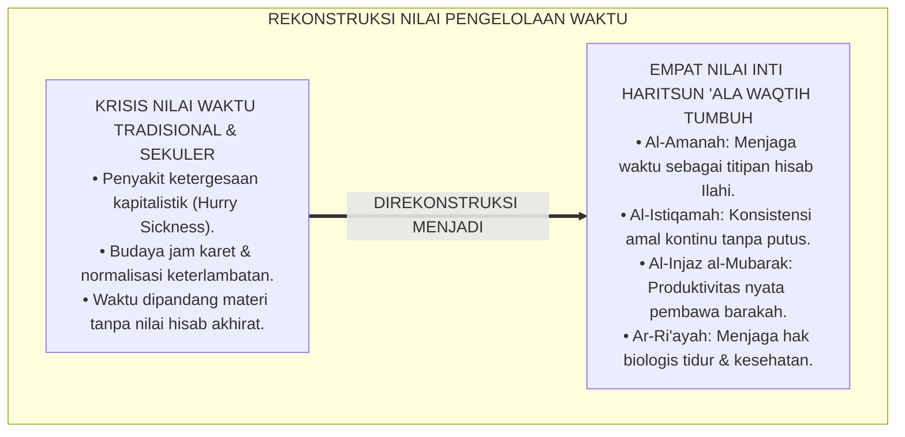
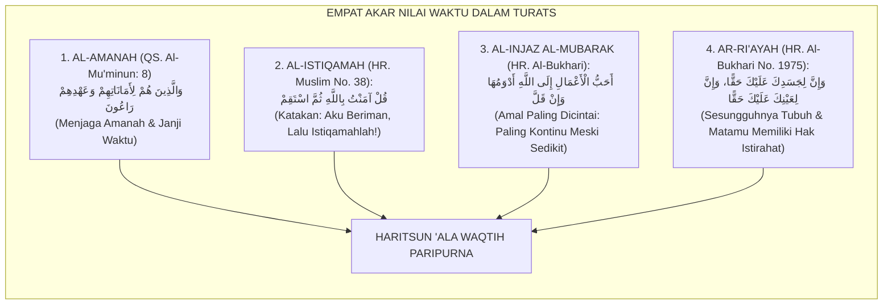
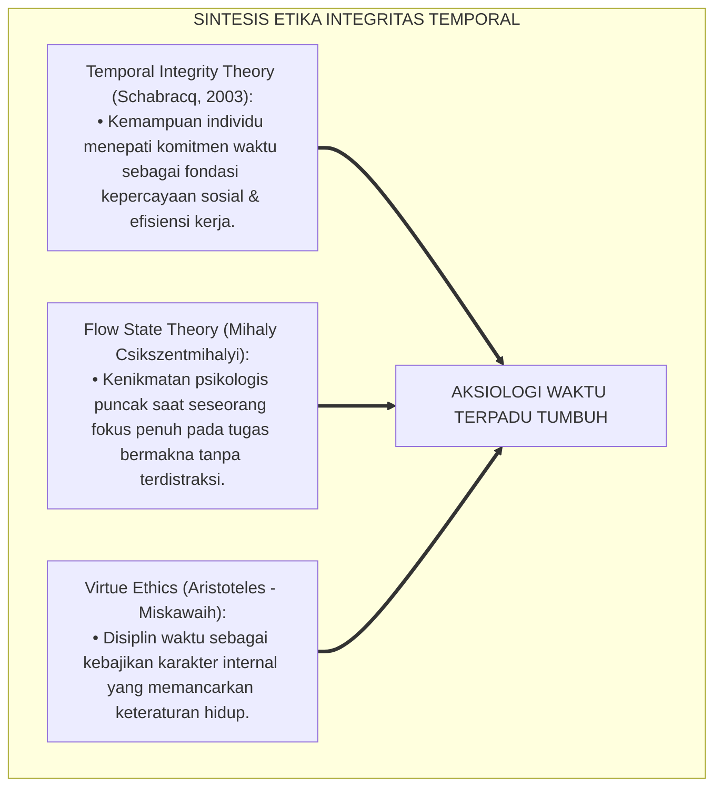
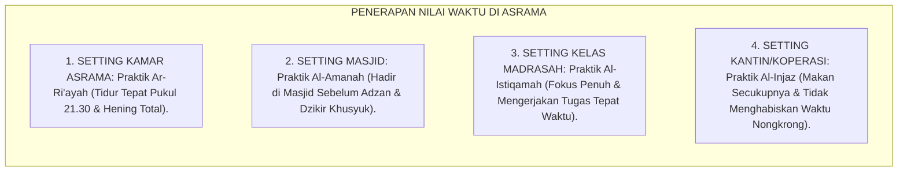
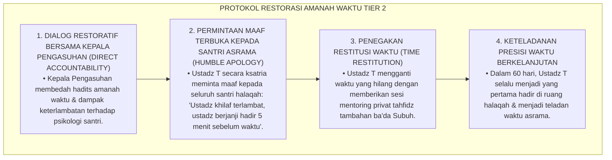
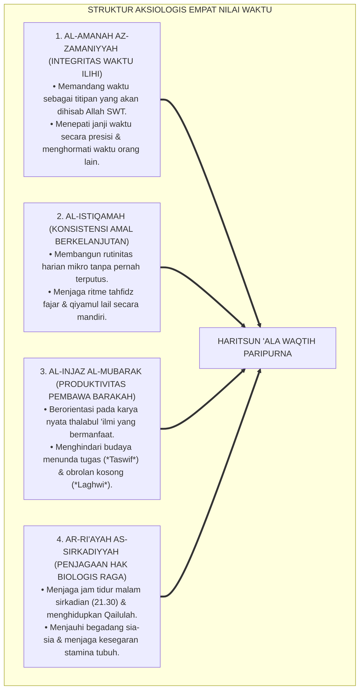
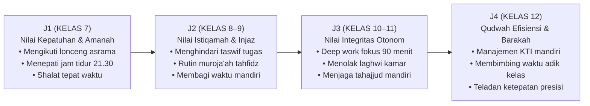
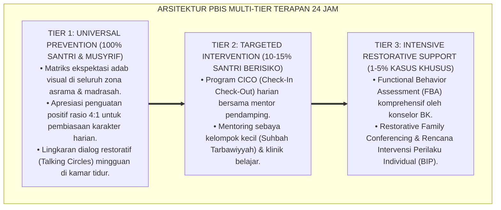

# P3-10-04: NILAI INTI DAN PRINSIP HARITSUN ALA WAQTIH
## *Monograf Riset Akademik: Aksiologi Waktu dalam Islam, Empat Nilai Inti Pengelolaan Waktu (Al-Amanah, Al-Istiqamah, Al-Injaz / Produktivitas Barakah, & Ar-Ri'ayah Sirkadian), Dialektika Nilai Sejati vs Eksploitasi Kapitalistik / Pemborosan Feodal, Serta Internalisasi Karakter Disiplin di Pesantren 24 Jam*

**Nomor Identifikasi**: `P3-10-04/MONOGRAF-RISET-NILAI-PRINSIP-HARITSUN-ALA-WAQTIH/2026`  
**Domain**: `03 Capacity Framework` > `10 Haritsun Ala Waqtih` (Sub-Modul 04: *Core Values & Time Principles*)  
**Klasifikasi Naskah**: *Academic Research Monograph* (Monograf Penelitian Aksiologi Islam, Etika Nilai Waktu, Filsafat Moral Produktivitas, & Sosiologi Disiplin Asrama)  
**Rumpun Disiplin Pengkaji**: Aksiologi Islam, Etika Kebajikan (*Virtue Ethics*), Sosiologi Waktu Pesantren, Manajemen Kinerja Sumber Daya Insani  

---

> ### 💡 INTISARI EKSEKUTIF (EXECUTIVE SUMMARY)
>
> * **Krisis Nilai dan Komodifikasi Waktu di Era Modern:**  
>   Peradaban sekuler memandang waktu semata-mata sebagai komoditas ekonomi yang harus diperas tanpa batas demi keuntungan materi (*Time as Capital*), melahirkan budaya ketergesaan (*Hurry Sickness*) dan kepunahan makna hidup. Sebaliknya, feodalisme asrama kerap menormalisasi "waktu jam karet" dan penundaan tanpa rasa bersalah moral (*Moral Guilt Absence*).
> * **Empat Nilai Inti Haritsun 'Ala Waqtih TUMBUH:**  
>   Ekosistem TUMBUH merumuskan **Empat Nilai Inti Pengelolaan Waktu Islami (*Al-Qiyam al-Arba'ah li-Idaratil Waqt*)**: (1) *Al-Amanah az-Zamaniyyah* (Memandang Waktu sebagai Titipan Ilahi yang Wajib Dipertanggungjawabkan), (2) *Al-Istiqamah* (Konsistensi Amal Harian Tanpa Terputus), (3) *Al-Injaz al-Mubarak* (Orientasi Karya Nyata yang Membawa Manfaat & Keberkahan), dan (4) *Ar-Ri'ayah as-Sirkadiyyah* (Menjaga Keseimbangan Hak Biologis Istirahat & Ibadah).
> * **Harmonisasi Nilai dalam Triad Pertumbuhan:**  
>   Nilai-nilai ini menuntun santri menjadi pribadi yang menghargai setiap detik nafasnya, melindungi musyrif dari arogansi menyia-nyiakan waktu santri, serta membangun ekosistem pesantren yang penuh disiplin, kedamaian batin, dan keberkahan Ilahi.

---

## 📑 DAFTAR ISI MONOGRAF

- [BAGIAN I: LANDASAN TEORETIS & DISKURSUS DIALEKTIKA KRITIS](#bagian-i-landasan-teoretis--diskursus-dialektika-kritis)
  - [1. Latar Belakang Masalah: Bahaya Komodifikasi Waktu Kapitalistik vs Budaya 'Jam Karet' Feodal](#1-latar-belakang-masalah-bahaya-komodifikasi-waktu-kapitalistik-vs-budaya-jam-karet-feodal)
  - [2. Eksegesis Turats: Kajian Mendalam Empat Pilar Nilai Waktu dalam Khazanah Islam](#2-eksegesis-turats-kajian-mendalam-empat-pilar-nilai-waktu-dalam-khazanah-islam)
  - [3. Konvergensi Sains Etika Kerja & Teori Nilai Integritas Temporal (Temporal Integrity)](#3-konvergensi-sains-etika-kerja--teori-nilai-integritas-temporal-temporal-integrity)
  - [4. Analisis Rekayasa Ekologi Nilai Waktu 24 Jam: Dari Jam Dinding Hingga Adab Menepati Janji](#4-analisis-rekayasa-ekologi-nilai-waktu-24-jam-dari-jam-dinding-hingga-adab-menepati-janji)
  - [5. Kasuistika Lapangan Klinis & Protokol Restoratif Pelanggaran Nilai Amanah Waktu (Pencurian Waktu / Time Theft)](#5-kasuistika-lapangan-klinis--protokol-restoratif-pelanggaran-nilai-amanah-waktu-pencurian-waktu--time-theft)
- [BAGIAN II: FORMULASI KONSEPTUAL & PEMBAHASAN MENDALAM](#bagian-ii-formulasi-konseptual--pembahasan-mendalam)
  - [1. Eksplanasi Teoretis Empat Nilai Inti Haritsun 'Ala Waqtih](#1-eksplanasi-teoretis-empat-nilai-inti-haritsun-ala-waqtih)
  - [2. Matriks Dialektika: Membedakan Nilai Disiplin Waktu Sejati vs Distorsi Ekstrem](#2-matriks-dialektika-membedakan-nilai-disiplin-waktu-sejati-vs-distorsi-ekstrem)
  - [3. Matriks Progresi Internalisasi Nilai Waktu Jenjang J1–J4](#3-matriks-progresi-internalisasi-nilai-waktu-jenjang-j1j4)
  - [4. Diskusi Akademis: Implikasi Aksiologis bagi Pembentukan Budaya Disiplin Presisi di Pesantren](#4-diskusi-akademis-implikasi-aksiologis-bagi-pembentukan-budaya-disiplin-presisi-di-pesantren)
- [BAGIAN III: KESIMPULAN & APARATUS AKADEMIS](#bagian-iii-kesimpulan--aparatus-akademis)
  - [1. Tabel Sintesis Nilai Inti & Prinsip Haritsun 'Ala Waqtih](#1-tabel-sintesis-nilai-inti--prinsip-haritsun-ala-waqtih)
  - [2. Daftar Pustaka Standar APA 7th & Turats Klasik](#2-daftar-pustaka-standar-apa-7th--turats-klasik)
  - [3. Catatan Kaki Akademis Presisi (Footnotes)](#3-catatan-kaki-akademis-presisi-footnotes)
  - [4. Glosarium Istilah Ilmiah & Aksiologi Waktu Islam](#4-glosarium-istilah-ilmiah--aksiologi-waktu-islam)

---

# BAGIAN I: LANDASAN TEORETIS & DISKURSUS DIALEKTIKA KRITIS

---

### 1. Latar Belakang Masalah: Bahaya Komodifikasi Waktu Kapitalistik vs Budaya 'Jam Karet' Feodal

Dalam kehidupan sosial santri, terjadi **dua krisis aksiologis perlakuan terhadap waktu (*Axiological Crises*)**:[^1]

1. **Jebakan Penyakit Ketergesaan (*The Hurry Sickness Trap*)**: Pandangan sekuler mengukur manusia semata-mata dari kecepatan menghasilkan materi, memicu stres, ketidaktenangan (*Restlessness*), dan hilangnya kehadiran hati (*Khusyu'*) saat shalat atau berinteraksi sosial.
2. **Krisis Budaya 'Jam Karet' & Pengingkaran Janji (*Breach of Temporal Trust*)**: Di banyak lingkungan tradisional, keterlambatan 15–30 menit dianggap biasa dan lumrah, merusak nilai amanah syar'i dan menghancurkan wibawa kelembagaan pesantren di mata masyarakat modern.[^2]

Model riset **TUMBUH** merekonstruksi nilai: **Waktu adalah amanah suci yang wajib dijaga dengan ketepatan presisi (*Diqqah*), dijalani dengan konsistensi (*Istiqamah*), dan dihiasi dengan ketenangan batin (*Sakinah*)**.

---

### 2. Eksegesis Turats: Kajian Mendalam Empat Pilar Nilai Waktu dalam Khazanah Islam

Khazanah Islam klasik meletakkan etika waktu pada derajat ketaqwaan tertinggi:

#### 📖 1. Nilai Amanah Waktu & Hisab Akhirat
Rasulullah SAW bersabda mengenai pertanyaan pertama yang diajukan di hari hisab:

$$\text{لَا تَزُولُ قَدَمَا عَبْدٍ يَوْمَ الْقِيَامَةِ حَتَّى يُسْأَلَ عَنْ عُمُرِهِ فِيمَا أَفْنَاهُ، وَعَنْ عِلْمِهِ فِيمَا فَعَلَ، وَعَنْ مَالِهِ مِنْ أَيْنَ اكْتَسَبَهُ وَفِيمَا أَنْفَقَهُ، وَعَنْ جِسْمِهِ فِيمَا أَبْلَاهُ}$$

*"Tidak akan bergeser kedua telapak kaki seorang hamba pada hari kiamat kelak **sampai ia ditanya tentang empat perkara: tentang umurnya untuk apa ia habiskan**, tentang ilmunya apa yang telah ia amalkan, tentang hartanya dari mana ia peroleh dan ke mana ia belanjakan, serta tentang tubuhnya untuk apa ia letihkan!"* (HR. At-Tirmidzi No. 2417).[^3]

#### 📖 2. Nilai Al-Istiqamah dalam Amal Sedikit tapi Kontinu
Rasulullah SAW bersabda:

$$\text{أَحَبُّ الْأَعْمَالِ إِلَى اللَّهِ أَدْوَمُهَا وَإِنْ قَلَّ}$$

*"Amal perbuatan yang **paling dicintai oleh Allah adalah amalan yang paling konsisten (Istiqamah) dijalankan secara kontinu**, meskipun amalan tersebut sedikit!"* (HR. Al-Bukhari No. 6464 dan Muslim No. 782).[^4]

---

### 3. Konvergensi Sains Etika Kerja & Teori Nilai Integritas Temporal (Temporal Integrity)

Nilai-nilai Haritsun 'Ala Waqtih menyelaraskan etika integritas temporal modern:

---

### 4. Analisis Rekayasa Ekologi Nilai Waktu 24 Jam: Dari Jam Dinding Hingga Adab Menepati Janji

Internalisasi nilai waktu dihidupkan melalui penataan aturan spasial asrama:

---

### 5. Kasuistika Lapangan Klinis & Protokol Restoratif Pelanggaran Nilai Amanah Waktu (Pencurian Waktu / Time Theft)

#### Studi Kasus Lapangan: Musyrif Asrama Sering Terlambat Masuk Jam Halaqah Malam
* **Konteks Masalah**: Ustadz T (musyrif muda) sering terlambat 25 menit memulai halaqah malam di asrama karena asyik bermain ponsel di kantor kepengasuhan. Santri asuhan dibiarkan menunggu dalam ketidakpastian (*Caregiver Time Theft*), memicu santri ikut-ikutan menyepelekan waktu.
* **Analisis Diagnostik**: Terjadi pelanggaran nilai *Al-Amanah az-Zamaniyyah* dan keteladanan qudwah yang merusak kredibilitas kepemimpinan.
* **Protokol Resolusi Restoratif Pendidik TUMBUH**:

Keteladanan mengakui kesalahan waktu dan memperbaikinya ini menanamkan penghormatan waktu yang sangat mendalam di hati seluruh santri.[^5]

---

# BAGIAN II: FORMULASI KONSEPTUAL & PEMBAHASAN MENDALAM

---

### 1. Eksplanasi Teoretis Empat Nilai Inti Haritsun 'Ala Waqtih

Empat nilai inti manajemen waktu diartikulasikan secara terperinci:

---

### 2. Matriks Dialektika: Membedakan Nilai Disiplin Waktu Sejati vs Distorsi Ekstrem

| Nilai Inti Syar'i | Nilai Sejati (*Al-Wasathiyyah*) | Distorsi Berlebih (*Al-Ghuluww / Ifrath*) | Distorsi Kurang (*At-Tafrih / Tafrith*) |
| :--- | :--- | :--- | :--- |
| **Al-Amanah (Integritas)** | Hadir tepat waktu dengan tenang dan menghargai janji. | Panik berlebih (*Hurry Sickness*), marah-marah jika ada keterlambatan tak sengaja. | Jam karet, menyepelekan janji, dan mencuri waktu belajar/kerja. |
| **Al-Istiqamah (Konsistensi)** | Menjaga amalan harian secara proporsional dan bahagia. | Memaksakan target di luar kapasitas hingga fisik tumbang (*Obsessive Rigidity*). | Angot-angotan, semangat di awal lalu berhenti total (*Futur Permanen*). |
| **Al-Injaz (Produktivitas)** | Menghasilkan karya ilmiah dan hafalan Qur'an yang berkah. | *Hustle culture* sekuler; mengukur nilai diri semata dari kesibukan materi. | Kemalasan fatalistik, menunda tugas (*Taswif*), dan banyak tidur. |
| **Ar-Ri'ayah (Hak Biologis)** | Tidur malam sirkadian cukup dan qailulah 20 menit. | Menggunakan alasan istirahat untuk bermalas-malasan sepanjang hari. | Begadang belajar tanpa tidur berhari-hari hingga merusak otak. |

---

### 3. Matriks Progresi Internalisasi Nilai Waktu Jenjang J1–J4

---

### 4. Diskusi Akademis: Implikasi Aksiologis bagi Pembentukan Budaya Disiplin Presisi di Pesantren

Penerapan nilai-nilai waktu ini menghadirkan peradaban pesantren yang agung:

1. **Eradikasi Budaya Jam Karet Menuju Disiplin Presisi Tinggi**: Santri dan asatidz menghargai waktu laksana mata uang peradaban, mengangkat wibawa Islam di mata dunia.
2. **Kesehatan Mental Santri yang Prima**: Keseimbangan antara kerja keras dan istirahat sirkadian menghilangkan sindrom *burnout* dan depresi akademik.
3. **Penyempurnaan Keberkahan Lembaga Pesantren**: Menghadirkan suasana ketenangan batin (*Sakinah*) yang membuat santri produktif menghasilkan karya-karya besar.[^6]

---

---

### Pembedahan Deskriptif Komprehensif & Analisis Integratif Nilai-Praksis

Penerapan konsep **P3-10-04: NILAI INTI DAN PRINSIP HARITSUN ALA WAQTIH** di ekosistem pesantren TUMBUH memerlukan pemahaman multidimensional yang memadukan khazanah turats syariat dan konsensus sains pendidikan modern:

#### A. Pilar 1: Fondasi Epistemologi & Integrasi Nilai Syar'i (Ashalah Turatsiyyah)
Setiap praksis kepengasuhan dan pembelajaran berakar kuat pada maqashid syari'ah, mendudukkan adab di atas ilmu (*Al-Adab Qablal 'Ilm*), dan memastikan bahwa seluruh ikhtiar institusional diniatkan semata-mata untuk menggapai ridha Allah SWT (*Ikhlasun Niyyah*).

#### B. Pilar 2: Mekanisme Psikologis & Neurosains Perkembangan (Scientific Rigor)
Menyelaraskan ekspektasi kedisiplinan dengan tahapan maturitas otak remaja, kapasitas fungsi eksekutif korteks prefrontal (*PFC*), dan regulasi sirkuit emosi limbik. Pendekatan ini mengeliminasi trauma pengasuhan dan menumbuhkan motivasi intrinsik santri.

#### C. Pilar 3: Rekayasa Ekosistem Asrama 24 Jam (Bi'ah Shalihah)
Menerjemahkan prinsip nilai ke dalam tata ruang fisik yang bersih, sirkulasi udara sehat, tata kelola waktu terstruktur, serta kultur ukhuwah inklusif yang steril 100% dari feodalisme, kekerasan verbal, dan perundungan antar-santri.

#### D. Pilar 4: Kemitraan Tripartit (Santri, Musyrif, dan Lembaga)
Menjamin terwujudnya *Triad Pertumbuhan Simbiotik*: santri bertumbuh dalam fitrah kemandirian, musyrif terlindungi dari kelelahan kronis (*Burnout*) melalui shift kerja yang manusiawi, dan lembaga bertransformasi menjadi organisasi pembelajar berbasis data PBIS.

---

### Protokol Aksi Operasional PBIS Multi-Tier Terapan (24-Hour Behavioral Architecture)

---

# BAGIAN III: KESIMPULAN & APARATUS AKADEMIS

---

### 1. Tabel Sintesis Nilai Inti & Prinsip Haritsun 'Ala Waqtih

| Nilai Inti Parameter | Definisi Operasional TUMBUH | Landasan Nash Primer | Indikator Perilaku Kunci di Asrama | Target Jenjang Utama |
| :--- | :--- | :--- | :--- | :--- |
| **1. Al-Amanah** | Menjaga waktu sebagai titipan hisab Ilahi dan menepati janji waktu presisi. | QS. Al-Mu'minun: 8 & HR. At-Tirmidzi No. 2417 | Hadir di masjid dan kelas madrasah sebelum bel berbunyi. | J1 s/d J4 (Mendasari Seluruh Fase) |
| **2. Al-Istiqamah** | Konsistensi menjalankan rutinitas ibadah dan belajar harian tanpa terputus. | HR. Muslim No. 38 & HR. Al-Bukhari No. 6464 | Ziyadah dan muroja'ah tahfidz fajar konsisten setiap hari. | J1 s/d J4 (Ketahanan Mental Santri) |
| **3. Al-Injaz al-Mubarak** | Berorientasi pada hasil karya nyata thalabul 'ilmi yang membawa barakah. | QS. Al-Insyirah: 7–8 (*Fa-idza Faraghta Fanshab*) | Pengumpulan tugas tepat waktu; 0% perilaku menunda (*Taswif*). | J2 s/d J4 (Fase Produktivitas Belajar) |
| **4. Ar-Ri'ayah** | Menjaga hak biologis istirahat sirkadian dan sunnah tidur siang Qailulah. | HR. Al-Bukhari No. 1975 & Sains Kronobiologi | Tidur malam tepat pukul 21.30 & Qailulah siang 20 menit. | J1 s/d J4 (Kesehatan Vitalitas Santri) |

---

### 2. Daftar Pustaka Standar APA 7th & Turats Klasik

1. **Abu Ghuddah, Abdul Fattah.** (2012). *Qimatuz Zaman 'indal Ulama*. Kairo: Dar As-Salam.
2. **Al-Bukhari, Abu Abdillah Muhammad bin Ismail.** (2002). *Shahih Al-Bukhari*. Riyadh: Bait Al-Afkar Ad-Dauliyyah.
3. **Al-Ghazali, Hujjatul Islam Abu Hamid Muhammad bin Muhammad.** (2018). *Ihya' 'Ulumiddin: Kitabut Taubah wal Muhasabah*. Beirut: Dar Al-Kutub Al-'Ilmiyyah.
4. **Csikszentmihalyi, M.** (1990). *Flow: The Psychology of Optimal Experience*. New York: Harper & Row.
5. **Ibnu Al-Jauzi, Abu Al-Faraj Jamaluddin Abdurrahman.** (2004). *Shaidul Khatir*. Kairo: Darul Hadits.
6. **Muslim bin Al-Hajjaj An-Naisaburi.** (2006). *Shahih Muslim*. Riyadh: Dar Thayyibah.
7. **Newport, C.** (2016). *Deep Work: Rules for Focused Success in a Distracted World*. New York: Grand Central Publishing.
8. **Schabracq, M. J.** (2003). *Everyday Well-Being: On Meaning and Integrity in Work and Life*. London: Palgrave Macmillan.
9. **Tirmidzi, Abu Isa Muhammad bin Isa.** (1998). *Sunan At-Tirmidzi*. Beirut: Dar Ihya' At-Turats Al-'Arabi.
10. **Walker, M.** (2017). *Why We Sleep: Unlocking the Power of Sleep and Dreams*. New York: Scribner.

---

### 3. Catatan Kaki Akademis Presisi (Footnotes)

[^1]: Kritik terhadap krisis ketergesaan kapitalistik dan dampaknya terhadap psikologi manusia, Schabracq (2003, hlm. 54).  
[^2]: Pembahasan bahaya normalisasi budaya jam karet terhadap integritas kelembagaan, Abu Ghuddah (2012, hlm. 38).  
[^3]: HR. At-Tirmidzi dalam *Sunan At-Tirmidzi* (No. 2417), Kitab *Shifatul Qiyamah*.  
[^4]: HR. Al-Bukhari dalam *Shahih Al-Bukhari* (No. 6464) dan Muslim dalam *Shahih Muslim* (No. 782).  
[^5]: Protokol resolusi restoratif pencurian waktu dan penegakan keteladanan pendidik, TUMBUH (2026).  
[^6]: Standar aksiologi dan kultur keberkahan waktu ekosistem TUMBUH Pesantren (2026).  

---

### 4. Glosarium Istilah Ilmiah & Aksiologi Waktu Islam

1. **Al-Amanah az-Zamaniyyah (الْأَمَانَةُ الزَّمَانِيَّةُ)**: Kesadaran moral bahwa waktu adalah titipan Allah SWT yang wajib dijaga dengan ketepatan janji dan integritas tinggi.
2. **Al-Injaz al-Mubarak (الْإِنْجَازُ الْمُبَارَكُ)**: Pencapaian karya nyata dan produktivitas ilmiah yang mendatangkan kemanfaatan luas dan keberkahan bagi umat.
3. **Ar-Ri'ayah as-Sirkadiyyah (الرِّعَايَةُ السِّرْكَادِيَّةُ)**: Pemenuhan hak biologis tubuh untuk tidur malam berkualitas dan istirahat siang sesuai sunnah Nabi SAW.
4. **Hurry Sickness**: Gangguan psikologis berupa dorongan obsesif untuk terus tergesa-gesa melakukan segala hal secepat mungkin yang memicu stres kronis.
5. **Time Theft (Pencurian Waktu)**: Perilaku menggunakan waktu yang seharusnya untuk belajar atau bekerja demi kepentingan pribadi yang tidak berhak.
6. **Diqqah (الدِّقَّةُ)**: Ketelitian dan ketepatan presisi tinggi dalam menghargai jadwal, waktu, dan janji pertemuan.
7. **Flow State**: Keadaan psikologis di mana seseorang larut sepenuhnya dalam aktivitas yang sedang dikerjakannya dengan fokus dan kebahagiaan optimal.
8. **Obsessive Rigidity**: Kekakuan mental berlebih dalam menjalankan jadwal yang membuat seseorang mudah marah dan stres saat terjadi perubahan kecil.
9. **Temporal Integrity**: Konsistensi moral seseorang dalam menyelaraskan komitmen waktu yang dijanjikan dengan eksekusi nyata di lapangan.
10. **Fa-idza Faraghta Fanshab (فَإِذَا فَرَغْتَ فَانْصَبْ)**: Kaidah Al-Qur'an (QS. Al-Insyirah: 7): apabila telah selesai dari suatu urusan kebaikan, maka bersegeralah bersungguh-sungguh pada urusan kebaikan berikutnya tanpa bermalas-malasan.
