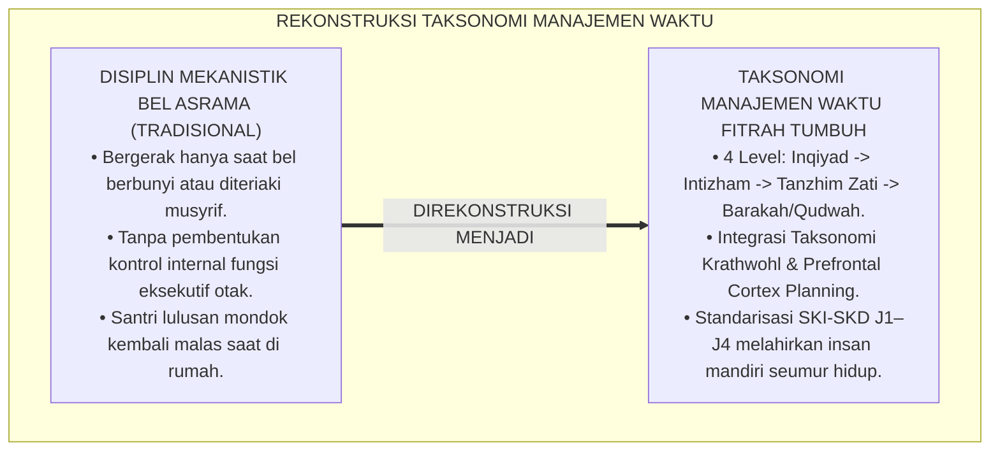
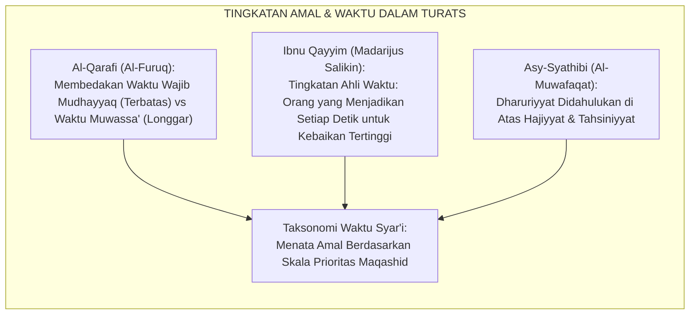
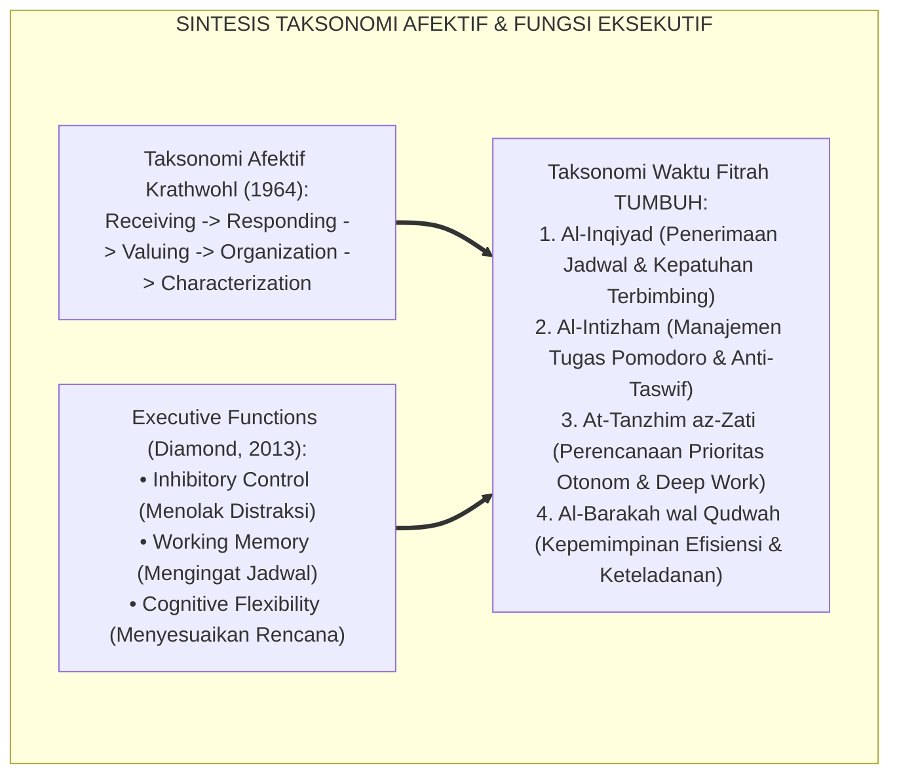
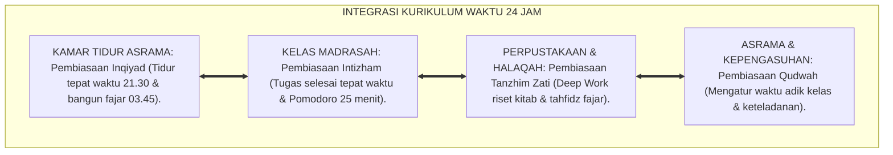
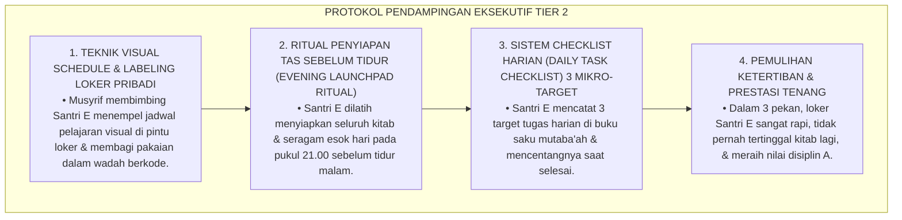
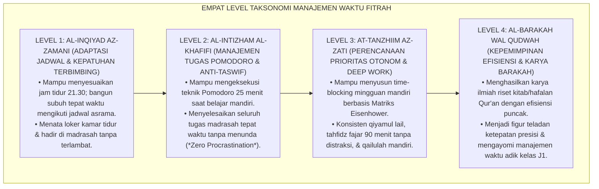
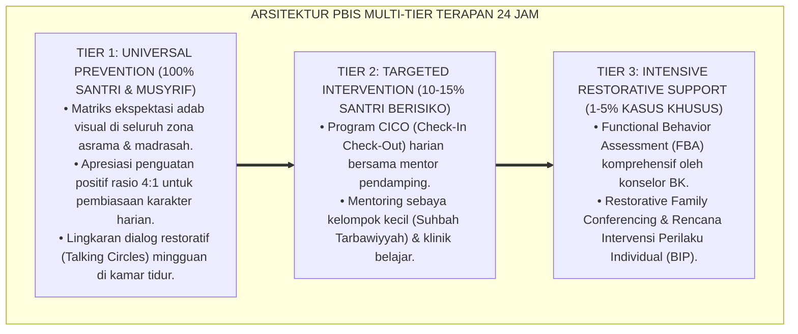

# P3-10-05: STANDAR KOMPETENSI DAN TAKSONOMI HARITSUN ALA WAQTIH
## *Monograf Riset Akademik: Taksonomi Kematangan Manajemen Waktu Berbasis Maratibul Injaz wal Intizham, Matriks Standar Kompetensi Inti dan Dasar (SKI-SKD Pengelolaan Waktu), Gradasi Empat Tingkat Keteraturan Hidup, Serta Penyelarasan Taksonomi Bloom-Krathwohl & Fungsi Eksekutif Otak dengan Jenjang J1–J4 di Pesantren 24 Jam*

**Nomor Identifikasi**: `P3-10-05/MONOGRAF-RISET-TAKSONOMI-HARITSUN-ALA-WAQTIH/2026`  
**Domain**: `03 Capacity Framework` > `10 Haritsun Ala Waqtih` (Sub-Modul 05: *Competency Standards & Taxonomy*)  
**Klasifikasi Naskah**: *Academic Research Monograph* (Monograf Penelitian Desain Kurikulum Waktu, Standarisasi Kompetensi Produktivitas, & Taksonomi Fungsi Eksekutif)  
**Rumpun Disiplin Pengkaji**: Desain Kurikulum Karakter Pesantren, Taksonomi Krathwohl & Bloom Revisi, Neurosains Fungsi Eksekutif, Manajemen Waktu Terapan  

---

> ### 💡 INTISARI EKSEKUTIF (EXECUTIVE SUMMARY)
>
> * **Ketiadaan Taksonomi Manajemen Waktu Terstandarisasi di Pesantren:**  
>   Evaluasi disiplin santri di madrasah dan asrama kerap bersifat simplistik: santri hanya dinilai dari absensi hadir atau terlambat. Tidak ada pemetaan taksonomi berjenjang apakah santri masih berada pada tingkat *Kepatuhan Terbimbing karena Bel Asrama (External Cueing)*, telah mampu *Merencanakan Waktu Mandiri (Autonomous Planning)*, atau telah mencapai tingkat *Master Produktivitas & Keteladanan Barakah (Exemplary Productivity)*.
> * **Taksonomi Manajemen Waktu Fitrah TUMBUH:**  
>   Ekosistem TUMBUH merumuskan **Taksonomi Kematangan Manajemen Waktu (*Maratibul Injaz wal Intizham*)** yang memadukan 4 tingkat kematangan eksekutif: (1) *Level 1: Al-Inqiyad az-Zamani (Adaptasi Jadwal & Kepatuhan Terbimbing)*, (2) *Level 2: Al-Intizham al-Khafifi (Manajemen Tugas, Pomodoro, & Anti-Taswif)*, (3) *Level 3: At-Tanzhim az-Zati (Perencanaan Prioritas Otonom, Deep Work, & Qailulah Mandiri)*, dan (4) *Level 4: Al-Barakah wal Qudwah (Kepemimpinan Efisiensi, Karya Peradaban, & Keteladanan Barakah)*.
> * **Standardisasi SKI-SKD Jenjang J1–J4:**  
>   Monograf ini memetakan Standar Kompetensi Inti (SKI) dan Standar Kompetensi Dasar (SKD) untuk setiap jenjang kemandirian (J1 s/d J4, Kelas 7 s/d 12), menjamin bahwa setiap lulusan pesantren menguasai seni mengelola modal umur dengan efisiensi tinggi, bebas prokrastinasi, dan berakar pada nilai-nilai ibadah.

---

## 📑 DAFTAR ISI MONOGRAF

- [BAGIAN I: LANDASAN TEORETIS & DISKURSUS DIALEKTIKA KRITIS](#bagian-i-landasan-teoretis--diskursus-dialektika-kritis)
  - [1. Latar Belakang Masalah: Kegagalan Pembentukan Disiplin Tanpa Taksonomi Kematangan Waktu](#1-latar-belakang-masalah-kegagalan-pembentukan-disiplin-tanpa-taksonomi-kematangan-waktu)
  - [2. Eksegesis Turats: Konsep Maratibul Amal & Hifzhul Auqat dalam Khazanah Ushul Fiqh](#2-eksegesis-turats-konsep-maratibul-amal--hifzhul-auqat-dalam-khazanah-ushul-fiqh)
  - [3. Konvergensi Taksonomi Afektif Krathwohl & Teori Maturasi Fungsi Eksekutif Prefrontal Cortex](#3-konvergensi-taksonomi-afektif-krathwohl--teori-maturasi-fungsi-eksekutif-prefrontal-cortex)
  - [4. Analisis Rekayasa Kurikulum Waktu Terpadu 24 Jam: Dari Lonceng Asrama Menuju Disiplin Batin](#4-analisis-rekayasa-kurikulum-waktu-terpadu-24-jam-dari-lonceng-asrama-menuju-disiplin-batin)
  - [5. Kasuistika Lapangan Klinis & Protokol Pendampingan Santri Mengalami Defisit Perencanaan Eksekutif (Executive Dysfunction)](#5-kasuistika-lapangan-klinis--protokol-pendampingan-santri-mengalami-defisit-perencanaan-eksekutif-executive-dysfunction)
- [BAGIAN II: FORMULASI KONSEPTUAL & PEMBAHASAN MENDALAM](#bagian-ii-formulasi-konseptual--pembahasan-mendalam)
  - [1. Eksplanasi Teoretis Taksonomi Kematangan Waktu TUMBUH](#1-eksplanasi-teoretis-taksonomi-kematangan-waktu-tumbuh)
  - [2. Matriks Standar Kompetensi Inti dan Dasar (SKI-SKD) Haritsun 'Ala Waqtih](#2-matriks-standar-kompetensi-inti-dan-dasar-ski-skd-haritsun-ala-waqtih)
  - [3. Matriks Gradasi Taksonomi 4 Level Lintas Jenjang J1–J4](#3-matriks-gradasi-taksonomi-4-level-lintas-jenjang-j1j4)
  - [4. Diskusi Akademis & Implikasi bagi Standarisasi Kelulusan Manajemen Waktu Santri](#4-diskusi-akademis--implikasi-bagi-standarisasi-kelulusan-manajemen-waktu-santri)
- [BAGIAN III: KESIMPULAN & APARATUS AKADEMIS](#bagian-iii-kesimpulan--aparatus-akademis)
  - [1. Tabel Sintesis Standar Kompetensi & Taksonomi Haritsun 'Ala Waqtih](#1-tabel-sintesis-standar-kompetensi--taksonomi-haritsun-ala-waqtih)
  - [2. Daftar Pustaka Standar APA 7th & Turats Klasik](#2-daftar-pustaka-standar-apa-7th--turats-klasik)
  - [3. Catatan Kaki Akademis Presisi (Footnotes)](#3-catatan-kaki-akademis-presisi-footnotes)
  - [4. Glosarium Istilah Ilmiah & Taksonomi Waktu](#4-glosarium-istilah-ilmiah--taksonomi-waktu)

---

# BAGIAN I: LANDASAN TEORETIS & DISKURSUS DIALEKTIKA KRITIS

---

### 1. Latar Belakang Masalah: Kegagalan Pembentukan Disiplin Tanpa Taksonomi Kematangan Waktu

Dalam evaluasi kepengasuhan pesantren konvensional, pembinaan disiplin waktu kerap mengalami **tiga kebuntuan taksonomis (*Taxonomic Deadlocks*)**:[^1]

1. **Jebakan Ketergantungan Pengawasan Eksternal (*External Cueing Dependency*)**: Santri hanya bergerak saat lonceng berbunyi atau saat musyrif berteriak membawa tongkat. Begitu liburan di rumah atau setelah lulus mondok, pola hidup santri kembali berantakan karena tidak pernah terbentuk fungsi kontrol internal (*Internalized Self-Regulation*).
2. **Ketiadaan Gradasi Keterampilan Perencanaan Temporal**: Santri kelas 7 dan kelas 12 ditargetkan rutinitas mekanistik yang sama, tanpa melatih santri senior cara merancang agenda riset mandiri, membagi waktu khidmah, dan mengelola skala prioritas.
3. **Pengabaian Aspek Kognisi Metakognitif Waktu**: Tidak ada pembelajaran mengenai bagaimana mengatasi distraksi siber, bagaimana teknik Pomodoro bekerja, dan bagaimana mengoptimalkan jendela kognitif fajar (*Dawn Cognitive Window*).[^2]

Model riset **TUMBUH** merancang **Taksonomi Kematangan Waktu Fitrah (*Maratibul Injaz wal Intizham*)** yang membimbing evolusi santri dari kepatuhan terbimbing menuju kemandirian produktivitas penuh berkah.

---

### 2. Eksegesis Turats: Konsep Maratibul Amal & Hifzhul Auqat dalam Khazanah Ushul Fiqh

Para ulama ushul fiqh dan tasawuf menyusun tingkatan amal (*Maratibul A'mal*) berdasarkan tingkat keutamaan waktu dan urgensi syariat (*Fiqh al-Aulawiyyat*).

#### 📖 Formulasi Al-Imam Al-Qarafi tentang Fiqh Waktu
Al-Imam **Al-Qarafi** dalam *Al-Furuq* menjelaskan hierarki waktu syariat:

$$\text{إِنَّ تَقْدِيمَ الْأَهَمِّ عَلَى الْمُهِمِّ وَاجِبٌ شَرْعًا وَعَقْلًا؛ وَالْأَوْقَاتُ الْمُضَيَّقَةُ تُقَدَّمُ عَلَى الْأَوْقَاتِ الْمُوَسَّعَةِ؛ فَمَنْ قَدَّمَ النَّفْلَ عَلَى الْفَرْضِ فِي ضِيقِ الْوَقْتِ، فَقَدْ جَهِلَ مَرَاتِبَ الْأَعْمَالِ وَأَضَاعَ رَأْسَ مَالِهِ}$$

*"Sesungguhnya **mendahulukan perkara yang paling penting (Al-Ahamm) di atas perkara yang penting (Al-Muhimm) adalah wajib menurut syariat dan akal**; dan waktu-waktu yang sempit (*Al-Mudhayyaq*) wajib didahulukan di atas waktu-waktu yang longgar (*Al-Muwassa'*). Maka barangsiapa yang mendahulukan amalan sunnah di atas amalan wajib saat waktu sempit, **sungguh ia telah bodoh terhadap tingkatan-tingkatan amal (Marātibul A'māl)** dan telah menyia-nyiakan modal utamanya!"*[^3]

---

### 3. Konvergensi Taksonomi Afektif Krathwohl & Teori Maturasi Fungsi Eksekutif Prefrontal Cortex

Standar kompetensi Haritsun 'Ala Waqtih memadukan Taksonomi Afektif Krathwohl dan neurosains maturasi fungsi eksekutif:

---

### 4. Analisis Rekayasa Kurikulum Waktu Terpadu 24 Jam: Dari Lonceng Asrama Menuju Disiplin Batin

Pembentukan kompetensi waktu santri diintegrasikan ke dalam seluruh ekosistem pesantren:

---

### 5. Kasuistika Lapangan Klinis & Protokol Pendampingan Santri Mengalami Defisit Perencanaan Eksekutif (Executive Dysfunction)

#### Studi Kasus Lapangan: Santri J2 Mengalami Kekacauan Jadwal, Loker Berantakan, & Sering Ketinggalan Buku
* **Konteks Masalah**: Santri E (14 tahun, Jenjang J2) selalu panik setiap pagi, loker bajunya sangat berantakan, sering lupa membawa kitab ke kelas, dan tugas madrasahnya tercecer (*Executive Dysfunction / Chronic Disorganization*).
* **Analisis Diagnostik**: Santri E mengalami kelemahan pada fungsi *Working Memory* dan ketiadaan sistem penataan visual eksternal (*Lack of Visual Organization Scaffolding*).
* **Protokol Intervensi Keteraturan Eksekutif TUMBUH**:

Intervensi terstruktur ini membuktikan bahwa kekacauan eksekutif diatasi dengan sistem penataan visual dan pembiasaan ritual malam hari yang konsisten.[^4]

---

# BAGIAN II: FORMULASI KONSEPTUAL & PEMBAHASAN MENDALAM

---

### 1. Eksplanasi Teoretis Taksonomi Kematangan Waktu TUMBUH

Taksonomi Kematangan Manajemen Waktu dirumuskan dalam 4 level hierarkis komprehensif:

---

### 2. Matriks Standar Kompetensi Inti dan Dasar (SKI-SKD) Haritsun 'Ala Waqtih

#### Standar Kompetensi Inti (SKI):
* **SKI-1 (Sikap Spiritual-Hisab Waktu)**: Menghayati kesadaran teologis bahwa setiap detik waktu adalah modal umur titipan Ilahi yang wajib dipertanggungjawabkan di hadapan Allah SWT.
* **SKI-2 (Sikap Sosial-Presisi Temporal)**: Menampilkan integritas menepati janji waktu, menghargai waktu orang lain, dan mengeliminasi 100% budaya jam karet di lingkungan asrama.
* **SKI-3 (Kognitif-Teori Manajemen Waktu)**: Memahami konsep *Qimatuz Zaman*, Matriks Prioritas Eisenhower, sains ritme sirkadian, dan teknik *Deep Work*.
* **SKI-4 (Psikomotorik-Eksekusi Time-Blocking)**: Terampil merancang dan mengeksekusi blok waktu belajar, teknik Pomodoro, istirahat Qailulah, dan shalat awal waktu.

#### Matriks Standar Kompetensi Dasar (SKD) Berdasarkan 4 Pilar:

| Pilar Karakter | Kode SKD | Deskripsi Standar Kompetensi Dasar (SKD) |
| :--- | :--- | :--- |
| **Pilar 1: Disiplin Ibadah Awal Waktu** | **SKD-HW-1.1** **SKD-HW-1.2** **SKD-HW-1.3** | Menepati waktu hadir di masjid sebelum/saat adzan berkumandang untuk shalat berjamaah. Konsisten bangun shalat malam (Tahajjud) mandiri di sepertiga malam terakhir. Menjaga wirid dzikir pagi-petang (Al-Ma'tsurat) dan tilawah Al-Qur'an harian. |
| **Pilar 2: Pengorganisasian Belajar** | **SKD-HW-2.1** **SKD-HW-2.2** **SKD-HW-2.3** | Memecah target hafalan Al-Qur'an menjadi target mikro harian (*Atomic Chunking*). Menerapkan teknik Pomodoro (25 menit belajar + 5 menit istirahat) saat mengkaji pelajaran. Menyelesaikan 100% tugas madrasah tepat waktu tanpa menunda (*Zero Taswif*). |
| **Pilar 3: Keseimbangan Sirkadian** | **SKD-HW-3.1** **SKD-HW-3.2** **SKD-HW-3.3** | Menjaga jadwal tidur malam tepat waktu pukul 21.30 dengan adab hening total. Melaksanakan sunnah tidur siang (*Qailulah*) 20–30 menit untuk meregenerasi fokus otak. Menjaga kebersihan dan penataan loker kamar tidur secara mandiri setiap hari. |
| **Pilar 4: Imunitas Distraksi** | **SKD-HW-4.1** **SKD-HW-4.2** **SKD-HW-4.3** | Menolak ajakan mengobrol sia-sia (*Laghwi*) saat jam belajar dan jam istirahat malam. Mampu melakukan *Deep Work* (fokus intensif 90 menit) tanpa terdistraksi gawai. Mengalokasikan waktu luang untuk hal produktif (membaca kitab, olahraga, khidmah). |

---

### 3. Matriks Gradasi Taksonomi 4 Level Lintas Jenjang J1–J4

| Dimensi Pilar | Jenjang J1 (Kelas 7) *Level 1: Al-Inqiyad* | Jenjang J2 (Kelas 8–9) *Level 2: Al-Intizham* | Jenjang J3 (Kelas 10–11) *Level 3: At-Tanzhim Zati* | Jenjang J4 (Kelas 12) *Level 4: Al-Barakah/Qudwah* |
| :--- | :--- | :--- | :--- | :--- |
| **1. Disiplin Ibadah** | Bangun subuh terbimbing; shalat berjamaah tepat waktu di masjid. | Shalat berjamaah di shaf pertama; rutin shalat Dhuha & Rawatib. | Tahajjud mandiri 3x seminggu; muroja'ah tahfidz ba'da Maghrib-Isya. | Teladan qiyamul lail; memimpin tilawah fajar berkah; khusyuk stabil. |
| **2. Manajemen Belajar** | Mengikuti jadwal madrasah; merapikan loker sesuai jadwal pelajaran. | Menerapkan Pomodoro 25 menit; tugas selesai di hari yang sama. | Merancang time-blocking mingguan; deep work tahfidz fajar 90 menit. | Mengelola riset KTI mandiri; efisiensi belajar puncak; karya peradaban. |
| **3. Keseimbangan Sirkadian** | Adaptasi tidur 21.30 $\le 2\text{ pekan}$; tertib qailulah siang 20 menit. | Kualitas tidur prima; 0% mengantuk di kelas madrasah pagi hari. | Menjaga sleep hygiene mandiri; qailulah konsisten tanpa diawasi. | Ritme biologis sempurna; stamina fisik & ketajaman memori puncak. |
| **4. Imunitas Distraksi** | Menahan diri dari mengobrol larut malam; patuh jam hening asrama. | Menolak ajakan nongkrong sia-sia; mengatur waktu mencuci pakaian. | Imunitas mutlak dari distraksi siber; mengisi waktu luang dengan kitab. | Qudwah pemanfaatan waktu; membimbing manajemen waktu santri junior J1. |

---

### 4. Diskusi Akademis & Implikasi bagi Standarisasi Kelulusan Manajemen Waktu Santri

Penerapan taksonomi waktu fitrah menghadirkan standar mutu baru kelulusan pesantren:

1. **Sertifikasi Kemandirian Waktu Santri (*Temporal Autonomy Certification*)**: Kelulusan santri jenjang J4 mensyaratkan pencapaian skor minimal pada instrumen manajemen waktu dan penyelesaian KTI tepat waktu.
2. **Transformasi Budaya Pesantren Menuju Efisiensi Peradaban Modern**: Menghilangkan stigma pesantren lambat dan tidak tertib, membuktikan bahwa santri mampu bersaing secara global.
3. **Kaderisasi Pemimpin Bangsa Berintegritas Waktu Tinggi**: Melahirkan alumni yang memiliki etos kerja disiplin baja, jujur menepati janji, dan memancarkan keberkahan hidup di masyarakat.[^5]

---

---

### Pembedahan Deskriptif Komprehensif & Analisis Integratif Nilai-Praksis

Penerapan konsep **P3-10-05: STANDAR KOMPETENSI DAN TAKSONOMI HARITSUN ALA WAQTIH** di ekosistem pesantren berbasis sistem TUMBUH memerlukan pemahaman multidimensional yang memadukan khazanah turats syariat dan konsensus sains pendidikan modern:

#### A. Pilar 1: Fondasi Epistemologi & Integrasi Nilai Syar'i (Ashalah Turatsiyyah)
Setiap praksis kepengasuhan dan pembelajaran berakar kuat pada maqashid syari'ah, mendudukkan adab di atas ilmu (*Al-Adab Qablal 'Ilm*), dan memastikan bahwa seluruh ikhtiar institusional diniatkan semata-mata untuk menggapai ridha Allah SWT (*Ikhlasun Niyyah*).

#### B. Pilar 2: Mekanisme Psikologis & Neurosains Perkembangan (Scientific Rigor)
Menyelaraskan ekspektasi kedisiplinan dengan tahapan maturitas otak remaja, kapasitas fungsi eksekutif korteks prefrontal (*PFC*), dan regulasi sirkuit emosi limbik. Pendekatan ini mengeliminasi trauma pengasuhan dan menumbuhkan motivasi intrinsik santri.

#### C. Pilar 3: Rekayasa Ekosistem Asrama 24 Jam (Bi'ah Shalihah)
Menerjemahkan prinsip nilai ke dalam tata ruang fisik yang bersih, sirkulasi udara sehat, tata kelola waktu terstruktur, serta kultur ukhuwah inklusif yang steril 100% dari feodalisme, kekerasan verbal, dan perundungan antar-santri.

#### D. Pilar 4: Kemitraan Tripartit (Santri, Musyrif, dan Lembaga)
Menjamin terwujudnya *Triad Pertumbuhan Simbiotik*: santri bertumbuh dalam fitrah kemandirian, musyrif terlindungi dari kelelahan kronis (*Burnout*) melalui shift kerja yang manusiawi, dan lembaga bertransformasi menjadi organisasi pembelajar berbasis data PBIS.

---

### Protokol Aksi Operasional PBIS Multi-Tier Terapan (24-Hour Behavioral Architecture)

---

# BAGIAN III: KESIMPULAN & APARATUS AKADEMIS

---

### 1. Tabel Sintesis Standar Kompetensi & Taksonomi Haritsun 'Ala Waqtih

| Tingkat Taksonomi | Karakteristik Utama | Indikator Kinerja Teramati | Target Jenjang | Metode Evaluasi Utama |
| :--- | :--- | :--- | :--- | :--- |
| **Level 1: Al-Inqiyad az-Zamani** | Adaptasi jadwal, kepatuhan lonceng, & tidur 21.30. | Adaptasi sirkadian $\le 2\text{ pekan}$; tertib bangun subuh & madrasah. | Jenjang J1 (Kelas 7) | Logbook Mutaba'ah Harian & Observasi Musyrif Kamar. |
| **Level 2: Al-Intizham al-Khafifi** | Eksekusi Pomodoro, tugas tepat waktu, & anti-taswif. | 100% tugas madrasah tuntas; mencuci pakaian terjadwal rapi. | Jenjang J2 (Kelas 8–9) | Skala TMBS & Buku Catatan Pengumpulan Tugas Madrasah. |
| **Level 3: At-Tanzhim az-Zati** | Time-blocking mandiri, deep work 90 menit, & tahajjud. | Menyusun agenda mingguan; tahfidz mandiri; qailulah konsisten. | Jenjang J3 (Kelas 10–11) | Portofolio Time-Blocking & Jurnal Refleksi Waktu Batin. |
| **Level 4: Al-Barakah wal Qudwah** | Karya riset mandiri, kepemimpinan waktu, & qudwah. | Penyelesaian KTI tepat waktu; membimbing waktu adik kelas J1. | Jenjang J4 (Kelas 12) | Evaluasi Kinerja 360 Derajat & Sidang Akhir KTI Santri. |

---

### 2. Daftar Pustaka Standar APA 7th & Turats Klasik

1. **Abu Ghuddah, Abdul Fattah.** (2012). *Qimatuz Zaman 'indal Ulama*. Kairo: Dar As-Salam.
2. **Al-Ghazali, Hujjatul Islam Abu Hamid Muhammad bin Muhammad.** (2018). *Bidayatul Hidayah*. Beirut: Dar Al-Kutub Al-'Ilmiyyah.
3. **Al-Qarafi, Syihabuddin Ahmad bin Idris.** (1998). *Al-Furuq*. Beirut: Dar Al-Kutub Al-'Ilmiyyah.
4. **Diamond, A.** (2013). *Executive functions*. *Annual Review of Psychology*, 64, 135-168.
5. **Ibnu Qayyim Al-Jauziyyah, Syamsuddin Abu Abdillah Muhammad bin Abi Bakr.** (2011). *Madarijus Salikin*. Kairo: Dar Al-Hadits.
6. **Krathwohl, D. R., Bloom, B. S., & Masia, B. B.** (1964). *Taxonomy of Educational Objectives: Affective Domain*. New York: David McKay.
7. **Macan, T. M.** (1990). *Time management: Test of a process model*. *Journal of Applied Psychology*, 75(6), 760-768.
8. **Newport, C.** (2016). *Deep Work: Rules for Focused Success in a Distracted World*. New York: Grand Central Publishing.
9. **Sugai, G., & Horner, R. H.** (2020). *School-Wide Positive Behavioral Interventions and Supports*. *Journal of Positive Behavior Interventions*, 22(4), 203-211.
10. **Walker, M.** (2017). *Why We Sleep: Unlocking the Power of Sleep and Dreams*. New York: Scribner.

---

### 3. Catatan Kaki Akademis Presisi (Footnotes)

[^1]: Kritik terhadap ketiadaan taksonomi afektif-eksekutif dalam pembinaan disiplin sekolah berasrama, Diamond (2013, hlm. 142).  
[^2]: Pembahasan kelemahan pengawasan disiplin mekanistik bel asrama tanpa pembentukan kontrol internal, Macan (1990, hlm. 764).  
[^3]: Al-Qarafi, *Al-Furuq* (1998, Jilid 1, hlm. 184).  
[^4]: Protokol pendampingan defisit perencanaan eksekutif santri melalui sistem penataan visual, Diamond (2013, hlm. 156).  
[^5]: Standar kelulusan dan sertifikasi kemandirian waktu santri dalam sistem TUMBUH Pesantren (2026).  

---

### 4. Glosarium Istilah Ilmiah & Taksonomi Waktu

1. **Taksonomi Manajemen Waktu Fitrah**: Hierarki perkembangan kematangan pengaturan waktu dari kepatuhan terbimbing (Inqiyad) menuju perencanaan otonom dan kepemimpinan barakah (Qudwah).
2. **Al-Inqiyad az-Zamani (الِانْقِيَادُ الزَّمَانِيُّ)**: Tingkat taksonomi awal yang menekankan penyesuaian diri terhadap jadwal asrama dan kepatuhan terhadap bel kegiatan.
3. **Al-Intizham al-Khafifi (الِانْتِظَامُ الْخَفِيفُ)**: Tingkat taksonomi kedua di mana santri mampu mengeksekusi tugas madrasah tepat waktu menggunakan teknik Pomodoro.
4. **At-Tanzhim az-Zati (التَّنْظِيمُ الذَّاتِيُّ)**: Tingkat taksonomi ketiga di mana santri mampu merancang jadwal mingguan mandiri berbasis skala prioritas Matriks Eisenhower.
5. **Al-Barakah wal Qudwah (الْبَرَكَةُ وَالْقُدْوَةُ)**: Tingkat taksonomi puncak di mana santri menghasilkan karya ilmiah riset peradaban dan menjadi figur teladan ketepatan waktu.
6. **Executive Dysfunction**: Gangguan pada fungsi kognitif otak yang mengakibatkan seseorang kesulitan dalam merencanakan, mengorganisasi, dan menyelesaikan tugas.
7. **Evening Launchpad Ritual**: Kebiasaan rutin merapikan pakaian, buku, dan perlengkapan esok hari sebelum tidur malam guna mencegah kepanikan pagi hari.
8. **Inhibitory Control**: Kemampuan neurobiologis Prefrontal Cortex untuk menahan godaan distraksi dan mempertahankan fokus pada tugas utama.
9. **Standar Kompetensi Inti (SKI) Waktu**: Parameter kematangan kognitif, afektif, dan psikomotorik pengelolaan waktu yang wajib dicapai santri sepanjang pendidikan.
10. **Dawn Cognitive Window**: Jendela waktu emas ba'da Subuh di mana fungsi memori dan daya serap otak berada pada efisiensi kognitif tertinggi.
