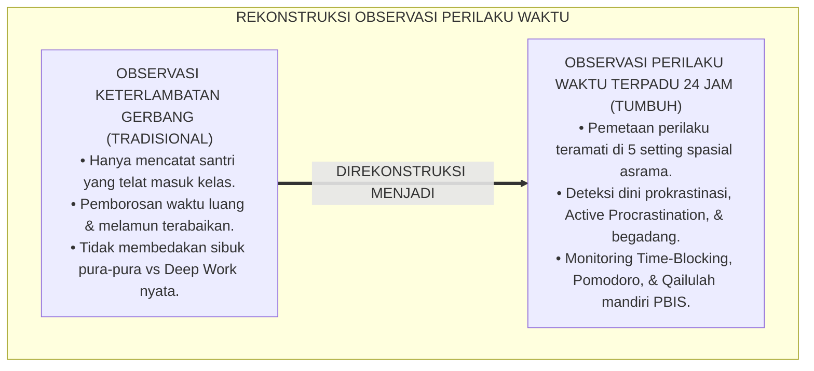
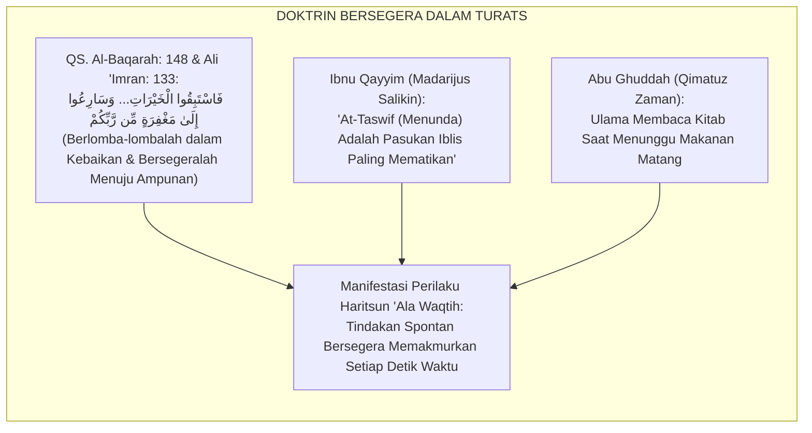
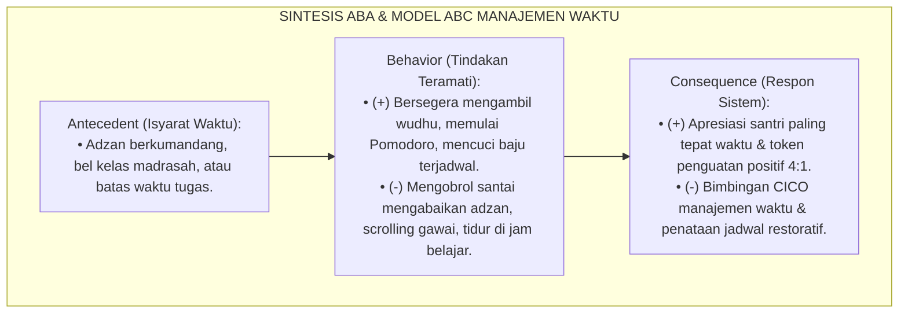
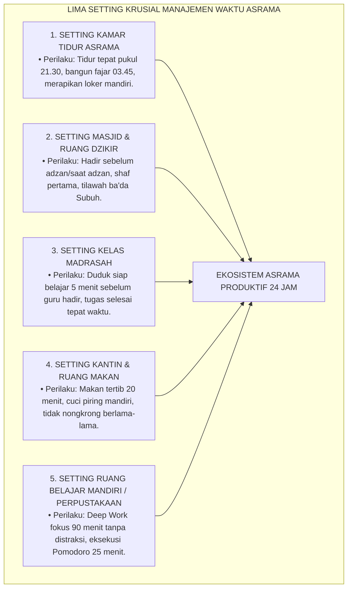
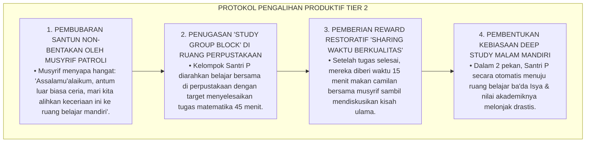
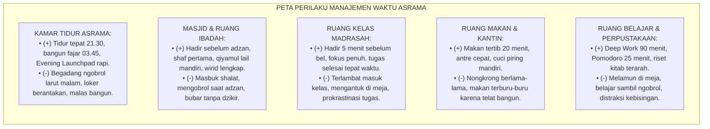
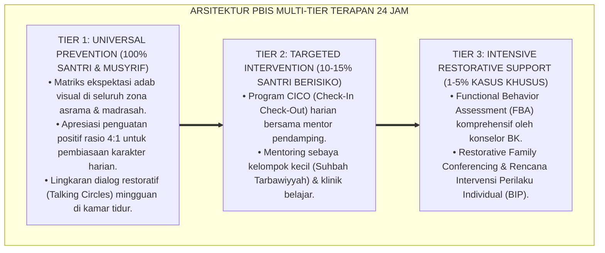

# P3-10-06: MANIFESTASI PERILAKU SANTRI HARITSUN ALA WAQTIH
## *Monograf Riset Akademik: Tipologi Indikator Perilaku Manajemen Waktu Teramati (Observable Time-Mastery Behaviors), Pemetaan Setting 24 Jam (Kamar Tidur Asrama, Masjid, Kelas Madrasah, Ruang Makan/Kantin, & Ruang Belajar Mandiri), Eliminasi Perilaku Defisit (Prokrastinasi, Terlambat Berjamaah, Begadang Liar), Serta Penguatan Budaya Disiplin Presisi di Pesantren TUMBUH*

**Nomor Identifikasi**: `P3-10-06/MONOGRAF-RISET-MANIFESTASI-PERILAKU-HARITSUN-ALA-WAQTIH/2026`  
**Domain**: `03 Capacity Framework` > `10 Haritsun Ala Waqtih` (Sub-Modul 06: *Behavioral Manifestations*)  
**Klasifikasi Naskah**: *Academic Research Monograph* (Monograf Penelitian Observasi Perilaku Temporal, Ekologi Jadwal Asrama, & Analitik Perilaku PBIS)  
**Rumpun Disiplin Pengkaji**: Analisis Perilaku Terapan (*Applied Behavior Analysis*), Sosiologi Interaksi Asrama, Psikologi Kognitif Produktivitas, Manajemen Disiplin Positif  

---

> ### 💡 INTISARI EKSEKUTIF (EXECUTIVE SUMMARY)
>
> * **Kelemahan Observasi Waktu yang Bersifat Reduksionis:**  
>   Pengawasan disiplin waktu di pesantren konvensional kerap hanya mencatat santri yang terlambat shalat atau terlambat masuk kelas secara reaktif (*Punctuality Binary*). Pengasuh tidak pernah memetakan indikator perilaku produktivitas mendalam, seperti bagaimana santri memanfaatkan 15 menit jeda antar-kegiatan, bagaimana santri mengatur pakaian di loker secara efisien, atau apakah santri melakukan penundaan tugas terselubung di kamar tidur.
> * **Katalog Manifestasi Perilaku Manajemen Waktu 24 Jam TUMBUH:**  
>   Ekosistem TUMBUH merumuskan **Katalog Manifestasi Perilaku Teramati (*Observable Time-Mastery Behavior Matrix*)** yang memetakan perilaku santri ke dalam dua kutub distingtif: *Indikator Perilaku Konstruktif-Produktif (Target Benchmark Efisiensi)* dan *Indikator Perilaku Defisit/Pemborosan (Target Intervensi PBIS)* di 5 setting utama kehidupan asrama 24 jam.
> * **Standardisasi Observasi & Budaya Disiplin Berkah:**  
>   Matriks ini menjadi instrumen praktis bagi musyrif asrama, guru madrasah, dan pengurus kamar untuk memantau, mendokumentasikan, dan memperkuat pembiasaan pemanfaatan waktu secara adil, objektif, dan terstandarisasi.

---

## 📑 DAFTAR ISI MONOGRAF

- [BAGIAN I: LANDASAN TEORETIS & DISKURSUS DIALEKTIKA KRITIS](#bagian-i-landasan-teoretis--diskursus-dialektika-kritis)
  - [1. Latar Belakang Masalah: Bahaya Titik Buta Perilaku Pemborosan Waktu Terselubung di Asrama](#1-latar-belakang-masalah-bahaya-titik-buta-perilaku-pemborosan-waktu-terselubung-di-asrama)
  - [2. Eksegesis Turats: Konsep Al-Mubadarah ilal Khairat & Larangan Menunda dalam Kitab Turats](#2-eksegesis-turats-konsep-al-mubadarah-ilal-khairat--larangan-menunda-dalam-kitab-turats)
  - [3. Konvergensi Sains Analisis Perilaku Terapan (ABA) & Model Antecedent-Behavior-Consequence](#3-konvergensi-sains-analisis-perilaku-terapan-aba--model-antecedent-behavior-consequence)
  - [4. Analisis Rekayasa Kausalitas Setting 24 Jam: Kamar Tidur, Masjid, Madrasah, & Kantin](#4-analisis-rekayasa-kausalitas-setting-24-jam-kamar-tidur-masjid-madrasah--kantin)
  - [5. Kasuistika Lapangan Klinis & Protokol De-eskalasi Santri Gemar 'Nongkrong Santai' Saat Jam Belajar Mandiri](#5-kasuistika-lapangan-klinis--protokol-de-eskalasi-santri-gemar-nongkrong-santai-saat-jam-belajar-mandiri)
- [BAGIAN II: FORMULASI KONSEPTUAL & PEMBAHASAN MENDALAM](#bagian-ii-formulasi-konseptual--pembahasan-mendalam)
  - [1. Katalog Manifestasi Perilaku Berdasarkan Empat Pilar Haritsun 'Ala Waqtih](#1-katalog-manifestasi-perilaku-berdasarkan-empat-pilar-haritsun-ala-waqtih)
  - [2. Pemetaan Matriks Perilaku Lintas Setting Spasial Asrama 24 Jam](#2-pemetaan-matriks-perilaku-lintas-setting-spasial-asrama-24-jam)
  - [3. Matriks Diferensiasi Perilaku Produktif vs Perilaku Defisit Berdasarkan Jenjang J1–J4](#3-matriks-diferensiasi-perilaku-produktif-vs-perilaku-defisit-berdasarkan-jenjang-j1j4)
  - [4. Diskusi Akademis & Implikasi bagi Penegakan Budaya Disiplin Presisi di Pesantren](#4-diskusi-akademis--implikasi-bagi-penegakan-budaya-disiplin-presisi-di-pesantren)
- [BAGIAN III: KESIMPULAN & APARATUS AKADEMIS](#bagian-iii-kesimpulan--aparatus-akademis)
  - [1. Tabel Sintesis Manifestasi Perilaku Haritsun 'Ala Waqtih](#1-tabel-sintesis-manifestasi-perilaku-haritsun-ala-waqtih)
  - [2. Daftar Pustaka Standar APA 7th & Turats Klasik](#2-daftar-pustaka-standar-apa-7th--turats-klasik)
  - [3. Catatan Kaki Akademis Presisi (Footnotes)](#3-catatan-kaki-akademis-presisi-footnotes)
  - [4. Glosarium Istilah Ilmiah & Observasi Perilaku Waktu](#4-glosarium-istilah-ilmiah--observasi-perilaku-waktu)

---

# BAGIAN I: LANDASAN TEORETIS & DISKURSUS DIALEKTIKA KRITIS

---

### 1. Latar Belakang Masalah: Bahaya Titik Buta Perilaku Pemborosan Waktu Terselubung di Asrama

Dalam pengasuhan asrama pesantren konvensional, evaluasi perilaku disiplin waktu kerap mengalami **tiga distorsi observasional (*Observational Blindspots*)**:[^1]

1. **Jebakan Pengawasan Pintu Gerbang Formal (*Gatekeeping Bias*)**: Musyrif hanya mencatat siapa yang telat masuk gerbang sekolah, sementara santri yang duduk melamun di pojok asrama selama 2 jam tanpa aktivitas tidak pernah ditegur atau dibimbing.
2. **Ketiadaan Pembedaan 'Sibuk Tanpa Hasil' vs 'Produktivitas Nyata'**: Santri yang terlihat mondar-mandir membawa buku kerap dianggap rajin, padahal ia sedang menghindari tugas berat (*Active Procrastination*).
3. **Pengabaian Manajemen Waktu Mandiri Malam Hari**: Waktu antara pukul 21.00–22.30 kerap menjadi zona abu-abu di mana santri menghabiskan waktu mengobrol tak berujung, memicu keterlambatan tidur dan kerusakan jam biologis fajar.[^2]

Model riset **TUMBUH** merancang sistem indikator perilaku waktu yang **konkret, teramati (*observable*), terukur, dan dipantau secara integratif sepanjang 24 jam**.

---

### 2. Eksegesis Turats: Konsep Al-Mubadarah ilal Khairat & Larangan Menunda dalam Kitab Turats

Al-Qur'an dan Sunnah menuntut seorang mukmin untuk bersegera (*Al-Mubadarah / As-Sabq*) dalam kebaikan dan melarang keras sikap menunda-nunda amal (*At-Taswif*).

#### 📖 Peringatan Al-Imam Ibnu Al-Qayyim tentang Bahaya Penundaan
Al-Imam **Ibnu Qayyim Al-Jauziyyah** menegaskan:

$$\text{إِيَّاكَ وَالتَّسْوِيفَ؛ فَإِنَّهُ جُنْدٌ مِنْ جُنُودِ إِبْلِيسَ عَظِيمٌ؛ وَمَا قَطَعَ النَّاسَ عَنْ خَيْرَاتِ الدُّنْيَا وَالْآخِرَةِ مِثْلُ قَوْلِهِمْ: سَوْفَ أَفْعَلُ، وَسَوْفَ أَتُوبُ، وَسَوْفَ أَجْتَهِدُ؛ فَإِنَّ الْمَوْتَ يَأْتِي بَغْتَةً}$$

*"Waspadalah engkau terhadap sikap menunda-nunda (*At-Taswif*); karena sesungguhnya **ia adalah salah satu bala tentara Iblis yang paling dahsyat**! Dan tidaklah ada sesuatu yang memutus manusia dari kebajikan dunia dan akhirat seperti ucapan mereka: **'Nanti aku akan lakukan, nanti aku akan bertaubat, nanti aku akan bersungguh-sungguh'**; karena sesungguhnya kematian datang secara tiba-tiba!"*[^3]

---

### 3. Konvergensi Sains Analisis Perilaku Terapan (ABA) & Model Antecedent-Behavior-Consequence

Pemantauan manifestasi perilaku waktu santri memadukan prinsip ABA dan Model ABC Kognitif:

---

### 4. Analisis Rekayasa Kausalitas Setting 24 Jam: Kamar Tidur, Masjid, Madrasah, & Kantin

Perilaku manajemen waktu santri dipantau secara konkret di 5 setting lingkungan fisik:

---

### 5. Kasuistika Lapangan Klinis & Protokol De-eskalasi Santri Gemar 'Nongkrong Santai' Saat Jam Belajar Mandiri

#### Studi Kasus Lapangan: Santri J2 Menghabiskan Waktu 2 Jam Ba'da Isya Mengobrol di Lorong Asrama
* **Konteks Masalah**: Santri P (14 tahun, Jenjang J2) bersama 3 temannya memiliki kebiasaan duduk mengobrol santai di lorong asrama setiap ba'da Isya (pukul 20.00–21.30) sambil makan camilan (*Chronic Loitering / Laghwi Habits*). Tugas madrasah dan setoran hafalannya selalu tertunda.
* **Analisis Diagnostik**: Santri P mengalami ketiadaan struktur aktivitas terarah (*Lack of Activity Structuring*) dan konformitas kelompok santai sebaya.
* **Protokol De-eskalasi & Pengalihan Produktif TUMBUH**:

Pendekatan ini membuktikan bahwa perilaku membuang waktu dialihkan secara bijak melalui pengalihan ruang dan tujuan belajar yang terstruktur.[^4]

---

# BAGIAN II: FORMULASI KONSEPTUAL & PEMBAHASAN MENDALAM

---

### 1. Katalog Manifestasi Perilaku Berdasarkan Empat Pilar Haritsun 'Ala Waqtih

Tabel berikut menyajikan pemetaan komparatif antara perilaku produktif teramati (*Target Benchmarks*) dan perilaku pemborosan waktu yang wajib diintervensi (*Deficit Indicators*):

| Pilar Haritsun 'Ala Waqtih | Manifestasi Perilaku Konstruktif-Produktif (*Target Benchmarks*) | Manifestasi Perilaku Defisit/Pemborosan (*Intervention Targets*) |
| :--- | :--- | :--- |
| **1. Disiplin Ibadah Awal Waktu** | • Hadir di masjid sebelum/tepat saat adzan berkumandang. • Menempati shaf pertama dan membaca Al-Qur'an sambil menunggu iqamah. • Bangun qiyamul lail (Tahajjud) mandiri pada pukul 03.45 tanpa diseret. • Membaca dzikir Al-Ma'tsurat pagi dan petang secara khusyuk dan tertib. • Menjaga shalat Dhuha dan shalat sunnah Rawatib secara rutin. | • Menunggu iqamah baru berjalan santai menuju masjid (masbuk shalat). • Mengobrol bercanda di serambi masjid saat adzan berkumandang. • Sangat sulit dibangunkan subuh; menarik selimut kembali setelah dibangunkan. • Langsung bubar ba'da shalat tanpa membaca wirid dan doa penutup. • Malas melaksanakan shalat sunnah dan shalat terburu-buru seperti ayam mematuk. |
| **2. Pengorganisasian Belajar Presisi** | • Menerapkan teknik Pomodoro (25 menit fokus penuh + 5 menit rehat). • Menyelesaikan tugas madrasah pada hari yang sama tugas diberikan (*Zero Taswif*). • Menyetorkan hafalan Al-Qur'an fajar secara konsisten dan tepat waktu. • Menata jadwal belajar mingguan mandiri di meja belajar/buku saku. • Melakukan review materi pelajaran 10 menit sebelum jam kelas dimulai. | • Menunda mengerjakan tugas hingga larut malam menjelang batas pengumpulan. • Menghafal Al-Qur'an terburu-buru 5 menit sebelum jam setoran dimulai. • Belajar sambil mengobrol, mendengarkan musik ilegal, atau melamun. • Sering ketinggalan buku pelajaran/kitab karena tidak disiapkan malam hari. • Pasrah tidak mengumpulkan tugas dengan alasan "lupa / tidak sempat". |
| **3. Keseimbangan Sirkadian** | • Menepati jam tidur malam tepat waktu pukul 21.30 dengan lampu redup. • Membaca doa tidur, adab bersuci sebelum tidur, dan tidak mengobrol di kasur. • Melaksanakan tidur siang sunnah Qailulah 20–30 menit secara tertib. • Menata pakaian dan buku di loker secara rapi dan cepat (efisiensi ruang-waktu). • Kebugaran fisik prima sepanjang hari (0% mengantuk di kelas pagi). | • Begadang mengobrol di kamar tidur hingga larut malam (pukul 23.00 ke atas). • Tidur larut malam untuk hal yang tidak berfaedah (bermain game/membaca komik). • Menolak tidur siang Qailulah dan memilih berkeliaran tanpa arah. • Loker pakaian sangat berantakan dan membutuhkan waktu lama mencari baju. • Tertidur pulas saat ustadz sedang menerangkan materi di kelas madrasah. |
| **4. Imunitas Distraksi & Laghwi** | • Mampu melakukan *Deep Work* (fokus intensif 90 menit) tanpa terdistraksi. • Mengalokasikan waktu istirahat sore untuk olahraga sunnah atau membaca kitab. • Mengatur jadwal mencuci pakaian tanpa menumpuk cucian kotor berhari-hari. • Berani menolak ajakan kawan untuk mengobrol sia-sia saat jam belajar. • Menepati janji pertemuan tepat menit (*High Punctuality Integrity*). | • Nongkrong berjam-jam di lorong asrama/kantin tanpa tujuan yang jelas. • Menumpuk pakaian kotor hingga berbau dan mencucinya berjam-jam saat jam belajar. • Mudah teralihkan perhatiannya oleh kebisingan kecil di sekitar ruang belajar. • Mengingkari janji waktu pertemuan dengan santri lain atau musyrif. • Menghabiskan waktu berjam-jam untuk bercermin dan merapikan penampilan berlebih. |

---

### 2. Pemetaan Matriks Perilaku Lintas Setting Spasial Asrama 24 Jam

---

### 3. Matriks Diferensiasi Perilaku Produktif vs Perilaku Defisit Berdasarkan Jenjang J1–J4

| Jenjang Pendidikan | Indikator Perilaku Konstruktif Utama (*Benchmark J1–J4*) | Indikator Perilaku Kritis yang Wajib Diintervensi |
| :--- | :--- | :--- |
| **Jenjang J1 (Kelas 7)** | • Menepati jadwal tidur 21.30 dan bangun subuh 03.45 tanpa menangis. • Menyiapkan buku dan seragam di loker sebelum tidur malam. • Mengikuti lonceng pergantian kegiatan asrama secara tertib. | • Mengobrol di kasur hingga larut malam; sangat sulit dibangunkan subuh. • Menunda mencuci piring dan baju hingga menumpuk di kamar mandi. • Ketinggalan kitab madrasah karena tidak disiapkan malam hari. |
| **Jenjang J2 (Kelas 8–9)** | • Menerapkan teknik Pomodoro (25-5 menit) saat mengerjakan tugas. • Mengumpulkan seluruh tugas madrasah di hari yang sama tugas diberikan. • Menjaga kehadiran shalat berjamaah di masjid tepat waktu. | • Menunda belajar hingga malam menjelang ujian (*Cramming/SKS*). • Nongkrong berjam-jam di lorong asrama saat jam belajar mandiri. • Menyerobot antrean kamar mandi karena bangun kesiangan. |
| **Jenjang J3 (Kelas 10–11)** | • Merancang jadwal *Time-Blocking* mingguan mandiri berbasis prioritas. • Melakukan *Deep Work* hafalan Al-Qur'an 90 menit fajar tanpa distraksi. • Bangun qiyamul lail (Tahajjud) mandiri 3x seminggu tanpa alarm. | • Menggunakan waktu luang untuk hal tidak produktif (*Laghwi* berlebih). • Menyelesaikan tugas secara asal-asalan demi cepat selesai. • Mengabaikan waktu istirahat siang Qailulah hingga kelelahan di malam hari. |
| **Jenjang J4 (Kelas 12)** | • Menjadi teladan (*Qudwah*) utama ketepatan waktu bagi seluruh santri. • Mengelola waktu penyusunan Karya Tulis Ilmiah (KTI) mandiri secara presisi. • Membimbing santri junior J1 dalam manajemen waktu belajar asrama. | • Merasa senior dan bebas melanggar jadwal tidur asrama. • Terlambat mengumpulkan draf karya tulis ilmiah akhir. • Memberi contoh buruk begadang dan bermalas-malasan kepada junior. |

---

### 4. Diskusi Akademis & Implikasi bagi Penegakan Budaya Disiplin Presisi di Pesantren

Penerapan katalog manifestasi perilaku Haritsun 'Ala Waqtih mentransformasikan kultur pesantren:

1. **Evolusi Disiplin Asrama: Dari 'Pengawasan Ketakutan' Menjadi 'Kesadaran Barakah'**: Santri bergerak tepat waktu bukan karena takut dihukum rotan, melainkan karena menghargai waktu sebagai modal ibadah.
2. **Optimalisasi Waktu Emas Pembelajaran (Golden Learning Hours)**: Setiap menit kehidupan di asrama termakmurkan secara optimal, melipatgandakan serapan ilmu santri.
3. **Penyempurnaan Ekosistem Kelembagaan yang Andal & Tertib**: Pesantren menjadi lingkungan yang sangat teratur, damai, dan memancarkan wibawa peradaban Islam kelas dunia.[^5]

---

---

### Pembedahan Deskriptif Komprehensif & Analisis Integratif Nilai-Praksis

Penerapan konsep **P3-10-06: MANIFESTASI PERILAKU SANTRI HARITSUN ALA WAQTIH** di ekosistem pesantren TUMBUH memerlukan pemahaman multidimensional yang memadukan khazanah turats syariat dan konsensus sains pendidikan modern:

#### A. Pilar 1: Fondasi Epistemologi & Integrasi Nilai Syar'i (Ashalah Turatsiyyah)
Setiap praksis kepengasuhan dan pembelajaran berakar kuat pada maqashid syari'ah, mendudukkan adab di atas ilmu (*Al-Adab Qablal 'Ilm*), dan memastikan bahwa seluruh ikhtiar institusional diniatkan semata-mata untuk menggapai ridha Allah SWT (*Ikhlasun Niyyah*).

#### B. Pilar 2: Mekanisme Psikologis & Neurosains Perkembangan (Scientific Rigor)
Menyelaraskan ekspektasi kedisiplinan dengan tahapan maturitas otak remaja, kapasitas fungsi eksekutif korteks prefrontal (*PFC*), dan regulasi sirkuit emosi limbik. Pendekatan ini mengeliminasi trauma pengasuhan dan menumbuhkan motivasi intrinsik santri.

#### C. Pilar 3: Rekayasa Ekosistem Asrama 24 Jam (Bi'ah Shalihah)
Menerjemahkan prinsip nilai ke dalam tata ruang fisik yang bersih, sirkulasi udara sehat, tata kelola waktu terstruktur, serta kultur ukhuwah inklusif yang steril 100% dari feodalisme, kekerasan verbal, dan perundungan antar-santri.

#### D. Pilar 4: Kemitraan Tripartit (Santri, Musyrif, dan Lembaga)
Menjamin terwujudnya *Triad Pertumbuhan Simbiotik*: santri bertumbuh dalam fitrah kemandirian, musyrif terlindungi dari kelelahan kronis (*Burnout*) melalui shift kerja yang manusiawi, dan lembaga bertransformasi menjadi organisasi pembelajar berbasis data PBIS.

---

### Protokol Aksi Operasional PBIS Multi-Tier Terapan (24-Hour Behavioral Architecture)

---

# BAGIAN III: KESIMPULAN & APARATUS AKADEMIS

---

### 1. Tabel Sintesis Manifestasi Perilaku Haritsun 'Ala Waqtih

| Setting Kehidupan 24 Jam | Tantangan Perilaku Kunci | Manifestasi Perilaku Diharapkan (TUMBUH) | Protokol Pengawasan Musyrif | Bukti Terukur Capaian |
| :--- | :--- | :--- | :--- | :--- |
| **1. Kamar Tidur Asrama** | Begadang ngobrol, malas bangun. | Tidur tepat 21.30, bangun fajar 03.45, loker rapi. | Patroli Jam Hening & Inspeksi Loker Pagi. | Kepatuhan jam tidur $\ge 98\%$; loker rapi terstandar. |
| **2. Masjid & Ruang Ibadah** | Masbuk shalat, bubar tanpa dzikir. | Hadir sebelum adzan, shaf pertama, qiyamul lail. | Absensi Kehadiran Shalat & Observasi Dzikir. | Kehadiran shalat subuh tepat waktu $\ge 98\%$. |
| **3. Kelas Madrasah** | Terlambat masuk, tugas menunda. | Hadir 5 menit awal, tugas selesai di hari yang sama. | Rekam Kehadiran Kelas & Buku Setoran Tugas. | 100% tugas madrasah terkumpul tepat waktu. |
| **4. Ruang Belajar Mandiri** | Melamun, distraksi kebisingan. | Deep Work 90 menit, eksekusi Pomodoro 25 menit. | Monitoring Jam Belajar & Evaluasi Target Harian. | Target hafalan fajar tercapai 100% sesuai target. |
| **5. Ruang Makan & Kantin** | Nongkrong sia-sia, makan lama. | Makan tertib 20 menit, cuci piring mandiri, qailulah. | Pengawasan Jam Makan & Penutupan Kantin Tertib. | Jam makan berjalan hening dan selesai tepat waktu. |

---

### 2. Daftar Pustaka Standar APA 7th & Turats Klasik

1. **Abu Ghuddah, Abdul Fattah.** (2012). *Qimatuz Zaman 'indal Ulama*. Kairo: Dar As-Salam.
2. **Al-Bukhari, Abu Abdillah Muhammad bin Ismail.** (2002). *Shahih Al-Bukhari*. Riyadh: Bait Al-Afkar Ad-Dauliyyah.
3. **Cooper, J. O., Heron, T. E., & Heward, W. L.** (2020). *Applied Behavior Analysis* (3rd ed.). Boston: Pearson.
4. **Covey, S. R.** (2004). *The 7 Habits of Highly Effective People*. New York: Free Press.
5. **Ibnu Qayyim Al-Jauziyyah, Syamsuddin Abu Abdillah Muhammad bin Abi Bakr.** (2011). *Madarijus Salikin*. Kairo: Dar Al-Hadits.
6. **Macan, T. M.** (1990). *Time management: Test of a process model*. *Journal of Applied Psychology*, 75(6), 760-768.
7. **Newport, C.** (2016). *Deep Work: Rules for Focused Success in a Distracted World*. New York: Grand Central Publishing.
8. **Steel, P.** (2007). *The nature of procrastination: A meta-analytic review*. *Psychological Bulletin*, 133(1), 65-94.
9. **Sugai, G., & Horner, R. H.** (2020). *School-Wide Positive Behavioral Interventions and Supports*. *Journal of Positive Behavior Interventions*, 22(4), 203-211.
10. **Walker, M.** (2017). *Why We Sleep: Unlocking the Power of Sleep and Dreams*. New York: Scribner.

---

### 3. Catatan Kaki Akademis Presisi (Footnotes)

[^1]: Kritik terhadap bias pengawasan waktu satu titik (gatekeeping) tanpa observasi produktivitas mendalam, Cooper, Heron, & Heward (2020, hlm. 256).  
[^2]: Pembahasan dampak buruk active procrastination dan pemborosan waktu malam hari di asrama, Steel (2007, hlm. 84).  
[^3]: Ibnu Qayyim Al-Jauziyyah, *Madarijus Salikin* (2011, Jilid 1, hlm. 142).  
[^4]: Protokol intervensi pengalihan perilaku pemborosan waktu santri menuju study group terstruktur, Sugai & Horner (2020, hlm. 210).  
[^5]: Dampak kelembagaan penerapan katalog manifestasi perilaku waktu TUMBUH Pesantren (2026).  

---

### 4. Glosarium Istilah Ilmiah & Observasi Perilaku Waktu

1. **Observable Time-Mastery Behaviors**: Tindakan nyata pengelolaan waktu, kedisiplinan jadwal, dan fokus belajar yang dapat diamati dan dihitung durasi serta ketepatan waktunya secara objektif.
2. **Al-Mubadarah ilal Khairat (الْمُبَادَرَةُ إِلَى الْخَيْرَاتِ)**: Sikap proaktif bersegera melaksanakan amal kebajikan dan tugas ilmiah tanpa menunda-nunda waktu.
3. **Active Procrastination**: Perilaku menunda tugas utama dengan menyibukkan diri pada aktivitas lain yang tampak berguna (seperti merapikan buku padahal harus belajar ujian).
4. **Chronic Loitering (Nongkrong Kronis)**: Kebiasaan berdiam diri atau mengobrol tanpa tujuan di area publik asrama yang menghabiskan waktu produktif santri.
5. **Study Group Block**: Sesi belajar kelompok terarah di perpustakaan/ruang belajar yang diawasi musyrif dengan target output tugas yang jelas.
6. **Evening Launchpad**: Ritual malam hari santri merapikan kitab, seragam, dan perlengkapan esok hari sebelum tidur guna menjamin pagi hari yang tenang.
7. **Punctuality Binary**: Kesalahan evaluasi disiplin yang hanya membagi santri menjadi "hadir atau terlambat" tanpa memotret kualitas penggunaan waktu.
8. **Shaf Pertama Presisi**: Standar perilaku santri yang hadir di masjid 5–10 menit sebelum adzan dan menempati barisan shalat terdepan secara istiqamah.
9. **Zero-Taswif Commitment**: Komitmen santri untuk menyelesaikan tugas madrasah dan setoran tahfidz pada hari tugas tersebut diberikan.
10. **Time-Wasting Elimination**: Program kelembagaan pesantren untuk mengidentifikasi dan menghapus seluruh celah waktu menganggur tak terstruktur dalam jadwal 24 jam.
