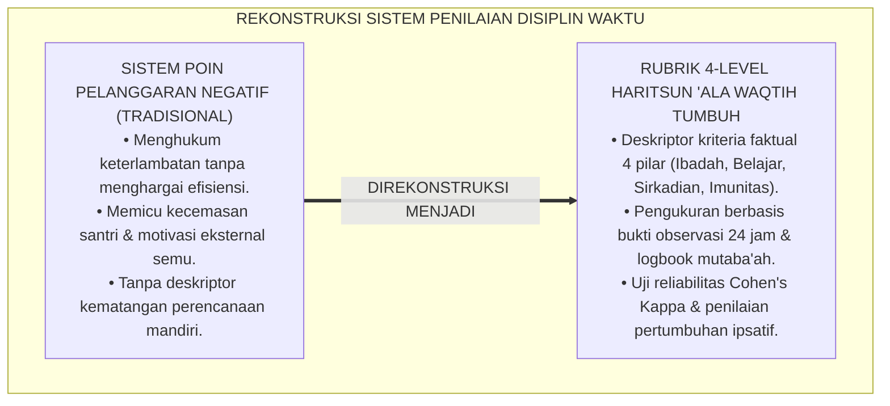
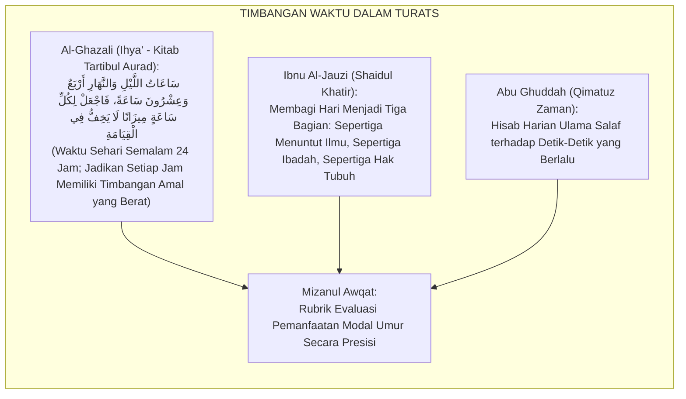
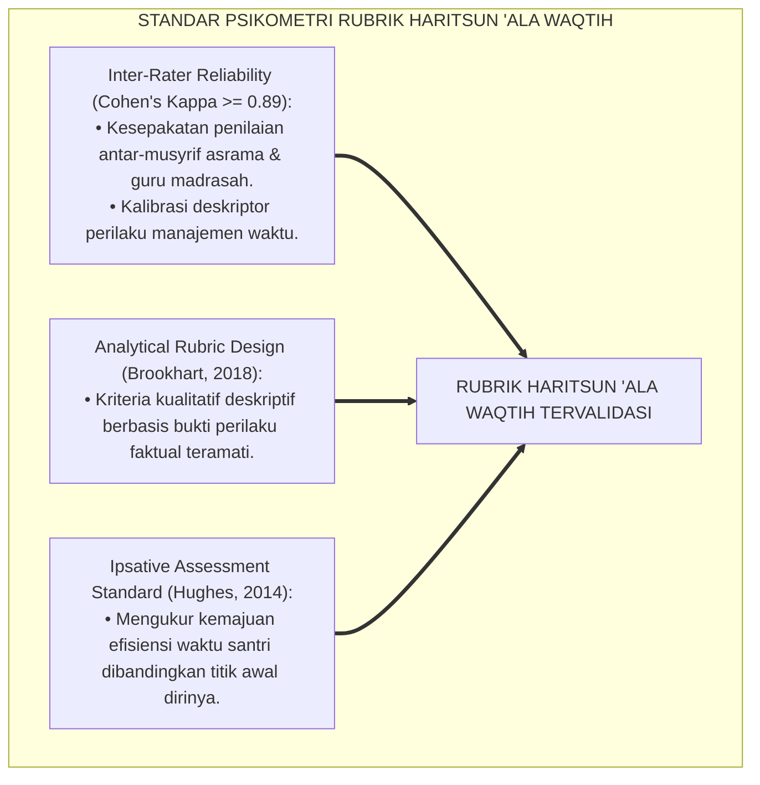
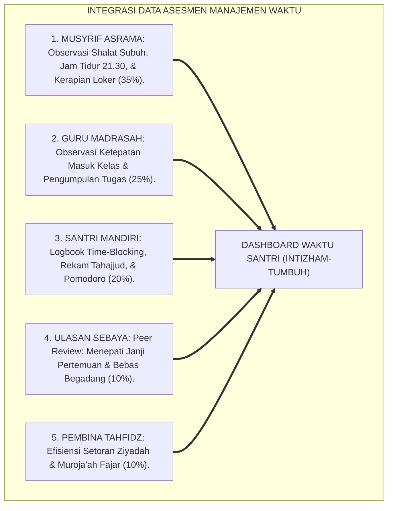
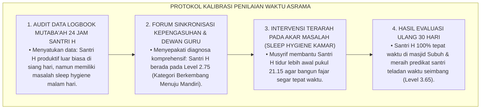
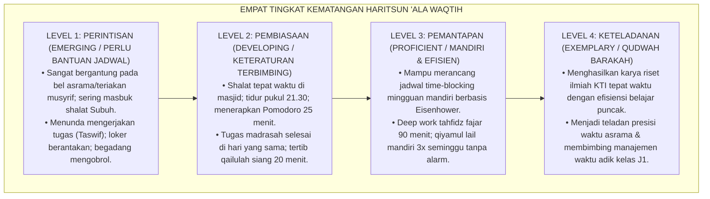
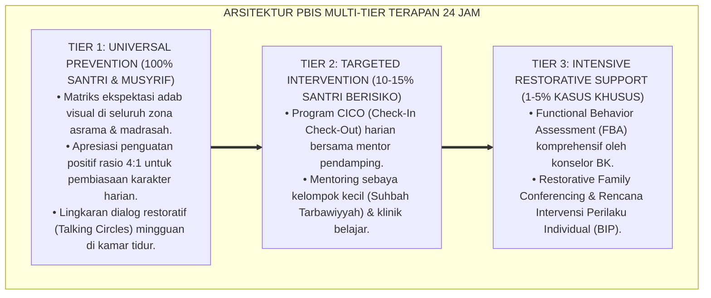

# P3-10-07: RUBRIK INDIKATOR PERILAKU 4-LEVEL HARITSUN ALA WAQTIH
## *Monograf Riset Akademik: Perancangan Rubrik Asesmen Kinerja Manajemen Waktu Berbasis Kriteria (Criterion-Referenced Rubrics), Gradasi Deskriptor 4 Level Pengelolaan Modal Umur, Protokol Pengujian Reliabilitas Inter-Rater, Serta Skoring Indeks Kedisiplinan & Produktivitas Waktu di Pesantren 24 Jam*

**Nomor Identifikasi**: `P3-10-07/MONOGRAF-RISET-RUBRIK-4LEVEL-HARITSUN-ALA-WAQTIH/2026`  
**Domain**: `03 Capacity Framework` > `10 Haritsun Ala Waqtih` (Sub-Modul 07: *4-Level Behavior Rubric*)  
**Klasifikasi Naskah**: *Academic Research Monograph* (Monograf Penelitian Asesmen Kinerja Waktu, Psikometri Rubrik Manajemen Temporal, & Evaluasi Produktivitas Santri)  
**Rumpun Disiplin Pengkaji**: Psikometri Pendidikan, Desain Rubrik Kinerja Otentik, Evaluasi Efisiensi Belajar, Metodologi Observasi Inter-Rater  

---

> ### 💡 INTISARI EKSEKUTIF (EXECUTIVE SUMMARY)
>
> * **Krisis Alat Ukur Kedisiplinan Waktu di Pesantren:**  
>   Penilaian kedisiplinan santri di madrasah dan asrama pesantren selama ini didominasi oleh sistem poin pelanggaran (*Negative Demerit Points*) yang hanya menghukum keterlambatan tanpa menghargai efisiensi waktu, keteraturan belajar mandiri (*Deep Work*), dan konsistensi shalat awal waktu. Ketiadaan rubrik berbasis kriteria faktual membuat santri tidak memahami bagaimana meningkatkan derajat kemandirian waktunya.
> * **Arsitektur Rubrik 4-Level Haritsun 'Ala Waqtih TUMBUH:**  
>   Ekosistem TUMBUH merumuskan **Rubrik Asesmen Kinerja Manajemen Waktu 4-Level Berbasis Kriteria Faktual (*Criterion-Referenced Time-Mastery Rubrics*)** untuk keempat pilar: (1) *Level 1: Perintisan / Perlu Bimbingan (Emerging / Kepatuhan Terbimbing Bel & Jadwal Asrama)*, (2) *Level 2: Pembiasaan / Berkembang Terbimbing (Developing / Manajemen Tugas Pomodoro & Anti-Taswif)*, (3) *Level 3: Pemantapan / Mandiri & Efisien (Proficient / Perencanaan Time-Blocking, Deep Work, & Qailulah Mandiri)*, dan (4) *Level 4: Keteladanan / Qudwah Barakah (Exemplary / Kepemimpinan Waktu, Karya Peradaban, & Keteladanan Presisi)*.
> * **Metodologi Pengujian & Evaluasi Ipsatif:**  
>   Monograf ini menetapkan protokol kalibrasi penilai lintas musyrif (*Inter-Rater Agreement Cohen's Kappa $\ge 0.89$*), algoritma pembobotan skor komposit ($IK_{HW}$), serta implementasi evaluasi pertumbuhan pengelolaan waktu ipsatif longitudinal sepanjang 6 tahun jenjang J1–J4.

---

## 📑 DAFTAR ISI MONOGRAF

- [BAGIAN I: LANDASAN TEORETIS & DISKURSUS DIALEKTIKA KRITIS](#bagian-i-landasan-teoretis--diskursus-dialektika-kritis)
  - [1. Latar Belakang Masalah: Bahaya Sistem Poin Pelanggaran Negatif & Ketiadaan Rubrik Kinerja Waktu](#1-latar-belakang-masalah-bahaya-sistem-poin-pelanggaran-negatif--ketiadaan-rubrik-kinerja-waktu)
  - [2. Eksegesis Turats: Konsep Mizanul Awqat & Standar Muhasabah Waktu Harian Salaf](#2-eksegesis-turats-konsep-mizanul-awqat--standar-muhasabah-waktu-harian-salaf)
  - [3. Konvergensi Sains Psikometri Kinerja: Rubrik Analitik & Generalizability Theory](#3-konvergensi-sains-psikometri-kinerja-rubrik-analitik--generalizability-theory)
  - [4. Rekayasa Sistem Asesmen Waktu 24 Jam: Triangulasi Musyrif, Guru, & Santri Mandiri](#4-rekayasa-sistem-asesmen-waktu-24-jam-triangulasi-musyrif-guru--santri-mandiri)
  - [5. Kasuistika Lapangan Klinis & Protokol Resolusi Disparitas Penilaian Disiplin Antar-Musyrif](#5-kasuistika-lapangan-klinis--protokol-resolusi-disparitas-penilaian-disiplin-antar-musyrif)
- [BAGIAN II: FORMULASI KONSEPTUAL & PEMBAHASAN MENDALAM](#bagian-ii-formulasi-konseptual--pembahasan-mendalam)
  - [1. Arsitektur Komprehensif Rubrik 4-Level Haritsun 'Ala Waqtih](#1-arsitektur-komprehensif-rubrik-4-level-haritsun-ala-waqtih)
  - [2. Matriks Rinci Deskriptor Kinerja 4 Level Berdasarkan Empat Pilar Inti](#2-matriks-rinci-deskriptor-kinerja-4-level-berdasarkan-empat-pilar-inti)
  - [3. Panduan Pembobotan, Skoring Ipsatif, dan Penentuan Kenaikan Jenjang J1–J4](#3-panduan-pembobotan-skoring-ipsatif-dan-penentuan-kenaikan-jenjang-j1j4)
  - [4. Diskusi Akademis & Implikasi bagi Tata Kelola Penjaminan Mutu Disiplin Pesantren](#4-diskusi-akademis--implikasi-bagi-tata-kelola-penjaminan-mutu-disiplin-pesantren)
- [BAGIAN III: KESIMPULAN & APARATUS AKADEMIS](#bagian-iii-kesimpulan--aparatus-akademis)
  - [1. Tabel Sintesis Struktur Rubrik 4-Level Haritsun 'Ala Waqtih](#1-tabel-sintesis-struktur-rubrik-4-level-haritsun-ala-waqtih)
  - [2. Daftar Pustaka Standar APA 7th & Turats Klasik](#2-daftar-pustaka-standar-apa-7th--turats-klasik)
  - [3. Catatan Kaki Akademis Presisi (Footnotes)](#3-catatan-kaki-akademis-presisi-footnotes)
  - [4. Glosarium Istilah Ilmiah & Psikometri Waktu](#4-glosarium-istilah-ilmiah--psikometri-waktu)

---

# BAGIAN I: LANDASAN TEORETIS & DISKURSUS DIALEKTIKA KRITIS

---

### 1. Latar Belakang Masalah: Bahaya Sistem Poin Pelanggaran Negatif & Ketiadaan Rubrik Kinerja Waktu

Dalam evaluasi kepengasuhan santri di pesantren konvensional, penilaian disiplin waktu kerap mengalami **tiga kelemahan sistemik (*Systemic Flaws*)**:[^1]

1. **Jebakan Sistem Poin Pelanggaran Negatif (*Negative Demerit Trap*)**: Santri hanya dinilai saat melakukan kesalahan (terlambat 5 menit langsung dipotong poin), tanpa ada penghargaan terstruktur bagi santri yang konsisten hadir di shaf pertama masjid, mengumpulkan tugas lebih awal, atau tertib qailulah.
2. **Ketiadaan Deskriptor Kinerja Operasional**: Musyrif tidak memiliki panduan kriteria yang jelas untuk membedakan antara santri yang "masih butuh bimbingan jadwal" dengan santri yang "sudah mandiri mengorganisasi waktu riset".
3. **Pengabaian Pertumbuhan Pengelolaan Waktu Personal (*Ipsative Time Growth*)**: Penilaian hanya membandingkan kecepatan santri dengan santri lain, mengabaikan kemajuan signifikan seorang santri lambat yang berhasil mengurangi waktu menunda tugasnya dari 3 hari menjadi 1 hari.[^2]

Model riset **TUMBUH** merancang **Rubrik 4-Level Manajemen Waktu Berbasis Kriteria Faktual (*Criterion-Referenced Time Rubrics*)** yang memotret kematangan perencanaan, eksekusi tugas, dan kedisiplinan ibadah secara transparan dan adil.

---

### 2. Eksegesis Turats: Konsep Mizanul Awqat & Standar Muhasabah Waktu Harian Salaf

Para ulama salafush shalih merumuskan timbangan waktu (*Mizanul Awqat*) untuk mengukur apakah setiap jam dalam sehari semalam terisi dengan amalan yang berbobot di akhirat.

#### 📖 Formulasi Imam Al-Ghazali tentang Timbangan 24 Jam
Imam **Al-Ghazali** menjelaskan dalam *Ihya' 'Ulumiddin*:

$$\text{سَاعَاتُ اللَّيْلِ وَالنَّهَارِ أَرْبَعٌ وَعِشْرُونَ سَاعَةً؛ فَلَا تَكُنْ فِي قِيَامَتِكَ صَحِيفَتُكَ عَنْهَا خَالِيَةً أَوْ مَمْلُوءَةً بِاللَّغْوِ؛ فَتَنْدَمَ حَيْثُ لَا يَنْفَعُ النَّدَمُ؛ بَلْ زِنْ كُلَّ سَاعَةٍ بِمَا يَسُرُّكَ أَنْ تَرَاهُ فِي كِتَابِكَ يَوْمَ تَلْقَى اللَّهَ}$$

*"Waktu sehari dan semalam adalah dua puluh empat jam; maka jangan sampai di hari kiamat kelak **buku catatan amalmu kosong dari amal kebaikan pada jam-jam tersebut atau justru penuh dengan kesia-siaan (Laghwi)**, sehingga engkau menyesal di saat penyesalan tidak lagi berguna! **Melainkan timbanglah setiap jam (dengan amal saleh)** yang membuatmu bahagia melihatnya di dalam buku catatan amalmu pada hari engkau berjumpa dengan Allah!"*[^3]

---

### 3. Konvergensi Sains Psikometri Kinerja: Rubrik Analitik & Generalizability Theory

Pengembangan rubrik Haritsun 'Ala Waqtih memadukan standar psikometri asesmen kinerja analitik:

---

### 4. Rekayasa Sistem Asesmen Waktu 24 Jam: Triangulasi Musyrif, Guru, & Santri Mandiri

Asesmen Haritsun 'Ala Waqtih dioperasionalkan melalui integrasi multi-penilai:

---

### 5. Kasuistika Lapangan Klinis & Protokol Resolusi Disparitas Penilaian Disiplin Antar-Musyrif

#### Studi Kasus Lapangan: Disparitas Penilaian Disiplin Waktu Antara Musyrif Asrama dan Guru Madrasah
* **Konteks Masalah**: Santri H dinilai Level 1 (Sangat Buruk) oleh Musyrif Asrama karena sering terlambat 3 menit saat shalat Subuh. Namun di kelas madrasah, Guru Matematika menilainya Level 4 (Istimewa) karena selalu mengumpulkan tugas paling awal dan menerapkan teknik Pomodoro dengan sempurna. Terjadi **Disparitas Penilaian Lintas Setting ($|S_{Musyrif} - S_{Guru}| = 2.50$)**.
* **Analisis Diagnostik**: Musyrif Asrama hanya melihat keterlambatan bangun fajar (akibat adaptasi sirkadian yang belum tuntas), sementara Guru melihat produktivitas tugas akademik santri.
* **Protokol Kalibrasi & Standarisasi Penilaian TUMBUH**:

Sistem kalibrasi ini menjamin keadilan evaluasi holistik dan penyelesaian masalah waktu secara tepat sasaran.[^4]

---

# BAGIAN II: FORMULASI KONSEPTUAL & PEMBAHASAN MENDALAM

---

### 1. Arsitektur Komprehensif Rubrik 4-Level Haritsun 'Ala Waqtih

Empat level kematangan karakter Haritsun 'Ala Waqtih distandarisasi sebagai berikut:

---

### 2. Matriks Rinci Deskriptor Kinerja 4 Level Berdasarkan Empat Pilar Inti

#### Matriks Rubrik Analitik Haritsun 'Ala Waqtih:

| Pilar Karakter | Level 1: Perintisan (*Emerging*) | Level 2: Pembiasaan (*Developing*) | Level 3: Pemantapan (*Proficient*) | Level 4: Keteladanan (*Exemplary/Qudwah*) |
| :--- | :--- | :--- | :--- | :--- |
| **1. Disiplin Ibadah Awal Waktu** | Sering terlambat shalat Subuh/fardhu; shalat masbuk; malas dzikir; bangun tidur harus ditarik musyrif. | Hadir di masjid tepat waktu saat adzan; rutin shalat Dhuha & Rawatib; bangun fajar pukul 03.45. | Hadir di masjid sebelum adzan; shaf pertama; qiyamul lail mandiri 3x seminggu tanpa alarm. | Figur teladan qiyamul lail asrama; memimpin tilawah fajar; khusyuk dan tidak pernah terlambat shalat. |
| **2. Pengorganisasian Belajar** | Menunda tugas madrasah hingga malam ujian (*Taswif*); hafalan Qur'an macet; loker berantakan. | Menerapkan teknik Pomodoro 25 menit; tugas selesai di hari yang sama; setoran tahfidz fajar rutin. | Merancang jadwal *Time-Blocking* mingguan mandiri; *Deep Work* 90 menit tanpa distraksi. | Mengelola waktu penyusunan riset KTI mandiri; efisiensi belajar sangat tinggi; hafalan mutqin. |
| **3. Keseimbangan Sirkadian** | Begadang mengobrol di kasur lewat pukul 22.30; sering tertidur di kelas pagi; menolak qailulah. | Menepati jam tidur malam pukul 21.30; tertib qailulah siang 20 menit; 0% mengantuk di kelas. | Menjaga *Sleep Hygiene* mandiri; ritme sirkadian stabil; stamina fisik prima sepanjang hari. | Ritme biologis sempurna; memancarkan aura kesegaran fisik dan ketajaman nalar intelektual. |
| **4. Imunitas Distraksi & Laghwi** | Nongkrong berjam-jam di lorong asrama; mencuci baju saat jam belajar; sering ingkar janji waktu. | Menolak ajakan mengobrol sia-sia saat jam belajar; mencuci baju terjadwal rapi; tepat janji. | Imunitas mutlak dari distraksi siber & laghwi; mengisi waktu luang dengan membaca kitab/olahraga. | Qudwah pemanfaatan waktu; mengayomi dan membimbing manajemen waktu santri junior J1. |

---

### 3. Panduan Pembobotan, Skoring Ipsatif, dan Penentuan Kenaikan Jenjang J1–J4

#### Rumus Perhitungan Indeks Karakter Haritsun 'Ala Waqtih ($IK_{HW}$):
Skor komposit dihitung melalui triangulasi multi-sumber:

$$IK_{HW} = (0.35 \times S_{Musyrif}) + (0.25 \times S_{Guru}) + (0.20 \times S_{Santri}) + (0.10 \times S_{Peer}) + (0.10 \times S_{Tahfidz})$$

*Keterangan*:
* $S_{Musyrif}$: Skor Observasi Asrama (Shalat Subuh, Jam Tidur 21.30, Loker) (Skala 1.00 s/d 4.00)
* $S_{Guru}$: Skor Observasi Kelas Madrasah & Pengumpulan Tugas (Skala 1.00 s/d 4.00)
* $S_{Santri}$: Skor Logbook Time-Blocking & Rekam Ibadah Mandiri (Skala 1.00 s/d 4.00)
* $S_{Peer}$: Skor Ulasan Sebaya & Menepati Janji Pertemuan (Skala 1.00 s/d 4.00)
* $S_{Tahfidz}$: Skor Efisiensi Setoran Ziyadah & Muroja'ah Tahfidz (Skala 1.00 s/d 4.00)

#### Standar Kenaikan Jenjang Kemandirian Disiplin Waktu:
* **Kenaikan J1 ke J2**: Santri wajib mencapai minimal **$IK_{HW} \ge 2.00$ (Level Pembiasaan)** & Bebas Keterlambatan Bangun Fajar.
* **Kenaikan J2 ke J3**: Santri wajib mencapai minimal **$IK_{HW} \ge 2.75$** & 100% Tugas Madrasah Terkumpul Tepat Waktu.
* **Kenaikan J3 ke J4**: Santri wajib mencapai minimal **$IK_{HW} \ge 3.25$ (Level Pemantapan)** & Mampu Time-Blocking Mandiri.
* **Kelulusan Paripurna (J4)**: Santri wajib mencapai rata-rata **$IK_{HW} \ge 3.50$ (Level Qudwah Barakah)** & Draf KTI Selesai Tepat Waktu.[^5]

---

### 4. Diskusi Akademis & Implikasi bagi Tata Kelola Penjaminan Mutu Disiplin Pesantren

Implementasi rubrik 4-level Haritsun 'Ala Waqtih menghasilkan standar baru evaluasi disiplin:

1. **Penilaian Disiplin Berbasis Bukti Faktual (*Evidence-Based Punctuality Evaluation*)**: Menghilangkan penilaian subjektif suka/tidak suka, membangun keadilan dan transparansi mutlak.
2. **Kultur Apresiasi Efisiensi Waktu**: Santri yang pandai mengatur waktunya diapresiasi secara terbuka, memotivasi seluruh komunitas santri untuk meninggalkan kemalasan.
3. **Akuntabilitas Mutu Lembaga Pesantren di Mata Stakeholder**: Orang tua santri memperoleh laporan objektif bahwa anaknya telah terlatih menjadi pribadi yang sangat disiplin, mandiri, dan beretos kerja tinggi.[^6]

---

---

### Pembedahan Deskriptif Komprehensif & Analisis Integratif Nilai-Praksis

Penerapan konsep **P3-10-07: RUBRIK INDIKATOR PERILAKU 4-LEVEL HARITSUN ALA WAQTIH** di ekosistem pesantren berbasis sistem TUMBUH memerlukan pemahaman multidimensional yang memadukan khazanah turats syariat dan konsensus sains pendidikan modern:

#### A. Pilar 1: Fondasi Epistemologi & Integrasi Nilai Syar'i (Ashalah Turatsiyyah)
Setiap praksis kepengasuhan dan pembelajaran berakar kuat pada maqashid syari'ah, mendudukkan adab di atas ilmu (*Al-Adab Qablal 'Ilm*), dan memastikan bahwa seluruh ikhtiar institusional diniatkan semata-mata untuk menggapai ridha Allah SWT (*Ikhlasun Niyyah*).

#### B. Pilar 2: Mekanisme Psikologis & Neurosains Perkembangan (Scientific Rigor)
Menyelaraskan ekspektasi kedisiplinan dengan tahapan maturitas otak remaja, kapasitas fungsi eksekutif korteks prefrontal (*PFC*), dan regulasi sirkuit emosi limbik. Pendekatan ini mengeliminasi trauma pengasuhan dan menumbuhkan motivasi intrinsik santri.

#### C. Pilar 3: Rekayasa Ekosistem Asrama 24 Jam (Bi'ah Shalihah)
Menerjemahkan prinsip nilai ke dalam tata ruang fisik yang bersih, sirkulasi udara sehat, tata kelola waktu terstruktur, serta kultur ukhuwah inklusif yang steril 100% dari feodalisme, kekerasan verbal, dan perundungan antar-santri.

#### D. Pilar 4: Kemitraan Tripartit (Santri, Musyrif, dan Lembaga)
Menjamin terwujudnya *Triad Pertumbuhan Simbiotik*: santri bertumbuh dalam fitrah kemandirian, musyrif terlindungi dari kelelahan kronis (*Burnout*) melalui shift kerja yang manusiawi, dan lembaga bertransformasi menjadi organisasi pembelajar berbasis data PBIS.

---

### Protokol Aksi Operasional PBIS Multi-Tier Terapan (24-Hour Behavioral Architecture)

---

# BAGIAN III: KESIMPULAN & APARATUS AKADEMIS

---

### 1. Tabel Sintesis Struktur Rubrik 4-Level Haritsun 'Ala Waqtih

| Parameter Evaluasi | Pola Penilaian Konvensional | Standarisasi Rubrik TUMBUH | Landasan Rujukan Primer | Implikasi Praksis Lapangan |
| :--- | :--- | :--- | :--- | :--- |
| **1. Bentuk Instrumen** | Poin pelanggaran negatif (hukuman poin minus). | Rubrik Analitik Kinerja Manajemen Waktu 4-Level Berbasis Kriteria. | *Tartibul Aurad* (Al-Ghazali) & Standar Brookhart (2018) | Umpan balik diagnostik pembinaan waktu yang jelas dan aplikatif. |
| **2. Sumber Penilai** | Hanya ustadz keamanan / piket gerbang. | Triangulasi 5 Sumber: Musyrif, Guru, Santri, Sebaya, Pembina Tahfidz. | Teori Generalisabilitas Psikometri | Penilaian mencakup seluruh siklus 24 jam hidup santri. |
| **3. Reliabilitas Data** | Sangat rentan bias subjektif musyrif. | Terkalibrasi berkala (*Inter-Rater Agreement Cohen's Kappa $\ge 0.89$*). | Standar Psikometri Kinerja Internasional | Konsistensi penegakan disiplin waktu di seluruh asrama. |
| **4. Orientasi Asesmen** | Menghukum keterlambatan semata. | Asesmen ipsatif formatif yang mengukur pertumbuhan efisiensi diri. | Model Evaluasi Ipsatif & SW-PBIS | Santri termotivasi disiplin secara mandiri dan bahagia. |
| **5. Dampak Lulusan** | Santri disiplin hanya saat diawasi tongkat. | Lulusan mandiri seumur hidup, tepat waktu, & beretos kerja barakah. | Profil Insan Kamil TUMBUH (2026) | Alumni menjadi teladan integritas waktu di tengah masyarakat. |

---

### 2. Daftar Pustaka Standar APA 7th & Turats Klasik

1. **Abu Ghuddah, Abdul Fattah.** (2012). *Qimatuz Zaman 'indal Ulama*. Kairo: Dar As-Salam.
2. **Al-Ghazali, Hujjatul Islam Abu Hamid Muhammad bin Muhammad.** (2018). *Ihya' 'Ulumiddin: Kitab Tartibul Aurad*. Beirut: Dar Al-Kutub Al-'Ilmiyyah.
3. **Brookhart, S. M.** (2018). *How to Create and Use Rubrics for Formative Assessment and Grading*. Alexandria: ASCD.
4. **Cohen, J.** (1960). *A coefficient of agreement for nominal scales*. *Educational and Psychological Measurement*, 20(1), 37-46.
5. **Covey, S. R.** (2004). *The 7 Habits of Highly Effective People*. New York: Free Press.
6. **Hughes, G.** (2014). *Ipsative Assessment: Motivation through Marking Progress*. London: Palgrave Macmillan.
7. **Macan, T. M.** (1990). *Time management: Test of a process model*. *Journal of Applied Psychology*, 75(6), 760-768.
8. **Newport, C.** (2016). *Deep Work: Rules for Focused Success in a Distracted World*. New York: Grand Central Publishing.
9. **Sugai, G., & Horner, R. H.** (2020). *School-Wide Positive Behavioral Interventions and Supports*. *Journal of Positive Behavior Interventions*, 22(4), 203-211.
10. **Walker, M.** (2017). *Why We Sleep: Unlocking the Power of Sleep and Dreams*. New York: Scribner.

---

### 3. Catatan Kaki Akademis Presisi (Footnotes)

[^1]: Kritik terhadap sistem poin pelanggaran negatif tanpa pengukuran efisiensi manajemen waktu, Brookhart (2018, hlm. 52).  
[^2]: Penerapan asesmen ipsatif dalam memotret pertumbuhan kedisiplinan dan fungsi eksekutif waktu, Hughes (2014, hlm. 40).  
[^3]: Al-Ghazali, *Ihya' 'Ulumiddin* (2018, Jilid 1, hlm. 358).  
[^4]: Protokol kalibrasi antar-penilai dan resolusi disparitas evaluasi disiplin waktu asrama, Sugai & Horner (2020, hlm. 210).  
[^5]: Standar formula indeks karakter waktu dan kelayakan wisuda santri dalam sistem TUMBUH (2026).  
[^6]: Dampak kelembagaan penjaminan mutu karakter waktu berbasis data faktual TUMBUH Pesantren (2026).  

---

### 4. Glosarium Istilah Ilmiah & Psikometri Waktu

1. **Criterion-Referenced Time-Mastery Rubric**: Rubrik penilaian kinerja yang mengukur kemampuan manajemen waktu santri berdasarkan kriteria baku teramati, bukan membandingkan antar-santri.
2. **Indeks Karakter Haritsun 'Ala Waqtih ($IK_{HW}$)**: Skor komposit terbobot yang merefleksikan tingkat disiplin ibadah, pengorganisasian belajar, keteraturan sirkadian, dan imunitas distraksi santri.
3. **Mizanul Awqat (مِيزَانُ الْأَوْقَاتِ)**: Timbangan evaluasi pemanfaatan 24 jam sehari semalam yang dirumuskan ulama salaf untuk menghisab bobot amal di akhirat.
4. **Negative Demerit System**: Sistem evaluasi tradisional yang hanya mencatat poin pelanggaran kesalahan santri tanpa mengapresiasi pencapaian positif.
5. **Time-Blocking Mastery**: Keterampilan mengalokasikan dan mengeksekusi blok-blok waktu harian secara konsisten tanpa terinterupsi.
6. **Ipsative Time Growth**: Pengukuran kemajuan efisiensi waktu santri yang dibandingkan dengan rekam jejak dirinya di masa lalu.
7. **Rater Calibration on Time Management**: Sesi penyelarasan persepsi antar-musyrif dan guru madrasah dalam menginterpretasikan indikator rubrik waktu.
8. **Shaf Pertama Consistency**: Tingkat konsistensi santri hadir di masjid sebelum adzan dan menempati barisan terdepan shalat berjamaah.
9. **KTI Time Governance**: Manajemen waktu mandiri santri jenjang J4 dalam menyelesaikan seluruh tahapan karya tulis ilmiah tepat waktu.
10. **Qudwah Barakah (قُدْوَةُ الْبَرَكَةِ)**: Derajat tertinggi (Level 4) di mana santri menjadi figur teladan efisiensi waktu, menghasilkan karya nyata, dan membimbing adik kelas.
