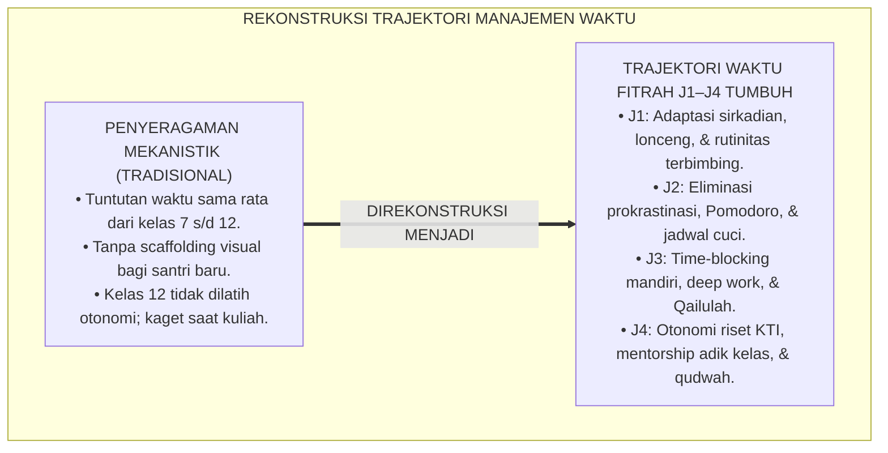
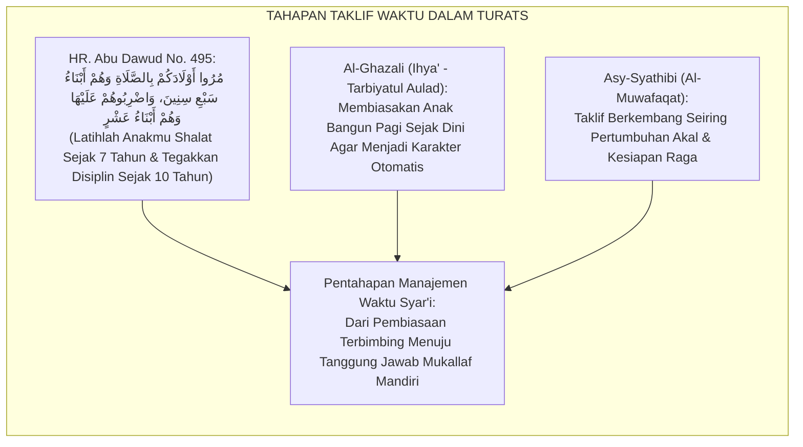
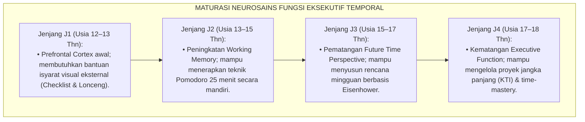
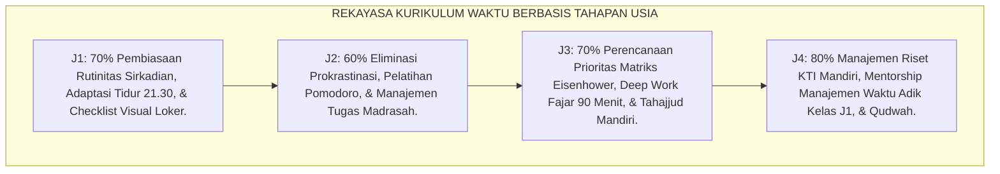
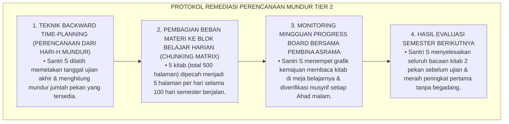
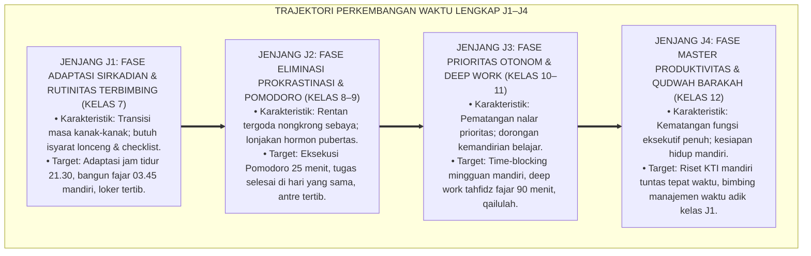
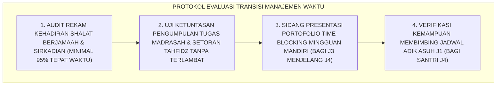
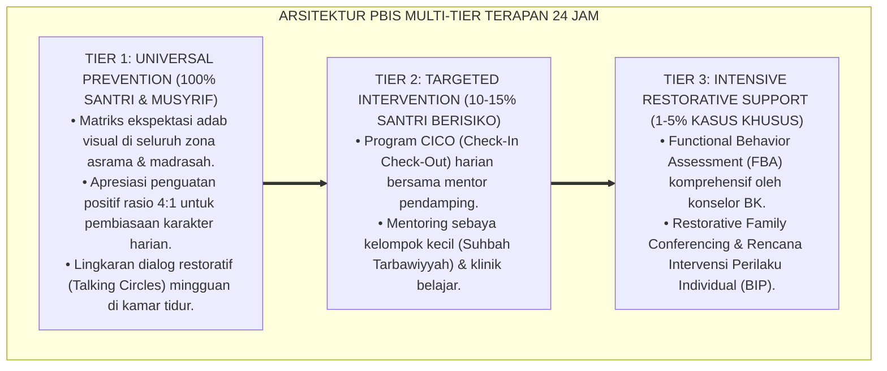

# P3-10-08: TAHAPAN PERKEMBANGAN JENJANG J1–J4 HARITSUN ALA WAQTIH
## *Monograf Riset Akademik: Trajektori Perkembangan Kematangan Temporal Remaja Pesantren (Usia 12–18 Tahun), Maturasi Prefrontal Cortex & Regulasi Waktu Mandiri, Krisis Prokrastinasi Pubertas Awal Menuju Otonomi Eksekutif Dewasa Awal, Serta Desain Kurikulum Manajemen Waktu Berjenjang J1–J4 di Ekosistem Pesantren Berbasis TUMBUH*

**Nomor Identifikasi**: `P3-10-08/MONOGRAF-RISET-TRAJEKTORI-J1J4-HARITSUN-ALA-WAQTIH/2026`  
**Domain**: `03 Capacity Framework` > `10 Haritsun Ala Waqtih` (Sub-Modul 08: *J1–J4 Developmental Stages*)  
**Klasifikasi Naskah**: *Academic Research Monograph* (Monograf Penelitian Perkembangan Kognitif Temporal Remaja, Neurosains Fungsi Eksekutif, & Kurikulum Waktu Berjenjang)  
**Rumpun Disiplin Pengkaji**: Psikologi Perkembangan Kognitif, Neurosains Perencanaan Temporal, Desain Kurikulum Pesantren Berjenjang, Manajemen Pengasuhan 24 Jam  

---

> ### 💡 INTISARI EKSEKUTIF (EXECUTIVE SUMMARY)
>
> * **Krisis Pendekatan Seragam Pengaturan Waktu di Pesantren:**  
>   Pesantren kerap menuntut santri baru (usia 12–13 tahun, Jenjang J1) yang kemampuan perencanaan kognitifnya (*Prefrontal Cortex*) masih dalam tahap awal perkembangan untuk langsung memiliki keterampilan mengatur waktu yang sama dengan santri kelas 12 (Jenjang J4). Di sisi lain, santri senior kelas 12 tidak diberikan otonomi waktu yang cukup untuk melatih kemandirian hidup sebelum memasuki dunia universitas dan masyarakat.
> * **Pemetaan Trajektori Kematangan Temporal 6 Tahun TUMBUH (J1–J4):**  
>   Ekosistem TUMBUH merumuskan **Trajektori Perkembangan Manajemen Waktu Berkelanjutan** yang disinkronkan dengan 4 fase maturasi biologis dan kognitif santri: (1) *Jenjang J1 (Kelas 7, Usia 12–13 Thn): Fase Adaptasi Sirkadian, Kepatuhan Isyarat Lingkungan (Lonceng/Jadwal), & Disiplin Bangun Fajar Terbimbing*, (2) *Jenjang J2 (Kelas 8–9, Usia 13–15 Thn): Fase Eliminasi Prokrastinasi, Penguasaan Pomodoro (25 Menit), & Rutinitas Cuci Baju Terjadwal*, (3) *Jenjang J3 (Kelas 10–11, Usia 15–17 Thn): Fase Perencanaan Prioritas Otonom (Matriks Eisenhower), Deep Work Tahfidz Fajar 90 Menit, & Qailulah Mandiri*, dan (4) *Jenjang J4 (Kelas 12, Usia 17–18 Thn): Fase Master Produktivitas, Manajemen Riset KTI Mandiri, & Keteladanan Barakah (Qudwah) bagi Adik Kelas*.
> * **Integrasi Neurosains & Fiqh Aulawiyyat:**  
>   Monograf ini memadukan teori perkembangan fungsi eksekutif Adele Diamond, teori penundaan temporal Piers Steel, dan konsep *Fiqh al-Aulawiyyat* dalam Turats Islam, menjamin pembentukan etos kerja santri berlangsung secara manusiawi, ilmiah, dan berkesinambungan.

---

## 📑 DAFTAR ISI MONOGRAF

- [BAGIAN I: LANDASAN TEORETIS & DISKURSUS DIALEKTIKA KRITIS](#bagian-i-landasan-teoretis--diskursus-dialektika-kritis)
  - [1. Latar Belakang Masalah: Bahaya Pendekatan 'All-Ages Uniformity' dalam Manajemen Waktu Asrama](#1-latar-belakang-masalah-bahaya-pendekatan-all-ages-uniformity-dalam-manajemen-waktu-asrama)
  - [2. Eksegesis Turats: Konsep Maratibut Taklif & Pentahapan Tanggung Jawab Waktu dalam Islam](#2-eksegesis-turats-konsep-maratibut-taklif--pentahapan-tanggung-jawab-waktu-dalam-islam)
  - [3. Konvergensi Neurosains Kognitif: Teori Maturasi Prefrontal Cortex & Future Time Perspective](#3-konvergensi-neurosains-kognitif-teori-maturasi-prefrontal-cortex--future-time-perspective)
  - [4. Analisis Rekayasa Kurikulum Waktu Berbasis Tahapan Usia 24 Jam di Madrasah & Asrama](#4-analisis-rekayasa-kurikulum-waktu-berbasis-tahapan-usia-24-jam-di-madrasah--asrama)
  - [5. Kasuistika Lapangan Klinis & Protokol Pendampingan Santri J3 Mengalami Kegagalan Manajemen Target Ujian](#5-kasuistika-lapangan-klinis--protokol-pendampingan-santri-j3-mengalami-kegagalan-manajemen-target-ujian)
- [BAGIAN II: FORMULASI KONSEPTUAL & PEMBAHASAN MENDALAM](#bagian-ii-formulasi-konseptual--pembahasan-mendalam)
  - [1. Arsitektur Komprehensif Trajektori Kematangan Temporal Jenjang J1–J4](#1-arsitektur-komprehensif-trajektori-kematangan-temporal-jenjang-j1j4)
  - [2. Matriks Integrasi Kognitif, Biologis, Keterampilan Waktu, & Target Riyadhah Lintas Jenjang](#2-matriks-integrasi-kognitif-biologis-keterampilan-waktu--target-riyadhah-lintas-jenjang)
  - [3. Protokol Transisi Kenaikan Jenjang & Uji Mandiri Manajemen Waktu (Time-Mastery Check)](#3-protokol-transisi-kenaikan-jenjang--uji-mandiri-manajemen-waktu-time-mastery-check)
  - [4. Diskusi Akademis & Implikasi bagi Tata Kelola Pembinaan Kemandirian Santri Pesantren](#4-diskusi-akademis--implikasi-bagi-tata-kelola-pembinaan-kemandirian-santri-pesantren)
- [BAGIAN III: KESIMPULAN & APARATUS AKADEMIS](#bagian-iii-kesimpulan--aparatus-akademis)
  - [1. Tabel Sintesis Trajektori Perkembangan Manajemen Waktu J1–J4](#1-tabel-sintesis-trajektori-perkembangan-manajemen-waktu-j1j4)
  - [2. Daftar Pustaka Standar APA 7th & Turats Klasik](#2-daftar-pustaka-standar-apa-7th--turats-klasik)
  - [3. Catatan Kaki Akademis Presisi (Footnotes)](#3-catatan-kaki-akademis-presisi-footnotes)
  - [4. Glosarium Istilah Ilmiah & Perkembangan Temporal Remaja](#4-glosarium-istilah-ilmiah--perkembangan-temporal-remaja)

---

# BAGIAN I: LANDASAN TEORETIS & DISKURSUS DIALEKTIKA KRITIS

---

### 1. Latar Belakang Masalah: Bahaya Pendekatan 'All-Ages Uniformity' dalam Manajemen Waktu Asrama

Dalam pengasuhan asrama tradisional, kerap terjadi **tiga kesalahan pemahaman perkembangan temporal (*Developmental Misconceptions*)**:[^1]

1. **Jebakan Penyeragaman Tuntutan Kemandirian Waktu (*All-Ages Uniformity Fallacy*)**: Santri baru usia 12 tahun yang belum memiliki *working memory* matang dituntut mengatur waktu belajar, mencuci baju, dan menghafal tanpa bimbingan *scaffolding* visual yang memadai.
2. **Ketiadaan Pemberian Otonomi Bertahap pada Santri Senior**: Santri kelas 12 yang sebentar lagi kuliah di perguruan tinggi masih diperlakukan seperti anak kecil yang harus digiring ke mana-mana dengan lonceng, memicu kepanikan dan kegagalan adaptasi saat hidup mandiri di luar pondok.
3. **Pengabaian Perubahan Jam Biologis Remaja (Pubertal Sleep Phase Shift)**: Pengasuh tidak memahami bahwa remaja pubertas mengalami pergeseran ritme biologis sirkadian alami yang membutuhkan strategi penyesuaian khusus.[^2]

Model riset **TUMBUH** merancang arsitektur pembinaan waktu yang **berkembang secara bertahap dari kepatuhan terbimbing (*External Scaffolding*) menuju otonomi penuh (*Internalized Time Autonomy*)**.

---

### 2. Eksegesis Turats: Konsep Maratibut Taklif & Pentahapan Tanggung Jawab Waktu dalam Islam

Syariat Islam membedakan tahapan pembebanan kewajiban hukum (*Maratibut Taklif*) dari masa *Tamyiz* (kemampuan membedakan baik-buruk) hingga masa *Bulugh* dan kematangan akal (*Rusyd*).

#### 📖 Hadits Nabi SAW tentang Pembiasaan Disiplin Waktu Sejak Dini
Rasulullah SAW bersabda:

$$\text{مُرُوا أَوْلَادَكُمْ بِالصَّلَاةِ وَهُمْ أَبْنَاءُ سَبْعِ سِنِينَ، وَاضْرِبُوهُمْ عَلَيْهَا وَهُمْ أَبْنَاءُ عَشْرٍ، وَفَرِّقُوا بَيْنَهُمْ فِي الْمَضَاجِعِ}$$

*"Perintahkanlah anak-anak kalian untuk mendirikan shalat (tepat waktu) saat mereka **berusia tujuh tahun**, dan tegakkanlah disiplin pembiasaan saat mereka **berusia sepuluh tahun**, serta pisahkanlah tempat tidur di antara mereka!"* (HR. Abu Dawud No. 495).[^3]

---

### 3. Konvergensi Neurosains Kognitif: Teori Maturasi Prefrontal Cortex & Future Time Perspective

Trajektori Haritsun 'Ala Waqtih menyelaraskan teori perkembangan fungsi eksekutif Prefrontal Cortex:

Memahami tahapan maturasi ini menghindarkan pengasuh dari memberi beban otonomi waktu yang terlalu cepat atau terlalu lambat kepada santri.[^4]

---

### 4. Analisis Rekayasa Kurikulum Waktu Berbasis Tahapan Usia 24 Jam di Madrasah & Asrama

Struktur kurikulum pembinaan waktu diorganisasikan selaras dengan tahapan usia santri:

---

### 5. Kasuistika Lapangan Klinis & Protokol Pendampingan Santri J3 Mengalami Kegagalan Manajemen Target Ujian

#### Studi Kasus Lapangan: Santri J3 Panik dan Tidak Tidur Semalaman Karena Belum Membaca 5 Kitab Ujian
* **Konteks Masalah**: Santri S (16 tahun, Jenjang J3) merasa sangat percaya diri di awal semester sehingga tidak pernah mencicil membaca kitab ujian. Dua hari menjelang ujian akhir semester, ia panik mendapati ada 5 kitab tebal yang belum dibaca (*Severe Temporal Planning Failure*), mengakibatkan ia begadang 48 jam dan jatuh pingsan di ruang ujian.
* **Analisis Diagnostik**: Santri S mengalami *Planning Fallacy* dan *Temporal Myopia* (meremehkan waktu yang dibutuhkan untuk menyelesaikan target besar).
* **Protokol Remediasi Perencanaan Mundur (Backward Time-Planning Protocol) TUMBUH**:

Pendekatan perencanaan mundur ini secara permanen melatih fungsi eksekutif santri dalam mengelola proyek-proyek besar.[^5]

---

# BAGIAN II: FORMULASI KONSEPTUAL & PEMBAHASAN MENDALAM

---

### 1. Arsitektur Komprehensif Trajektori Kematangan Temporal Jenjang J1–J4

Progresi kematangan waktu diorganisasikan dalam empat tangga perkembangan yang koheren:

---

### 2. Matriks Integrasi Kognitif, Biologis, Keterampilan Waktu, & Target Riyadhah Lintas Jenjang

| Parameter Trajektori | Jenjang J1 (Kelas 7, Usia 12–13) | Jenjang J2 (Kelas 8–9, Usia 13–15) | Jenjang J3 (Kelas 10–11, Usia 15–17) | Jenjang J4 (Kelas 12, Usia 17–18) |
| :--- | :--- | :--- | :--- | :--- |
| **Status Kognitif & Neurosains** | Prefrontal Cortex awal; rentan lupa jadwal; butuh scaffolding visual eksternal. | Working Memory berkembang; mampu fokus 25 menit terstruktur (Pomodoro). | Pematangan *Future Time Perspective*; mampu merancang agenda mingguan otonom. | Fungsi eksekutif matang penuh; mampu mengelola riset jangka panjang (KTI). |
| **Status Biologis & Sirkadian** | Transisi jam tidur rumah ke asrama; rentan mengantuk fajar di bulan pertama. | *Pubertal Sleep Shift*; butuh penegakan jam hening malam pukul 21.30. | Ritme sirkadian stabil; metabolisme prima; sunnah Qailulah terjadwal konsisten. | Stamina vitalitas prima; efisiensi tidur 6–7 jam dengan kualitas tidur dalam (*Deep Sleep*). |
| **Fokus Bimbingan Fiqh Waktu** | Fiqh Waktu Shalat Lima Waktu, Fiqh Tidur & Bangun, & Doa Pagi-Petang. | Fiqh Keutamaan Shaf Pertama, Adab Menepati Janji, & Bahaya At-Taswif. | Fiqh Aulawiyyat (Skala Prioritas), Fiqh Qiyamul Lail, & Fiqh Shiyam Sunnah. | Fiqh Manajemen Umur Ulama Salaf (*Qimatuz Zaman*), & Ikhlas Beramal. |
| **Bentuk Riyadhah Waktu Wajib** | Latihan Evening Launchpad (merapikan tas malam) & bangun fajar 03.45. | Latihan Pomodoro 25 menit saat tugas madrasah & jadwal cuci pakaian. | Menyusun portofolio *Time-Blocking* mingguan & tahfidz fajar 90 menit. | Menyelesaikan draf KTI tepat waktu & mendampingi jadwal 2 adik asuh J1. |

---

### 3. Protokol Transisi Kenaikan Jenjang & Uji Mandiri Manajemen Waktu (Time-Mastery Check)

Sebagai prasyarat kenaikan jenjang kemandirian asrama:

---

### 4. Diskusi Akademis & Implikasi bagi Tata Kelola Pembinaan Kemandirian Santri Pesantren

Penerapan trajektori perkembangan manajemen waktu J1–J4 membawa transformasi kelembagaan:

1. **Pemberian Otonomi Bertahap Berbasis Kematangan Usia (*Graduated Autonomy*)**: Santri senior dilatih bertanggung jawab atas waktunya sendiri, menjamin transisi mulus ke perguruan tinggi.
2. **Kemitraan Edukasi dengan Orang Tua Santri**: Memberikan panduan kepada wali santri mengenai bagaimana menjaga ritme sirkadian saat liburan di rumah agar disiplin santri tidak luntur.
3. **Penyempurnaan Ekosistem Kaderisasi Ulama & Cendekiawan Muslim**: Santri terbiasa menghasilkan karya-karya besar sejak usia muda karena menguasai seni mengelola modal umur.[^6]

---

---

### Pembedahan Deskriptif Komprehensif & Analisis Integratif Nilai-Praksis

Penerapan konsep **P3-10-08: TAHAPAN PERKEMBANGAN JENJANG J1–J4 HARITSUN ALA WAQTIH** di ekosistem pesantren berbasis sistem TUMBUH memerlukan pemahaman multidimensional yang memadukan khazanah turats syariat dan konsensus sains pendidikan modern:

#### A. Pilar 1: Fondasi Epistemologi & Integrasi Nilai Syar'i (Ashalah Turatsiyyah)
Setiap praksis kepengasuhan dan pembelajaran berakar kuat pada maqashid syari'ah, mendudukkan adab di atas ilmu (*Al-Adab Qablal 'Ilm*), dan memastikan bahwa seluruh ikhtiar institusional diniatkan semata-mata untuk menggapai ridha Allah SWT (*Ikhlasun Niyyah*).

#### B. Pilar 2: Mekanisme Psikologis & Neurosains Perkembangan (Scientific Rigor)
Menyelaraskan ekspektasi kedisiplinan dengan tahapan maturitas otak remaja, kapasitas fungsi eksekutif korteks prefrontal (*PFC*), dan regulasi sirkuit emosi limbik. Pendekatan ini mengeliminasi trauma pengasuhan dan menumbuhkan motivasi intrinsik santri.

#### C. Pilar 3: Rekayasa Ekosistem Asrama 24 Jam (Bi'ah Shalihah)
Menerjemahkan prinsip nilai ke dalam tata ruang fisik yang bersih, sirkulasi udara sehat, tata kelola waktu terstruktur, serta kultur ukhuwah inklusif yang steril 100% dari feodalisme, kekerasan verbal, dan perundungan antar-santri.

#### D. Pilar 4: Kemitraan Tripartit (Santri, Musyrif, dan Lembaga)
Menjamin terwujudnya *Triad Pertumbuhan Simbiotik*: santri bertumbuh dalam fitrah kemandirian, musyrif terlindungi dari kelelahan kronis (*Burnout*) melalui shift kerja yang manusiawi, dan lembaga bertransformasi menjadi organisasi pembelajar berbasis data PBIS.

---

### Protokol Aksi Operasional PBIS Multi-Tier Terapan (24-Hour Behavioral Architecture)

---

# BAGIAN III: KESIMPULAN & APARATUS AKADEMIS

---

### 1. Tabel Sintesis Trajektori Perkembangan Manajemen Waktu J1–J4

| Jenjang & Rentang Usia | Fase Perkembangan Temporal | Fokus Kurikulum & Bimbingan | Standar Riyadhah Wajib | Profil Kematangan Akhir Jenjang |
| :--- | :--- | :--- | :--- | :--- |
| **Jenjang J1 (Kelas 7, 12–13 Thn)** | Adaptasi sirkadian; kepatuhan terbimbing. | Pembiasaan jam tidur 21.30, bangun fajar 03.45, Evening Launchpad. | Adaptasi sirkadian $\le 2\text{ pekan}$; loker rapi terstandar. | Tertib bangun fajar mandiri; tidak pernah terlambat shalat Subuh. |
| **Jenjang J2 (Kelas 8–9, 13–15 Thn)** | Eliminasi prokrastinasi; fokus 25 menit. | Penguasaan teknik Pomodoro, anti-taswif tugas, jadwal cuci pakaian. | 100% tugas madrasah selesai di hari yang sama; shaf pertama. | Mampu belajar mandiri tanpa terdistraksi ajakan mengobrol. |
| **Jenjang J3 (Kelas 10–11, 15–17 Thn)** | Prioritas otonom; deep work fajar. | Perencanaan Matriks Eisenhower, time-blocking, tahajjud mandiri. | Time-blocking mingguan mandiri; tahfidz fajar 90 menit; qailulah. | Mandiri mengelola waktu belajar, ibadah sunnah, & istirahat. |
| **Jenjang J4 (Kelas 12, 17–18 Thn)** | Master produktivitas; qudwah barakah. | Manajemen riset KTI mandiri, bimbing adik kelas J1, teladan efisiensi. | Draf riset KTI selesai tepat waktu; mendampingi 2 adik asuh J1. | Figur pemimpin teladan waktu; produktif menghasilkan karya peradaban. |

---

### 2. Daftar Pustaka Standar APA 7th & Turats Klasik

1. **Abu Ghuddah, Abdul Fattah.** (2012). *Qimatuz Zaman 'indal Ulama*. Kairo: Dar As-Salam.
2. **Al-Ghazali, Hujjatul Islam Abu Hamid Muhammad bin Muhammad.** (2018). *Ihya' 'Ulumiddin: Tarbiyatul Aulad*. Beirut: Dar Al-Kutub Al-'Ilmiyyah.
3. **Covey, S. R.** (2004). *The 7 Habits of Highly Effective People*. New York: Free Press.
4. **Diamond, A.** (2013). *Executive functions*. *Annual Review of Psychology*, 64, 135-168.
5. **Newport, C.** (2016). *Deep Work: Rules for Focused Success in a Distracted World*. New York: Grand Central Publishing.
6. **Sijistani, Abu Dawud Sulaiman bin Al-Asy'ats.** (2009). *Sunan Abi Dawud*. Beirut: Dar Ar-Risalah Al-'Alamiyyah.
7. **Steel, P.** (2007). *The nature of procrastination: A meta-analytic review*. *Psychological Bulletin*, 133(1), 65-94.
8. **Sugai, G., & Horner, R. H.** (2020). *School-Wide Positive Behavioral Interventions and Supports*. *Journal of Positive Behavior Interventions*, 22(4), 203-211.
9. **Walker, M.** (2017). *Why We Sleep: Unlocking the Power of Sleep and Dreams*. New York: Scribner.
10. **Zehr, H.** (2015). *The Little Book of Restorative Justice*. New York: Good Books.

---

### 3. Catatan Kaki Akademis Presisi (Footnotes)

[^1]: Kritik terhadap penyeragaman pendekatan manajemen waktu tanpa memperhatikan tahapan maturasi kognitif remaja, Diamond (2013, hlm. 148).  
[^2]: Pembahasan fenomena pubertal sleep phase delay dan pengaruhnya terhadap jadwal asrama, Walker (2017, hlm. 132).  
[^3]: HR. Abu Dawud dalam *Sunan Abi Dawud* (No. 495), Kitab *Ash-Shalah*.  
[^4]: Model neurosains fungsi eksekutif dan perkembangan future time perspective, Diamond (2013, hlm. 160).  
[^5]: Protokol intervensi backward time-planning dan eliminasi prokrastinasi akademik santri, Steel (2007, hlm. 88).  
[^6]: Standar sistem kemandirian waktu berjenjang usia TUMBUH Pesantren (2026).  

---

### 4. Glosarium Istilah Ilmiah & Perkembangan Temporal Remaja

1. **Trajektori Perkembangan Waktu**: Peta tahapan evolusi kematangan pengelolaan waktu santri dari adaptasi rutinitas sirkadian (J1) menuju otonomi riset ilmiah dan keteladanan barakah (J4).
2. **Backward Time-Planning**: Metode perencanaan jadwal mundur dari tanggal batas akhir proyek/ujian ke hari ini untuk membagi beban kerja secara terukur.
3. **Future Time Perspective**: Kemampuan kognitif seseorang untuk membayangkan masa depan dan merencanakan tindakan saat ini demi mencapai tujuan jangka panjang tersebut.
4. **Planning Fallacy**: Bias kognitif di mana seseorang terlalu optimis meremehkan waktu yang dibutuhkan untuk menyelesaikan suatu tugas besar.
5. **Graduated Autonomy**: Kebijakan pemberian kebebasan dan tanggung jawab mandiri secara bertahap seiring bertambahnya usia dan kematangan santri.
6. **Maratibut Taklif (مَرَاتِبُ التَّكْلِيفِ)**: Tingkatan pembebanan hukum syariat berdasarkan tahapan usia biologis dan kematangan akal seseorang.
7. **Tamyiz (التَّمْيِيزُ)**: Fase usia anak (sekitar 7 tahun) di mana ia telah mampu membedakan hal-hal yang bermanfaat dan berbahaya secara mandiri.
8. **Rusyd (الرُّشْدُ)**: Derajat kematangan akal, kedewasaan moral, dan kecakapan penuh dalam mengelola diri, waktu, dan harta secara bijak.
9. **Chunking Matrix**: Matriks pembagian materi pelajaran/hafalan tebal ke dalam unit-unit harian kecil yang realistis untuk dituntaskan.
10. **Time-Mastery Check**: Sesi evaluasi akhir semester untuk menguji apakah santri telah memenuhi kriteria kemandirian pengelolaan waktu di jenjangnya.
