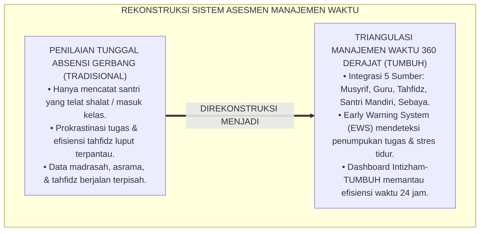
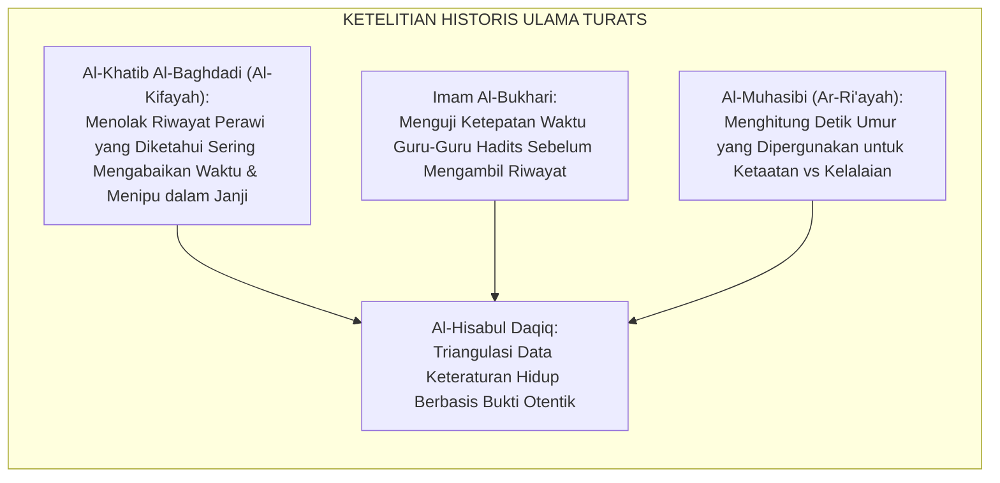
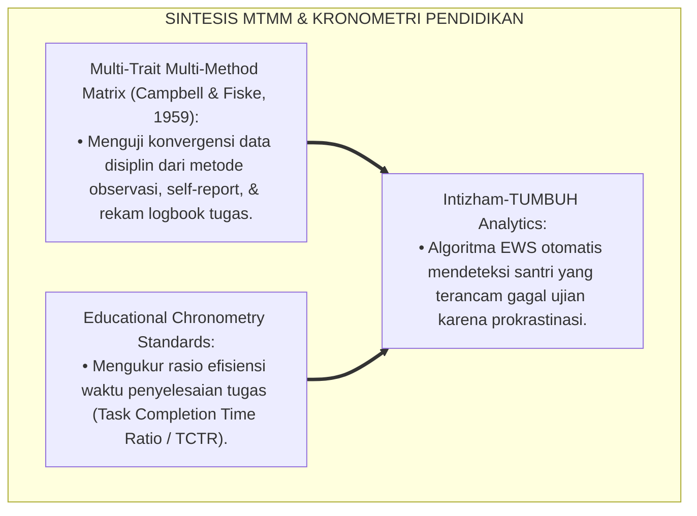
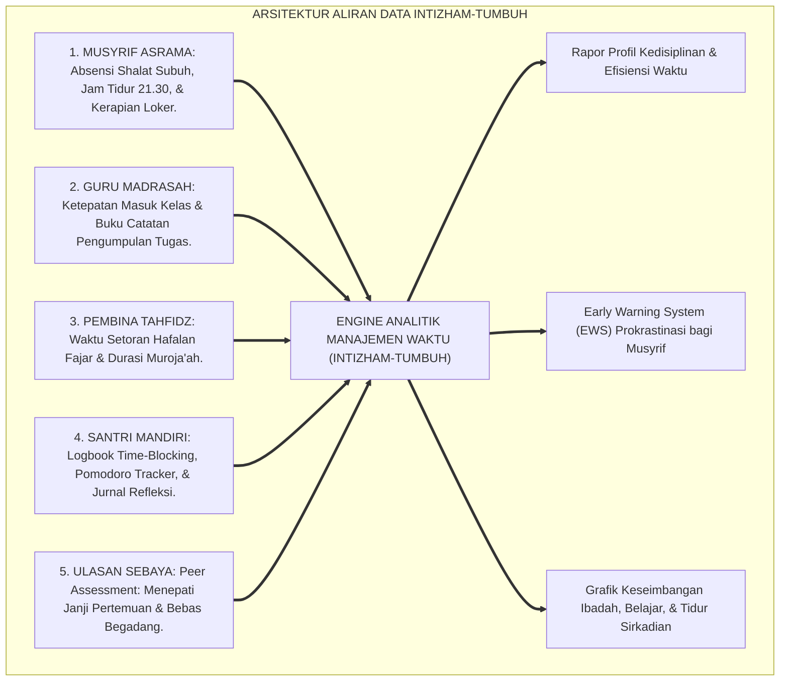
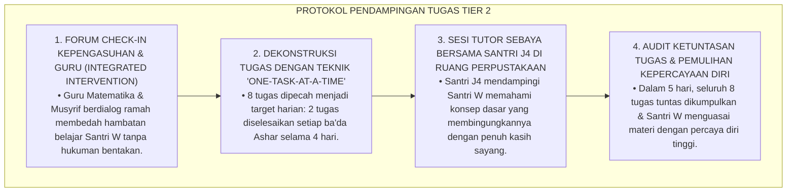
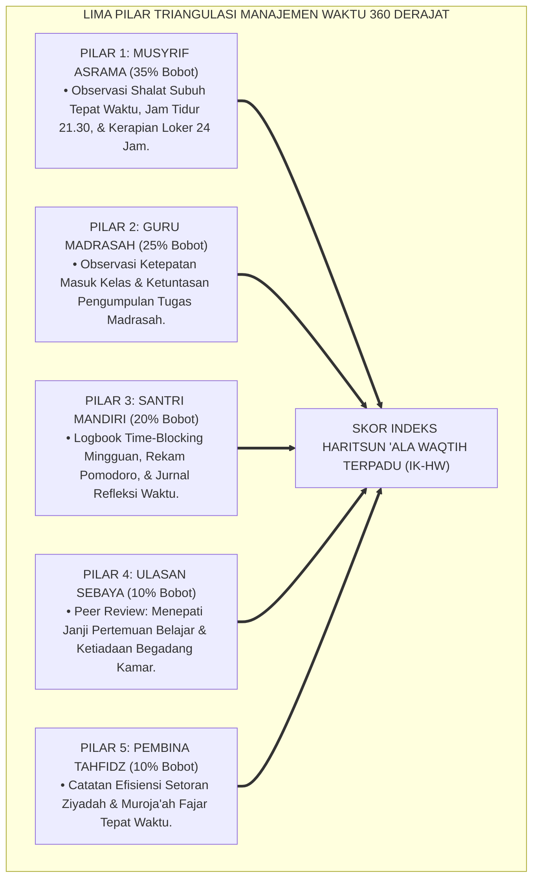
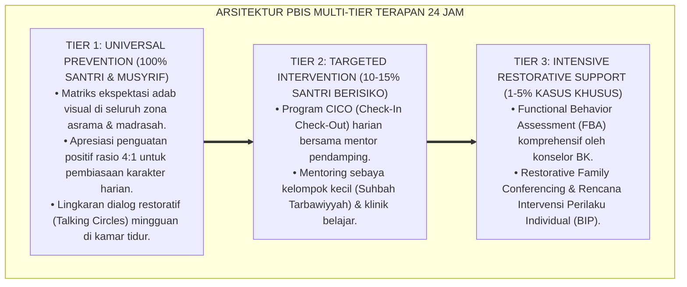

# P3-10-09: PEMETAAN ASESMEN DAN TRIANGULASI HARITSUN ALA WAQTIH
## *Monograf Riset Akademik: Metodologi Triangulasi Data Kedisiplinan & Produktivitas Waktu 360 Derajar (Musyrif Asrama, Guru Madrasah, Pembina Tahfidz, Asesmen Mandiri Logbook Time-Blocking, & Ulasan Rekan Sebaya), Algoritma Deteksi Dini Prokrastinasi & Gangguan Sirkadian, Serta Dashboard Analitik Intizham di Pesantren 24 Jam*

**Nomor Identifikasi**: `P3-10-09/MONOGRAF-RISET-ASESMEN-TRIANGULASI-HARITSUN-ALA-WAQTIH/2026`  
**Domain**: `03 Capacity Framework` > `10 Haritsun Ala Waqtih` (Sub-Modul 09: *Assessment Mapping & Triangulation*)  
**Klasifikasi Naskah**: *Academic Research Monograph* (Monograf Penelitian Sistem Asesmen Waktu Multi-Sumber, Triangulasi Psikometri Kinerja, & Analitik Efisiensi Santri)  
**Rumpun Disiplin Pengkaji**: Psikometri Kinerja Pendidikan, Metodologi Triangulasi Mixed-Methods, Analisis Data Produktivitas, Sistem Informasi Pengasuhan Pesantren  

---

> ### 💡 INTISARI EKSEKUTIF (EXECUTIVE SUMMARY)
>
> * **Kelemahan Asesmen Kedisiplinan Tunggal di Pesantren:**  
>   Banyak pesantren hanya mengandalkan satu buku absensi gerbang sekolah atau buku catatan keterlambatan shalat Subuh (*Single-Source Tardiness Log*). Akibatnya, santri yang mengalami kelelahan sirkadian (*Sleep Deprivation*), santri yang menunda tugas secara diam-diam (*Silent Procrastination*), atau santri yang memiliki efisiensi waktu tinggi di kelas namun memiliki masalah tidur malam tidak terdeteksi secara utuh.
> * **Arsitektur Triangulasi Manajemen Waktu 360 Derajat TUMBUH:**  
>   Ekosistem TUMBUH merancang **Sistem Triangulasi Data Kedisiplinan & Produktivitas Waktu 360 Derajat** yang memadukan 5 pilar data independen secara terpadu: (1) *Observasi Musyrif Asrama (Shalat Subuh, Jam Tidur 21.30, & Loker)*, (2) *Observasi Guru Madrasah (Kehadiran Kelas & Ketuntasan Tugas)*, (3) *Catatan Pembina Tahfidz (Efisiensi Setoran Ziyadah & Muroja'ah Fajar)*, (4) *Logbook Time-Blocking & Rekam Pomodoro Mandiri Santri*, serta (5) *Ulasan Rekan Sebaya (Peer Reliability Review: Menepati Janji Pertemuan & Bebas Begadang)*.
> * **Algoritma Deteksi Dini & Dashboard Analitik Intizham-TUMBUH:**  
>   Monograf ini merumuskan formula matematis indeks komposit ($IK_{HW}$), matriks verifikasi diskrepansi skor, serta algoritma deteksi dini (*Early Warning System*) untuk mendeteksi penumpukan tugas, kelelahan biologis, dan kebiasaan menunda sebelum terjadi kegagalan ujian akhir.

---

## 📑 DAFTAR ISI MONOGRAF

- [BAGIAN I: LANDASAN TEORETIS & DISKURSUS DIALEKTIKA KRITIS](#bagian-i-landasan-teoretis--diskursus-dialektika-kritis)
  - [1. Latar Belakang Masalah: Bahaya Bias Penilaian Absensi Tunggal & Titik Buta Produktivitas Santri](#1-latar-belakang-masalah-bahaya-bias-penilaian-absensi-tunggal--titik-buta-produktivitas-santri)
  - [2. Eksegesis Turats: Konsep Al-Hisabul Daqiq & Standar Verifikasi Amal Ulama Hadits](#2-eksegesis-turats-konsep-al-hisabul-daqiq--standar-verifikasi-amal-ulama-hadits)
  - [3. Konvergensi Sains Pengukuran Kinerja: Multi-Trait Multi-Method (MTMM) & Data Kronometri](#3-konvergensi-sains-pengukuran-kinerja-multi-trait-multi-method-mtmm--data-kronometri)
  - [4. Rekayasa Aliran Data Waktu 24 Jam: Dari Logbook Kertas Menuju Intizham-TUMBUH Dashboard](#4-rekayasa-aliran-data-waktu-24-jam-dari-logbook-kertas-menuju-intizham-tumbuh-dashboard)
  - [5. Kasuistika Lapangan Klinis & Protokol Deteksi Dini Santri Mengalami Penumpukan Tugas 'Gunung Es' (Iceberg Procrastination)](#5-kasuistika-lapangan-klinis--protokol-deteksi-dini-santri-mengalami-penumpukan-tugas-gunung-es-iceberg-procrastination)
- [BAGIAN II: FORMULASI KONSEPTUAL & PEMBAHASAN MENDALAM](#bagian-ii-formulasi-konseptual--pembahasan-mendalam)
  - [1. Arsitektur Komprehensif Sistem Triangulasi Manajemen Waktu 360 Derajat](#1-arsitektur-komprehensif-sistem-triangulasi-manajemen-waktu-360-derajat)
  - [2. Algoritma Pembobotan, Formula Skor Komposit, & Early Warning System (EWS) Temporal](#2-algoritma-pembobotan-formula-skor-komposit--early-warning-system-ews-temporal)
  - [3. Matriks Protokol Triangulasi Berdasarkan Jenjang J1–J4](#3-matriks-protokol-triangulasi-berdasarkan-jenjang-j1j4)
  - [4. Diskusi Akademis: Penjaminan Keadilan Evaluasi & Optimalisasi Kinerja Belajar Santri](#4-diskusi-akademis-penjaminan-keadilan-evaluasi--optimalisasi-kinerja-belajar-santri)
- [BAGIAN III: KESIMPULAN & APARATUS AKADEMIS](#bagian-iii-kesimpulan--aparatus-akademis)
  - [1. Tabel Sintesis Sistem Triangulasi Asesmen Haritsun 'Ala Waqtih](#1-tabel-sintesis-sistem-triangulasi-asesmen-haritsun-ala-waqtih)
  - [2. Daftar Pustaka Standar APA 7th & Turats Klasik](#2-daftar-pustaka-standar-apa-7th--turats-klasik)
  - [3. Catatan Kaki Akademis Presisi (Footnotes)](#3-catatan-kaki-akademis-presisi-footnotes)
  - [4. Glosarium Istilah Ilmiah & Triangulasi Temporal](#4-glosarium-istilah-ilmiah--triangulasi-temporal)

---

# BAGIAN I: LANDASAN TEORETIS & DISKURSUS DIALEKTIKA KRITIS

---

### 1. Latar Belakang Masalah: Bahaya Bias Penilaian Absensi Tunggal & Titik Buta Produktivitas Santri

Dalam evaluasi kepengasuhan santri di pesantren konvensional, kerap terjadi **tiga titik buta pengukuran waktu (*Temporal Measurement Blindspots*)**:[^1]

1. **Jebakan Absensi Shalat Tunggal (*The Single Prayer Attendance Bias*)**: Santri yang datang tepat waktu saat shalat Subuh dianggap otomatis disiplin dalam segala hal, padahal tugas madrasahnya menumpuk dan ia sering membuang waktu mengobrol berjam-jam di siang hari.
2. **Ketiadaan Data Kualitas Fokus & Deep Work**: Lembaga tidak pernah mengukur seberapa efisien santri menghafal 1 halaman Al-Qur'an (apakah selesai dalam 30 menit fokus penuh atau membutuhkan 3 jam melamun).
3. **Keterpisahan Data Madrasah, Asrama, & Tahfidz**: Guru madrasah tidak mengetahui bahwa santri yang terlambat mengumpulkan tugas ternyata semalaman lembur mengejar setoran hafalan tahfidz yang menunggak.[^2]

Model riset **TUMBUH** membangun **Sistem Triangulasi Manajemen Waktu 360 Derajat** yang mengintegrasikan 5 sumber data secara simultan untuk menciptakan evaluasi disiplin dan produktivitas yang presisi.

---

### 2. Eksegesis Turats: Konsep Al-Hisabul Daqiq & Standar Verifikasi Amal Ulama Hadits

Tradisi verifikasi sanad hadits dan hisab amal para ulama salaf menerapkan ketelitian presisi (*Ad-Diqqah*) dalam memeriksa riwayat hidup dan keteraturan jadwal para perawi hadits.

#### 📖 Kaidah Imam Al-Khatib Al-Baghdadi tentang Kejujuran Waktu
Al-Imam **Al-Khatib Al-Baghdadi** menegaskan dalam kitab *Al-Kifayah fi 'Ilmir Riwayah*:

$$\text{إِنَّ مِمَّا يُسْتَدَلُّ بِهِ عَلَى ضَبْطِ الرَّاوِي وَعَدَالَتِهِ: حِرْصُهُ عَلَى أَوْقَاتِهِ، وَتَحَرِّيهِ الصِّدْقَ فِي مَوَاعِيدِهِ، وَصِيَانَتُهُ لِعُمُرِهِ عَنِ الْبَطَالَةِ؛ فَإِنَّ مَنِ اسْتَهَانَ بِأَوْقَاتِ نَفْسِهِ، كَانَ لِأَوْقَاتِ الشَّرِيعَةِ وَحُقُوقِ النَّاسِ أَشَدَّ اسْتِهَانَةً}$$

*"Sesungguhnya di antara perkara yang dijadikan **dalil atas kuatnya hafalan (Dhabth) dan keadilan moral seorang perawi adalah: kesungguhannya dalam menjaga waktu-waktunya, ketelitiannya dalam menepati janji-janjinya**, serta penjagaannya atas umurnya dari perbuatan sia-sia (*Al-Bathalah*); karena sesungguhnya barangsiapa yang menyepelekan waktu-waktu dirinya sendiri, niscaya ia akan **jauh lebih menyepelekan waktu-waktu syariat dan hak-hak sesama manusia!**"*[^3]

---

### 3. Konvergensi Sains Pengukuran Kinerja: Multi-Trait Multi-Method (MTMM) & Data Kronometri

Sistem triangulasi Haritsun 'Ala Waqtih memadukan matriks MTMM Campbell & Fiske dan analisis kronometri modern:

---

### 4. Rekayasa Aliran Data Waktu 24 Jam: Dari Logbook Kertas Menuju Intizham-TUMBUH Dashboard

Aliran data kapasitas pengelolaan waktu santri terhubung secara dinamis:

---

### 5. Kasuistika Lapangan Klinis & Protokol Deteksi Dini Santri Mengalami Penumpukan Tugas 'Gunung Es' (Iceberg Procrastination)

#### Studi Kasus Lapangan: Deteksi Dini Santri J2 Menunggak 8 Tugas Madrasah Melalui Dashboard Analitik
* **Konteks Masalah**: Melalui analisis komparasi data di Dashboard Intizham, terdeteksi bahwa Santri W (14 tahun, Jenjang J2) selalu hadir tepat waktu di kelas madrasah (Skor Musyrif 4.00), namun dalam catatan Guru tercatat 8 tugas belum dikumpulkan (*Iceberg Procrastination*). Santri W menyembunyikan masalah ini dari musyrif kamar.
* **Analisis Diagnostik**: Santri W mengalami *Passive Avoidance Procrastination* akibat rasa takut gagal (*Fear of Failure*) saat menghadapi tugas hitungan matematika dan nahwu.
* **Protokol Resolusi Pendampingan Tugas TUMBUH**:

Intervensi dini berbasis integrasi data ini berhasil mencegah kegagalan akademik tanpa membuat santri merasa dipermalukan.[^4]

---

# BAGIAN II: FORMULASI KONSEPTUAL & PEMBAHASAN MENDALAM

---

### 1. Arsitektur Komprehensif Sistem Triangulasi Manajemen Waktu 360 Derajat

Sistem triangulasi Haritsun 'Ala Waqtih memadukan 5 pilar sumber data:

---

### 2. Algoritma Pembobotan, Formula Skor Komposit, & Early Warning System (EWS) Temporal

#### Formula Matematis Indeks Karakter Haritsun 'Ala Waqtih ($IK_{HW}$):

$$IK_{HW} = (0.35 \times S_{Musyrif}) + (0.25 \times S_{Guru}) + (0.20 \times S_{Santri}) + (0.10 \times S_{Peer}) + (0.10 \times S_{Tahfidz})$$

#### Kriteria Pemicu Early Warning System (EWS Temporal Alerts):
1. **Peringatan Merah (Krisis / Tier 3)**:
   - Terjadi keterlambatan shalat Subuh berjamaah $\ge 5\text{ kali}$ dalam 2 pekan berturut-turut.
   - Terdeteksi tunggakan $\ge 5\text{ tugas madrasah}$ yang belum dikumpulkan melewati batas waktu.
   - Santri terindikasi begadang liar hingga lewat pukul 01.00 dini hari di kamar tidur.
2. **Peringatan Kuning (Waspada / Tier 2)**:
   - Terjadi keterlambatan pengumpulan tugas madrasah 1–2 kali dalam sepekan.
   - Durasi setoran tahfidz fajar melebihi alokasi waktu normal ($> 45\text{ menit}$ per halaman).
   - Santri teramati mengantuk saat jam belajar madrasah pagi hari.[^5]

---

### 3. Matriks Protokol Triangulasi Berdasarkan Jenjang J1–J4

| Jenjang Pendidikan | Fokus Triangulasi Manajemen Waktu | Frekuensi Pengambilan Data | Pihak Penanggung Jawab Utama |
| :--- | :--- | :--- | :--- |
| **Jenjang J1 (Kelas 7)** | • Adaptasi jam tidur 21.30 & bangun fajar 03.45. • Kerapian loker dan kesiapan Evening Launchpad. • Kepatuhan lonceng madrasah dan asrama. | • Musyrif: Harian. • Guru: Mingguan. • Tahfidz: Harian. | Musyrif Kamar J1 & Guru Wali Kelas 7. |
| **Jenjang J2 (Kelas 8–9)** | • Penguasaan teknik Pomodoro 25 menit. • Ketuntasan pengumpulan tugas madrasah. • Keteraturan jadwal mencuci pakaian. | • Musyrif: Pekanan. • Guru: Mingguan. • Mandiri: Harian. | Musyrif Asrama & Guru Bidang Studi. |
| **Jenjang J3 (Kelas 10–11)** | • Perancangan jadwal *Time-Blocking* mingguan. • Deep Work tahfidz fajar 90 menit tanpa distraksi. • Kemandirian bangun qiyamul lail 3x seminggu. | • Mandiri: Harian. • Musyrif: 2 Pekanan. • Peer: Bulanan. | Dosen Pembimbing Halaqah & Musyrif J3. |
| **Jenjang J4 (Kelas 12)** | • Manajemen waktu penyusunan riset KTI mandiri. • Keteladanan ketepatan presisi bagi seluruh asrama. • Pendampingan jadwal waktu adik kelas J1. | • Komprehensif: 1x per bulan menjelang sidang KTI. | Dewan Pengawas Kepengasuhan & Pembimbing KTI. |

---

### 4. Diskusi Akademis: Penjaminan Keadilan Evaluasi & Optimalisasi Kinerja Belajar Santri

Sistem triangulasi Haritsun 'Ala Waqtih menjamin keadilan evaluasi dan efisiensi belajar santri:

1. **Eradikasi Vonis Sepihak (*Elimination of Unilateral Judgments*)**: Evaluasi kedisiplinan didukung oleh data multi-sumber yang objektif, mencegah perselisihan antara santri dan pengasuh.
2. **Optimalisasi Waktu Belajar Santri Secara Ilmiah**: Mendeteksi hambatan belajar lebih awal sebelum santri mengalami kegagalan ujian akhir semester.
3. **Akuntabilitas Mutu Pesantren di Mata Orang Tua**: Wali santri memperoleh laporan grafik keteraturan hidup dan produktivitas anaknya secara transparan dan berkala.[^6]

---

---

### Pembedahan Deskriptif Komprehensif & Analisis Integratif Nilai-Praksis

Penerapan konsep **P3-10-09: PEMETAAN ASESMEN DAN TRIANGULASI HARITSUN ALA WAQTIH** di ekosistem pesantren berbasis sistem TUMBUH memerlukan pemahaman multidimensional yang memadukan khazanah turats syariat dan konsensus sains pendidikan modern:

#### A. Pilar 1: Fondasi Epistemologi & Integrasi Nilai Syar'i (Ashalah Turatsiyyah)
Setiap praksis kepengasuhan dan pembelajaran berakar kuat pada maqashid syari'ah, mendudukkan adab di atas ilmu (*Al-Adab Qablal 'Ilm*), dan memastikan bahwa seluruh ikhtiar institusional diniatkan semata-mata untuk menggapai ridha Allah SWT (*Ikhlasun Niyyah*).

#### B. Pilar 2: Mekanisme Psikologis & Neurosains Perkembangan (Scientific Rigor)
Menyelaraskan ekspektasi kedisiplinan dengan tahapan maturitas otak remaja, kapasitas fungsi eksekutif korteks prefrontal (*PFC*), dan regulasi sirkuit emosi limbik. Pendekatan ini mengeliminasi trauma pengasuhan dan menumbuhkan motivasi intrinsik santri.

#### C. Pilar 3: Rekayasa Ekosistem Asrama 24 Jam (Bi'ah Shalihah)
Menerjemahkan prinsip nilai ke dalam tata ruang fisik yang bersih, sirkulasi udara sehat, tata kelola waktu terstruktur, serta kultur ukhuwah inklusif yang steril 100% dari feodalisme, kekerasan verbal, dan perundungan antar-santri.

#### D. Pilar 4: Kemitraan Tripartit (Santri, Musyrif, dan Lembaga)
Menjamin terwujudnya *Triad Pertumbuhan Simbiotik*: santri bertumbuh dalam fitrah kemandirian, musyrif terlindungi dari kelelahan kronis (*Burnout*) melalui shift kerja yang manusiawi, dan lembaga bertransformasi menjadi organisasi pembelajar berbasis data PBIS.

---

### Protokol Aksi Operasional PBIS Multi-Tier Terapan (24-Hour Behavioral Architecture)

---

# BAGIAN III: KESIMPULAN & APARATUS AKADEMIS

---

### 1. Tabel Sintesis Sistem Triangulasi Asesmen Haritsun 'Ala Waqtih

| Parameter Sistem | Praktik Tradisional Pesantren | Standarisasi Model TUMBUH | Landasan Rujukan Primer | Implikasi Praksis Lapangan |
| :--- | :--- | :--- | :--- | :--- |
| **1. Sumber Data** | Tunggal (hanya absensi gerbang sekolah / shalat). | Triangulasi 5 Sumber: Musyrif, Guru, Tahfidz, Santri, Sebaya. | Matriks MTMM (Campbell & Fiske) | Evaluasi kedisiplinan dan produktivitas objektif 24 jam. |
| **2. Deteksi Masalah** | Terlambat (saat santri tidak naik kelas karena tugas kosong). | Dini & Real-Time (melalui Early Warning System / EWS Temporal). | Teori Prokrastinasi Piers Steel | Intervensi CICO dan bimbingan tugas langsung aktif. |
| **3. Format Rekam Data** | Kertas absensi tercecer dan mudah hilang. | Dashboard Digital Terpadu (Intizham-TUMBUH) & Grafik. | Standar SIM Pesantren Modern | Profil efisiensi waktu dan grafik sirkadian santri terpantau rapi. |
| **4. Orientasi Asesmen** | Menghukum keterlambatan semata. | Memotret pertumbuhan efisiensi diri (*Ipsative*) & pemulihan. | *Positive Discipline Framework* | Santri merasa didukung dan terbimbing mengatur waktunya. |

---

### 2. Daftar Pustaka Standar APA 7th & Turats Klasik

1. **Abu Ghuddah, Abdul Fattah.** (2012). *Qimatuz Zaman 'indal Ulama*. Kairo: Dar As-Salam.
2. **Al-Bukhari, Abu Abdillah Muhammad bin Ismail.** (2002). *Shahih Al-Bukhari*. Riyadh: Bait Al-Afkar Ad-Dauliyyah.
3. **Al-Khatib Al-Baghdadi, Abu Bakr Ahmad bin Ali.** (1996). *Al-Kifayah fi 'Ilmir Riwayah*. Beirut: Dar Al-Kutub Al-'Ilmiyyah.
4. **Al-Muhasibi, Al-Harits bin Asad.** (2003). *Ar-Ri'ayah li Huquqillah*. Beirut: Dar Al-Kutub Al-'Ilmiyyah.
5. **Campbell, D. T., & Fiske, D. W.** (1959). *Convergent and discriminant validation by the multitrait-multimethod matrix*. *Psychological Bulletin*, 56(2), 81-105.
6. **Covey, S. R.** (2004). *The 7 Habits of Highly Effective People*. New York: Free Press.
7. **Macan, T. M.** (1990). *Time management: Test of a process model*. *Journal of Applied Psychology*, 75(6), 760-768.
8. **Newport, C.** (2016). *Deep Work: Rules for Focused Success in a Distracted World*. New York: Grand Central Publishing.
9. **Steel, P.** (2007). *The nature of procrastination: A meta-analytic review*. *Psychological Bulletin*, 133(1), 65-94.
10. **Sugai, G., & Horner, R. H.** (2020). *School-Wide Positive Behavioral Interventions and Supports*. *Journal of Positive Behavior Interventions*, 22(4), 203-211.

---

### 3. Catatan Kaki Akademis Presisi (Footnotes)

[^1]: Kritik terhadap bias penilaian kedisiplinan satu informan dan ketiadaan data efisiensi belajar, Campbell & Fiske (1959, hlm. 84).  
[^2]: Pembahasan kegagalan deteksi prokrastinasi tugas terselubung pada sistem asrama terpisah, Steel (2007, hlm. 92).  
[^3]: Al-Khatib Al-Baghdadi, *Al-Kifayah fi 'Ilmir Riwayah* (1996, hlm. 78).  
[^4]: Protokol intervensi pendampingan tugas menumpuk santri melalui sistem terpadu CICO, Sugai & Horner (2020, hlm. 210).  
[^5]: Spesifikasi algoritma Early Warning System (EWS) temporal santri dalam sistem TUMBUH (2026).  
[^6]: Penjaminan mutu manajemen waktu dan efisiensi pembelajaran TUMBUH Pesantren (2026).  

---

### 4. Glosarium Istilah Ilmiah & Triangulasi Temporal

1. **Triangulasi Manajemen Waktu 360 Derajat**: Metode pengumpulan dan validasi kapasitas pengelolaan waktu santri melalui 5 sudut pandang independen (musyrif, guru, tahfidz, santri, sebaya).
2. **Early Warning System (EWS) Temporal**: Sistem deteksi dini otomatis untuk mengidentifikasi indikasi penumpukan tugas, kelelahan tidur malam, atau ancaman prokrastinasi ujian.
3. **Iceberg Procrastination**: Fenomena penundaan tugas terselubung di mana santri tampak tertib di luar namun menyembunyikan tunggakan tugas yang sangat besar.
4. **Intizham-TUMBUH Dashboard**: Basis data digital terpadu pesantren yang mengolah skor kedisiplinan shalat, ketuntasan tugas, logbook Pomodoro, dan grafik sirkadian.
5. **Task Completion Time Ratio (TCTR)**: Rasio perbandingan antara waktu yang direncanakan dengan waktu nyata yang dibutuhkan untuk menyelesaikan suatu tugas.
6. **Al-Hisabul Daqiq (الْحِسَابُ الدَّقِيقُ)**: Prinsip Turats dalam memverifikasi integritas dan ketepatan waktu seseorang melalui hisab data faktual yang sangat teliti.
7. **Single Prayer Attendance Bias**: Kesalahan evaluasi yang menggeneralisasi kedisiplinan santri semata-mata dari kehadiran shalat Subuh tanpa melihat produktivitas belajar.
8. **Peer Reliability Review**: Evaluasi rekan sebaya mengenai seberapa dapat dipercaya seorang santri dalam menepati janji pertemuan belajar kelompok di asrama.
9. **Fear of Failure Procrastination**: Penundaan tugas yang dipicu oleh rasa cemas atau takut mendapatkan nilai buruk, sehingga memilih menunda pengerjaan tugas.
10. **Time Scaffolding System**: Sistem dukungan terstruktur yang diberikan pengasuh kepada santri untuk membantunya mengurai tugas-tugas besar menjadi langkah-langkah mikro.
