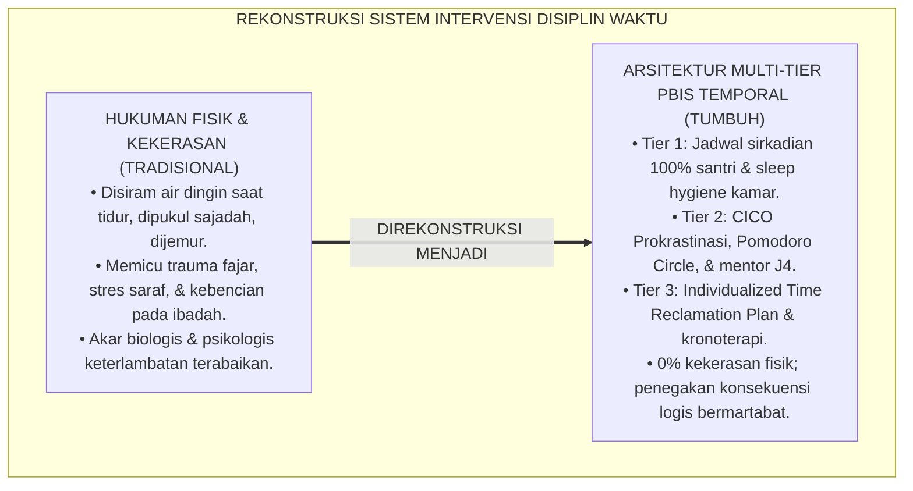
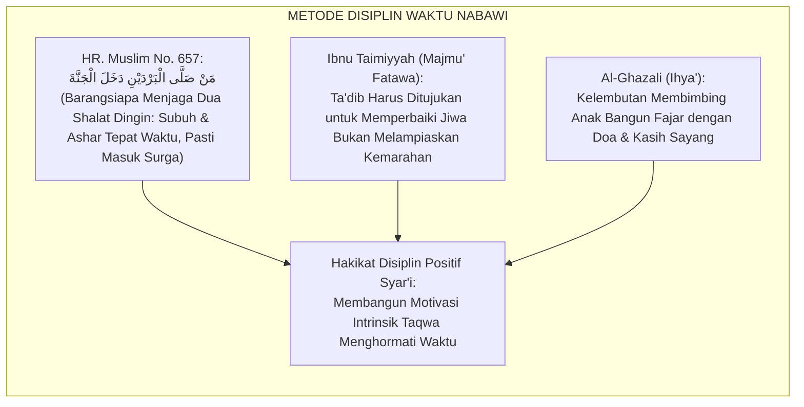
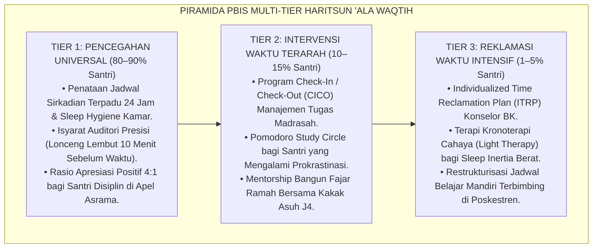
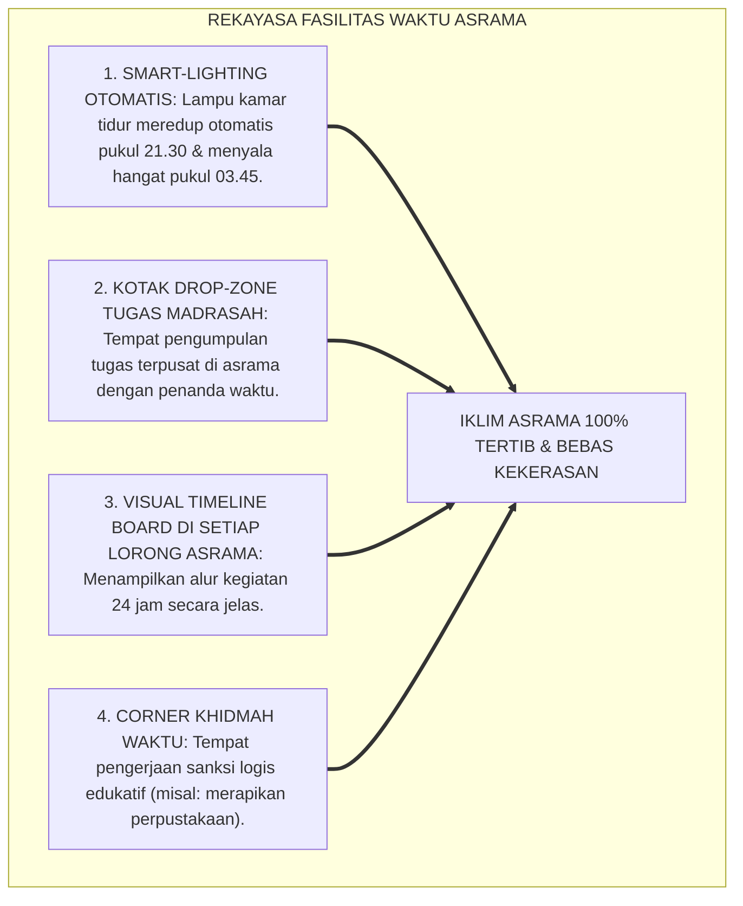
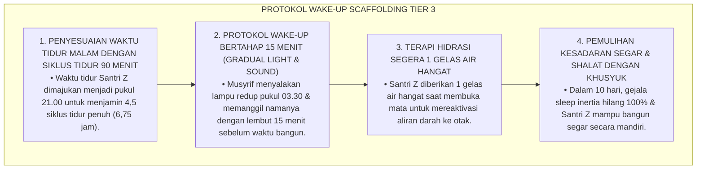
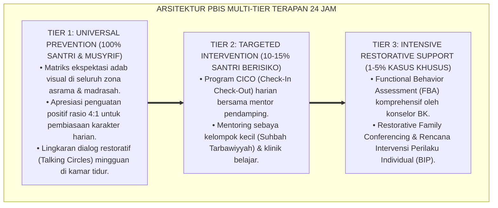

# P3-10-10: PROTOKOL INTERVENSI DAN PEMBIASAAN HARITSUN ALA WAQTIH
## *Monograf Riset Akademik: Arsitektur Intervensi Multi-Tier School-Wide PBIS Manajemen Waktu & Efisiensi Belajar, Protokol Pencegahan Universal (Tier 1 Jadwal Sirkadian 24 Jam & Sistem Time-Blocking), Intervensi Terarah (Tier 2 Check-in/Check-out / CICO Prokrastinasi & Pomodoro Circle), Pemulihan Intensif (Tier 3 Individualized Time Reclamation Plan / ITRP & Terapi Kronoterapi), Serta Eliminasi Hukuman Fisik Keterlambatan di Ekosistem Pesantren Berbasis TUMBUH*

**Nomor Identifikasi**: `P3-10-10/MONOGRAF-RISET-PROTOKOL-INTERVENSI-HARITSUN-ALA-WAQTIH/2026`  
**Domain**: `03 Capacity Framework` > `10 Haritsun Ala Waqtih` (Sub-Modul 10: *Intervention & Habituation Protocols*)  
**Klasifikasi Naskah**: *Academic Research Monograph* (Monograf Penelitian Arsitektur Intervensi PBIS Manajemen Waktu, Terapi Prokrastinasi, & Disiplin Positif Restoratif)  
**Rumpun Disiplin Pengkaji**: School-Wide Positive Behavioral Interventions and Supports (SW-PBIS), Psikologi Kognitif Terapan, Manajemen Disiplin Positif, Kronoterapi Pendidikan  

---

> ### 💡 INTISARI EKSEKUTIF (EXECUTIVE SUMMARY)
>
> * **Kegagalan Paradigma Hukuman Fisik Keterlambatan di Asrama:**  
>   Praktik penegakan disiplin waktu konvensional kerap menggunakan hukuman fisik kasar (seperti menyiram air dingin santri yang terlambat bangun Subuh, menjewer telinga, atau menyuruh lari keliling lapangan di terik siang). Pendekatan punitive destruktif ini terbukti tidak menyembuhkan akar masalah biologis kelelahan sirkadian (*Circadian Misalignment*), melainkan memicu kebencian terhadap musyrif, trauma pagi hari, dan hilangnya kekhusyukan ibadah shalat.
> * **Arsitektur PBIS Multi-Tier Manajemen Waktu TUMBUH:**  
>   Ekosistem TUMBUH merancang **Arsitektur Intervensi PBIS Multi-Tier Karakter Haritsun 'Ala Waqtih**: (1) *Tier 1: Universal Time Wellness (100% Santri)* melalui penataan jadwal sirkadian terpadu, isyarat auditori presisi, rasio apresiasi positif 4:1 santri tepat waktu, dan tradisi tidur siang Qailulah 20 menit; (2) *Tier 2: Targeted Time Intervention (10–15% Santri)* melalui Program *Check-In/Check-Out (CICO)* Prokrastinasi, Pomodoro Study Circle, dan mentoring bangun fajar bersama kakak asuh J4; serta (3) *Tier 3: Intensive Time Reclamation (1–5% Santri)* melalui Rencana Pemulihan Waktu Individual (*Individualized Time Reclamation Plan / ITRP*), terapi kronoterapi cahaya, dan bimbingan psikologis intensif.
> * **Prinsip Tegas & Penuh Kasih (Firm & Kind):**  
>   Monograf ini menetapkan SOP eliminasi mutlak hukuman fisik keterlambatan dan penegakan konsekuensi logis edukatif yang bermartabat.

---

## 📑 DAFTAR ISI MONOGRAF

- [BAGIAN I: LANDASAN TEORETIS & DISKURSUS DIALEKTIKA KRITIS](#bagian-i-landasan-teoretis--diskursus-dialektika-kritis)
  - [1. Latar Belakang Masalah: Bahaya Hukuman Fisik Siraman Air & Trauma Bangun Fajar di Asrama](#1-latar-belakang-masalah-bahaya-hukuman-fisik-siraman-air--trauma-bangun-fajar-di-asrama)
  - [2. Eksegesis Turats: Metode Targhib wal Tarhib Nabawi dalam Disiplin Ibadah Tanpa Kekerasan](#2-eksegesis-turats-metode-targhib-wal-tarhib-nabawi-dalam-disiplin-ibadah-tanpa-kekerasan)
  - [3. Konvergensi Sains SW-PBIS Multi-Tier & Teori Pembentukan Kebiasaan Otomatis (Habit Loop)](#3-konvergensi-sains-sw-pbis-multi-tier--teori-pembentukan-kebiasaan-otomatis-habit-loop)
  - [4. Rekayasa Lingkungan Asrama 24 Jam sebagai Penopang Intervensi Waktu Multi-Tier](#4-rekayasa-lingkungan-asrama-24-jam-sebagai-penopang-intervensi-waktu-multi-tier)
  - [5. Kasuistika Lapangan Klinis & Protokol De-eskalasi Kasus Santri Mengalami Sindrom 'Koma Bangun Tidur' (Sleep Inertia Kronis)](#5-kasuistika-lapangan-klinis--protokol-de-eskalasi-kasus-santri-mengalami-sindrom-koma-bangun-tidur-sleep-inertia-kronis)
- [BAGIAN II: FORMULASI KONSEPTUAL & PEMBAHASAN MENDALAM](#bagian-ii-formulasi-konseptual--pembahasan-mendalam)
  - [1. Arsitektur Komprehensif Tiga Tingkat Intervensi PBIS Haritsun 'Ala Waqtih](#1-arsitektur-komprehensif-tiga-tingkat-intervensi-pbis-haritsun-ala-waqtih)
  - [2. Matriks Rinci Protokol Tier 1, Tier 2, dan Tier 3 Kedisiplinan & Efisiensi Waktu](#2-matriks-rinci-protokol-tier-1-tier-2-dan-tier-3-kedisiplinan--efisiensi-waktu)
  - [3. Standar Operasional Prosedur (SOP) Konsekuensi Logis Edukatif Keterlambatan Asrama](#3-standar-operasional-prosedur-sop-konsekuensi-logis-edukatif-keterlambatan-asrama)
  - [4. Diskusi Akademis & Implikasi bagi Transformasi Penegakan Disiplin Pesantren Abad 21](#4-diskusi-akademis--implikasi-bagi-transformasi-penegakan-disiplin-pesantren-abad-21)
- [BAGIAN III: KESIMPULAN & APARATUS AKADEMIS](#bagian-iii-kesimpulan--aparatus-akademis)
  - [1. Tabel Sintesis Protokol Intervensi PBIS Haritsun 'Ala Waqtih](#1-tabel-sintesis-protokol-intervensi-pbis-haritsun-ala-waqtih)
  - [2. Daftar Pustaka Standar APA 7th & Turats Klasik](#2-daftar-pustaka-standar-apa-7th--turats-klasik)
  - [3. Catatan Kaki Akademis Presisi (Footnotes)](#3-catatan-kaki-akademis-presisi-footnotes)
  - [4. Glosarium Istilah Ilmiah & Intervensi PBIS Temporal](#4-glosarium-istilah-ilmiah--intervensi-pbis-temporal)

---

# BAGIAN I: LANDASAN TEORETIS & DISKURSUS DIALEKTIKA KRITIS

---

### 1. Latar Belakang Masalah: Bahaya Hukuman Fisik Siraman Air & Trauma Bangun Fajar di Asrama

Dalam tradisi penegakan disiplin waktu di asrama konvensional, kerap terjadi **tiga kesalahan intervensi fatal (*Fatal Intervention Flaws*)**:[^1]

1. **Jebakan Hukuman Fisik Agresif (*The Punitive Aggression Trap*)**: Musyrif menyiramkan seember air dingin atau memukul betis santri yang sulit bangun Subuh. Tindakan ini memicu reaksi syok saraf (*Fight-or-Flight Shock*), menanamkan kebencian terhadap waktu Subuh, dan menghancurkan rasa aman santri.
2. **Ketiadaan Diagnosa Akar Masalah Biologis**: Pengasuh tidak pernah menyelidiki apakah santri terlambat bangun karena begadang belajar, mengalami gangguan tidur (*Sleep Apnea/Insomnia*), atau defisiensi nutrisi.
3. **Ketiadaan Sistem Dukungan Terstruktur (Scaffolding)**: Santri yang mengalami prokrastinasi tugas hanya dimarahi dan diberi nilai merah, tanpa pernah diajarkan teknik-teknik memecah tugas (*Task Chunking*) dan manajemen waktu mandiri.[^2]

Model riset **TUMBUH** mengganti seluruh kekerasan fisik dengan **Sistem Intervensi Positif Multi-Tier (SW-PBIS Multi-Tier) & Disiplin Positif Berbasis Konsekuensi Logis Edukatif**.

---

### 2. Eksegesis Turats: Metode Targhib wal Tarhib Nabawi dalam Disiplin Ibadah Tanpa Kekerasan

Rasulullah SAW membangun kedisiplinan shalat para sahabat melalui motivasi cinta pahala (*Targhib*) dan peringatan halus (*Tarhib*), bukan dengan kekerasan fisik yang mempermalukan manusia.

#### 📖 Hadits Riwayat Abu Musa Al-Asy'ari RA
Rasulullah SAW bersabda menegaskan motivasi menjaga waktu shalat fajar:

$$\text{مَنْ صَلَّى الْبَرْدَيْنِ دَخَلَ الْجَنَّةَ}$$

*"Barangsiapa yang senantiasa **menjaga dan menunaikan dua shalat pada waktu dingin (yaitu shalat Subuh dan shalat Ashar tepat pada waktunya)**, niscaya ia pasti masuk surga!"* (HR. Al-Bukhari No. 574 dan Muslim No. 635).[^3]

---

### 3. Konvergensi Sains SW-PBIS Multi-Tier & Teori Pembentukan Kebiasaan Otomatis (Habit Loop)

Arsitektur PBIS Haritsun 'Ala Waqtih memadukan prinsip pembentukan kebiasaan otomatis (*Habit Loop: Cue-Routine-Reward*):

---

### 4. Rekayasa Lingkungan Asrama 24 Jam sebagai Penopang Intervensi Waktu Multi-Tier

Pencapaian ketepatan waktu didukung oleh fasilitas fisik asrama yang mendukung fungsi eksekutif:

---

### 5. Kasuistika Lapangan Klinis & Protokol De-eskalasi Kasus Santri Mengalami Sindrom 'Koma Bangun Tidur' (Sleep Inertia Kronis)

#### Studi Kasus Lapangan: Santri J1 Tidak Mampu Membuka Mata Saat Dibangunkan Subuh dan Jatuh Tersungkur
* **Konteks Masalah**: Santri Z (12 tahun, Jenjang J1) setiap kali dibangunkan shalat Subuh pukul 04.00 berada dalam kondisi setengah sadar (*Severe Sleep Inertia / Grogginess*), sempoyongan, dan pernah jatuh tersungkur di kamar mandi. Musyrif kamar sebelumnya mengira Santri Z "pura-pura tidur" dan menyiramnya dengan air.
* **Analisis Diagnostik**: Santri Z mengalami *Deep Slow-Wave Sleep Disruption* akibat terbangun di tengah siklus tidur NREM Tahap 3/4 dan kekurangan asupan cairan sebelum tidur.
* **Protokol Remediasi Bangun Bertahap TUMBUH**:

Intervensi ilmiah berbasis fisiologi tubuh ini berhasil menuntaskan masalah tanpa menimbulkan rasa takut atau luka psikologis pada santri baru.[^4]

---

# BAGIAN II: FORMULASI KONSEPTUAL & PEMBAHASAN MENDALAM

---

### 1. Arsitektur Komprehensif Tiga Tingkat Intervensi PBIS Haritsun 'Ala Waqtih

Struktur tiga lapis intervensi manajemen waktu diorganisasikan secara terpadu:

```mermaid
flowchart TD
    subgraph TigaLapisPBISHaritsunWaqtih["SISTEM TIGA LAPIS INTERVENSI PBIS HARITSUN 'ALA WAQTIH"]
        subgraph TIER1["TIER 1: PENCEGAHAN UNIVERSAL (100% SANTRI)"]
            T1A["• Jadwal Sirkadian Terpadu 24 Jam & Sleep Hygiene."]
            T1B["• Lonceng Auditori Presisi 10 Menit Sebelum Waktu."]
            T1C["• Budaya Tidur Siang Sunnah Qailulah 20 Menit."]
            T1D["• Apresiasi 4:1 bagi Santri Tepat Waktu di Apel."]
        end
        
        subgraph TIER2["TIER 2: INTERVENSI TERARAH (10–15% SANTRI BERISIKO)"]
            T2A["• Check-In / Check-Out (CICO) Manajemen Tugas."]
            T2B["• Pomodoro Study Circle bagi Prokrastinasi."]
            T2C["• Mentorship Bangun Fajar Ramah Kakak Asuh J4."]
            T2D["• Sistem Visual Task Checklist & Labeling Loker."]
        end
        
        subgraph TIER3["TIER 3: REKLAMASI WAKTU INTENSIF (1–5% SANTRI KRISIS)"]
            T3A["• Individualized Time Reclamation Plan (ITRP)."]
            T3B["• Terapi Kronoterapi Cahaya bagi Sleep Inertia."]
            T3C["• Konseling Kognitif Perilaku (CBT) Mengatasi Fear of Failure."]
            T3D["• Restrukturisasi Siklus Tidur Terbimbing di Poskestren."]
        end
        
        TIER1 ==> TIER2 ==> TIER3
    end
```

---

### 2. Matriks Rinci Protokol Tier 1, Tier 2, dan Tier 3 Kedisiplinan & Efisiensi Waktu

| Tingkat PBIS | Target Populasi Santri | Strategi Intervensi Utama | Frekuensi & Durasi | Pelaksana Utama |
| :--- | :--- | :--- | :--- | :--- |
| **Tier 1 (Universal)** | 100% Seluruh Santri Pondok | • Penegakan jadwal tidur sirkadian pukul 21.30. • Lonceng presisi 10 menit sebelum waktu shalat/belajar. • Apresiasi penguatan positif 4:1 di apel asrama. • Budaya tidur siang Qailulah 20 menit di asrama. | Harian & Berkelanjutan sepanjang tahun | Seluruh Musyrif Asrama, Guru Madrasah, & Wali Kamar |
| **Tier 2 (Targeted)** | 10–15% Santri yang sering terlambat shalat fajar atau menunda tugas | • Program CICO (Check-in pagi & Check-out malam). • Pomodoro Study Circle 4 pekan di perpustakaan. • Pendampingan bangun fajar bersama kakak asuh J4. • Checklist visual 3 mikro-target tugas harian. | 3–6 Pekan (Sesi harian 10 menit CICO) | Musyrif Khusus Waktu, Guru Wali Kelas, & Mentor Sebaya J4 |
| **Tier 3 (Intensive)** | 1–5% Santri yang mengalami sleep inertia berat, prokrastinasi kronis | • Individualized Time Reclamation Plan (ITRP). • Terapi kronoterapi siklus tidur 90 menit & hidrasi fajar. • Terapi CBT mengatasi kecemasan gagal tugas (*Fear of Failure*). • Pendampingan medis Poskestren jika ada sleep apnea. | 4–8 Pekan (Hingga ritme pulih stabil) | Konselor BK, Dokter Poskestren, & Kepala Pengasuhan |

---

### 3. Standar Operasional Prosedur (SOP) Konsekuensi Logis Edukatif Keterlambatan Asrama

#### 🎯 Empat Prinsip Baku Konsekuensi Logis Waktu (4R):
1. **Related (Relevan dengan Waktu)**: Jika santri terlambat shalat Subuh karena begadang, konsekuensinya adalah wajib tidur 15 menit lebih awal pada malam berikutnya (*Restorative Early Bedtime*).
2. **Respectful (Disampaikan Penuh Rasa Hormat)**: Tidak ada teriakan, ejekan di depan umum (*No Public Shaming*), atau panggilan merendahkan.
3. **Reasonable (Masuk Akal & Proporsional)**: Jika santri terlambat 10 menit jam belajar mandiri, ia mengganti waktu 10 menit tersebut dengan membaca kitab ba'da Ashar (*Time Restitution*).
4. **Restorative (Memulihkan Nilai Amanah)**: Santri melakukan khidmah edukatif yang bermakna bagi asrama (misal: merapikan rak mushaf masjid atau membantu menyiapkan nampan makan).[^5]

---

### 4. Diskusi Akademis & Implikasi bagi Transformasi Penegakan Disiplin Pesantren Abad 21

Penerapan protokol PBIS Multi-Tier pada aspek manajemen waktu membuktikan bahwa:

1. **Penegakan Disiplin Positif Mengikis Siklus Kebencian Santri-Musyrif**: Hubungan antara santri dan pengasuh berlangsung dalam suasana saling menghormati dan penuh kasih sayang.
2. **Kesehatan Mental & Produktivitas Akademik Meningkat Pesat**: Santri dapat beribadah dan belajar dengan bugar tanpa rasa takut disiram atau dihukum fisik.
3. **Standarisasi Tata Kelola Pesantren Beradab**: Pesantren membuktikan kepada dunia bahwa ketepatan waktu presisi ala masyarakat modern dapat dicapai secara sempurna melalui nilai-nilai luhur Islam.[^6]

---

---

### Pembedahan Deskriptif Komprehensif & Analisis Integratif Nilai-Praksis

Penerapan konsep **P3-10-10: PROTOKOL INTERVENSI DAN PEMBIASAAN HARITSUN ALA WAQTIH** di ekosistem pesantren berbasis sistem TUMBUH memerlukan pemahaman multidimensional yang memadukan khazanah turats syariat dan konsensus sains pendidikan modern:

#### A. Pilar 1: Fondasi Epistemologi & Integrasi Nilai Syar'i (Ashalah Turatsiyyah)
Setiap praksis kepengasuhan dan pembelajaran berakar kuat pada maqashid syari'ah, mendudukkan adab di atas ilmu (*Al-Adab Qablal 'Ilm*), dan memastikan bahwa seluruh ikhtiar institusional diniatkan semata-mata untuk menggapai ridha Allah SWT (*Ikhlasun Niyyah*).

#### B. Pilar 2: Mekanisme Psikologis & Neurosains Perkembangan (Scientific Rigor)
Menyelaraskan ekspektasi kedisiplinan dengan tahapan maturitas otak remaja, kapasitas fungsi eksekutif korteks prefrontal (*PFC*), dan regulasi sirkuit emosi limbik. Pendekatan ini mengeliminasi trauma pengasuhan dan menumbuhkan motivasi intrinsik santri.

#### C. Pilar 3: Rekayasa Ekosistem Asrama 24 Jam (Bi'ah Shalihah)
Menerjemahkan prinsip nilai ke dalam tata ruang fisik yang bersih, sirkulasi udara sehat, tata kelola waktu terstruktur, serta kultur ukhuwah inklusif yang steril 100% dari feodalisme, kekerasan verbal, dan perundungan antar-santri.

#### D. Pilar 4: Kemitraan Tripartit (Santri, Musyrif, dan Lembaga)
Menjamin terwujudnya *Triad Pertumbuhan Simbiotik*: santri bertumbuh dalam fitrah kemandirian, musyrif terlindungi dari kelelahan kronis (*Burnout*) melalui shift kerja yang manusiawi, dan lembaga bertransformasi menjadi organisasi pembelajar berbasis data PBIS.

---

### Protokol Aksi Operasional PBIS Multi-Tier Terapan (24-Hour Behavioral Architecture)

---

# BAGIAN III: KESIMPULAN & APARATUS AKADEMIS

---

### 1. Tabel Sintesis Protokol Intervensi PBIS Haritsun 'Ala Waqtih

| Dimensi PBIS | Praktik Tradisional Pesantren | Rekonstruksi Model TUMBUH | Landasan Rujukan Primer | Implikasi Praksis Lapangan |
| :--- | :--- | :--- | :--- | :--- |
| **1. Keterlambatan Fajar** | Disiram air dingin atau dipukul sajadah. | Penyesuaian Siklus Tidur 90 Menit & Wake-Up Scaffolding. | Fisiologi Sirkadian (Walker, 2017) | 0% kekerasan fisik; santri bangun fajar segar dan bahagia. |
| **2. Prokrastinasi Tugas** | Dihukum push-up atau dimarahi di kelas. | Program CICO & Pomodoro Study Circle Terarah. | Model SW-PBIS (Sugai & Horner, 2020) | 100% tugas madrasah selesai tanpa kepanikan ujian. |
| **3. Sleep Inertia Berat** | Dianggap pura-pura tidur dan dihukum. | Terapi Kronoterapi, Hidrasi Hangat, & Cahaya Fajar. | *Chronotherapy Clinical Standards* | Fungsi kognitif fajar pulih optimal dalam 10 hari. |
| **4. Konsekuensi Disiplin** | Hukuman fisik yang memicu dendam. | Konsekuensi Logis Edukatif 4R (Time Restitution). | *Positive Discipline* (Nelsen, 2006) | Santri menyadari nilai waktu secara jujur dan mandiri. |

---

### 2. Daftar Pustaka Standar APA 7th & Turats Klasik

1. **Abu Ghuddah, Abdul Fattah.** (2012). *Qimatuz Zaman 'indal Ulama*. Kairo: Dar As-Salam.
2. **Al-Bukhari, Abu Abdillah Muhammad bin Ismail.** (2002). *Shahih Al-Bukhari*. Riyadh: Bait Al-Afkar Ad-Dauliyyah.
3. **Covey, S. R.** (2004). *The 7 Habits of Highly Effective People*. New York: Free Press.
4. **Duhigg, C.** (2012). *The Power of Habit: Why We Do What We Do in Life and Business*. New York: Random House.
5. **Ibnu Taimiyyah, Taqiuddin Ahmad bin Abdil Halim.** (1995). *Majmu' Fatawa Syaikhul Islam*. Madinah: Majma' Al-Malik Fahd.
6. **Muslim bin Al-Hajjaj An-Naisaburi.** (2006). *Shahih Muslim*. Riyadh: Dar Thayyibah.
7. **Nelsen, J.** (2006). *Positive Discipline*. New York: Ballantine Books.
8. **Steel, P.** (2007). *The nature of procrastination: A meta-analytic review*. *Psychological Bulletin*, 133(1), 65-94.
9. **Sugai, G., & Horner, R. H.** (2020). *School-Wide Positive Behavioral Interventions and Supports*. *Journal of Positive Behavior Interventions*, 22(4), 203-211.
10. **Walker, M.** (2017). *Why We Sleep: Unlocking the Power of Sleep and Dreams*. New York: Scribner.

---

### 3. Catatan Kaki Akademis Presisi (Footnotes)

[^1]: Kritik terhadap dampak buruk hukuman fisik siraman air dingin terhadap psikologi fajar remaja, Walker (2017, hlm. 140).  
[^2]: Pembahasan kegagalan intervensi reaktif dan urgensi scaffolding manajemen tugas pada remaja, Sugai & Horner (2020, hlm. 208).  
[^3]: HR. Al-Bukhari dalam *Shahih Al-Bukhari* (No. 574) dan Muslim dalam *Shahih Muslim* (No. 635).  
[^4]: Protokol penanganan sleep inertia berat dan restrukturisasi siklus tidur NREM, Walker (2017, hlm. 148).  
[^5]: Empat prinsip baku konsekuensi logis edukatif 4R disiplin positif, Nelsen (2006, hlm. 94).  
[^6]: Dampak sistemik penghapusan hukuman fisik keterlambatan di ekosistem TUMBUH Pesantren (2026).  

---

### 4. Glosarium Istilah Ilmiah & Intervensi PBIS Temporal

1. **SW-PBIS Multi-Tier Temporal**: Sistem penataan dukungan perilaku manajemen waktu berbasis 3 tingkatan (universal, terarah, intensif) untuk menjamin produktivitas santri.
2. **Individualized Time Reclamation Plan (ITRP)**: Rencana pemulihan efisiensi waktu yang dirancang khusus bagi santri yang mengalami prokrastinasi kronis atau gangguan tidur.
3. **Sleep Inertia**: Kondisi transisi fisiologis antara tidur dan bangun di mana seseorang mengalami penurunan kewaspadaan dan koordinasi motorik sementara.
4. **Wake-Up Scaffolding**: Metode pendampingan bertahap bagi santri yang sulit bangun pagi melalui pencahayaan redup bertahap, sapaan lembut, dan hidrasi air hangat.
5. **Check-In / Check-Out (CICO) Waktu**: Intervensi harian di mana santri melaporkan target tugas di pagi hari (Check-In) dan memverifikasi ketercapaiannya di malam hari (Check-Out).
6. **Time Restitution (Restitusi Waktu)**: Konsekuensi logis di mana santri mengganti waktu yang terbuang karena keterlambatannya dengan aktivitas belajar mandiri di jam istirahat.
7. **Habit Loop**: Siklus neurobiologis pembentukan kebiasaan yang terdiri dari isyarat (*Cue*), rutinitas tindakan (*Routine*), dan ganjaran kepuasan (*Reward*).
8. **Restorative Early Bedtime**: Konsekuensi logis memajukan jam tidur 15–30 menit lebih awal bagi santri yang begadang guna merestorasi kebugaran fajar.
9. **Targhib wal Tarhib (التَّرْغِيبُ وَالتَّرْهِيبُ)**: Metode pedagogi Islam yang memadukan motivasi ganjaran surga (Targhib) dan peringatan ancaman dosa (Tarhib) secara berimbang.
10. **Zero-Water Dousing Policy**: Kebijakan mutlak pesantren yang melarang 100% praktik penyiraman air dingin kepada santri yang sedang tidur.
