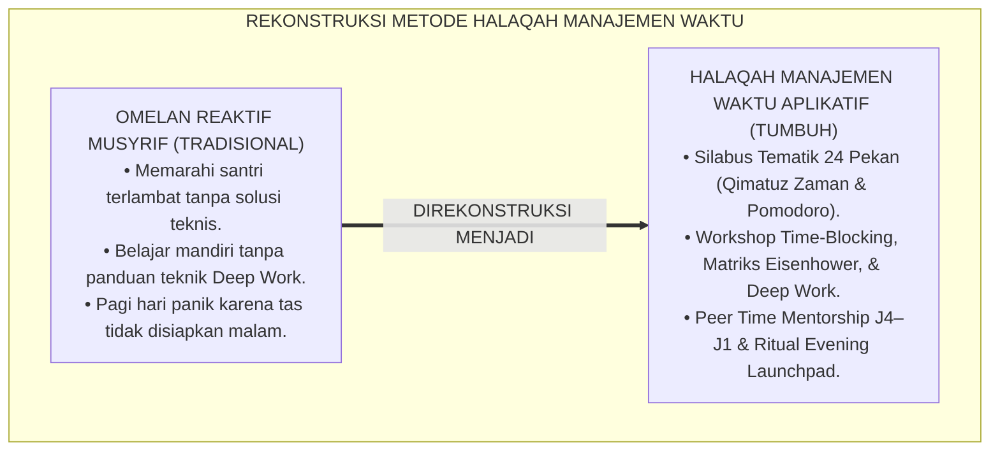
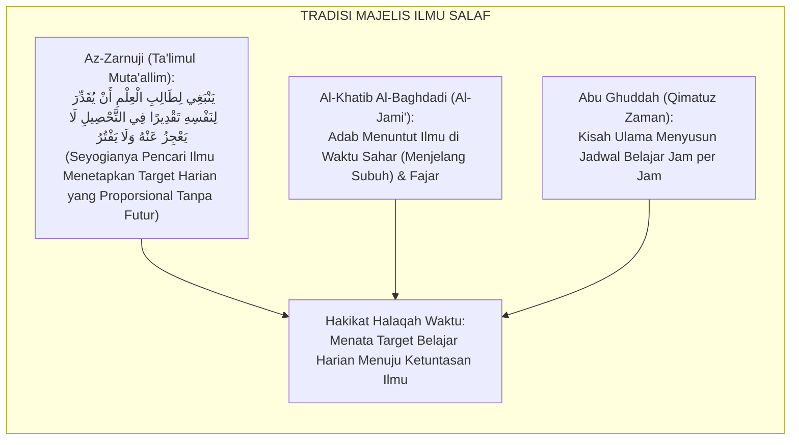
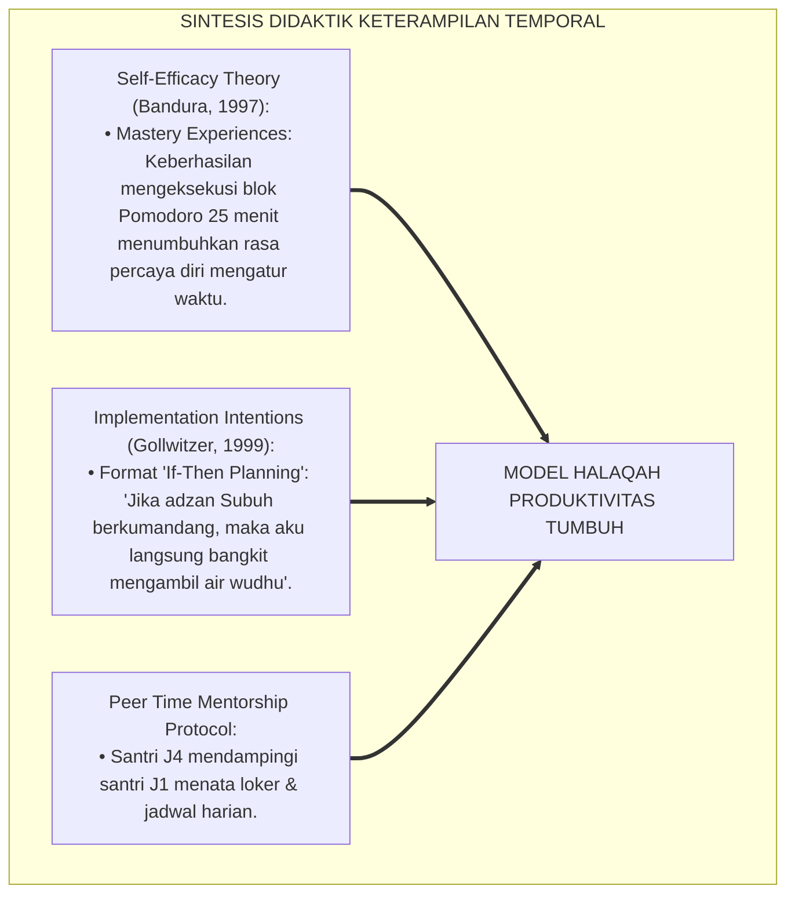
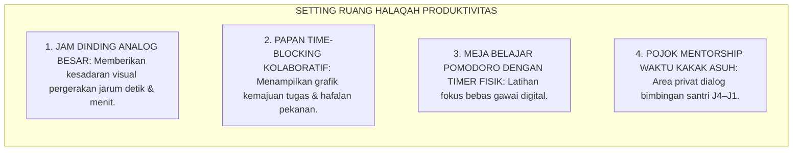
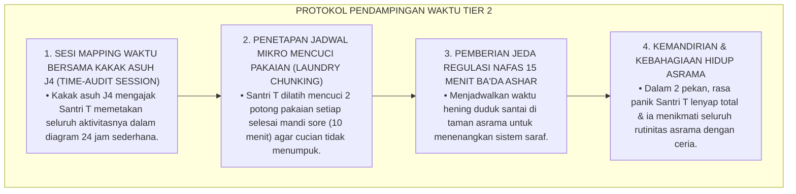
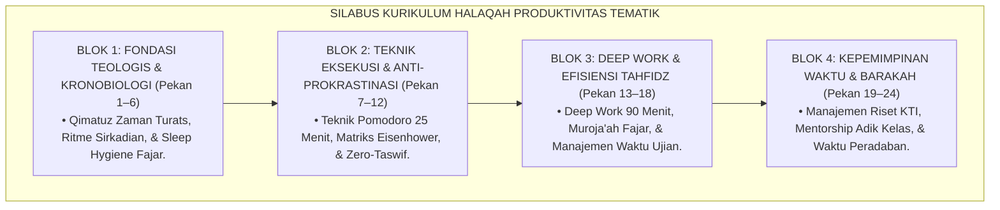
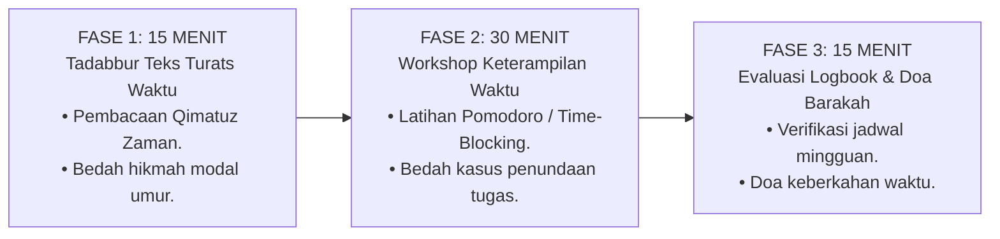
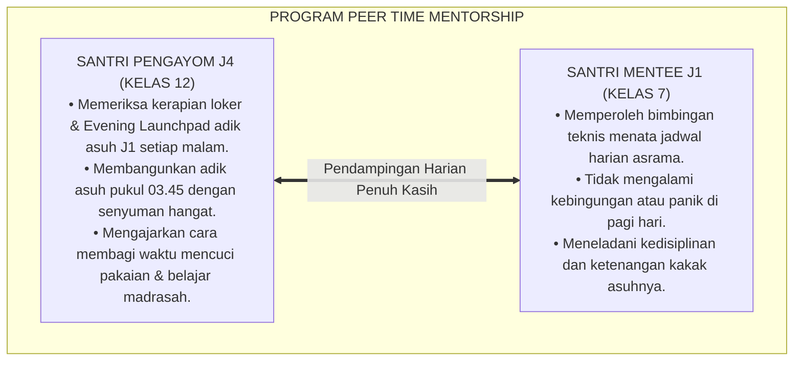

# P3-10-11: PROGRAM PEMBINAAN DAN HALAQAH HARITSUN ALA WAQTIH
## *Monograf Riset Akademik: Desain Kurikulum Halaqah Manajemen Waktu & Produktivitas Tematik 24 Pekan, Integrasi Kajian Kitab Qimatuz Zaman & Tartibul Aurad Ihya', Program Pembiasaan Deep Work Fajar & Muroja'ah Ba'da Maghrib, Program Mentorship Waktu Kakak Asuh J4–J1, Serta Ritual Evening Launchpad di Pesantren 24 Jam*

**Nomor Identifikasi**: `P3-10-11/MONOGRAF-RISET-HALAQAH-PEMBINAAN-HARITSUN-ALA-WAQTIH/2026`  
**Domain**: `03 Capacity Framework` > `10 Haritsun Ala Waqtih` (Sub-Modul 11: *Coaching Programs & Halaqah*)  
**Klasifikasi Naskah**: *Academic Research Monograph* (Monograf Penelitian Desain Kurikulum Halaqah Produktivitas, Pedagogi Waktu Pesantren, & Model Mentorship Temporal)  
**Rumpun Disiplin Pengkaji**: Desain Kurikulum Non-Formal Pesantren, Pedagogi Manajemen Waktu Islami, Psikologi Pembiasaan Produktivitas, Manajemen Asrama 24 Jam  

---

> ### 💡 INTISARI EKSEKUTIF (EXECUTIVE SUMMARY)
>
> * **Kelesuan Pembinaan Produktivitas Asrama Konvensional:**  
>   Sesi pengarahan malam di asrama sering kali hanya berupa omelan satu arah (*Repetitive Scolding*) mengenai santri yang terlambat shalat, tanpa pernah menyajikan kurikulum terstruktur yang mengajarkan santri teknik-teknik mengelola waktu, membedah kitab *Qimatuz Zaman*, atau melatih santri merancang jadwal *Time-Blocking* mingguan secara aplikatif.
> * **Inovasi Kurikulum Halaqah Produktivitas Tematik 24 Pekan TUMBUH:**  
>   Ekosistem TUMBUH merancang **Silabus Kurikulum Halaqah Manajemen Waktu Tematik 24 Pekan Terstruktur** dengan formula waktu presisi 60 menit: (1) *15 Menit Tilawah & Tadabbur Teks Turats Nilai Waktu (Qimatuz Zaman / Shaidul Khatir)*, (2) *30 Menit Workshop Keterampilan Temporal & Studi Kasus Prokrastinasi (Pomodoro / Matriks Eisenhower)*, dan (3) *15 Menit Sesi Evaluasi Logbook Time-Blocking & Doa Barakah*.
> * **Program Mentorship Waktu Kakak Asuh J4–J1 & Ritual Evening Launchpad:**  
>   Program ini diperkuat oleh sistem pendampingan manajemen waktu (*Peer Time Mentorship*) di mana setiap santri kelas 12 (J4) mendampingi 2 santri kelas 7 (J1) dalam menata loker, membiasakan ritual *Evening Launchpad* sebelum tidur, dan membangunkan fajar dengan kehangatan kasih sayang.

---

## 📑 DAFTAR ISI MONOGRAF

- [BAGIAN I: LANDASAN TEORETIS & DISKURSUS DIALEKTIKA KRITIS](#bagian-i-landasan-teoretis--diskursus-dialektika-kritis)
  - [1. Latar Belakang Masalah: Bahaya Omelan Reaktif Musyrif vs Kebutuhan Pelatihan Keterampilan Waktu Terstruktur](#1-latar-belakang-masalah-bahaya-omelan-reaktif-musyrif-vs-kebutuhan-pelatihan-keterampilan-waktu-terstruktur)
  - [2. Eksegesis Turats: Majelis Tadarus Ilmu & Tradisi Pembagian Waktu Belajar Salafush Shalih](#2-eksegesis-turats-majelis-tadarus-ilmu--tradisi-pembagian-waktu-belajar-salafush-shalih)
  - [3. Konvergensi Sains Desain Instruksional: Workshop Keterampilan Temporal & Teori Efikasi Diri (Self-Efficacy)](#3-konvergensi-sains-desain-instruksional-workshop-keterampilan-temporal--teori-efikasi-diri-self-efficacy)
  - [4. Rekayasa Ekologi Ruang Halaqah Asrama: Papan Time-Blocking Visual, Jam Analog, & Suasana Kolaboratif](#4-rekayasa-ekologi-ruang-halaqah-asrama-papan-time-blocking-visual-jam-analog--suasana-kolaboratif)
  - [5. Kasuistika Lapangan Klinis & Protokol Pendampingan Santri Mengalami Sindrom 'Kewalahan Jadwal' (Time Overwhelm)](#5-kasuistika-lapangan-klinis--protokol-pendampingan-santri-mengalami-sindrom-kewalahan-jadwal-time-overwhelm)
- [BAGIAN II: FORMULASI KONSEPTUAL & PEMBAHASAN MENDALAM](#bagian-ii-formulasi-konseptual--pembahasan-mendalam)
  - [1. Silabus Kurikulum Halaqah Manajemen Waktu Tematik 24 Pekan Komprehensif](#1-silabus-kurikulum-halaqah-manajemen-waktu-tematik-24-pekan-komprehensif)
  - [2. Protokol Struktur Sesi Halaqah 60 Menit Berbasis Workshop Aplikatif](#2-protokol-struktur-sesi-halaqah-60-menit-berbasis-workshop-aplikatif)
  - [3. Desain Program Peer Time Mentorship (Kakak Asuh J4 Mendampingi Manajemen Waktu Santri J1)](#3-desain-program-peer-time-mentorship-kakak-asuh-j4-mendampingi-manajemen-waktu-santri-j1)
  - [4. Diskusi Akademis: Implikasi Budaya Evening Launchpad bagi Ketenangan Fajar Santri](#4-diskusi-akademis-implikasi-budaya-evening-launchpad-bagi-ketenangan-fajar-santri)
- [BAGIAN III: KESIMPULAN & APARATUS AKADEMIS](#bagian-iii-kesimpulan--aparatus-akademis)
  - [1. Tabel Sintesis Program Pembinaan & Halaqah Haritsun 'Ala Waqtih](#1-tabel-sintesis-program-pembinaan--halaqah-haritsun-ala-waqtih)
  - [2. Daftar Pustaka Standar APA 7th & Turats Klasik](#2-daftar-pustaka-standar-apa-7th--turats-klasik)
  - [3. Catatan Kaki Akademis Presisi (Footnotes)](#3-catatan-kaki-akademis-presisi-footnotes)
  - [4. Glosarium Istilah Ilmiah & Pedagogi Halaqah Waktu](#4-glosarium-istilah-ilmiah--pedagogi-halaqah-waktu)

---

# BAGIAN I: LANDASAN TEORETIS & DISKURSUS DIALEKTIKA KRITIS

---

### 1. Latar Belakang Masalah: Bahaya Omelan Reaktif Musyrif vs Kebutuhan Pelatihan Keterampilan Waktu Terstruktur

Dalam dinamika pembinaan santri di asrama tradisional, kerap terjadi **tiga kelemahan pedagogis pembinaan waktu (*Time Coaching Flaws*)**:[^1]

1. **Jebakan Omelan Reaktif Tanpa Solusi Metodologis (*The Nagging Trap*)**: Musyrif menghabiskan waktu evaluasi malam hanya untuk memarahi santri yang terlambat, tanpa pernah melatih santri bagaimana cara membagi waktu antara mencuci baju, setoran tahfidz, dan mengerjakan tugas sekolah.
2. **Ketiadaan Pembiasaan Deep Work Terbimbing**: Santri disuruh "belajar mandiri" di kamar, namun tidak diajarkan teknik memblokir distraksi obrolan kawan sekamar atau cara menerapkan teknik Pomodoro 25 menit.
3. **Ketiadaan Ritual Persiapan Malam Hari (*Lack of Pre-Sleep Planning*)**: Santri tidur tanpa menyiapkan buku pelajaran dan pakaian esok hari, sehingga pagi harinya terjadi kepanikan massal (*Morning Chaos*) di kamar mandi dan loker.[^2]

Model riset **TUMBUH** merekonstruksi pembinaan waktu: **Halaqah Manajemen Waktu adalah laboratorium praktis untuk melatih keterampilan hidup (*Life Skills*), membedah hikmah Turats, dan membangun rutinitas fajar berkah**.

---

### 2. Eksegesis Turats: Majelis Tadarus Ilmu & Tradisi Pembagian Waktu Belajar Salafush Shalih

Para ulama salafush shalih mencontohkan pembagian waktu belajar (*Qismah Awqatit Thalab*) dalam majelis-majelis ilmu yang sangat tertib dan presisi.

#### 📖 Formulasi Syaikh Az-Zarnuji tentang Target Waktu Belajar
Syaikh **Az-Zarnuji** menegaskan dalam *Ta'limul Muta'allim*:

$$\text{يَنْبَغِي لِطَالِبِ الْعِلْمِ أَنْ يُقَدِّرَ لِنَفْسِهِ تَقْدِيرًا فِي التَّحْصِيلِ لَا يَعْجِزُ عَنْهُ وَلَا يَفْتُرُ؛ وَأَنْ يَغْتَنِمَ أَوْقَاتَ النَّشَاطِ كَوَقْتِ السَّحَرِ وَمَا بَيْنَ الْعِشَاءَيْنِ؛ فَإِنَّ الْبَرَكَةَ فِي الْبُكُورِ}$$

*"Seyogianya bagi penuntut ilmu **menetapkan bagi dirinya sendiri takaran target belajar harian yang tidak membuatnya putus asa dan tidak membuatnya jenuh (Futur)**; dan hendaknya ia memanfaatkan waktu-waktu puncak kesegaran pikiran, seperti **waktu sahar (sepertiga malam terakhir) dan waktu antara Maghrib dan Isya**; karena sesungguhnya keberkahan ilmu terletak pada waktu-waktu fajar!"*[^3]

---

### 3. Konvergensi Sains Desain Instruksional: Workshop Keterampilan Temporal & Teori Efikasi Diri (Self-Efficacy)

Desain Halaqah Haritsun 'Ala Waqtih menyelaraskan teori efikasi diri Albert Bandura dan pembelajaran berbasis proyek (*Project-Based Time Mastery*):

---

### 4. Rekayasa Ekologi Ruang Halaqah Asrama: Papan Time-Blocking Visual, Jam Analog, & Suasana Kolaboratif

Setting fisik ruang halaqah diatur secara ergonomis untuk mendukung keteraturan belajar:

---

### 5. Kasuistika Lapangan Klinis & Protokol Pendampingan Santri Mengalami Sindrom 'Kewalahan Jadwal' (Time Overwhelm)

#### Studi Kasus Lapangan: Santri J1 Menangis Setiap Malam Karena Merasa 'Tidak Punya Waktu untuk Bernafas'
* **Konteks Masalah**: Santri T (12 tahun, Jenjang J1) menangis tersedu-sedu setiap malam di kasurnya. Ia mengeluh kepada musyrif bahwa jadwal pondok sangat padat dan ia tidak sanggup mencuci baju sambil menghafal (*Time Overwhelm Syndrome*).
* **Analisis Diagnostik**: Santri T mengalami *Cognitive Task Congestion* akibat transisi dari kehidupan rumah yang serba dilayani menuju kemandirian asrama.
* **Protokol Pendampingan 'Task Unpacking' TUMBUH**:

Intervensi personal kakak asuh ini membuktikan bahwa adaptasi waktu santri baru membutuhkan bimbingan teknis praktis dan kehangatan persaudaraan.[^4]

---

# BAGIAN II: FORMULASI KONSEPTUAL & PEMBAHASAN MENDALAM

---

### 1. Silabus Kurikulum Halaqah Manajemen Waktu Tematik 24 Pekan Komprehensif

Kurikulum halaqah produktivitas asrama disusun terstruktur sepanjang 2 semester (24 pekan):

#### Rincian Tema Mingguan Silabus 24 Pekan:

| Pekan | Tema Utama Halaqah Waktu | Dalil Turats & Rujukan Kitab | Target Keterampilan Manajemen Waktu |
| :---: | :--- | :--- | :--- |
| **01** | Waktu Adalah Kehidupan: Membedah Surah Al-'Ashr | QS. Al-'Ashr: 1–3 & *Qimatuz Zaman* | Mengidentifikasi pemborosan waktu pribadi harian. |
| **02** | Dua Kenikmatan yang Tertipu: Sehat & Waktu Luang | HR. Al-Bukhari (*Ni'matani Maghbunun*) | Menghitung rasio waktu produktif vs waktu laghwi. |
| **03** | Menata Jam Biologis: Sains Ritme Sirkadian & Melatonin | *Why We Sleep* & Kaidah Thibbun Nabawi | Menetapkan komitmen tidur malam tepat pukul 21.30. |
| **04** | Ritual Evening Launchpad: Mengakhiri Hari dengan Rapi | *Bidayatul Hidayah* (Imam Al-Ghazali) | Menyiapkan kitab & seragam di loker sebelum tidur. |
| **05** | Menghidupkan Waktu Fajar: Berkah Umat di Pagi Hari | Hadits *Allahumma Barik li-Ummati fi Bukuriha* | Hadir di masjid sebelum adzan Subuh & tilawah fajar. |
| **06** | Sunnah Qailulah: Rahasia Regenerasi Otak Siang Hari | Hadits *Qilu fainnas Syayathina la Taqil* | Mempraktikkan tidur siang teratur 20–30 menit. |
| **07** | Memerangi Pasukan Iblis: Bahaya Menunda (*At-Taswif*) | *Madarijus Salikin* (Ibnu Qayyim Al-Jauziyyah) | Menyelesaikan tugas madrasah pada hari yang sama. |
| **08** | Teknik Pomodoro Islami: Fokus 25 Menit Tanpa Distraksi | *The Pomodoro Technique* (Cirillo) | Praktik belajar 25 menit fokus penuh + 5 menit rehat. |
| **09** | Matriks Eisenhower Syar'i: Membedakan Darurat vs Penting | *Al-Furuq* (Al-Qarafi) & *7 Habits* (Covey) | Mengelompokkan tugas ke dalam 4 kuadran prioritas. |
| **10** | Time-Blocking Harian: Membagi Waktu ke Blok Bermakna | *Tartibul Aurad* (Ihya' 'Ulumiddin) | Merancang jadwal blok waktu mingguan di buku saku. |
| **11** | Manajemen Cucian & Kebersihan Loker Efisien | Kaidah *An-Nazhafatu minal Iman* | Mencuci pakaian terjadwal tanpa menumpuk cucian. |
| **12** | Menghadapi Godaan Distraksi Obrolan Sia-Sia (*Laghwi*) | QS. Al-Mu'minun: 3 & *Shaidul Khatir* | Menerapkan teknik asertif menolak ajakan nongkrong. |
| **13** | Deep Work: Menggandakan Kecepatan Menghafal Qur'an | *Deep Work* (Cal Newport) & *Ta'limul Muta'allim* | Menghafal Al-Qur'an 90 menit fajar bebas kebisingan. |
| **14** | Muroja'ah Ba'da Maghrib: Mengunci Hafalan Al-Qur'an | *At-Tibyan* (Imam An-Nawawi) | Menjaga waktu antara Maghrib-Isya untuk tahfidz. |
| **15** | Mengelola Waktu Sepertiga Malam (*Tahajjud Mandiri*) | QS. Al-Muzzammil: 1–6 & *Ihya'* | Bangun tahajjud mandiri 3x seminggu tanpa alarm. |
| **16** | Backward Time-Planning: Persiapan Ujian Tanpa Panik | Teori Steel (Temporal Motivation) | Membagi materi ujian ke jadwal harian 30 hari mundur. |
| **17** | Menghargai Janji: Dosa Mencuri Waktu Orang Lain | QS. Al-Isra': 34 (*Innal 'Ahda Kana Mas'ula*) | Hadir 5 menit sebelum waktu janji pertemuan. |
| **18** | Mengisi Waktu Jeda Antar-Kegiatan (*Micro-Time Mastery*) | Biografi Imam An-Nawawi & Ibnu 'Aqil | Membaca hafalan atau dzikir saat jeda 10 menit. |
| **19** | Detoksifikasi Waktu Siber & Mengendalikan Gawai | QS. An-Nur: 30 & Sains Neurosains Dopamin | Menjaga imunitas dari konten siber tidak berfaedah. |
| **20** | Manajemen Waktu Liburan Pondok: Menjaga Istiqamah | Wasiat Salaf: *Kun Rabbaniyyan la Ramadhaniyyan* | Merancang jadwal harian mandiri selama liburan rumah. |
| **21** | Manajemen Riset Karya Tulis Ilmiah (KTI) Santri | Metodologi Riset Akademik TUMBUH | Membagi target penulisan KTI bab per pekan. |
| **22** | Menjadi Mentor Waktu bagi Adik Kelas Junior J1 | Hadits *Sayyidul Qawmi Khadimuhum* | Membimbing adik asuh menata loker & rutinitas fajar. |
| **23** | Menghadirkan Keberkahan Waktu (*Barakah fil-Waqt*) | Kitab *Latha'iful Ma'arif* (Ibnu Rajab) | Memurnikan niat ikhlas dalam seluruh detik hidup. |
| **24** | Malam Muhasabah Umur Akbar & Komitmen Istiqamah | Wasiat Sayyidina Umar RA & Doa Kafaratul Majelis | Refleksi pemanfaatan umur sepanjang tahun ajaran. |

---

### 2. Protokol Struktur Sesi Halaqah 60 Menit Berbasis Workshop Aplikatif

---

### 3. Desain Program Peer Time Mentorship (Kakak Asuh J4 Mendampingi Manajemen Waktu Santri J1)

Setiap santri kelas 12 (Jenjang J4) dipasangkan dengan 2 santri kelas 7 (Jenjang J1) sebagai figur pembimbing keteraturan waktu asrama:

---

### 4. Diskusi Akademis: Implikasi Budaya Evening Launchpad bagi Ketenangan Fajar Santri

Penerapan program pembinaan dan halaqah waktu menghadirkan transformasi mendalam:

1. **Eradikasi Kepanikan Fajar Menuju Ketenangan Subuh (*Morning Peace*)**: Penerapan ritual *Evening Launchpad* menghilangkan drama mencari kaos kaki atau buku yang hilang di pagi hari.
2. **Kemandirian Pengelolaan Modal Umur Seumur Hidup**: Santri terlatih memiliki *Time Literacy* tingkat tinggi yang siap diimplementasikan di dunia universitas dan karier profesional.
3. **Penyempurnaan Wibawa Lembaga Pendidikan Islam**: Pesantren membuktikan bahwa kedisiplinan waktu presisi dan keberkahan spiritual dapat terintegrasi secara harmonis.[^5]

---

# BAGIAN III: KESIMPULAN & APARATUS AKADEMIS

---

### 1. Tabel Sintesis Program Pembinaan & Halaqah Haritsun 'Ala Waqtih

| Komponen Program | Pola Halaqah Konvensional | Standarisasi Halaqah TUMBUH | Landasan Rujukan Primer | Bukti Capaian Lapangan |
| :--- | :--- | :--- | :--- | :--- |
| **1. Silabus Pembinaan** | Spontan tanpa kurikulum manajemen waktu. | Silabus Tematik 24 Pekan Produktivitas (*Qimatuz Zaman*). | *Tartibul Aurad* (Al-Ghazali) | 100% sesi memiliki modul dan output workshop nyata. |
| **2. Format Sesi** | Omelan musyrif satu arah yang membosankan. | Workshop Aplikatif 60 Menit (Pomodoro & Time-Blocking). | Model Bandura (1997) & *Deep Work* | Santri terampil merancang jadwal mingguan mandiri. |
| **3. Program Mentorship** | Tidak ada pendampingan jadwal bagi santri baru. | *Peer Time Mentorship* (Santri J4 membimbing santri J1). | HR. At-Tirmidzi No. 1919 & Ukhuwah | 0% kasus kepanikan jadwal pada santri baru J1. |
| **4. Ritual Malam Hari** | Bebas tanpa penataan tas esok hari. | Ritual *Evening Launchpad* & Jam Hening Pukul 21.30. | Kaidah Disiplin Positif (Nelsen) | Pagi hari asrama berjalan hening, tertib, dan damai. |

---

### 2. Daftar Pustaka Standar APA 7th & Turats Klasik

1. **Abu Ghuddah, Abdul Fattah.** (2012). *Qimatuz Zaman 'indal Ulama*. Kairo: Dar As-Salam.
2. **Al-Ghazali, Hujjatul Islam Abu Hamid Muhammad bin Muhammad.** (2018). *Ihya' 'Ulumiddin: Kitab Tartibul Aurad*. Beirut: Dar Al-Kutub Al-'Ilmiyyah.
3. **Az-Zarnuji, Burhanuddin.** (2008). *Ta'limul Muta'allim Thariqat-Ta'allum*. Surabaya: Al-Hidayah.
4. **Bandura, A.** (1997). *Self-Efficacy: The Exercise of Control*. New York: W. H. Freeman.
5. **Cirillo, F.** (2018). *The Pomodoro Technique: The Acclaimed Time-Management System That Has Transformed How We Work*. New York: Currency.
6. **Gollwitzer, P. M.** (1999). *Implementation intentions: Strong effects of simple plans*. *American Psychologist*, 54(7), 493-503.
7. **Ibnu Qayyim Al-Jauziyyah, Syamsuddin Abu Abdillah Muhammad bin Abi Bakr.** (2011). *Madarijus Salikin*. Kairo: Dar Al-Hadits.
8. **Nelsen, J.** (2006). *Positive Discipline*. New York: Ballantine Books.
9. **Newport, C.** (2016). *Deep Work: Rules for Focused Success in a Distracted World*. New York: Grand Central Publishing.
10. **Walker, M.** (2017). *Why We Sleep: Unlocking the Power of Sleep and Dreams*. New York: Scribner.

---

### 3. Catatan Kaki Akademis Presisi (Footnotes)

[^1]: Kritik terhadap model pembinaan waktu berbasis omelan reaktif tanpa pelatihan keterampilan eksekutif, Bandura (1997, hlm. 82).  
[^2]: Pembahasan dampak ketiadaan ritual malam hari terhadap kepanikan pagi hari remaja asrama, Nelsen (2006, hlm. 124).  
[^3]: Az-Zarnuji, *Ta'limul Muta'allim Thariqat-Ta'allum* (2008, hlm. 36).  
[^4]: Protokol pendampingan time overwhelm santri baru melalui auditing waktu dan pengalihan mikro, Cirillo (2018, hlm. 68).  
[^5]: Dampak kelembagaan penerapan kurikulum halaqah produktivitas tematik TUMBUH Pesantren (2026).  

---

### 4. Glosarium Istilah Ilmiah & Pedagogi Halaqah Waktu

1. **Halaqah Manajemen Waktu**: Majelis pembinaan produktivitas mingguan di asrama yang difokuskan untuk melatih keterampilan time-blocking, mengatasi prokrastinasi, dan meneladani ulama salaf.
2. **Evening Launchpad Ritual**: Rutinitas 15 menit sebelum tidur malam untuk merapikan seragam, buku pelajaran, dan perlengkapan esok hari di loker asrama.
3. **Time Overwhelm**: Kondisi psikologis kewalahan dan panik akibat merasa memiliki terlalu banyak tugas dalam waktu yang terbatas.
4. **Laundry Chunking**: Teknik membagi jadwal mencuci pakaian menjadi porsi-porsi kecil harian agar tidak menumpuk dan menghabiskan waktu belajar.
5. **Micro-Time Mastery**: Seni memanfaatkan celah waktu sempit (5–15 menit jeda antar-kegiatan) untuk membaca hafalan atau berdzikir.
6. **Implementation Intentions**: Strategi perencanaan kognitif berbasis formula "Jika [Kondisi Terjadi], Maka [Tindakan Dilakukan]" untuk mengotomatiskan kedisiplinan.
7. **Pomodoro Circle**: Kelompok belajar santri yang menerapkan siklus 25 menit fokus belajar mendalam dan 5 menit istirahat terencana bersama-sama.
8. **Barakah fil-Bukūr (الْبَرَكَةُ فِي الْبُكُورِ)**: Keberkahan, ketajaman akal, dan kelapangan rezeki yang dianugerahkan Allah SWT pada aktivitas pagi hari ba'da Subuh.
9. **Peer Time Mentorship**: Program pendampingan di mana santri kelas 12 (J4) membimbing dan melatih santri kelas 7 (J1) dalam menata jadwal asrama.
10. **Time Literacy (Literasi Waktu)**: Pemahaman mendalam mengenai nilai waktu, cara merencanakan agenda, dan kemampuan mengeksekusi prioritas hidup secara mandiri.
