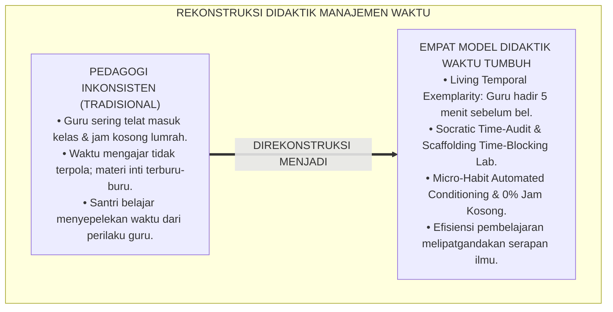
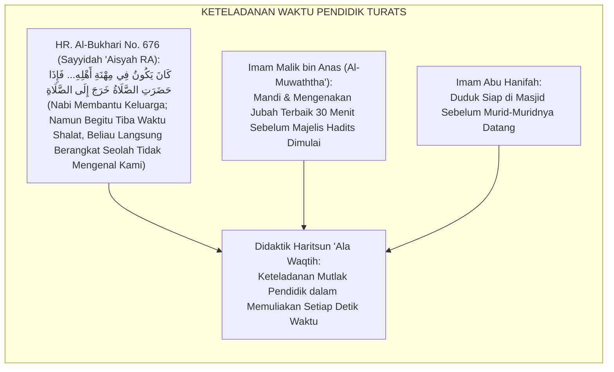
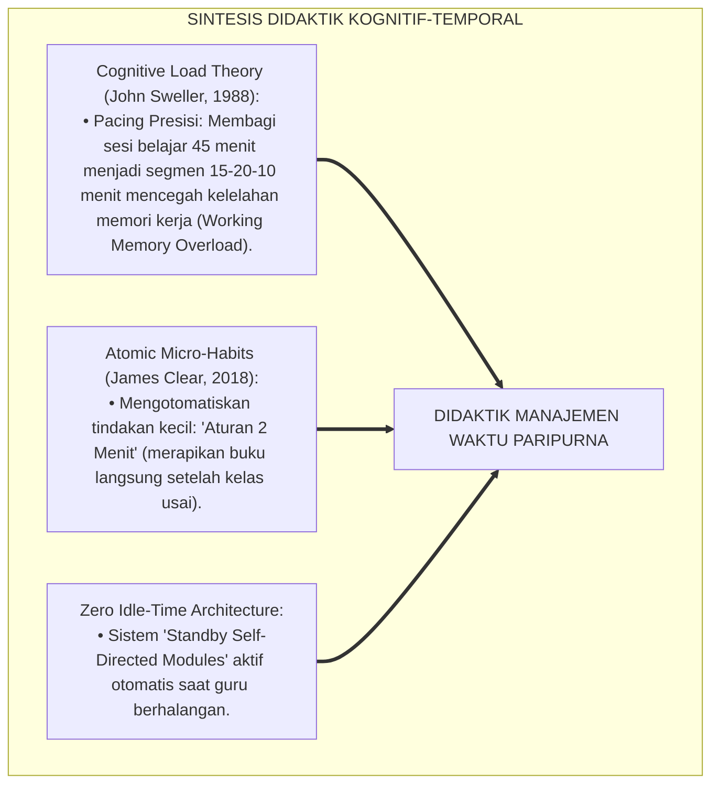
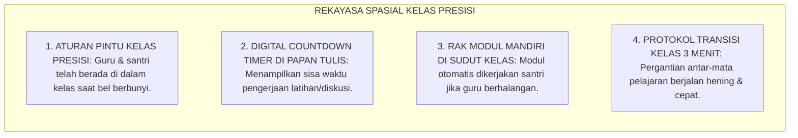
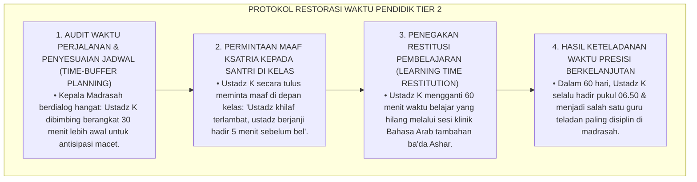
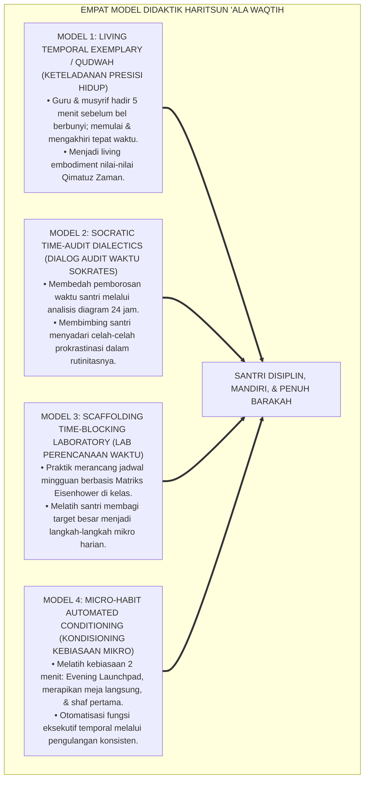
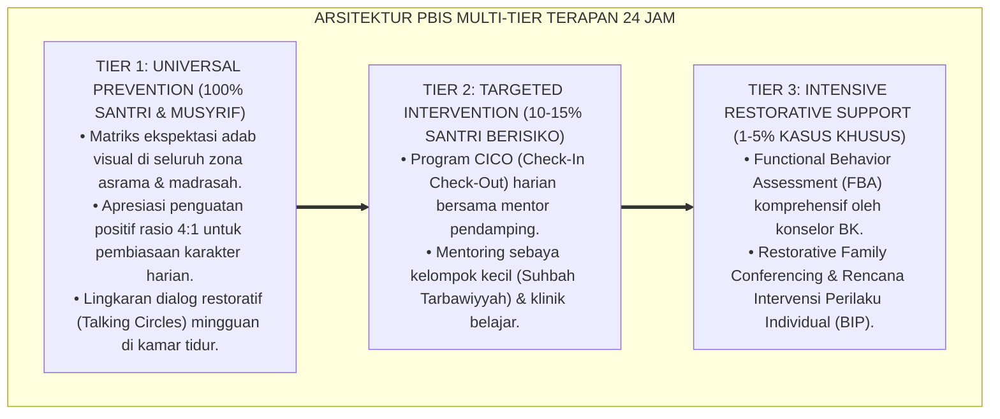

# P3-10-12: METODE PEDAGOGI DAN DIDAKTIK HARITSUN ALA WAQTIH
## *Monograf Riset Akademik: Empat Model Instruksional Pembinaan Disiplin Waktu (Living Temporal Exemplarity / Qudwah, Socratic Time-Audit Dialectics, Scaffolding Time-Blocking Laboratory, & Micro-Habit Automated Conditioning), Integrasi Efisiensi Waktu di Kelas Madrasah & Asrama, Eliminasi Jam Kosong, Serta Pembentukan Pendidik Tepat Waktu di Pesantren TUMBUH*

**Nomor Identifikasi**: `P3-10-12/MONOGRAF-RISET-PEDAGOGI-DIDAKTIK-HARITSUN-ALA-WAQTIH/2026`  
**Domain**: `03 Capacity Framework` > `10 Haritsun Ala Waqtih` (Sub-Modul 12: *Pedagogical Methods & Time Didactics*)  
**Klasifikasi Naskah**: *Academic Research Monograph* (Monograf Penelitian Didaktik Efisiensi Belajar, Desain Instruksional Manajemen Waktu, & Transformasi Pendidik Pesantren)  
**Rumpun Disiplin Pengkaji**: Pedagogi Manajemen Waktu, Desain Instruksional Kognitif, Teori Pembiasaan Kebiasaan Mikro (*Micro-Habits*), Manajemen Kinerja Kelas  

---

> ### 💡 INTISARI EKSEKUTIF (EXECUTIVE SUMMARY)
>
> * **Kemacetan Didaktik Pembinaan Waktu Konvensional di Pesantren:**  
>   Banyak guru dan musyrif menuntut santri untuk tepat waktu, namun di sisi lain guru sering datang terlambat 15 menit ke ruang kelas, membiarkan jam pelajaran kosong (*Idle Class Hours*), atau mengakhiri pelajaran melewati batas waktu bel (*Class Overrun*). Kontradiksi pedagogis ini menghancurkan kredibilitas nilai waktu di mata santri (*Pedagogical Hypocrisy*).
> * **Empat Model Didaktik Haritsun 'Ala Waqtih TUMBUH:**  
>   Ekosistem TUMBUH merumuskan **Empat Model Instruksional Manajemen Waktu Terpadu**: (1) *Model Keteladanan Temporal Hidup (Living Temporal Exemplarity / Qudwah)*, (2) *Model Dialektika Audit Waktu Sokrates (Socratic Time-Audit Dialectics)*, (3) *Model Laboratorium Perencanaan Waktu Terstruktur (Scaffolding Time-Blocking Laboratory)*, dan (4) *Model Pengkondisian Kebiasaan Mikro Otomatis (Micro-Habit Automated Conditioning)*.
> * **Transformasi Kelas Madrasah & Asrama Menjadi Zona Efisiensi Tinggi:**  
>   Monograf ini membimbing guru dan musyrif untuk memulai kelas tepat pada detik bel berbunyi (*Zero-Tolerance to Teacher Tardiness*), mengoptimalkan setiap menit pembelajaran dengan sintaks presisi, serta mengeliminasi total fenomena jam kosong di pesantren.

---

## 📑 DAFTAR ISI MONOGRAF

- [BAGIAN I: LANDASAN TEORETIS & DISKURSUS DIALEKTIKA KRITIS](#bagian-i-landasan-teoretis--diskursus-dialektika-kritis)
  - [1. Latar Belakang Masalah: Bahaya Kontradiksi Keteladanan Guru & Fenomena Jam Kosong Madrasah](#1-latar-belakang-masalah-bahaya-kontradiksi-keteladanan-guru--fenomena-jam-kosong-madrasah)
  - [2. Eksegesis Turats: Keteladanan Presisi Waktu Rasulullah SAW & Para Mursyid Salaf](#2-eksegesis-turats-keteladanan-presisi-waktu-rasulullah-saw--para-mursyid-salaf)
  - [3. Konvergensi Sains Desain Instruksional: Cognitive Load Theory (Sweller) & Micro-Habits (Clear)](#3-konvergensi-sains-desain-instruksional-cognitive-load-theory-sweller--micro-habits-clear)
  - [4. Rekayasa Lingkungan Belajar Presisi 24 Jam: Dari Pintu Kelas Menuju Efisiensi Pembelajaran](#4-rekayasa-lingkungan-belajar-presisi-24-jam-dari-pintu-kelas-menuju-efisiensi-pembelajaran)
  - [5. Kasuistika Lapangan Klinis & Protokol De-eskalasi Guru yang Kerap Terlambat Masuk Jam Pertama Madrasah](#5-kasuistika-lapangan-klinis--protokol-de-eskalasi-guru-yang-kerap-terlambat-masuk-jam-pertama-madrasah)
- [BAGIAN II: FORMULASI KONSEPTUAL & PEMBAHASAN MENDALAM](#bagian-ii-formulasi-konseptual--pembahasan-mendalam)
  - [1. Arsitektur Empat Model Didaktik Waktu Haritsun 'Ala Waqtih](#1-arsitektur-empat-model-didaktik-waktu-haritsun-ala-waqtih)
  - [2. Langkah-Langkah Operasional Sintaks Pembelajaran Berbasis Manajemen Waktu Presisi](#2-langkah-langkah-operasional-sintaks-pembelajaran-berbasis-manajemen-waktu-presisi)
  - [3. Matriks Penerapan Model Didaktik Berdasarkan Jenjang J1–J4](#3-matriks-penerapan-model-didaktik-berdasarkan-jenjang-j1j4)
  - [4. Diskusi Akademis & Implikasi bagi Tata Kelola Pembelajaran Pesantren Unggul](#4-diskusi-akademis--implikasi-bagi-tata-kelola-pembelajaran-pesantren-unggul)
- [BAGIAN III: KESIMPULAN & APARATUS AKADEMIS](#bagian-iii-kesimpulan--aparatus-akademis)
  - [1. Tabel Sintesis Metode Pedagogi & Didaktik Haritsun 'Ala Waqtih](#1-tabel-sintesis-metode-pedagogi--didaktik-haritsun-ala-waqtih)
  - [2. Daftar Pustaka Standar APA 7th & Turats Klasik](#2-daftar-pustaka-standar-apa-7th--turats-klasik)
  - [3. Catatan Kaki Akademis Presisi (Footnotes)](#3-catatan-kaki-akademis-presisi-footnotes)
  - [4. Glosarium Istilah Ilmiah & Didaktik Waktu Presisi](#4-glosarium-istilah-ilmiah--didaktik-waktu-presisi)

---

# BAGIAN I: LANDASAN TEORETIS & DISKURSUS DIALEKTIKA KRITIS

---

### 1. Latar Belakang Masalah: Bahaya Kontradiksi Keteladanan Guru & Fenomena Jam Kosong Madrasah

Dalam praksis pedagogi di madrasah dan asrama pesantren tradisional, kerap terjadi **tiga distorsi didaktik manajemen waktu (*Time Didactic Distortions*)**:[^1]

1. **Jebakan Keterlambatan Pendidik (*Teacher Tardiness Trap*)**: Guru terlambat 15 menit masuk kelas dengan berbagai alasan, namun memarahi santri yang terlambat 2 menit. Inkonsistensi ini meruntuhkan wibawa pendidikan disiplin (*Destruction of Moral Authority*).
2. **Normalisasi Fenomena 'Jam Kosong' (*Classroom Idleness Normalization*)**: Saat guru berhalangan hadir, kelas dibiarkan kosong tanpa penugasan mandiri terstruktur (*Self-Directed Learning*), melatih santri untuk menyukai waktu terbuang.
3. **Ketiadaan Pengelolaan Alokasi Waktu Belajar (*Poor Instructional Time Pacing*)**: Guru menghabiskan 30 menit awal jam pelajaran hanya untuk mengobrol di luar topik, sehingga materi inti diajarkan secara tergesa-gesa di 10 menit terakhir.[^2]

Model riset **TUMBUH** merekonstruksi didaktik: **Manajemen waktu diajarkan melalui keteladanan presisi pendidik (*Living Qudwah*), sintaks pembelajaran tepat waktu, dan penghapusan total jam kosong**.

---

### 2. Eksegesis Turats: Keteladanan Presisi Waktu Rasulullah SAW & Para Mursyid Salaf

Rasulullah SAW dan para ulama salafush shalih senantiasa memberikan keteladanan ketepatan waktu yang sempurna dalam memulai majelis ilmu dan mengimami shalat.

#### 📖 Kesaksian Sayyidah 'Aisyah RA tentang Ketepatan Waktu Nabi SAW
Diriwayatkan dalam *Shahih Al-Bukhari* kesaksian Ummul Mukminin 'Aisyah RA:

$$\text{سُئِلَتْ عَائِشَةُ: مَا كَانَ النَّبِيُّ صَلَّى اللَّهُ عَلَيْهِ وَسَلَّمَ يَصْنَعُ فِي بَيْتِهِ؟ قَالَتْ: كَانَ يَكُونُ فِي مِهْنَةِ أَهْلِهِ، فَإِذَا حَضَرَتِ الصَّلَاةُ خَرَجَ إِلَى الصَّلَاةِ، كَأَنَّهُ لَا يَعْرِفُنَا وَلَا نَعْرِفُهُ}$$

*"Sayyidah 'Aisyah RA ditanya: 'Apa yang biasa dilakukan oleh Nabi SAW di rumahnya?' Beliau menjawab: 'Beliau biasa membantu pekerjaan keluarganya di rumah; **namun manakala tiba waktu shalat (adzan berkumandang), beliau langsung bergegas keluar menuju shalat seolah-olah beliau tidak mengenal kami dan kami tidak mengenalnya!**'* (HR. Al-Bukhari No. 676).[^3]

---

### 3. Konvergensi Sains Desain Instruksional: Cognitive Load Theory (Sweller) & Micro-Habits (Clear)

Didaktik Haritsun 'Ala Waqtih memadukan teori beban kognitif John Sweller dan pembentukan kebiasaan mikro James Clear:

---

### 4. Rekayasa Lingkungan Belajar Presisi 24 Jam: Dari Pintu Kelas Menuju Efisiensi Pembelajaran

Efisiensi instruksional diwujudkan melalui penataan waktu di ruang kelas dan asrama:

---

### 5. Kasuistika Lapangan Klinis & Protokol De-eskalasi Guru yang Kerap Terlambat Masuk Jam Pertama Madrasah

#### Studi Kasus Lapangan: Guru Bahasa Arab Sering Terlambat 20 Menit Masuk Jam Pertama Pagi
* **Konteks Masalah**: Ustadz K (Guru Bahasa Arab) sering terlambat 20 menit pada jam pertama madrasah (pukul 07.00) karena rumahnya cukup jauh dan terjebak kemacetan. Santri di kelas dibiarkan gaduh, melempar kertas, dan mencontoh perilaku menyepelekan jam pelajaran.
* **Analisis Diagnostik**: Terjadi pelanggaran *Professional Temporal Integrity* yang merusak iklim disiplin madrasah secara sistemik.
* **Protokol Resolusi Restoratif Pendidik TUMBUH**:

Keteladanan pendidik mengakui kesalahan dan memperbaikinya ini menanamkan penghormatan waktu yang sangat kuat pada jiwa santri.[^4]

---

# BAGIAN II: FORMULASI KONSEPTUAL & PEMBAHASAN MENDALAM

---

### 1. Arsitektur Empat Model Didaktik Waktu Haritsun 'Ala Waqtih

Ekosistem TUMBUH menetapkan empat model instruksional waktu baku:

---

### 2. Langkah-Langkah Operasional Sintaks Pembelajaran Berbasis Manajemen Waktu Presisi

#### Sintaks Pembelajaran Kelas Presisi 45 Menit (Precision Learning Framework):
1. **Fase 1: Set-Induction & Target Setting / 5 Menit (Menit 0–5)**: Guru membuka kelas tepat waktu, menyampaikan 3 target capaian pembelajaran spesifik di papan tulis, dan menyalakan timer.
2. **Fase 2: Deep Explanation / 15 Menit (Menit 6–20)**: Penyampaian materi inti secara padat, fokus, dan interaktif tanpa interupsi obrolan di luar topik.
3. **Fase 3: Focused Practice & Pomodoro Sprint / 15 Menit (Menit 21–35)**: Santri mengerjakan latihan/diskusi secara hening terfokus dengan batas waktu ketat (*Time-Boxed Task*).
4. **Fase 4: Formative Check & 2-Minute Launchpad / 10 Menit (Menit 36–45)**: Uji pemahaman singkat (exit ticket), penugasan mandiri terukur, dan merapikan meja belajar sebelum bel berbunyi.[^5]

---

### 3. Matriks Penerapan Model Didaktik Berdasarkan Jenjang J1–J4

| Jenjang Pendidikan | Model Didaktik Dominan | Fokus Aktivitas Belajar Santri | Peran Pendidik Utama |
| :--- | :--- | :--- | :--- |
| **Jenjang J1 (Kelas 7)** | *Micro-Habit Conditioning* & *Living Qudwah* | Pembiasaan adaptasi sirkadian 21.30; checklist loker visual; Evening Launchpad. | Pelatih Rutinitas & Figur Pengayom Disiplin. |
| **Jenjang J2 (Kelas 8–9)** | *Time-Blocking Laboratory* & Pomodoro | Praktik teknik Pomodoro 25 menit; manajemen tugas madrasah; jadwal cuci baju. | Instruktur Efisiensi Belajar & Anti-Taswif. |
| **Jenjang J3 (Kelas 10–11)** | *Socratic Time-Audit* & *Deep Work* | Merancang time-blocking mingguan mandiri; deep work tahfidz 90 menit; qailulah. | Fasilitator Refleksi Waktu & Mentor Otonom. |
| **Jenjang J4 (Kelas 12)** | *Project-Based Time Mastery* & Mentorship | Mengelola riset KTI mandiri; efisiensi belajar puncak; membimbing adik kelas J1. | Rekan Kolaborasi Riset & Senior Time Mentor. |

---

### 4. Diskusi Akademis & Implikasi bagi Tata Kelola Pembelajaran Pesantren Unggul

Penerapan empat model didaktik ini menghasilkan transformasi mendasar:

1. **Eradikasi Total Jam Kosong Menuju 100% Waktu Bermakna (*Zero Idle Hours*)**: Setiap menit kehadiran santri di madrasah diisi dengan pembelajaran berkualitas tinggi yang terstruktur.
2. **Peningkatan Kualitas Kebugaran Mental Santri & Pendidik**: Penghapusan ketergesaan dan kepanikan menciptakan suasana belajar yang sangat tenang, fokus, dan membahagiakan (*Flow Classroom*).
3. **Penyempurnaan Wibawa Profesional Lembaga Pendidikan Islam**: Pesantren menjadi percontohan global lembaga pendidikan yang memadukan disiplin waktu presisi ala Barat dengan keikhlasan spiritual Islam.[^6]

---

---

### Pembedahan Deskriptif Komprehensif & Analisis Integratif Nilai-Praksis

Penerapan konsep **P3-10-12: METODE PEDAGOGI DAN DIDAKTIK HARITSUN ALA WAQTIH** di ekosistem pesantren TUMBUH memerlukan pemahaman multidimensional yang memadukan khazanah turats syariat dan konsensus sains pendidikan modern:

#### A. Pilar 1: Fondasi Epistemologi & Integrasi Nilai Syar'i (Ashalah Turatsiyyah)
Setiap praksis kepengasuhan dan pembelajaran berakar kuat pada maqashid syari'ah, mendudukkan adab di atas ilmu (*Al-Adab Qablal 'Ilm*), dan memastikan bahwa seluruh ikhtiar institusional diniatkan semata-mata untuk menggapai ridha Allah SWT (*Ikhlasun Niyyah*).

#### B. Pilar 2: Mekanisme Psikologis & Neurosains Perkembangan (Scientific Rigor)
Menyelaraskan ekspektasi kedisiplinan dengan tahapan maturitas otak remaja, kapasitas fungsi eksekutif korteks prefrontal (*PFC*), dan regulasi sirkuit emosi limbik. Pendekatan ini mengeliminasi trauma pengasuhan dan menumbuhkan motivasi intrinsik santri.

#### C. Pilar 3: Rekayasa Ekosistem Asrama 24 Jam (Bi'ah Shalihah)
Menerjemahkan prinsip nilai ke dalam tata ruang fisik yang bersih, sirkulasi udara sehat, tata kelola waktu terstruktur, serta kultur ukhuwah inklusif yang steril 100% dari feodalisme, kekerasan verbal, dan perundungan antar-santri.

#### D. Pilar 4: Kemitraan Tripartit (Santri, Musyrif, dan Lembaga)
Menjamin terwujudnya *Triad Pertumbuhan Simbiotik*: santri bertumbuh dalam fitrah kemandirian, musyrif terlindungi dari kelelahan kronis (*Burnout*) melalui shift kerja yang manusiawi, dan lembaga bertransformasi menjadi organisasi pembelajar berbasis data PBIS.

---

### Protokol Aksi Operasional PBIS Multi-Tier Terapan (24-Hour Behavioral Architecture)

---

# BAGIAN III: KESIMPULAN & APARATUS AKADEMIS

---

### 1. Tabel Sintesis Metode Pedagogi & Didaktik Haritsun 'Ala Waqtih

| Dimensi Didaktik | Metode Tradisional Pesantren | Rekonstruksi Model TUMBUH | Landasan Rujukan Primer | Bukti Capaian Lapangan |
| :--- | :--- | :--- | :--- | :--- |
| **1. Keteladanan Pendidik** | Guru sering terlambat masuk kelas. | Living Temporal Exemplarity: Guru hadir 5 menit sebelum bel. | HR. Al-Bukhari No. 676 (Keteladanan Nabi) | 0% keterlambatan guru di jam pertama madrasah. |
| **2. Fenomena Jam Kosong** | Kelas kosong dibiarkan santri ribut. | Modul Mandiri Siap Pakai & Penugasan Standby. | Kaidah *Al-Waqtu Huwal Hayah* | 0% jam kosong; seluruh waktu terisi pembelajaran bermakna. |
| **3. Pacing Waktu Mengajar** | Materi inti terburu-buru di akhir jam. | Sintaks Presisi 45 Menit (5-15-15-10 Pacing). | *Cognitive Load Theory* (Sweller, 1988) | Serapan materi tuntas dalam alokasi waktu resmi. |
| **4. Pelatihan Mandiri** | Menyuruh disiplin tanpa teknik praktis. | Laboratorium Time-Blocking & Pomodoro Sprint. | Teori Efikasi Diri (Bandura, 1997) | Santri terampil menyusun agenda harian mandiri. |

---

### 2. Daftar Pustaka Standar APA 7th & Turats Klasik

1. **Abu Ghuddah, Abdul Fattah.** (2012). *Qimatuz Zaman 'indal Ulama*. Kairo: Dar As-Salam.
2. **Al-Bukhari, Abu Abdillah Muhammad bin Ismail.** (2002). *Shahih Al-Bukhari*. Riyadh: Bait Al-Afkar Ad-Dauliyyah.
3. **Az-Zarnuji, Burhanuddin.** (2008). *Ta'limul Muta'allim Thariqat-Ta'allum*. Surabaya: Al-Hidayah.
4. **Bandura, A.** (1997). *Self-Efficacy: The Exercise of Control*. New York: W. H. Freeman.
5. **Cirillo, F.** (2018). *The Pomodoro Technique*. New York: Currency.
6. **Clear, J.** (2018). *Atomic Habits: An Easy & Proven Way to Build Good Habits & Break Bad Ones*. New York: Avery.
7. **Covey, S. R.** (2004). *The 7 Habits of Highly Effective People*. New York: Free Press.
8. **Newport, C.** (2016). *Deep Work: Rules for Focused Success in a Distracted World*. New York: Grand Central Publishing.
9. **Sugai, G., & Horner, R. H.** (2020). *School-Wide Positive Behavioral Interventions and Supports*. *Journal of Positive Behavior Interventions*, 22(4), 203-211.
10. **Sweller, J.** (1988). *Cognitive load during problem solving: Effects on learning*. *Cognitive Science*, 12(2), 257-285.

---

### 3. Catatan Kaki Akademis Presisi (Footnotes)

[^1]: Kritik terhadap dampak destruktif inkonsistensi waktu pendidik terhadap pembentukan karakter anak, Bandura (1997, hlm. 94).  
[^2]: Pembahasan Cognitive Load Theory dan pentingnya pacing waktu dalam memori kerja siswa, Sweller (1988, hlm. 264).  
[^3]: HR. Al-Bukhari dalam *Shahih Al-Bukhari* (No. 676), Kitab *Al-Adhan*.  
[^4]: Protokol resolusi restoratif keterlambatan pendidik dan penegakan keteladanan waktu, TUMBUH (2026).  
[^5]: Sintaks 4 langkah pembelajaran kelas presisi 45 menit TUMBUH Pesantren (2026).  
[^6]: Dampak kelembagaan penerapan didaktik efisiensi waktu terpadu TUMBUH Pesantren (2026).  

---

### 4. Glosarium Istilah Ilmiah & Didaktik Waktu Presisi

1. **Living Temporal Exemplarity (Keteladanan Waktu Hidup)**: Metode pembelajaran di mana kedisiplinan diajarkan melalui tindakan nyata pendidik yang selalu hadir tepat waktu di seluruh kegiatan.
2. **Precision Learning Framework**: Kerangka kerja pembelajaran terstruktur 45 menit yang membagi alokasi waktu secara presisi (Set-Induction, Core, Sprint, Check).
3. **Zero-Tolerance to Teacher Tardiness**: Kebijakan mutu mutlak pesantren yang mewajibkan seluruh tenaga pendidik hadir di kelas minimal 5 menit sebelum bel berbunyi.
4. **Time-Boxed Task**: Tugas atau latihan yang diberikan dengan batas waktu pengerjaan yang ketat guna melatih fokus dan kecepatan berpikir siswa.
5. **Classroom Overrun**: Kebiasaan buruk guru mengakhiri pelajaran melewati batas waktu bel yang merugikan hak istirahat santri atau jam pelajaran berikutnya.
6. **Socratic Time-Audit**: Diskusi mendalam yang membimbing santri menganalisis dan menghitung secara jujur penggunaan 24 jam waktunya sehari-semalam.
7. **Atomic Micro-Habits**: Kebiasaan-kebiasaan kecil 2 menit (seperti langsung merapikan sajadah setelah shalat) yang mengotomatiskan keteraturan hidup.
8. **Time-Buffer Planning**: Strategi menyisipkan jeda waktu cadangan (15–30 menit) dalam jadwal perjalanan guna mengantisipasi hambatan tak terduga.
9. **Standby Self-Directed Modules**: Paket materi belajar mandiri yang siap digunakan santri di kelas manakala guru utama berhalangan hadir.
10. **Flow Classroom**: Kondisi atmosfer kelas di mana seluruh santri dan guru larut dalam proses belajar yang fokus, tertib, dan membahagiakan.
