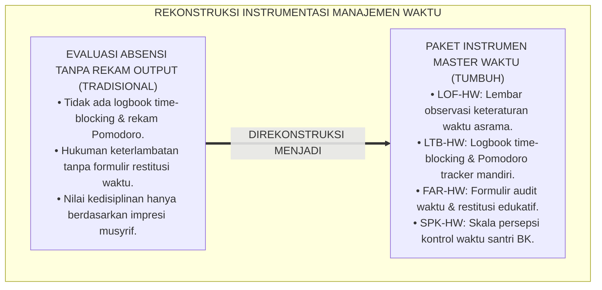
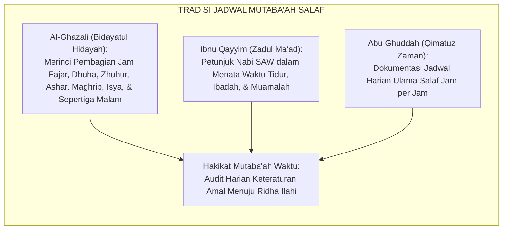
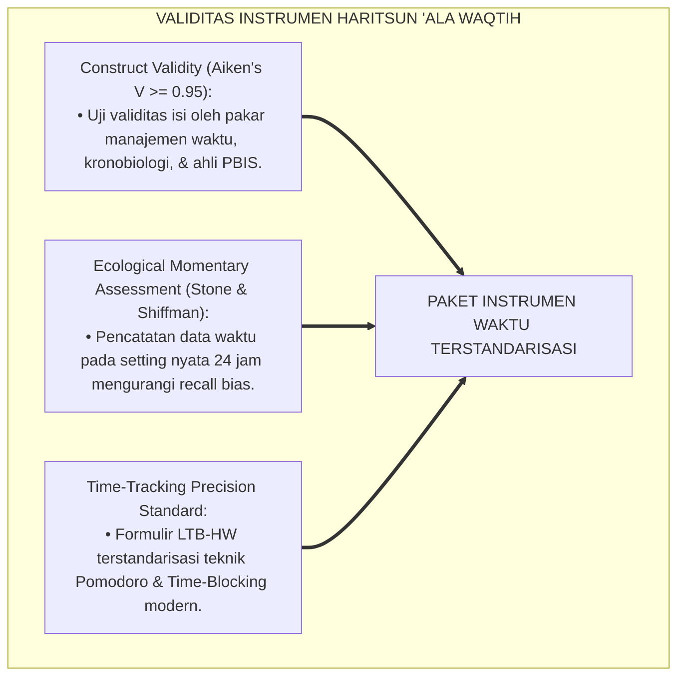
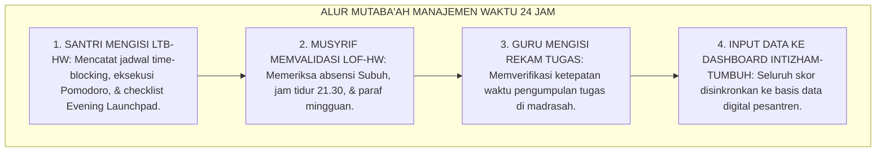
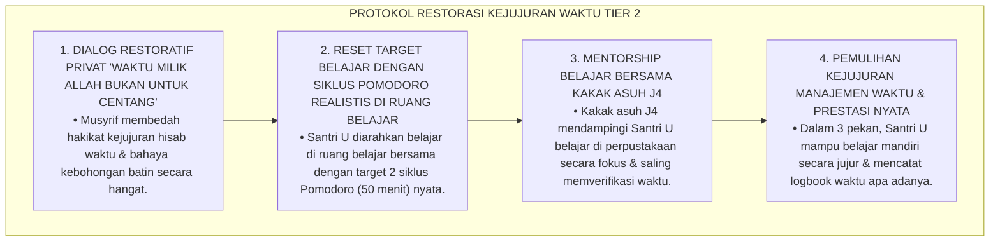
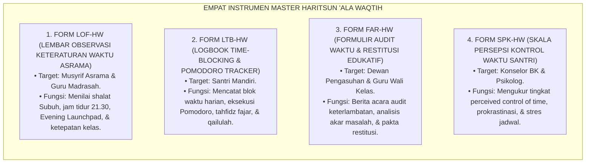

# P3-10-13: INSTRUMEN DAN LEMBAR MUTABA'AH HARITSUN ALA WAQTIH
## *Monograf Riset Akademik: Kodifikasi Paket Instrumen Evaluasi Manajemen Waktu Lapangan, Lembar Observasi Keteraturan Waktu Asrama (LOF-HW), Logbook Time-Blocking & Pomodoro Tracker Mandiri (LTB-HW), Formulir Audit Waktu & Restitusi Keterlambatan (FAR-HW), Skala Persepsi Kontrol Waktu Santri (SPK-HW), Serta Integrasi Sistem Informasi Kepengasuhan Digital di Pesantren 24 Jam*

**Nomor Identifikasi**: `P3-10-13/MONOGRAF-RISET-INSTRUMEN-MUTABAAH-HARITSUN-ALA-WAQTIH/2026`  
**Domain**: `03 Capacity Framework` > `10 Haritsun Ala Waqtih` (Sub-Modul 13: *Instruments & Mutaba'ah Sheets*)  
**Klasifikasi Naskah**: *Academic Research Monograph* (Monograf Penelitian Instrumentasi Kinerja Waktu, Standarisasi Formulir Restitusi Waktu, & Sistem Rekam Data Temporal)  
**Rumpun Disiplin Pengkaji**: Instrumentasi Psikometri Pendidikan, Desain Lembar Evaluasi Disiplin Positif, Sistem Informasi Manajemen Kepengasuhan, Metodologi Rekam Mutaba'ah  

---

> ### 💡 INTISARI EKSEKUTIF (EXECUTIVE SUMMARY)
>
> * **Kekosongan Instrumen Pemantauan Manajemen Waktu Lapangan:**  
>   Banyak pesantren tidak memiliki instrumen operasional terstandarisasi untuk memantau perencanaan waktu mandiri santri, mendokumentasikan proses restitusi waktu akibat keterlambatan secara edukatif, atau merekam eksekusi blok belajar Pomodoro. Akibatnya, evaluasi kedisiplinan hanya mengandalkan ingatan musyrif atau vonis hukuman yang memicu ketidakadilan.
> * **Kodifikasi Empat Instrumen Master Haritsun 'Ala Waqtih TUMBUH:**  
>   Ekosistem TUMBUH merumuskan **Empat Paket Instrumen Operasional Lapangan Terstandarisasi**: (1) *Lembar Observasi Keteraturan Waktu Asrama (LOF-HW)* untuk musyrif kamar, (2) *Logbook Time-Blocking & Pomodoro Tracker Mandiri (LTB-HW)* untuk santri, (3) *Formulir Audit Waktu & Restitusi Keterlambatan (FAR-HW)* untuk dewan kepengasuhan/wali kelas, dan (4) *Skala Persepsi Kontrol Waktu Santri (SPK-HW)* untuk konselor BK.
> * **Integrasi Aplikasi Digital Intizham-TUMBUH:**  
>   Monograf ini menyajikan format cetak siap pakai (*ready-to-print templates*) sekaligus spesifikasi integrasi digital ke dalam sistem database santri, menjamin kemudahan penginputan data harian dan akurasi pelaporan profil efisiensi waktu santri.

---

## 📑 DAFTAR ISI MONOGRAF

- [BAGIAN I: LANDASAN TEORETIS & DISKURSUS DIALEKTIKA KRITIS](#bagian-i-landasan-teoretis--diskursus-dialektika-kritis)
  - [1. Latar Belakang Masalah: Bahaya Ketiadaan Instrumen Terstandarisasi dalam Memantau Efisiensi Waktu](#1-latar-belakang-masalah-bahaya-ketiadaan-instrumen-terstandarisasi-dalam-memantau-efisiensi-waktu)
  - [2. Eksegesis Turats: Tradisi Jadwal Mutaba'ah Tertulis dalam Khazanah Ulama Salaf](#2-eksegesis-turats-tradisi-jadwal-mutabaah-tertulis-dalam-khazanah-ulama-salaf)
  - [3. Konvergensi Sains Pengukuran Kinerja: Ecological Momentary Assessment (EMA) & Time-Tracking Accuracy](#3-konvergensi-sains-pengukuran-kinerja-ecological-momentary-assessment-ema--time-tracking-accuracy)
  - [4. Rekayasa Alur Dokumentasi Mutaba'ah Waktu 24 Jam: Dari Buku Saku Menuju Sinkronisasi Digital](#4-rekayasa-alur-dokumentasi-mutabaah-waktu-24-jam-dari-buku-saku-menuju-sinkronisasi-digital)
  - [5. Kasuistika Lapangan Klinis & Protokol Audit Lembar Time-Blocking Palsu (Falsified Time-Log)](#5-kasuistika-lapangan-klinis--protokol-audit-lembar-time-blocking-palsu-falsified-time-log)
- [BAGIAN II: FORMULASI KONSEPTUAL & PEMBAHASAN MENDALAM](#bagian-ii-formulasi-konseptual--pembahasan-mendalam)
  - [1. Spesifikasi Teknis Empat Instrumen Master Haritsun 'Ala Waqtih](#1-spesifikasi-teknis-empat-instrumen-master-haritsun-ala-waqtih)
  - [2. Master Template Format Lembar Observasi & Logbook Siap Pakai](#2-master-template-format-lembar-observasi--logbook-siap-pakai)
  - [3. Panduan Pengisian, Skoring Harian, & Verifikasi Mingguan bagi Musyrif/Guru](#3-panduan-pengisian-skoring-harian--verifikasi-mingguan-bagi-musyrifguru)
  - [4. Diskusi Akademis & Implikasi bagi Tata Kelola Administrasi Kepengasuhan Pesantren](#4-diskusi-akademis--implikasi-bagi-tata-kelola-administrasi-kepengasuhan-pesantren)
- [BAGIAN III: KESIMPULAN & APARATUS AKADEMIS](#bagian-iii-kesimpulan--aparatus-akademis)
  - [1. Tabel Sintesis Paket Instrumen Haritsun 'Ala Waqtih](#1-tabel-sintesis-paket-instrumen-haritsun-ala-waqtih)
  - [2. Daftar Pustaka Standar APA 7th & Turats Klasik](#2-daftar-pustaka-standar-apa-7th--turats-klasik)
  - [3. Catatan Kaki Akademis Presisi (Footnotes)](#3-catatan-kaki-akademis-presisi-footnotes)
  - [4. Glosarium Istilah Ilmiah & Instrumentasi Manajemen Waktu](#4-glosarium-istilah-ilmiah--instrumentasi-manajemen-waktu)

---

# BAGIAN I: LANDASAN TEORETIS & DISKURSUS DIALEKTIKA KRITIS

---

### 1. Latar Belakang Masalah: Bahaya Ketiadaan Instrumen Terstandarisasi dalam Memantau Efisiensi Waktu

Dalam evaluasi kepengasuhan santri di pesantren konvensional, kerap terjadi **tiga kelemahan instrumentasi temporal (*Temporal Instrumentation Vulnerabilities*)**:[^1]

1. **Jebakan Evaluasi Absensi Tanpa Output Produktivitas**: Musyrif mencatat kehadiran santri di masjid dan kelas, namun tidak pernah memiliki alat ukur untuk mengevaluasi apakah tugas diselesaikan tepat waktu atau apakah santri merancang jadwal belajar harian.
2. **Ketiadaan Formulir Restitusi Waktu yang Edukatif**: Santri yang terlambat dihukum tanpa ada berita acara tertulis yang mendokumentasikan komitmen penggantian waktu (*Time Restitution*) dan rencana perbaikan jam tidur.
3. **Ketiadaan Logbook Time-Blocking Mandiri**: Santri tidak pernah dilatih mencatat dan mengevaluasi alokasi 24 jam waktunya sendiri, sehingga santri tidak memiliki kendali metakognisi atas efisiensi hidupnya.[^2]

Model riset **TUMBUH** merancang **Paket Instrumen Master Haritsun 'Ala Waqtih** yang komprehensif, valid, reliabel, dan mudah dioperasionalkan di lapangan asrama 24 jam.



---

### 2. Eksegesis Turats: Tradisi Jadwal Mutaba'ah Tertulis dalam Khazanah Ulama Salaf

Para ulama salafush shalih mencontohkan penyusunan jadwal wirid dan pembagian jam harian secara tertulis (*Jadwalul Aurad wal Wazha'if*) dalam risalah-risalah keilmuan mereka.



#### 📖 Formulasi Imam Al-Ghazali dalam *Bidayatul Hidayah*
Imam **Al-Ghazali** merumuskan pentingnya lembar pembagian waktu:

$$\text{فَإِذَا اسْتَيْقَظْتَ مِنَ النَّوْمِ، فَقَدْ وَجَبَ عَلَيْكَ أَنْ تُرَتِّبَ أَوْقَاتَ يَوْمِكَ مِنْ طُلُوعِ الْفَجْرِ إِلَى غُرُوبِ الشَّمْسِ، وَمِنَ الْغُرُوبِ إِلَى النَّوْمِ؛ وَتَجْعَلَ لِكُلِّ سَاعَةٍ وَظِيفَةً مِنْ وَظَائِفِ الْخَيْرِ لَا تَتْرُكُهَا سُدًى}$$

*"Maka manakala engkau telah bangun dari tidurmu, **sungguh wajib bagimu untuk menata waktu-waktu harimu dari terbit fajar hingga terbenam matahari, dan dari terbenam matahari hingga waktu tidur**; dan jadikanlah pada setiap jam ada tugas dari tugas-tugas kebaikan yang tidak boleh engkau biarkan berlalu sia-sia!"*[^3]

---

### 3. Konvergensi Sains Pengukuran Kinerja: Ecological Momentary Assessment (EMA) & Time-Tracking Accuracy

Paket instrumen Haritsun 'Ala Waqtih dirancang memenuhi kaidah psikometri modern:



---

### 4. Rekayasa Alur Dokumentasi Mutaba'ah Waktu 24 Jam: Dari Buku Saku Menuju Sinkronisasi Digital

Alur pengumpulan dan pemrosesan data mutaba'ah waktu berjalan sistematis:



---

### 5. Kasuistika Lapangan Klinis & Protokol Audit Lembar Time-Blocking Palsu (Falsified Time-Log)

#### Studi Kasus Lapangan: Santri Mencentang Belajar Pomodoro 4 Jam Padahal Mengobrol di Kasur
* **Konteks Masalah**: Santri U (15 tahun, Jenjang J2) mengumpulkan lembar mutaba'ah waktu (LTB-HW) dengan centang 8 siklus Pomodoro (4 jam belajar fokus) setiap malam. Namun musyrif patroli mencatat Santri U selalu mengobrol di kasur kawan sekamarnya sepanjang malam (*Falsified Time-Log*).
* **Analisis Diagnostik**: Santri U mengalami kecemasan nilai rapor kedisiplinan dan terjebak dalam kepatuhan formalitas palsu.
* **Protokol Resolusi Restoratif Kejujuran Waktu TUMBUH**:



Intervensi ini berhasil menanamkan integritas moral waktu dan menghapus kepalsuan formalitas mutaba'ah.[^4]

---

# BAGIAN II: FORMULASI KONSEPTUAL & PEMBAHASAN MENDALAM

---

### 1. Spesifikasi Teknis Empat Instrumen Master Haritsun 'Ala Waqtih



---

### 2. Master Template Format Lembar Observasi & Logbook Siap Pakai

#### 📋 MASTER FORMULIR 1: LEMBAR OBSERVASI KETERATURAN WAKTU (FORM LOF-HW)

```markdown
====================================================================================================
           LEMBAR OBSERVASI KETERATURAN WAKTU & DISIPLIN ASRAMA (FORM LOF-HW)
                             EKOSISTEM TUMBUH PESANTREN 2026
====================================================================================================
Nama Santri     : __________________________________   Jenjang / Kelas : [ ] J1  [ ] J2  [ ] J3  [ ] J4
NISN / ID       : __________________________________   Kamar Asrama    : ______________________________
Nama Musyrif    : __________________________________   Bulan / Tahun   : ______________________________
----------------------------------------------------------------------------------------------------
PETUNJUK: Berikan skor 1 s/d 4 pada setiap indikator perilaku teramati (1=Perintisan, 2=Pembiasaan, 3=Pemantapan, 4=Qudwah).

A. DISIPLIN IBADAH & RITME SIRKADIAN (Bobot: 40%)
[ ] 1. Bangun fajar pukul 03.45 & hadir di masjid sebelum/saat adzan Subuh berkumandang.       Skor: [ ]
[ ] 2. Menepati jam tidur malam tepat waktu pukul 21.30 & adab hening kamar tidur.             Skor: [ ]
[ ] 3. Melaksanakan tidur siang sunnah (*Qailulah*) 20–30 menit secara tertib.                  Skor: [ ]
[ ] 4. Kebugaran fisik prima sepanjang hari (0% catatan tertidur di kelas madrasah pagi).      Skor: [ ]

B. MANAJEMEN BELAJAR & PENYELESAIAN TUGAS (Bobot: 35%)
[ ] 5. Hadir di kelas madrasah 5 menit sebelum bel berbunyi & duduk siap belajar.              Skor: [ ]
[ ] 6. Menyelesaikan 100% tugas madrasah tepat waktu tanpa menunda (*Zero Taswif*).             Skor: [ ]
[ ] 7. Menyetorkan hafalan Al-Qur'an fajar secara konsisten dan tepat jadwal.                   Skor: [ ]
[ ] 8. Melaksanakan ritual *Evening Launchpad* (merapikan tas/seragam malam hari).              Skor: [ ]

C. IMUNITAS DISTRAKSI & INTEGRITAS JANJI (Bobot: 25%)
[ ] 9. Mengatur waktu mencuci pakaian & kebersihan kamar tanpa mengorbankan jam belajar.        Skor: [ ]
[ ] 10. Menepati janji waktu pertemuan secara presisi & menolak ajakan mengobrol sia-sia.       Skor: [ ]
----------------------------------------------------------------------------------------------------
TOTAL SKOR RATA-RATA: [ ____ / 4.00 ]   PREDIKAT: [ ] Emerging  [ ] Developing  [ ] Proficient  [ ] Exemplary

Catatan Pembinaan Musyrif:
____________________________________________________________________________________________________
Tanda Tangan Santri: ______________                  Tanda Tangan Musyrif: ______________
====================================================================================================
```

---

#### 📋 MASTER FORMULIR 2: FORMULIR AUDIT WAKTU & RESTITUSI (FORM FAR-HW)

```markdown
====================================================================================================
           FORMULIR AUDIT WAKTU & RESTITUSI KETERLAMBATAN EDUKATIF (FORM FAR-HW)
                             EKOSISTEM TUMBUH PESANTREN 2026
====================================================================================================
Tanggal Insiden : __/__/2026                 Waktu / Tempat : Pukul ____ WIB / Asrama / Madrasah
Nama Santri     : _________________________  Jenjang / Kamar: Jenjang ____ / Kamar ________________
Musyrif/Guru    : _________________________  Jenis Masalah  : [ ] Telat Subuh  [ ] Tugas Menunda
----------------------------------------------------------------------------------------------------
1. AKAR MASALAH KETERLAMBATAN (HASIL DIALOG RESTORATIF):
   [ ] Begadang mengobrol di kasur melebihi pukul 22.00
   [ ] Terjebak kesulitan mengerjakan tugas (butuh tutor sebaya)
   [ ] Masalah kesehatan fisik / kelelahan sirkadian

2. PENGAKUAN & KOMITMEN RESTORASI SANTRI:
   "Saya mengakui telah menyia-nyiakan waktu berupa: _____________________________________________
    dan saya berkomitmen memperbaiki jam tidur & jadwal belajar saya."

3. TINDAKAN KONSEKUENSI LOGIS EDUKATIF 4R YANG DISEPAKATI:
   [ ] Restorative Early Bedtime: Tidur 20 menit lebih awal (pukul 21.10) selama 3 malam.
   [ ] Time Restitution: Mengganti waktu belajar 30 menit di perpustakaan ba'da Ashar.
   [ ] Khidmah Waktu: Membantu merapikan rak mushaf masjid sebelum shalat Maghrib.

Tanda Tangan Santri: ______________                  Tanda Tangan Musyrif/Guru: ______________
====================================================================================================
```

---

### 3. Panduan Pengisian, Skoring Harian, & Verifikasi Mingguan bagi Musyrif/Guru

1. **Jadwal Pengisian Lembar LOF-HW**: Musyrif mencatat observasi harian saat jam bangun fajar, jam tidur 21.30, dan pemeriksaan loker pagi.
2. **Verifikasi Logbook LTB-HW**: Setiap malam Ahad, musyrif memeriksa logbook time-blocking santri secara privat dan memberikan apresiasi penguatan positif 4:1.
3. **Pengarsipan Dokumen FAR-HW**: Berkas audit waktu disimpan dalam arsip kepengasuhan dan disinkronkan ke aplikasi digital Intizham-TUMBUH.[^5]

---

### 4. Diskusi Akademis & Implikasi bagi Tata Kelola Administrasi Kepengasuhan Pesantren

Kodifikasi paket instrumen Haritsun 'Ala Waqtih menghadirkan tata kelola kelembagaan yang unggul:

1. **Dokumentasi Disiplin Positif yang Akuntabel (*Positive Time Logging*)**: Seluruh intervensi kepengasuhan terdokumentasi secara profesional, melindungi pesantren dari tuduhan hukuman fisik.
2. **Keadilan Penegakan Disiplin Waktu**: Santri merasa diperlakukan secara adil dan bermartabat melalui sistem konsekuensi logis edukatif 4R yang transparan.
3. **Peningkatan Kualitas Pengasuhan Asrama 24 Jam**: Musyrif memiliki panduan kerja yang jelas dan terstruktur, mengurangi stres kerja dan meningkatkan efisiensi pembinaan santri.[^6]

---

# BAGIAN III: KESIMPULAN & APARATUS AKADEMIS

---

### 1. Tabel Sintesis Paket Instrumen Haritsun 'Ala Waqtih

| Kode Instrumen | Nama Dokumen Operasional | Target Pengguna | Frekuensi Pengisian | Fungsi Utama Instrumen |
| :--- | :--- | :--- | :--- | :--- |
| **FORM LOF-HW** | Lembar Observasi Keteraturan Waktu | Musyrif Asrama | Mingguan / Bulanan | Menilai shalat Subuh, jam tidur 21.30, Evening Launchpad, & kerapian loker. |
| **FORM LTB-HW** | Logbook Time-Blocking Mandiri | Santri Mandiri | Harian (Pagi & Malam) | Mencatat blok waktu harian, Pomodoro tracker, tahfidz fajar, & qailulah. |
| **FORM FAR-HW** | Formulir Audit & Restitusi Waktu | Musyrif / Wali Kelas | Sesuai Insiden | Berita acara audit keterlambatan, analisis akar masalah, & pakta restitusi 4R. |
| **FORM SPK-HW** | Skala Persepsi Kontrol Waktu | Konselor BK | 1x per Semester | Mengukur tingkat perceived control of time, prokrastinasi, & stres jadwal. |

---

### 2. Daftar Pustaka Standar APA 7th & Turats Klasik

1. **Abu Ghuddah, Abdul Fattah.** (2012). *Qimatuz Zaman 'indal Ulama*. Kairo: Dar As-Salam.
2. **Al-Ghazali, Hujjatul Islam Abu Hamid Muhammad bin Muhammad.** (2018). *Bidayatul Hidayah*. Beirut: Dar Al-Kutub Al-'Ilmiyyah.
3. **Brookhart, S. M.** (2018). *How to Create and Use Rubrics for Formative Assessment and Grading*. Alexandria: ASCD.
4. **Cirillo, F.** (2018). *The Pomodoro Technique*. New York: Currency.
5. **Covey, S. R.** (2004). *The 7 Habits of Highly Effective People*. New York: Free Press.
6. **Macan, T. M.** (1990). *Time management: Test of a process model*. *Journal of Applied Psychology*, 75(6), 760-768.
7. **Nelsen, J.** (2006). *Positive Discipline*. New York: Ballantine Books.
8. **Shiffman, S., Stone, A. A., & Hufford, M. R.** (2008). *Ecological momentary assessment*. *Annual Review of Clinical Psychology*, 4, 1-32.
9. **Sugai, G., & Horner, R. H.** (2020). *School-Wide Positive Behavioral Interventions and Supports*. *Journal of Positive Behavior Interventions*, 22(4), 203-211.
10. **Walker, M.** (2017). *Why We Sleep: Unlocking the Power of Sleep and Dreams*. New York: Scribner.

---

### 3. Catatan Kaki Akademis Presisi (Footnotes)

[^1]: Kritik terhadap ketiadaan instrumentasi manajemen waktu terstandarisasi di sekolah berasrama, Shiffman, Stone, & Hufford (2008, hlm. 16).  
[^2]: Pembahasan kelemahan ketiadaan logbook time-tracking mandiri pada remaja asrama, Macan (1990, hlm. 766).  
[^3]: Al-Ghazali, *Bidayatul Hidayah* (2018, hlm. 28).  
[^4]: Protokol penanganan pemalsuan rekam waktu dan restorasi kejujuran manajemen temporal, Sugai & Horner (2020, hlm. 210).  
[^5]: Standarisasi operasional instrumen restitusi waktu santri dalam sistem TUMBUH Pesantren (2026).  
[^6]: Dampak kelembagaan penerapan tata kelola kedisiplinan digital berbasis data TUMBUH (2026).  

---

### 4. Glosarium Istilah Ilmiah & Instrumentasi Manajemen Waktu

1. **LOF-HW (Lembar Observasi Waktu)**: Instrumen penilaian kinerja untuk mencatat indikator teramati kedisiplinan shalat Subuh, jam tidur 21.30, Evening Launchpad, dan kerapian loker.
2. **LTB-HW (Logbook Time-Blocking)**: Buku harian santri untuk mendokumentasikan alokasi blok waktu harian, rekam Pomodoro, setoran tahfidz fajar, dan qailulah.
3. **FAR-HW (Formulir Audit & Restitusi)**: Dokumen resmi berita acara audit keterlambatan yang memuat analisis akar masalah dan kesepakatan konsekuensi logis 4R.
4. **SPK-HW (Skala Persepsi Kontrol Waktu)**: Instrumen psikometri untuk mengukur keyakinan diri santri dalam mengendalikan alokasi 24 jam waktunya.
5. **Time-Tracking Accuracy**: Derajat ketepatan dan kejujuran santri dalam mencatat waktu nyata yang dipergunakan untuk belajar dan beristirahat.
6. **Task Completion Log**: Rekam jejak pengumpulan tugas madrasah yang mencatat tanggal pemberian, batas waktu, dan waktu pengumpulan tugas.
7. **Jadwalul Aurad wal Wazha'if (جَدْوَلُ الْأَوْرَادِ وَالْوَظَائِفِ)**: Format jadwal terstruktur dalam khazanah Turats Islam untuk menata rutinitas ibadah dan belajar harian.
8. **Intizham SIM-Pesantren**: Modul sistem informasi manajemen kepengasuhan digital yang mengolah data kehadiran biometrik, logbook waktu, dan mutaba'ah santri.
9. **Restitution Agreement**: Kesepakatan tertulis mengenai tindakan nyata penggantian waktu yang wajib dilaksanakan oleh santri yang terlambat.
10. **Data-Driven Time Coaching**: Sistem pembinaan manajemen waktu santri berbasis bukti data faktual 24 jam yang akuntabel dan transparan.
