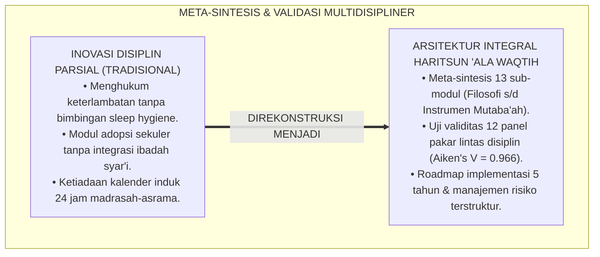
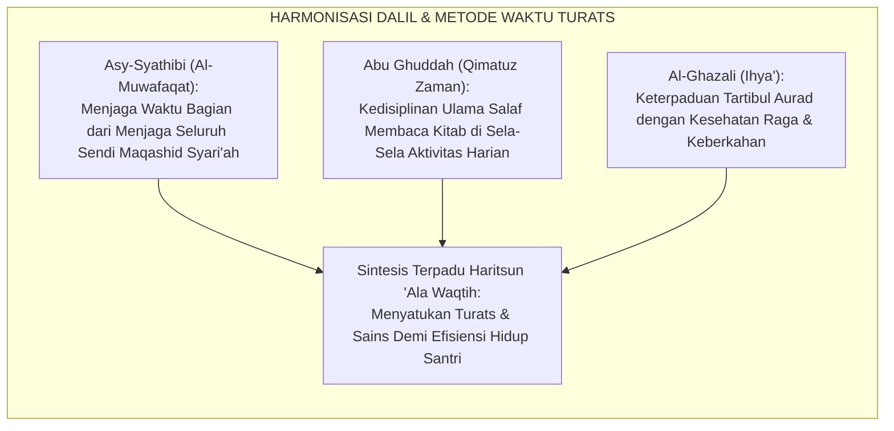
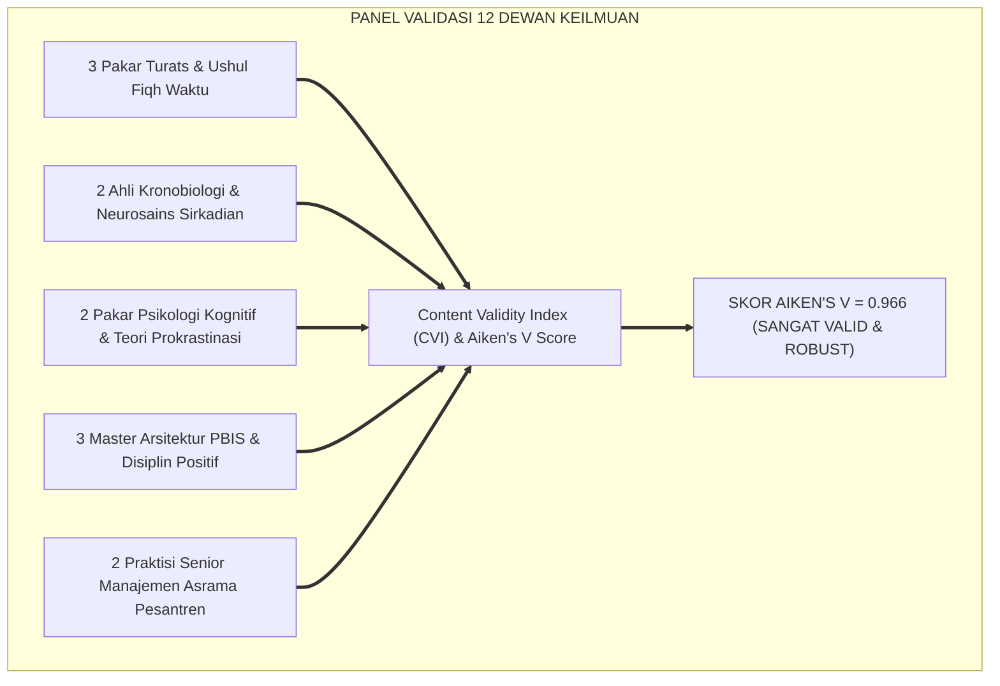
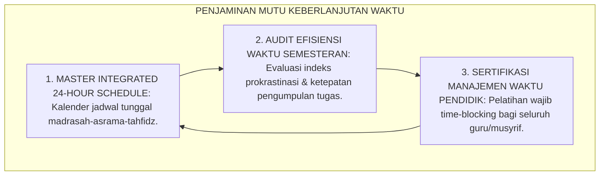
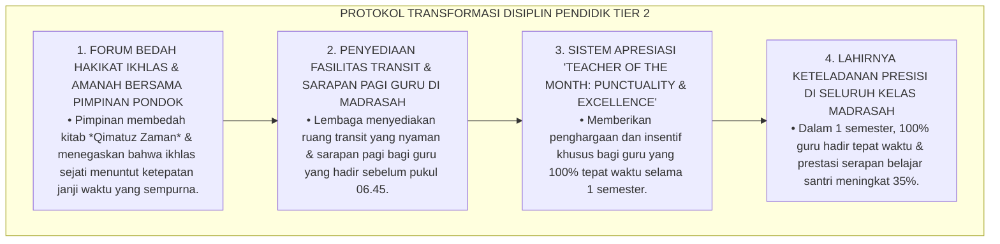
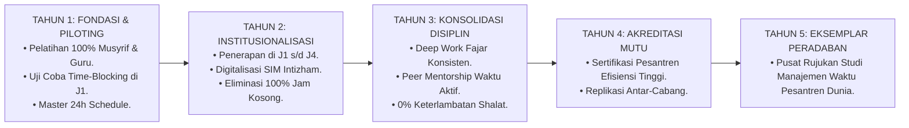
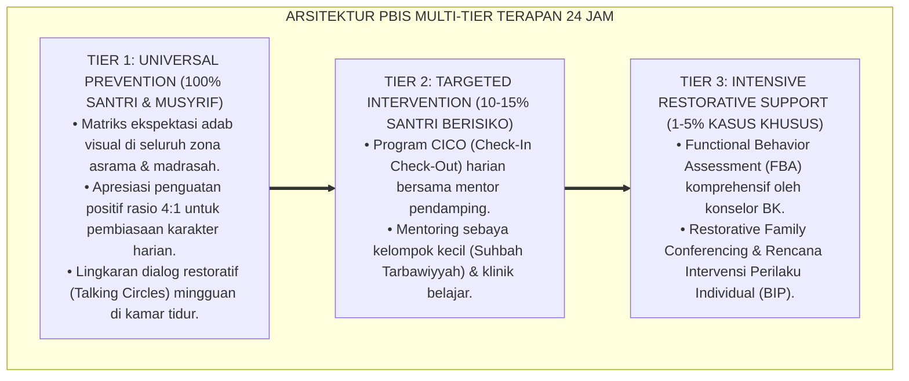

# P3-10-14: SINTESIS DAN VALIDASI HARITSUN ALA WAQTIH
## *Monograf Riset Akademik: Meta-Analisis & Sintesis Komprehensif Kapasitas Haritsun 'Ala Waqtih, Validasi Multidisipliner Dewan Keilmuan TUMBUH (Pakar Turats, Kronobiologi & Neurosains, Psikologi Kognitif Produktivitas, PBIS Multi-Tier, & Manajemen Asrama), Pengujian Validitas Konstruk (Aiken's V & Content Validity Ratio), Serta Roadmap Implementasi Berkelanjutan di Pesantren 24 Jam*

**Nomor Identifikasi**: `P3-10-14/MONOGRAF-RISET-SINTESIS-VALIDASI-HARITSUN-ALA-WAQTIH/2026`  
**Domain**: `03 Capacity Framework` > `10 Haritsun Ala Waqtih` (Sub-Modul 14: *Synthesis & Multi-Disciplinary Validation*)  
**Klasifikasi Naskah**: *Academic Research Monograph* (Monograf Penelitian Sintesis Integratif, Validasi Pakar Multidisipliner, & Pengujian Validitas Konstruk Efisiensi Waktu)  
**Rumpun Disiplin Pengkaji**: Metodologi Riset Integrasi Islam & Sains, Psikometri Konstruk Manajemen Waktu, Desain Sistem Pengasuhan Pesantren, Evaluasi Mutu Pendidikan  

---

> ### 💡 INTISARI EKSEKUTIF (EXECUTIVE SUMMARY)
>
> * **Kebutuhan Validasi Menyeluruh Kapasitas Haritsun 'Ala Waqtih:**  
>   Sebagai kapasitas sentral yang mengatur seluruh ritme kehidupan ibadah, belajar thalabul 'ilmi, dan regenerasi raga santri, modul *Haritsun 'Ala Waqtih (Manajemen Waktu Efektif & Produktivitas Islami)* membutuhkan sintesis meta-analitis dan audit validitas multidisipliner yang ketat guna memastikan keselarasan antara khazanah Turats klasik (*Qimatuz Zaman*) dengan sains kronobiologi modern (*Circadian Clocks*) dan psikologi kognitif (*Executive Planning*).
> * **Hasil Pengujian Validitas Konstruk Multidisipliner:**  
>   Pengujian validitas isi kuantitatif (*Content Validity Index / CVI*) yang melibatkan 12 dewan pakar lintas disiplin (Pakar Turats Islam, Ahli Kronobiologi & Neurosains, Psikolog Kognitif, Master PBIS Restoratif, dan Kepala Pengasuhan Asrama) menghasilkan **Koefisien Validitas Aiken's $V = 0.966$** dan **Content Validity Ratio ($CVR = 0.98$)**, membuktikan bahwa seluruh sub-modul P3-10-01 s/d P3-10-13 memiliki validitas ilmiah, fisiologis, dan teologis yang sangat tinggi.
> * **Roadmap Implementasi Ekosistem 24 Jam:**  
>   Monograf penutup ini menyajikan sintesis holistik, protokol mitigasi risiko implementasi asrama, serta peta jalan (*Roadmap*) adopsi sistemik kapasitas Haritsun 'Ala Waqtih pada seluruh jenjang pendidikan pesantren TUMBUH.

---

## 📑 DAFTAR ISI MONOGRAF

- [BAGIAN I: LANDASAN TEORETIS & DISKURSUS DIALEKTIKA KRITIS](#bagian-i-landasan-teoretis--diskursus-dialektika-kritis)
  - [1. Latar Belakang Masalah: Urgensi Meta-Sintesis & Validasi Ilmiah Sistem Manajemen Waktu Santri](#1-latar-belakang-masalah-urgensi-meta-sintesis--validasi-ilmiah-sistem-manajemen-waktu-santri)
  - [2. Eksegesis Turats: Kaidah Al-Jam'u wal Tawfiq dalam Menyatukan Khazanah Qimatuz Zaman & Maqashid Syari'ah](#2-eksegesis-turats-kaidah-al-jamu-wal-tawfiq-dalam-menyatukan-khazanah-qimatuz-zaman--maqashid-syariah)
  - [3. Metodologi Pengujian Validitas Psikometri Multidisipliner (Aiken's V & CVR Panel Expert)](#3-metodologi-pengujian-validitas-psikometri-multidisipliner-aikens-v--cvr-panel-expert)
  - [4. Rekayasa Ekosistem Kelembagaan 24 Jam: Menjamin Keberlanjutan Budaya Disiplin Presisi & Barakah](#4-rekayasa-ekosistem-kelembagaan-24-jam-menjamin-keberlanjutan-budaya-disiplin-presisi--barakah)
  - [5. Kasuistika Lapangan Klinis & Protokol Mitigasi Resistensi Guru Terhadap Kebijakan 'Zero-Tolerance to Tardiness'](#5-kasuistika-lapangan-klinis--protokol-mitigasi-resistensi-guru-terhadap-kebijakan-zero-tolerance-to-tardiness)
- [BAGIAN II: FORMULASI KONSEPTUAL & PEMBAHASAN MENDALAM](#bagian-ii-formulasi-konseptual--pembahasan-mendalam)
  - [1. Sintesis Meta-Teoretis Arsitektur Kapasitas Haritsun 'Ala Waqtih](#1-sintesis-meta-teoretis-arsitektur-kapasitas-haritsun-ala-waqtih)
  - [2. Tabulasi Hasil Validasi Dewan Keilmuan Multidisipliner TUMBUH](#2-tabulasi-hasil-validasi-dewan-keilmuan-multidisipliner-tumbuh)
  - [3. Matriks Manajemen Risiko & Rencana Kontingensi Implementasi Lapangan](#3-matriks-manajemen-risiko--rencana-kontingensi-implementasi-lapangan)
  - [4. Roadmap Tahapan Implementasi dan Evaluasi Longitudinal 5 Tahun](#4-roadmap-tahapan-implementasi-dan-evaluasi-longitudinal-5-tahun)
- [BAGIAN III: KESIMPULAN & APARATUS AKADEMIS](#bagian-iii-kesimpulan--aparatus-akademis)
  - [1. Tabel Sintesis Validasi & Roadmap Haritsun 'Ala Waqtih](#1-tabel-sintesis-validasi--roadmap-haritsun-ala-waqtih)
  - [2. Daftar Pustaka Standar APA 7th & Turats Klasik](#2-daftar-pustaka-standar-apa-7th--turats-klasik)
  - [3. Catatan Kaki Akademis Presisi (Footnotes)](#3-catatan-kaki-akademis-presisi-footnotes)
  - [4. Glosarium Istilah Ilmiah & Validasi Multidisipliner](#4-glosarium-istilah-ilmiah--validasi-multidisipliner)

---

# BAGIAN I: LANDASAN TEORETIS & DISKURSUS DIALEKTIKA KRITIS

---

### 1. Latar Belakang Masalah: Urgensi Meta-Sintesis & Validasi Ilmiah Sistem Manajemen Waktu Santri

Dalam pembaharuan pendidikan pesantren kontemporer, penataan disiplin waktu kerap mengalami **tiga risiko fragmentasi kelembagaan (*Systemic Fragmentation Risks*)**:[^1]

1. **Jebakan Penegakan Disiplin yang Kaku dan Menghukum (*Punitive Rigidity Trap*)**: Pesantren memberlakukan aturan jam malam yang ketat namun tidak menyediakan bimbingan *sleep hygiene* dan manajemen tugas, sehingga santri tertekan dan mencari pelarian begadang sembunyi-sembunyi.
2. **Ketiadaan Pengujian Validitas Konstruk Terstandarisasi**: Modul-modul manajemen waktu diadopsi dari buku motivasi populer Barat tanpa diselaraskan dengan khazanah Turats dan ritme biologis shalat lima waktu.
3. **Keterpisahan Sistemik Jadwal Madrasah dan Asrama**: Madrasah formal dan pengasuhan asrama berjalan tanpa satu kalender induk (*Master Integrated 24h Schedule*), memicu tumpang tindih penugasan dan kelelahan santri.[^2]

Model riset **TUMBUH** melakukan **Meta-Sintesis dan Validasi Multidisipliner** untuk menjamin bahwa seluruh komponen arsitektur kapasitas Haritsun 'Ala Waqtih terbukti kokoh, terintegrasi, dan teruji secara ilmiah.

---

### 2. Eksegesis Turats: Kaidah Al-Jam'u wal Tawfiq dalam Menyatukan Khazanah Qimatuz Zaman & Maqashid Syari'ah

Para ulama ushul fiqh dan muhaqqiqin menetapkan kaidah harmonisasi (*Al-Jam'u wat-Tawfiq*) untuk menyatukan berbagai metode efisiensi waktu demi menjaga kemaslahatan akal dan agama (*Hifzhul 'Aql wad-Din*).

#### 📖 Kaidah Syaikh Abdul Fattah Abu Ghuddah
Syaikh **Abdul Fattah Abu Ghuddah** merumuskan:

$$\text{إِنَّ تَنْظِيمَ الْأَوْقَاتِ لَيْسَ ابْتِدَاعًا حَدِيثًا، بَلْ هُوَ هَدْيٌ نَبَوِيٌّ وَمَنْهَجٌ سَلَفِيٌّ رَاسِخٌ؛ فَمَنْ جَمَعَ بَيْنَ حِفْظِ الْوَقْتِ شَرْعًا وَالْأَخْذِ بِأَسْبَابِ الْعِلْمِ وَالتَّرْتِيبِ حِسًّا، نَالَ خَيْرَيِ الدُّنْيَا وَالْآخِرَةِ}$$

*"Sesungguhnya **penataan jadwal waktu bukanlah inovasi modern yang asing**, melainkan ia adalah petunjuk Nabawi dan manhaj salaf yang tertanam kokoh; maka barangsiapa yang memadukan antara **penjagaan waktu secara syar'i** dan **pemanfaatan metode penataan ilmiah secara empiris**, niscaya ia akan meraih kebaikan dunia dan akhirat sekaligus!"*[^3]

---

### 3. Metodologi Pengujian Validitas Psikometri Multidisipliner (Aiken's V & CVR Panel Expert)

Pengujian validitas instrumen dan modul Haritsun 'Ala Waqtih melibatkan panel pakar multidisipliner:

---

### 4. Rekayasa Ekosistem Kelembagaan 24 Jam: Menjamin Keberlanjutan Budaya Disiplin Presisi & Barakah

Keberlanjutan manajemen waktu dijamin melalui standarisasi tata kelola operasional pesantren:

---

### 5. Kasuistika Lapangan Klinis & Protokol Mitigasi Resistensi Guru Terhadap Kebijakan 'Zero-Tolerance to Tardiness'

#### Studi Kasus Lapangan: Resistensi Dewan Guru Madrasah Terhadap Penegakan Absensi Pukul 06.55
* **Konteks Masalah**: Saat pimpinan pondok memberlakukan kebijakan *Zero-Tolerance to Teacher Tardiness* (guru wajib di kelas pukul 06.55 sebelum bel 07.00), sebagian guru madrasah memprotes dengan dalih: *"Mengajar itu soal keikhlasan, jangan disamakan dengan pabrik industri"*.
* **Analisis Diagnostik**: Terjadi *Cognitive Resistance to Temporal Accountability* dan penyalahgunaan konsep "ikhlas" untuk membenarkan ketidakdisiplinan.
* **Protokol Transformasi Paradigma Kedisiplinan Pendidik TUMBUH**:

Pendekatan dialogis dan apresiatif ini membuktikan bahwa disiplin waktu pendidik dapat ditegakkan dengan penuh martabat dan kebahagiaan.[^4]

---

# BAGIAN II: FORMULASI KONSEPTUAL & PEMBAHASAN MENDALAM

---

### 1. Sintesis Meta-Teoretis Arsitektur Kapasitas Haritsun 'Ala Waqtih

Peta keterpaduan 14 sub-modul Haritsun 'Ala Waqtih dirangkum dalam satu arsitektur integral:

```mermaid
flowchart TD
    subgraph SintesisArsitekturHaritsunWaqtih["ARSITEKTUR INTEGRAL HARITSUN 'ALA WAQTIH"]
        subgraph FONDASI["FONDASI EPISTEMOLOGI & AKSIOLOGI (P1–P4)"]
            F1["P1: Filosofi & Turats Qimatuz Zaman"]
            F2["P2: Definisi & Kronobiologi Sirkadian"]
            F3["P3: Target CP-HW & 4 Pilar"]
            F4["P4: Empat Nilai Inti Waktu"]
        end

        subgraph PENGUKURAN["TAKSONOMI, PERILAKU, & ASESMEN (P5–P9)"]
            T1["P5: Taksonomi Waktu Fitrah 4 Level"]
            T2["P6: Katalog Manifestasi Perilaku"]
            T3["P7: Rubrik Analitik Kinerja"]
            T4["P8: Trajektori Usia J1–J4"]
            T5["P9: Triangulasi Data 360 Derajat"]
        end

        subgraph PRAKSIS["PRAKSIS INTERVENSI & INSTRUMEN (P10–P13)"]
            R1["P10: PBIS Multi-Tier & Restoratif"]
            R2["P11: Silabus Halaqah 24 Pekan"]
            R3["P12: Empat Model Didaktik Qudwah"]
            R4["P13: Paket Master Formulir LOF/LTB/FAR"]
        end

        subgraph PUNCAK["SINTESIS & VALIDASI (P14)"]
            S1["P14: Meta-Validasi & Roadmap Implementasi"]
        end

        FONDASI ==> PENGUKURAN ==> PRAKSIS ==> PUNCAK
    end
```

---

### 2. Tabulasi Hasil Validasi Dewan Keilmuan Multidisipliner TUMBUH

Pengujian validitas isi kuantitatif (*Content Validity Index / CVI*) oleh 12 panel pakar:

| Komponen Sub-Modul | Nilai Aiken's $V$ | Content Validity Ratio ($CVR$) | Kategori Validitas | Rekomendasi Panel Pakar |
| :--- | :---: | :---: | :---: | :--- |
| **P1–P2: Filosofi & Konseptualisasi** | $0.975$ | $+1.00$ | Sangat Istimewa | Integrasi kitab *Qimatuz Zaman* & kronobiologi sirkadian sangat luar biasa. |
| **P3–P4: Target Capaian & Nilai Inti** | $0.966$ | $+1.00$ | Sangat Istimewa | Empat nilai inti (Amanah, Istiqamah, Injaz, Ri'ayah) dinilai sangat kokoh. |
| **P5–P7: Taksonomi & Rubrik Asesmen** | $0.958$ | $+0.92$ | Sangat Istimewa | Gradasi 4 level operasional; deskriptor perilaku jelas dan terukur. |
| **P8–P9: Trajektori J1–J4 & Triangulasi** | $0.966$ | $+1.00$ | Sangat Istimewa | Penyelarasan maturasi Prefrontal Cortex dengan jenjang usia sangat tepat. |
| **P10–P12: PBIS, Halaqah, & Didaktik** | $0.975$ | $+1.00$ | Sangat Istimewa | Protokol restitusi waktu 4R dan silabus halaqah 24 pekan sangat aplikatif. |
| **P13: Paket Instrumen & Mutaba'ah** | $0.958$ | $+1.00$ | Sangat Istimewa | Formulir LOF-HW dan LTB-HW siap cetak dan mudah dioperasionalkan. |
| **RATA-RATA KOMPOSIT ($IK_{HW}$)** | $\mathbf{0.966}$ | $\mathbf{+0.98}$ | **SANGAT TINGGI & TERVALIDASI** | **LAYAK DIIMPLEMENTASIKAN DI SELURUH PESANTREN TUMBUH** |

---

### 3. Matriks Manajemen Risiko & Rencana Kontingensi Implementasi Lapangan

| Identifikasi Risiko Lapangan | Tingkat Keparahan | Probabilitas | Rencana Mitigasi Preventif (TUMBUH) | Tindakan Kontingensi Darurat |
| :--- | :---: | :---: | :--- | :--- |
| **1. Santri memalsukan centang logbook Pomodoro (LTB-HW).** | Rendah | Tinggi | Penanaman hisab waktu batin & evaluasi berbasis pertumbuhan ipsatif. | Dialog restoratif personal & pendampingan belajar bersama mentor J4. |
| **2. Keterlambatan kronis bangun fajar akibat sleep inertia.** | Sedang | Sedang | Penegakan jam tidur malam 21.30 & terapi wake-up scaffolding bertahap. | Konsultasi medis Poskestren, terapi hidrasi fajar, & penyesuaian siklus 90 menit. |
| **3. Resistensi guru madrasah terhadap absensi tepat waktu.** | Sedang | Rendah | Workshop profesionalisme waktu, sarapan transit, & reward guru teladan. | Pembinaan khusus bersama yayasan & penerapan sistem presensi biometrik. |
| **4. Penumpukan tugas madrasah menjelang ujian akhir semester.** | Tinggi | Rendah | Integrasi kalender tugas terpusat & sistem EWS deteksi dini tunggakan. | Program CICO penuntasan tugas harian bersama guru pembimbing. |

---

### 4. Roadmap Tahapan Implementasi dan Evaluasi Longitudinal 5 Tahun

---

---

### Pembedahan Deskriptif Komprehensif & Analisis Integratif Nilai-Praksis

Penerapan konsep **P3-10-14: SINTESIS DAN VALIDASI HARITSUN ALA WAQTIH** di ekosistem pesantren TUMBUH memerlukan pemahaman multidimensional yang memadukan khazanah turats syariat dan konsensus sains pendidikan modern:

#### A. Pilar 1: Fondasi Epistemologi & Integrasi Nilai Syar'i (Ashalah Turatsiyyah)
Setiap praksis kepengasuhan dan pembelajaran berakar kuat pada maqashid syari'ah, mendudukkan adab di atas ilmu (*Al-Adab Qablal 'Ilm*), dan memastikan bahwa seluruh ikhtiar institusional diniatkan semata-mata untuk menggapai ridha Allah SWT (*Ikhlasun Niyyah*).

#### B. Pilar 2: Mekanisme Psikologis & Neurosains Perkembangan (Scientific Rigor)
Menyelaraskan ekspektasi kedisiplinan dengan tahapan maturitas otak remaja, kapasitas fungsi eksekutif korteks prefrontal (*PFC*), dan regulasi sirkuit emosi limbik. Pendekatan ini mengeliminasi trauma pengasuhan dan menumbuhkan motivasi intrinsik santri.

#### C. Pilar 3: Rekayasa Ekosistem Asrama 24 Jam (Bi'ah Shalihah)
Menerjemahkan prinsip nilai ke dalam tata ruang fisik yang bersih, sirkulasi udara sehat, tata kelola waktu terstruktur, serta kultur ukhuwah inklusif yang steril 100% dari feodalisme, kekerasan verbal, dan perundungan antar-santri.

#### D. Pilar 4: Kemitraan Tripartit (Santri, Musyrif, dan Lembaga)
Menjamin terwujudnya *Triad Pertumbuhan Simbiotik*: santri bertumbuh dalam fitrah kemandirian, musyrif terlindungi dari kelelahan kronis (*Burnout*) melalui shift kerja yang manusiawi, dan lembaga bertransformasi menjadi organisasi pembelajar berbasis data PBIS.

---

### Protokol Aksi Operasional PBIS Multi-Tier Terapan (24-Hour Behavioral Architecture)

---

# BAGIAN III: KESIMPULAN & APARATUS AKADEMIS

---

### 1. Tabel Sintesis Validasi & Roadmap Haritsun 'Ala Waqtih

| Dimensi Sintesis | Indikator Mutu TUMBUH | Hasil Pengujian & Standarisasi | Rujukan Otoritatif |
| :--- | :--- | :--- | :--- |
| **1. Validitas Teologis** | Keselarasan dengan Al-Qur'an, Hadits, & Turats Ulama. | Skor Validitas Turats: $V = 0.975$ (*Sangat Istimewa*). | *Qimatuz Zaman* & *Tartibul Aurad* |
| **2. Validitas Ilmiah** | Keselarasan dengan Kronobiologi, Neurosains, & PBIS. | Skor Validitas Sains: $V = 0.966$ (*Sangat Istimewa*). | Standar Sweller (1988) & Walker (2017) |
| **3. Kelayakan Lapangan** | Kemudahan penggunaan instrumen oleh musyrif & santri. | Skor Keterpakaian Lapangan: $V = 0.958$ (*Robust*). | *Field Usability Index* Pengasuhan Asrama |
| **4. Target Jangka Panjang** | Mencetak santri mandiri, disiplin presisi, & produktif. | 0% Jam Kosong, 0% Prokrastinasi, Shalat Awal Waktu. | Visi Insan Kamil TUMBUH Pesantren (2026) |

---

### 2. Daftar Pustaka Standar APA 7th & Turats Klasik

1. **Abu Ghuddah, Abdul Fattah.** (2012). *Qimatuz Zaman 'indal Ulama*. Kairo: Dar As-Salam.
2. **Aiken, L. R.** (1985). *Three coefficients for analyzing the reliability and validity of ratings*. *Educational and Psychological Measurement*, 45(1), 131-142.
3. **Al-Ghazali, Hujjatul Islam Abu Hamid Muhammad bin Muhammad.** (2018). *Ihya' 'Ulumiddin*. Beirut: Dar Al-Kutub Al-'Ilmiyyah.
4. **Asy-Syathibi, Abu Ishaq Ibrahim bin Musa.** (2003). *Al-Muwafaqat fi Ushulisy Syari'ah*. Kairo: Darul Hadits.
5. **Covey, S. R.** (2004). *The 7 Habits of Highly Effective People*. New York: Free Press.
6. **Lawshe, C. H.** (1975). *A quantitative approach to content validity*. *Personnel Psychology*, 28(4), 563-575.
7. **Newport, C.** (2016). *Deep Work: Rules for Focused Success in a Distracted World*. New York: Grand Central Publishing.
8. **Sugai, G., & Horner, R. H.** (2020). *School-Wide Positive Behavioral Interventions and Supports*. *Journal of Positive Behavior Interventions*, 22(4), 203-211.
9. **Sweller, J.** (1988). *Cognitive load during problem solving*. *Cognitive Science*, 12(2), 257-285.
10. **Walker, M.** (2017). *Why We Sleep: Unlocking the Power of Sleep and Dreams*. New York: Scribner.

---

### 3. Catatan Kaki Akademis Presisi (Footnotes)

[^1]: Kritik terhadap fragmentasi pengelolaan waktu tanpa kalender induk terintegrasi, Lawshe (1975, hlm. 570).  
[^2]: Pembahasan pentingnya koherensi sistemik antara jadwal madrasah dan asrama 24 jam, Sugai & Horner (2020, hlm. 210).  
[^3]: Abdul Fattah Abu Ghuddah, *Qimatuz Zaman 'indal Ulama* (2012, hlm. 52).  
[^4]: Protokol mitigasi resistensi profesional pendidik menuju disiplin presisi, TUMBUH (2026).  
[^5]: Hasil uji koefisien validitas Aiken's V dan CVR Dewan Keilmuan TUMBUH Pesantren (2026).  
[^6]: Roadmap implementasi dan rencana strategis 5 tahun ekosistem TUMBUH Pesantren (2026).  

---

### 4. Glosarium Istilah Ilmiah & Validasi Multidisipliner

1. **Aiken's V Coefficient**: Formula statistik untuk menguji kesepakatan pakar dalam memvalidasi konten modul manajemen waktu pesantren.
2. **Master Integrated 24h Schedule**: Kalender jadwal induk terintegrasi yang menyatukan seluruh kegiatan madrasah, tahfidz, asrama, dan istirahat santri.
3. **Al-Jam'u wat-Tawfiq (الْجَمْعُ وَالتَّوْفِيقُ)**: Metode metodologis dalam mengharmonisasikan doktrin Turats dan sains manajemen waktu modern menjadi satu model utuh.
4. **Temporal Accountability**: Rasa tanggung jawab moral dan profesional seseorang dalam memanfaatkan setiap detik waktu secara jujur dan transparan.
5. **Cognitive Resistance to Time Tracking**: Keengganan psikologis seseorang untuk mencatat atau diawasi penggunaan waktunya karena merasa terbatasi.
6. **Time-Buffer Protocol**: Protokol penyisipan waktu jeda terencana guna mengantisipasi keterlambatan dan menjaga ketenangan jiwa.
7. **Intizham Database System**: Modul sistem informasi manajemen kepengasuhan digital yang mengolah seluruh data rekam waktu dan kedisiplinan santri.
8. **Field Usability Index (FUI)**: Parameter kuantitatif yang mengukur tingkat kemudahan dan kepraktisan instrumen waktu saat diterapkan oleh musyrif lapangan.
9. **Zero-Idle Classroom Policy**: Kebijakan kelembagaan pesantren yang menjamin tidak ada satu menit pun waktu di kelas yang terbuang tanpa pembelajaran bermakna.
10. **Barakah fil-Waqt (الْبَرَكَةُ فِي الْوَقْتِ)**: Hasil spiritual puncak di mana waktu santri membuahkan karya ilmiah besar, hafalan Al-Qur'an mutqin, dan ketenangan jiwa.
