# P3-10: DOKUMEN INDUK KAPASITAS 10 — HARITSUN 'ALA WAQTIH
## *Arsitektur Manajemen Waktu Efektif, Produktivitas Islami, Ritme Sirkadian 24 Jam, & Budaya Asrama Tanpa Prokrastinasi di Ekosistem TUMBUH Pesantren*

**Nomor Identifikasi**: `P3-10/DOKUMEN-INDUK-KAPASITAS-HARITSUN-ALA-WAQTIH/2026`  
**Domain**: `03 Capacity Framework` > `10 Haritsun Ala Waqtih` (Kapasitas Kesepuluh)  
**Klasifikasi Naskah**: *Master Navigation & Architecture Document* (Dokumen Induk Peta Jalan Riset & Navigasi 14 Monograf Ilmiah)  
**Rumpun Disiplin Pengkaji**: Manajemen Waktu Islami, Kronobiologi & Neurosains Sirkadian, Desain Kurikulum Pesantren, School-Wide PBIS Multi-Tier, Psikologi Kognitif  

---

> ### 💡 INTISARI EKSEKUTIF (EXECUTIVE SUMMARY)
>
> * **Kedudukan Strategis Kapasitas Haritsun 'Ala Waqtih:**  
>   *Haritsun 'Ala Waqtih* (Manajemen Waktu Efektif & Produktivitas Islami) adalah mesin penggerak seluruh kapasitas santri. Tanpa pengelolaan waktu yang presisi, potensi intelektual (*Mutsaqqaful Fikr*), ketangkasan fisik (*Qawiyyul Jism*), dan kesucian batin (*Mujahadatun Linafsih*) tidak akan pernah terwujud menjadi karya nyata peradaban. Waktu adalah modal umur utama (*Ra'sul Mal al-Haqiqi*) yang wajib dipertanggungjawabkan di hadapan Allah SWT.
> * **Integrasi Holistik Turats & Sains Kronobiologi:**  
>   Kapasitas ini memadukan khazanah *Qimatuz Zaman* klasik (karya Syaikh Abdul Fattah Abu Ghuddah, Imam Al-Ghazali, dan Ibnu Al-Jauzi) dengan konsensus sains modern (*Circadian Clocks Matthew Walker, Deep Work Cal Newport, Cognitive Load Theory John Sweller, dan Whole-School Positive Discipline*).
> * **Struktur Lengkap 14 Berkas Monograf Riset Ilmiah:**  
>   Dokumen induk ini memetakan dan menghubungkan 14 berkas monograf penelitian akademik komprehensif (~350 KB total riset) yang dirancang untuk menjadi pedoman kelembagaan, kurikulum madrasah, dan SOP asrama 24 jam.

---

## 📑 PETA NAVIGASI 14 MONOGRAF RISET HARITSUN 'ALA WAQTIH

Berikut adalah daftar lengkap 14 monograf riset akademik dalam gugus **Kapasitas 10: Haritsun 'Ala Waqtih**:

```mermaid
flowchart TD
    subgraph GugusKapasitas10["STRUKTUR 14 MONOGRAF KAPASITAS 10: HARITSUN 'ALA WAQTIH"]
        subgraph FONDASI["I. FONDASI TEOLOGIS & KONSEPTUAL"]
            M01["[P3-10-01] Filosofi & Landasan Turats Qimatuz Zaman"]
            M02["[P3-10-02] Definisi & Kronobiologi Ritme Sirkadian"]
            M03["[P3-10-03] Tujuan & Standar Capaian Pembelajaran (CP-HW)"]
            M04["[P3-10-04] Empat Nilai Inti & Prinsip Waktu Barakah"]
        end

        subgraph PENGUKURAN["II. TAKSONOMI, PERILAKU, & ASESMEN"]
            M05["[P3-10-05] Taksonomi Waktu Fitrah 4 Level (SKI-SKD)"]
            M06["[P3-10-06] Manifestasi Perilaku Teramati di 5 Setting 24 Jam"]
            M07["[P3-10-07] Rubrik Analitik Kinerja Manajemen Waktu 4-Level"]
            M08["[P3-10-08] Trajektori Perkembangan Jenjang J1–J4 (Usia 12–18)"]
            M09["[P3-10-09] Pemetaan Asesmen & Triangulasi Data 360 Derajat"]
        end

        subgraph PRAKSIS["III. INTERVENSI, DIDAKTIK, & INSTRUMEN"]
            M10["[P3-10-10] Protokol Intervensi PBIS Multi-Tier & Restoratif"]
            M11["[P3-10-11] Program Pembinaan & Silabus Halaqah 24 Pekan"]
            M12["[P3-10-12] Empat Model Pedagogi & Didaktik Waktu Presisi"]
            M13["[P3-10-13] Paket Master Instrumen Lapangan (LOF/LTB/FAR/SPK)"]
            M14["[P3-10-14] Sintesis Meta-Teoretis & Validasi Multidisipliner"]
        end

        FONDASI ==> PENGUKURAN ==> PRAKSIS
    end
```

---

## 📚 DESKRIPSI RINGKAS 14 BERKAS MONOGRAF

1. **[P3-10-01: Filosofi dan Landasan Turats](file:///c:/xampp/htdocs/tumbuh/03%20Capacity%20Framework/10%20Haritsun%20Ala%20Waqtih/P3-10-01-Filosofi-dan-Landasan-Turats.md)**  
   *Membahas ontologi waktu dalam Islam, modal umur (Ra'sul Mal), kitab Qimatuz Zaman Abu Ghuddah, Shaidul Khatir Ibnu Al-Jauzi, dan integrasi kronobiologi sirkadian.*
2. **[P3-10-02: Definisi dan Konseptualisasi](file:///c:/xampp/htdocs/tumbuh/03%20Capacity%20Framework/10%20Haritsun%20Ala%20Waqtih/P3-10-02-Definisi-dan-Konseptualisasi.md)**  
   *Membahas batas definisional Haritsun 'Ala Waqtih, 4 dimensi operasional (Ibadah, Belajar, Sirkadian, Imunitas Distraksi), Matriks Prioritas Eisenhower, dan eliminasi toxic productivity.*
3. **[P3-10-03: Tujuan dan Target Capaian](file:///c:/xampp/htdocs/tumbuh/03%20Capacity%20Framework/10%20Haritsun%20Ala%20Waqtih/P3-10-03-Tujuan-dan-Target-Capaian.md)**  
   *Membahas Capaian Pembelajaran Haritsun 'Ala Waqtih (CP-HW), dekomposisi target Tri-Domain (Kognitif, Afektif, Psikomotorik), skala TMBS, dan dampak Triad Pertumbuhan.*
4. **[P3-10-04: Nilai Inti dan Prinsip Waktu](file:///c:/xampp/htdocs/tumbuh/03%20Capacity%20Framework/10%20Haritsun%20Ala%20Waqtih/P3-10-04-Nilai-Inti-dan-Prinsip-Waktu.md)**  
   *Membahas aksiologi empat nilai inti (Al-Amanah, Al-Istiqamah, Al-Injaz al-Mubarak, Ar-Ri'ayah Sirkadian), dialektika waktu barakah vs hustle sekuler/jam karet feodal.*
5. **[P3-10-05: Standar Kompetensi dan Taksonomi](file:///c:/xampp/htdocs/tumbuh/03%20Capacity%20Framework/10%20Haritsun%20Ala%20Waqtih/P3-10-05-Standar-Kompetensi-dan-Taksonomi.md)**  
   *Membahas Taksonomi Waktu Fitrah 4 Level (Inqiyad, Intizham, Tanzhim Zati, Barakah/Qudwah), integrasi taksonomi Krathwohl & Prefrontal Cortex, serta matriks SKI-SKD J1–J4.*
6. **[P3-10-06: Manifestasi Perilaku Santri](file:///c:/xampp/htdocs/tumbuh/03%20Capacity%20Framework/10%20Haritsun%20Ala%20Waqtih/P3-10-06-Manifestasi-Perilaku-Santri.md)**  
   *Membahas katalog indikator perilaku teramati (produktif vs pemborosan waktu) di 5 setting asrama 24 jam (kamar tidur, masjid, kelas madrasah, kantin, dan ruang belajar).*
7. **[P3-10-07: Rubrik Indikator Perilaku 4-Level](file:///c:/xampp/htdocs/tumbuh/03%20Capacity%20Framework/10%20Haritsun%20Ala%20Waqtih/P3-10-07-Rubrik-Indikator-Perilaku-4-Level.md)**  
   *Membahas rubrik analitik berbasis kriteria faktual, uji reliabilitas inter-rater (Cohen's Kappa >= 0.89), formula skor komposit IK-HW, dan asesmen pertumbuhan ipsatif.*
8. **[P3-10-08: Tahapan Perkembangan Jenjang J1–J4](file:///c:/xampp/htdocs/tumbuh/03%20Capacity%20Framework/10%20Haritsun%20Ala%20Waqtih/P3-10-08-Tahapan-Perkembangan-Jenjang-J1-J4.md)**  
   *Membahas trajektori kematangan temporal usia 12–18 tahun, maturasi fungsi eksekutif Diamond, Fiqh Taklif waktu, dan protokol transisi kenaikan jenjang Time-Mastery Check.*
9. **[P3-10-09: Pemetaan Asesmen dan Triangulasi](file:///c:/xampp/htdocs/tumbuh/03%20Capacity%20Framework/10%20Haritsun%20Ala%20Waqtih/P3-10-09-Pemetaan-Asesmen-dan-Triangulasi.md)**  
   *Membahas sistem triangulasi 360 derajat (musyrif, guru, pembina tahfidz, santri mandiri, sebaya), matriks MTMM, dan Early Warning System (EWS) prokrastinasi tugas.*
10. **[P3-10-10: Protokol Intervensi dan Pembiasaan](file:///c:/xampp/htdocs/tumbuh/03%20Capacity%20Framework/10%20Haritsun%20Ala%20Waqtih/P3-10-10-Protokol-Intervensi-dan-Pembiasaan.md)**  
    *Membahas arsitektur intervensi PBIS Multi-Tier (Universal Tier 1, Targeted Tier 2, Intensive Tier 3), SOP konsekuensi logis edukatif 4R, dan eliminasi mutlak siraman air.*
11. **[P3-10-11: Program Pembinaan dan Halaqah](file:///c:/xampp/htdocs/tumbuh/03%20Capacity%20Framework/10%20Haritsun%20Ala%20Waqtih/P3-10-11-Program-Pembinaan-dan-Halaqah.md)**  
    *Membahas silabus tematik 24 pekan halaqah produktivitas, workshop time-blocking 60 menit, program mentorship kakak asuh J4–J1, dan ritual Evening Launchpad malam hari.*
12. **[P3-10-12: Metode Pedagogi dan Didaktik Waktu](file:///c:/xampp/htdocs/tumbuh/03%20Capacity%20Framework/10%20Haritsun%20Ala%20Waqtih/P3-10-12-Metode-Pedagogi-dan-Didaktik-Waktu.md)**  
    *Membahas empat model didaktik (Living Temporal Exemplarity, Socratic Time-Audit, Time-Blocking Lab, Micro-Habits), sintaks kelas presisi 45 menit, dan 0% jam kosong.*
13. **[P3-10-13: Instrumen dan Lembar Mutaba'ah](file:///c:/xampp/htdocs/tumbuh/03%20Capacity%20Framework/10%20Haritsun%20Ala%20Waqtih/P3-10-13-Instrumen-dan-Lembar-Mutabaah.md)**  
    *Membahas kodifikasi empat paket instrumen siap pakai (Form LOF-HW, LTB-HW, FAR-HW, SPK-HW) dan integrasi sistem basis data digital Intizham-TUMBUH.*
14. **[P3-10-14: Sintesis dan Validasi Haritsun 'Ala Waqtih](file:///c:/xampp/htdocs/tumbuh/03%20Capacity%20Framework/10%20Haritsun%20Ala%20Waqtih/P3-10-14-Sintesis-dan-Validasi-Haritsun-Ala-Waqtih.md)**  
    *Membahas meta-analisis menyeluruh, hasil validasi 12 dewan pakar multidisipliner (Aiken's V = 0.966), matriks mitigasi risiko lapangan, dan roadmap 5 tahun.*

---

## 🎯 STANDAR PENJAMINAN MUTU DAN KELULUSAN SANTRI

Pencapaian kapasitas **Haritsun 'Ala Waqtih** menjadi prasyarat mutlak kelulusan santri di seluruh pesantren jejaring TUMBUH. Santri yang lulus dinyatakan memiliki:
1. **Kemandirian Disiplin Presisi (*Time Mastery Autonomy*)**: Mampu merencanakan dan mengeksekusi jadwal 24 jam secara mandiri tanpa memerlukan pengawasan atau paksaan lonceng.
2. **Produktivitas Tinggi Berbalut Keberkahan (*High Productivity with Barakah*)**: Tuntas menyelesaikan target 30 juz hafalan Al-Qur'an dan karya tulis ilmiah (KTI) tepat waktu tanpa stres begadang.
3. **Keteraturan Ritme Hidup Seimbang (*Circadian Wellness*)**: Memiliki pola tidur malam sirkadian berkualitas, kebiasaan tidur siang Qailulah, dan stamina fisik-mental yang prima.
