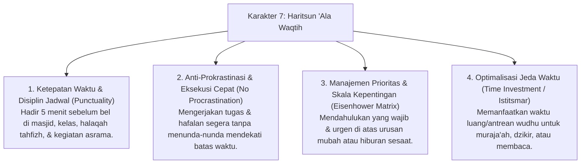

# P3-10-Haritsun-Ala-Waqtih-Induk (Karakter 7: Menjaga & Mengoptimalkan Waktu)

## Tujuan
Menetapkan kerangka kapasitas menyeluruh untuk **Karakter 7: Haritsun 'Ala Waqtih (Menjaga & Mengoptimalkan Waktu)** dalam ekosistem pesantren TUMBUH: membentuk santri yang menghargai setiap detik kehidupan sebagai modal akhirat, disiplin mematuhi jadwal harian asrama dan KBM, terbebas dari penyakit menunda-nunda (*Procrastination*), serta terampil mengelola prioritas kegiatan secara produktif.

---

## 1. 4 Dimensi Karakter Haritsun 'Ala Waqtih

---

## 2. Matriks Rubrik 4 Level Capaian Haritsun 'Ala Waqtih

| Dimensi Perilaku | Level 1: Emerging (T1) | Level 2: Developing (T2) | Level 3: Proficient (T3) | Level 4: Exemplary (T4 - Qudwah) |
| :--- | :--- | :--- | :--- | :--- |
| **Ketepatan Waktu (Punctuality)** | Sering terlambat hadir di kelas/masjid, butuh dipanggil musyrif. | Tiba tepat saat bel berbunyi, terkadang tergesa-gesa berlari. | Selalu hadir 5 menit sebelum bel berbunyi secara tenang & siap belajar. | Mengingatkan dan mengajak rekan sekamar untuk berangkat bersama lebih awal. |
| **Penyelesaian Tugas (Tadbir)** | Menunda tugas hingga malam terakhir / menyalin tugas teman terburu-buru. | Mengerjakan tugas jika ada batas waktu mendesak (*Deadline pressure*). | Memiliki jadwal belajar mandiri, mencicil hafalan & tugas jauh-jauh hari. | Menyelesaikan tugas lebih awal & membantu rekan belajar yang kesulitan (*Tutor Sebaya*). |
| **Pemanfaatan Waktu Luang** | Menghabiskan jeda KBM dengan melamun, mengobrol nirfaedah, atau tidur. | Mengisi waktu luang jika diarahkan atau ada teman yang membaca. | Membawa mushaf saku/buku bacaan di sela-sela antrean makan/wudhu. | Memandu sesi muraja'ah kelompok di waktu luang & menjadi pelopor produktivitas. |

---

## 3. Status Dokumen
* **Status**: 🌟 **A+ (Dokumen Induk Haritsun 'Ala Waqtih)**
* **Level**: Project 3 - `03 Capacity Framework / 10 Haritsun Ala Waqtih`
* **Langkah Berikutnya**: Melengkapi sub-modul 01 hingga 14.
