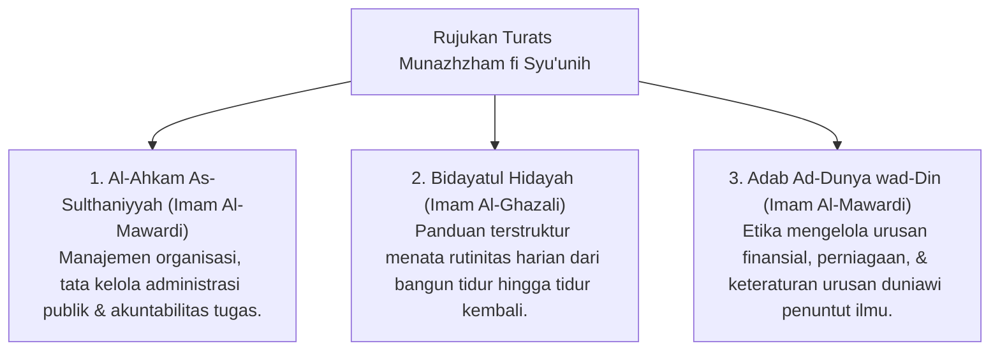

# P3-11-01-Filosofi-dan-Landasan-Turats (Munazhzham fi Syu'unih)

## Tujuan
Membedah landasan filosofis ketertiban dan kerapian alam semesta (*Sunnatullah Itqan & Tanzhim*), dalil Al-Qur'an/Hadits, dan rujukan kitab Turats tentang manajemen kehidupan islami.

---

## 1. Landasan Nash Al-Qur'an & As-Sunnah

### 1. QS. An-Naml [27]: 88
> صُنْعَ اللَّهِ الَّذِي أَتْقَنَ كُلَّ شَيْءٍ ۚ إِنَّهُ خَبِيرٌ بِمَا تَفْعَلُونَ
> *"(Begitulah) perbuatan Allah yang membuat dengan kokoh dan rapi (sempurna) segala sesuatu. Sesungguhnya Allah Maha Mengetahui apa yang kamu kerjakan."*

### 2. HR. Al-Baihaqi (Syu'abul Iman No. 4931 - Hadits Hasan)
> إِنَّ اللَّهَ تَعَالَى يُحِبُّ إِذَا عَمِلَ أَحَدُكُمْ عَمَلًا أَنْ يُتْقِنَهُ
> *"Sesungguhnya Allah Ta'ala mencintai jika salah seorang di antara kalian melakukan suatu pekerjaan, ia melakukannya dengan itqan (rapi, teliti, teratur, dan profesional)."*

---

## 2. Rujukan Khazanah Turats Klasik

---

## 3. Status Dokumen
* **Status**: 🌟 **A+ (Tervalidasi & Siap Diimplementasikan)**
* **Level**: Project 3 - `03 Capacity Framework / 11 Munazhzham fi Syuunih / 01 Philosophy`
