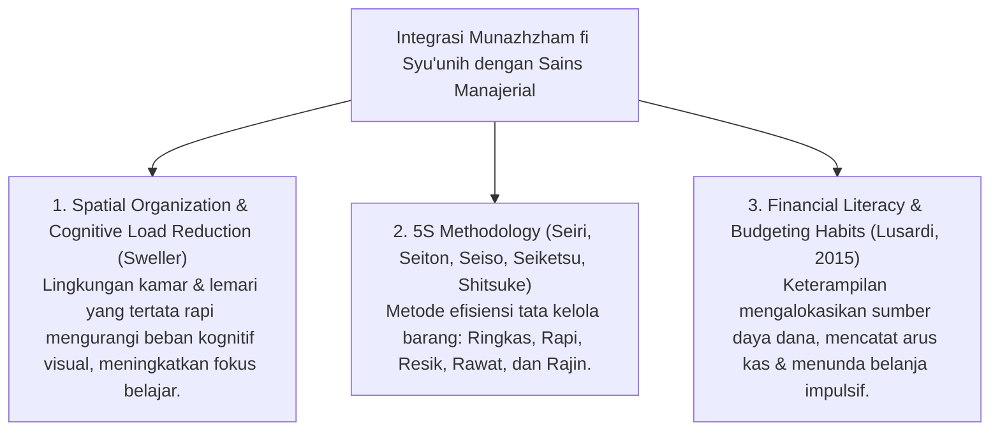

# P3-11-02-Definisi-dan-Konseptualisasi (Munazhzham fi Syu'unih)

## Tujuan
Menetapkan definisi operasional, batasan istilah, dan integrasi sains modern (*Organizational Skills, Spatial Order & Financial Literacy - CASEL SEL*) dari karakter **Munazhzham fi Syu'unih**.

---

## 1. Definisi Operasional Baku

> **Munazhzham fi Syu'unih dalam Ekosistem TUMBUH adalah:**  
> *"Kapasitas manajerial dan kepribadian rapi santri dalam menata seluruh urusan kehidupan fisik, akademik, finansial, dan sosialnya secara terstruktur, sistematis, dan terencana, yang termanifestasikan dalam penerapan metodologi 5R di asrama, pengelolaan keuangan yang bijak, serta kemampuan memimpin organisasi dengan tertib administrasi."*

---

## 2. Integrasi Konsep Sains & CASEL SEL

---

## 3. Status Dokumen
* **Status**: 🌟 **A+ (Tervalidasi & Siap Diimplementasikan)**
* **Level**: Project 3 - `03 Capacity Framework / 11 Munazhzham fi Syuunih / 02 Definition`
