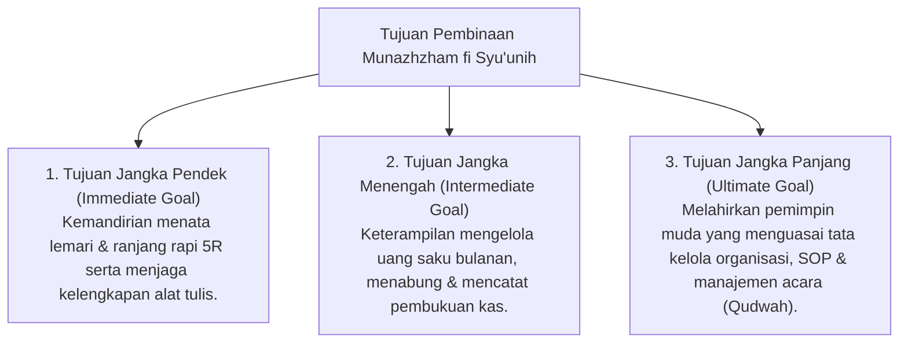

# P3-11-03-Tujuan-dan-Target-Capaian (Munazhzham fi Syu'unih)

## Tujuan
Menetapkan tujuan jangka pendek, menengah, dan panjang pembinaan karakter **Munazhzham fi Syu'unih** pada santri di lingkungan pesantren TUMBUH.

---

## 1. 3 Tingkatan Tujuan Pembinaan Keteraturan

---

## 2. Target Capaian Kuantitatif & Kualitatif

1. **Target Kuantitatif**:
   - 100% lemari dan ranjang kamar santri lulus audit standar 5R mingguan.
   - 90%+ santri memiliki dan aktif mengisi buku catatan kas uang saku pribadi.
2. **Target Kualitatif**:
   - Lingkungan asrama terlihat estetik, rapi, bersih, dan menumbuhkan rasa nyaman (*Bi'ah Shalihah*) bagi proses pembinaan adab.

---

## 3. Status Dokumen
* **Status**: 🌟 **A+ (Tervalidasi & Siap Diimplementasikan)**
* **Level**: Project 3 - `03 Capacity Framework / 11 Munazhzham fi Syuunih / 03 Purpose`
