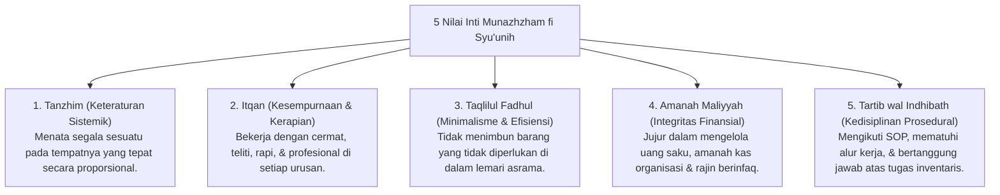

# P3-11-04-Nilai-Inti-dan-Prinsip-Keteraturan (Munazhzham fi Syu'unih)

## Tujuan
Merumuskan nilai-nilai inti (*Core Values*) dan prinsip syariat yang menjiwai karakter **Munazhzham fi Syu'unih** dalam kehidupan santri.

---

## 1. 5 Nilai Inti Munazhzham fi Syu'unih

---

## 2. Status Dokumen
* **Status**: 🌟 **A+ (Tervalidasi & Siap Diimplementasikan)**
* **Level**: Project 3 - `03 Capacity Framework / 11 Munazhzham fi Syuunih / 04 Core Values`
