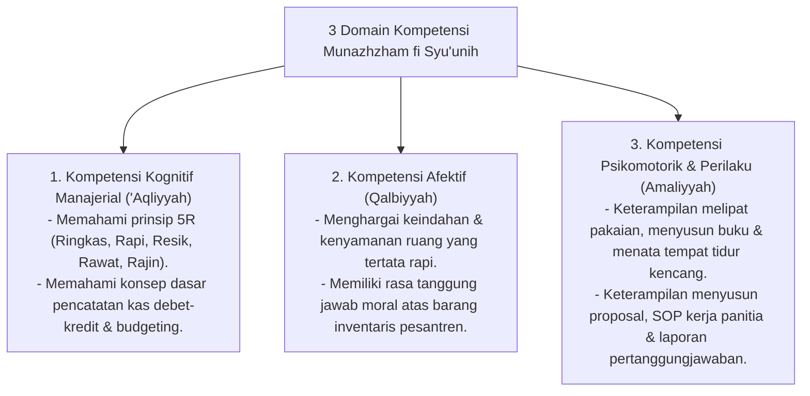

# P3-11-05-Standar-Kompetensi-dan-Taksonomi (Munazhzham fi Syu'unih)

## Tujuan
Menetapkan **Standar Capaian Pembelajaran & Taksonomi Kompetensi** karakter Munazhzham fi Syu'unih untuk seluruh jenjang santri di pesantren TUMBUH.

---

## 1. 3 Domain Kompetensi Munazhzham fi Syu'unih

---

## 2. Matriks Capaian Berjenjang Sesuai Tangga TUMBUH

* **Jenjang T1 (Kelas 7 / 10 Baru)**: Menguasai keterampilan dasar merapikan ranjang dan melipat baju di lemari, mencatat uang jajan sederhana.
* **Jenjang T2 (Kelas 8 / 11)**: Menjaga inventaris kamar secara mandiri, memiliki pembukuan keuangan pribadi rapi, membagi tugas piket adil.
* **Jenjang T3 (Kelas 9 / 12)**: Mampu mengorganisir kegiatan belajar kelompok, mengarsipkan berkas akademik secara rapi dan sistematis.
* **Jenjang T4 (Santri Akhir / Teladan)**: Memimpin kepengurusan organisasi santri, menyusun master plan program kerja tahunan & laporan akuntabel (*Qudwah*).

---

## 3. Status Dokumen
* **Status**: 🌟 **A+ (Tervalidasi & Siap Diimplementasikan)**
* **Level**: Project 3 - `03 Capacity Framework / 11 Munazhzham fi Syuunih / 05 Competencies`
