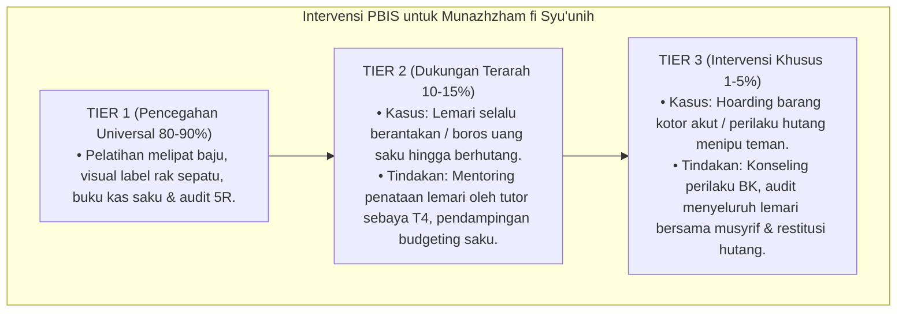

# P3-11-10-Protokol-Intervensi-dan-Pembiasaan (Munazhzham fi Syu'unih)

## Tujuan
Menetapkan protokol pembiasaan kerapian asrama (*5R Dorm SOP*) dan pemetaan intervensi bertingkat (*PBIS Multi-Tier Intervention*) untuk menumbuhkan budaya keteraturan dan tanggung jawab finansial santri.

---

## 1. Protokol Pembiasaan Rutin Asrama (Tier 1: Universal 100%)

1. **Ritual 5R Kamar Pagi (*Morning 5R Habit*)**:
   - Sebelum berangkat ke kelas (pk 06.45), kasur wajib rapi terbentang kencang, lemari tertutup rapat, dan lantai disapu bersih.
2. **Inspeksi Kamar 5R Acak (*Spot-Check Audit*)**:
   - Musyrif melakukan audit penilaian kamar 2x sepekan menggunakan rubrik 5R digital.
3. **Pemberian Apresiasi Kamar Terbersih & Terapi (*Clean Room Award*)**:
   - Kamar dengan nilai 5R tertinggi mendapatkan reward apresiasi di apel pekanan.

---

## 2. Pemetaan Intervensi Khusus PBIS

---

## 3. Status Dokumen
* **Status**: 🌟 **A+ (Tervalidasi & Siap Diimplementasikan)**
* **Level**: Project 3 - `03 Capacity Framework / 11 Munazhzham fi Syuunih / 10 Intervention Mapping`
