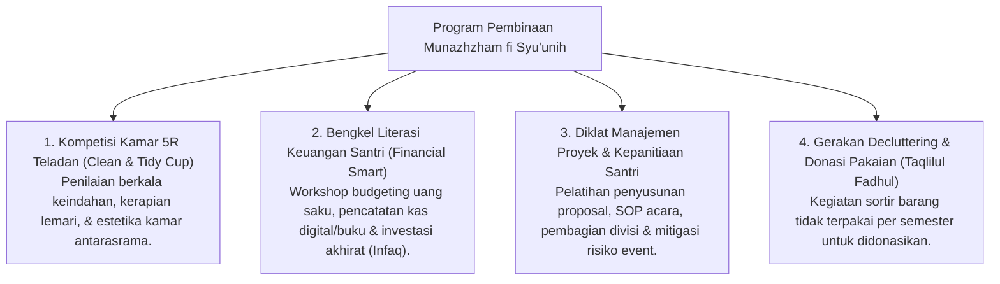

# P3-11-11-Program-Pembinaan-dan-Halaqah (Munazhzham fi Syu'unih)

## Tujuan
Menetapkan daftar program pembinaan terstruktur, lokakarya keterampilan praktis, dan kegiatan manajemen organisasi santri di pesantren TUMBUH.

---

## 1. 4 Program Unggulan Pembinaan Keteraturan

---

## 2. Status Dokumen
* **Status**: 🌟 **A+ (Tervalidasi & Siap Diimplementasikan)**
* **Level**: Project 3 - `03 Capacity Framework / 11 Munazhzham fi Syuunih / 11 Programs`
