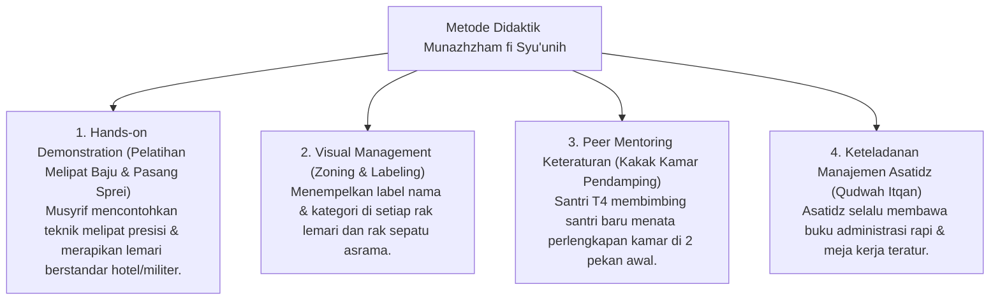

# P3-11-12-Metode-Pedagogi-dan-Didaktik-Keteraturan (Munazhzham fi Syu'unih)

## Tujuan
Menetapkan metode pedagogis dan pendekatan didaktik dalam melatihkan keteraturan hidup, metode 5R, dan kecakapan manajerial praktis bagi santri.

---

## 1. 4 Metode Pedagogi Pengajaran Keteraturan

---

## 2. Status Dokumen
* **Status**: 🌟 **A+ (Tervalidasi & Siap Diimplementasikan)**
* **Level**: Project 3 - `03 Capacity Framework / 11 Munazhzham fi Syuunih / 12 Methods`
