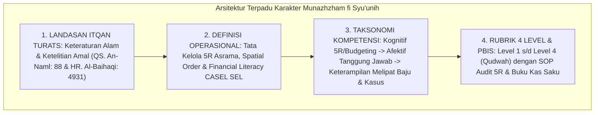

# P3-11-14-Sintesis-dan-Validasi-Munazhzham-fi-Syuunih

## Tujuan
Menyintesiskan seluruh modul kapasitas **Munazhzham fi Syu'unih (Karakter 8)**—mencakup landasan filosofis, definisi operasional, standar kompetensi, rubrik 4 level, dan protokol intervensi PBIS—serta menetapkan bukti validasi kelayakan implementasi.

---

## 1. Arsitektur Sintesis Kapasitas Munazhzham fi Syu'unih

---

## 2. Matriks Uji Validitas Karakter 8

| Komponen Uji | Tolok Ukur Validasi | Status |
| :--- | :--- | :---: |
| **Landasan Syariat** | Selaras dengan hadits kecintaan Allah terhadap amal yang *Itqan* (rapi). | ✅ **Lolos** |
| **Integrasi Manajemen 5R** | Mengurangi beban kognitif dan menciptakan lingkungan kamar kondusif. | ✅ **Lolos** |
| **Operasionalitas Rubrik** | Indikator kerapian lemari/kasur terukur jelas melalui audit 5R musyrif. | ✅ **Lolos** |
| **Literasi Finansial** | Pembukuan uang saku melatih santri mandiri dan menjauhi perilaku boros. | ✅ **Lolos** |

---

## 3. Status Dokumen
* **Status**: ✅ **SELESAI (Status Mutu: A+)**
* **Level**: Subproject Induk Karakter 8
* **Project**: `03 Capacity Framework`
* **Subproject**: `11 Munazhzham fi Syuunih`
* **Langkah Berikutnya**: Melanjutkan ke sub-domain karakter ke-9: **`12 Qadirun Alal Kasb`**.
