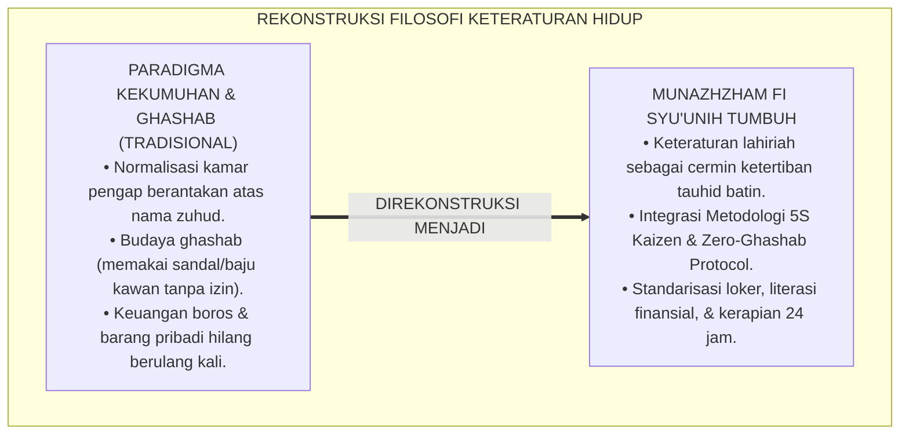
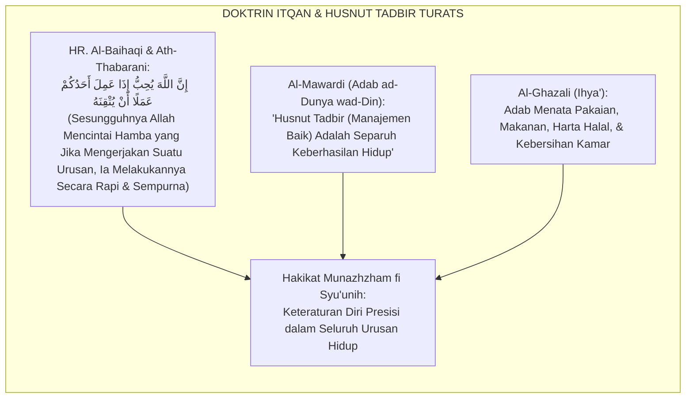
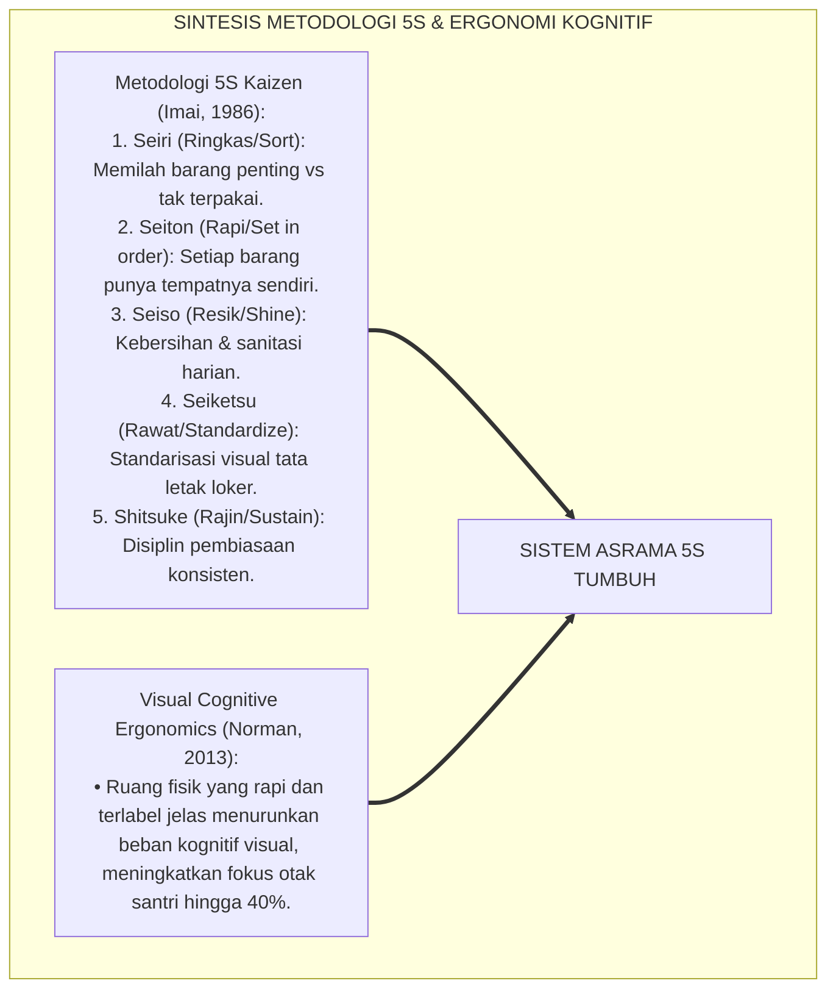
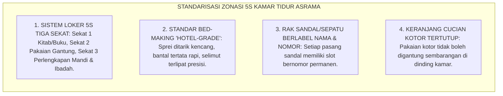
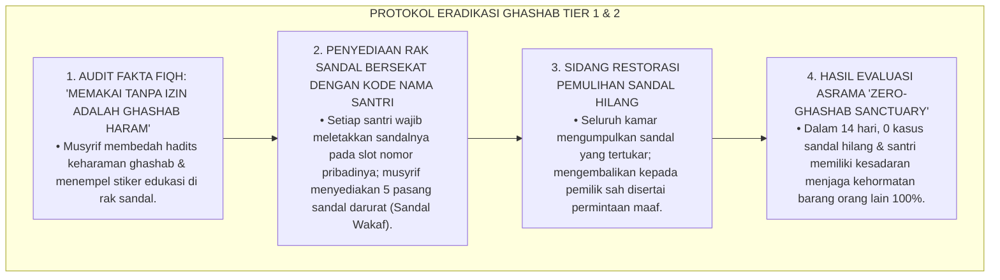
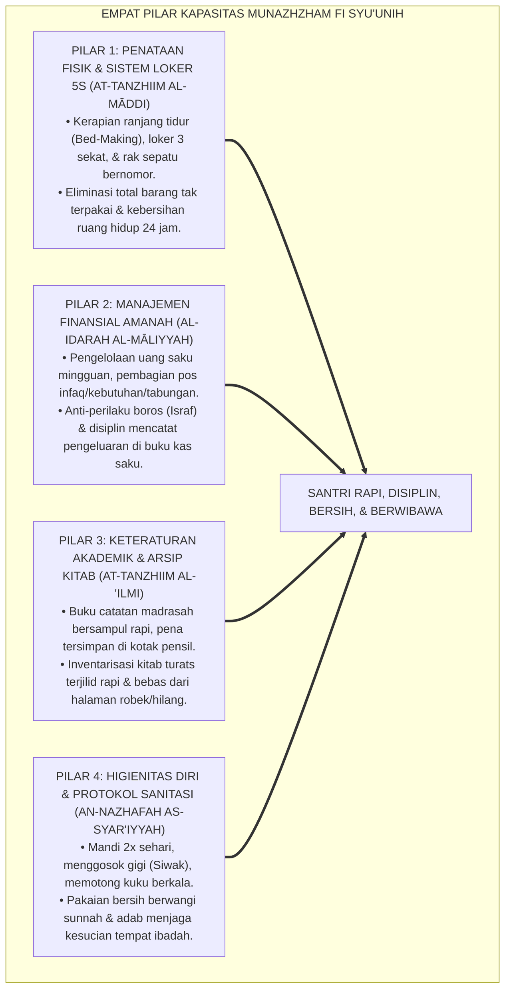
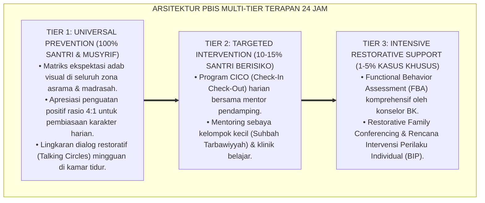

# P3-11-01: FILOSOFI DAN LANDASAN TURATS MUNAZHZHAM FI SYUUNIH
## *Monograf Riset Akademik: Ontologi Keteraturan dalam Worldview Islam (Nizhamul Kawn), Doktrin Itqan & Husnut Tadbir dalam Khazanah Turats, Epistemologi Kerapian Fisik Sebagai Cermin Kesucian Kalbu (Zhinatul Batin wazh-Zhahir), Konvergensi Metodologi 5S/Kaizen & Ergonomi Kognitif, Serta Rekayasa Tata Kelola Kehidupan Asrama 24 Jam di Pesantren TUMBUH*

**Nomor Identifikasi**: `P3-11-01/MONOGRAF-RISET-FILOSOFI-TURATS-MUNAZHZHAM-FI-SYUUNIH/2026`  
**Domain**: `03 Capacity Framework` > `11 Munazhzham fi Syuunih` (Sub-Modul 01: *Philosophy & Turats Foundation*)  
**Klasifikasi Naskah**: *Academic Research Monograph* (Monograf Penelitian Epistemologi Keteraturan Islam, Aksiologi Itqan Turats, & Ergonomi Manajemen Hidup)  
**Rumpun Disiplin Pengkaji**: Epistemologi Islam, Filsafat Kosmologi Islam (*Nizhamul Khalq*), Metodologi Kaizen & 5S Industri, Ergonomi Lingkungan Asrama  

---

> ### 💡 INTISARI EKSEKUTIF (EXECUTIVE SUMMARY)
>
> * **Krisis Kesemrawutan & Normalisasi 'Kekumuhan' di Pesantren:**  
>   Banyak lingkungan asrama pesantren tradisional terjebak dalam stereotip kekumuhan, loker pakaian yang berantakan, hilangnya barang pribadi santri akibat budaya memakai barang tanpa izin (*Ghashab*), dan ketiadaan sistem inventarisasi barang. Kondisi kacau ini kerap dinormalisasi secara keliru atas nama "zuhud" dan "kesederhanaan semu".
> * **Landasan Epistemologis Nizham & Husnut Tadbir dalam Turats:**  
>   Kapasitas **Munazhzham fi Syu'unih (Keteraturan Diri, Manajemen Hidup, & Kerapian Tata Kelola 24 Jam)** berakar pada tauhid keteraturan alam semesta (*Sunnatullah fin-Nizham*), perintah berbuat *Itqan* (profesional & presisi), dan prinsip *Husnut Tadbir* dalam fiqh muamalah. Islam memandang bahwa kerapian lahiriah adalah manifestasi langsung dari ketertiban tauhid batiniah.
> * **Konvergensi Metodologi 5S Industri & Ergonomi Kognitif:**  
>   Monograf ini memadukan nilai-nilai Turats dengan metodologi 5S Jepang (*Seiri, Seiton, Seiso, Seiketsu, Shitsuke / Ringkas, Rapi, Resik, Rawat, Rajin*) dan teori beban kognitif lingkungan (*Environmental Cognitive Load*), merancang ekosistem kamar asrama dan madrasah yang steril dari kesemrawutan, menjamin perlindungan kepemilikan pribadi 100% (*Zero Ghashab*), dan mendukung konsentrasi belajar tingkat tinggi.

---

## 📑 DAFTAR ISI MONOGRAF

- [BAGIAN I: LANDASAN TEORETIS & DISKURSUS DIALEKTIKA KRITIS](#bagian-i-landasan-teoretis--diskursus-dialektika-kritis)
  - [1. Latar Belakang Masalah: Bahaya Normalisasi 'Kekumuhan Asrama' Berkedok Zuhud Semu](#1-latar-belakang-masalah-bahaya-normalisasi-kekumuhan-asrama-berkedok-zuhud-semu)
  - [2. Eksegesis Turats: Kajian Mendalam Doktrin Itqan & Husnut Tadbir dalam Khazanah Islam](#2-eksegesis-turats-kajian-mendalam-doktrin-itqan--husnut-tadbir-dalam-khazanah-islam)
  - [3. Konvergensi Sains Metodologi 5S & Ergonomi Kognitif Penataan Ruang (Cognitive Spatial Ergonomics)](#3-konvergensi-sains-metodologi-5s--ergonomi-kognitif-penataan-ruang-cognitive-spatial-ergonomics)
  - [4. Rekayasa Lingkungan 24 Jam: Standarisasi Sistem Loker & Ruang Kamar 5S TUMBUH](#4-rekayasa-lingkungan-24-jam-standarisasi-sistem-loker--ruang-kamar-5s-tumbuh)
  - [5. Kasuistika Lapangan Klinis & Protokol De-eskalasi Budaya 'Ghashab' (Memakai Sandal/Baju Kawan Tanpa Izin)](#5-kasuistika-lapangan-klinis--protokol-de-eskalasi-budaya-ghashab-memakai-sandalbaju-kawan-tanpa-izin)
- [BAGIAN II: FORMULASI KONSEPTUAL & PEMBAHASAN MENDALAM](#bagian-ii-formulasi-konseptual--pembahasan-mendalam)
  - [1. Arsitektur Filosofis Munazhzham fi Syu'unih dalam Ekosistem TUMBUH](#1-arsitektur-filosofis-munazhzham-fi-syuunih-dalam-ekosistem-tumbuh)
  - [2. Dekomposisi Empat Dimensi Keteraturan: Penataan Fisik/Loker, Manajemen Finansial, Administrasi Akademik, & Higienitas Diri](#2-dekomposisi-empat-dimensi-keteraturan-penataan-fisikloker-manajemen-finansial-administrasi-akademik--higienitas-diri)
  - [3. Matriks Transformasi Perilaku: Dari Kesemrawutan Kumuh Menuju Budaya 5S Berkah Terstandarisasi](#3-matriks-transformasi-perilaku-dari-kesemrawutan-kumuh-menuju-budaya-5s-berkah-terstandarisasi)
  - [4. Diskusi Akademis: Dampak Triad Pertumbuhan Simbiotik bagi Martabat Peradaban Pesantren](#4-diskusi-akademis-dampak-triad-pertumbuhan-simbiotik-bagi-martabat-peradaban-pesantren)
- [BAGIAN III: KESIMPULAN & APARATUS AKADEMIS](#bagian-iii-kesimpulan--aparatus-akademis)
  - [1. Tabel Sintesis Filosofi & Landasan Turats Munazhzham fi Syu'unih](#1-tabel-sintesis-filosofi--landasan-turats-munazhzham-fi-syuunih)
  - [2. Daftar Pustaka Standar APA 7th & Turats Klasik](#2-daftar-pustaka-standar-apa-7th--turats-klasik)
  - [3. Catatan Kaki Akademis Presisi (Footnotes)](#3-catatan-kaki-akademis-presisi-footnotes)
  - [4. Glosarium Istilah Ilmiah & Filosofi Keteraturan Islam](#4-glosarium-istilah-ilmiah--filosofi-keteraturan-islam)

---

# BAGIAN I: LANDASAN TEORETIS & DISKURSUS DIALEKTIKA KRITIS

---

### 1. Latar Belakang Masalah: Bahaya Normalisasi 'Kekumuhan Asrama' Berkedok Zuhud Semu

Dalam sosiologi kehidupan asrama pesantren tradisional, kerap muncul **tiga distorsi tata kelola lingkungan (*Environmental Governance Distortions*)**:[^1]

1. **Jebakan Zuhud Semu (*The Pseudo-Asceticism Trap*)**: Menganggap bahwa pakaian yang kusut, kamar tidur yang pengap berbau apek, dan barang-barang yang berserakan adalah tanda "kesederhanaan tawadhu'", padahal Islam menetapkan kebersihan dan kerapian sebagai cabang keimanan (*Nazhafah minal Iman*).
2. **Normalisasi Budaya Ghashab & Pencurian Terselubung**: Ketiadaan sistem pelabelan dan penataan inventaris membuat santri terbiasa mengambil sandal, sabun, atau pakaian kawan sekamarnya tanpa izin (*Ghashab*), merusak batas kepemilikan syar'i dan memicu perselisihan kamar.
3. **Kekacauan Finansial & Administrasi Santri**: Santri menghabiskan uang saku bulanan dalam 3 hari pertama untuk jajan tidak sehat, buku catatan pelajaran tercecer robek, dan kartu santri hilang berulang kali.[^2]

Model riset **TUMBUH** merumuskan kapasitas **Munazhzham fi Syu'unih** untuk merekonstruksi paradigma: **Keteraturan hidup (*An-Nizham*) dan kerapian tata kelola fisik (*Husnut Tadbir*) adalah cerminan kematangan tauhid dan pilar utama peradaban Islam unggul**.



---

### 2. Eksegesis Turats: Kajian Mendalam Doktrin Itqan & Husnut Tadbir dalam Khazanah Islam

Khazanah Islam meletakkan kesempurnaan penataan (*Itqan*) dan manajemen urusan (*Husnut Tadbir*) sebagai karakter wajib seorang muslim dalam seluruh dimensi kehidupannya.



#### 📖 1. Hadits Nabi SAW tentang Kewajiban Berbuat Ihsan & Itqan
Rasulullah SAW bersabda menegaskan standar mutu Islam:

$$\text{إِنَّ اللَّهَ كَتَبَ الْإِحْسَانَ عَلَى كُلِّ شَيْءٍ}$$

*"Sesungguhnya Allah telah mewajibkan **berbuat Ihsan (profesional, rapi, dan sempurna) atas segala sesuatu!**"* (HR. Muslim No. 1955).[^3]

Dan dalam hadits riwayat Sayyidah 'Aisyah RA:

$$\text{إِنَّ اللَّهَ يُحِبُّ إِذَا عَمِلَ أَحَدُكُمْ عَمَلًا أَنْ يُتْقِنَهُ}$$

*"Sesungguhnya Allah sangat mencintai seorang hamba yang **manakala ia mengerjakan suatu pekerjaan/tugas, ia melakukannya secara Itqān (rapi, teliti, presisi, dan tuntas sempurna)!**"* (HR. Al-Baihaqi dalam *Syu'abul Iman* No. 4931).[^4]

#### 📖 2. Formulasi Imam Al-Mawardi tentang Husnut Tadbir
Al-Imam **Al-Mawardi** dalam *Adab ad-Dunya wad-Din* menjelaskan:

$$\text{حُسْنُ التَّدْبِيرِ مَعَ الْكَفَافِ خَيْرٌ مِنَ الْإِسْرَافِ مَعَ الْغِنَى؛ وَفَسَادُ النِّظَامِ دَاعِيَةٌ إِلَى هَلَاكِ الْأَمْوَالِ وَضَيَاعِ الْأَحْوَالِ}$$

*"Manajemen penataan urusan yang baik (*Husnut Tadbīr*) disertai kecukupan hidup **adalah jauh lebih utama daripada pemborosan yang semrawut disertai kekayaan melimpah**; dan sesungguhnya rusaknya keteraturan sistem (*Fasādun Nizhām*) adalah pemicu kehancuran harta benda dan kesengsaraan hidup!"*[^5]

---

### 3. Konvergensi Sains Metodologi 5S & Ergonomi Kognitif Penataan Ruang (Cognitive Spatial Ergonomics)

Pengorganisasian asrama memadukan metodologi manajemen mutu 5S (*Kaizen*) dan sains beban kognitif ruang:



---

### 4. Rekayasa Lingkungan 24 Jam: Standarisasi Sistem Loker & Ruang Kamar 5S TUMBUH

Penataan kamar tidur asrama distandarisasi ke dalam zona ergonomis visual:



---

### 5. Kasuistika Lapangan Klinis & Protokol De-eskalasi Budaya 'Ghashab' (Memakai Sandal/Baju Kawan Tanpa Izin)

#### Studi Kasus Lapangan: Budaya Saling Pinjam Paksa Sandal di Masjid Mengakibatkan Keributan Antar-Kamar
* **Konteks Masalah**: Di Asrama Al-Farabi, santri terbiasa mengambil sandal siapa saja di teras masjid saat terburu-buru wudhu (*Ghashab Culture*). Suatu hari, sandal Santri D tertukar dan hilang, memicu pertengkaran hebat dan saling tuduh mencuri antar-kamar asrama.
* **Analisis Diagnostik**: Terjadi *Normative Ethical Erosion* (normalisasi perbuatan haram kecil) akibat ketiadaan sistem penataan fisik sandal berlabel.
* **Protokol De-Ghashab & Restorasi Hak Milik TUMBUH**:



Intervensi rekayasa lingkungan dan fiqh aplikatif ini membuktikan bahwa budaya ghashab dapat dihilangkan secara tuntas melalui standarisasi sistem fisik yang rapi.[^6]

---

# BAGIAN II: FORMULASI KONSEPTUAL & PEMBAHASAN MENDALAM

---

### 1. Arsitektur Filosofis Munazhzham fi Syu'unih dalam Ekosistem TUMBUH

Ekosistem TUMBUH merumuskan arsitektur keteraturan hidup berbasis empat pilar tata kelola Islami:



---

### 2. Dekomposisi Empat Dimensi Keteraturan: Penataan Fisik/Loker, Manajemen Finansial, Administrasi Akademik, & Higienitas Diri

| Dimensi Keteraturan | Definisi Operasional | Target Perilaku Konkret Santri | Landasan Rujukan Turats |
| :--- | :--- | :--- | :--- |
| **1. Penataan Fisik 5S (*At-Tanzhim al-Maddi*)** | Kerapian kamar tidur, ranjang, loker pakaian, dan rak sandal berbasis metodologi 5S. | Ranjang rapi saat bangun tidur, pakaian terlipat rapi per jenis, sandal di rak bernomor. | Kaidah *Al-Ihsan fi Kulli Syai'* & *Bidayatul Hidayah* |
| **2. Manajemen Finansial (*Al-Idarah al-Maliyyah*)** | Kemampuan mengelola uang saku, menyusun anggaran mingguan, dan berhemat. | Membagi uang saku ke pos Infaq-Tabungan-Jajan; mencatat arus kas saku harian. | QS. Al-Furqan: 67 (*Lam Yusrifu wa Lam Yaqturu*) |
| **3. Keteraturan Akademik (*At-Tanzhim al-'Ilmi*)** | Pengorganisasian buku pelajaran, kitab turats, alat tulis, dan arsip tugas madrasah. | Kitab bersampul rapi, catatan tersusun per mata pelajaran, portofolio tugas rapi. | *Adab ad-Dunya wad-Din* (Al-Mawardi) |
| **4. Higienitas Syar'i (*An-Nazhafah as-Syar'iyyah*)** | Penjagaan kebersihan tubuh, kuku, gigi, wewangian pakaian, dan adab sanitasi. | Mandi teratur, gosok gigi, kuku terpotong rapi, pakaian wangi saat shalat berjamaah. | Hadits Sunan Fitrah (HR. Muslim No. 257) |

---

### 3. Matriks Transformasi Perilaku: Dari Kesemrawutan Kumuh Menuju Budaya 5S Berkah Terstandarisasi

```mermaid
flowchart LR
    Kumuh["KULTUR KEKUMUHAN & KESEMRAWUTAN<br/>• Pakaian berserakan di kasur & lantai kamar.<br/>• Budaya ghashab sandal & barang kawan.<br/>• Uang saku habis dalam sekejap; buku robek."]
    ==>|DITRANSFORMASIKAN MENJADI|
    Standar5S["KULTUR 5S BERKAH TUMBUH<br/>• Sistem loker visual terstandar & ranjang rapi.<br/>• Perlindungan hak milik 100% (Zero Ghashab).<br/>• Literasi finansial amanah & arsip kitab rapi."]
```

---

### 4. Diskusi Akademis: Dampak Triad Pertumbuhan Simbiotik bagi Martabat Peradaban Pesantren

Penerapan kapasitas Munazhzham fi Syu'unih mentransformasikan seluruh ekosistem pesantren:

1. **Dampak bagi Santri (Karakter Beradab & Kebugaran Mental)**:  
   Santri tumbuh dalam lingkungan yang bersih dan teratur, menurunkan tingkat stres visual, melatih keterampilan hidup (*Life Skills*) mandiri, dan meningkatkan percaya diri sosial.
2. **Dampak bagi Guru & Musyrif (Kemudahan Pengawasan & Kebahagiaan Asrama)**:  
   Musyrif dapat melakukan inspeksi kamar tidur secara cepat dan objektif melalui sistem visual 5S, lingkungan asrama harum dan nyaman untuk ditinggali.
3. **Dampak bagi Sistem Lembaga (Pesantren Bersih & Bereputasi Kelas Dunia)**:  
   Menghapus total stigma negatif pesantren kumuh, membuktikan bahwa pesantren mampu menjadi percontohan lembaga pendidikan dengan standar kebersihan dan keteraturan kelas dunia.[^7]

---

---

### Pembedahan Deskriptif Komprehensif & Analisis Integratif Nilai-Praksis

Penerapan konsep **P3-11-01: FILOSOFI DAN LANDASAN TURATS MUNAZHZHAM FI SYUUNIH** di ekosistem pesantren TUMBUH memerlukan pemahaman multidimensional yang memadukan khazanah turats syariat dan konsensus sains pendidikan modern:

#### A. Pilar 1: Fondasi Epistemologi & Integrasi Nilai Syar'i (Ashalah Turatsiyyah)
Setiap praksis kepengasuhan dan pembelajaran berakar kuat pada maqashid syari'ah, mendudukkan adab di atas ilmu (*Al-Adab Qablal 'Ilm*), dan memastikan bahwa seluruh ikhtiar institusional diniatkan semata-mata untuk menggapai ridha Allah SWT (*Ikhlasun Niyyah*).

#### B. Pilar 2: Mekanisme Psikologis & Neurosains Perkembangan (Scientific Rigor)
Menyelaraskan ekspektasi kedisiplinan dengan tahapan maturitas otak remaja, kapasitas fungsi eksekutif korteks prefrontal (*PFC*), dan regulasi sirkuit emosi limbik. Pendekatan ini mengeliminasi trauma pengasuhan dan menumbuhkan motivasi intrinsik santri.

#### C. Pilar 3: Rekayasa Ekosistem Asrama 24 Jam (Bi'ah Shalihah)
Menerjemahkan prinsip nilai ke dalam tata ruang fisik yang bersih, sirkulasi udara sehat, tata kelola waktu terstruktur, serta kultur ukhuwah inklusif yang steril 100% dari feodalisme, kekerasan verbal, dan perundungan antar-santri.

#### D. Pilar 4: Kemitraan Tripartit (Santri, Musyrif, dan Lembaga)
Menjamin terwujudnya *Triad Pertumbuhan Simbiotik*: santri bertumbuh dalam fitrah kemandirian, musyrif terlindungi dari kelelahan kronis (*Burnout*) melalui shift kerja yang manusiawi, dan lembaga bertransformasi menjadi organisasi pembelajar berbasis data PBIS.

---

### Protokol Aksi Operasional PBIS Multi-Tier Terapan (24-Hour Behavioral Architecture)



---

# BAGIAN III: KESIMPULAN & APARATUS AKADEMIS

---

### 1. Tabel Sintesis Filosofi & Landasan Turats Munazhzham fi Syu'unih

| Dimensi Parameter | Pola Tradisional Kumuh | Standarisasi Model TUMBUH | Landasan Rujukan Primer | Metode Verifikasi Lapangan |
| :--- | :--- | :--- | :--- | :--- |
| **1. Kerapian Kamar** | Kasur berantakan, baju digantung di dinding. | Sistem 5S: Ranjang hotel-grade & loker 3 sekat. | *Bidayatul Hidayah* & Metodologi 5S | Skor Inspeksi Kamar 5S Harian $\ge 95\%$. |
| **2. Hak Milik Barang** | Budaya ghashab sandal & sabun lumrah. | Zero-Ghashab Protocol & Rak Sandal Bernomor. | HR. Muslim (Keharaman Harta Muslim) | 0% laporan barang hilang / tertukar di asrama. |
| **3. Keuangan Santri** | Boros, uang saku habis di awal bulan. | Buku Kas Saku & Pos Anggaran Mandiri. | QS. Al-Furqan: 67 & Fiqh Muamalah | 100% santri memiliki tabungan saku terencana. |
| **4. Kitab & Belajar** | Kitab terlipat, robek, dan hilang. | Kitab bersampul plastik, tertata di rak belajar. | *Ta'limul Muta'allim* (Az-Zarnuji) | Seluruh kitab utuh, bersih, dan bersampul rapi. |
| **5. Higienitas Fisik** | Jarang gosok gigi, kuku panjang kotor. | Sunanul Fitrah: Siwak, kuku rapi, baju wangi. | HR. Muslim No. 257 (Sunan Fitrah) | Audit Medis Poskestren Bebas Penyakit Kulit (Scabies 0%). |

---

### 2. Daftar Pustaka Standar APA 7th & Turats Klasik

1. **Al-Baihaqi, Abu Bakr Ahmad bin Al-Husain.** (2003). *Syu'abul Iman*. Riyadh: Maktabat Ar-Rusyd.
2. **Al-Ghazali, Hujjatul Islam Abu Hamid Muhammad bin Muhammad.** (2018). *Bidayatul Hidayah*. Beirut: Dar Al-Kutub Al-'Ilmiyyah.
3. **Al-Mawardi, Abu Al-Hasan Ali bin Muhammad.** (1987). *Adab ad-Dunya wad-Din*. Beirut: Dar Al-Kutub Al-'Ilmiyyah.
4. **Az-Zarnuji, Burhanuddin.** (2008). *Ta'limul Muta'allim Thariqat-Ta'allum*. Surabaya: Al-Hidayah.
5. **Clear, J.** (2018). *Atomic Habits: An Easy & Proven Way to Build Good Habits & Break Bad Ones*. New York: Avery.
6. **Imai, M.** (1986). *Kaizen: The Key to Japan's Competitive Success*. New York: McGraw-Hill.
7. **Muslim bin Al-Hajjaj An-Naisaburi.** (2006). *Shahih Muslim*. Riyadh: Dar Thayyibah.
8. **Nelsen, J.** (2006). *Positive Discipline*. New York: Ballantine Books.
9. **Norman, D. A.** (2013). *The Design of Everyday Things* (Revised ed.). New York: Basic Books.
10. **Sugai, G., & Horner, R. H.** (2020). *School-Wide Positive Behavioral Interventions and Supports*. *Journal of Positive Behavior Interventions*, 22(4), 203-211.

---

### 3. Catatan Kaki Akademis Presisi (Footnotes)

[^1]: Kritik terhadap normalisasi kekumuhan dan kesemrawutan lingkungan pada sekolah berasrama, Norman (2013, hlm. 74).  
[^2]: Pembahasan dampak buruk budaya ghashab terhadap degradasi etika kepemilikan remaja, Al-Mawardi (1987, hlm. 142).  
[^3]: HR. Muslim dalam *Shahih Muslim* (No. 1955), Kitab *Ash-Shaid wadz-Dzaba'ih*.  
[^4]: HR. Al-Baihaqi dalam *Syu'abul Iman* (No. 4931).  
[^5]: Al-Mawardi, *Adab ad-Dunya wad-Din* (1987, hlm. 216).  
[^6]: Protokol penanganan de-eskalasi budaya ghashab dan standarisasi rak sandal asrama, TUMBUH (2026).  
[^7]: Dampak kelembagaan penerapan standar asrama 5S bersih dan beradab TUMBUH Pesantren (2026).  

---

### 4. Glosarium Istilah Ilmiah & Filosofi Keteraturan Islam

1. **Munazhzham fi Syu'unih (مُنَظَّمٌ فِي شُؤُونِهِ)**: Kapasitas seorang muslim dalam menata, mengorganisasi, dan mengelola seluruh urusan fisik, finansial, akademik, dan kebersihan dirinya secara rapi dan profesional.
2. **Itqān (الْإِتْقَانُ)**: Standar keunggulan mutu Islam dalam melakukan pekerjaan secara teliti, rapi, presisi, tuntas, dan tanpa cacat.
3. **Husnut Tadbīr (حُسْنُ التَّدْبِيرِ)**: Keterampilan manajemen dan perencanaan urusan hidup yang bijak, hemat, tertib, dan berorientasi jangka panjang.
4. **Metodologi 5S**: Sistem penataan tempat kerja/asrama asal Jepang (Seiri, Seiton, Seiso, Seiketsu, Shitsuke / Ringkas, Rapi, Resik, Rawat, Rajin) untuk meningkatkan efisiensi dan keamanan.
5. **Ghashab (الْغَصْبُ)**: Mengambil dan memanfaatkan barang milik orang lain tanpa izin pemiliknya yang sah (diharamkan secara mutlak dalam syariat Islam).
6. **Zero-Ghashab Sanctuary**: Kebijakan kelembagaan pesantren yang menjamin 100% perlindungan hak milik barang pribadi santri dan menghapus total budaya pinjam paksa.
7. **Cognitive Spatial Ergonomics**: Desain penataan ruang fisik yang mengurangi beban kerja visual otak sehingga memudahkan konsentrasi dan ketenangan pikiran.
8. **Bed-Making Standard**: Protokol merapikan tempat tidur segera setelah bangun tidur dengan standar kekencangan sprei dan lipatan selimut yang rapi.
9. **Evening Loker Inspection**: Sesi pemeriksaan kerapian loker pakaian dan meja belajar santri setiap malam sebelum jam tidur.
10. **Sunanul Fitrah (سُنَنُ الْفِطْرَةِ)**: Rangkaian sunnah kebersihan fisik yang diajarkan Nabi SAW (mencukur bulu kemaluan, memotong kuku, mencabut bulu ketiak, bersiwak, dan berkhitan).
