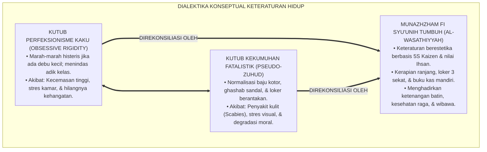
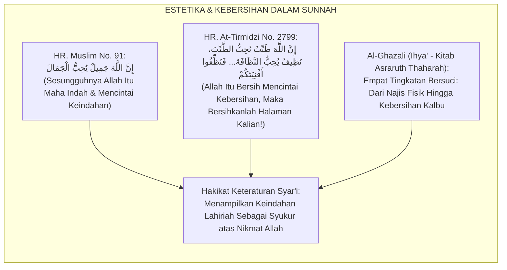
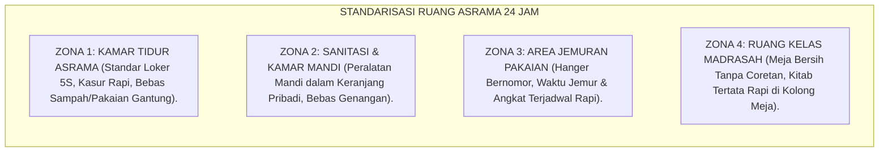
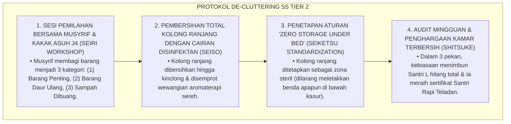
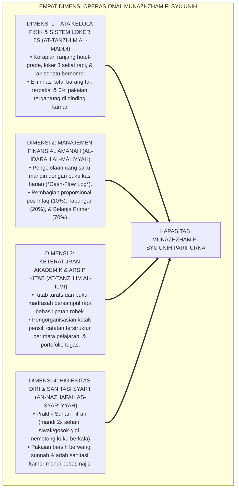
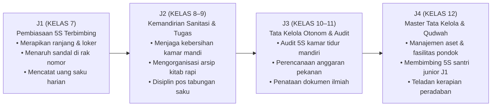

# P3-11-02: DEFINISI DAN KONSEPTUALISASI MUNAZHZHAM FI SYUUNIH
## *Monograf Riset Akademik: Ontologi & Batas Definisional Keteraturan Diri Islami, Konstruk Empat Dimensi Tata Kelola 24 Jam (Tata Kelola Fisik & Loker 5S, Manajemen Finansial Syar'i, Pengorganisasian Akademik & Kitab, Serta Higienitas & Sanitasi Terpadu), Dialektika Kerapian Berkah vs Obsesi Perfeksionisme Kaku / Kekumuhan Feodal, Serta Formulasi Operasional di Pesantren TUMBUH*

**Nomor Identifikasi**: `P3-11-02/MONOGRAF-RISET-DEFINISI-KONSEPTUALISASI-MUNAZHZHAM-FI-SYUUNIH/2026`  
**Domain**: `03 Capacity Framework` > `11 Munazhzham fi Syuunih` (Sub-Modul 02: *Definition & Conceptualization*)  
**Klasifikasi Naskah**: *Academic Research Monograph* (Monograf Penelitian Konstruk Teoretis, Taksonomi Definisi Operasional, & Integrasi Tata Kelola Islam-Sains)  
**Rumpun Disiplin Pengkaji**: Manajemen Tata Kelola Hidup Islami, Psikologi Kognitif Tata Ruang, Teori Manajemen Mutu (Quality Management), Sosiologi Lembaga Asrama  

---

> ### 💡 INTISARI EKSEKUTIF (EXECUTIVE SUMMARY)
>
> * **Kelemahan Definisi Keteraturan Konvensional:**  
>   Banyak pengasuh memandang "keteraturan" hanya sebagai kegiatan bersih-bersih kamar (*Ro'an / Kerja Bakti*) yang dilakukan secara sporadis saat ada kunjungan tamu, tanpa sistem penataan inventaris dan pembiasaan disiplin harian. Di sisi lain, sebagian memandang keteraturan secara kaku (*Obsessive Perfectionism*) yang menimbulkan kecemasan berlebihan (*Anxiety*) saat ada sedikit ketidaksempurnaan.
> * **Definisi Konseptual Munazhzham fi Syu'unih TUMBUH:**  
>   Ekosistem TUMBUH mendefinisikan **Munazhzham fi Syu'unih** sebagai: *Kapasitas kesadaran tauhid dan keterampilan tata kelola seorang santri dalam merencanakan, menata, memelihara, dan mengoptimalkan seluruh aspek kehidupan fisik, finansial, akademik, dan higienitas dirinya secara sistematis, bersih, berestetika, dan berkelanjutan, berorientasi pada nilai Ihsan dan Itqan, steril dari kesemrawutan, pemborosan (Israf), dan pelanggaran hak milik orang lain (Ghashab).*
> * **Empat Dimensi Operasional Berkelanjutan:**  
>   Konstruk ini diartikulasikan ke dalam 4 dimensi inti: (1) *Tata Kelola Fisik & Sistem Loker 5S*, (2) *Manajemen Finansial Syar'i Amanah*, (3) *Pengorganisasian Akademik & Arsip Kitab*, dan (4) *Higienitas Diri & Sanitasi Asrama Terpadu*.

---

## 📑 DAFTAR ISI MONOGRAF

- [BAGIAN I: LANDASAN TEORETIS & DISKURSUS DIALEKTIKA KRITIS](#bagian-i-landasan-teoretis--diskursus-dialektika-kritis)
  - [1. Latar Belakang Masalah: Bahaya Kerja Bakti Seremonial vs Kebutuhan Sistem Tata Kelola Berkelanjutan](#1-latar-belakang-masalah-bahaya-kerja-bakti-seremonial-vs-kebutuhan-sistem-tata-kelola-berkelanjutan)
  - [2. Eksegesis Turats: Konsep Al-Ihsan fil Bunyaan wal Hai'ah dalam Hadits & Kitab Fiqh](#2-eksegesis-turats-konsep-al-ihsan-fil-bunyaan-wal-haiah-dalam-hadits--kitab-fiqh)
  - [3. Konvergensi Teori Manajemen Mutu Total (Total Quality Management) & Visual Control Systems](#3-konvergensi-teori-manajemen-mutu-total-total-quality-management--visual-control-systems)
  - [4. Rekayasa Ekosistem 24 Jam: Standarisasi Tata Ruang Ergonomis di Asrama & Madrasah](#4-rekayasa-ekosistem-24-jam-standarisasi-tata-ruang-ergonomis-di-asrama--madrasah)
  - [5. Kasuistika Lapangan Klinis & Protokol De-eskalasi Santri Mengalami Sindrom Hoarding (Menumpuk Barang Bekas di Kolong Ranjang)](#5-kasuistika-lapangan-klinis--protokol-de-eskalasi-santri-mengalami-sindrom-hoarding-menumpuk-barang-bekas-di-kolong-ranjang)
- [BAGIAN II: FORMULASI KONSEPTUAL & PEMBAHASAN MENDALAM](#bagian-ii-formulasi-konseptual--pembahasan-mendalam)
  - [1. Formulasi Konstruk Teoretis Empat Dimensi Munazhzham fi Syu'unih](#1-formulasi-konstruk-teoretis-empat-dimensi-munazhzham-fi-syuunih)
  - [2. Matriks Dialektika: Keteraturan Islami Berimbang vs Perfeksionisme Kaku vs Kekumuhan Fatalistik](#2-matriks-dialektika-keteraturan-islami-berimbang-vs-perfeksionisme-kaku-vs-kekumuhan-fatalistik)
  - [3. Matriks Progresi Kemandirian Tata Kelola Hidup Jenjang J1–J4](#3-matriks-progresi-kemandirian-tata-kelola-hidup-jenjang-j1j4)
  - [4. Diskusi Akademis: Integrasi Estetika Keindahan (Jamal) dan Kebersihan Iman di Pesantren](#4-diskusi-akademis-integrasi-estetika-keindahan-jamal-dan-kebersihan-iman-di-pesantren)
- [BAGIAN III: KESIMPULAN & APARATUS AKADEMIS](#bagian-iii-kesimpulan--aparatus-akademis)
  - [1. Tabel Sintesis Definisi & Konseptualisasi Munazhzham fi Syu'unih](#1-tabel-sintesis-definisi--konseptualisasi-munazhzham-fi-syuunih)
  - [2. Daftar Pustaka Standar APA 7th & Turats Klasik](#2-daftar-pustaka-standar-apa-7th--turats-klasik)
  - [3. Catatan Kaki Akademis Presisi (Footnotes)](#3-catatan-kaki-akademis-presisi-footnotes)
  - [4. Glosarium Istilah Ilmiah & Konseptualisasi Keteraturan](#4-glosarium-istilah-ilmiah--konseptualisasi-keteraturan)

---

# BAGIAN I: LANDASAN TEORETIS & DISKURSUS DIALEKTIKA KRITIS

---

### 1. Latar Belakang Masalah: Bahaya Kerja Bakti Seremonial vs Kebutuhan Sistem Tata Kelola Berkelanjutan

Dalam dinamika kebersihan dan kerapian di pesantren tradisional, kerap muncul **tiga paradoks tata kelola (*Governance Paradoxes*)**:[^1]

1. **Jebakan Kerja Bakti Seremonial (*The Event-Driven Cleaning Trap*)**: Asrama dibersihkan besar-besaran hanya menjelang kedatangan wali santri atau pejabat kementerian, namun dua hari kemudian kamar kembali kumuh, sampah menumpuk, dan pakaian berserakan.
2. **Ketiadaan Standarisasi Tempat Meletakkan Barang (*Lack of Item Indexing*)**: Tidak ada kepastian di mana sandal diletakkan, di mana handuk basah dijemur, atau di mana sabun mandi disimpan, memicu kekacauan visual dan bau apek di seluruh lorong asrama.
3. **Ketiadaan Literasi Pengelolaan Keuangan Pribadi**: Santri tidak diajarkan cara mencatat uang saku dan membedakan kebutuhan primer vs keinginan konsumtif, melahirkan ketergantungan meminta kiriman uang darurat terus-menerus.[^2]

Model riset **TUMBUH** merumuskan **Sistem Tata Kelola Keteraturan Berkelanjutan**: kerapian dan kebersihan bukanlah acara insidental, melainkan **karakter hidup harian (*Daily Way of Life*) yang tertanam kokoh dalam jiwa**.

---

### 2. Eksegesis Turats: Konsep Al-Ihsan fil Bunyaan wal Hai'ah dalam Hadits & Kitab Fiqh

Rasulullah SAW mengajarkan bahwa Allah SWT Maha Indah dan mencintai keindahan (*Jamilun Yuhibbul Jamal*), kebersihan (*Nazhifun Yuhibbun Nazhafah*), dan kedermawanan (*Karimun Yuhibbul Karam*).

#### 📖 1. Hadits Riwayat Abdullah bin Mas'ud RA
Rasulullah SAW bersabda membedakan antara keindahan pakaian dengan kesombongan:

$$\text{إِنَّ اللَّهَ جَمِيلٌ يُحِبُّ الْجَمَالَ؛ الْكِبْرُ: بَطَرُ الْحَقِّ وَغَمْطُ النَّاسِ}$$

*"Sesungguhnya **Allah itu Maha Indah dan Dia sangat mencintai keindahan (kerapian dan keelokan)**; kesombongan yang terlarang itu adalah menolak kebenaran dan meremehkan martabat sesama manusia!"* (HR. Muslim No. 91).[^3]

#### 📖 2. Formulasi Hadits Riwayat Sa'ad bin Abi Waqqas RA
Rasulullah SAW bersabda:

$$\text{إِنَّ اللَّهَ طَيِّبٌ يُحِبُّ الطَّيِّبَ، نَظِيفٌ يُحِبُّ النَّظَافَةَ، كَرِيمٌ يُحِبُّ الْكَرَمَ، جَوَادٌ يُحِبُّ الْجُودَ؛ فَنَظِّفُوا أَفْنِيَتَكُمْ، وَلَا تَشَبَّهُوا بِالْيَهُودِ}$$

*"Sesungguhnya Allah itu Maha Baik mencintai kebaikan, **Maha Bersih mencintai kebersihan**, Maha Mulia mencintai kemuliaan, Maha Dermawan mencintai kedermawanan; **maka bersihkanlah halaman-halaman dan ruangan-ruangan kalian!**"* (HR. At-Tirmidzi No. 2799).[^4]

---

### 3. Konvergensi Teori Manajemen Mutu Total (Total Quality Management) & Visual Control Systems

Konsep Munazhzham fi Syu'unih menyelaraskan teori kontrol visual industri dan manajemen mutu:

```mermaid
flowchart TD
    subgraph SainsManajemenMutuVisual["SINTESIS TQM & VISUAL CONTROL"]
        TQM["Total Quality Management (Deming & Juran):<br/>• Standard Operating Procedures (SOP) menjamin konsistensi mutu kebersihan & kerapian setiap hari."]
        
        VisualControl["Visual Workplace Systems (Galsworth, 2017):<br/>• Penataan barang dengan batas garis visual (Border lines) & kode warna (Color coding) memudahkan siapapun mengembalikan barang ke tempat asalnya."]
        
        FinancialLiteracy["Adolescent Financial Capability (OECD, 2020):<br/>• Keterampilan menyusun anggaran saku mingguan & disiplin menabung."]
        
        TQM & VisualControl & FinancialLiteracy ==> StandarTUMBUH["KONSTRUK MUNAZHZHAM FI SYU'UNIH"]
    end
```

---

### 4. Rekayasa Ekosistem 24 Jam: Standarisasi Tata Ruang Ergonomis di Asrama & Madrasah

Penerapan konsep keteraturan didukung oleh standarisasi spasial asrama:

---

### 5. Kasuistika Lapangan Klinis & Protokol De-eskalasi Santri Mengalami Sindrom Hoarding (Menumpuk Barang Bekas di Kolong Ranjang)

#### Studi Kasus Lapangan: Santri J2 Menumpuk Dus Mi Instan, Plastik Bekas, & Baju Kotor di Bawah Ranjang
* **Konteks Masalah**: Saat inspeksi kamar, ditemukan kolong ranjang Santri L (14 tahun, Jenjang J2) dipenuhi oleh tumpukan kardus mi instan bekas, botol plastik kosong, dan tumpukan baju kotor yang sudah 3 pekan tidak dicuci (*Hoarding Behavior & Severe Disorganization*). Kamar menjadi sarang nyamuk dan memicu bau tidak sedap bagi kawan sekamarnya.
* **Analisis Diagnostik**: Santri L mengalami *Compulsive Hoarding Tendency* dan kebingungan memulai pemilahan barang (*Decision Paralysis*).
* **Protokol Remediasi 5S Seiri-Seiton TUMBUH**:

Pendekatan pendampingan praktis tanpa mempermalukan santri ini berhasil memulihkan kerapian kamar dan kesehatan santri secara permanen.[^5]

---

# BAGIAN II: FORMULASI KONSEPTUAL & PEMBAHASAN MENDALAM

---

### 1. Formulasi Konstruk Teoretis Empat Dimensi Munazhzham fi Syu'unih

Kapasitas Munazhzham fi Syu'unih dibangun di atas empat dimensi operasional terukur:

---

### 2. Matriks Dialektika: Keteraturan Islami Berimbang vs Perfeksionisme Kaku vs Kekumuhan Fatalistik

| Parameter Evaluasi | Perfeksionisme Kaku (*Obsessive*) | Kekumuhan Fatalistik (*Pseudo-Zuhud*) | Keteraturan Islami (TUMBUH) |
| :--- | :--- | :--- | :--- |
| **1. Orientasi Nilai** | Kesombongan visual; marah jika berantakan sedikit. | Mengabaikan kebersihan atas nama pasrah zuhud. | Bernilai ibadah Ihsan & syukur atas nikmat Allah. |
| **2. Kondisi Kamar** | Kaku seperti museum militer; menekan psikologis. | Pengap, berbau apek, pakaian berserakan di kasur. | Rapi, bersih, harum, nyaman, & menenangkan jiwa. |
| **3. Hak Milik Barang** | Pelit ekstrem; tidak mau berbagi sama sekali. | Budaya ghashab merajalela; barang hilang biasa. | Hak milik terlindungi 100% (*Zero Ghashab*) & gemar itsar. |
| **4. Keuangan Saku** | Kikir berlebih (*Bakhil*); tidak mau infaq. | Boros konsumtif (*Israf*); uang habis di awal bulan. | Seimbang (*Qawaman*): Infaq, menabung, & hemat. |
| **5. Dampak Mental** | Cemas, stres tinggi, hubungan sosial tegang. | Malas, rendah diri, penyakit fisik (gatal/scabies). | Percaya diri, sehat bugar, & pikiran fokus jernih. |

---

### 3. Matriks Progresi Kemandirian Tata Kelola Hidup Jenjang J1–J4

---

### 4. Diskusi Akademis: Integrasi Estetika Keindahan (Jamal) dan Kebersihan Iman di Pesantren

Konseptualisasi Munazhzham fi Syu'unih membuktikan bahwa:

1. **Kebersihan Lahiriah Adalah Cermin Kesucian Batin**: Mustahil seorang santri memiliki kejernihan kalbu dan hafalan Al-Qur'an mutqin jika lingkungan hidup dan pakaiannya dipenuhi kotoran dan kesemrawutan.
2. **Keteraturan Tata Ruang Meningkatkan Efisiensi Belajar**: Loker yang rapi dan meja belajar yang bersih mempercepat waktu pencarian buku hingga 80%, menghemat energi mental santri.
3. **Penyempurnaan Wajah Peradaban Pesantren di Mata Dunia**: Menjadikan pesantren sebagai pusat keunggulan pendidikan Islam yang bersih, beradab, berwibawa, dan modern.[^6]

---

# BAGIAN III: KESIMPULAN & APARATUS AKADEMIS

---

### 1. Tabel Sintesis Definisi & Konseptualisasi Munazhzham fi Syu'unih

| Dimensi Konstruk | Definisi Operasional | Landasan Nash Turats | Indikator Kinerja Lapangan |
| :--- | :--- | :--- | :--- |
| **1. Tata Kelola Fisik 5S** | Menata ranjang, loker 3 sekat, dan rak sandal berbasis standar 5S Kaizen. | *Al-Ihsan fi Kulli Syai'* (HR. Muslim No. 1955) | Skor Inspeksi Kamar 5S Harian $\ge 95\%$. |
| **2. Manajemen Finansial** | Mengelola uang saku mingguan, mencatat arus kas, dan membagi pos infaq/tabungan. | QS. Al-Furqan: 67 & *Adab ad-Dunya wad-Din* | 100% santri memiliki buku kas saku & tabungan terencana. |
| **3. Keteraturan Akademik** | Menjaga keutuhan kitab bersampul, alat tulis rapi, dan portofolio tugas terarsip. | Hadits *Itqan fil 'Amal* & *Ta'limul Muta'allim* | 100% kitab turats bersampul rapi bebas halaman hilang. |
| **4. Higienitas Syar'i** | Menjalankan Sunan Fitrah: mandi 2x sehari, siwak/gosok gigi, kuku rapi, pakaian wangi. | HR. Muslim No. 257 (Sunanul Fitrah) | 0% kasus penyakit kulit menular (Scabies 0%) di asrama. |

---

### 2. Daftar Pustaka Standar APA 7th & Turats Klasik

1. **Al-Baihaqi, Abu Bakr Ahmad bin Al-Husain.** (2003). *Syu'abul Iman*. Riyadh: Maktabat Ar-Rusyd.
2. **Al-Ghazali, Hujjatul Islam Abu Hamid Muhammad bin Muhammad.** (2018). *Ihya' 'Ulumiddin: Kitab Asraruth Thaharah*. Beirut: Dar Al-Kutub Al-'Ilmiyyah.
3. **Al-Mawardi, Abu Al-Hasan Ali bin Muhammad.** (1987). *Adab ad-Dunya wad-Din*. Beirut: Dar Al-Kutub Al-'Ilmiyyah.
4. **Az-Zarnuji, Burhanuddin.** (2008). *Ta'limul Muta'allim Thariqat-Ta'allum*. Surabaya: Al-Hidayah.
5. **Galsworth, G. D.** (2017). *Visual Workplace: Visual Thinking*. Portland: Visual-Lean Enterprise Press.
6. **Imai, M.** (1986). *Kaizen: The Key to Japan's Competitive Success*. New York: McGraw-Hill.
7. **Muslim bin Al-Hajjaj An-Naisaburi.** (2006). *Shahih Muslim*. Riyadh: Dar Thayyibah.
8. **Nelsen, J.** (2006). *Positive Discipline*. New York: Ballantine Books.
9. **Norman, D. A.** (2013). *The Design of Everyday Things*. New York: Basic Books.
10. **Tirmidzi, Abu Isa Muhammad bin Isa.** (1998). *Sunan At-Tirmidzi*. Beirut: Dar Ihya' At-Turats Al-'Arabi.

---

### 3. Catatan Kaki Akademis Presisi (Footnotes)

[^1]: Kritik terhadap kelemahan kerja bakti seremonial tanpa sistem penataan ruang berkelanjutan, Galsworth (2017, hlm. 38).  
[^2]: Pembahasan ketiadaan kurikulum literasi finansial mandiri pada remaja sekolah berasrama, Al-Mawardi (1987, hlm. 224).  
[^3]: HR. Muslim dalam *Shahih Muslim* (No. 91), Kitab *Al-Iman*.  
[^4]: HR. At-Tirmidzi dalam *Sunan At-Tirmidzi* (No. 2799), Kitab *Al-Adab*.  
[^5]: Protokol penanganan de-cluttering dan intervensi hoarding kamar asrama santri, TUMBUH (2026).  
[^6]: Dampak kelembagaan penerapan standarisasi konsep kerapian 5S TUMBUH Pesantren (2026).  

---

### 4. Glosarium Istilah Ilmiah & Konseptualisasi Keteraturan

1. **Visual Workplace Control**: Sistem penataan lingkungan fisik yang menggunakan isyarat visual (label, garis batas, kode warna) agar tata letak barang jelas dan rapi bagi siapa saja.
2. **At-Tanzhim al-Maddi (التَّنْظِيمُ الْمَادِّيُّ)**: Tata kelola penataan benda-benda fisik, perabot kamar, pakaian, dan tempat tidur secara rapi dan higienis.
3. **Al-Idarah al-Maliyyah (الْإِدَارَةُ الْمَالِيَّةُ)**: Manajemen pengelolaan keuangan saku pribadi santri secara bijak, hemat, jujur, dan berorientasi jangka panjang.
4. **At-Tanzhim al-'Ilmi (التَّنْظِيمُ الْعِلْمِيُّ)**: Keteraturan dalam mengelola buku catatan pelajaran, kitab turats, alat tulis, dan arsip tugas akademik madrasah.
5. **Compulsive Hoarding**: Gangguan perilaku menimbun barang-barang bekas yang tidak terpakai sehingga memenuhi dan mengotori ruang tempat tinggal.
6. **Decision Paralysis**: Kondisi mental kebingungan dan kewalahan dalam memilih atau memilah barang yang mengakibatkan penundaan perapian kamar.
7. **Scabies Eradication Protocol**: Program kesehatan kelembagaan pesantren untuk menjamin 0% penyakit gatal/kulit melalui sanitasi sprei dan mandi higienis.
8. **Pos Anggaran Saku Mandiri**: Pembagian jatah uang saku santri ke dalam pos Infaq (10%), Tabungan Masa Depan (20%), dan Kebutuhan Primer (70%).
9. **Zero Storage Under Bed**: Aturan baku asrama yang melarang santri meletakkan atau menimbun barang apapun di bawah kolong tempat tidur.
10. **Jamalun Syar'i (الْجَمَالُ الشَّرْعِيُّ)**: Keindahan, kerapian, dan kebersihan lahiriah yang diridhai Allah SWT dan bebas dari sifat sombong (*Kibr*).
