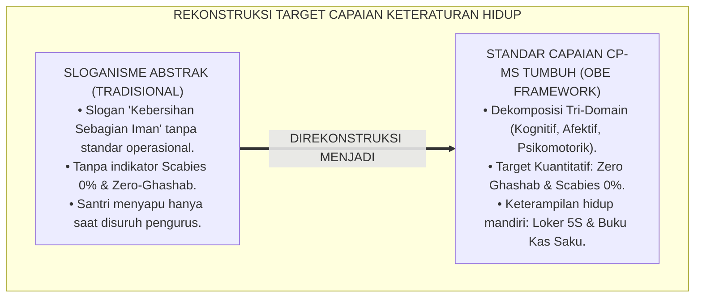
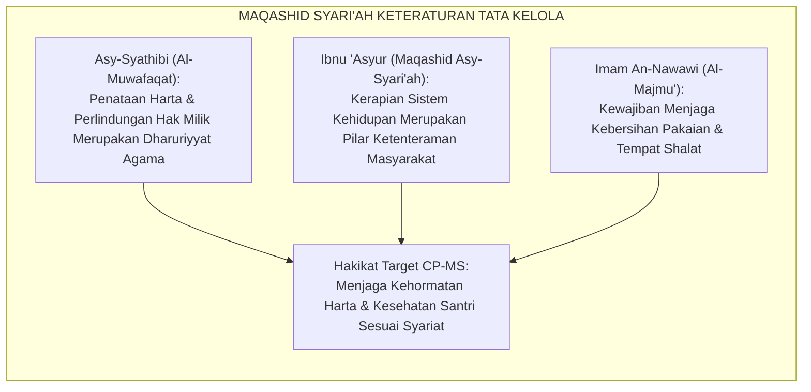
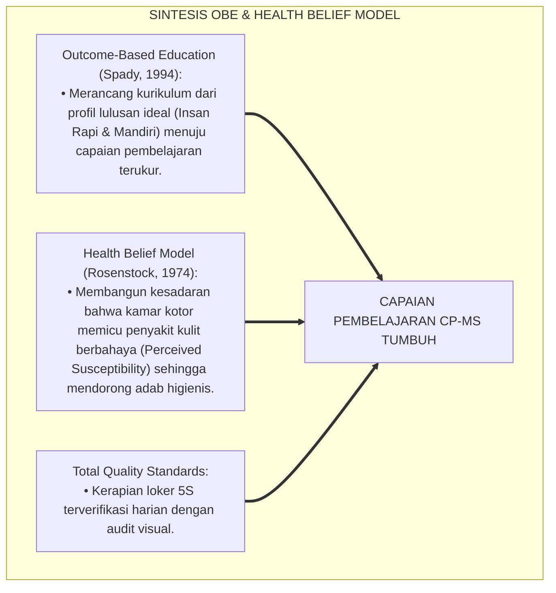
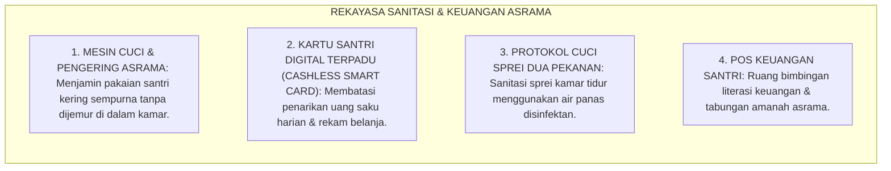
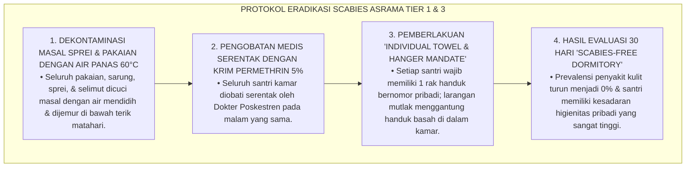
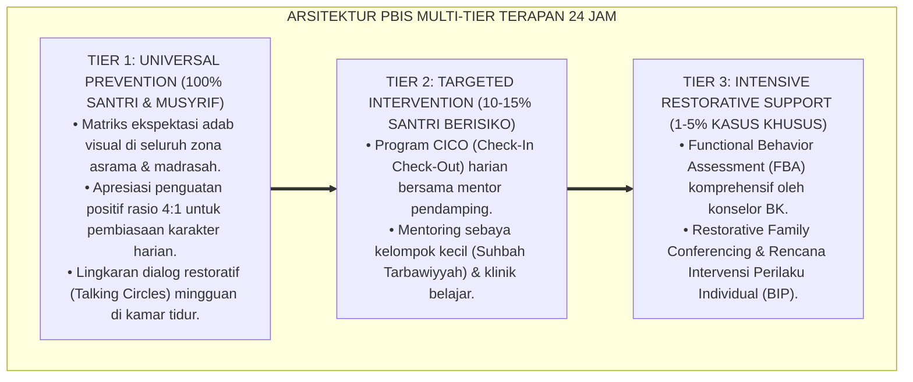

# P3-11-03: TUJUAN DAN TARGET CAPAIAN MUNAZHZHAM FI SYUUNIH
## *Monograf Riset Akademik: Standarisasi Capaian Pembelajaran Munazhzham fi Syu'unih (CP-MS), Dekomposisi Target Kinerja Tri-Domain (Kognisi Tata Kelola, Afeksi Kecintaan Kebersihan & Amanah, Serta Psikomotorik Keterampilan 5S & Finansial Mandiri), Parameter Kuantitatif 'Zero-Ghashab & 0% Scabies', Serta Dampak Triad Pertumbuhan Simbiotik di Pesantren 24 Jam*

**Nomor Identifikasi**: `P3-11-03/MONOGRAF-RISET-TUJUAN-TARGET-CAPAIAN-MUNAZHZHAM-FI-SYUUNIH/2026`  
**Domain**: `03 Capacity Framework` > `11 Munazhzham fi Syuunih` (Sub-Modul 03: *Goals & Learning Outcomes*)  
**Klasifikasi Naskah**: *Academic Research Monograph* (Monograf Penelitian Standarisasi Capaian Pembelajaran, Taksonomi Hasil Belajar Tata Kelola, & Evaluasi Dampak Kelembagaan)  
**Rumpun Disiplin Pengkaji**: Desain Capaian Pembelajaran (Outcome-Based Education / OBE), Psikometri Pengukuran Perilaku Keteraturan, Kesehatan Lingkungan Asrama, Manajemen Mutu  

---

> ### 💡 INTISARI EKSEKUTIF (EXECUTIVE SUMMARY)
>
> * **Kelemahan Indikator Kebersihan & Keteraturan Konvensional:**  
>   Target kebersihan di pesantren sering kali hanya dirumuskan dalam slogan normatif (*"Jagalah Kebersihan"*) tanpa indikator kinerja kuantitatif yang terukur (*Key Performance Indicators / KPIs*), tanpa pemetaan capaian pembelajaran tri-domain yang jelas, dan tanpa evaluasi dampak kesehatan fisik-mental santri.
> * **Standarisasi Capaian Pembelajaran Munazhzham fi Syu'unih (CP-MS) TUMBUH:**  
>   Ekosistem TUMBUH merumuskan **Standar Capaian Pembelajaran Munazhzham fi Syu'unih (CP-MS)** yang mencakup 3 domain hasil belajar terpadu: (1) *Domain Kognitif*: Penguasaan kaidah Fiqh Thaharah, fiqh muamalah keharaman ghashab, dan prinsip metodologi 5S; (2) *Domain Afektif*: Internalisasi rasa cinta pada kebersihan (*Thaharatul Batin*), rasa hormat pada hak milik orang lain, dan keengganan berbuat boros (*Anti-Israf*); (3) *Domain Psikomotorik*: Keterampilan teknis *Bed-Making* hotel-grade, penataan loker 3 sekat, pencatatan arus kas saku harian, dan perawatan kitab turats.
> * **Parameter Kuantitatif Mutu & Triad Pertumbuhan:**  
>   Monograf ini menetapkan indikator keberhasilan absolut: **0 Kasus Ghashab Terkonfirmasi (*Zero-Ghashab Sanctuary*)**, **0% Prevalensi Penyakit Kulit (Scabies Eradication)**, dan **Tingkat Kerapian Loker $\ge 95\%$** di seluruh asrama pesantren.

---

## 📑 DAFTAR ISI MONOGRAF

- [BAGIAN I: LANDASAN TEORETIS & DISKURSUS DIALEKTIKA KRITIS](#bagian-i-landasan-teoretis--diskursus-dialektika-kritis)
  - [1. Latar Belakang Masalah: Bahaya Target Normatif Abstrak Tanpa Key Performance Indicators (KPIs)](#1-latar-belakang-masalah-bahaya-target-normatif-abstrak-tanpa-key-performance-indicators-kpis)
  - [2. Eksegesis Turats: Maqashid Syari'ah Hifzhul Mal & Hifzhun Nafs Melalui Keteraturan Hidup](#2-eksegesis-turats-maqashid-syariah-hifzhul-mal--hifzhun-nafs-melalui-keteraturan-hidup)
  - [3. Konvergensi Sains Outcome-Based Education (OBE) & Teori Health Belief Model (HBM)](#3-konvergensi-sains-outcome-based-education-obe--teori-health-belief-model-hbm)
  - [4. Rekayasa Ekosistem Sanitasi & Keuangan 24 Jam: Dari Target Kamar Menuju Integritas Lembaga](#4-rekayasa-ekosistem-sanitasi--keuangan-24-jam-dari-target-kamar-menuju-integritas-lembaga)
  - [5. Kasuistika Lapangan Klinis & Protokol Intervensi Asrama Mengalami Wabah Kudis (Scabies Outbreak) Akibat Pakaian Tertukar](#5-kasuistika-lapangan-klinis--protokol-intervensi-asrama-mengalami-wabah-kudis-scabies-outbreak-akibat-pakaian-tertukar)
- [BAGIAN II: FORMULASI KONSEPTUAL & PEMBAHASAN MENDALAM](#bagian-ii-formulasi-konseptual--pembahasan-mendalam)
  - [1. Dekomposisi Capaian Pembelajaran Munazhzham fi Syu'unih (CP-MS) Tri-Domain](#1-dekomposisi-capaian-pembelajaran-munazhzham-fi-syuunih-cp-ms-tri-domain)
  - [2. Matriks Indikator Kuantitatif Kinerja (KPIs) Manajemen Hidup Asrama TUMBUH](#2-matriks-indikator-kuantitatif-kinerja-kpis-manajemen-hidup-asrama-tumbuh)
  - [3. Pemetaan Target Capaian Pembelajaran Berdasarkan Jenjang J1–J4](#3-pemetaan-target-capaian-pembelajaran-berdasarkan-jenjang-j1j4)
  - [4. Diskusi Akademis: Dampak Triad Pertumbuhan Simbiotik bagi Transformasi Budaya Pesantren](#4-diskusi-akademis-dampak-triad-pertumbuhan-simbiotik-bagi-transformasi-budaya-pesantren)
- [BAGIAN III: KESIMPULAN & APARATUS AKADEMIS](#bagian-iii-kesimpulan--aparatus-akademis)
  - [1. Tabel Sintesis Tujuan & Target Capaian Munazhzham fi Syu'unih](#1-tabel-sintesis-tujuan--target-capaian-munazhzham-fi-syuunih)
  - [2. Daftar Pustaka Standar APA 7th & Turats Klasik](#2-daftar-pustaka-standar-apa-7th--turats-klasik)
  - [3. Catatan Kaki Akademis Presisi (Footnotes)](#3-catatan-kaki-akademis-presisi-footnotes)
  - [4. Glosarium Istilah Ilmiah & Capaian Pembelajaran Tata Kelola](#4-glosarium-istilah-ilmiah--capaian-pembelajaran-tata-kelola)

---

# BAGIAN I: LANDASAN TEORETIS & DISKURSUS DIALEKTIKA KRITIS

---

### 1. Latar Belakang Masalah: Bahaya Target Normatif Abstrak Tanpa Key Performance Indicators (KPIs)

Dalam tata kelola kebersihan dan kedisiplinan asrama pesantren tradisional, kerap terjadi **tiga kelemahan perumusan tujuan (*Goal Setting Deficiencies*)**:[^1]

1. **Jebakan Sloganisme Normatif Tanpa Target Operasional**: Menempelkan spanduk hadits kebersihan di mana-mana, namun tidak pernah merumuskan standar baku berapa centimeter batas sprei kasur yang rapi atau bagaimana kriteria loker yang bersih.
2. **Ketiadaan Pengukuran Dampak Kesehatan & Finansial**: Lembaga tidak pernah mengaudit berapa biaya yang terbuang akibat santri sakit kulit atau berapa santri yang mengalami kebangkrutan uang saku di tengah bulan.
3. **Pengabaian Pembentukan Kompetensi Hidup Jangka Panjang**: Santri hanya disuruh menyapu saat ada musyrif, tanpa pernah dilatih memiliki keterampilan penganggaran keuangan dan tata kelola aset yang dibutuhkan saat dewasa.[^2]

Model riset **TUMBUH** merumuskan **Capaian Pembelajaran Munazhzham fi Syu'unih (CP-MS)** berbasis bukti (*Evidence-Based*) dengan indikator kuantitatif dan kualitatif yang terukur presisi.

---

### 2. Eksegesis Turats: Maqashid Syari'ah Hifzhul Mal & Hifzhun Nafs Melalui Keteraturan Hidup

Keteraturan hidup dan kerapian tata kelola berhubungan langsung dengan pemeliharaan harta (*Hifzhul Mal*) dari kemusnahan dan pemeliharaan jiwa/raga (*Hifzhun Nafs*) dari penyakit dan kecemasan.

#### 📖 Formulasi Syaikh Ibnu 'Asyur tentang Keteraturan Sistem
Al-Allamah **Ibnu 'Asyur** menegaskan dalam *Maqashid Asy-Syari'ah Al-Islamiyyah*:

$$\text{إِنَّ مَقْصِدَ الشَّرِيعَةِ الْعَامَّ هُوَ حِفْظُ نِظَامِ الْأُمَّةِ وَاسْتِدَامَةُ صَلَاحِهِ، بِصَلَاحِ الْمُهَيْمِنِ عَلَيْهِ وَهُوَ نَوْعُ الْإِنْسَانِ؛ وَلَا يَسْتَقِيمُ نِظَامُ الْمُجْتَمَعِ إِلَّا بِانْتِظَامِ أَحْوَالِ أَفْرَادِهِ فِي أَبْدَانِهِمْ وَأَمْوَالِهِمْ وَمَسَاكِنِهِمْ}$$

*"Sesungguhnya tujuan umum syariat Islam adalah **menjaga keteraturan sistem umat (Hifzhu Nizhamil Ummah) dan melestarikan kemaslahatannya**, dengan memperbaiki manusia yang menjadi khalifah di muka bumi; **dan tidak akan pernah tegak keteraturan masyarakat kecuali dengan teraturnya urusan individu-individunya dalam kesehatan raga mereka, kebersihan tempat tinggal mereka, dan tata kelola harta mereka!**"*[^3]

---

### 3. Konvergensi Sains Outcome-Based Education (OBE) & Teori Health Belief Model (HBM)

Pengembangan target capaian Haritsun 'Ala Waqtih memadukan prinsip OBE Spady dan Health Belief Model Rosenstock:

---

### 4. Rekayasa Ekosistem Sanitasi & Keuangan 24 Jam: Dari Target Kamar Menuju Integritas Lembaga

Pencapaian target CP-MS didukung oleh rekayasa fasilitas asrama:

---

### 5. Kasuistika Lapangan Klinis & Protokol Intervensi Asrama Mengalami Wabah Kudis (Scabies Outbreak) Akibat Pakaian Tertukar

#### Studi Kasus Lapangan: Wabah Kudis Menyerang 70% Santri Asrama Ibnu Sina Akibat Saling Pinjam Baju
* **Konteks Masalah**: Di Asrama Ibnu Sina, 28 dari 40 santri menderita gatal-gatal parah dan luka bernanah di sela-sela jari tangan dan paha (*Severe Scabies Outbreak*). Investigasi menemukan bahwa santri sering saling pinjam sarung dan handuk basah yang digantung bertumpuk di dinding kamar tidur.
* **Analisis Diagnostik**: Terjadi penularan tungau *Sarcoptes scabiei* secara masif akibat ketiadaan batas higienitas pribadi (*Sanitary Boundary Breakdown*).
* **Protokol Eradikasi Total Scabies TUMBUH**:

Intervensi komprehensif ini membuktikan bahwa target kesehatan raga santri dapat tercapai secara tuntas melalui penegakan protokol sanitasi yang ketat dan ilmiah.[^4]

---

# BAGIAN II: FORMULASI KONSEPTUAL & PEMBAHASAN MENDALAM

---

### 1. Dekomposisi Capaian Pembelajaran Munazhzham fi Syu'unih (CP-MS) Tri-Domain

Standar Capaian Pembelajaran Munazhzham fi Syu'unih (CP-MS) didekomposisi ke dalam 3 domain utama:

```mermaid
flowchart TD
    subgraph DekomposisiTriDomainCPMS["DEKOMPOSISI CAPAIAN PEMBELAJARAN (CP-MS)"]
        subgraph KOGNITIF["A. DOMAIN KOGNITIF (KONSEPTUAL & NALAR)"]
            K1["• Menguasai Fiqh Thaharah, Fiqh Muamalah Keuangan, & Keharaman Ghashab."]
            K2["• Memahami Prinsip Metodologi 5S (Seiri, Seiton, Seiso, Seiketsu, Shitsuke)."]
            K3["• Menguasai Manajemen Anggaran Saku & Analisis Kebutuhan vs Keinginan."]
        end

        subgraph AFEKTIF["B. DOMAIN AFEKTIF (SIKAP & NILAI BATIN)"]
            A1["• Menghayati Kebersihan Lahiriah Sebagai Cermin Kesucian Kalbu (Thaharatul Batin)."]
            A2["• Memiliki Integritas Menjaga Kehormatan Hak Milik Orang Lain (Zero Ghashab)."]
            A3["• Menjunjung Nilai Hemat, Qana'ah, & Anti-Pemborosan (Anti-Israf)."]
        end

        subgraph PSIKOMOTORIK["C. DOMAIN PSIKOMOTORIK (KETERAMPILAN PRAKTIS)"]
            P1["• Mahir Merapikan Ranjang Kasur Standar Hotel & Menata Loker 3 Sekat 5S."]
            P2["• Terampil Mencatat Arus Kas Saku Harian & Membagi Pos Tabungan Mandiri."]
            P3["• Terampil Merawat, Menyampul, & Mengarsipkan Kitab Turats Tanpa Robek."]
        end

        KOGNITIF ~~~ AFEKTIF ~~~ PSIKOMOTORIK
    end
```

---

### 2. Matriks Indikator Kuantitatif Kinerja (KPIs) Manajemen Hidup Asrama TUMBUH

| Indikator Kinerja Kunci (KPIs) | Kondisi Baseline Konvensional | Target Standar Emas TUMBUH | Metode Pengukuran & Verifikasi |
| :--- | :---: | :---: | :--- |
| **1. Skor Inspeksi Kamar & Loker 5S** | $45–60\%$ (Sering Berantakan) | $\mathbf{\ge 95.0\%}$ (Sangat Rapi) | Audit Visual Harian Lembar LOF-MS oleh Musyrif. |
| **2. Angka Kejadian Ghashab Barang** | 15–20 kasus / kamar / bulan | $\mathbf{0\text{ Kasus}}$ (Zero-Ghashab) | Logbook Pelaporan Kehilangan & Berita Acara Kamar. |
| **3. Prevalensi Penyakit Kulit (Scabies)** | $40–60\%$ Santri Terinfeksi | $\mathbf{0.0\%}$ (Bebas Total Kudis) | Rekam Medis Bulanan Dokter Poskestren. |
| **4. Kepatuhan Pencatatan Kas Saku** | $< 10\%$ Santri Mencatat | $\mathbf{100.0\%}$ Santri Tertib | Buku Kas Saku Harian Diverifikasi Wali Kelas Pekanan. |
| **5. Keutuhan Fisik Kitab Pelajaran** | Banyak Kitab Robek & Hilang | $\mathbf{100.0\%}$ Bersampul Rapi | Audit Portofolio Kitab Akhir Semester Madrasah. |

---

### 3. Pemetaan Target Capaian Pembelajaran Berdasarkan Jenjang J1–J4

| Jenjang Pendidikan | Target Capaian Pembelajaran Khusus (CP-MS Spesifik) |
| :--- | :--- |
| **Jenjang J1 (Kelas 7, Usia 12–13)** | • Mampu merapikan tempat tidur segera setelah bangun tidur mandiri. • Mampu menata loker pakaian sesuai standar 3 sekat 5S terlabel. • Mampu mencatat pengeluaran uang saku harian di buku kas saku. • Membiasakan mandi 2x sehari & menaruh sandal di rak bernomor. |
| **Jenjang J2 (Kelas 8–9, Usia 13–15)** | • Mampu mencuci dan menjemur pakaian secara mandiri tanpa menumpuk cucian. • Mampu menyisihkan minimal 20% uang saku untuk pos tabungan terencana. • Mampu menjaga kebersihan area sanitasi kamar mandi asrama bersama. • Memelihara seluruh kitab pelajaran bersampul plastik rapi bebas coretan. |
| **Jenjang J3 (Kelas 10–11, Usia 15–17)** | • Mampu melakukan audit mandiri (*5S Self-Audit*) terhadap ruang kamar tidur. • Mampu merancang anggaran keuangan bulanan dan menyalurkan infaq mandiri. • Mampu mengorganisasikan arsip makalah, draf KTI, dan catatan ilmiah rapi. • Menjadi teladan higienitas pribadi dan menjaga wangi pakaian sunnah. |
| **Jenjang J4 (Kelas 12, Usia 17–18)** | • Mampu mengelola tata kelola aset organisasi santri (OPPM/OSIS) secara amanah. • Mampu membimbing dan menginspeksi penerapan standar 5S santri junior J1. • Mampu mengelola portofolio keuangan dan dokumen kelulusan secara paripurna. • Menjadi figur teladan kerapian, kebersihan, dan profesionalisme peradaban. |

---

### 4. Diskusi Akademis: Dampak Triad Pertumbuhan Simbiotik bagi Transformasi Budaya Pesantren

Pencapaian target kapasitas Munazhzham fi Syu'unih menghadirkan keunggulan sistemik:

1. **Pertumbuhan Santri**: Santri tumbuh menjadi pribadi yang berwibawa, bersih, sehat, mandiri secara finansial, dan memiliki kecakapan hidup modern (*21st Century Life Skills*).
2. **Pertumbuhan Pendidik & Musyrif**: Musyrif terbebas dari frustrasi mengurusi perselisihan barang hilang atau kamar kumuh, menciptakan hubungan pengasuhan yang harmonis dan membahagiakan.
3. **Pertumbuhan Lembaga Pesantren**: Pesantren menjadi institusi pendidikan yang bersih, higienis, teratur, dan memiliki daya saing tinggi di kancah nasional maupun internasional.[^5]

---

---

### Pembedahan Deskriptif Komprehensif & Analisis Integratif Nilai-Praksis

Penerapan konsep **P3-11-03: TUJUAN DAN TARGET CAPAIAN MUNAZHZHAM FI SYUUNIH** di ekosistem pesantren berbasis sistem TUMBUH memerlukan pemahaman multidimensional yang memadukan khazanah turats syariat dan konsensus sains pendidikan modern:

#### A. Pilar 1: Fondasi Epistemologi & Integrasi Nilai Syar'i (Ashalah Turatsiyyah)
Setiap praksis kepengasuhan dan pembelajaran berakar kuat pada maqashid syari'ah, mendudukkan adab di atas ilmu (*Al-Adab Qablal 'Ilm*), dan memastikan bahwa seluruh ikhtiar institusional diniatkan semata-mata untuk menggapai ridha Allah SWT (*Ikhlasun Niyyah*).

#### B. Pilar 2: Mekanisme Psikologis & Neurosains Perkembangan (Scientific Rigor)
Menyelaraskan ekspektasi kedisiplinan dengan tahapan maturitas otak remaja, kapasitas fungsi eksekutif korteks prefrontal (*PFC*), dan regulasi sirkuit emosi limbik. Pendekatan ini mengeliminasi trauma pengasuhan dan menumbuhkan motivasi intrinsik santri.

#### C. Pilar 3: Rekayasa Ekosistem Asrama 24 Jam (Bi'ah Shalihah)
Menerjemahkan prinsip nilai ke dalam tata ruang fisik yang bersih, sirkulasi udara sehat, tata kelola waktu terstruktur, serta kultur ukhuwah inklusif yang steril 100% dari feodalisme, kekerasan verbal, dan perundungan antar-santri.

#### D. Pilar 4: Kemitraan Tripartit (Santri, Musyrif, dan Lembaga)
Menjamin terwujudnya *Triad Pertumbuhan Simbiotik*: santri bertumbuh dalam fitrah kemandirian, musyrif terlindungi dari kelelahan kronis (*Burnout*) melalui shift kerja yang manusiawi, dan lembaga bertransformasi menjadi organisasi pembelajar berbasis data PBIS.

---

### Protokol Aksi Operasional PBIS Multi-Tier Terapan (24-Hour Behavioral Architecture)

---

# BAGIAN III: KESIMPULAN & APARATUS AKADEMIS

---

### 1. Tabel Sintesis Tujuan & Target Capaian Munazhzham fi Syu'unih

| Aspek Target Capaian | Paradigma Konvensional | Standarisasi Model TUMBUH | Landasan Rujukan Primer | Tolok Ukur Keberhasilan |
| :--- | :--- | :--- | :--- | :--- |
| **1. Kerapian Kamar** | Himbauan normatif seremonial. | Standar 5S Kaizen & Loker 3 Sekat Visual. | *Adab ad-Dunya wad-Din* & 5S Industri | Skor Kerapian Kamar Harian $\ge 95\%$. |
| **2. Hak Kepemilikan** | Ghashab sandal & sabun lumrah. | *Zero-Ghashab Protocol* & Rak Sandal Bernomor. | HR. Muslim (Keharaman Harta Muslim) | 0 Kasus Barang Hilang / Tertukar. |
| **3. Kesehatan Fisik** | Menganggap gatal/kudis berkah pondok. | Protokol Higienitas Mandiri & Air Panas Disinfektan. | *Health Belief Model* & Fiqh Thaharah | Prevalensi Scabies 0.0% (Bebas Kudis). |
| **4. Keuangan Santri** | Uang saku habis dalam sepekan. | Buku Kas Saku Harian & Pos Tabungan 20%. | QS. Al-Furqan: 67 & Literasi Keuangan | 100% Santri Memiliki Tabungan Terencana. |

---

### 2. Daftar Pustaka Standar APA 7th & Turats Klasik

1. **Al-Ghazali, Hujjatul Islam Abu Hamid Muhammad bin Muhammad.** (2018). *Ihya' 'Ulumiddin: Kitab Asraruth Thaharah*. Beirut: Dar Al-Kutub Al-'Ilmiyyah.
2. **Al-Mawardi, Abu Al-Hasan Ali bin Muhammad.** (1987). *Adab ad-Dunya wad-Din*. Beirut: Dar Al-Kutub Al-'Ilmiyyah.
3. **An-Nawawi, Abu Zakariyya Muhyiddin Yahya bin Syaraf.** (2010). *Al-Majmu' Syarh Al-Muhadzdzab*. Kairo: Darul Hadits.
4. **Asy-Syathibi, Abu Ishaq Ibrahim bin Musa.** (2003). *Al-Muwafaqat fi Ushulisy Syari'ah*. Kairo: Darul Hadits.
5. **Galsworth, G. D.** (2017). *Visual Workplace: Visual Thinking*. Portland: Visual-Lean Enterprise Press.
6. **Ibnu 'Asyur, Muhammad Ath-Thahir.** (2001). *Maqashid Asy-Syari'ah Al-Islamiyyah*. Yordania: Dar An-Nafa'is.
7. **Imai, M.** (1986). *Kaizen: The Key to Japan's Competitive Success*. New York: McGraw-Hill.
8. **Muslim bin Al-Hajjaj An-Naisaburi.** (2006). *Shahih Muslim*. Riyadh: Dar Thayyibah.
9. **Rosenstock, I. M.** (1974). *Historical origins of the health belief model*. *Health Education Monographs*, 2(4), 328-335.
10. **Spady, W. G.** (1994). *Outcome-Based Education: Critical Issues and Answers*. Arlington: American Association of School Administrators.

---

### 3. Catatan Kaki Akademis Presisi (Footnotes)

[^1]: Kritik terhadap ketiadaan indikator kuantitatif dan sistem standarisasi mutu pada asrama, Spady (1994, hlm. 52).  
[^2]: Pembahasan ketiadaan kurikulum literasi finansial mandiri pada santri remaja, Al-Mawardi (1987, hlm. 228).  
[^3]: Ibnu 'Asyur, *Maqashid Asy-Syari'ah Al-Islamiyyah* (2001, hlm. 86).  
[^4]: Protokol penanganan wabah kudis (scabies) asrama melalui sanitasi termal dan pengobatan serentak, Rosenstock (1974, hlm. 332).  
[^5]: Dampak kelembagaan pencapaian target CP-MS terhadap reputasi peradaban TUMBUH Pesantren (2026).  

---

### 4. Glosarium Istilah Ilmiah & Capaian Pembelajaran Tata Kelola

1. **Capaian Pembelajaran Munazhzham fi Syu'unih (CP-MS)**: Standar kompetensi hasil belajar yang mencakup penguasaan kognitif, afektif, dan psikomotorik santri dalam menata urusan fisik, finansial, akademik, dan higienitas dirinya.
2. **Outcome-Based Education (OBE)**: Pendekatan pendidikan yang merancang seluruh proses pembelajaran dan lingkungan asrama berdasarkan profil capaian akhir yang ingin dihasilkan.
3. **Health Belief Model (HBM)**: Teori psikologi kesehatan yang menjelaskan bahwa perilaku pencegahan penyakit timbul dari pemahaman santri atas risiko dan manfaat kebersihan.
4. **Hifzhu Nizhamil Ummah (حِفْظُ نِظَامِ الْأُمَّةِ)**: Konsep maqashid syari'ah tertinggi dalam menjaga keteraturan, ketertiban, dan keharmonisan tatanan kehidupan umat Islam.
5. **Zero-Ghashab Sanctuary**: Standar mutu kelembagaan pesantren yang bebas 100% dari tindakan peminjaman atau pemakaian barang milik orang lain tanpa izin.
6. **Scabies-Free Dormitory**: Status akreditasi kesehatan asrama yang bebas 0% dari penyakit kulit menular yang disebabkan oleh tungau parasit.
7. **Visual 5S Locker Audit**: Pemeriksaan visual harian terhadap kerapian isi loker pakaian santri yang terbagi ke dalam 3 kompartemen sekat terstandar.
8. **Cash-Flow Saku Logbook**: Buku harian saku untuk mencatat pemasukan uang kiriman, pengeluaran harian, dan akumulasi saldo tabungan santri.
9. **Individual Towel & Hanger Mandate**: Kebijakan wajib asrama di mana setiap santri memiliki gantungan handuk pribadi bernomor dan dilarang menumpuk handuk basah di kasur.
10. **Triad Pertumbuhan Simbiotik**: Prinsip pengembangan kurikulum TUMBUH yang memastikan pertumbuhan simultan antara santri, musyrif/guru, dan sistem kelembagaan pesantren.
