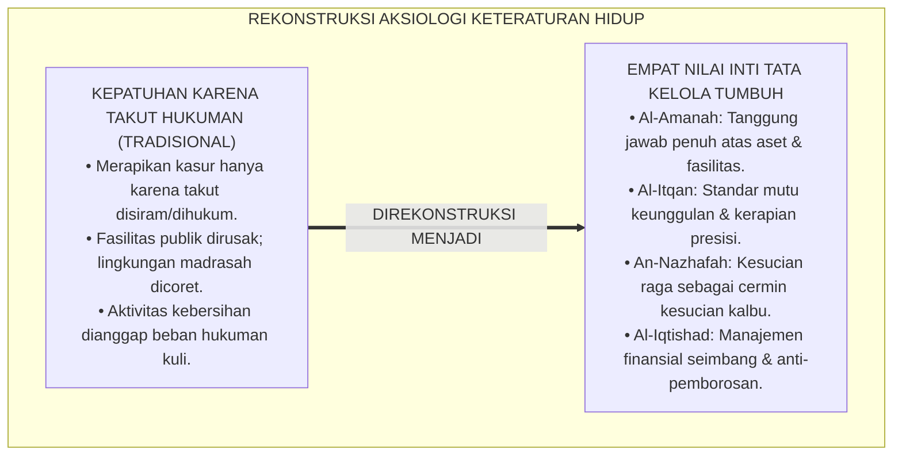
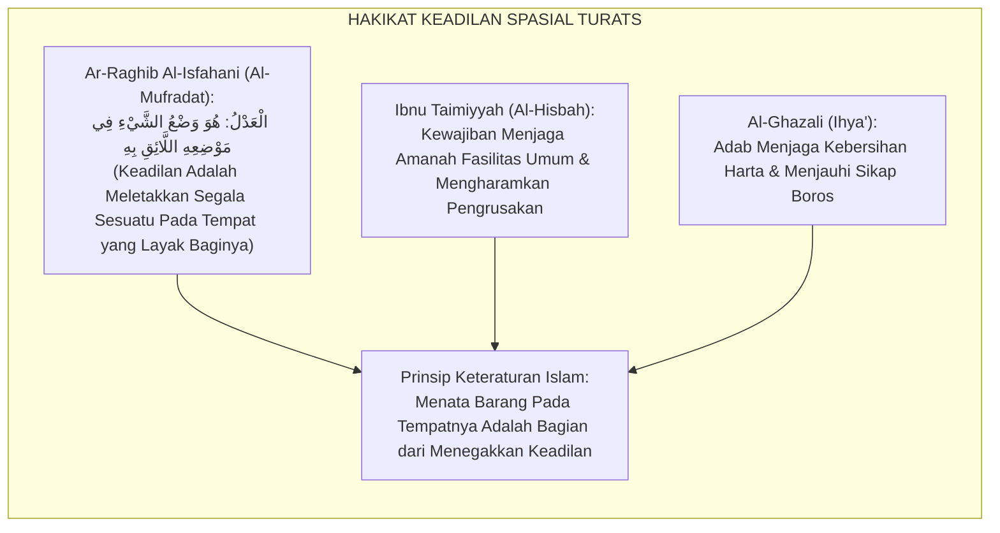
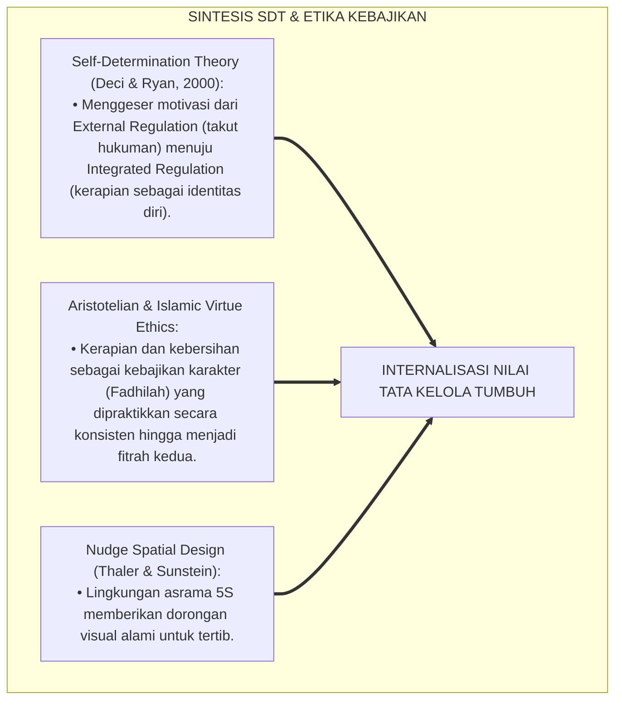
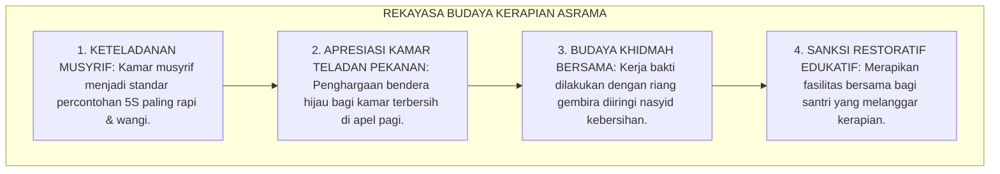
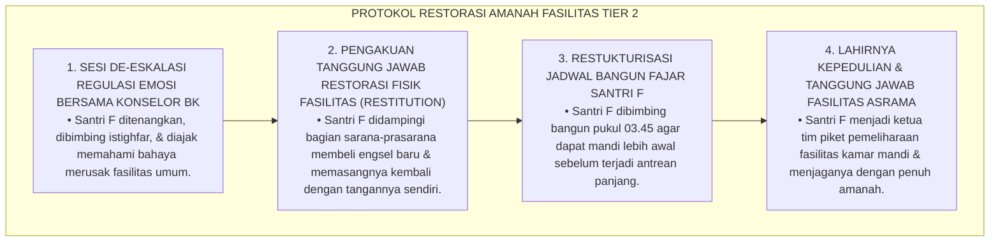
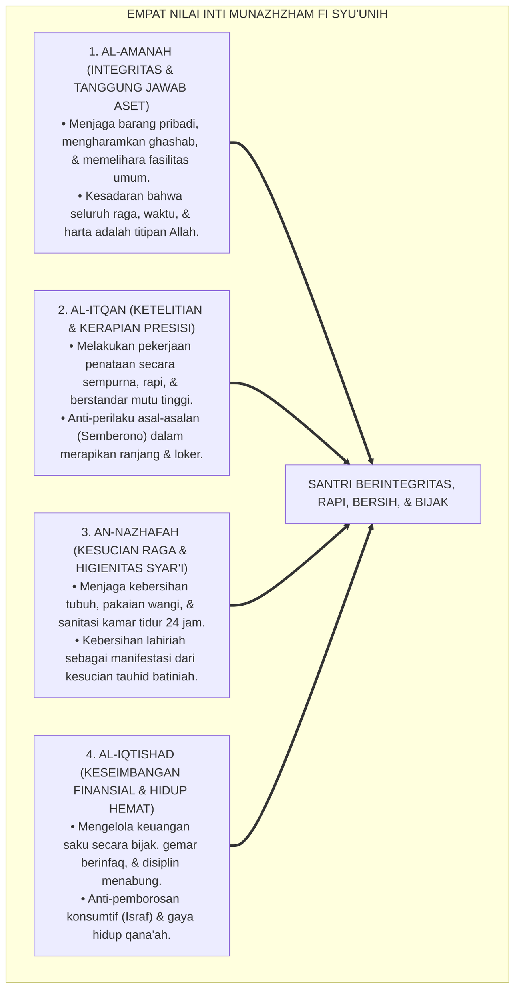
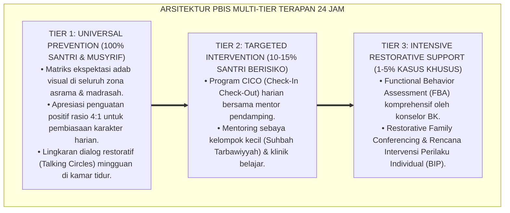

# P3-11-04: NILAI INTI DAN PRINSIP KETERATURAN MUNAZHZHAM FI SYUUNIH
## *Monograf Riset Akademik: Aksiologi Empat Nilai Inti Tata Kelola Hidup Islami (Al-Amanah, Al-Itqan, An-Nazhafah, & Al-Iqtishad), Prinsip Al-Adl fil Asyya' (Meletakkan Sesuatu Pada Tempatnya), Dialektika Nilai Keteraturan Berkah vs Materialisme Konsumtif Sekuler / Kekumuhan Feodal, Serta Internalisasi Karakter 24 Jam di Pesantren TUMBUH*

**Nomor Identifikasi**: `P3-11-04/MONOGRAF-RISET-NILAI-INTI-PRINSIP-MUNAZHZHAM-FI-SYUUNIH/2026`  
**Domain**: `03 Capacity Framework` > `11 Munazhzham fi Syuunih` (Sub-Modul 04: *Core Values & Organizing Principles*)  
**Klasifikasi Naskah**: *Academic Research Monograph* (Monograf Penelitian Aksiologi Nilai Islam, Etika Terapan Tata Kelola Hidup, & Filosofi Keadilan Spasial)  
**Rumpun Disiplin Pengkaji**: Filsafat Nilai Islam (Aksiologi Islam), Etika Terapan Penataan Ruang, Sosiologi Kebiasaan Hidup Remaja, Fiqh Muamalah Finansial  

---

> ### 💡 INTISARI EKSEKUTIF (EXECUTIVE SUMMARY)
>
> * **Krisis Aksiologis Tata Kelola Hidup Remaja Pesantren:**  
>   Banyak santri tidak memahami keterkaitan spiritual antara menata tempat tidur, merawat buku pelajaran, atau mencatat pengeluaran uang saku dengan keimanan kepada Allah SWT. Kerapian sering dipandang sebagai beban paksaan eksternal (*Burdensome Chore*) yang membosankan, bukan sebagai cerminan ibadah tauhid dan amanah pemeliharaan nikmat Allah.
> * **Empat Nilai Inti (*Core Values*) Munazhzham fi Syu'unih TUMBUH:**  
>   Ekosistem TUMBUH merumuskan **Empat Nilai Inti Tata Kelola Hidup Islami**: (1) *Al-Amanah (Integritas Hak Milik & Tanggung Jawab Aset)*: Menjaga barang pribadi, mengharamkan mutlak perbuatan ghashab, dan merawat fasilitas bersama; (2) *Al-Itqan (Ketelitian, Kesempurnaan, & Kerapian Presisi)*: Melakukan segala tugas penataan secara tuntas dan berstandar mutu tinggi; (3) *An-Nazhafah (Kesucian Diri, Kebersihan Raga, & Keindahan Lingkungan)*: Menjaga kesucian fisik sebagai cermin kesucian kalbu; dan (4) *Al-Iqtishad (Keseimbangan Finansial, Hidup Hemat, & Anti-Israf)*: Mengelola harta secara bijak antara hak infaq, tabungan, dan kebutuhan primer.
> * **Prinsip Al-'Adl fil Asyya' (Keadilan Spasial):**  
>   Monograf ini meletakkan prinsip filosofis *Wadh'us Syai' fi Mahallihi* (meletakkan segala sesuatu pada tempatnya yang tepat), mengubah kamar asrama dari ruang kesemrawutan menjadi suaka ketenangan dan konsentrasi intelektual.

---

## 📑 DAFTAR ISI MONOGRAF

- [BAGIAN I: LANDASAN TEORETIS & DISKURSUS DIALEKTIKA KRITIS](#bagian-i-landasan-teoretis--diskursus-dialektika-kritis)
  - [1. Latar Belakang Masalah: Bahaya Pendangkalan Makna Kerapian Menjadi Beban Paksaan Eksternal](#1-latar-belakang-masalah-bahaya-pendangkalan-makna-kerapian-menjadi-beban-paksaan-eksternal)
  - [2. Eksegesis Turats: Konsep Wadh'us Syai' fi Mahallihi Sebagai Hakikat Keadilan dalam Islam](#2-eksegesis-turats-konsep-wadhus-syai-fi-mahallihi-sebagai-hakikat-keadilan-dalam-islam)
  - [3. Konvergensi Teori Internalisasi Nilai (Self-Determination Theory) & Etika Kebajikan (Virtue Ethics)](#3-konvergensi-teori-internalisasi-nilai-self-determination-theory--etika-kebajikan-virtue-ethics)
  - [4. Rekayasa Budaya Asrama 24 Jam: Dari Paksaan Menuju Kecintaan Spontan pada Kerapian](#4-rekayasa-budaya-asrama-24-jam-dari-paksaan-menuju-kecintaan-spontan-pada-kerapian)
  - [5. Kasuistika Lapangan Klinis & Protokol De-eskalasi Santri yang Merusak Fasilitas Kamar Mandi Akibat Frustrasi Emosional](#5-kasuistika-lapangan-klinis--protokol-de-eskalasi-santri-yang-merusak-fasilitas-kamar-mandi-akibat-frustrasi-emosional)
- [BAGIAN II: FORMULASI KONSEPTUAL & PEMBAHASAN MENDALAM](#bagian-ii-formulasi-konseptual--pembahasan-mendalam)
  - [1. Arsitektur Empat Nilai Inti Munazhzham fi Syu'unih](#1-arsitektur-empat-nilai-inti-munazhzham-fi-syuunih)
  - [2. Matriks Komparasi: Nilai Tata Kelola Islami vs Materialisme Sekuler vs Budaya Kumuh Fatalistik](#2-matriks-komparasi-nilai-tata-kelola-islami-vs-materialisme-sekuler-vs-budaya-kumuh-fatalistik)
  - [3. Prinsip Operasional Tata Kelola Hidup 24 Jam di Pesantren](#3-prinsip-operasional-tata-kelola-hidup-24-jam-di-pesantren)
  - [4. Diskusi Akademis & Implikasi bagi Pembentukan Karakter Kepemimpinan Santri Masa Depan](#4-diskusi-akademis--implikasi-bagi-pembentukan-karakter-kepemimpinan-santri-masa-depan)
- [BAGIAN III: KESIMPULAN & APARATUS AKADEMIS](#bagian-iii-kesimpulan--aparatus-akademis)
  - [1. Tabel Sintesis Nilai Inti & Prinsip Keteraturan Munazhzham fi Syu'unih](#1-tabel-sintesis-nilai-inti--prinsip-keteraturan-munazhzham-fi-syuunih)
  - [2. Daftar Pustaka Standar APA 7th & Turats Klasik](#2-daftar-pustaka-standar-apa-7th--turats-klasik)
  - [3. Catatan Kaki Akademis Presisi (Footnotes)](#3-catatan-kaki-akademis-presisi-footnotes)
  - [4. Glosarium Istilah Ilmiah & Aksiologi Keteraturan](#4-glosarium-istilah-ilmiah--aksiologi-keteraturan)

---

# BAGIAN I: LANDASAN TEORETIS & DISKURSUS DIALEKTIKA KRITIS

---

### 1. Latar Belakang Masalah: Bahaya Pendangkalan Makna Kerapian Menjadi Beban Paksaan Eksternal

Dalam psikologi pengasuhan asrama tradisional, kerap terjadi **tiga distorsi aksiologis nilai kerapian (*Axiological Distortions*)**:[^1]

1. **Jebakan Kepatuhan Karena Takut Dihukum (*Extrinsic Fear-Driven Compliance*)**: Santri merapikan kasur dan lokernya semata-mata karena takut dihukum push-up oleh musyrif, bukan karena memahami nilai kebersihan dan penghormatan atas amanah hidup.
2. **Ketiadaan Pemaknaan Teologis dalam Aktivitas Harian**: Menyapu lantai atau melipat pakaian dianggap pekerjaan remeh kelas bawah (*Menial Labor*), mengabaikan teladan Rasulullah SAW yang senantiasa melayani dan membersihkan rumahnya sendiri.
3. **Kekacauan Sikap Terhadap Fasilitas Publik Pesantren**: Santri sangat menjaga barang milik pribadinya, namun merusak keran air kamar mandi, mencoret dinding asrama, dan membuang sampah sembarangan di lingkungan madrasah.[^2]

Model riset **TUMBUH** merekonstruksi nilai: **Keteraturan hidup (*Munazhzham fi Syu'unih*) adalah manifestasi tauhid amal, amanah khilafah di muka bumi, dan bukti nyata keadilan menempatkan segala sesuatu pada tempatnya yang benar**.

---

### 2. Eksegesis Turats: Konsep Wadh'us Syai' fi Mahallihi Sebagai Hakikat Keadilan dalam Islam

Para ulama ushul fiqh dan muhaqqiqin mendefinisikan keadilan (*Al-'Adl*) sebagai meletakkan segala sesuatu pada tempatnya yang semestinya (*Wadh'us Syai' fi Mahallihi*), sedangkan kezaliman (*Azh-Zhulm*) adalah menempatkan sesuatu bukan pada tempatnya.

#### 📖 Formulasi Imam Ar-Raghib Al-Isfahani tentang Keadilan
Al-Imam **Ar-Raghib Al-Isfahani** menjelaskan dalam *Al-Mufradat fi Gharibil Qur'an*:

$$\text{الْعَدْلُ يُقَالُ عَلَى وَجْهَيْنِ: أَحَدُهُمَا مُطْلَقٌ وَهُوَ الَّذِي يَقْتَضِي الْعَقْلُ حُسْنَهُ، وَلَا يَكُونُ فِي شَيْءٍ مِنَ الْأَوْقَاتِ مَنْسُوخًا؛ وَهُوَ وَضْعُ الشَّيْءِ فِي مَوْضِعِهِ اللَّائِقِ بِهِ، وَالْإِنْصَافُ فِي الْأَفْعَالِ كُلِّهَا}$$

*"Keadilan (*Al-'Adl*) dikatakan atas dua sisi: salah satunya bersifat mutlak yang dinilai baik oleh akal sehat dan tidak akan pernah terhapus (*Mansukh*) di sepanjang waktu; **yaitu meletakkan segala sesuatu pada tempatnya yang layak baginya**, serta berlaku adil seimbang dalam seluruh perbuatan hidup!"*[^3]

---

### 3. Konvergensi Teori Internalisasi Nilai (Self-Determination Theory) & Etika Kebajikan (Virtue Ethics)

Internalisasi nilai Haritsun 'Ala Waqtih memadukan teori motivasi intrinsik Deci & Ryan dan etika kebajikan:

---

### 4. Rekayasa Budaya Asrama 24 Jam: Dari Paksaan Menuju Kecintaan Spontan pada Kerapian

Transformasi budaya kerapian dibangun melalui ekosistem asrama yang saling menghargai:

---

### 5. Kasuistika Lapangan Klinis & Protokol De-eskalasi Santri yang Merusak Fasilitas Kamar Mandi Akibat Frustrasi Emosional

#### Studi Kasus Lapangan: Santri Menendang Pintu Kamar Mandi Hingga Rusak Akibat Antrean Panjang
* **Konteks Masalah**: Santri F (15 tahun, Jenjang J2) menendang dan mendobrak pintu kamar mandi asrama hingga engselnya patah (*Vandalism & Loss of Emotional Regulation*) karena kesal mengantre mandi di pagi hari. Musyrif keamanan lama mengancam akan menghukumnya lari keliling lapangan.
* **Analisis Diagnostik**: Santri F mengalami luapan amarah (*Frustration-Induced Aggression*) akibat buruknya manajemen waktu fajar dan ketiadaan sistem antrean mandi teratur.
* **Protokol Resolusi Restoratif Amanah Fasilitas TUMBUH**:

Intervensi restoratif ini berhasil memperbaiki fasilitas fisik sekaligus menanamkan rasa memiliki dan tanggung jawab moral pada santri.[^4]

---

# BAGIAN II: FORMULASI KONSEPTUAL & PEMBAHASAN MENDALAM

---

### 1. Arsitektur Empat Nilai Inti Munazhzham fi Syu'unih

Ekosistem TUMBUH merumuskan empat nilai inti tata kelola hidup:

---

### 2. Matriks Komparasi: Nilai Tata Kelola Islami vs Materialisme Sekuler vs Budaya Kumuh Fatalistik

| Dimensi Filosofis | Materialisme Sekuler | Budaya Kumuh Fatalistik | Tata Kelola Islami (TUMBUH) |
| :--- | :--- | :--- | :--- |
| **1. Hakikat Harta/Barang** | Simbol status sosial & konsumerisme. | Dipandang rendah; tidak dirawat atas nama zuhud. | Amanah titipan Allah untuk menunjang ibadah & dakwah. |
| **2. Perlakuan Fasilitas** | Dijaga karena ada denda hukum perdata. | Dibiarkan rusak, kotor, dan dicoret-coret. | Dijaga sebagai amanah wakaf umat yang berpahala jariah. |
| **3. Motivasi Kerapian** | Pencitraan eksternal & estetika semu. | Tidak ada; kebersihan dianggap tidak penting. | Niat ikhlas meraih cinta Allah (*Yuhibbul Mutathahhirin*). |
| **4. Etika Keuangan** | Hedonisme; membelanjakan seluruh uang. | Boros di awal lalu mengemis pinjaman kawan. | Seimbang (*Qawaman*): Infaq, menabung, & hidup hemat. |
| **5. Dampak Karakter** | Individualis, sombong, materialistis. | Malas, jorok, berpenyakit, tidak berwibawa. | Berwibawa, mandiri, peduli sesama, & bertauhid kokoh. |

---

### 3. Prinsip Operasional Tata Kelola Hidup 24 Jam di Pesantren

1. **Prinsip Keadilan Spasial (*Wadh'us Syai' fi Mahallihi*)**: Setiap benda memiliki tempat kembalinya masing-masing (sandal di rak nomor, kitab di rak meja, pakaian kotor di keranjang tertutup).
2. **Prinsip Segera & Tuntas (*Al-Fauriyyah wal-Itmam*)**: Jangan pernah menunda merapikan sesuatu; rapikan tempat tidur segera saat bangun tidur (*Bed-Making in 2 Minutes*).
3. **Prinsip Perlindungan Hak Milik Mutlak (*Ismatul Mal*)**: Keharaman mutlak memakai barang milik kawan sekamar tanpa izin yang sah secara syar'i (*Zero Ghashab*).
4. **Prinsip Keseimbangan Anggaran (*Al-Iqtishad wal-Qana'ah*)**: Mengalokasikan dana saku secara disiplin ke pos infaq, tabungan, dan kebutuhan primer.[^5]

---

### 4. Diskusi Akademis & Implikasi bagi Pembentukan Karakter Kepemimpinan Santri Masa Depan

Internalisasi empat nilai inti ini melahirkan transformasi fundamental:

1. **Mencetak Pemimpin Masa Depan yang Berintegritas & Profesional**: Santri yang terbiasa mengelola uang sakunya secara amanah kelak menjadi pemimpin bangsa yang anti-korupsi dan berintegritas tinggi.
2. **Menghadirkan Kehormatan & Wibawa Pesantren di Kancah Global**: Santri menampilkan citra muslim yang rapi, harum, beretika tinggi, dan menghormati fasilitas publik.
3. **Penyempurnaan Ekosistem Kehidupan Asrama yang Penuh Berkah**: Hubungan antar-santri berlangsung dalam suasana saling menghormati, bebas dari perselisihan barang hilang atau kecemburuan sosial.[^6]

---

---

### Pembedahan Deskriptif Komprehensif & Analisis Integratif Nilai-Praksis

Penerapan konsep **P3-11-04: NILAI INTI DAN PRINSIP KETERATURAN MUNAZHZHAM FI SYUUNIH** di ekosistem pesantren TUMBUH memerlukan pemahaman multidimensional yang memadukan khazanah turats syariat dan konsensus sains pendidikan modern:

#### A. Pilar 1: Fondasi Epistemologi & Integrasi Nilai Syar'i (Ashalah Turatsiyyah)
Setiap praksis kepengasuhan dan pembelajaran berakar kuat pada maqashid syari'ah, mendudukkan adab di atas ilmu (*Al-Adab Qablal 'Ilm*), dan memastikan bahwa seluruh ikhtiar institusional diniatkan semata-mata untuk menggapai ridha Allah SWT (*Ikhlasun Niyyah*).

#### B. Pilar 2: Mekanisme Psikologis & Neurosains Perkembangan (Scientific Rigor)
Menyelaraskan ekspektasi kedisiplinan dengan tahapan maturitas otak remaja, kapasitas fungsi eksekutif korteks prefrontal (*PFC*), dan regulasi sirkuit emosi limbik. Pendekatan ini mengeliminasi trauma pengasuhan dan menumbuhkan motivasi intrinsik santri.

#### C. Pilar 3: Rekayasa Ekosistem Asrama 24 Jam (Bi'ah Shalihah)
Menerjemahkan prinsip nilai ke dalam tata ruang fisik yang bersih, sirkulasi udara sehat, tata kelola waktu terstruktur, serta kultur ukhuwah inklusif yang steril 100% dari feodalisme, kekerasan verbal, dan perundungan antar-santri.

#### D. Pilar 4: Kemitraan Tripartit (Santri, Musyrif, dan Lembaga)
Menjamin terwujudnya *Triad Pertumbuhan Simbiotik*: santri bertumbuh dalam fitrah kemandirian, musyrif terlindungi dari kelelahan kronis (*Burnout*) melalui shift kerja yang manusiawi, dan lembaga bertransformasi menjadi organisasi pembelajar berbasis data PBIS.

---

### Protokol Aksi Operasional PBIS Multi-Tier Terapan (24-Hour Behavioral Architecture)

---

# BAGIAN III: KESIMPULAN & APARATUS AKADEMIS

---

### 1. Tabel Sintesis Nilai Inti & Prinsip Keteraturan Munazhzham fi Syu'unih

| Nilai Inti Utama | Makna Aksiologis Syar'i | Prinsip Praksis Lapangan | Landasan Nash Turats |
| :--- | :--- | :--- | :--- |
| **1. Al-Amanah** | Tanggung jawab atas seluruh aset & titipan. | *Zero Ghashab* & merawat fasilitas asrama. | QS. An-Nisa': 58 & *Al-Hisbah* (Ibnu Taimiyyah) |
| **2. Al-Itqan** | Standar kesempurnaan & kerapian presisi. | Standar kasur hotel-grade & loker 3 sekat 5S. | HR. Al-Baihaqi (Hadits *Itqan fil 'Amal*) |
| **3. An-Nazhafah** | Kesucian raga sebagai cermin kesucian kalbu. | Sunan Fitrah: Mandi 2x, siwak, baju wangi. | HR. Muslim No. 223 (*Ath-Thuhuru Syathrul Iman*) |
| **4. Al-Iqtishad** | Manajemen finansial seimbang & hidup hemat. | Pos Infaq (10%), Tabungan (20%), Belanja (70%). | QS. Al-Furqan: 67 & *Adab ad-Dunya wad-Din* |

---

### 2. Daftar Pustaka Standar APA 7th & Turats Klasik

1. **Al-Baihaqi, Abu Bakr Ahmad bin Al-Husain.** (2003). *Syu'abul Iman*. Riyadh: Maktabat Ar-Rusyd.
2. **Al-Ghazali, Hujjatul Islam Abu Hamid Muhammad bin Muhammad.** (2018). *Ihya' 'Ulumiddin*. Beirut: Dar Al-Kutub Al-'Ilmiyyah.
3. **Al-Mawardi, Abu Al-Hasan Ali bin Muhammad.** (1987). *Adab ad-Dunya wad-Din*. Beirut: Dar Al-Kutub Al-'Ilmiyyah.
4. **Ar-Raghib Al-Isfahani, Abu Al-Qasim Al-Husain bin Muhammad.** (2009). *Al-Mufradat fi Gharibil Qur'an*. Damaskus: Dar Al-Qalam.
5. **Deci, E. L., & Ryan, R. M.** (2000). *The "what" and "why" of goal pursuits: Human needs and the self-determination of behavior*. *Psychological Inquiry*, 11(4), 227-268.
6. **Ibnu Taimiyyah, Taqiuddin Ahmad bin Abdil Halim.** (1995). *Al-Hisbah fil Islam*. Kairo: Dar Asy-Sya'b.
7. **Muslim bin Al-Hajjaj An-Naisaburi.** (2006). *Shahih Muslim*. Riyadh: Dar Thayyibah.
8. **Nelsen, J.** (2006). *Positive Discipline*. New York: Ballantine Books.
9. **Thaler, R. H., & Sunstein, C. R.** (2008). *Nudge: Improving Decisions About Health, Wealth, and Happiness*. New Haven: Yale University Press.
10. **Tirmidzi, Abu Isa Muhammad bin Isa.** (1998). *Sunan At-Tirmidzi*. Beirut: Dar Ihya' At-Turats Al-'Arabi.

---

### 3. Catatan Kaki Akademis Presisi (Footnotes)

[^1]: Kritik terhadap kelemahan motivasi eksternal berbasis rasa takut dalam pembentukan karakter, Deci & Ryan (2000, hlm. 235).  
[^2]: Pembahasan degradasi tanggung jawab santri terhadap fasilitas publik asrama, Ibnu Taimiyyah (1995, hlm. 48).  
[^3]: Ar-Raghib Al-Isfahani, *Al-Mufradat fi Gharibil Qur'an* (2009, hlm. 551).  
[^4]: Protokol penanganan de-eskalasi emosi dan restitusi kerusakan fasilitas umum asrama, TUMBUH (2026).  
[^5]: Empat prinsip operasional tata kelola keteraturan hidup asrama 24 jam TUMBUH Pesantren (2026).  
[^6]: Dampak kelembagaan internalisasi nilai-nilai keteraturan terhadap wibawa kepemimpinan santri TUMBUH (2026).  

---

### 4. Glosarium Istilah Ilmiah & Aksiologi Keteraturan

1. **Al-Iqtishād (الْإِقْتِصَادُ)**: Sikap seimbang, hemat, dan bijak dalam mengelola keuangan dan membelanjakan harta tanpa kikir dan tanpa boros.
2. **Wadh'us Syai' fi Mahallihi (وَضْعُ الشَّيْءِ فِي مَحَلِّهِ)**: Prinsip keadilan fundamental dalam Islam untuk menempatkan segala sesuatu pada tempat dan porsi yang semestinya.
3. **'Ismatul Mal (عِصْمَةُ الْمَالِ)**: Prinsip perlindungan dan kehormatan syar'i atas harta dan kepemilikan pribadi setiap muslim dari perbuatan ghashab atau pencurian.
4. **Integrated Regulation**: Tingkat tertinggi internalisasi motivasi di mana perilaku keteraturan telah menyatu sepenuhnya dengan nilai dan identitas diri seseorang.
5. **Nudge Spatial Design**: Rekayasa tata letak ruang fisik yang secara halus mengarahkan perilaku santri untuk senantiasa meletakkan barang pada tempatnya.
6. **Vandalism De-escalation Protocol**: Prosedur penanganan santri yang merusak fasilitas umum melalui konseling emosi dan pemulihan fisik sarana (*Restitution*).
7. **Pos Anggaran Qana'ah**: Sistem pembagian uang saku mandiri yang mengutamakan keberkahan infaq dan ketenangan hidup hemat.
8. **Bed-Making in 2 Minutes**: Protokol pembiasaan merapikan sprei dan melipat selimut kasur secara kencang dan rapi dalam durasi 2 menit setelah bangun.
9. **Thaharatul Batin wazh-Zhahir (طَهَارَةُ الْبَاطِنِ وَالظَّاهِرِ)**: Kesatuan integral antara kesucian niat dan kalbu di dalam batin dengan kebersihan fisik dan kerapian lingkungan di luar.
10. **Amanah Khilafah Fin-Nizham**: Kesadaran spiritual bahwa manusia diutus Allah SWT untuk memakmurkan dan merapikan bumi, bukan merusak atau mengotorinya.
