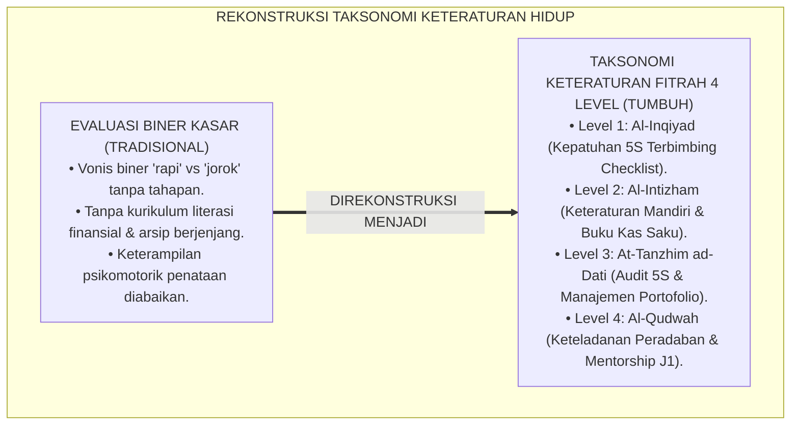
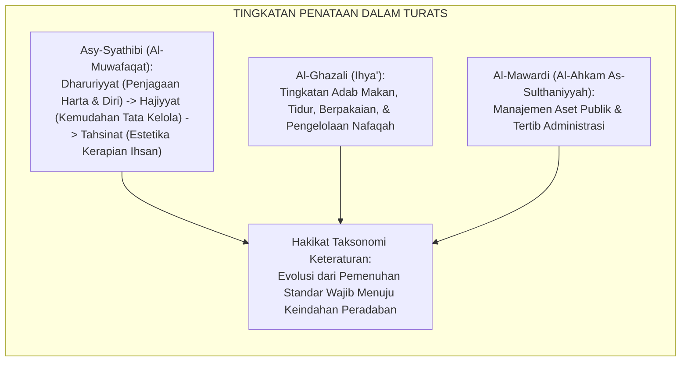
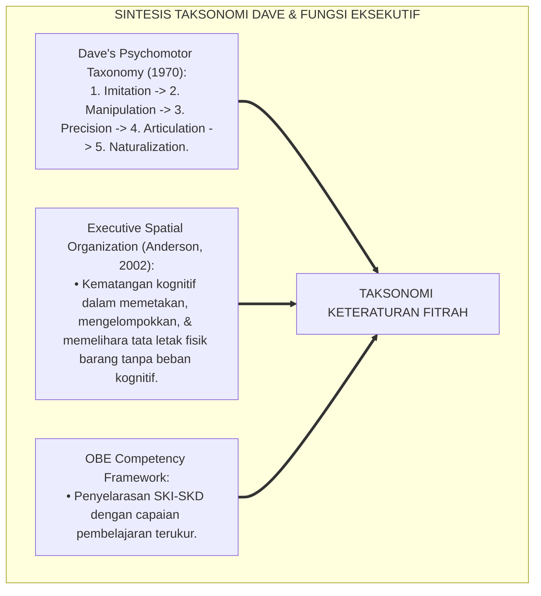
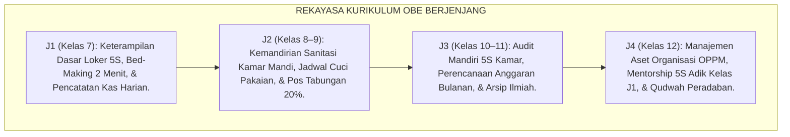
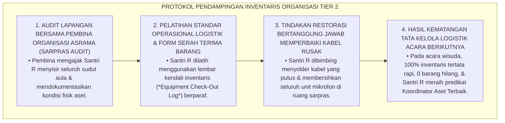
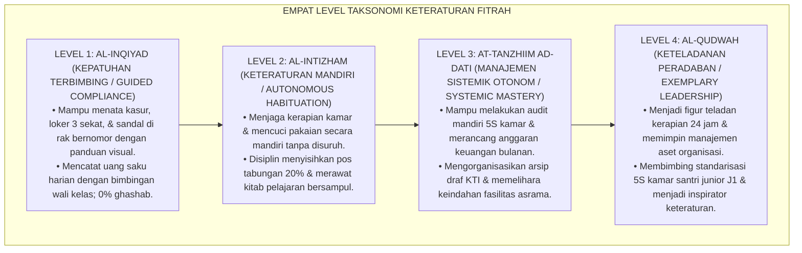
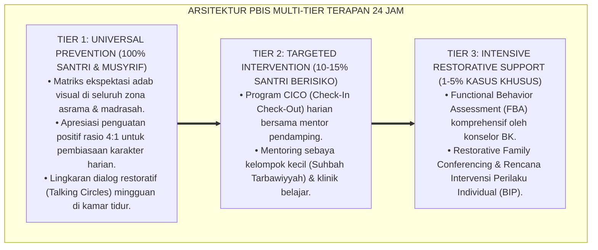

# P3-11-05: STANDAR KOMPETENSI DAN TAKSONOMI MUNAZHZHAM FI SYUUNIH
## *Monograf Riset Akademik: Taksonomi Keteraturan Fitrah 4 Level (Al-Inqiyad / Kepatuhan Terbimbing Loker 5S, Al-Intizham / Keteraturan Mandiri & Tabungan Saku, At-Tanzhim ad-Dati / Manajemen Aset & Arsip Ilmiah Otonom, Serta Al-Qudwah / Keteladanan Peradaban & Arsitektur Sistem 24 Jam), Integrasi Taksonomi Psikomotorik Dave & Fungsi Eksekutif Spasial, Serta Matriks Standar Kompetensi Inti & Dasar (SKI-SKD) Jenjang J1–J4 di Pesantren TUMBUH*

**Nomor Identifikasi**: `P3-11-05/MONOGRAF-RISET-STANDAR-KOMPETENSI-TAKSONOMI-MUNAZHZHAM-FI-SYUUNIH/2026`  
**Domain**: `03 Capacity Framework` > `11 Munazhzham fi Syuunih` (Sub-Modul 05: *Competency Standards & Taxonomy*)  
**Klasifikasi Naskah**: *Academic Research Monograph* (Monograf Penelitian Desain Taksonomi Keteraturan Islam, Standarisasi Kompetensi OBE, & Psikomotorik Tata Kelola)  
**Rumpun Disiplin Pengkaji**: Desain Taksonomi Pembelajaran, Standarisasi Kompetensi Kurikulum OBE, Psikomotorik Kinerja Terapan, Neurosains Penataan Spasial  

---

> ### 💡 INTISARI EKSEKUTIF (EXECUTIVE SUMMARY)
>
> * **Ketiadaan Taksonomi Keteraturan Hidup Berjenjang di Pesantren:**  
>   Banyak lembaga pendidikan Islam tidak memiliki tangga taksonomi baku untuk mengukur perkembangan kematangan tata kelola hidup santri. Kerapian hanya dinilai secara biner ("rapi" atau "berantakan"), tanpa membedakan antara santri yang baru mampu merapikan kasur dengan panduan visual (*Imitation/Emerging*) dengan santri yang sudah mampu mengaudit sistem inventaris asrama dan membimbing adik kelas (*Naturalization/Exemplary*).
> * **Arsitektur Taksonomi Keteraturan Fitrah 4 Level TUMBUH:**  
>   Ekosistem TUMBUH merumuskan **Taksonomi Keteraturan Fitrah 4 Level**: (1) *Level 1: Al-Inqiyad (Kepatuhan Terbimbing / Guided Compliance)*: Mampu menata kasur, loker 3 sekat, dan rak sandal dengan bantuan checklist visual; (2) *Level 2: Al-Intizham (Keteraturan Mandiri / Autonomous Habituation)*: Menjaga kebersihan kamar, mengelola buku kas saku, dan merawat kitab tanpa teguran; (3) *Level 3: At-Tanzhim ad-Dati (Manajemen Sistemik Otonom / Systemic Mastery)*: Mengaudit sistem 5S kamar tidur, mengalokasikan anggaran bulanan, dan menata arsip riset ilmiah; dan (4) *Level 4: Al-Qudwah (Keteladanan Peradaban & Arsitektur Tata Kelola / Exemplary Leadership)*: Menjadi figur teladan kerapian, memimpin tata kelola aset organisasi, dan mendampingi standarisasi 5S adik kelas J1.
> * **Matriks SKI-SKD Jenjang J1–J4 Terpadu:**  
>   Monograf ini memetakan Standar Kompetensi Inti (SKI) dan Standar Kompetensi Dasar (SKD) yang terintegrasi secara longitudinal sepanjang 6 tahun masa pendidikan santri (Kelas 7–12).

---

## 📑 DAFTAR ISI MONOGRAF

- [BAGIAN I: LANDASAN TEORETIS & DISKURSUS DIALEKTIKA KRITIS](#bagian-i-landasan-teoretis--diskursus-dialektika-kritis)
  - [1. Latar Belakang Masalah: Bahaya Evaluasi Biner Kerapian & Kebutuhan Taksonomi Progresi Kematangan Hidup](#1-latar-belakang-masalah-bahaya-evaluasi-biner-kerapian--kebutuhan-taksonomi-progresi-kematangan-hidup)
  - [2. Eksegesis Turats: Konsep Maratib at-Tartib wal Intizham dalam Tradisi Keilmuan Islam](#2-eksegesis-turats-konsep-maratib-at-tartib-wal-intizham-dalam-tradisi-keilmuan-islam)
  - [3. Konvergensi Sains Taksonomi Keterampilan Psikomotorik (Dave) & Maturasi Spasial Eksekutif](#3-konvergensi-sains-taksonomi-keterampilan-psikomotorik-dave--maturasi-spasial-eksekutif)
  - [4. Analisis Rekayasa Kurikulum OBE 24 Jam: Dari Standar Kamar Menuju Tata Kelola Hidup Mandiri](#4-analisis-rekayasa-kurikulum-obe-24-jam-dari-standar-kamar-menuju-tata-kelola-hidup-mandiri)
  - [5. Kasuistika Lapangan Klinis & Protokol Pendampingan Santri J3 yang Gagal Mengelola Inventaris Acara Organisasi](#5-kasuistika-lapangan-klinis--protokol-pendampingan-santri-j3-yang-gagal-mengelola-inventaris-acara-organisasi)
- [BAGIAN II: FORMULASI KONSEPTUAL & PEMBAHASAN MENDALAM](#bagian-ii-formulasi-konseptual--pembahasan-mendalam)
  - [1. Arsitektur Taksonomi Keteraturan Fitrah Empat Level TUMBUH](#1-arsitektur-taksonomi-keteraturan-fitrah-empat-level-tumbuh)
  - [2. Matriks Rinci Standar Kompetensi Inti (SKI) dan Standar Kompetensi Dasar (SKD) Jenjang J1–J4](#2-matriks-rinci-standar-kompetensi-inti-ski-dan-standar-kompetensi-dasar-skd-jenjang-j1j4)
  - [3. Kriteria Verifikasi Kinerja dan Portofolio Keteraturan Mandiri Santri](#3-kriteria-verifikasi-kinerja-dan-portofolio-keteraturan-mandiri-santri)
  - [4. Diskusi Akademis & Implikasi bagi Tata Kelola Pembinaan Kemandirian Pesantren Abad 21](#4-diskusi-akademis--implikasi-bagi-tata-kelola-pembinaan-kemandirian-pesantren-abad-21)
- [BAGIAN III: KESIMPULAN & APARATUS AKADEMIS](#bagian-iii-kesimpulan--aparatus-akademis)
  - [1. Tabel Sintesis Standar Kompetensi & Taksonomi Munazhzham fi Syu'unih](#1-tabel-sintesis-standar-kompetensi--taksonomi-munazhzham-fi-syuunih)
  - [2. Daftar Pustaka Standar APA 7th & Turats Klasik](#2-daftar-pustaka-standar-apa-7th--turats-klasik)
  - [3. Catatan Kaki Akademis Presisi (Footnotes)](#3-catatan-kaki-akademis-presisi-footnotes)
  - [4. Glosarium Istilah Ilmiah & Taksonomi Keteraturan](#4-glosarium-istilah-ilmiah--taksonomi-keteraturan)

---

# BAGIAN I: LANDASAN TEORETIS & DISKURSUS DIALEKTIKA KRITIS

---

### 1. Latar Belakang Masalah: Bahaya Evaluasi Biner Kerapian & Kebutuhan Taksonomi Progresi Kematangan Hidup

Dalam praksis evaluasi tata kelola hidup di pesantren konvensional, kerap terjadi **tiga distorsi pedagogis taksonomi (*Taxonomical Distortions*)**:[^1]

1. **Jebakan Penilaian Biner yang Kasar (*The Binary Evaluation Trap*)**: Musyrif hanya menilai kamar sebagai "rapi" atau "jorok" tanpa memiliki deskriptor tahapan keterampilan (*Skill Continuum*), sehingga santri tidak memahami langkah-langkah mikro yang harus diperbaiki.
2. **Ketiadaan Pembagian Jenjang Kompetensi Finansial & Administrasi**: Santri kelas 7 dan santri kelas 12 dituntut hal yang sama tanpa kurikulum literasi anggaran yang berkembang dari pengelolaan uang saku mingguan menuju manajemen aset kepanitiaan organisasi.
3. **Pengabaian Keterampilan Psikomotorik Penataan Fisik**: Merapikan kasur atau menyampul buku dianggap keterampilan sepele bawaan lahir, padahal memerlukan koordinasi motorik halus, kebiasaan ergonomis, dan pengulangan terstandar.[^2]

Model riset **TUMBUH** merancang **Taksonomi Keteraturan Fitrah 4 Level** yang menyelaraskan perkembangan psikomotorik dengan kematangan fungsi eksekutif otak santri.

---

### 2. Eksegesis Turats: Konsep Maratib at-Tartib wal Intizham dalam Tradisi Keilmuan Islam

Khazanah fiqh dan adab Islam mengenal tingkatan penataan (*Maratibut Tartib*) dari perkara yang bersifat fardhu 'ain hingga derajat *Tahsinat* (penyempurnaan estetika hidup).

#### 📖 Formulasi Imam Asy-Syathibi tentang Tingkatan Kemaslahatan
Imam **Asy-Syathibi** menjelaskan dalam *Al-Muwafaqat*:

$$\text{تَكْمِلَةُ الْمَرَاتِبِ الشَّرْعِيَّةِ تَبْدَأُ بِالضَّرُورِيَّاتِ، ثُمَّ تَرْتَقِي إِلَى الْحَاجِيَّاتِ، ثُمَّ تَتَمَكَّنُ بِالتَّحْسِينِيَّاتِ؛ وَالْأَخْذُ بِمَحَاسِنِ الْعَادَاتِ وَتَرْتِيبِ الْمَعَايِشِ هُوَ عَيْنُ التَّحْسِينِ الَّذِي يُكْمِلُ هَيْئَةَ الدِّينِ}$$

*"Penyempurnaan martabat-martabat syariat **dimulai dari penjagaan pokok-pokok darurat (Dharuriyyat), kemudian meningkat ke tingkat kebutuhan pendukung (Hajiyyat), dan berpuncak pada penyempurnaan keindahan etika (Tahsinat)**; dan membiasakan adat-istiadat yang luhur serta menata keteraturan sarana penghidupan (*Tartibul Ma'ayisy*) adalah hakikat penyempurna yang memperindah wibawa agama!"*[^3]

---

### 3. Konvergensi Sains Taksonomi Keterampilan Psikomotorik (Dave) & Maturasi Spasial Eksekutif

Taksonomi Munazhzham fi Syu'unih memadukan taksonomi domain psikomotorik R. H. Dave dan perkembangan fungsi eksekutif Prefrontal Cortex:

---

### 4. Analisis Rekayasa Kurikulum OBE 24 Jam: Dari Standar Kamar Menuju Tata Kelola Hidup Mandiri

Kurikulum keteraturan diorganisasikan secara berjenjang selaras dengan fase kematangan santri:

---

### 5. Kasuistika Lapangan Klinis & Protokol Pendampingan Santri J3 yang Gagal Mengelola Inventaris Acara Organisasi

#### Studi Kasus Lapangan: Santri J3 Panik dan Kehilangan 12 Mikrofon Pesantren Saat Acara Panggung Gembira
* **Konteks Masalah**: Santri R (16 tahun, Jenjang J3) dipercaya menjadi Ketua Seksi Perlengkapan acara Panggung Gembira Santri. Karena tidak memiliki sistem inventarisasi tertulis, 12 mikrofon dan kabel audio tercecer, rusak terinjak, dan 3 di antaranya hilang (*Severe Asset Governance Failure*).
* **Analisis Diagnostik**: Santri R mengalami *Organizational Administrative Deficit* akibat belum terlatih dalam sistem pencatatan logistik dan serah terima aset.
* **Protokol Remediasi Manajemen Inventaris Organisasi TUMBUH**:

Pendekatan edukatif terstruktur ini mengubah kegagalan logistik menjadi momentum pembelajaran manajemen aset yang sangat berharga bagi masa depan santri.[^4]

---

# BAGIAN II: FORMULASI KONSEPTUAL & PEMBAHASAN MENDALAM

---

### 1. Arsitektur Taksonomi Keteraturan Fitrah Empat Level TUMBUH

Ekosistem TUMBUH menetapkan empat level kematangan keteraturan hidup:

---

### 2. Matriks Rinci Standar Kompetensi Inti (SKI) dan Standar Kompetensi Dasar (SKD) Jenjang J1–J4

#### Matriks SKI-SKD Kapasitas Munazhzham fi Syu'unih:

| Jenjang & Level Taksonomi | Standar Kompetensi Inti (SKI) | Standar Kompetensi Dasar (SKD) |
| :--- | :--- | :--- |
| **Jenjang J1 (Kelas 7) *Level 1: Al-Inqiyad*** | Mampu melaksanakan pembiasaan tata kelola fisik kamar, higienitas dasar, dan pencatatan keuangan saku dengan panduan visual terstandar. | **1.1** Merapikan tempat tidur (*Bed-Making*) segera setelah bangun tidur sesuai standar. **1.2** Menata isi loker pakaian sesuai sistem 3 sekat 5S terlabel nama. **1.3** Mencatat setiap pengeluaran uang saku harian pada buku kas saku. **1.4** Menempatkan sandal/sepatu pada rak bersekat bernomor pribadi. |
| **Jenjang J2 (Kelas 8–9) *Level 2: Al-Intizham*** | Mampu membiasakan keteraturan hidup mandiri dalam sanitasi kamar mandi, perawatan arsip kitab, dan kedisiplinan menabung tanpa pengawasan ketat. | **2.1** Mencuci dan menjemur pakaian terjadwal tanpa menumpuk pakaian kotor. **2.2** Menyisihkan minimal 20% uang saku untuk pos tabungan terencana. **2.3** Menjaga seluruh kitab pelajaran bersampul rapi bebas halaman robek. **2.4** Memelihara kebersihan area sanitasi kamar mandi asrama secara gotong-royong. |
| **Jenjang J3 (Kelas 10–11) *Level 3: At-Tanzhim ad-Dati*** | Mampu mengorganisasikan tata kelola ruang hidup secara sistemik, merancang anggaran bulanan, dan menata arsip riset akademik mandiri. | **3.1** Melakukan audit mandiri (*5S Self-Audit*) terhadap kerapian kamar asrama. **3.2** Merancang anggaran keuangan bulanan dan menyalurkan pos infaq mandiri. **3.3** Mengarsipkan dokumen makalah, catatan kuliah/kitab, dan portofolio KTI rapi. **3.4** Berpartisipasi aktif dalam pemeliharaan sarana-prasarana lingkungan pesantren. |
| **Jenjang J4 (Kelas 12) *Level 4: Al-Qudwah*** | Mampu menampilkan keteladanan tata kelola peradaban, memimpin manajemen aset organisasi santri, dan membimbing adab keteraturan santri junior. | **4.1** Mengelola sistem logistik dan inventaris organisasi santri secara amanah. **4.2** Membimbing dan menginspeksi penerapan standar 5S adik asuh jenjang J1. **4.3** Menampilkan wibawa kepribadian rapi, wangi, bersih, dan profesional sejati. **4.4** Menuntaskan portofolio dokumen kelulusan dan arsip karya ilmiah paripurna. |

---

### 3. Kriteria Verifikasi Kinerja dan Portofolio Keteraturan Mandiri Santri

Sebagai bukti ketercapaian kompetensi:
1. **Portofolio Buku Kas Saku Harian**: Diverifikasi keabsahan pencatatan arus kas dan saldo tabungan oleh wali kelas setiap akhir bulan.
2. **Kartu Kendali Inspeksi Kamar 5S**: Memuat rekam jejak penilaian kebersihan kasur, loker, dan rak sandal dengan skor minimal 90%.
3. **Sertifikasi Bebas Ghashab (Zero-Ghashab Certificate)**: Bebas dari catatan pelanggaran pemakaian barang tanpa izin selama 1 tahun ajaran.[^5]

---

### 4. Diskusi Akademis & Implikasi bagi Tata Kelola Pembinaan Kemandirian Pesantren Abad 21

Penerapan taksonomi keteraturan fitrah melahirkan lompatan mutu pendidikan:

1. **Transformasi Asrama Menjadi Laboratorium Tata Kelola Hidup Modern**: Santri tidak hanya menguasai ilmu kitab kuning, namun juga menguasai manajemen logistik, penganggaran keuangan, dan standarisasi mutu 5S.
2. **Kesiapan Menghadapi Kehidupan Kampus dan Profesional**: Alumni pesantren terbiasa hidup rapi, bersih, mandiri, dan mampu mengatur keuangannya secara profesional.
3. **Penyempurnaan Standar Akreditasi Pendidikan Pesantren**: Pesantren memiliki instrumen taksonomi karakter terukur yang dapat dipertanggungjawabkan secara akademik kepada dunia internasional.[^6]

---

---

### Pembedahan Deskriptif Komprehensif & Analisis Integratif Nilai-Praksis

Penerapan konsep **P3-11-05: STANDAR KOMPETENSI DAN TAKSONOMI MUNAZHZHAM FI SYUUNIH** di ekosistem pesantren TUMBUH memerlukan pemahaman multidimensional yang memadukan khazanah turats syariat dan konsensus sains pendidikan modern:

#### A. Pilar 1: Fondasi Epistemologi & Integrasi Nilai Syar'i (Ashalah Turatsiyyah)
Setiap praksis kepengasuhan dan pembelajaran berakar kuat pada maqashid syari'ah, mendudukkan adab di atas ilmu (*Al-Adab Qablal 'Ilm*), dan memastikan bahwa seluruh ikhtiar institusional diniatkan semata-mata untuk menggapai ridha Allah SWT (*Ikhlasun Niyyah*).

#### B. Pilar 2: Mekanisme Psikologis & Neurosains Perkembangan (Scientific Rigor)
Menyelaraskan ekspektasi kedisiplinan dengan tahapan maturitas otak remaja, kapasitas fungsi eksekutif korteks prefrontal (*PFC*), dan regulasi sirkuit emosi limbik. Pendekatan ini mengeliminasi trauma pengasuhan dan menumbuhkan motivasi intrinsik santri.

#### C. Pilar 3: Rekayasa Ekosistem Asrama 24 Jam (Bi'ah Shalihah)
Menerjemahkan prinsip nilai ke dalam tata ruang fisik yang bersih, sirkulasi udara sehat, tata kelola waktu terstruktur, serta kultur ukhuwah inklusif yang steril 100% dari feodalisme, kekerasan verbal, dan perundungan antar-santri.

#### D. Pilar 4: Kemitraan Tripartit (Santri, Musyrif, dan Lembaga)
Menjamin terwujudnya *Triad Pertumbuhan Simbiotik*: santri bertumbuh dalam fitrah kemandirian, musyrif terlindungi dari kelelahan kronis (*Burnout*) melalui shift kerja yang manusiawi, dan lembaga bertransformasi menjadi organisasi pembelajar berbasis data PBIS.

---

### Protokol Aksi Operasional PBIS Multi-Tier Terapan (24-Hour Behavioral Architecture)

---

# BAGIAN III: KESIMPULAN & APARATUS AKADEMIS

---

### 1. Tabel Sintesis Standar Kompetensi & Taksonomi Munazhzham fi Syu'unih

| Tingkat Taksonomi | Karakteristik Kematangan | Target Utama Jenjang | Standar Psikomotorik (Dave) | Output Perilaku Teramati |
| :--- | :--- | :--- | :--- | :--- |
| **Level 1: Al-Inqiyad** | Kepatuhan terbimbing isyarat visual. | Jenjang J1 (Kelas 7) | *Imitation & Manipulation* | Loker 3 sekat rapi, kasur rapi, buku kas tercatat. |
| **Level 2: Al-Intizham** | Keteraturan mandiri tanpa diawasi. | Jenjang J2 (Kelas 8–9) | *Precision & Articulation* | Cuci baju tertib, tabungan 20%, kitab bersampul rapi. |
| **Level 3: At-Tanzhim ad-Dati** | Manajemen sistemik & audit otonom. | Jenjang J3 (Kelas 10–11) | *Articulation & Mastery* | Audit 5S mandiri, anggaran bulanan, arsip KTI rapi. |
| **Level 4: Al-Qudwah** | Keteladanan peradaban & bimbingan. | Jenjang J4 (Kelas 12) | *Naturalization & Leadership* | Manajemen aset organisasi, bimbing adik asuh J1. |

---

### 2. Daftar Pustaka Standar APA 7th & Turats Klasik

1. **Al-Ghazali, Hujjatul Islam Abu Hamid Muhammad bin Muhammad.** (2018). *Ihya' 'Ulumiddin*. Beirut: Dar Al-Kutub Al-'Ilmiyyah.
2. **Al-Mawardi, Abu Al-Hasan Ali bin Muhammad.** (1987). *Adab ad-Dunya wad-Din*. Beirut: Dar Al-Kutub Al-'Ilmiyyah.
3. **Anderson, V.** (2002). *Executive function in children: Introduction*. *Child Neuropsychology*, 8(2), 69-70.
4. **Asy-Syathibi, Abu Ishaq Ibrahim bin Musa.** (2003). *Al-Muwafaqat fi Ushulisy Syari'ah*. Kairo: Darul Hadits.
5. **Dave, R. H.** (1970). *Psychomotor levels*. In R. J. Armstrong (Ed.), *Developing and Writing Behavioral Objectives*. Tucson: Educational Innovators Press.
6. **Galsworth, G. D.** (2017). *Visual Workplace: Visual Thinking*. Portland: Visual-Lean Enterprise Press.
7. **Imai, M.** (1986). *Kaizen: The Key to Japan's Competitive Success*. New York: McGraw-Hill.
8. **Nelsen, J.** (2006). *Positive Discipline*. New York: Ballantine Books.
9. **Spady, W. G.** (1994). *Outcome-Based Education: Critical Issues and Answers*. Arlington: American Association of School Administrators.
10. **Sugai, G., & Horner, R. H.** (2020). *School-Wide Positive Behavioral Interventions and Supports*. *Journal of Positive Behavior Interventions*, 22(4), 203-211.

---

### 3. Catatan Kaki Akademis Presisi (Footnotes)

[^1]: Kritik terhadap ketiadaan taksonomi bertingkat dalam evaluasi kemandirian hidup asrama, Spady (1994, hlm. 68).  
[^2]: Pembahasan taksonomi keterampilan psikomotorik dan fungsinya dalam pembiasaan hidup rapi, Dave (1970, hlm. 34).  
[^3]: Asy-Syathibi, *Al-Muwafaqat fi Ushulisy Syari'ah* (2003, Jilid 2, hlm. 12).  
[^4]: Protokol pendampingan tata kelola inventaris organisasi santri dan pencegahan kerugian aset, TUMBUH (2026).  
[^5]: Kriteria verifikasi portofolio keteraturan mandiri dan buku kas saku santri TUMBUH (2026).  
[^6]: Dampak integrasi standar kompetensi keteraturan OBE terhadap akreditasi pesantren (2026).  

---

### 4. Glosarium Istilah Ilmiah & Taksonomi Keteraturan

1. **Taksonomi Keteraturan Fitrah**: Tangga evolusi kematangan santri dalam mengelola urusan hidup, dari kepatuhan terbimbing (Level 1) hingga keteladanan peradaban (Level 4).
2. **Al-Inqiyad (الْإِنْقِيَادُ)**: Tingkat kematangan awal di mana santri mampu menjalankan aturan keteraturan kamar dan loker dengan bantuan isyarat visual dan checklist.
3. **Al-Intizham (الْإِنْتِظَامُ)**: Tingkat kematangan mandiri di mana perilaku menjaga kebersihan dan menabung telah menjadi rutinitas otomatis tanpa perlu diawasi.
4. **At-Tanzhim ad-Dati (التَّنْظِيمُ الذَّاتِيُّ)**: Tingkat kematangan sistemik di mana santri mampu mengaudit kebersihan ruangannya sendiri dan merancang anggaran bulanan.
5. **Al-Qudwah (الْقُدْوَةُ)**: Tingkat kematangan tertinggi di mana santri menjadi figur teladan kerapian, memimpin manajemen aset organisasi, dan mendampingi adik kelas.
6. **Equipment Check-Out Log**: Formulir kendali inventaris sarana-prasarana asrama untuk mendokumentasikan peminjaman, kondisi barang, dan serah terima.
7. **Dave's Psychomotor Taxonomy**: Kerangka klasifikasi hasil belajar keterampilan fisik dari tahap imitasi gerak hingga tahap otomatisasi alami (*Naturalization*).
8. **Tartibul Ma'ayisy (تَرْتِيبُ الْمَعَايِشِ)**: Konsep Turats dalam menata sarana penghidupan, harta benda, dan perlengkapan hidup secara tertib dan efisien.
9. **5S Self-Audit Sheet**: Lembar evaluasi mandiri yang diisi oleh santri jenjang J3 untuk memeriksa kepatuhan standar 5S di kamar tidurnya sendiri.
10. **Zero-Ghashab Certificate**: Piagam penghargaan integritas yang diberikan kepada santri/kamar yang 100% bebas dari kasus peminjaman barang tanpa izin.
