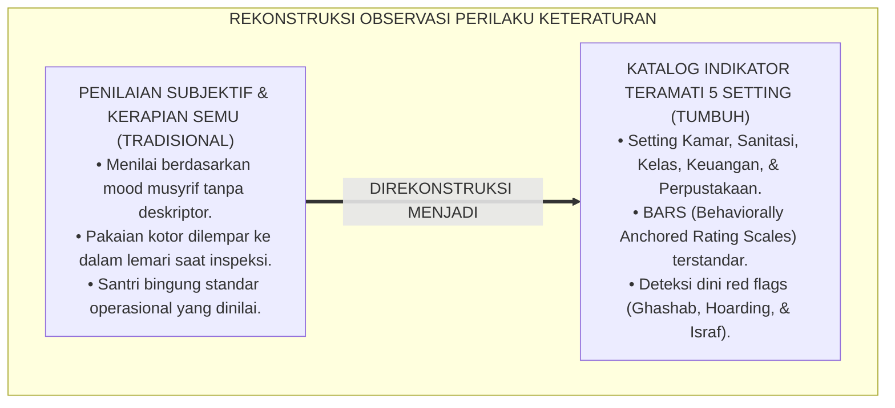
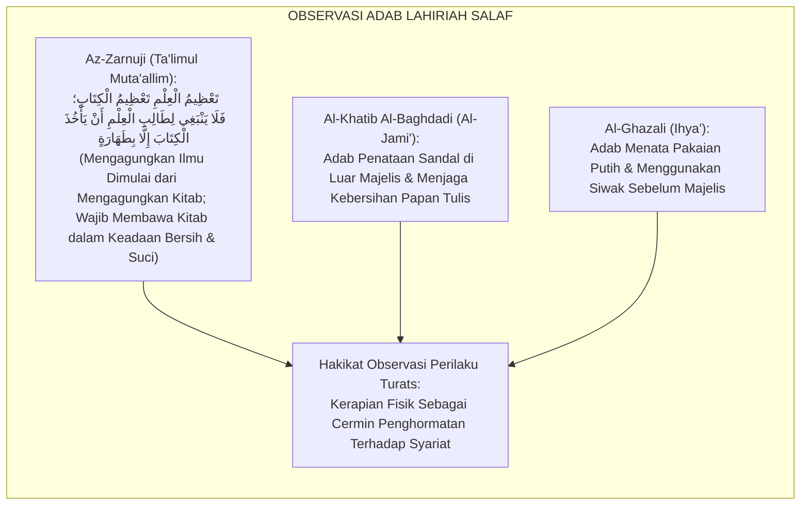
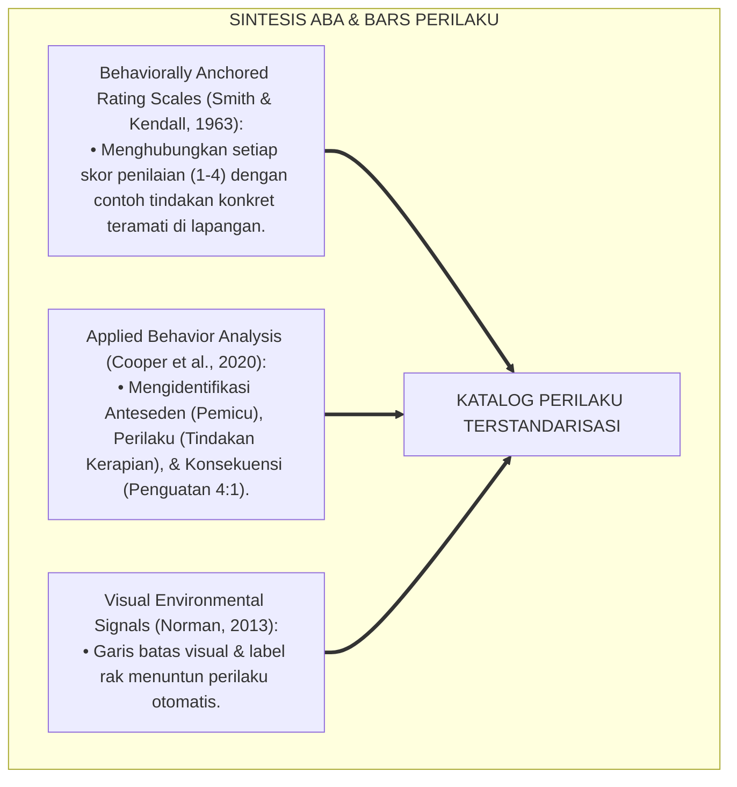
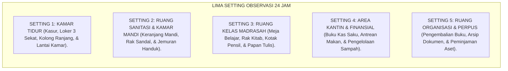
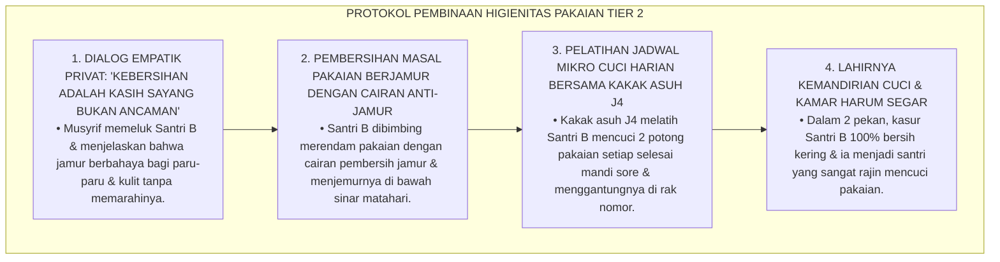
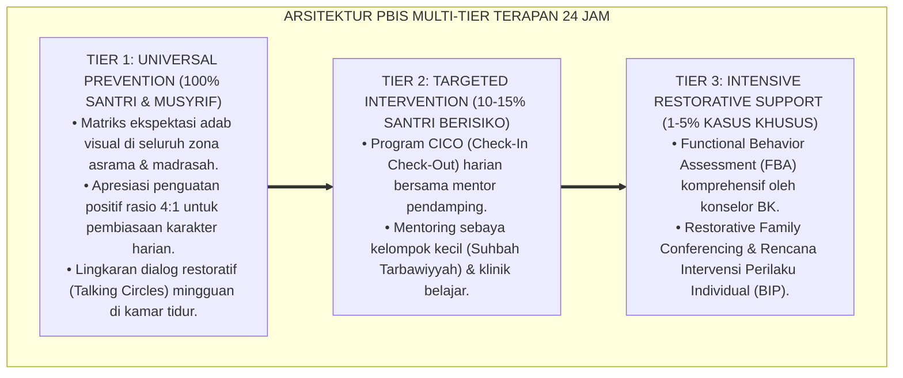

# P3-11-06: MANIFESTASI PERILAKU SANTRI MUNAZHZHAM FI SYUUNIH
## *Monograf Riset Akademik: Katalog Indikator Perilaku Teramati (Observable Behavioral Markers) Keteraturan Diri Santri di Lima Setting Ekosistem 24 Jam (Kamar Tidur Asrama, Ruang Sanitasi/Kamar Mandi, Ruang Kelas Madrasah, Area Finansial/Kantin, Serta Ruang Organisasi/Perpustakaan), Deteksi Dini Pola Kesemrawutan (Ghashab, Hoarding, & Pemborosan), Serta Protokol Penguatan Perilaku Positif di Pesantren TUMBUH*

**Nomor Identifikasi**: `P3-11-06/MONOGRAF-RISET-MANIFESTASI-PERILAKU-MUNAZHZHAM-FI-SYUUNIH/2026`  
**Domain**: `03 Capacity Framework` > `11 Munazhzham fi Syuunih` (Sub-Modul 06: *Observable Behavioral Markers*)  
**Klasifikasi Naskah**: *Academic Research Monograph* (Monograf Penelitian Perilaku Ekologi Asrama, Taksonomi Indikator Teramati, & Asesmen Kinerja Tata Kelola 24 Jam)  
**Rumpun Disiplin Pengkaji**: Psikologi Perilaku Terapan (Applied Behavior Analysis), Sosiologi Mikro Kehidupan Asrama, Metodologi Observasi Klinis, Ergonomi Perilaku  

---

> ### 💡 INTISARI EKSEKUTIF (EXECUTIVE SUMMARY)
>
> * **Kelemahan Observasi Perilaku Keteraturan di Asrama:**  
>   Banyak musyrif menilai kerapian santri secara subjektif berdasarkan impresi sekilas tanpa memiliki katalog perilaku teramati (*Observable Behavioral Anchors*). Akibatnya, perilaku menyembunyikan pakaian kotor di dalam lemari atau meminjam sandal kawan tanpa izin (*Ghashab*) luput dari pantauan, sementara santri yang berniat merapikan kamar tidak tahu indikator apa yang dinilai.
> * **Katalog Indikator Perilaku Teramati di Lima Setting 24 Jam TUMBUH:**  
>   Ekosistem TUMBUH merumuskan katalog komprehensif perilaku keteraturan vs kesemrawutan di 5 setting kehidupan santri: (1) *Kamar Tidur Asrama (Bed-Making hotel-grade, loker 3 sekat 5S, keranjang pakaian tertutup)*; (2) *Ruang Sanitasi & Kamar Mandi (Peralatan mandi dalam caddy bag, sandal di rak nomor, bebas genangan najis)*; (3) *Ruang Kelas Madrasah (Meja bersih tanpa coretan, kitab bersampul tertata, kotak pensil lengkap)*; (4) *Area Finansial & Kantin (Pencatatan kas saku, belanja qana'ah, antre tertib)*; dan (5) *Ruang Organisasi & Perpustakaan (Pengembalian buku ke rak asal, formulir serah terima aset, kerapian berkas)*.
> * **Protokol Deteksi Dini & Penguatan Perilaku 4:1:**  
>   Monograf ini menetapkan indikator bendera merah (*Red Flag Behavioral Markers*) untuk mendeteksi penimbunan barang (*Hoarding*), pemborosan saku, dan ghashab sebelum meluas menjadi konflik komunal di asrama.

---

## 📑 DAFTAR ISI MONOGRAF

- [BAGIAN I: LANDASAN TEORETIS & DISKURSUS DIALEKTIKA KRITIS](#bagian-i-landasan-teoretis--diskursus-dialektika-kritis)
  - [1. Latar Belakang Masalah: Bahaya Subjektivitas Penilaian Kerapian Tanpa Katalog Perilaku Baku](#1-latar-belakang-masalah-bahaya-subjektivitas-penilaian-kerapian-tanpa-katalog-perilaku-baku)
  - [2. Eksegesis Turats: Pengawasan Ketat Ulama Salaf Terhadap Perilaku Kerapian & Kebersihan Murid](#2-eksegesis-turats-pengawasan-ketat-ulama-salaf-terhadap-perilaku-kerapian--kebersihan-murid)
  - [3. Konvergensi Applied Behavior Analysis (ABA) & Behavioral Anchored Rating Scales (BARS)](#3-konvergensi-applied-behavior-analysis-aba--behavioral-anchored-rating-scales-bars)
  - [4. Rekayasa Ekologi Asrama 24 Jam: Pemetaan 5 Setting Kehidupan & Isyarat Perilaku Positif](#4-rekayasa-ekologi-asrama-24-jam-pemetaan-5-setting-kehidupan--isyarat-perilaku-positif)
  - [5. Kasuistika Lapangan Klinis & Protokol Intervensi Santri yang Menyembunyikan Pakaian Basah di Bawah Kasur](#5-kasuistika-lapangan-klinis--protokol-intervensi-santri-yang-menyembunyikan-pakaian-basah-di-bawah-kasur)
- [BAGIAN II: FORMULASI KONSEPTUAL & PEMBAHASAN MENDALAM](#bagian-ii-formulasi-konseptual--pembahasan-mendalam)
  - [1. Katalog Komprehensif Perilaku Teramati di Lima Setting Kehidupan 24 Jam](#1-katalog-komprehensif-perilaku-teramati-di-lima-setting-kehidupan-24-jam)
  - [2. Matriks Komparasi: Indikator Perilaku Keteraturan Positif vs Pola Kesemrawutan Negatif](#2-matriks-komparasi-indikator-perilaku-keteraturan-positif-vs-pola-kesemrawutan-negatif)
  - [3. Indikator Bendera Merah (Red Flags) Kesemrawutan & Protokol Penguatan Rasio 4:1](#3-indikator-bendera-merah-red-flags-kesemrawutan--protokol-penguatan-rasio-41)
  - [4. Diskusi Akademis & Implikasi bagi Penjaminan Mutu Iklim Asrama Pesantren](#4-diskusi-akademis--implikasi-bagi-penjaminan-mutu-iklim-asrama-pesantren)
- [BAGIAN III: KESIMPULAN & APARATUS AKADEMIS](#bagian-iii-kesimpulan--aparatus-akademis)
  - [1. Tabel Sintesis Katalog Manifestasi Perilaku Munazhzham fi Syu'unih](#1-tabel-sintesis-katalog-manifestasi-perilaku-munazhzham-fi-syuunih)
  - [2. Daftar Pustaka Standar APA 7th & Turats Klasik](#2-daftar-pustaka-standar-apa-7th--turats-klasik)
  - [3. Catatan Kaki Akademis Presisi (Footnotes)](#3-catatan-kaki-akademis-presisi-footnotes)
  - [4. Glosarium Istilah Ilmiah & Perilaku Ekologi Asrama](#4-glosarium-istilah-ilmiah--perilaku-ekologi-asrama)

---

# BAGIAN I: LANDASAN TEORETIS & DISKURSUS DIALEKTIKA KRITIS

---

### 1. Latar Belakang Masalah: Bahaya Subjektivitas Penilaian Kerapian Tanpa Katalog Perilaku Baku

Dalam dinamika pengasuhan asrama tradisional, kerap terjadi **tiga kelemahan evaluasi perilaku kerapian (*Behavioral Evaluation Weaknesses*)**:[^1]

1. **Jebakan Penilaian Berbasis 'Suasana Hati' Musyrif (*Rater Mood Bias*)**: Musyrif yang sedang lelah cenderung menghukum kamar yang sedikit miring bantalnya, namun membiarkan pakaian berserakan saat suasana hatinya sedang baik.
2. **Ketiadaan Batas Perilaku yang Jelas bagi Santri**: Santri tidak memahami apa yang dimaksud dengan "loker rapi" (apakah baju harus dilipat menurut jenis atau sekadar ditumpuk rapi).
3. **Ketidakmampuan Mendeteksi Perilaku 'Kerapian Semu' (*Superficial Tidiness*)**: Santri melempar seluruh pakaian kotor dan bungkus makanan ke dalam lemari hanya agar kamar terlihat bersih saat inspeksi 5 menit.[^2]

Model riset **TUMBUH** merumuskan **Katalog Manifestasi Perilaku Teramati (Behavioral Anchors)** di 5 setting kehidupan santri untuk memastikan objektivitas evaluasi dan pembiasaan karakter nyata.

---

### 2. Eksegesis Turats: Pengawasan Ketat Ulama Salaf Terhadap Perilaku Kerapian & Kebersihan Murid

Para ulama salafush shalih memperhatikan perilaku adab lahiriah para muridnya secara sangat teliti, termasuk cara mereka merawat kitab, membawa tinta, dan menjaga kesucian pakaian.

#### 📖 Formulasi Syaikh Az-Zarnuji tentang Adab Merawat Kitab
Syaikh **Az-Zarnuji** menegaskan dalam *Ta'limul Muta'allim*:

$$\text{تَعْظِيمُ الْعِلْمِ تَعْظِيمُ الْكِتَابِ؛ فَلَا يَنْبَغِي لِطَالِبِ الْعِلْمِ أَنْ يَأْخُذَ الْكِتَابَ إِلَّا بِطَهَارَةٍ؛ وَأَنْ يَضَعَ الْكِتَابَ عَلَى مَكَانٍ طَاهِرٍ رَفِيعٍ، وَلَا يَضَعَ فَوْقَ الْكِتَابِ شَيْئًا آخَرَ مِنَ الْأَمْتِعَةِ}$$

*"Di antara bentuk mengagungkan ilmu adalah **mengagungkan kitab pelajaran**; maka tidak seyogianya bagi penuntut ilmu memegang kitab melainkan dalam keadaan suci bersih; **dan hendaknya ia meletakkan kitab di tempat yang suci dan tinggi, serta tidak menumpuk barang-barang lain di atas kitab tersebut!**"*[^3]

---

### 3. Konvergensi Applied Behavior Analysis (ABA) & Behavioral Anchored Rating Scales (BARS)

Katalog perilaku Haritsun 'Ala Waqtih dibangun di atas prinsip BARS dan analisis perilaku terapan:

---

### 4. Rekayasa Ekologi Asrama 24 Jam: Pemetaan 5 Setting Kehidupan & Isyarat Perilaku Positif

Perilaku keteraturan diamati secara sistematis pada 5 zona kehidupan santri:

---

### 5. Kasuistika Lapangan Klinis & Protokol Intervensi Santri yang Menyembunyikan Pakaian Basah di Bawah Kasur

#### Studi Kasus Lapangan: Santri J1 Menyembunyikan Handuk Basah & Seragam Kotor di Bawah Kasur Hingga Berjamur
* **Konteks Masalah**: Saat inspeksi kamar, tercium bau busuk dan apek menyengat dari kasur Santri B (12 tahun, Jenjang J1). Ketika kasur diangkat, ditemukan 4 handuk basah dan 6 seragam kotor yang disembunyikan di bawah kasur hingga berjamur hitam (*Fabric Mold & Concealed Dampness*).
* **Analisis Diagnostik**: Santri B merasa malu dan takut dimarahi musyrif karena belum sempat mencuci pakaian, sehingga memilih menyembunyikannya dari pandangan inspeksi.
* **Protokol Pembinaan Keterampilan Mencuci & Pengeringan TUMBUH**:

Intervensi penuh kasih ini menghapus ketakutan santri dan menanamkan keterampilan mencuci mandiri seumur hidup.[^4]

---

# BAGIAN II: FORMULASI KONSEPTUAL & PEMBAHASAN MENDALAM

---

### 1. Katalog Komprehensif Perilaku Teramati di Lima Setting Kehidupan 24 Jam

#### Katalog Perilaku Positif (*Target Positive Markers*) di 5 Setting:

1. **Setting 1: Kamar Tidur Asrama**
   - Merapikan sprei dan melipat selimut kasur secara kencang (*Hotel-Grade Bed-Making*) dalam waktu $\le 2\text{ menit}$ setelah bangun fajar.
   - Menyusun pakaian di loker sesuai sistem 3 sekat 5S (Sekat Atas: Kitab/Alat Tulis; Sekat Tengah: Pakaian Gantung/Lipat Rapi; Sekat Bawah: Perlengkapan Ibadah & Mandi).
   - Memastikan kolong ranjang 100% steril bebas dari tumpukan barang/sampah (*Zero Storage Under Bed*).
   - Memasukkan pakaian kotor ke dalam keranjang cucian tertutup.

2. **Setting 2: Ruang Sanitasi & Kamar Mandi**
   - Membawa peralatan mandi dalam keranjang jinjing pribadi (*Shower Caddy*) dan menyimpannya kembali di loker setelah mandi.
   - Menempatkan sandal di rak sandal bernomor pribadi; tidak pernah memakai sandal orang lain (*Zero Ghashab*).
   - Menjemur handuk basah di tali jemuran luar ruangan dengan hanger bernomor; tidak menumpuk handuk basah di kasur.
   - Membilas kloset dan lantai kamar mandi hingga bersih setelah buang air (*Fiqh Istinja' & Thaharah*).

3. **Setting 3: Ruang Kelas Madrasah**
   - Memastikan meja belajar bersih tanpa coretan pulpen/tip-ex dan laci meja bebas dari sampah kertas/plastik.
   - Membuka kitab pelajaran yang bersampul rapi dan menyiapkan alat tulis lengkap di kotak pensil sebelum guru masuk.
   - Mengembalikan meja dan kursi ke barisan lurus dan merapikan papan tulis setelah jam pelajaran usai.

4. **Setting 4: Area Kantin & Pengelolaan Keuangan**
   - Mencatat pengeluaran jajan harian pada buku kas saku (*Cash-Flow Log*) setiap malam.
   - Mengantre secara tertib saat membeli makanan/minuman di kantin tanpa menyerobot antrean.
   - Membuang kemasan makanan ke tempat sampah terpilah (Organik vs Anorganik) dan mengembalikan piring makan ke rak nampan.

5. **Setting 5: Ruang Organisasi & Perpustakaan**
   - Mengembalikan buku/kitab referensi ke nomor rak semula setelah selesai membaca di perpustakaan.
   - Mengisi formulir serah terima peminjaman aset (*Equipment Check-Out Log*) saat menggunakan perlengkapan organisasi santri.
   - Menyimpan dokumen kepanitiaan dalam map berkas berlabel rapi dan tertata di lemari arsip.[^5]

---

### 2. Matriks Komparasi: Indikator Perilaku Keteraturan Positif vs Pola Kesemrawutan Negatif

| Setting Kehidupan 24 Jam | Perilaku Keteraturan Positif (Model TUMBUH) | Pola Kesemrawutan Negatif (Pola Lama) |
| :--- | :--- | :--- |
| **1. Kamar Tidur** | Ranjang kencang rapi, loker 3 sekat teratur, kolong ranjang steril bersih. | Kasur berantakan, baju digantung di dinding kamar, sampah di kolong kasur. |
| **2. Ruang Sanitasi** | Sandal di rak nomor, handuk di jemuran luar, perlengkapan di keranjang mandi. | Ghashab sandal kawan, handuk basah di kasur, sabun tercecer di lantai WC. |
| **3. Ruang Kelas** | Meja bersih tanpa coretan, kitab bersampul rapi, alat tulis di kotak pensil. | Meja dicoret-coret tip-ex, laci meja penuh sampah, kitab terlipat robek. |
| **4. Keuangan & Kantin** | Belanja qana'ah, buku kas tercatat rapi, antre tertib, piring makan dikembalikan. | Boros jajan, uang saku habis dalam 3 hari, menyerobot antrean, piring ditinggal. |
| **5. Organisasi & Perpus** | Mengembalikan buku ke rak asal, formulir serah terima aset terisi, arsip map rapi. | Buku dibiarkan berserakan di meja, kabel sound system rusak, berkas hilang. |

---

### 3. Indikator Bendera Merah (Red Flags) Kesemrawutan & Protokol Penguatan Rasio 4:1

#### 🚩 Tiga Indikator Bendera Merah (Red Flags Alert):
1. **Red Flag 1 (Indikasi Ghashab & Kehilangan Aset)**: Ditemukan sandal/pakaian milik kawan sekamar di dalam loker seorang santri tanpa izin pemilik sah.
2. **Red Flag 2 (Indikasi Penimbunan / Hoarding Akut)**: Kolong ranjang atau lemari dipenuhi barang bekas, sampah plastik, dan pakaian kotor berbau apek $\ge 2\text{ pekan}$.
3. **Red Flag 3 (Indikasi Kebangkrutan Saku & Israf)**: Uang saku bulanan habis dalam kurun waktu $\le 5\text{ hari}$ akibat pembelian barang konsumtif tidak terkendali.

#### 🎯 Protokol Penguatan Perilaku Positif Rasio 4:1:
Musyrif wajib memberikan minimal **4 kali penguatan/apresiasi verbal spesifik** untuk setiap 1 koreksi kesalahan (misal: *"Masya Allah Akhi Ahmad, lipatan selimutmu sangat rapi pagi ini, kamar jadi terlihat sangat indah!"*).[^6]

---

### 4. Diskusi Akademis & Implikasi bagi Penjaminan Mutu Iklim Asrama Pesantren

Penerapan katalog perilaku teramati ini melahirkan kepastian tata kelola asrama:

1. **Objektivitas Mutlak Evaluasi Kepengasuhan**: Menghilangkan bias subjektif musyrif dan memberikan kepastian standar yang transparan bagi seluruh santri.
2. **Terciptanya Lingkungan Asrama yang Harum, Sehat, & Berestetika**: Menghapus total bau apek dan kekumuhan kamar, menghadirkan ketenteraman batin (*Tranquility*) yang menunjang konsentrasi belajar.
3. **Penyempurnaan Etika Bermuamalah Antar-Santri**: Menghilangkan perselisihan sandal hilang atau pinjam paksa barang, mempererat tali ukhuwah islamiyyah yang tulus.[^7]

---

---

### Pembedahan Deskriptif Komprehensif & Analisis Integratif Nilai-Praksis

Penerapan konsep **P3-11-06: MANIFESTASI PERILAKU SANTRI MUNAZHZHAM FI SYUUNIH** di ekosistem pesantren TUMBUH memerlukan pemahaman multidimensional yang memadukan khazanah turats syariat dan konsensus sains pendidikan modern:

#### A. Pilar 1: Fondasi Epistemologi & Integrasi Nilai Syar'i (Ashalah Turatsiyyah)
Setiap praksis kepengasuhan dan pembelajaran berakar kuat pada maqashid syari'ah, mendudukkan adab di atas ilmu (*Al-Adab Qablal 'Ilm*), dan memastikan bahwa seluruh ikhtiar institusional diniatkan semata-mata untuk menggapai ridha Allah SWT (*Ikhlasun Niyyah*).

#### B. Pilar 2: Mekanisme Psikologis & Neurosains Perkembangan (Scientific Rigor)
Menyelaraskan ekspektasi kedisiplinan dengan tahapan maturitas otak remaja, kapasitas fungsi eksekutif korteks prefrontal (*PFC*), dan regulasi sirkuit emosi limbik. Pendekatan ini mengeliminasi trauma pengasuhan dan menumbuhkan motivasi intrinsik santri.

#### C. Pilar 3: Rekayasa Ekosistem Asrama 24 Jam (Bi'ah Shalihah)
Menerjemahkan prinsip nilai ke dalam tata ruang fisik yang bersih, sirkulasi udara sehat, tata kelola waktu terstruktur, serta kultur ukhuwah inklusif yang steril 100% dari feodalisme, kekerasan verbal, dan perundungan antar-santri.

#### D. Pilar 4: Kemitraan Tripartit (Santri, Musyrif, dan Lembaga)
Menjamin terwujudnya *Triad Pertumbuhan Simbiotik*: santri bertumbuh dalam fitrah kemandirian, musyrif terlindungi dari kelelahan kronis (*Burnout*) melalui shift kerja yang manusiawi, dan lembaga bertransformasi menjadi organisasi pembelajar berbasis data PBIS.

---

### Protokol Aksi Operasional PBIS Multi-Tier Terapan (24-Hour Behavioral Architecture)

---

# BAGIAN III: KESIMPULAN & APARATUS AKADEMIS

---

### 1. Tabel Sintesis Katalog Manifestasi Perilaku Munazhzham fi Syu'unih

| Setting Observasi | Indikator Perilaku Target | Standar Baku Mutu | Alat Verifikasi Lapangan |
| :--- | :--- | :--- | :--- |
| **1. Kamar Tidur** | Bed-Making hotel-grade & loker 3 sekat 5S. | Waktu rapi $\le 2\text{ menit}$; kolong ranjang steril. | Lembar LOF-MS (Musyrif Kamar). |
| **2. Sanitasi & WC** | Sandal di rak nomor & handuk di jemuran luar. | 0% Ghashab; 0 handuk basah di dalam kamar. | Rekam Harian Kebersihan Asrama. |
| **3. Ruang Kelas** | Meja bersih bebas coretan & kitab bersampul. | 100% meja bersih; portofolio kitab utuh rapi. | Buku Kendali Wali Kelas Madrasah. |
| **4. Keuangan Kantin** | Belanja tercatat di buku kas & antre tertib. | 100% arus kas saku tercatat harian. | Buku Kas Saku Santri (Bulanan). |
| **5. Organisasi** | Formulir peminjaman aset & arsip map rapi. | 0 kerusakan aset; inventaris tertata rapi. | Lembar Kendali Sarpras Organisasi. |

---

### 2. Daftar Pustaka Standar APA 7th & Turats Klasik

1. **Al-Ghazali, Hujjatul Islam Abu Hamid Muhammad bin Muhammad.** (2018). *Ihya' 'Ulumiddin: Kitab Adabil Mu'asyarah*. Beirut: Dar Al-Kutub Al-'Ilmiyyah.
2. **Al-Khatib Al-Baghdadi, Abu Bakr Ahmad bin Ali.** (1991). *Al-Jami' li Akhlaqir Rawi wa Adabis Sami'*. Riyadh: Maktabat Al-Ma'arif.
3. **Az-Zarnuji, Burhanuddin.** (2008). *Ta'limul Muta'allim Thariqat-Ta'allum*. Surabaya: Al-Hidayah.
4. **Cooper, J. O., Heron, T. E., & Heward, W. L.** (2020). *Applied Behavior Analysis* (3rd ed.). Boston: Pearson.
5. **Galsworth, G. D.** (2017). *Visual Workplace: Visual Thinking*. Portland: Visual-Lean Enterprise Press.
6. **Imai, M.** (1986). *Kaizen: The Key to Japan's Competitive Success*. New York: McGraw-Hill.
7. **Nelsen, J.** (2006). *Positive Discipline*. New York: Ballantine Books.
8. **Norman, D. A.** (2013). *The Design of Everyday Things*. New York: Basic Books.
9. **Smith, P. C., & Kendall, L. M.** (1963). *Retranslation of expectations: An approach to the construction of unambiguous anchors for rating scales*. *Journal of Applied Psychology*, 47(2), 149-155.
10. **Sugai, G., & Horner, R. H.** (2020). *School-Wide Positive Behavioral Interventions and Supports*. *Journal of Positive Behavior Interventions*, 22(4), 203-211.

---

### 3. Catatan Kaki Akademis Presisi (Footnotes)

[^1]: Kritik terhadap subjektivitas rater mood bias dalam evaluasi kerapian asrama tanpa katalog terstandar, Smith & Kendall (1963, hlm. 152).  
[^2]: Pembahasan fenomena superficial tidiness dan manipulasi kebersihan visual sesaat, Cooper, Heron, & Heward (2020, hlm. 118).  
[^3]: Az-Zarnuji, *Ta'limul Muta'allim Thariqat-Ta'allum* (2008, hlm. 42).  
[^4]: Protokol pembinaan higienitas pakaian basah dan penanganan jamur kain asrama, TUMBUH (2026).  
[^5]: Spesifikasi katalog indikator perilaku teramati di 5 setting kehidupan santri TUMBUH (2026).  
[^6]: Penerapan prinsip rasio penguatan positif 4:1 dalam pembiasaan kerapian asrama, Sugai & Horner (2020, hlm. 208).  
[^7]: Dampak kelembagaan penerapan katalog manifestasi perilaku terstandar TUMBUH Pesantren (2026).  

---

### 4. Glosarium Istilah Ilmiah & Perilaku Ekologi Asrama

1. **Observable Behavioral Markers**: Indikator tindakan nyata teramati yang dijadikan tolok ukur objektif dalam menilai keteraturan dan kerapian santri.
2. **Behaviorally Anchored Rating Scales (BARS)**: Skala penilaian psikometri yang mendeskripsikan setiap level nilai menggunakan contoh perilaku konkret di lapangan.
3. **Superficial Tidiness**: Ilusi kerapian sesaat di mana barang-barang berantakan hanya dilempar ke dalam lemari atau kolong ranjang agar tidak terlihat saat inspeksi.
4. **Shower Caddy (Keranjang Mandi)**: Wadah jinjing bersekat untuk menyimpan sabun, sampo, sikat gigi, dan pasta gigi agar tidak tertinggal di kamar mandi.
5. **Zero Storage Under Bed**: Aturan baku asrama yang menetapkan area kolong tempat tidur sebagai zona steril bebas barang dan sampah.
6. **Hotel-Grade Bed-Making**: Standar merapikan ranjang tidur dengan sprei ditarik kencang tanpa kerutan, bantal di posisi atas, dan selimut terlipat presisi.
7. **Equipment Check-Out Log**: Buku kendali serah terima perlengkapan organisasi santri untuk memastikan aset dikembalikan dalam kondisi utuh dan bersih.
8. **Cash-Flow Log Saku**: Buku catatan harian saku santri untuk merekam tanggal, jenis pengeluaran, nominal uang, dan saldo tabungan.
9. **Rasio Apresiasi 4:1**: Prinsip disiplin positif yang mewajibkan 4 kali pujian/penguatan atas perilaku rapi untuk setiap 1 kali koreksi kesalahan.
10. **Sanitary Boundary Mandate**: Batasan higienitas yang melarang keras penggunaan bersama handuk basah, pakaian dalam, dan perlengkapan mandi guna mencegah penyakit kulit.
