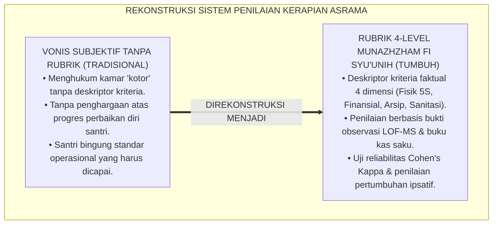
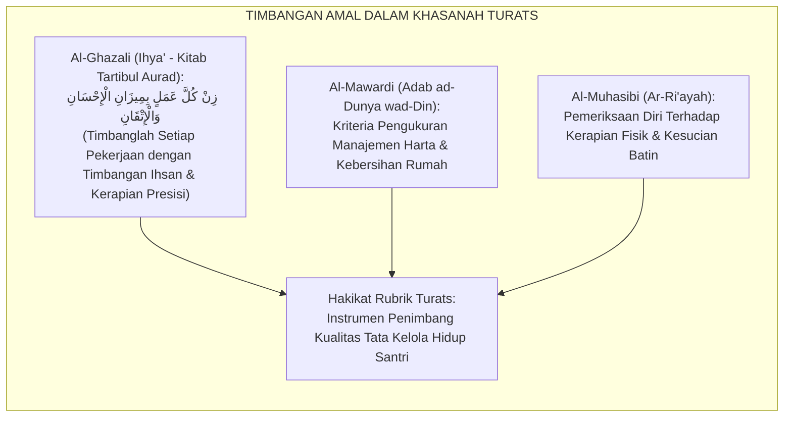
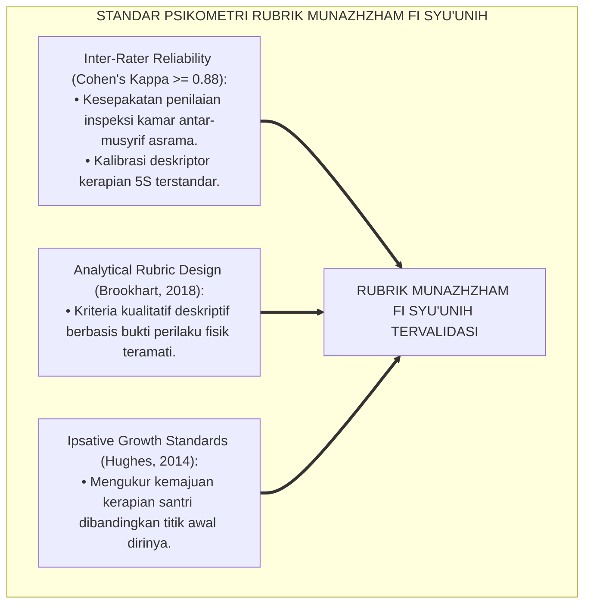
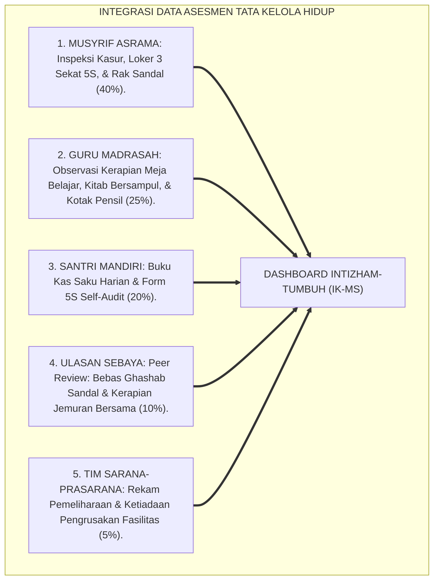
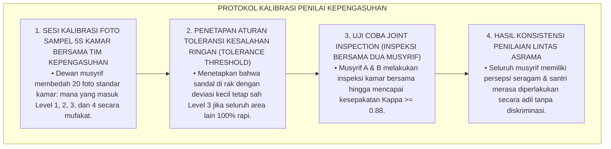
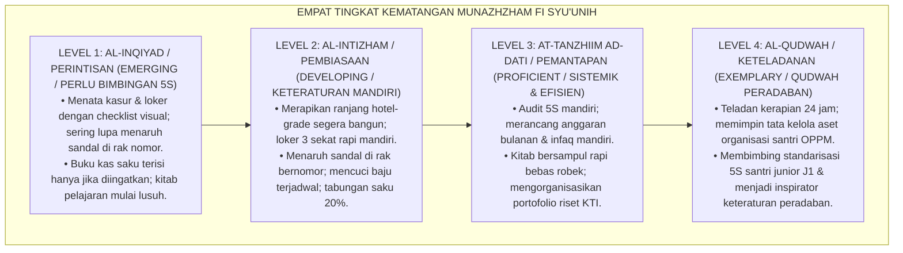
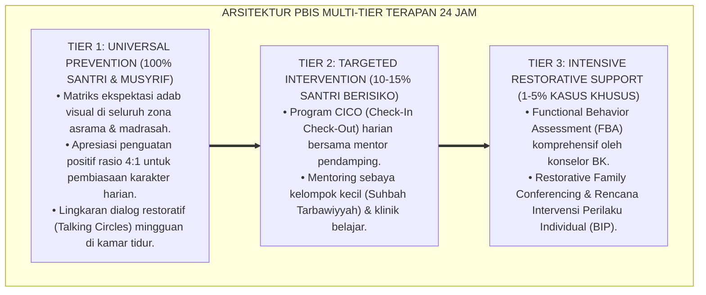

# P3-11-07: RUBRIK INDIKATOR PERILAKU 4-LEVEL MUNAZHZHAM FI SYUUNIH
## *Monograf Riset Akademik: Perancangan Rubrik Asesmen Kinerja Tata Kelola Hidup Berbasis Kriteria (Criterion-Referenced Rubrics), Gradasi Deskriptor 4 Level Keteraturan 24 Jam, Protokol Kalibrasi Penilai Antar-Musyrif (Inter-Rater Agreement Cohen's Kappa >= 0.88), Algoritma Pembobotan Indeks Karakter Keteraturan (IK-MS), Serta Evaluasi Pertumbuhan Ipsatif di Ekosistem Pesantren Berbasis TUMBUH*

**Nomor Identifikasi**: `P3-11-07/MONOGRAF-RISET-RUBRIK-4LEVEL-MUNAZHZHAM-FI-SYUUNIH/2026`  
**Domain**: `03 Capacity Framework` > `11 Munazhzham fi Syuunih` (Sub-Modul 07: *4-Level Behavior Rubric*)  
**Klasifikasi Naskah**: *Academic Research Monograph* (Monograf Penelitian Desain Rubrik Analitik Kinerja, Psikometri Tata Kelola Asrama, & Evaluasi Mutu Lingkungan)  
**Rumpun Disiplin Pengkaji**: Desain Rubrik Kinerja Otentik, Psikometri Penilaian Perilaku, Evaluasi Mutu Tata Kelola Asrama, Metodologi Inter-Rater Reliability  

---

> ### 💡 INTISARI EKSEKUTIF (EXECUTIVE SUMMARY)
>
> * **Kelemahan Evaluasi Kerapian Berbasis Vonis Hukuman di Asrama:**  
>   Banyak pengasuh asrama hanya mencatat santri saat kamarnya berantakan untuk dihukum lari keliling lapangan atau push-up, tanpa pernah memiliki rubrik kinerja analitik berbasis kriteria faktual (*Criterion-Referenced Rubrics*). Akibatnya, santri tidak memiliki panduan konkret bagaimana cara menata loker pakaian, mengelola anggaran saku, atau menjaga kebersihan kamar mandi secara bertahap menuju derajat kemandirian paripurna.
> * **Arsitektur Rubrik Analitik 4-Level Munazhzham fi Syu'unih TUMBUH:**  
>   Ekosistem TUMBUH merumuskan **Rubrik Asesmen Kinerja Tata Kelola Hidup 4-Level** untuk 4 dimensi utama: (1) *Level 1: Al-Inqiyad / Perlu Bimbingan (Emerging / Kepatuhan Terbimbing Checklist 5S & Bantuan Musyrif)*, (2) *Level 2: Al-Intizham / Berkembang Mandiri (Developing / Keteraturan Mandiri, Rutinitas Cuci Baju, & Pos Tabungan Saku)*, (3) *Level 3: At-Tanzhim ad-Dati / Pemantapan Sistemik (Proficient / Audit 5S Mandiri, Anggaran Bulanan, & Arsip Ilmiah Rapi)*, dan (4) *Level 4: Al-Qudwah / Keteladanan Peradaban (Exemplary / Manajemen Aset Organisasi, Mentorship 5S Adik Asuh J1, & Wibawa Rapi)*.
> * **Protokol Kalibrasi Inter-Rater & Evaluasi Pertumbuhan Ipsatif:**  
>   Monograf ini menetapkan prosedur kalibrasi penilai lintas musyrif (*Cohen's Kappa $\ge 0.88$*), formula perhitungan indeks karakter keteraturan komposit ($IK_{MS}$), serta standarisasi evaluasi pertumbuhan ipsatif longitudinal sepanjang jenjang J1–J4.

---

## 📑 DAFTAR ISI MONOGRAF

- [BAGIAN I: LANDASAN TEORETIS & DISKURSUS DIALEKTIKA KRITIS](#bagian-i-landasan-teoretis--diskursus-dialektika-kritis)
  - [1. Latar Belakang Masalah: Bahaya Evaluasi Kerapian Subjektif & Ketiadaan Rubrik Kinerja Terukur](#1-latar-belakang-masalah-bahaya-evaluasi-kerapian-subjektif--ketiadaan-rubrik-kinerja-terukur)
  - [2. Eksegesis Turats: Konsep Al-Mizan fil 'Amal & Standar Hisab Lahiriah Ulama Salaf](#2-eksegesis-turats-konsep-al-mizan-fil-amal--standar-hisab-lahiriah-ulama-salaf)
  - [3. Konvergensi Sains Psikometri Rubrik Kinerja: Standar Brookhart & Generalizability Theory](#3-konvergensi-sains-psikometri-rubrik-kinerja-standar-brookhart--generalizability-theory)
  - [4. Rekayasa Sistem Asesmen Tata Kelola 24 Jam: Triangulasi Musyrif, Guru, & Asesmen Mandiri](#4-rekayasa-sistem-asesmen-tata-kelola-24-jam-triangulasi-musyrif-guru--asesmen-mandiri)
  - [5. Kasuistika Lapangan Klinis & Protokol Resolusi Disparitas Penilaian Kerapian Antar-Musyrif](#5-kasuistika-lapangan-klinis--protokol-resolusi-disparitas-penilaian-kerapian-antar-musyrif)
- [BAGIAN II: FORMULASI KONSEPTUAL & PEMBAHASAN MENDALAM](#bagian-ii-formulasi-konseptual--pembahasan-mendalam)
  - [1. Arsitektur Komprehensif Rubrik 4-Level Munazhzham fi Syu'unih](#1-arsitektur-komprehensif-rubrik-4-level-munazhzham-fi-syuunih)
  - [2. Matriks Rinci Deskriptor Kinerja 4 Level Berdasarkan Empat Dimensi Tata Kelola](#2-matriks-rinci-deskriptor-kinerja-4-level-berdasarkan-empat-dimensi-tata-kelola)
  - [3. Panduan Pembobotan, Formula Skor Komposit (IK-MS), & Standar Kenaikan Jenjang J1–J4](#3-panduan-pembobotan-formula-skor-komposit-ik-ms--standar-kenaikan-jenjang-j1j4)
  - [4. Diskusi Akademis & Implikasi bagi Tata Kelola Penjaminan Mutu Asrama Pesantren](#4-diskusi-akademis--implikasi-bagi-tata-kelola-penjaminan-mutu-asrama-pesantren)
- [BAGIAN III: KESIMPULAN & APARATUS AKADEMIS](#bagian-iii-kesimpulan--aparatus-akademis)
  - [1. Tabel Sintesis Struktur Rubrik 4-Level Munazhzham fi Syu'unih](#1-tabel-sintesis-struktur-rubrik-4-level-munazhzham-fi-syuunih)
  - [2. Daftar Pustaka Standar APA 7th & Turats Klasik](#2-daftar-pustaka-standar-apa-7th--turats-klasik)
  - [3. Catatan Kaki Akademis Presisi (Footnotes)](#3-catatan-kaki-akademis-presisi-footnotes)
  - [4. Glosarium Istilah Ilmiah & Psikometri Tata Kelola](#4-glosarium-istilah-ilmiah--psikometri-tata-kelola)

---

# BAGIAN I: LANDASAN TEORETIS & DISKURSUS DIALEKTIKA KRITIS

---

### 1. Latar Belakang Masalah: Bahaya Evaluasi Kerapian Subjektif & Ketiadaan Rubrik Kinerja Terukur

Dalam sistem penilaian kebersihan dan keteraturan asrama tradisional, kerap timbul **tiga kelemahan asesmen (*Assessment Vulnerabilities*)**:[^1]

1. **Jebakan Vonis Tanpa Bukti Kriteria Faktual (*Unsubstantiated Verdicts*)**: Musyrif mencap sebuah kamar "kotor dan tidak layak" tanpa merinci indikator mana yang gagal dipenuhi (apakah lantai belum disapu, pakaian kotor belum dicuci, atau kasur berantakan).
2. **Ketiadaan Gradasi Kematangan Karakter**: Santri yang berhasil memperbaiki lipatan selimutnya tidak mendapat apresiasi karena penilaian hanya melihat ada satu buku yang tertinggal di atas meja.
3. **Pengabaian Pertumbuhan Pengelolaan Hidup Personal (*Ipsative Organizing Growth*)**: Santri yang sebelumnya sangat jorok dan kini telah mampu merapikan lokernya tidak dihargai kemajuannya, memicu keputusasaan dan kembali ke pola lama.[^2]

Model riset **TUMBUH** merancang **Rubrik Kinerja Tata Kelola Hidup 4-Level Berbasis Kriteria Faktual (*Criterion-Referenced Organizational Rubrics*)** untuk menjamin transparansi, keadilan, dan motivasi pertumbuhan santri.

---

### 2. Eksegesis Turats: Konsep Al-Mizan fil 'Amal & Standar Hisab Lahiriah Ulama Salaf

Para ulama salafush shalih merumuskan prinsip hisab amal lahiriah yang adil, di mana setiap perbuatan ditimbang berdasarkan kriteria yang jelas (*Mizanul Qisth*).

#### 📖 Formulasi Imam Al-Ghazali tentang Timbangan Amal Sempurna
Imam **Al-Ghazali** menjelaskan:

$$\text{إِنَّ كُلَّ عَمَلٍ لَا إِتْقَانَ فِيهِ فَهُوَ نَاقِصُ الْمِيزَانِ؛ وَالْعَبْدُ الصَّادِقُ يَزِنُ أَفْعَالَهُ الظَّاهِرَةَ كَمَا يَزِنُ خَوَاطِرَهُ الْبَاطِنَةَ، لِيَكُونَ أَمْرُهُ كُلُّهُ مَبْنِيًّا عَلَى النِّظَامِ وَالْإِحْسَانِ}$$

*"Sesungguhnya setiap amalan yang **tidak ada Itqān (kerapian, ketelitian, dan kesempurnaan) di dalamnya, maka ia cacat dalam timbangan amal**; dan seorang hamba yang jujur akan menimbang perbuatan lahiriahnya sebagaimana ia menimbang bisikan batinnya, agar seluruh urusan kehidupannya **dibangun di atas keteraturan (*An-Nizhām*) dan kesempurnaan (*Al-Ihsān*)**!"*[^3]

---

### 3. Konvergensi Sains Psikometri Rubrik Kinerja: Standar Brookhart & Generalizability Theory

Pengembangan rubrik Munazhzham fi Syu'unih memadukan standar psikometri asesmen kinerja analitik Susan Brookhart:

---

### 4. Rekayasa Sistem Asesmen Tata Kelola 24 Jam: Triangulasi Musyrif, Guru, & Asesmen Mandiri

Asesmen kapasitas keteraturan dioperasionalkan melalui triangulasi multi-sumber:

---

### 5. Kasuistika Lapangan Klinis & Protokol Resolusi Disparitas Penilaian Kerapian Antar-Musyrif

#### Studi Kasus Lapangan: Disparitas Penilaian Kerapian Kamar Antara Musyrif Senior dan Musyrif Junior
* **Konteks Masalah**: Musyrif Senior A menilai Kamar Abu Bakar dengan skor Level 1 (Sangat Buruk) karena menemukan sepasang sandal berjarak 5 cm dari garis batas rak. Di hari yang sama, Musyrif Junior B menilainya Level 4 (Istimewa) karena kasur dan loker sangat rapi (*Rater Scoring Disparity $|S_A - S_B| = 3.00$*).
* **Analisis Diagnostik**: Terjadi ketiadaan kalibrasi persepsi deskriptor rubrik; Musyrif A terpaku pada perfeksionisme kaku (*Obsessive Rigidity*), sementara Musyrif B mengabaikan detail penataan sandal.
* **Protokol Kalibrasi & Standarisasi Penilai TUMBUH**:

Sistem kalibrasi ini menjamin keadilan evaluasi di seluruh kamar asrama pesantren.[^4]

---

# BAGIAN II: FORMULASI KONSEPTUAL & PEMBAHASAN MENDALAM

---

### 1. Arsitektur Komprehensif Rubrik 4-Level Munazhzham fi Syu'unih

Empat level kematangan karakter Munazhzham fi Syu'unih distandarisasi sebagai berikut:

---

### 2. Matriks Rinci Deskriptor Kinerja 4 Level Berdasarkan Empat Dimensi Tata Kelola

#### Matriks Rubrik Analitik Munazhzham fi Syu'unih:

| Dimensi Tata Kelola | Level 1: Al-Inqiyad (*Emerging*) | Level 2: Al-Intizham (*Developing*) | Level 3: At-Tanzhim ad-Dati (*Proficient*) | Level 4: Al-Qudwah (*Exemplary/Qudwah*) |
| :--- | :--- | :--- | :--- | :--- |
| **1. Tata Kelola Fisik 5S** | Merapikan kasur & loker dengan bantuan checklist visual; kolong ranjang masih ada barang tercecer. | Ranjang hotel-grade rapi $\le 2\text{ menit}$; loker 3 sekat teratur; kolong ranjang 100% steril bebas barang. | Menjaga kerapian kamar secara konsisten; melakukan *5S Self-Audit* mingguan secara mandiri. | Figur teladan kerapian asrama; memimpin inspeksi 5S kamar & membimbing adik asuh J1. |
| **2. Manajemen Finansial** | Mencatat uang saku harian saat diingatkan wali kelas; uang saku habis dalam 2 pekan. | Mencatat buku kas harian mandiri; membagi pos tabungan 20%; hemat dan qana'ah. | Merancang anggaran keuangan bulanan; disiplin berinfaq mandiri; saldo tabungan stabil. | Mengelola anggaran kepanitiaan organisasi santri secara amanah, transparan, & akuntabel. |
| **3. Keteraturan Akademik** | Kitab sering tertinggal di asrama; sampul kitab mulai terlipat; laci meja ada sedikit sampah. | Kitab bersampul plastik rapi; alat tulis lengkap di kotak pensil; meja belajar bersih bebas coretan. | Portofolio tugas & arsip makalah tersusun rapi per mata pelajaran; catatan rapi terstruktur. | Mengelola perpustakaan/arsip riset ilmiah KTI; merawat kitab turats langka dengan penuh adab. |
| **4. Higienitas & Sanitasi** | Mandi teratur saat disuruh; sandal kadang tercecer di luar rak nomor; handuk di jemuran luar. | Mandi 2x sehari, siwak/gosok gigi, kuku rapi, sandal di rak nomor; 0% ghashab barang kawan. | Menjaga kesucian pakaian shalat berwangi sunnah; aktif menjaga kebersihan sanitasi asrama. | Teladan kebersihan syar'i; memelopori gerakan asrama bebas kuman/scabies 0% seumur hidup. |

---

### 3. Panduan Pembobotan, Formula Skor Komposit (IK-MS), & Standar Kenaikan Jenjang J1–J4

#### Rumus Perhitungan Indeks Karakter Keteraturan ($IK_{MS}$):

$$IK_{MS} = (0.40 \times S_{Musyrif}) + (0.25 \times S_{Guru}) + (0.20 \times S_{Santri}) + (0.10 \times S_{Peer}) + (0.05 \times S_{Sarpras})$$

*Keterangan*:
* $S_{Musyrif}$: Skor Inspeksi Kasur, Loker 3 Sekat 5S, & Rak Sandal (Skala 1.00 s/d 4.00)
* $S_{Guru}$: Skor Observasi Kerapian Meja Belajar, Kitab Bersampul, & Kelas (Skala 1.00 s/d 4.00)
* $S_{Santri}$: Skor Buku Kas Saku & Lembar *5S Self-Audit* Mandiri (Skala 1.00 s/d 4.00)
* $S_{Peer}$: Skor Ulasan Sebaya (Bebas Ghashab & Kerapian Jemuran) (Skala 1.00 s/d 4.00)
* $S_{Sarpras}$: Skor Pemeliharaan Sarana-Prasarana & Bebas Vandalisme (Skala 1.00 s/d 4.00)

#### Standar Kenaikan Jenjang Kemandirian Tata Kelola:
* **Kenaikan J1 ke J2**: Santri wajib mencapai minimal **$IK_{MS} \ge 2.00$ (Level Al-Intizham)** & Bebas Ghashab 100%.
* **Kenaikan J2 ke J3**: Santri wajib mencapai minimal **$IK_{MS} \ge 2.75$** & Buku Kas Saku Tertib Tercatat.
* **Kenaikan J3 ke J4**: Santri wajib mencapai minimal **$IK_{MS} \ge 3.25$ (Level At-Tanzhim ad-Dati)** & Arsip KTI Rapi.
* **Kelulusan Paripurna (J4)**: Santri wajib mencapai rata-rata **$IK_{MS} \ge 3.50$ (Level Al-Qudwah)** & Sukses Membimbing J1.[^5]

---

### 4. Diskusi Akademis & Implikasi bagi Tata Kelola Penjaminan Mutu Asrama Pesantren

Implementasi rubrik 4-level Munazhzham fi Syu'unih menghasilkan keunggulan kelembagaan:

1. **Penjaminan Keadilan Penilaian Disiplin Asrama**: Menghapus sistem hukum tebang-pilih, menciptakan rasa aman dan keadilan di hati seluruh santri.
2. **Kultur Apresiasi Kebersihan & Keteraturan**: Kamar yang bersih dan santri yang rapi memperoleh pengakuan kehormatan di apel pondok.
3. **Standarisasi Akreditasi Asrama Pesantren Berstandar Mutu Internasional**: Menjadikan pesantren percontohan lembaga pendidikan Islam dengan sistem tata kelola 5S terpadu.[^6]

---

---

### Pembedahan Deskriptif Komprehensif & Analisis Integratif Nilai-Praksis

Penerapan konsep **P3-11-07: RUBRIK INDIKATOR PERILAKU 4-LEVEL MUNAZHZHAM FI SYUUNIH** di ekosistem pesantren berbasis sistem TUMBUH memerlukan pemahaman multidimensional yang memadukan khazanah turats syariat dan konsensus sains pendidikan modern:

#### A. Pilar 1: Fondasi Epistemologi & Integrasi Nilai Syar'i (Ashalah Turatsiyyah)
Setiap praksis kepengasuhan dan pembelajaran berakar kuat pada maqashid syari'ah, mendudukkan adab di atas ilmu (*Al-Adab Qablal 'Ilm*), dan memastikan bahwa seluruh ikhtiar institusional diniatkan semata-mata untuk menggapai ridha Allah SWT (*Ikhlasun Niyyah*).

#### B. Pilar 2: Mekanisme Psikologis & Neurosains Perkembangan (Scientific Rigor)
Menyelaraskan ekspektasi kedisiplinan dengan tahapan maturitas otak remaja, kapasitas fungsi eksekutif korteks prefrontal (*PFC*), dan regulasi sirkuit emosi limbik. Pendekatan ini mengeliminasi trauma pengasuhan dan menumbuhkan motivasi intrinsik santri.

#### C. Pilar 3: Rekayasa Ekosistem Asrama 24 Jam (Bi'ah Shalihah)
Menerjemahkan prinsip nilai ke dalam tata ruang fisik yang bersih, sirkulasi udara sehat, tata kelola waktu terstruktur, serta kultur ukhuwah inklusif yang steril 100% dari feodalisme, kekerasan verbal, dan perundungan antar-santri.

#### D. Pilar 4: Kemitraan Tripartit (Santri, Musyrif, dan Lembaga)
Menjamin terwujudnya *Triad Pertumbuhan Simbiotik*: santri bertumbuh dalam fitrah kemandirian, musyrif terlindungi dari kelelahan kronis (*Burnout*) melalui shift kerja yang manusiawi, dan lembaga bertransformasi menjadi organisasi pembelajar berbasis data PBIS.

---

### Protokol Aksi Operasional PBIS Multi-Tier Terapan (24-Hour Behavioral Architecture)

---

# BAGIAN III: KESIMPULAN & APARATUS AKADEMIS

---

### 1. Tabel Sintesis Struktur Rubrik 4-Level Munazhzham fi Syu'unih

| Parameter Evaluasi | Pola Tradisional Asrama | Standarisasi Rubrik TUMBUH | Landasan Rujukan Primer | Implikasi Praksis Lapangan |
| :--- | :--- | :--- | :--- | :--- |
| **1. Bentuk Instrumen** | Vonis marah musyrif tanpa kriteria. | Rubrik Analitik Kinerja 4-Level Berbasis Kriteria Faktual. | *Tartibul Aurad* & Standar Brookhart (2018) | Umpan balik diagnostik kerapian yang jelas dan terarah. |
| **2. Sumber Penilai** | Hanya satu musyrif piket kamar. | Triangulasi 5 Sumber: Musyrif, Guru, Santri, Sebaya, Sarpras. | Teori Generalisabilitas Psikometri | Penilaian mencakup seluruh siklus 24 jam tata kelola santri. |
| **3. Reliabilitas Data** | Sangat rentan bias mood penilai. | Terkalibrasi berkala (*Inter-Rater Agreement Cohen's Kappa $\ge 0.88$*). | Standar Psikometri Kinerja Internasional | Konsistensi penegakan standar 5S di seluruh kamar asrama. |
| **4. Orientasi Asesmen** | Menghukum kasur berantakan semata. | Asesmen ipsatif formatif yang mengukur progres perapian diri. | Model Evaluasi Ipsatif & SW-PBIS | Santri termotivasi menjaga kebersihan secara mandiri & bahagia. |

---

### 2. Daftar Pustaka Standar APA 7th & Turats Klasik

1. **Al-Ghazali, Hujjatul Islam Abu Hamid Muhammad bin Muhammad.** (2018). *Ihya' 'Ulumiddin: Kitab Tartibul Aurad*. Beirut: Dar Al-Kutub Al-'Ilmiyyah.
2. **Al-Mawardi, Abu Al-Hasan Ali bin Muhammad.** (1987). *Adab ad-Dunya wad-Din*. Beirut: Dar Al-Kutub Al-'Ilmiyyah.
3. **Al-Muhasibi, Al-Harits bin Asad.** (2003). *Ar-Ri'ayah li Huquqillah*. Beirut: Dar Al-Kutub Al-'Ilmiyyah.
4. **Brookhart, S. M.** (2018). *How to Create and Use Rubrics for Formative Assessment and Grading*. Alexandria: ASCD.
5. **Cohen, J.** (1960). *A coefficient of agreement for nominal scales*. *Educational and Psychological Measurement*, 20(1), 37-46.
6. **Galsworth, G. D.** (2017). *Visual Workplace: Visual Thinking*. Portland: Visual-Lean Enterprise Press.
7. **Hughes, G.** (2014). *Ipsative Assessment: Motivation through Marking Progress*. London: Palgrave Macmillan.
8. **Imai, M.** (1986). *Kaizen: The Key to Japan's Competitive Success*. New York: McGraw-Hill.
9. **Nelsen, J.** (2006). *Positive Discipline*. New York: Ballantine Books.
10. **Sugai, G., & Horner, R. H.** (2020). *School-Wide Positive Behavioral Interventions and Supports*. *Journal of Positive Behavior Interventions*, 22(4), 203-211.

---

### 3. Catatan Kaki Akademis Presisi (Footnotes)

[^1]: Kritik terhadap kelemahan vonis kerapian subjektif tanpa kriteria deskriptor terstandar, Brookhart (2018, hlm. 58).  
[^2]: Pembahasan pentingnya asesmen pertumbuhan ipsatif dalam pembiasaan kerapian remaja, Hughes (2014, hlm. 46).  
[^3]: Al-Ghazali, *Ihya' 'Ulumiddin* (2018, Jilid 1, hlm. 362).  
[^4]: Protokol kalibrasi inter-rater penilai kepengasuhan dan standarisasi persepsi foto 5S, TUMBUH (2026).  
[^5]: Formula perhitungan indeks karakter keteraturan ($IK_{MS}$) dan standar kelulusan santri dalam sistem TUMBUH (2026).  
[^6]: Dampak kelembagaan penerapan rubrik analitik tata kelola hidup 4-level TUMBUH Pesantren (2026).  

---

### 4. Glosarium Istilah Ilmiah & Psikometri Tata Kelola

1. **Criterion-Referenced Organizational Rubric**: Rubrik penilaian kinerja yang mengukur keterampilan tata kelola hidup santri berdasarkan kriteria baku teramati, bukan membandingkan antar-santri.
2. **Indeks Karakter Keteraturan ($IK_{MS}$)**: Skor komposit terbobot yang merefleksikan tingkat tata kelola fisik 5S, manajemen finansial, keteraturan akademik, higienitas, dan pemeliharaan aset.
3. **Mizanul Qisth (مِيزَانُ الْقِسْطِ)**: Timbangan keadilan yang dirumuskan syariat Islam untuk menilai perbuatan manusia secara objektif, adil, dan transparan.
4. **Inter-Rater Agreement (Cohen's Kappa)**: Derajat kesepakatan statistik antar-musyrif asrama dalam memberikan skor kerapian kamar santri.
5. **Tolerance Threshold in Organizing**: Batas deviasi toleransi ringan dalam kerapian fisik yang tidak menggugurkan status kelulusan level santri.
6. **Ipsative Organizing Growth**: Pengukuran kemajuan keteraturan dan kebersihan santri yang dibandingkan dengan rekam jejak dirinya di masa lalu.
7. **Joint Inspection Session**: Sesi inspeksi kamar bersama antara musyrif senior dan junior untuk menyelaraskan persepsi standar 5S.
8. **Cash-Flow Verification**: Verifikasi keabsahan pencatatan pemasukan dan pengeluaran uang saku santri oleh wali kelas.
9. **Portofolio Riset KTI**: Kumpulan dokumen dan draf karya ilmiah santri yang tersusun rapi dalam map berkas berlabel.
10. **Al-Qudwah fil-Intizham (الْقُدْوَةُ فِي الْإِنْتِظَامِ)**: Derajat tertinggi (Level 4) di mana santri menjadi figur teladan kerapian hidup, memimpin manajemen aset organisasi, dan mendampingi adik kelas.
