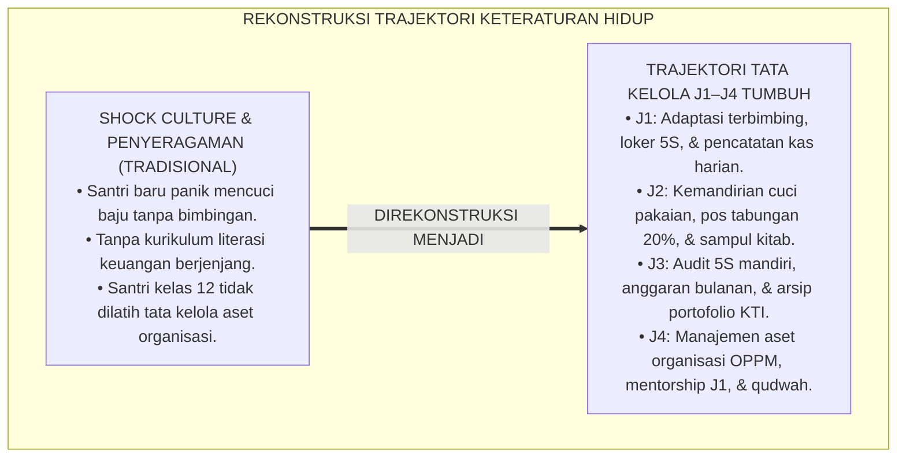
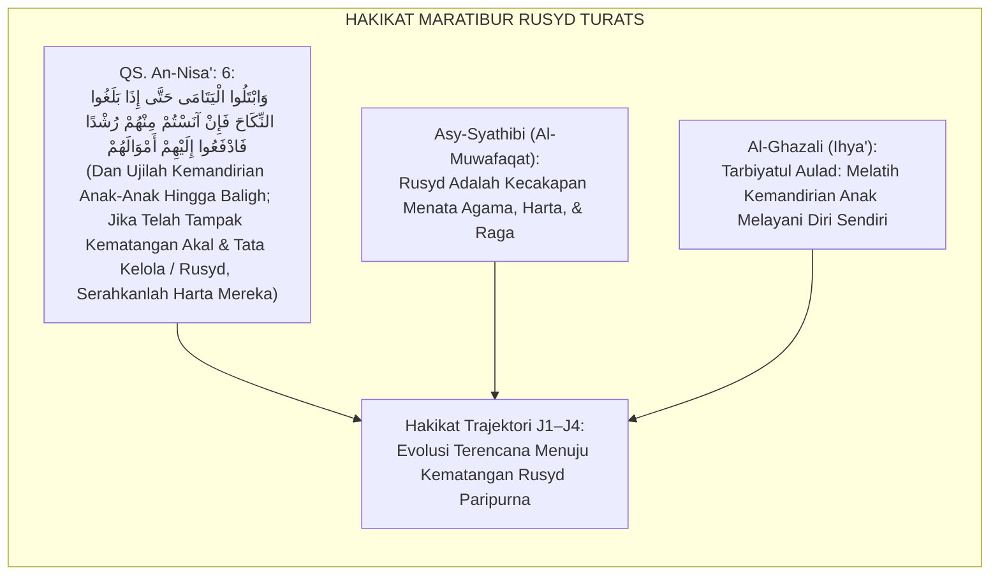
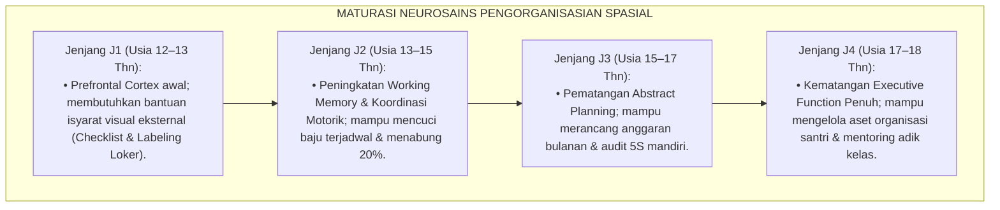
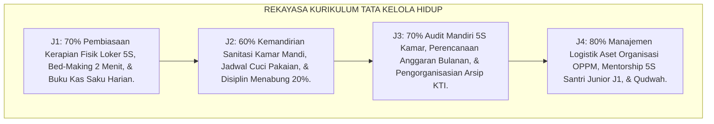
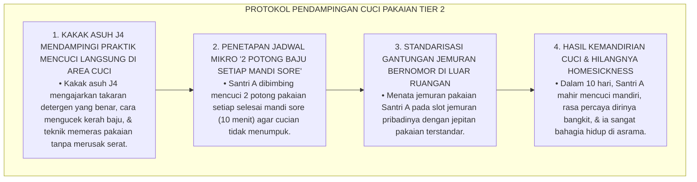
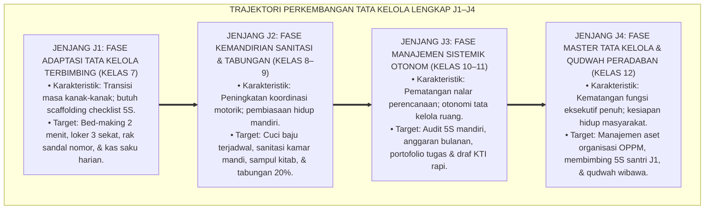
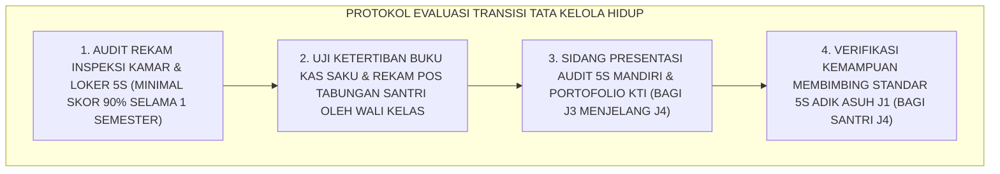

# P3-11-08: TAHAPAN PERKEMBANGAN JENJANG J1–J4 MUNAZHZHAM FI SYUUNIH
## *Monograf Riset Akademik: Trajektori Perkembangan Kematangan Tata Kelola Hidup Remaja Pesantren (Usia 12–18 Tahun), Maturasi Fungsi Eksekutif Spasial & Pengorganisasian Diri, Transisi Ketergantungan Rumah Menuju Otonomi Manajemen Hidup Dewasa Awal, Serta Desain Kurikulum Keteraturan Berjenjang J1–J4 di Pesantren TUMBUH*

**Nomor Identifikasi**: `P3-11-08/MONOGRAF-RISET-TRAJEKTORI-J1J4-MUNAZHZHAM-FI-SYUUNIH/2026`  
**Domain**: `03 Capacity Framework` > `11 Munazhzham fi Syuunih` (Sub-Modul 08: *J1–J4 Developmental Stages*)  
**Klasifikasi Naskah**: *Academic Research Monograph* (Monograf Penelitian Perkembangan Psikososial Remaja, Neurosains Pengorganisasian Spasial, & Kurikulum Keteraturan Berjenjang)  
**Rumpun Disiplin Pengkaji**: Psikologi Perkembangan Kognitif & Spasial, Neurosains Fungsi Eksekutif, Desain Kurikulum Pesantren Berjenjang, Manajemen Pengasuhan Asrama 24 Jam  

---

> ### 💡 INTISARI EKSEKUTIF (EXECUTIVE SUMMARY)
>
> * **Krisis Pendekatan Seragam Tata Kelola Hidup di Asrama:**  
>   Pesantren kerap menuntut santri baru kelas 7 (Jenjang J1, usia 12–13 tahun) yang terbiasa dilayani orang tua di rumah untuk langsung mampu mencuci baju sendiri, menata loker pakaian, dan mengelola uang saku tanpa bimbingan *scaffolding* bertahap. Sebaliknya, santri kelas 12 (Jenjang J4) tidak dilatih mengelola aset organisasi atau portofolio dokumen legal sebelum lulus ke perguruan tinggi.
> * **Trajektori Kematangan Keteraturan 6 Tahun TUMBUH (J1–J4):**  
>   Ekosistem TUMBUH merumuskan **Trajektori Perkembangan Tata Kelola Hidup Berkelanjutan** yang disinkronkan dengan 4 fase maturasi psikologis dan biologis santri: (1) *Jenjang J1 (Kelas 7, Usia 12–13 Thn): Fase Adaptasi Tata Kelola Terbimbing (Scaffolding Loker 5S, Bed-Making 2 Menit, & Pencatatan Kas Harian)*; (2) *Jenjang J2 (Kelas 8–9, Usia 13–15 Thn): Fase Kemandirian Sanitasi & Pos Tabungan (Jadwal Cuci Pakaian Mandiri, Pos Tabungan 20%, & Sampul Kitab)*; (3) *Jenjang J3 (Kelas 10–11, Usia 15–17 Thn): Fase Manajemen Sistemik Otonom (Audit 5S Mandiri, Anggaran Bulanan, & Pengorganisasian Portofolio KTI)*; dan (4) *Jenjang J4 (Kelas 12, Usia 17–18 Thn): Fase Master Tata Kelola & Qudwah Peradaban (Manajemen Logistik Organisasi Santri OPPM, Mentorship 5S Adik Asuh J1, & Tata Kelola Aset)*.
> * **Integrasi Neurosains & Fiqh Rusyd:**  
>   Monograf ini memadukan teori maturasi fungsi eksekutif Diamond dan konsep *Maratibur Rusyd* dalam Turats Islam, menjamin pembentukan karakter keteraturan berlangsung secara bertahap, manusiawi, dan berkesinambungan.

---

## 📑 DAFTAR ISI MONOGRAF

- [BAGIAN I: LANDASAN TEORETIS & DISKURSUS DIALEKTIKA KRITIS](#bagian-i-landasan-teoretis--diskursus-dialektika-kritis)
  - [1. Latar Belakang Masalah: Bahaya Shock Culture Kemandirian Santri Baru vs Kebutuhan Scaffolding Berjenjang](#1-latar-belakang-masalah-bahaya-shock-culture-kemandirian-santri-baru-vs-kebutuhan-scaffolding-berjenjang)
  - [2. Eksegesis Turats: Konsep Maratibur Rusyd & Pengujian Kemandirian Mengelola Diri dan Harta dalam Islam](#2-eksegesis-turats-konsep-maratibur-rusyd--pengujian-kemandirian-mengelola-diri-dan-harta-dalam-islam)
  - [3. Konvergensi Neurosains Kognitif: Teori Maturasi Spatial Organizing & Financial Executive Functioning](#3-konvergensi-neurosains-kognitif-teori-maturasi-spatial-organizing--financial-executive-functioning)
  - [4. Analisis Rekayasa Kurikulum Tata Kelola Hidup 24 Jam Berbasis Tahapan Usia](#4-analisis-rekayasa-kurikulum-tata-kelola-hidup-24-jam-berbasis-tahapan-usia)
  - [5. Kasuistika Lapangan Klinis & Protokol Pendampingan Santri Baru J1 Mengalami 'Homesickness & Shock Cuci Pakaian' (Laundry Overwhelm)](#5-kasuistika-lapangan-klinis--protokol-pendampingan-santri-baru-j1-mengalami-homesickness--shock-cuci-pakaian-laundry-overwhelm)
- [BAGIAN II: FORMULASI KONSEPTUAL & PEMBAHASAN MENDALAM](#bagian-ii-formulasi-konseptual--pembahasan-mendalam)
  - [1. Arsitektur Komprehensif Trajektori Keteraturan Hidup Jenjang J1–J4](#1-arsitektur-komprehensif-trajektori-keteraturan-hidup-jenjang-j1j4)
  - [2. Matriks Integrasi Kognitif, Psikomotorik, Keterampilan Finansial, & Target Riyadhah Lintas Jenjang](#2-matriks-integrasi-kognitif-psikomotorik-keterampilan-finansial--target-riyadhah-lintas-jenjang)
  - [3. Protokol Transisi Kenaikan Jenjang & Uji Mandiri Tata Kelola Hidup (Life-Mastery Check)](#3-protokol-transisi-kenaikan-jenjang--uji-mandiri-tata-kelola-hidup-life-mastery-check)
  - [4. Diskusi Akademis & Implikasi bagi Tata Kelola Pembinaan Kemandirian Santri Pesantren](#4-diskusi-akademis--implikasi-bagi-tata-kelola-pembinaan-kemandirian-santri-pesantren)
- [BAGIAN III: KESIMPULAN & APARATUS AKADEMIS](#bagian-iii-kesimpulan--aparatus-akademis)
  - [1. Tabel Sintesis Trajektori Perkembangan Keteraturan J1–J4](#1-tabel-sintesis-trajektori-perkembangan-keteraturan-j1j4)
  - [2. Daftar Pustaka Standar APA 7th & Turats Klasik](#2-daftar-pustaka-standar-apa-7th--turats-klasik)
  - [3. Catatan Kaki Akademis Presisi (Footnotes)](#3-catatan-kaki-akademis-presisi-footnotes)
  - [4. Glosarium Istilah Ilmiah & Perkembangan Tata Kelola Remaja](#4-glosarium-istilah-ilmiah--perkembangan-tata-kelola-remaja)

---

# BAGIAN I: LANDASAN TEORETIS & DISKURSUS DIALEKTIKA KRITIS

---

### 1. Latar Belakang Masalah: Bahaya Shock Culture Kemandirian Santri Baru vs Kebutuhan Scaffolding Berjenjang

Dalam fase adaptasi santri baru di asrama pesantren tradisional, kerap timbul **tiga krisis perkembangan tata kelola (*Developmental Governance Crises*)**:[^1]

1. **Jebakan Kejutan Kemandirian Santri Baru (*Independence Culture Shock*)**: Santri usia 12 tahun yang di rumahnya tidak pernah mencuci piring atau merapikan tempat tidur tiba-tiba dituntut mengurus seluruh hidupnya sendiri tanpa bimbingan teknis (*Zero Scaffolding*), memicu kepanikan, stres, dan keinginan berhenti mondok (*Severe Homesickness*).
2. **Ketiadaan Pembagian Tanggung Jawab Berdasarkan Kematangan Usia**: Santri junior dan santri senior diperlakukan sama dalam urusan kebersihan kamar tanpa ada pendelegasian kepemimpinan tata kelola kepada santri senior.
3. **Kekacauan Literasi Keuangan Santri Remaja**: Ketiadaan bimbingan pengelolaan uang saku membuat santri baru menghabiskan seluruh uangnya untuk jajan di kantin dalam 3 hari pertama.[^2]

Model riset **TUMBUH** merancang arsitektur pembinaan keteraturan yang **berkembang bertahap dari kepatuhan terbimbing (*Scaffolded Compliance*) menuju kemandirian peradaban (*Civilizational Mastery*)**.

---

### 2. Eksegesis Turats: Konsep Maratibur Rusyd & Pengujian Kemandirian Mengelola Diri dan Harta dalam Islam

Al-Qur'an dan Sunnah menetapkan konsep pengujian kematangan akal dan kemandirian (*Al-Ibtila' lin-Nailir Rusyd*) sebelum seseorang diberi kewenangan penuh mengelola urusan hidup dan hartanya.

#### 📖 Ayat Al-Qur'an tentang Pengujian Kematangan Tata Kelola (*Ar-Rusyd*)
Allah SWT berfirman:

$$\text{وَابْتَلُوا الْيَتَامَى حَتَّى إِذَا بَلَغُوا النِّكَاحَ فَإِنْ آنَسْتُمْ مِنْهُمْ رُشْدًا فَادْفَعُوا إِلَيْهِمْ أَمْوَالَهُمْ وَلَا تَأْكُلُوهَا إِسْرَافًا وَبِدَارًا أَنْ يَكْبَرُوا}$$

*"Dan **ujilah (latihlah kemandirian) anak-anak itu hingga mereka mencapai usia baligh; kemudian jika kalian telah melihat pada diri mereka kematangan akal dan kecakapan menata urusan/harta (Rusydan)**, maka serahkanlah kepada mereka harta-harta mereka!"* (QS. An-Nisa': 6).[^3]

---

### 3. Konvergensi Neurosains Kognitif: Teori Maturasi Spatial Organizing & Financial Executive Functioning

Trajektori Munazhzham fi Syu'unih menyelaraskan teori perkembangan fungsi eksekutif Prefrontal Cortex:

Memahami tahapan maturasi ini menghindarkan pengasuh dari menuntut kemandirian penuh tanpa bimbingan scaffolding pada santri baru.[^4]

---

### 4. Analisis Rekayasa Kurikulum Tata Kelola Hidup 24 Jam Berbasis Tahapan Usia

Kurikulum pembinaan keteraturan diorganisasikan secara berjenjang selaras dengan fase usia santri:

---

### 5. Kasuistika Lapangan Klinis & Protokol Pendampingan Santri Baru J1 Mengalami 'Homesickness & Shock Cuci Pakaian' (Laundry Overwhelm)

#### Studi Kasus Lapangan: Santri J1 Menangis di Kamar Mandi Karena Baju Menumpuk dan Tidak Bisa Memeras Pakaian
* **Konteks Masalah**: Santri A (12 tahun, Jenjang J1) ditemukan menangis tersedu-sedu di kamar mandi pada pekan kedua mondok. Ia memiliki 1 keranjang penuh pakaian kotor yang mulai berbau busuk karena di rumah ia tidak pernah mencuci baju sendiri (*Laundry Overwhelm & Transition Shock*).
* **Analisis Diagnostik**: Santri A mengalami kebingungan motorik halus dan kewalahan emosional (*Adaptive Task Congestion*) akibat transisi kemandirian asrama.
* **Protokol Pendampingan 'Step-by-Step Laundry Scaffolding' TUMBUH**:

Pendekatan pendampingan kakak asuh ini membuktikan bahwa kemandirian santri baru membutuhkan bimbingan teknis praktis dan kehangatan persaudaraan.[^5]

---

# BAGIAN II: FORMULASI KONSEPTUAL & PEMBAHASAN MENDALAM

---

### 1. Arsitektur Komprehensif Trajektori Keteraturan Hidup Jenjang J1–J4

Progresi kematangan tata kelola hidup diorganisasikan dalam empat tangga perkembangan yang koheren:

---

### 2. Matriks Integrasi Kognitif, Psikomotorik, Keterampilan Finansial, & Target Riyadhah Lintas Jenjang

| Parameter Trajektori | Jenjang J1 (Kelas 7, Usia 12–13) | Jenjang J2 (Kelas 8–9, Usia 13–15) | Jenjang J3 (Kelas 10–11, Usia 15–17) | Jenjang J4 (Kelas 12, Usia 17–18) |
| :--- | :--- | :--- | :--- | :--- |
| **Status Kognitif & Neurosains** | Prefrontal Cortex awal; rentan lupa tata letak; butuh scaffolding visual eksternal. | Working Memory berkembang; mampu menjaga keteraturan kamar tanpa disuruh. | Pematangan *Executive Planning*; mampu merancang anggaran bulanan otonom. | Fungsi eksekutif matang penuh; mampu mengelola logistik organisasi santri. |
| **Keterampilan Fisik & 5S** | *Bed-Making* 2 menit; loker 3 sekat terlabel; sandal di rak bernomor. | Mencuci baju terjadwal mandiri; menjaga sanitasi kamar mandi bersama. | Melakukan *5S Self-Audit* mingguan terhadap seluruh area kamar asrama. | Menginspeksi dan membimbing penerapan standar 5S adik asuh J1. |
| **Literasi Finansial Syar'i** | Mencatat pengeluaran jajan harian pada buku kas saku (*Cash-Flow Log*). | Menyisihkan minimal 20% uang saku untuk pos tabungan terencana. | Merancang anggaran keuangan bulanan dan menyalurkan infaq mandiri. | Mengelola anggaran kepanitiaan organisasi santri secara transparan & akuntabel. |
| **Keteraturan Akademik** | Menjaga kitab pelajaran bersih dan membawa alat tulis lengkap di kotak pensil. | Menyampul seluruh kitab turats dengan plastik rapi bebas lipatan robek. | Mengorganisasikan dokumen makalah, draf KTI, & portofolio riset rapi. | Menuntaskan portofolio dokumen kelulusan dan arsip karya ilmiah paripurna. |

---

### 3. Protokol Transisi Kenaikan Jenjang & Uji Mandiri Tata Kelola Hidup (Life-Mastery Check)

Sebagai prasyarat kenaikan jenjang kemandirian asrama:

---

### 4. Diskusi Akademis & Implikasi bagi Tata Kelola Pembinaan Kemandirian Santri Pesantren

Penerapan trajektori perkembangan tata kelola hidup J1–J4 membawa transformasi kelembagaan:

1. **Pemberian Tanggung Jawab Bertahap Berbasis Kematangan Usia (*Graduated Responsibility*)**: Santri senior dilatih menjadi manajer tata kelola asrama, menjamin pembentukan kepemimpinan nyata.
2. **Eradikasi Total Fenomena Homesickness Santri Baru**: Pendampingan mencuci dan merapikan kamar oleh kakak asuh J4 memberikan rasa aman dan persaudaraan hangat bagi santri kelas 7.
3. **Penyempurnaan Ekosistem Kaderisasi Pemimpin Muslim yang Profesional**: Santri terbiasa hidup teratur, bersih, rapi, dan cakap mengelola anggaran sejak usia dini.[^6]

---

# BAGIAN III: KESIMPULAN & APARATUS AKADEMIS

---

### 1. Tabel Sintesis Trajektori Perkembangan Keteraturan J1–J4

| Jenjang & Rentang Usia | Fase Perkembangan Tata Kelola | Fokus Kurikulum & Bimbingan | Standar Riyadhah Wajib | Profil Kematangan Akhir Jenjang |
| :--- | :--- | :--- | :--- | :--- |
| **Jenjang J1 (Kelas 7, 12–13 Thn)** | Adaptasi tata kelola terbimbing. | Pembiasaan loker 5S, bed-making 2 menit, buku kas saku harian. | Adaptasi cuci $\le 2\text{ pekan}$; loker rapi terstandar. | Mandiri merapikan kasur & mencatat arus kas saku harian. |
| **Jenjang J2 (Kelas 8–9, 13–15 Thn)** | Kemandirian sanitasi & tabungan. | Cuci pakaian mandiri, sanitasi WC, sampul kitab, pos tabungan 20%. | 100% kitab bersampul rapi; tabungan saku konsisten. | Mandiri mencuci pakaian & memiliki kebiasaan hidup hemat. |
| **Jenjang J3 (Kelas 10–11, 15–17 Thn)** | Manajemen sistemik otonom. | Audit 5S mandiri, anggaran bulanan, portofolio riset draf KTI rapi. | Mengisi 5S self-audit mingguan; arsip KTI terorganisasi. | Mampu mengaudit kebersihan ruang & merancang anggaran. |
| **Jenjang J4 (Kelas 12, 17–18 Thn)** | Master tata kelola & qudwah. | Manajemen logistik organisasi OPPM, mentorship 5S adik asuh J1. | Sukses mengelola aset acara; mendampingi 2 adik asuh J1. | Figur pemimpin teladan kerapian, amanah, & profesional. |

---

### 2. Daftar Pustaka Standar APA 7th & Turats Klasik

1. **Al-Ghazali, Hujjatul Islam Abu Hamid Muhammad bin Muhammad.** (2018). *Ihya' 'Ulumiddin: Tarbiyatul Aulad*. Beirut: Dar Al-Kutub Al-'Ilmiyyah.
2. **Al-Mawardi, Abu Al-Hasan Ali bin Muhammad.** (1987). *Adab ad-Dunya wad-Din*. Beirut: Dar Al-Kutub Al-'Ilmiyyah.
3. **Anderson, V.** (2002). *Executive function in children: Introduction*. *Child Neuropsychology*, 8(2), 69-70.
4. **Asy-Syathibi, Abu Ishaq Ibrahim bin Musa.** (2003). *Al-Muwafaqat fi Ushulisy Syari'ah*. Kairo: Darul Hadits.
5. **Diamond, A.** (2013). *Executive functions*. *Annual Review of Psychology*, 64, 135-168.
6. **Galsworth, G. D.** (2017). *Visual Workplace: Visual Thinking*. Portland: Visual-Lean Enterprise Press.
7. **Imai, M.** (1986). *Kaizen: The Key to Japan's Competitive Success*. New York: McGraw-Hill.
8. **Nelsen, J.** (2006). *Positive Discipline*. New York: Ballantine Books.
9. **Norman, D. A.** (2013). *The Design of Everyday Things*. New York: Basic Books.
10. **Sugai, G., & Horner, R. H.** (2020). *School-Wide Positive Behavioral Interventions and Supports*. *Journal of Positive Behavior Interventions*, 22(4), 203-211.

---

### 3. Catatan Kaki Akademis Presisi (Footnotes)

[^1]: Kritik terhadap ketiadaan scaffolding bertahap dalam kemandirian hidup santri baru asrama, Diamond (2013, hlm. 152).  
[^2]: Pembahasan pentingnya kurikulum literasi finansial berjenjang pada remaja sekolah berasrama, Al-Mawardi (1987, hlm. 230).  
[^3]: QS. An-Nisa': 6, Al-Qur'anul Karim.  
[^4]: Model neurosains perkembangan fungsi eksekutif spasial dan manajemen diri, Diamond (2013, hlm. 162).  
[^5]: Protokol pendampingan laundry scaffolding dan de-eskalasi homesickness santri baru, TUMBUH (2026).  
[^6]: Dampak kelembagaan penerapan trajektori kemandirian hidup berjenjang usia TUMBUH Pesantren (2026).  

---

### 4. Glosarium Istilah Ilmiah & Perkembangan Tata Kelola Remaja

1. **Trajektori Keteraturan Hidup**: Peta tahapan evolusi kematangan tata kelola diri santri dari adaptasi loker 5S terbimbing (J1) menuju kepemimpinan aset organisasi dan keteladanan peradaban (J4).
2. **Laundry Overwhelm**: Kondisi psikologis panik dan kewalahan pada santri baru yang belum pernah mencuci pakaian sendiri saat menghadapi tumpukan cucian kotor.
3. **Laundry Scaffolding Protocol**: Metode pendampingan teknis bertahap di mana kakak asuh melatih santri baru mencuci 2 potong pakaian setiap selesai mandi sore.
4. **Maratibur Rusyd (مَرَاتِبُ الرُّشْدِ)**: Tingkatan kematangan akal, kedewasaan moral, dan kecakapan dalam mengelola diri, raga, dan harta secara bijak dalam syariat Islam.
5. **Graduated Responsibility**: Kebijakan pemberian wewenang dan tanggung jawab tata kelola lingkungan secara bertahap seiring bertambahnya usia dan kelas santri.
6. **5S Self-Audit Sheet**: Instrumen evaluasi mandiri yang diisi santri jenjang J3 untuk memeriksa kepatuhan standar kerapian kamar tidurnya sendiri.
7. **Life-Mastery Check**: Sesi evaluasi akhir semester untuk menguji apakah santri telah memenuhi kriteria kemandirian tata kelola hidup di jenjangnya.
8. **Cash-Flow Saku Log**: Buku catatan harian saku santri untuk merekam pemasukan, pengeluaran, dan saldo tabungan secara tertib.
9. **Peer 5S Mentorship**: Program pendampingan di mana santri kelas 12 (J4) membimbing dan melatih santri kelas 7 (J1) dalam menata loker dan kamar asrama.
10. **Civilizational Mastery (Kemahiran Peradaban)**: Derajat tertinggi (Level 4) di mana santri terbiasa hidup rapi, bersih, profesional, dan mampu memimpin sistem tata kelola organisasi.
