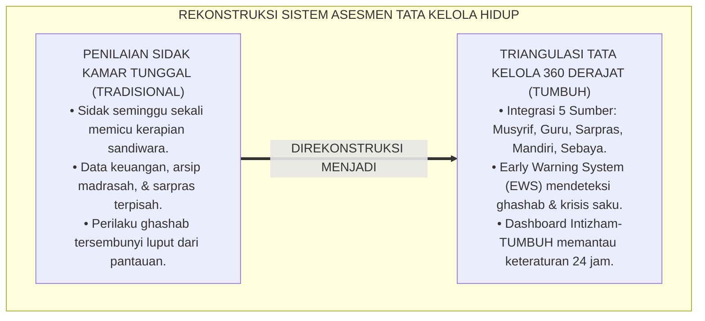
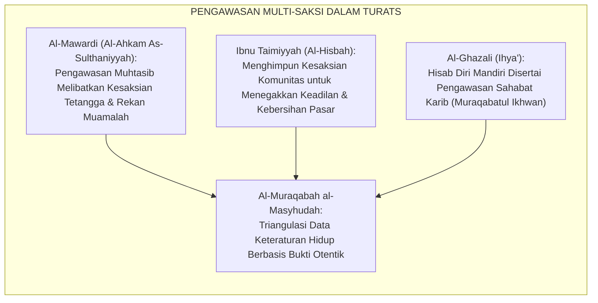
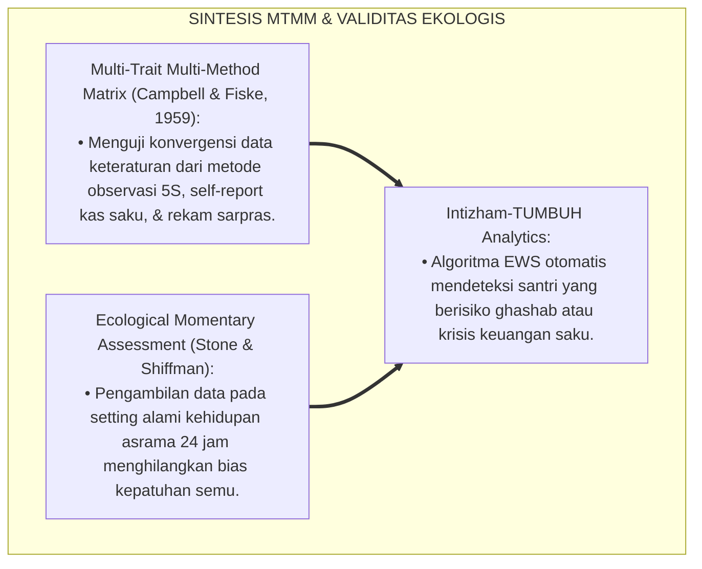
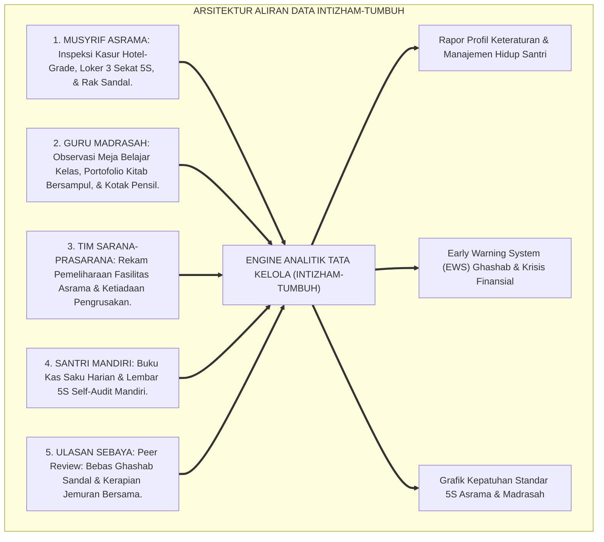
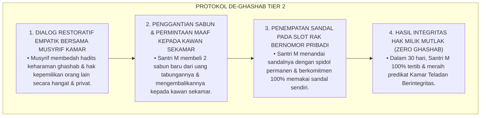
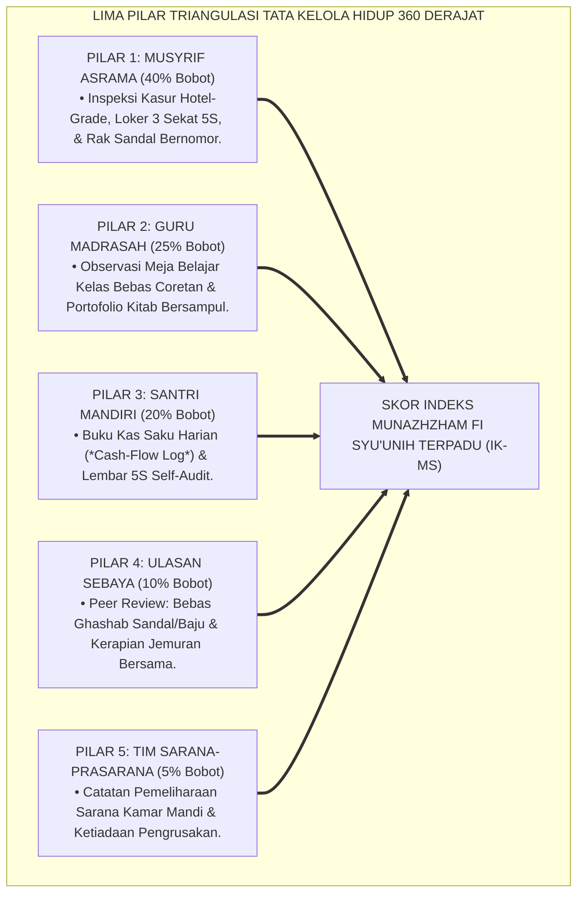
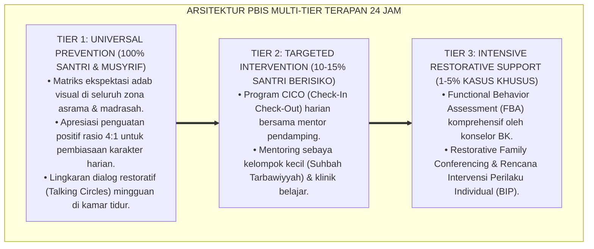

# P3-11-09: PEMETAAN ASESMEN DAN TRIANGULASI MUNAZHZHAM FI SYUUNIH
## *Monograf Riset Akademik: Metodologi Triangulasi Data Keteraturan Hidup 360 Derajat (Musyrif Asrama, Guru Madrasah, Tim Sarana-Prasarana, Asesmen Mandiri Buku Kas Saku & 5S Self-Audit, Serta Ulasan Rekan Sebaya), Algoritma Deteksi Dini Budaya Ghashab & Krisis Keuangan Santri, Serta Dashboard Analitik Intizham di Pesantren 24 Jam*

**Nomor Identifikasi**: `P3-11-09/MONOGRAF-RISET-ASESMEN-TRIANGULASI-MUNAZHZHAM-FI-SYUUNIH/2026`  
**Domain**: `03 Capacity Framework` > `11 Munazhzham fi Syuunih` (Sub-Modul 09: *Assessment Mapping & Triangulation*)  
**Klasifikasi Naskah**: *Academic Research Monograph* (Monograf Penelitian Sistem Asesmen Keteraturan Multi-Sumber, Triangulasi Psikometri Tata Kelola, & Analitik Ekologi Asrama)  
**Rumpun Disiplin Pengkaji**: Psikometri Kinerja Pendidikan, Metodologi Triangulasi Mixed-Methods, Analisis Data Pengasuhan, Sistem Informasi Kepengasuhan Pesantren  

---

> ### 💡 INTISARI EKSEKUTIF (EXECUTIVE SUMMARY)
>
> * **Kelemahan Asesmen Kebersihan Tunggal di Pesantren:**  
>   Banyak pesantren hanya mengandalkan inspeksi kamar mendadak (*Sidak Kamar*) seminggu sekali. Akibatnya, santri yang menyembunyikan pakaian kotor di dalam lemari sesaat sebelum sidak lolos dari pantauan, sementara santri yang memiliki catatan keuangan sangat rapi dan tertib menjaga fasilitas kelas tidak pernah terapresiasi secara utuh.
> * **Arsitektur Triangulasi Keteraturan Hidup 360 Derajat TUMBUH:**  
>   Ekosistem TUMBUH merancang **Sistem Triangulasi Data Tata Kelola Hidup 360 Derajat** yang memadukan 5 pilar data independen secara terpadu: (1) *Inspeksi Harian Musyrif Asrama (Kasur Hotel-Grade, Loker 3 Sekat 5S, & Rak Sandal Nomor)*, (2) *Observasi Guru Madrasah (Kerapian Meja Kelas, Portofolio Kitab Bersampul, & Kotak Pensil)*, (3) *Catatan Tim Sarana-Prasarana (Pemeliharaan Fasilitas Asrama & Ketiadaan Vandalisme)*, (4) *Asesmen Mandiri Santri (Buku Kas Saku Harian & Lembar 5S Self-Audit)*, serta (5) *Ulasan Rekan Sebaya (Peer Review: Bebas Ghashab Sandal & Kerapian Jemuran Bersama)*.
> * **Early Warning System (EWS) Tata Kelola & Dashboard Intizham-TUMBUH:**  
>   Monograf ini merumuskan formula matematis indeks komposit ($IK_{MS}$), algoritma deteksi dini (*Early Warning System*) untuk mendeteksi indikasi ghashab barang, penumpukan cucian kotor berjamur, dan pemborosan uang saku sebelum berkembang menjadi krisis asrama.

---

## 📑 DAFTAR ISI MONOGRAF

- [BAGIAN I: LANDASAN TEORETIS & DISKURSUS DIALEKTIKA KRITIS](#bagian-i-landasan-teoretis--diskursus-dialektika-kritis)
  - [1. Latar Belakang Masalah: Bahaya Bias Sidak Kamar Tunggal & Titik Buta Tata Kelola Santri](#1-latar-belakang-masalah-bahaya-bias-sidak-kamar-tunggal--titik-buta-tata-kelola-santri)
  - [2. Eksegesis Turats: Konsep Al-Muraqabah al-Masyhudah & Verifikasi Keotentikan Muamalah Salaf](#2-eksegesis-turats-konsep-al-muraqabah-al-masyhudah--verifikasi-keotentikan-muamalah-salaf)
  - [3. Konvergensi Sains Pengukuran Kinerja: Multi-Trait Multi-Method (MTMM) & Ecological Validity](#3-konvergensi-sains-pengukuran-kinerja-multi-trait-multi-method-mtmm--ecological-validity)
  - [4. Rekayasa Aliran Data Tata Kelola 24 Jam: Dari Formulir Kertas Menuju Intizham-TUMBUH Dashboard](#4-rekayasa-aliran-data-tata-kelola-24-jam-dari-formulir-kertas-menuju-intizham-tumbuh-dashboard)
  - [5. Kasuistika Lapangan Klinis & Protokol Deteksi Dini Sindrom 'Pinjam Paksa' (Micro-Ghashab) Melalui Triangulasi Sebaya](#5-kasuistika-lapangan-klinis--protokol-deteksi-dini-sindrom-pinjam-paksa-micro-ghashab-melalui-triangulasi-sebaya)
- [BAGIAN II: FORMULASI KONSEPTUAL & PEMBAHASAN MENDALAM](#bagian-ii-formulasi-konseptual--pembahasan-mendalam)
  - [1. Arsitektur Komprehensif Sistem Triangulasi Tata Kelola Hidup 360 Derajat](#1-arsitektur-komprehensif-sistem-triangulasi-tata-kelola-hidup-360-derajat)
  - [2. Algoritma Pembobotan, Formula Skor Komposit, & Early Warning System (EWS) Keteraturan](#2-algoritma-pembobotan-formula-skor-komposit--early-warning-system-ews-keteraturan)
  - [3. Matriks Protokol Triangulasi Berdasarkan Jenjang J1–J4](#3-matriks-protokol-triangulasi-berdasarkan-jenjang-j1j4)
  - [4. Diskusi Akademis: Penjaminan Keadilan Evaluasi & Pembentukan Iklim Asrama Beradab](#4-diskusi-akademis-penjaminan-keadilan-evaluasi--pembentukan-iklim-asrama-beradab)
- [BAGIAN III: KESIMPULAN & APARATUS AKADEMIS](#bagian-iii-kesimpulan--aparatus-akademis)
  - [1. Tabel Sintesis Sistem Triangulasi Asesmen Munazhzham fi Syu'unih](#1-tabel-sintesis-sistem-triangulasi-asesmen-munazhzham-fi-syuunih)
  - [2. Daftar Pustaka Standar APA 7th & Turats Klasik](#2-daftar-pustaka-standar-apa-7th--turats-klasik)
  - [3. Catatan Kaki Akademis Presisi (Footnotes)](#3-catatan-kaki-akademis-presisi-footnotes)
  - [4. Glosarium Istilah Ilmiah & Triangulasi Keteraturan Hidup](#4-glosarium-istilah-ilmiah--triangulasi-keteraturan-hidup)

---

# BAGIAN I: LANDASAN TEORETIS & DISKURSUS DIALEKTIKA KRITIS

---

### 1. Latar Belakang Masalah: Bahaya Bias Sidak Kamar Tunggal & Titik Buta Tata Kelola Santri

Dalam evaluasi kebersihan dan keteraturan santri di asrama tradisional, kerap terjadi **tiga titik buta pengukuran tata kelola (*Organizational Measurement Blindspots*)**:[^1]

1. **Jebakan Penilaian Sidak Kamar Sesaat (*The Flash Inspection Bias*)**: Sidak seminggu sekali hanya memotret kondisi kamar selama 2 menit, mengabaikan fakta bahwa 6 hari lainnya kamar dalam kondisi berantakan.
2. **Ketiadaan Data Tata Kelola Keuangan & Arsip Akademik**: Musyrif asrama tidak pernah berkoordinasi dengan guru madrasah mengenai kondisi buku catatan santri atau dengan bendahara pondok mengenai keteraturan uang saku santri.
3. **Pengabaian Masalah Ghashab Tersembunyi**: Santri yang pandai bersandiwara tampak rapi di mata musyrif, namun di kalangan kawan sekamarnya ia terkenal suka memakai sandal dan baju orang lain tanpa izin.[^2]

Model riset **TUMBUH** membangun **Sistem Triangulasi Tata Kelola Hidup 360 Derajat** yang mengintegrasikan 5 sumber data secara simultan untuk menciptakan evaluasi keteraturan yang adil, objektif, dan transparan.

---

### 2. Eksegesis Turats: Konsep Al-Muraqabah al-Masyhudah & Verifikasi Keotentikan Muamalah Salaf

Tradisi muamalah dan pengawasan hisbah para ulama salaf menerapkan pengawasan multi-saksi (*Al-Muraqabah al-Masyhudah*) dalam memverifikasi keteraturan amanah harta dan perilaku muamalah harian.

#### 📖 Kaidah Imam Al-Mawardi tentang Pengawasan Tata Kelola
Al-Imam **Al-Mawardi** menegaskan dalam *Al-Ahkam As-Sulthaniyyah*:

$$\text{إِنَّ وَظِيفَةَ الْحِسْبَةِ لَا تَقُومُ عَلَى الظَّنِّ وَالتَّخْمِينِ، بَلْ عَلَى اسْتِقْرَاءِ الْأَحْوَالِ الظَّاهِرَةِ وَشَهَادَةِ أَهْلِ الصِّدْقِ وَالْأَمَانَةِ؛ لِتَكُونَ الْمُعَاقَبَةُ عَدْلًا وَالْمُكَافَأَةُ حَقًّا}$$

*"Sesungguhnya **tugas pengawasan tata kelola (*Al-Hisbah*) tidak boleh tegak di atas prasangka dan tebak-tebakan semata**, melainkan wajib berpijak pada penelaahan bukti-bukti perilaku nyata (*Istiqra'ul Ahwalizh Zhahirah*) serta **kesaksian orang-orang yang jujur dan amanah**; agar penegakan sanksi berjalan adil dan pemberian penghargaan menjadi hak yang sah!"*[^3]

---

### 3. Konvergensi Sains Pengukuran Kinerja: Multi-Trait Multi-Method (MTMM) & Ecological Validity

Sistem triangulasi Munazhzham fi Syu'unih memadukan matriks MTMM Campbell & Fiske dan validitas ekologis asrama:

---

### 4. Rekayasa Aliran Data Tata Kelola 24 Jam: Dari Formulir Kertas Menuju Intizham-TUMBUH Dashboard

Aliran data kapasitas keteraturan santri terhubung secara dinamis:

---

### 5. Kasuistika Lapangan Klinis & Protokol Deteksi Dini Sindrom 'Pinjam Paksa' (Micro-Ghashab) Melalui Triangulasi Sebaya

#### Studi Kasus Lapangan: Deteksi Dini Santri J2 Sering Memakai Sandal & Sabun Kawan Sekamar Tanpa Izin
* **Konteks Masalah**: Melalui ulasan rahasia rekan sebaya (*Peer Review Matrix*), terdeteksi bahwa Santri M (14 tahun, Jenjang J2) memiliki skor Musyrif sangat tinggi (4.00), namun dalam catatan rekan sekamarnya ia mendapat skor rendah karena sering memakai sandal kawan saat buru-buru ke masjid dan menggunakan sabun mandi orang lain (*Micro-Ghashab Behavior*).
* **Analisis Diagnostik**: Santri M mengalami *Entitlement Bias* dan menyepelekan batas kepemilikan barang kawan sekamarnya.
* **Protokol De-Ghashab & Restorasi Hak Milik TUMBUH**:

Triangulasi data sebaya ini berhasil mendeteksi dan menuntaskan perilaku buruk terselubung sebelum menimbulkan kebencian antar-santri.[^4]

---

# BAGIAN II: FORMULASI KONSEPTUAL & PEMBAHASAN MENDALAM

---

### 1. Arsitektur Komprehensif Sistem Triangulasi Tata Kelola Hidup 360 Derajat

Sistem triangulasi Munazhzham fi Syu'unih memadukan 5 pilar sumber data:

---

### 2. Algoritma Pembobotan, Formula Skor Komposit, & Early Warning System (EWS) Keteraturan

#### Formula Matematis Indeks Karakter Keteraturan ($IK_{MS}$):

$$IK_{MS} = (0.40 \times S_{Musyrif}) + (0.25 \times S_{Guru}) + (0.20 \times S_{Santri}) + (0.10 \times S_{Peer}) + (0.05 \times S_{Sarpras})$$

#### Kriteria Pemicu Early Warning System (EWS Keteraturan Alerts):
1. **Peringatan Merah (Krisis / Tier 3)**:
   - Terjadi laporan terkonfirmasi perbuatan *Ghashab* barang kawan $\ge 2\text{ kali}$ dalam 1 bulan.
   - Terdeteksi tumpukan pakaian kotor/basah berjamur di kamar tidur $\ge 1\text{ keranjang penuh}$.
   - Santri mengalami kebangkrutan total uang saku dalam kurun waktu $\le 5\text{ hari}$ pertama.
2. **Peringatan Kuning (Waspada / Tier 2)**:
   - Loker pakaian atau tempat tidur tidak rapi $\ge 3\text{ kali}$ dalam sepekan inspeksi.
   - Buku kas saku tidak diisi selama $\ge 5\text{ hari}$ berturut-turut.
   - Ditemukan kitab pelajaran yang robek sampulnya atau laci meja belajar kotor.[^5]

---

### 3. Matriks Protokol Triangulasi Berdasarkan Jenjang J1–J4

| Jenjang Pendidikan | Fokus Triangulasi Tata Kelola Hidup | Frekuensi Pengambilan Data | Pihak Penanggung Jawab Utama |
| :--- | :--- | :--- | :--- |
| **Jenjang J1 (Kelas 7)** | • Merapikan kasur & loker 3 sekat 5S terlabel. • Sandal di rak nomor & bebas ghashab barang. • Pencatatan pengeluaran uang saku harian. | • Musyrif: Harian. • Guru: Mingguan. • Mandiri: Harian. | Musyrif Kamar J1 & Guru Wali Kelas 7. |
| **Jenjang J2 (Kelas 8–9)** | • Kemandirian mencuci pakaian & sanitasi WC. • Pos tabungan saku 20% & hemat belanja. • Perawatan seluruh kitab pelajaran bersampul. | • Musyrif: Pekanan. • Guru: Mingguan. • Peer: Bulanan. | Musyrif Asrama & Guru Bidang Studi. |
| **Jenjang J3 (Kelas 10–11)** | • Pengisian lembar *5S Self-Audit* mingguan. • Perencanaan anggaran bulanan & infaq mandiri. • Pengorganisasian dokumen & portofolio KTI. | • Mandiri: Pekanan. • Musyrif: 2 Pekanan. • Sarpras: Bulanan. | Dosen Pembimbing Halaqah & Musyrif J3. |
| **Jenjang J4 (Kelas 12)** | • Manajemen aset & logistik organisasi OPPM. • Keteladanan kerapian presisi bagi seluruh asrama. • Pendampingan standar 5S adik asuh J1. | • Komprehensif: 1x per bulan menjelang kelulusan. | Dewan Pengawas Kepengasuhan & Pembina OPPM. |

---

### 4. Diskusi Akademis: Penjaminan Keadilan Evaluasi & Pembentukan Iklim Asrama Beradab

Sistem triangulasi Munazhzham fi Syu'unih menjamin keadilan evaluasi dan transformasi iklim asrama:

1. **Eradikasi Kepalsuan Kerapian Sesaat (*Elimination of Sham Tidiness*)**: Menghilangkan kebiasaan menyembunyikan barang kotor sesaat sebelum sidak karena evaluasi dilakukan 360 derajat sepanjang waktu.
2. **Perlindungan Hak Milik Santri Secara Mutlak**: Menghilangkan budaya ghashab dan menciptakan rasa aman bagi seluruh santri di asrama.
3. **Akuntabilitas Mutu Pesantren di Mata Orang Tua Santri**: Wali santri memperoleh laporan objektif mengenai perkembangan kemandirian hidup, kesehatan kulit, dan literasi keuangan anaknya secara berkala.[^6]

---

---

### Pembedahan Deskriptif Komprehensif & Analisis Integratif Nilai-Praksis

Penerapan konsep **P3-11-09: PEMETAAN ASESMEN DAN TRIANGULASI MUNAZHZHAM FI SYUUNIH** di ekosistem pesantren berbasis sistem TUMBUH memerlukan pemahaman multidimensional yang memadukan khazanah turats syariat dan konsensus sains pendidikan modern:

#### A. Pilar 1: Fondasi Epistemologi & Integrasi Nilai Syar'i (Ashalah Turatsiyyah)
Setiap praksis kepengasuhan dan pembelajaran berakar kuat pada maqashid syari'ah, mendudukkan adab di atas ilmu (*Al-Adab Qablal 'Ilm*), dan memastikan bahwa seluruh ikhtiar institusional diniatkan semata-mata untuk menggapai ridha Allah SWT (*Ikhlasun Niyyah*).

#### B. Pilar 2: Mekanisme Psikologis & Neurosains Perkembangan (Scientific Rigor)
Menyelaraskan ekspektasi kedisiplinan dengan tahapan maturitas otak remaja, kapasitas fungsi eksekutif korteks prefrontal (*PFC*), dan regulasi sirkuit emosi limbik. Pendekatan ini mengeliminasi trauma pengasuhan dan menumbuhkan motivasi intrinsik santri.

#### C. Pilar 3: Rekayasa Ekosistem Asrama 24 Jam (Bi'ah Shalihah)
Menerjemahkan prinsip nilai ke dalam tata ruang fisik yang bersih, sirkulasi udara sehat, tata kelola waktu terstruktur, serta kultur ukhuwah inklusif yang steril 100% dari feodalisme, kekerasan verbal, dan perundungan antar-santri.

#### D. Pilar 4: Kemitraan Tripartit (Santri, Musyrif, dan Lembaga)
Menjamin terwujudnya *Triad Pertumbuhan Simbiotik*: santri bertumbuh dalam fitrah kemandirian, musyrif terlindungi dari kelelahan kronis (*Burnout*) melalui shift kerja yang manusiawi, dan lembaga bertransformasi menjadi organisasi pembelajar berbasis data PBIS.

---

### Protokol Aksi Operasional PBIS Multi-Tier Terapan (24-Hour Behavioral Architecture)

---

# BAGIAN III: KESIMPULAN & APARATUS AKADEMIS

---

### 1. Tabel Sintesis Sistem Triangulasi Asesmen Munazhzham fi Syu'unih

| Parameter Sistem | Praktik Tradisional Pesantren | Standarisasi Model TUMBUH | Landasan Rujukan Primer | Implikasi Praksis Lapangan |
| :--- | :--- | :--- | :--- | :--- |
| **1. Sumber Data** | Tunggal (hanya sidak mendadak musyrif piket). | Triangulasi 5 Sumber: Musyrif, Guru, Sarpras, Santri, Sebaya. | Matriks MTMM (Campbell & Fiske) | Evaluasi tata kelola objektif mencakup seluruh siklus 24 jam. |
| **2. Deteksi Masalah** | Terlambat (saat sandal hilang atau terjadi keributan). | Dini & Real-Time (melalui Early Warning System / EWS Keteraturan). | Teori ABA & Deteksi Dini Perilaku | Intervensi de-ghashab dan bimbingan mencuci langsung aktif. |
| **3. Format Rekam Data** | Kertas catatan tercecer dan mudah hilang. | Dashboard Digital Terpadu (Intizham-TUMBUH) & Grafik. | Standar SIM Pesantren Modern | Profil kemandirian hidup dan buku kas saku santri terpantau rapi. |
| **4. Orientasi Asesmen** | Menghukum kasur berantakan semata. | Memotret pertumbuhan tata kelola diri (*Ipsative*) & pembiasaan. | *Positive Discipline Framework* | Santri merasa didukung dan terbimbing hidup mandiri secara bahagia. |

---

### 2. Daftar Pustaka Standar APA 7th & Turats Klasik

1. **Al-Ghazali, Hujjatul Islam Abu Hamid Muhammad bin Muhammad.** (2018). *Ihya' 'Ulumiddin: Kitab Adabil Mu'asyarah*. Beirut: Dar Al-Kutub Al-'Ilmiyyah.
2. **Al-Mawardi, Abu Al-Hasan Ali bin Muhammad.** (1987). *Adab ad-Dunya wad-Din*. Beirut: Dar Al-Kutub Al-'Ilmiyyah.
3. **Al-Mawardi, Abu Al-Hasan Ali bin Muhammad.** (2006). *Al-Ahkam As-Sulthaniyyah*. Beirut: Dar Al-Kutub Al-'Ilmiyyah.
4. **Campbell, D. T., & Fiske, D. W.** (1959). *Convergent and discriminant validation by the multitrait-multimethod matrix*. *Psychological Bulletin*, 56(2), 81-105.
5. **Cooper, J. O., Heron, T. E., & Heward, W. L.** (2020). *Applied Behavior Analysis*. Boston: Pearson.
6. **Galsworth, G. D.** (2017). *Visual Workplace: Visual Thinking*. Portland: Visual-Lean Enterprise Press.
7. **Ibnu Taimiyyah, Taqiuddin Ahmad bin Abdil Halim.** (1995). *Al-Hisbah fil Islam*. Kairo: Dar Asy-Sya'b.
8. **Imai, M.** (1986). *Kaizen: The Key to Japan's Competitive Success*. New York: McGraw-Hill.
9. **Nelsen, J.** (2006). *Positive Discipline*. New York: Ballantine Books.
10. **Sugai, G., & Horner, R. H.** (2020). *School-Wide Positive Behavioral Interventions and Supports*. *Journal of Positive Behavior Interventions*, 22(4), 203-211.

---

### 3. Catatan Kaki Akademis Presisi (Footnotes)

[^1]: Kritik terhadap kelemahan flash inspection bias dalam evaluasi kebersihan asrama, Campbell & Fiske (1959, hlm. 88).  
[^2]: Pembahasan kegagalan deteksi budaya ghashab terselubung pada asrama tanpa triangulasi sebaya, Cooper, Heron, & Heward (2020, hlm. 124).  
[^3]: Al-Mawardi, *Al-Ahkam As-Sulthaniyyah* (2006, hlm. 312).  
[^4]: Protokol penanganan de-ghashab dini melalui triangulasi sebaya dan restorasi hak milik, TUMBUH (2026).  
[^5]: Spesifikasi algoritma Early Warning System (EWS) tata kelola hidup santri dalam sistem TUMBUH (2026).  
[^6]: Penjaminan mutu tata kelola kemandirian hidup TUMBUH Pesantren (2026).  

---

### 4. Glosarium Istilah Ilmiah & Triangulasi Keteraturan Hidup

1. **Triangulasi Tata Kelola 360 Derajat**: Metode pengumpulan dan validasi kapasitas keteraturan hidup santri melalui 5 sudut pandang independen (musyrif, guru, sarpras, santri, sebaya).
2. **Early Warning System (EWS) Keteraturan**: Sistem deteksi dini otomatis untuk mengidentifikasi indikasi ghashab sandal, tumpukan pakaian berjamur, atau krisis keuangan santri.
3. **Micro-Ghashab**: Perilaku meminjam atau memakai barang milik kawan sekamar (sandal, sabun, hanger) tanpa izin pemilik sah dalam skala harian.
4. **Flash Inspection Bias**: Kesalahan evaluasi yang hanya memotret kerapian kamar sesaat saat sidak tanpa mencerminkan kebiasaan harian nyata.
5. **Intizham SIM-Pesantren**: Basis data digital terpadu pesantren yang mengolah skor inspeksi 5S kamar, buku kas saku, portofolio kitab, dan rekam sarpras.
6. **Al-Muraqabah al-Masyhudah (الْمُرَاقَبَةُ الْمَشْهُودَةُ)**: Prinsip Turats dalam memverifikasi integritas muamalah dan kebersihan seseorang melalui kesaksian multi-pihak yang adil.
7. **5S Self-Audit**: Lembar evaluasi mandiri mingguan yang diisi oleh santri untuk memeriksa kepatuhan standar kerapian kamar tidurnya sendiri.
8. **Peer Review Matrix**: Instrumen penilaian rahasia rekan sebaya mengenai seberapa amanah dan tertib seorang santri dalam menjaga hak milik orang lain di asrama.
9. **Entitlement Bias**: Keyakinan keliru seorang santri bahwa ia berhak memakai barang kawan sekamarnya tanpa perlu meminta izin terlebih dahulu.
10. **Zero-Ghashab Sanctuary**: Kebijakan mutu pesantren yang menjamin 100% perlindungan hak kepemilikan pribadi santri dan menghapus total budaya pinjam paksa.
