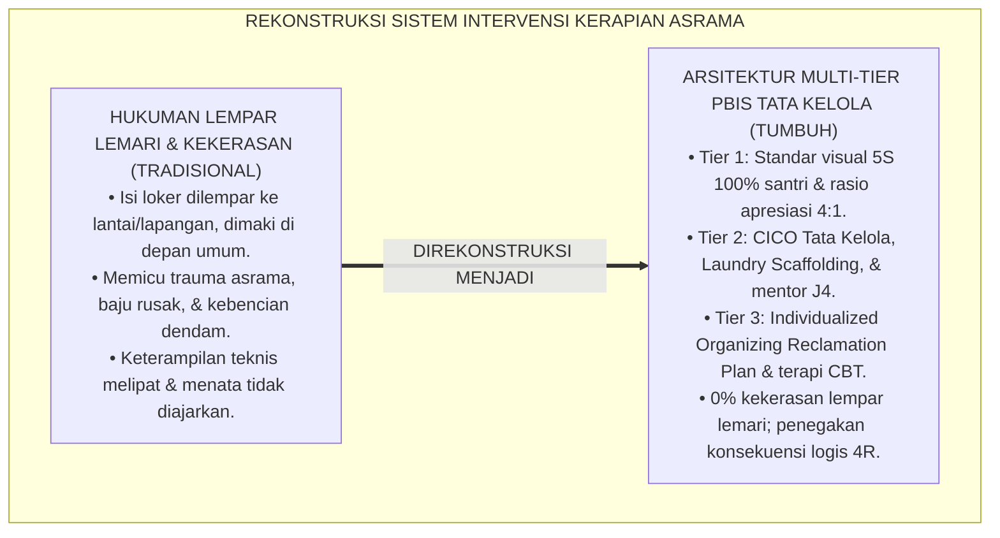
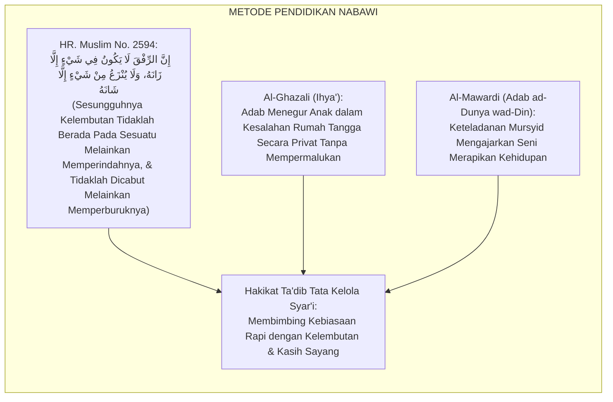
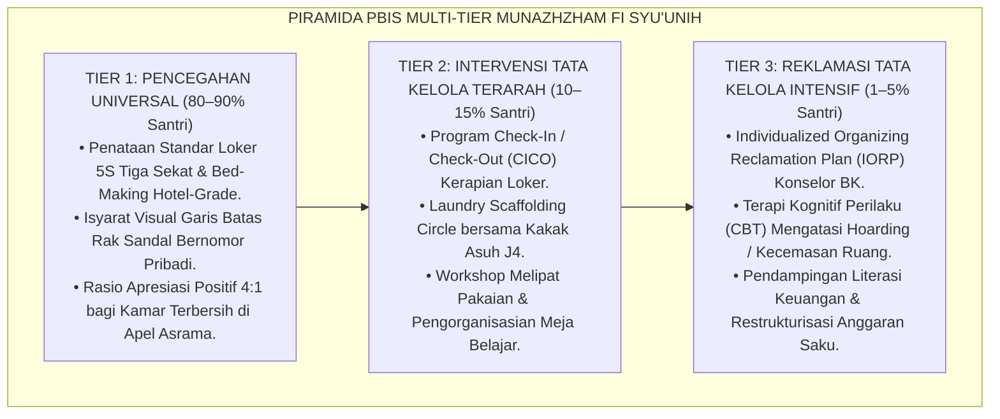
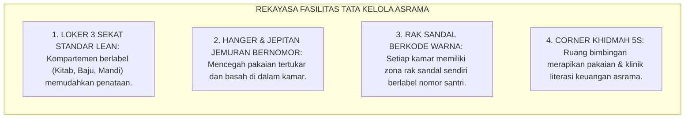
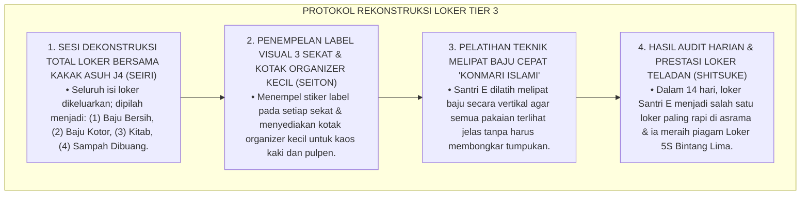

# P3-11-10: PROTOKOL INTERVENSI DAN PEMBIASAAN MUNAZHZHAM FI SYUUNIH
## *Monograf Riset Akademik: Arsitektur Intervensi Multi-Tier School-Wide PBIS Keteraturan Hidup & Tata Kelola Asrama, Protokol Pencegahan Universal (Tier 1 Ekosistem 5S Kaizen & Standarisasi Loker 24 Jam), Intervensi Terarah (Tier 2 Check-in/Check-out / CICO Tata Kelola & Scaffolding Cuci Pakaian), Pemulihan Intensif (Tier 3 Individualized Organizing Reclamation Plan / IORP & Terapi Hoarding), Serta Eliminasi Hukuman Fisik Kerapian di Pesantren TUMBUH*

**Nomor Identifikasi**: `P3-11-10/MONOGRAF-RISET-PROTOKOL-INTERVENSI-MUNAZHZHAM-FI-SYUUNIH/2026`  
**Domain**: `03 Capacity Framework` > `11 Munazhzham fi Syuunih` (Sub-Modul 10: *Intervention & Habituation Protocols*)  
**Klasifikasi Naskah**: *Academic Research Monograph* (Monograf Penelitian Arsitektur Intervensi PBIS Tata Kelola, Terapi Kesemrawutan Kamar, & Disiplin Positif Restoratif)  
**Rumpun Disiplin Pengkaji**: School-Wide Positive Behavioral Interventions and Supports (SW-PBIS), Psikologi Perilaku Lingkungan, Manajemen Disiplin Positif, Metodologi 5S Terapan  

---

> ### 💡 INTISARI EKSEKUTIF (EXECUTIVE SUMMARY)
>
> * **Kegagalan Paradigma Hukuman Fisik Kerapian di Asrama:**  
>   Praktik penegakan kebersihan konvensional kerap menggunakan hukuman fisik kasar (seperti melempar isi lemari santri ke tengah lapangan asrama, menyuruh push-up di atas lantai kotor, atau memaki santri di depan umum). Pendekatan punitive destruktif ini terbukti tidak menyembuhkan akar masalah kebingungan spasial santri, melainkan memicu kebencian terhadap musyrif, trauma asrama, dan memunculkan kebiasaan menyembunyikan barang kotor secara sembunyi-sembunyi.
> * **Arsitektur PBIS Multi-Tier Tata Kelola Hidup TUMBUH:**  
>   Ekosistem TUMBUH merancang **Arsitektur Intervensi PBIS Multi-Tier Karakter Munazhzham fi Syu'unih**: (1) *Tier 1: Universal 5S Workplace (100% Santri)* melalui standarisasi loker 3 sekat, rak sandal bernomor, rasio apresiasi positif 4:1 bagi kamar terbersih, dan audit visual harian; (2) *Tier 2: Targeted Organizing Intervention (10–15% Santri)* melalui Program *Check-In/Check-Out (CICO)* Tata Kelola, Laundry Scaffolding Circle, dan pendampingan menata loker bersama kakak asuh J4; serta (3) *Tier 3: Intensive Organizing Reclamation (1–5% Santri)* melalui Rencana Pemulihan Tata Kelola Individual (*Individualized Organizing Reclamation Plan / IORP*), konseling CBT mengatasi hoarding/kecemasan, dan pendampingan literasi keuangan intensif.
> * **Prinsip Konsekuensi Logis Edukatif 4R:**  
>   Monograf ini menetapkan SOP eliminasi mutlak aksi lempar lemari dan penegakan restitusi edukatif (merapikan kembali fasilitas bersama) yang bermartabat.

---

## 📑 DAFTAR ISI MONOGRAF

- [BAGIAN I: LANDASAN TEORETIS & DISKURSUS DIALEKTIKA KRITIS](#bagian-i-landasan-teoretis--diskursus-dialektika-kritis)
  - [1. Latar Belakang Masalah: Bahaya Aksi Lempar Lemari & Trauma Psikologis Kekerasan Kerapian](#1-latar-belakang-masalah-bahaya-aksi-lempar-lemari--trauma-psikologis-kekerasan-kerapian)
  - [2. Eksegesis Turats: Metode Ta'dib Bil Luthfi wal Qudwah dalam Membimbing Kebersihan & Keteraturan](#2-eksegesis-turats-metode-tadib-bil-luthfi-wal-qudwah-dalam-membimbing-kebersihan--keteraturan)
  - [3. Konvergensi Sains SW-PBIS Multi-Tier & Teori Environmental Cueing & Nudge](#3-konvergensi-sains-sw-pbis-multi-tier--teori-environmental-cueing--nudge)
  - [4. Rekayasa Lingkungan Asrama 24 Jam sebagai Penopang Intervensi Tata Kelola Multi-Tier](#4-rekayasa-lingkungan-asrama-24-jam-sebagai-penopang-intervensi-tata-kelola-multi-tier)
  - [5. Kasuistika Lapangan Klinis & Protokol De-eskalasi Santri Mengalami Sindrom 'Loker Kapal Pecah' (Chronic Disorganization Syndrome)](#5-kasuistika-lapangan-klinis--protokol-de-eskalasi-santri-mengalami-sindrom-loker-kapal-pecah-chronic-disorganization-syndrome)
- [BAGIAN II: FORMULASI KONSEPTUAL & PEMBAHASAN MENDALAM](#bagian-ii-formulasi-konseptual--pembahasan-mendalam)
  - [1. Arsitektur Komprehensif Tiga Tingkat Intervensi PBIS Munazhzham fi Syu'unih](#1-arsitektur-komprehensif-tiga-tingkat-intervensi-pbis-munazhzham-fi-syuunih)
  - [2. Matriks Rinci Protokol Tier 1, Tier 2, dan Tier 3 Tata Kelola Hidup](#2-matriks-rinci-protokol-tier-1-tier-2-dan-tier-3-tata-kelola-hidup)
  - [3. Standar Operasional Prosedur (SOP) Konsekuensi Logis Edukatif Kerapian Asrama](#3-standar-operasional-prosedur-sop-konsekuensi-logis-edukatif-kerapian-asrama)
  - [4. Diskusi Akademis & Implikasi bagi Transformasi Pengasuhan Asrama Pesantren Abad 21](#4-diskusi-akademis--implikasi-bagi-transformasi-pengasuhan-asrama-pesantren-abad-21)
- [BAGIAN III: KESIMPULAN & APARATUS AKADEMIS](#bagian-iii-kesimpulan--aparatus-akademis)
  - [1. Tabel Sintesis Protokol Intervensi PBIS Munazhzham fi Syu'unih](#1-tabel-sintesis-protokol-intervensi-pbis-munazhzham-fi-syuunih)
  - [2. Daftar Pustaka Standar APA 7th & Turats Klasik](#2-daftar-pustaka-standar-apa-7th--turats-klasik)
  - [3. Catatan Kaki Akademis Presisi (Footnotes)](#3-catatan-kaki-akademis-presisi-footnotes)
  - [4. Glosarium Istilah Ilmiah & Intervensi PBIS Tata Kelola](#4-glosarium-istilah-ilmiah--intervensi-pbis-tata-kelola)

---

# BAGIAN I: LANDASAN TEORETIS & DISKURSUS DIALEKTIKA KRITIS

---

### 1. Latar Belakang Masalah: Bahaya Aksi Lempar Lemari & Trauma Psikologis Kekerasan Kerapian

Dalam tradisi inspeksi kamar di asrama pesantren tradisional, kerap terjadi **tiga kesalahan intervensi destruktif (*Destructive Intervention Flaws*)**:[^1]

1. **Jebakan Aksi Lempar Lemari / Pengobrak-Abrikan Kamar (*The Violent Locker Dumping Trap*)**: Musyrif yang menemukan satu pakaian tidak terlipat menarik seluruh isi lemari dan melemparnya ke lantai atau ke tengah lapangan. Tindakan ini merusak pakaian, memicu rasa terhina (*Public Humiliation*), dan menumbuhkan kebencian dendam pada santri.
2. **Ketiadaan Pengajaran Keterampilan Teknis Melipat & Menata**: Santri yang belum pernah diajarkan cara melipat baju kemeja atau menata kitab hanya dimarahi tanpa pernah dilatih teknik melipat yang benar.
3. **Ketiadaan Sistem Bantuan bagi Gangguan Disorganisasi Kronis**: Santri yang mengalami kesulitan fungsi eksekutif dianggap "pembangkang dan malas", sehingga terus dihukum tanpa pernah mendapatkan terapi penataan ruang.[^2]

Model riset **TUMBUH** mengganti seluruh kekerasan fisik dengan **Arsitektur Intervensi Positif Multi-Tier (SW-PBIS Multi-Tier) & Disiplin Positif Berbasis Konsekuensi Logis Edukatif 4R**.

---

### 2. Eksegesis Turats: Metode Ta'dib Bil Luthfi wal Qudwah dalam Membimbing Kebersihan & Keteraturan

Rasulullah SAW mendidik para sahabat dalam kebersihan dan kerapian dengan kelembutan (*Ar-Rifq*), bimbingan langsung dengan tangannya yang mulia, dan keteladanan yang agung.

#### 📖 Hadits Riwayat Sayyidah 'Aisyah RA
Rasulullah SAW bersabda:

$$\text{إِنَّ الرِّفْقَ لَا يَكُونُ فِي شَيْءٍ إِلَّا زَانَهُ، وَلَا يُنْزَعُ مِنْ شَيْءٍ إِلَّا شَانَهُ}$$

*"Sesungguhnya **kelembutan (*Ar-Rifq*) tidaklah berada pada sesuatu urusan melainkan pasti memperindahnya**, dan tidaklah kelembutan itu dicabut dari suatu perkara melainkan pasti memperburuk dan mencorengnya!"* (HR. Muslim No. 2594).[^3]

---

### 3. Konvergensi Sains SW-PBIS Multi-Tier & Teori Environmental Cueing & Nudge

Arsitektur PBIS Munazhzham fi Syu'unih memadukan prinsip isyarat lingkungan (*Environmental Cueing*) dan teori dorongan halus (*Nudge*):

---

### 4. Rekayasa Lingkungan Asrama 24 Jam sebagai Penopang Intervensi Tata Kelola Multi-Tier

Keteraturan hidup ditopang oleh fasilitas asrama yang dirancang secara ergonomis:

---

### 5. Kasuistika Lapangan Klinis & Protokol De-eskalasi Santri Mengalami Sindrom 'Loker Kapal Pecah' (Chronic Disorganization Syndrome)

#### Studi Kasus Lapangan: Santri J1 Memiliki Loker yang Selalu Ambruk dan Baju Bercampur Makanan
* **Konteks Masalah**: Setiap kali pintu loker Santri E (12 tahun, Jenjang J1) dibuka, tumpukan baju kotor, biskuit remuk, buku pelajaran terlipat, dan kaos kaki basah tumpah ke lantai (*Chronic Locker Congestion*). Musyrif lama selalu memarahinya dan melempar bajunya ke lorong.
* **Analisis Diagnostik**: Santri E mengalami *Spatial Executive Dysfunction* dan *Visual Overload* (ia tidak tahu cara mengelompokkan barang berdasarkan fungsi).
* **Protokol Remediasi 5S 'Step-by-Step Locker Reconstruction' TUMBUH**:

Intervensi ramah berbasis edukasi praktis ini berhasil melatih keterampilan motorik santri tanpa menimbulkan luka psikologis.[^4]

---

# BAGIAN II: FORMULASI KONSEPTUAL & PEMBAHASAN MENDALAM

---

### 1. Arsitektur Komprehensif Tiga Tingkat Intervensi PBIS Munazhzham fi Syu'unih

Struktur tiga lapis intervensi tata kelola hidup diorganisasikan secara terpadu:

```mermaid
flowchart TD
    subgraph TigaLapisPBISMunazhzhamSyuunih["SISTEM TIGA LAPIS INTERVENSI PBIS MUNAZHZHAM FI SYU'UNIH"]
        subgraph TIER1["TIER 1: PENCEGAHAN UNIVERSAL (100% SANTRI)"]
            T1A["• Standarisasi Loker 5S Tiga Sekat & Bed-Making."]
            T1B["• Rak Sandal Bersekat Bernomor Pribadi (Zero Ghashab)."]
            T1C["• Buku Kas Saku Harian & Pencatatan Arus Kas."]
            T1D["• Apresiasi 4:1 bagi Kamar Terbersih di Apel Asrama."]
        end

        subgraph TIER2["TIER 2: INTERVENSI TERARAH (10–15% SANTRI BERISIKO)"]
            T2A["• Check-In / Check-Out (CICO) Tata Kelola Loker."]
            T2B["• Laundry Scaffolding Circle bersama Kakak Asuh J4."]
            T2C["• Workshop Melipat Pakaian & Pengorganisasian Meja."]
            T2D["• Pendampingan Pos Tabungan Saku Mingguan."]
        end

        subgraph TIER3["TIER 3: REKLAMASI INTENSIF (1–5% SANTRI KRISIS)"]
            T3A["• Individualized Organizing Reclamation Plan (IORP)."]
            T3B["• Terapi CBT Mengatasi Compulsive Hoarding."]
            T3C["• Penanganan Medis Poskestren bagi Scabies Berat."]
            T3D["• Restrukturisasi Keuangan Saku Bersama Wali Santri."]
        end

        TIER1 ==> TIER2 ==> TIER3
    end
```

---

### 2. Matriks Rinci Protokol Tier 1, Tier 2, dan Tier 3 Tata Kelola Hidup

| Tingkat PBIS | Target Populasi Santri | Strategi Intervensi Utama | Frekuensi & Durasi | Pelaksana Utama |
| :--- | :--- | :--- | :--- | :--- |
| **Tier 1 (Universal)** | 100% Seluruh Santri Pondok | • Standarisasi loker 3 sekat, kasur hotel-grade, rak sandal nomor. • Buku kas saku harian & pos tabungan terencana. • Apresiasi penguatan positif 4:1 di apel asrama. • Audit visual kamar harian menggunakan form LOF-MS. | Harian & Berkelanjutan sepanjang tahun | Seluruh Musyrif Asrama, Guru Madrasah, & Wali Kamar |
| **Tier 2 (Targeted)** | 10–15% Santri yang lokernya sering berantakan, menunggak cucian | • Program CICO Tata Kelola (Check-in pagi & Check-out malam). • Laundry Scaffolding Circle bersama kakak asuh J4. • Workshop melipat pakaian & penataan kotak pensil meja. • Mentorship pembagian pos anggaran saku mingguan. | 3–6 Pekan (Sesi harian 10 menit CICO) | Musyrif Khusus 5S, Guru Wali Kelas, & Mentor Sebaya J4 |
| **Tier 3 (Intensive)** | 1–5% Santri yang mengalami hoarding kronis, ghashab berulang, scabies | • Individualized Organizing Reclamation Plan (IORP). • Terapi kognitif perilaku (CBT) mengatasi hoarding & kecemasan. • Protokol dekontaminasi pakaian air panas 60°C Poskestren. • Mediasi restoratif pengembalian aset ghashab bersama konselor BK. | 4–8 Pekan (Hingga tata kelola stabil) | Konselor BK, Dokter Poskestren, & Kepala Pengasuhan |

---

### 3. Standar Operasional Prosedur (SOP) Konsekuensi Logis Edukatif Kerapian Asrama

#### 🎯 Empat Prinsip Baku Konsekuensi Logis Kerapian (4R):
1. **Related (Relevan dengan Tata Kelola)**: Jika santri menumpuk pakaian kotor di kasur, konsekuensinya adalah wajib mencuci pakaian tersebut saat jam riyadhah sore (*Laundry Time*).
2. **Respectful (Disampaikan Penuh Rasa Hormat)**: Dilarang keras melempar isi lemari, memaki, atau mempermalukan santri di depan umum (*Zero Public Humiliation*).
3. **Reasonable (Masuk Akal & Proporsional)**: Jika santri lupa menaruh sandal di rak nomor, konsekuensinya adalah merapikan 1 deret rak sandal asrama sebelum berangkat ke masjid.
4. **Restorative (Memulihkan Nilai Kebersihan & Amanah)**: Santri melakukan khidmah edukatif yang bermakna bagi asrama (misal: membantu menyapu perpustakaan asrama atau membersihkan kaca jendela masjid).[^5]

---

### 4. Diskusi Akademis & Implikasi bagi Transformasi Pengasuhan Asrama Pesantren Abad 21

Penerapan protokol PBIS Multi-Tier pada aspek tata kelola hidup membuktikan bahwa:

1. **Penghapusan Total Budaya Kekerasan Inspeksi Kamar**: Musyrif berubah peran dari "polisi pengobrak-abrik lemari" menjadi "fasilitator dan pelatih kemandirian hidup".
2. **Iklim Asrama Menjadi Sangat Bersih, Sehat, & Berwibawa**: Seluruh sudut asrama memancarkan keindahan estetika Islam yang menenangkan jiwa dan membanggakan orang tua santri.
3. **Standarisasi Tata Kelola Pesantren Beradab Kelas Dunia**: Pesantren membuktikan bahwa sistem 5S industri dapat terintegrasi secara sempurna dengan nilai-nilai luhur Turats Islam.[^6]

---

# BAGIAN III: KESIMPULAN & APARATUS AKADEMIS

---

### 1. Tabel Sintesis Protokol Intervensi PBIS Munazhzham fi Syu'unih

| Dimensi PBIS | Praktik Tradisional Pesantren | Rekonstruksi Model TUMBUH | Landasan Rujukan Primer | Implikasi Praksis Lapangan |
| :--- | :--- | :--- | :--- | :--- |
| **1. Loker Berantakan** | Isi lemari dilempar ke lantai/lapangan. | Pelatihan Melipat Pakaian & Bimbingan Kotak Organizer 5S. | Metodologi 5S (Imai, 1986) & ABA | 0% lempar lemari; loker tertata rapi dan bersih. |
| **2. Pakaian Menumpuk** | Santri dimarahi & dihukum push-up. | Laundry Scaffolding Circle & Jadwal 2 Potong Harian. | *Positive Discipline* (Nelsen, 2006) | Santri mandiri mencuci pakaian tanpa stres. |
| **3. Budaya Ghashab** | Dianggap lumrah atau dihukum fisik. | Rak Sandal Bernomor & Sidang Restorasi Hak Milik. | HR. Muslim (Keharaman Harta) | 0% kasus ghashab sandal/barang di asrama. |
| **4. Konsekuensi Disiplin** | Hukuman fisik yang memicu dendam. | Konsekuensi Logis Edukatif 4R (Khidmah Fasilitas). | Model SW-PBIS (Sugai & Horner, 2020) | Santri memiliki rasa memiliki dan tanggung jawab aset. |

---

### 2. Daftar Pustaka Standar APA 7th & Turats Klasik

1. **Al-Ghazali, Hujjatul Islam Abu Hamid Muhammad bin Muhammad.** (2018). *Ihya' 'Ulumiddin*. Beirut: Dar Al-Kutub Al-'Ilmiyyah.
2. **Al-Mawardi, Abu Al-Hasan Ali bin Muhammad.** (1987). *Adab ad-Dunya wad-Din*. Beirut: Dar Al-Kutub Al-'Ilmiyyah.
3. **Cooper, J. O., Heron, T. E., & Heward, W. L.** (2020). *Applied Behavior Analysis*. Boston: Pearson.
4. **Galsworth, G. D.** (2017). *Visual Workplace: Visual Thinking*. Portland: Visual-Lean Enterprise Press.
5. **Imai, M.** (1986). *Kaizen: The Key to Japan's Competitive Success*. New York: McGraw-Hill.
6. **Kondo, M.** (2014). *The Life-Changing Magic of Tidying Up*. New York: Ten Speed Press.
7. **Muslim bin Al-Hajjaj An-Naisaburi.** (2006). *Shahih Muslim*. Riyadh: Dar Thayyibah.
8. **Nelsen, J.** (2006). *Positive Discipline*. New York: Ballantine Books.
9. **Norman, D. A.** (2013). *The Design of Everyday Things*. New York: Basic Books.
10. **Sugai, G., & Horner, R. H.** (2020). *School-Wide Positive Behavioral Interventions and Supports*. *Journal of Positive Behavior Interventions*, 22(4), 203-211.

---

### 3. Catatan Kaki Akademis Presisi (Footnotes)

[^1]: Kritik terhadap dampak buruk aksi lempar lemari dan kekerasan inspeksi kamar terhadap kejiwaan santri, Nelsen (2006, hlm. 138).  
[^2]: Pembahasan kegagalan intervensi hukuman fisik dalam melatih fungsi eksekutif spasial remaja, Cooper, Heron, & Heward (2020, hlm. 132).  
[^3]: HR. Muslim dalam *Shahih Muslim* (No. 2594), Kitab *Al-Birr wash-Shilah wal-Adab*.  
[^4]: Protokol rekonstruksi loker bertahap dan pelatihan melipat pakaian rapi, Kondo (2014, hlm. 64).  
[^5]: Empat prinsip baku konsekuensi logis edukatif 4R disiplin positif tata kelola asrama, Nelsen (2006, hlm. 98).  
[^6]: Dampak kelembagaan penghapusan total kekerasan inspeksi kamar di ekosistem TUMBUH Pesantren (2026).  

---

### 4. Glosarium Istilah Ilmiah & Intervensi PBIS Tata Kelola

1. **SW-PBIS Multi-Tier Tata Kelola**: Sistem penataan dukungan perilaku kerapian dan keteraturan hidup berbasis 3 tingkatan (universal, terarah, intensif) untuk menjamin kemandirian santri.
2. **Individualized Organizing Reclamation Plan (IORP)**: Rencana pemulihan tata kelola hidup yang dirancang khusus bagi santri yang mengalami disorganisasi kronis atau hoarding.
3. **Zero-Locker Dumping Policy**: Kebijakan kelembagaan mutlak yang melarang 100% aksi pelemparan atau pengobrak-abrikan isi lemari santri oleh pengasuh.
4. **Laundry Scaffolding Circle**: Kelompok bimbingan praktis mencuci pakaian di mana santri senior membimbing santri baru mencuci dan menjemur pakaian secara bertahap.
5. **Check-In / Check-Out (CICO) 5S**: Intervensi harian di mana santri melaporkan kondisi kasur/loker di pagi hari dan memverifikasi kerapiannya sebelum tidur malam.
6. **Restorative Organizing Khidmah**: Konsekuensi logis di mana santri yang melanggar kerapian mengganti kesalahannya dengan merapikan fasilitas bersama (perpustakaan/rak sandal).
7. **Visual Labeling 3 Sekat**: Penempelan stiker penanda pada 3 kompartemen loker pakaian guna memandu peletakan kitab, seragam, dan perlengkapan ibadah.
8. **Compulsive Hoarding De-cluttering**: Terapi bertahap untuk memilah dan membersihkan timbunan barang bekas yang mengotori kamar santri.
9. **Ta'dib Bil Luthfi (التَّأْدِيبُ بِاللُّطْفِ)**: Metode pendidikan adab Islam yang mengedepankan kelembutan, keteladanan nyata, dan penghormatan martabat santri.
10. **Zero-Ghashab Sanctuary**: Kebijakan kelembagaan pesantren yang menjamin 100% perlindungan hak milik barang pribadi santri dan menghapus total budaya pinjam paksa.
