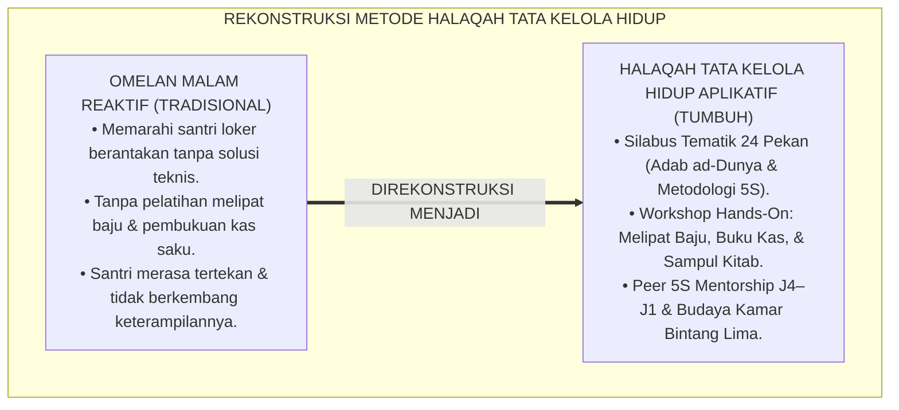
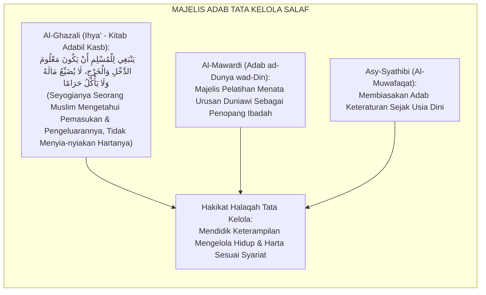
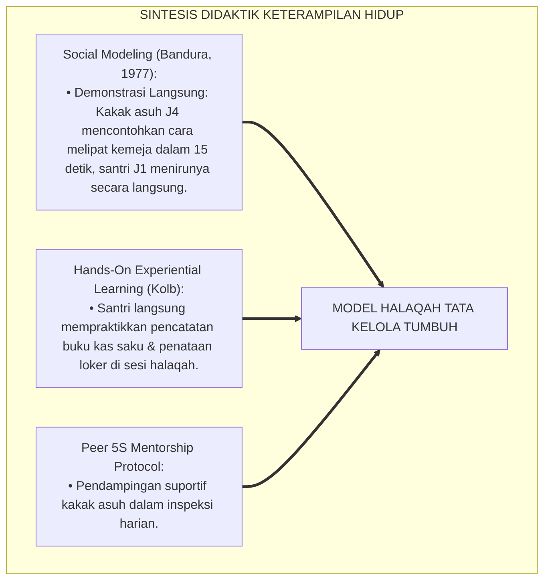
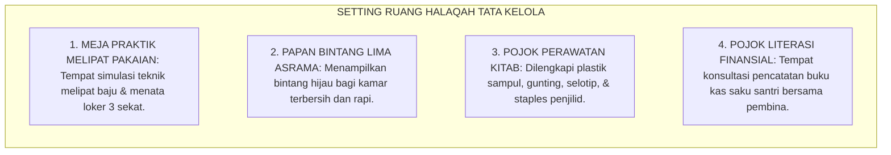
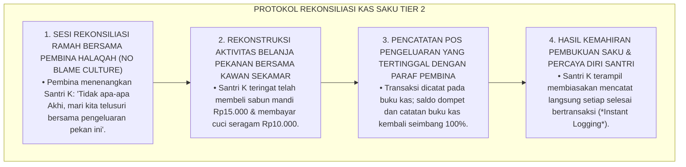
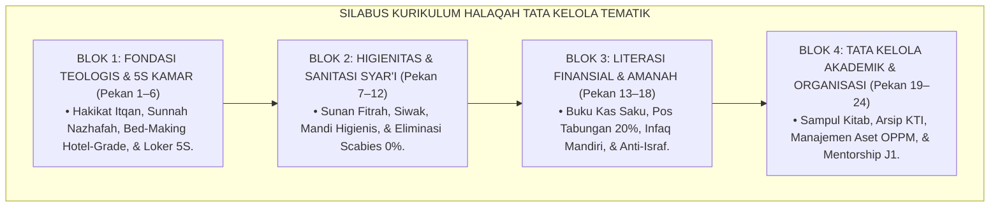
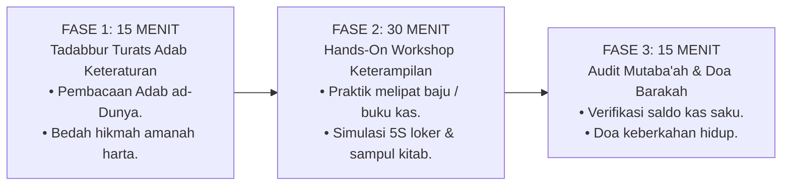
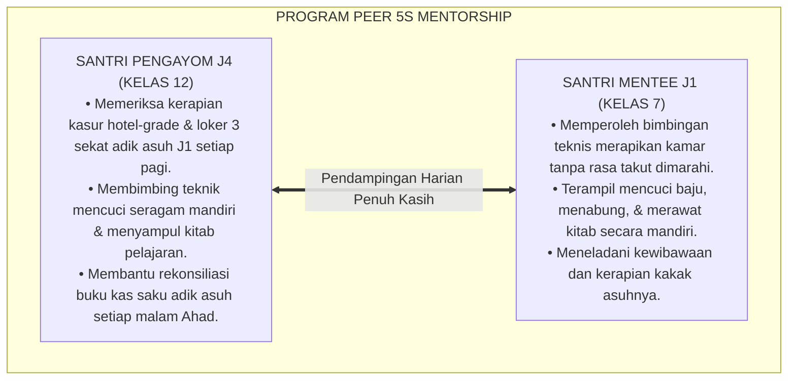

# P3-11-11: PROGRAM PEMBINAAN DAN HALAQAH MUNAZHZHAM FI SYUUNIH
## *Monograf Riset Akademik: Desain Kurikulum Halaqah Tata Kelola Hidup Tematik 24 Pekan, Integrasi Kajian Kitab Adab ad-Dunya wad-Din & Bidayatul Hidayah, Program Workshop Keterampilan Hidup (5S Kaizen, Melipat Baju Cepat, & Pembukuan Kas Saku), Program Mentorship 5S Kakak Asuh J4–J1, Serta Ritual Inspeksi Kamar Bintang Lima di Pesantren 24 Jam*

**Nomor Identifikasi**: `P3-11-11/MONOGRAF-RISET-HALAQAH-PEMBINAAN-MUNAZHZHAM-FI-SYUUNIH/2026`  
**Domain**: `03 Capacity Framework` > `11 Munazhzham fi Syuunih` (Sub-Modul 11: *Coaching Programs & Halaqah*)  
**Klasifikasi Naskah**: *Academic Research Monograph* (Monograf Penelitian Desain Kurikulum Halaqah Tata Kelola, Pedagogi Keterampilan Hidup Pesantren, & Model Mentorship 5S)  
**Rumpun Disiplin Pengkaji**: Desain Kurikulum Non-Formal Pesantren, Pedagogi Keterampilan Hidup (Life Skills Education), Psikologi Pembiasaan Tata Kelola, Manajemen Asrama 24 Jam  

---

> ### 💡 INTISARI EKSEKUTIF (EXECUTIVE SUMMARY)
>
> * **Kelesuan Pembinaan Tata Kelola Asrama Konvensional:**  
>   Sesi evaluasi malam di asrama kerap kali hanya diisi dengan kemarahan musyrif atas kamar yang berantakan, tanpa pernah menyajikan kurikulum terstruktur yang mengajarkan santri teknik-teknik mengelola uang saku, membedah kitab adab Turats, atau melatih santri menata loker pakaian secara rapi dan cepat.
> * **Inovasi Kurikulum Halaqah Tata Kelola Tematik 24 Pekan TUMBUH:**  
>   Ekosistem TUMBUH merancang **Silabus Kurikulum Halaqah Tata Kelola Hidup Tematik 24 Pekan Terstruktur** dengan formula waktu presisi 60 menit: (1) *15 Menit Tilawah & Tadabbur Teks Turats Adab Keteraturan (Adab ad-Dunya wad-Din / Bidayatul Hidayah)*, (2) *30 Menit Workshop Keterampilan Hidup Aplikatif (Teknik Melipat 5S, Pencatatan Buku Kas Saku, & Perawatan Kitab)*, dan (3) *15 Menit Sesi Evaluasi Mutaba'ah Loker & Doa Barakah*.
> * **Program Mentorship 5S Kakak Asuh J4–J1 & Ritual Kamar Bintang Lima:**  
>   Program ini diperkuat oleh sistem pendampingan tata kelola (*Peer 5S Mentorship*) di mana santri kelas 12 (J4) mendampingi 2 santri kelas 7 (J1) dalam menata loker 3 sekat, mencuci pakaian terjadwal, dan menginspeksi kamar tidur secara suportif menuju predikat *Kamar Bintang Lima*.

---

## 📑 DAFTAR ISI MONOGRAF

- [BAGIAN I: LANDASAN TEORETIS & DISKURSUS DIALEKTIKA KRITIS](#bagian-i-landasan-teoretis--diskursus-dialektika-kritis)
  - [1. Latar Belakang Masalah: Bahaya Evaluasi Malam Tanpa Kurikulum Pelatihan Keterampilan Hidup](#1-latar-belakang-masalah-bahaya-evaluasi-malam-tanpa-kurikulum-pelatihan-keterampilan-hidup)
  - [2. Eksegesis Turats: Majelis Ta'lim Adab Al-Kasb & Pembiasaan Tartibul Ma'ayisy Salafush Shalih](#2-eksegesis-turats-majelis-talim-adab-al-kasb--pembiasaan-tartibul-maayisy-salafush-shalih)
  - [3. Konvergensi Sains Desain Instruksional: Hands-On Workshop Keterampilan Hidup & Teori Pemodelan Sosial (Bandura)](#3-konvergensi-sains-desain-instruksional-hands-on-workshop-keterampilan-hidup--teori-pemodelan-sosial-bandura)
  - [4. Rekayasa Ekologi Ruang Halaqah Asrama: Standarisasi Meja Praktik 5S, Kotak Kas Saku, & Suasana Gotong Royong](#4-rekayasa-ekologi-ruang-halaqah-asrama-standarisasi-meja-praktik-5s-kotak-kas-saku--suasana-gotong-royong)
  - [5. Kasuistika Lapangan Klinis & Protokol Pendampingan Santri Mengalami Frustrasi Buku Kas Saku Selisih Saldo](#5-kasuistika-lapangan-klinis--protokol-pendampingan-santri-mengalami-frustrasi-buku-kas-saku-selisih-saldo)
- [BAGIAN II: FORMULASI KONSEPTUAL & PEMBAHASAN MENDALAM](#bagian-ii-formulasi-konseptual--pembahasan-mendalam)
  - [1. Silabus Kurikulum Halaqah Tata Kelola Hidup Tematik 24 Pekan Komprehensif](#1-silabus-kurikulum-halaqah-tata-kelola-hidup-tematik-24-pekan-komprehensif)
  - [2. Protokol Struktur Sesi Halaqah 60 Menit Berbasis Workshop Aplikatif](#2-protokol-struktur-sesi-halaqah-60-menit-berbasis-workshop-aplikatif)
  - [3. Desain Program Peer 5S Mentorship (Kakak Asuh J4 Mendampingi Tata Kelola Santri J1)](#3-desain-program-peer-5s-mentorship-kakak-asuh-j4-mendampingi-tata-kelola-santri-j1)
  - [4. Diskusi Akademis: Implikasi Budaya Kamar Bintang Lima bagi Kesehatan Mental Santri](#4-diskusi-akademis-implikasi-budaya-kamar-bintang-lima-bagi-kesehatan-mental-santri)
- [BAGIAN III: KESIMPULAN & APARATUS AKADEMIS](#bagian-iii-kesimpulan--aparatus-akademis)
  - [1. Tabel Sintesis Program Pembinaan & Halaqah Munazhzham fi Syu'unih](#1-tabel-sintesis-program-pembinaan--halaqah-munazhzham-fi-syuunih)
  - [2. Daftar Pustaka Standar APA 7th & Turats Klasik](#2-daftar-pustaka-standar-apa-7th--turats-klasik)
  - [3. Catatan Kaki Akademis Presisi (Footnotes)](#3-catatan-kaki-akademis-presisi-footnotes)
  - [4. Glosarium Istilah Ilmiah & Pedagogi Halaqah Keteraturan](#4-glosarium-istilah-ilmiah--pedagogi-halaqah-keteraturan)

---

# BAGIAN I: LANDASAN TEORETIS & DISKURSUS DIALEKTIKA KRITIS

---

### 1. Latar Belakang Masalah: Bahaya Evaluasi Malam Tanpa Kurikulum Pelatihan Keterampilan Hidup

Dalam dinamika pembinaan santri di asrama tradisional, kerap timbul **tiga kelemahan pedagogis pembinaan asrama (*Dormitory Coaching Flaws*)**:[^1]

1. **Jebakan Sesi Omelan Malam (*The Nighttime Scolding Trap*)**: Musyrif menghabiskan waktu evaluasi malam hanya untuk mengabsen kamar yang kotor dan memarahi santri, tanpa pernah mengajarkan teknik menyusun baju di loker atau cara mencatat buku kas.
2. **Ketiadaan Pembelajaran Keterampilan Finansial Terbimbing**: Santri tidak pernah diajarkan cara membuat anggaran uang saku, membedakan kebutuhan pokok vs jajan sia-sia, sehingga santri terus mengeluh kehabisan uang.
3. **Ketiadaan Bimbingan Merawat Kitab Pelajaran**: Santri membiarkan kitab turatsnya terlipat, robek, atau basah tanpa pernah diajarkan teknik menyampul plastik dan menjilid sederhana.[^2]

Model riset **TUMBUH** merekonstruksi pembinaan: **Halaqah Tata Kelola Hidup adalah laboratorium keterampilan hidup (*Life Skills Lab*) untuk melatih kemandirian, membedah hikmah Turats, dan membangun karakter amanah**.

---

### 2. Eksegesis Turats: Majelis Ta'lim Adab Al-Kasb & Pembiasaan Tartibul Ma'ayisy Salafush Shalih

Para ulama salafush shalih menyelenggarakan majelis khusus untuk mendidik murid-muridnya dalam adab mencari nafkah (*Adabul Kasb*), adab menata tempat tinggal (*Tartibul Maskan*), dan menjaga kebersihan pakaian.

#### 📖 Formulasi Imam Al-Ghazali tentang Keteraturan Finansial
Imam **Al-Ghazali** menjelaskan dalam *Ihya' 'Ulumiddin*:

$$\text{يَنْبَغِي لِلْمُسْلِمِ أَنْ يَكُونَ مَعْلُومَ الدَّخْلِ وَالْخَرْجِ، مُقْتَصِدًا فِي نَفَقَتِهِ، لَا يُضَيِّعُ مَالَهُ فِي السَّرَفِ وَلَا يُقَتِّرُ عَلَى نَفْسِهِ وَعِيَالِهِ؛ فَإِنَّ حُسْنَ التَّدْبِيرِ فِي الْمَعِيشَةِ نِصْفُ الْكَسْبِ}$$

*"Seyogianya bagi seorang muslim **mengetahui secara pasti catatan pemasukan dan pengeluarannya**, senantiasa hemat dalam nafkahnya, tidak menyia-nyiakan hartanya dalam pemborosan dan tidak pula kikir; **karena sesungguhnya manajemen penataan urusan nafkah yang baik (*Husnut Tadbir fil Ma'isyah*) adalah separuh dari keberhasilan mencari rezeki!**"*[^3]

---

### 3. Konvergensi Sains Desain Instruksional: Hands-On Workshop Keterampilan Hidup & Teori Pemodelan Sosial (Bandura)

Desain Halaqah Munazhzham fi Syu'unih menyelaraskan teori pembelajaran observasional Albert Bandura:

---

### 4. Rekayasa Ekologi Ruang Halaqah Asrama: Standarisasi Meja Praktik 5S, Kotak Kas Saku, & Suasana Gotong Royong

Ruang halaqah diatur secara interaktif untuk mendukung praktik keterampilan hidup:

---

### 5. Kasuistika Lapangan Klinis & Protokol Pendampingan Santri Mengalami Frustrasi Buku Kas Saku Selisih Saldo

#### Studi Kasus Lapangan: Santri J1 Menangis Karena Selisih Saldo Rp25.000 di Buku Kas Saku
* **Konteks Masalah**: Santri K (12 tahun, Jenjang J1) menangis panik di malam evaluasi karena uang di dompetnya kurang Rp25.000 dibandingkan catatan di buku kas sakunya (*Cash-Flow Discrepancy Anxiety*). Santri K takut dituduh tidak jujur oleh wali kelas.
* **Analisis Diagnostik**: Santri K lupa mencatat pembelian sabun mandi dan laundry 3 hari lalu (*Omission Error*), memicu kecemasan audit.
* **Protokol Rekonsiliasi Kas Saku Ramah TUMBUH**:

Pendekatan rekonsiliasi yang mendidik ini membangun integritas akuntansi santri tanpa memicu trauma.[^4]

---

# BAGIAN II: FORMULASI KONSEPTUAL & PEMBAHASAN MENDALAM

---

### 1. Silabus Kurikulum Halaqah Tata Kelola Hidup Tematik 24 Pekan Komprehensif

Kurikulum halaqah tata kelola hidup asrama disusun terstruktur sepanjang 2 semester (24 pekan):

#### Rincian Tema Mingguan Silabus 24 Pekan:

| Pekan | Tema Utama Halaqah Tata Kelola | Dalil Turats & Rujukan Kitab | Target Keterampilan Hidup Aplikatif |
| :---: | :--- | :--- | :--- |
| **01** | Kerapian Sebagai Cermin Keimanan | Hadits *Innallaha Jamilun Yuhibbul Jamal* | Praktik menata kamar dan membuang sampah. |
| **02** | Metodologi 5S Islami: Seiri & Seiton | *Adab ad-Dunya wad-Din* (Al-Mawardi) | Memilah barang penting vs membuang sampah di kamar. |
| **03** | Standar Bed-Making Hotel-Grade 2 Menit | *Bidayatul Hidayah* (Imam Al-Ghazali) | Praktik menarik sprei kencang & melipat selimut presisi. |
| **04** | Sistem Loker 3 Sekat Terstandar Lean | Standar Ergonomi Asrama TUMBUH | Menata loker: Sekat Kitab, Baju, & Peralatan Mandi. |
| **05** | Mengharamkan Ghashab: Menjaga Hak Milik | HR. Muslim (*Kullul Muslim 'alal Muslim Haram*) | Memberi label nama pada seluruh pakaian & sandal. |
| **06** | Adab Rak Sandal & Sepatu Bernomor | *Al-Jami'* (Al-Khatib Al-Baghdadi) | Menata sandal pada slot nomor pribadi di asrama. |
| **07** | Sunanul Fitrah: Siwak, Kuku, & Mandi | HR. Muslim No. 257 (Hadits Sunan Fitrah) | Praktik bersiwak/gosok gigi & memotong kuku berkala. |
| **08** | Protokol Anti-Scabies: Sanitasi Handuk | Fiqh Thaharah & *Why We Sleep* | Menjemur handuk basah di tali jemuran luar ruangan. |
| **09** | Manajemen Cucian: Jadwal 2 Potong Baju | Kaidah *An-Nazhafatu minal Iman* | Praktik mencuci seragam mandiri tanpa menumpuk. |
| **10** | Sanitasi Kamar Mandi & Adab Buang Air | *Ihya' 'Ulumiddin: Asraruth Thaharah* | Membilas kloset & membersihkan lantai kamar mandi. |
| **11** | Pakaian Putih & Wewangian Sunnah Shalat | HR. At-Tirmidzi (Adab Berpakaian) | Menjaga kesucian seragam shalat berjamaah di masjid. |
| **12** | Menghadapi Godaan Menimbun (*Hoarding*) | QS. At-Takatsur: 1–2 (*Alhakumut Takatsur*) | De-cluttering barang bekas di kolong kasur. |
| **13** | Literasi Finansial: Amanah Harta Titipan | QS. Al-Furqan: 67 (*Lam Yusrifu wa Lam Yaqturu*) | Membuka buku kas saku harian & menulis saldo awal. |
| **14** | Pembagian Pos Anggaran: Infaq, Tabung, Jajan | *Adabul Kasb wal Ma'isyah* (Ihya') | Membagi uang saku: Infaq 10%, Tabung 20%, Jajan 70%. |
| **15** | Bahaya Israf & Konsumerisme Makanan | QS. Al-A'raf: 31 (*Kulu wasyrabu wa la Tusrifu*) | Memilih jajanan sehat & hemat di kantin asrama. |
| **16** | Disiplin Mencatat Arus Kas Harian Saku | Kaidah Muamalah: *Kitabatud Dain* | Praktik mencatat transaksi jajan setiap malam. |
| **17** | Menabung Demi Kemandirian & Cita-Cita | Hadits *Yadul 'Ulya Khairun minal Yadus Sufla* | Menyetorkan pos tabungan ke Pos Keuangan Asrama. |
| **18** | Rekonsiliasi Kas Saku & Audit Kejujuran | *Ar-Ri'ayah li Huquqillah* (Al-Muhasibi) | Menghitung kecocokan saldo fisik dengan buku kas. |
| **19** | Adab Mengagungkan Kitab: Menyampul Rapi | *Ta'limul Muta'allim* (Syaikh Az-Zarnuji) | Praktik menyampul seluruh kitab dengan plastik rapi. |
| **20** | Penataan Meja Belajar & Kotak Pensil | *Adab ad-Dunya wad-Din* (Al-Mawardi) | Mengorganisasi buku catatan per mata pelajaran. |
| **21** | Pengorganisasian Arsip Makalah & Portofolio | Metodologi Riset Akademik TUMBUH | Menata dokumen karya ilmiah dalam map berkas berlabel. |
| **22** | Manajemen Logistik & Aset Organisasi OPPM | *Al-Ahkam As-Sulthaniyyah* (Al-Mawardi) | Praktik mengisi form serah terima aset kepanitiaan. |
| **23** | Menjadi Mentor 5S bagi Adik Kelas J1 | Hadits *Khairun Naas Anfa'uhum lin Naas* | Menginspeksi dan membimbing loker adik asuh J1. |
| **24** | Malam Penganugerahan Asrama Bintang Lima | Wasiat Salaf & Doa Keberkahan Hidup | Apel penghargaan kamar terbersih & wisuda 5S. |

---

### 2. Protokol Struktur Sesi Halaqah 60 Menit Berbasis Workshop Aplikatif

---

### 3. Desain Program Peer 5S Mentorship (Kakak Asuh J4 Mendampingi Tata Kelola Santri J1)

Setiap santri kelas 12 (Jenjang J4) dipasangkan dengan 2 santri kelas 7 (Jenjang J1) sebagai figur pembimbing keteraturan asrama:

---

### 4. Diskusi Akademis: Implikasi Budaya Kamar Bintang Lima bagi Kesehatan Mental Santri

Penerapan program pembinaan dan halaqah tata kelola hidup menghadirkan transformasi mendalam:

1. **Eradikasi Stres Visual Menuju Suaka Ketenangan (*Dormitory Sanctuary*)**: Kamar asrama yang bersih, harum, dan tertata rapi menurunkan hormon kortisol santri, meningkatkan kualitas tidur lelap (*Deep Sleep*).
2. **Kemandirian Tata Kelola Finansial Seumur Hidup**: Santri terlatih memiliki *Financial Literacy* yang matang, siap hidup hemat dan bijak di perantauan kampus.
3. **Penyempurnaan Wibawa Lembaga Pendidikan Islam**: Pesantren menjadi inspirasi peradaban bahwa keteraturan hidup modern berakar kuat pada nilai-nilai luhur Islam.[^5]

---

# BAGIAN III: KESIMPULAN & APARATUS AKADEMIS

---

### 1. Tabel Sintesis Program Pembinaan & Halaqah Munazhzham fi Syu'unih

| Komponen Program | Pola Halaqah Konvensional | Standarisasi Halaqah TUMBUH | Landasan Rujukan Primer | Bukti Capaian Lapangan |
| :--- | :--- | :--- | :--- | :--- |
| **1. Silabus Pembinaan** | Spontan tanpa kurikulum keterampilan hidup. | Silabus Tematik 24 Pekan Tata Kelola (*Adab ad-Dunya*). | *Ihya' 'Ulumiddin* (Al-Ghazali) | 100% sesi memiliki modul dan output workshop nyata. |
| **2. Format Sesi** | Omelan musyrif satu arah atas kamar kotor. | Hands-On Workshop Aplikatif 60 Menit (5S & Kas Saku). | Model Bandura (1977) & Metodologi 5S | Santri terampil melipat baju & membukukan kas saku. |
| **3. Program Mentorship** | Tidak ada pendampingan bagi santri baru. | *Peer 5S Mentorship* (Santri J4 membimbing santri J1). | HR. Muslim No. 2594 & Ukhuwah | 0% kasus laundry overwhelm pada santri baru J1. |
| **4. Standar Kamar** | Asrama kumuh dianggap biasa. | Budaya Kamar Bintang Lima & Zero-Ghashab Sanctuary. | *Total Quality Management* | 100% kamar rapi, harum, dan bebas kudis/scabies. |

---

### 2. Daftar Pustaka Standar APA 7th & Turats Klasik

1. **Al-Ghazali, Hujjatul Islam Abu Hamid Muhammad bin Muhammad.** (2018). *Ihya' 'Ulumiddin: Kitab Adabil Kasb wal Ma'isyah*. Beirut: Dar Al-Kutub Al-'Ilmiyyah.
2. **Al-Khatib Al-Baghdadi, Abu Bakr Ahmad bin Ali.** (1991). *Al-Jami' li Akhlaqir Rawi wa Adabis Sami'*. Riyadh: Maktabat Al-Ma'arif.
3. **Al-Mawardi, Abu Al-Hasan Ali bin Muhammad.** (1987). *Adab ad-Dunya wad-Din*. Beirut: Dar Al-Kutub Al-'Ilmiyyah.
4. **Az-Zarnuji, Burhanuddin.** (2008). *Ta'limul Muta'allim Thariqat-Ta'allum*. Surabaya: Al-Hidayah.
5. **Bandura, A.** (1977). *Social Learning Theory*. Englewood Cliffs: Prentice-Hall.
6. **Galsworth, G. D.** (2017). *Visual Workplace: Visual Thinking*. Portland: Visual-Lean Enterprise Press.
7. **Imai, M.** (1986). *Kaizen: The Key to Japan's Competitive Success*. New York: McGraw-Hill.
8. **Kondo, M.** (2014). *The Life-Changing Magic of Tidying Up*. New York: Ten Speed Press.
9. **Nelsen, J.** (2006). *Positive Discipline*. New York: Ballantine Books.
10. **Sugai, G., & Horner, R. H.** (2020). *School-Wide Positive Behavioral Interventions and Supports*. *Journal of Positive Behavior Interventions*, 22(4), 203-211.

---

### 3. Catatan Kaki Akademis Presisi (Footnotes)

[^1]: Kritik terhadap model evaluasi asrama berbasis omelan reaktif tanpa kurikulum keterampilan hidup, Bandura (1977, hlm. 86).  
[^2]: Pembahasan ketiadaan pelatihan perawatan buku dan literasi keuangan pada santri remaja, Al-Mawardi (1987, hlm. 234).  
[^3]: Al-Ghazali, *Ihya' 'Ulumiddin* (2018, Jilid 2, hlm. 88).  
[^4]: Protokol rekonsiliasi ramah buku kas saku dan pembiasaan instant logging santri, TUMBUH (2026).  
[^5]: Dampak kelembagaan penerapan kurikulum halaqah tata kelola tematik TUMBUH Pesantren (2026).  

---

### 4. Glosarium Istilah Ilmiah & Pedagogi Halaqah Keteraturan

1. **Halaqah Tata Kelola Hidup**: Majelis pembinaan keterampilan hidup mingguan di asrama yang difokuskan untuk melatih kerapian 5S, literasi finansial, dan adab merawat kitab.
2. **Kamar Bintang Lima**: Standar mutu kebersihan dan kerapian kamar tidur asrama di mana sprei kasur kencang, loker 3 sekat rapi, sandal di rak nomor, dan lantai harum.
3. **Instant Logging (Pencatatan Seketika)**: Kebiasaan mencatat nominal uang pengeluaran segera setelah bertransaksi di buku kas saku untuk mencegah selisih saldo.
4. **Hands-On 5S Workshop**: Sesi latihan praktik langsung melipat baju, merapikan meja belajar, dan menyampul kitab yang dipandu oleh musyrif dan mentor J4.
5. **KonMari Islami**: Metode melipat pakaian secara vertikal dan rapi yang diselaraskan dengan adab kesederhanaan dan kebersihan pakaian syar'i.
6. **Cash-Flow Discrepancy Reconciliation**: Sesi pendampingan suportif untuk mencocokkan saldo fisik uang di dompet dengan catatan di buku kas saku santri.
7. **Adabul Kasb wal Ma'isyah (آدَابُ الْكَسْبِ وَالْمَعِيشَةِ)**: Khazanah Turats Islam mengenai etika mencari rezeki, mengelola nafkah, dan membelanjakan harta secara halal dan hemat.
8. **Peer 5S Mentorship**: Program pendampingan di mana santri kelas 12 (J4) membimbing dan melatih santri kelas 7 (J1) dalam menata loker dan kamar asrama.
9. **Zero-Blame Reconciliation**: Prinsip pembinaan keuangan yang mengedepankan penelusuran fakta tanpa vonis menuduh santri berbohong saat terjadi selisih saldo.
10. **Pojok Perawatan Kitab**: Fasilitas terstandar di ruang halaqah asrama yang menyediakan perlengkapan menyampul dan memperbaiki buku pelajaran santri.
