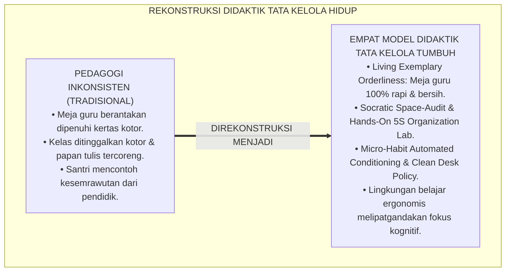
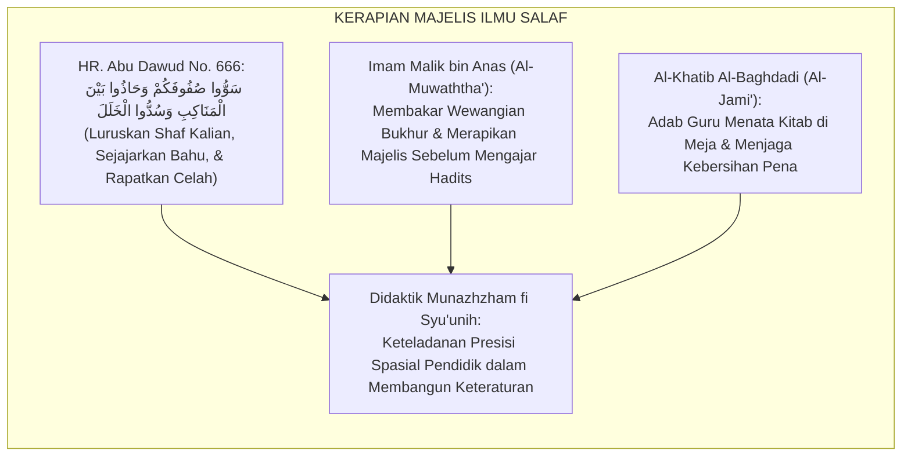
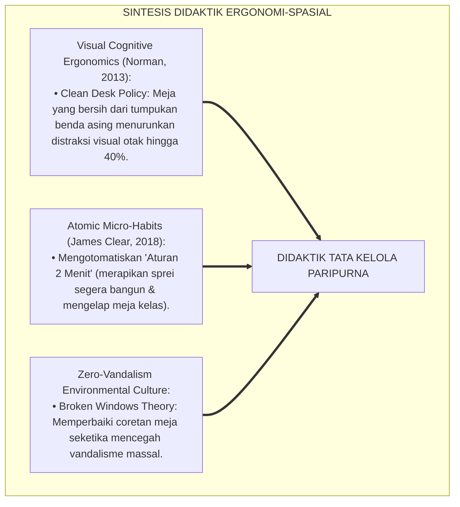
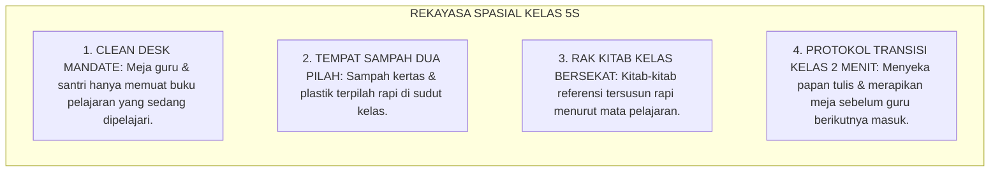
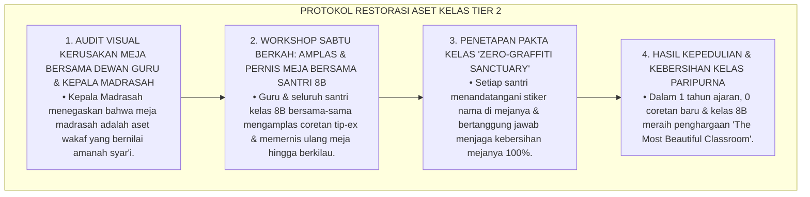
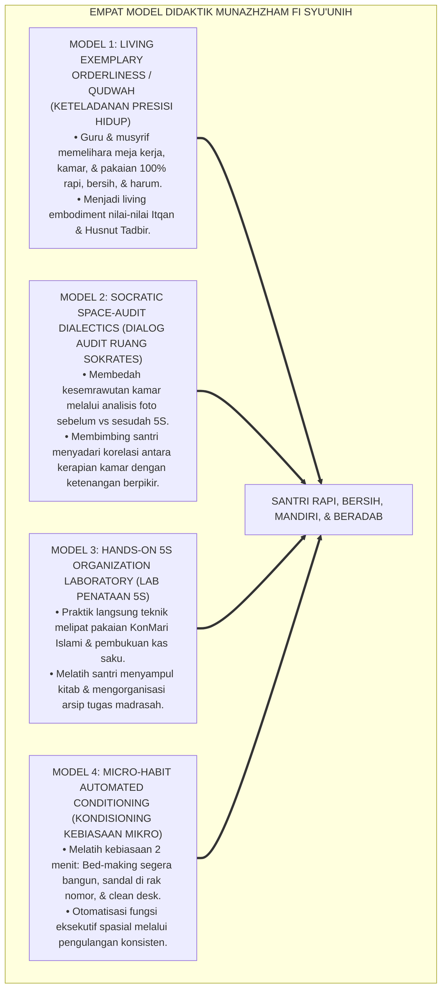
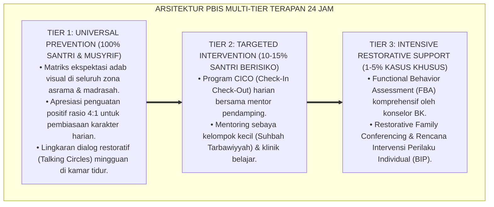

# P3-11-12: METODE PEDAGOGI DAN DIDAKTIK MUNAZHZHAM FI SYUUNIH
## *Monograf Riset Akademik: Empat Model Instruksional Pembinaan Keteraturan Hidup (Living Exemplary Orderliness / Qudwah, Socratic Space-Audit Dialectics, Hands-On 5S Organization Laboratory, & Micro-Habit Automated Conditioning), Integrasi Manajemen Tata Ruang di Kelas Madrasah & Asrama, Eliminasi Kerusakan Fasilitas, Serta Pembentukan Pendidik Rapi & Beradab di Ekosistem Pesantren Berbasis TUMBUH*

**Nomor Identifikasi**: `P3-11-12/MONOGRAF-RISET-PEDAGOGI-DIDAKTIK-MUNAZHZHAM-FI-SYUUNIH/2026`  
**Domain**: `03 Capacity Framework` > `11 Munazhzham fi Syuunih` (Sub-Modul 12: *Pedagogical Methods & Orderliness Didactics*)  
**Klasifikasi Naskah**: *Academic Research Monograph* (Monograf Penelitian Didaktik Tata Kelola Ruang, Desain Instruksional Keterampilan Hidup, & Transformasi Pendidik Pesantren)  
**Rumpun Disiplin Pengkaji**: Pedagogi Keterampilan Hidup, Desain Instruksional Ergonomi, Teori Pembiasaan Kebiasaan Mikro (*Atomic Habits*), Manajemen Ruang Kelas  

---

> ### 💡 INTISARI EKSEKUTIF (EXECUTIVE SUMMARY)
>
> * **Kemacetan Didaktik Pembinaan Keteraturan Konvensional di Pesantren:**  
>   Banyak guru dan musyrif menuntut santri untuk hidup rapi dan bersih, namun di sisi lain meja guru di kantor berantakan dipenuhi tumpukan kertas tercecer, asrama musyrif pengap, dan guru membiarkan papan tulis kotor setelah mengajar. Kontradiksi keteladanan ini merusak otoritas moral pembinaan kerapian (*Destruction of Moral Authority*).
> * **Empat Model Didaktik Munazhzham fi Syu'unih TUMBUH:**  
>   Ekosistem TUMBUH merumuskan **Empat Model Instruksional Keteraturan Terpadu**: (1) *Model Keteladanan Keteraturan Hidup (Living Exemplary Orderliness / Qudwah)*, (2) *Model Dialektika Audit Ruang Sokrates (Socratic Space-Audit Dialectics)*, (3) *Model Laboratorium Penataan 5S Terstruktur (Hands-On 5S Organization Laboratory)*, dan (4) *Model Pengkondisian Kebiasaan Mikro Otomatis (Micro-Habit Automated Conditioning)*.
> * **Transformasi Ruang Kelas & Asrama Menjadi Zona Bebas Kesemrawutan:**  
>   Monograf ini membimbing guru dan musyrif untuk menerapkan protokol "Meja Guru & Santri Bersih 100% (*Clean Desk Policy*)", sintaks penataan kelas 3 menit sebelum dan sesudah belajar, serta membiasakan santri merawat seluruh fasilitas bersama.

---

## 📑 DAFTAR ISI MONOGRAF

- [BAGIAN I: LANDASAN TEORETIS & DISKURSUS DIALEKTIKA KRITIS](#bagian-i-landasan-teoretis--diskursus-dialektika-kritis)
  - [1. Latar Belakang Masalah: Bahaya Meja Guru yang Berantakan & Dampak Negatifnya Terhadap Murid](#1-latar-belakang-masalah-bahaya-meja-guru-yang-berantakan--dampak-negatifnya-terhadap-murid)
  - [2. Eksegesis Turats: Keteladanan Kerapian Majelis Rasulullah SAW & Mursyid Salaf](#2-eksegesis-turats-keteladanan-kerapian-majelis-rasulullah-saw--mursyid-salaf)
  - [3. Konvergensi Sains Desain Instruksional: Visual Cognitive Ergonomics (Norman) & Atomic Habits (Clear)](#3-konvergensi-sains-desain-instruksional-visual-cognitive-ergonomics-norman--atomic-habits-clear)
  - [4. Rekayasa Lingkungan Belajar Presisi 24 Jam: Dari Pintu Kelas Menuju Efisiensi Pembelajaran](#4-rekayasa-lingkungan-belajar-presisi-24-jam-dari-pintu-kelas-menuju-efisiensi-pembelajaran)
  - [5. Kasuistika Lapangan Klinis & Protokol Restorasi Guru yang Membiarkan Meja Kelas Dicoret-coret Tip-ex](#5-kasuistika-lapangan-klinis--protokol-restorasi-guru-yang-membiarkan-meja-kelas-dicoret-coret-tip-ex)
- [BAGIAN II: FORMULASI KONSEPTUAL & PEMBAHASAN MENDALAM](#bagian-ii-formulasi-konseptual--pembahasan-mendalam)
  - [1. Arsitektur Empat Model Didaktik Keteraturan Munazhzham fi Syu'unih](#1-arsitektur-empat-model-didaktik-keteraturan-munazhzham-fi-syuunih)
  - [2. Langkah-Langkah Operasional Sintaks Pembelajaran Berbasis Clean Desk Policy](#2-langkah-langkah-operasional-sintaks-pembelajaran-berbasis-clean-desk-policy)
  - [3. Matriks Penerapan Model Didaktik Berdasarkan Jenjang J1–J4](#3-matriks-penerapan-model-didaktik-berdasarkan-jenjang-j1j4)
  - [4. Diskusi Akademis & Implikasi bagi Tata Kelola Lingkungan Pesantren Unggul](#4-diskusi-akademis--implikasi-bagi-tata-kelola-lingkungan-pesantren-unggul)
- [BAGIAN III: KESIMPULAN & APARATUS AKADEMIS](#bagian-iii-kesimpulan--aparatus-akademis)
  - [1. Tabel Sintesis Metode Pedagogi & Didaktik Munazhzham fi Syu'unih](#1-tabel-sintesis-metode-pedagogi--didaktik-munazhzham-fi-syuunih)
  - [2. Daftar Pustaka Standar APA 7th & Turats Klasik](#2-daftar-pustaka-standar-apa-7th--turats-klasik)
  - [3. Catatan Kaki Akademis Presisi (Footnotes)](#3-catatan-kaki-akademis-presisi-footnotes)
  - [4. Glosarium Istilah Ilmiah & Didaktik Tata Kelola Ruang](#4-glosarium-istilah-ilmiah--didaktik-tata-kelola-ruang)

---

# BAGIAN I: LANDASAN TEORETIS & DISKURSUS DIALEKTIKA KRITIS

---

### 1. Latar Belakang Masalah: Bahaya Meja Guru yang Berantakan & Dampak Negatifnya Terhadap Murid

Dalam praksis pedagogi di madrasah dan asrama pesantren tradisional, kerap timbul **tiga distorsi didaktik tata kelola (*Spatial Didactic Distortions*)**:[^1]

1. **Jebakan Meja Guru yang Semrawut (*Cluttered Teacher Desk Trap*)**: Meja guru dipenuhi tumpukan kertas ujian berdebu, cangkir kopi kotor, dan spidol tanpa tutup, mengajarkan santri secara implisit bahwa "orang berilmu boleh berantakan".
2. **Ketiadaan Protokol Transisi Kelas Bersih (*Zero Clean Transition*)**: Santri dibiarkan meninggalkan kelas dengan sampah kertas di bawah meja dan papan tulis penuh coretan tinta, membebani guru jam berikutnya.
3. **Pengabaian Keterampilan Pengorganisasian Meja Santri**: Guru hanya fokus pada hafalan materi kognitif, tanpa pernah mengajarkan santri cara menata laci meja dan kotak pensil agar memudahkan konsentrasi.[^2]

Model riset **TUMBUH** merekonstruksi didaktik: **Keteraturan hidup diajarkan melalui keteladanan visual pendidik (*Living Qudwah*), Clean Desk Policy, dan otomatisasi kebiasaan mikro 2 menit**.

---

### 2. Eksegesis Turats: Keteladanan Kerapian Majelis Rasulullah SAW & Mursyid Salaf

Rasulullah SAW dan para ulama salafush shalih senantiasa memberikan keteladanan kerapian fisik dan kebersihan ruangan majelis ilmu yang sempurna.

#### 📖 Kesaksian Al-Khatib Al-Baghdadi tentang Adab Majelis Pendidik
Al-Imam **Al-Khatib Al-Baghdadi** menegaskan dalam *Al-Jami' li Akhlaqir Rawi*:

$$\text{يَنْبَغِي لِلْمُحَدِّثِ وَالْمُعَلِّمِ أَنْ يَكُونَ مَجْلِسُهُ نَظِيفًا طَيِّبَ الرَّائِحَةِ، مُرَتَّبَ الْكُتُبِ وَالْمَحَابِرِ؛ لَا يَتْرُكُ شَيْئًا فِي غَيْرِ مَوْضِعِهِ؛ فَإِنَّ حُسْنَ هَيْئَةِ الْمُعَلِّمِ دَاعِيَةٌ إِلَى حُسْنِ اسْتِمَاعِ الْمُتَعَلِّمِ}$$

*"Seyogianya bagi seorang guru dan ahli hadits **menjadikan majelis belajarnya bersih, beraroma harum, tertata rapi kitab-kitab dan tempat-tempat tintanya**; tidak membiarkan sesuatu diletakkan bukan pada tempatnya; **karena sesungguhnya keelokan tata kelola guru adalah penarik utama bagi kesungguhan murid dalam menyimak ilmu!**"*[^3]

---

### 3. Konvergensi Sains Desain Instruksional: Visual Cognitive Ergonomics (Norman) & Atomic Habits (Clear)

Didaktik Munazhzham fi Syu'unih memadukan ergonomi kognitif visual Don Norman dan pembiasaan mikro James Clear:

---

### 4. Rekayasa Lingkungan Belajar Presisi 24 Jam: Dari Pintu Kelas Menuju Efisiensi Pembelajaran

Efisiensi instruksional diwujudkan melalui standarisasi tata kelola ruang kelas dan asrama:

---

### 5. Kasuistika Lapangan Klinis & Protokol Restorasi Guru yang Membiarkan Meja Kelas Dicoret-coret Tip-ex

#### Studi Kasus Lapangan: Guru Membiarkan Santri Mencoret-coret Meja Kayu Madrasah dengan Tip-Ex
* **Konteks Masalah**: Di Kelas 8B, 15 meja belajar kayu dipenuhi coretan tip-ex, nama band musik, dan ukiran jangka (*Classroom Vandalism*). Guru yang mengajar di kelas tersebut tidak pernah menegur karena menganggapnya "kenakalan wajar remaja".
* **Analisis Diagnostik**: Terjadi *Broken Windows Effect* (pembiaran kerusakan kecil memicu kerusakan massal) dan pengabaian amanah pemeliharaan aset wakaf madrasah.
* **Protokol Resolusi Restorasi Meja Madrasah TUMBUH**:

Kegiatan perbaikan bersama ini mengubah sikap abai menjadi rasa memiliki (*Sense of Ownership*) yang mendalam pada diri santri dan guru.[^4]

---

# BAGIAN II: FORMULASI KONSEPTUAL & PEMBAHASAN MENDALAM

---

### 1. Arsitektur Empat Model Didaktik Keteraturan Munazhzham fi Syu'unih

Ekosistem TUMBUH menetapkan empat model instruksional tata kelola hidup baku:

---

### 2. Langkah-Langkah Operasional Sintaks Pembelajaran Berbasis Clean Desk Policy

#### Sintaks Pembelajaran Kelas Keteraturan 45 Menit (Clean Desk Framework):
1. **Fase 1: 1-Minute Desk Clear & Alignment (Menit 0–1)**: Santri merapikan posisi meja, memastikan laci meja bersih dari sampah, dan hanya meletakkan 1 buku & 1 pulpen di atas meja.
2. **Fase 2: Target & Value Connection / 4 Menit (Menit 2–5)**: Guru membuka kelas, menyampaikan target pembelajaran, dan mengingatkan nilai Itqan dalam menuntut ilmu.
3. **Fase 3: Focused Interactive Learning / 35 Menit (Menit 6–40)**: Proses pembelajaran berlangsung dalam suasana kelas yang bersih, hening, dan ergonomis.
4. **Fase 4: 2-Minute Clean Transition / 5 Menit (Menit 41–45)**: Santri memasukkan alat tulis ke kotak pensil, menyeka papan tulis hingga bersih, dan merapikan kursi sebelum bel berbunyi.[^5]

---

### 3. Matriks Penerapan Model Didaktik Berdasarkan Jenjang J1–J4

| Jenjang Pendidikan | Model Didaktik Dominan | Fokus Aktivitas Belajar Santri | Peran Pendidik Utama |
| :--- | :--- | :--- | :--- |
| **Jenjang J1 (Kelas 7)** | *Micro-Habit Conditioning* & *Living Qudwah* | Pembiasaan loker 5S; bed-making 2 menit; pencatatan kas saku harian. | Pelatih Rutinitas & Figur Pengayom Disiplin. |
| **Jenjang J2 (Kelas 8–9)** | *5S Organization Lab* & *Hands-On* | Praktik mencuci pakaian mandiri; pos tabungan 20%; menyampul kitab rapi. | Instruktur Keterampilan Hidup & Anti-Ghashab. |
| **Jenjang J3 (Kelas 10–11)** | *Socratic Space-Audit* & *Self-Audit* | Melakukan audit mandiri 5S kamar; merancang anggaran bulanan; arsip KTI. | Fasilitator Refleksi Tata Kelola & Mentor Otonom. |
| **Jenjang J4 (Kelas 12)** | *Project-Based Asset Mastery* & Mentorship | Mengelola logistik organisasi OPPM; manajemen fasilitas; bimbing adik J1. | Rekan Kolaborasi Manajemen & Senior 5S Mentor. |

---

### 4. Diskusi Akademis & Implikasi bagi Tata Kelola Lingkungan Pesantren Unggul

Penerapan empat model didaktik ini menghasilkan transformasi mendasar:

1. **Eradikasi Vandalisme & Pengrusakan Aset Pesantren (*Zero Vandalism*)**: Meja kelas, dinding asrama, dan fasilitas kamar mandi terjaga utuh dan bersih sepanjang tahun ajaran.
2. **Peningkatan Kualitas Kebugaran Mental Santri & Pendidik**: Ruang kelas dan asrama yang bersih menciptakan atmosfer belajar yang sangat tenang, fokus, dan membahagiakan (*Flow State Learning*).
3. **Penyempurnaan Wibawa Profesional Lembaga Pendidikan Islam**: Pesantren menjadi percontohan global lembaga pendidikan yang memadukan kebersihan mutu 5S Jepang dengan spiritualitas Islam.[^6]

---

---

### Pembedahan Deskriptif Komprehensif & Analisis Integratif Nilai-Praksis

Penerapan konsep **P3-11-12: METODE PEDAGOGI DAN DIDAKTIK MUNAZHZHAM FI SYUUNIH** di ekosistem pesantren berbasis sistem TUMBUH memerlukan pemahaman multidimensional yang memadukan khazanah turats syariat dan konsensus sains pendidikan modern:

#### A. Pilar 1: Fondasi Epistemologi & Integrasi Nilai Syar'i (Ashalah Turatsiyyah)
Setiap praksis kepengasuhan dan pembelajaran berakar kuat pada maqashid syari'ah, mendudukkan adab di atas ilmu (*Al-Adab Qablal 'Ilm*), dan memastikan bahwa seluruh ikhtiar institusional diniatkan semata-mata untuk menggapai ridha Allah SWT (*Ikhlasun Niyyah*).

#### B. Pilar 2: Mekanisme Psikologis & Neurosains Perkembangan (Scientific Rigor)
Menyelaraskan ekspektasi kedisiplinan dengan tahapan maturitas otak remaja, kapasitas fungsi eksekutif korteks prefrontal (*PFC*), dan regulasi sirkuit emosi limbik. Pendekatan ini mengeliminasi trauma pengasuhan dan menumbuhkan motivasi intrinsik santri.

#### C. Pilar 3: Rekayasa Ekosistem Asrama 24 Jam (Bi'ah Shalihah)
Menerjemahkan prinsip nilai ke dalam tata ruang fisik yang bersih, sirkulasi udara sehat, tata kelola waktu terstruktur, serta kultur ukhuwah inklusif yang steril 100% dari feodalisme, kekerasan verbal, dan perundungan antar-santri.

#### D. Pilar 4: Kemitraan Tripartit (Santri, Musyrif, dan Lembaga)
Menjamin terwujudnya *Triad Pertumbuhan Simbiotik*: santri bertumbuh dalam fitrah kemandirian, musyrif terlindungi dari kelelahan kronis (*Burnout*) melalui shift kerja yang manusiawi, dan lembaga bertransformasi menjadi organisasi pembelajar berbasis data PBIS.

---

### Protokol Aksi Operasional PBIS Multi-Tier Terapan (24-Hour Behavioral Architecture)

---

# BAGIAN III: KESIMPULAN & APARATUS AKADEMIS

---

### 1. Tabel Sintesis Metode Pedagogi & Didaktik Munazhzham fi Syu'unih

| Dimensi Didaktik | Metode Tradisional Pesantren | Rekonstruksi Model TUMBUH | Landasan Rujukan Primer | Bukti Capaian Lapangan |
| :--- | :--- | :--- | :--- | :--- |
| **1. Keteladanan Pendidik** | Meja guru berantakan penuh kertas kotor. | Living Exemplary Orderliness: Meja guru 100% rapi & bersih. | *Al-Jami'* (Al-Khatib Al-Baghdadi) | 100% ruang guru & asrama musyrif rapi terstandar. |
| **2. Kebersihan Kelas** | Meja dicoret tip-ex & laci penuh sampah. | Clean Desk Policy & Pakta Zero-Graffiti. | *Broken Windows Theory* & 5S | 0% coretan meja madrasah; laci meja steril bersih. |
| **3. Pacing Transisi** | Kelas ditinggalkan kotor saat bel. | Protokol Transisi Bersih 2 Menit (Papan Tulis Bersih). | *Atomic Habits* (Clear, 2018) | Kelas selalu dalam kondisi siap pakai bagi guru berikutnya. |
| **4. Pelatihan Praktik** | Menyuruh rapi tanpa mengajarkan teknik. | Laboratorium 5S Organization (Melipat & Kas Saku). | Model Bandura (1977) | Santri terampil melipat baju vertikal & mencatat kas. |

---

### 2. Daftar Pustaka Standar APA 7th & Turats Klasik

1. **Al-Ghazali, Hujjatul Islam Abu Hamid Muhammad bin Muhammad.** (2018). *Ihya' 'Ulumiddin*. Beirut: Dar Al-Kutub Al-'Ilmiyyah.
2. **Al-Khatib Al-Baghdadi, Abu Bakr Ahmad bin Ali.** (1991). *Al-Jami' li Akhlaqir Rawi wa Adabis Sami'*. Riyadh: Maktabat Al-Ma'arif.
3. **Az-Zarnuji, Burhanuddin.** (2008). *Ta'limul Muta'allim Thariqat-Ta'allum*. Surabaya: Al-Hidayah.
4. **Bandura, A.** (1977). *Social Learning Theory*. Englewood Cliffs: Prentice-Hall.
5. **Clear, J.** (2018). *Atomic Habits: An Easy & Proven Way to Build Good Habits & Break Bad Ones*. New York: Avery.
6. **Galsworth, G. D.** (2017). *Visual Workplace: Visual Thinking*. Portland: Visual-Lean Enterprise Press.
7. **Imai, M.** (1986). *Kaizen: The Key to Japan's Competitive Success*. New York: McGraw-Hill.
8. **Nelsen, J.** (2006). *Positive Discipline*. New York: Ballantine Books.
9. **Norman, D. A.** (2013). *The Design of Everyday Things*. New York: Basic Books.
10. **Wilson, J. Q., & Kelling, G. L.** (1982). *Broken windows: The police and neighborhood safety*. *The Atlantic Monthly*, 249(3), 29-38.

---

### 3. Catatan Kaki Akademis Presisi (Footnotes)

[^1]: Kritik terhadap dampak buruk meja guru yang berantakan terhadap otoritas moral pendidik, Norman (2013, hlm. 82).  
[^2]: Pembahasan Broken Windows Theory dalam lingkungan ruang kelas sekolah berasrama, Wilson & Kelling (1982, hlm. 32).  
[^3]: Al-Khatib Al-Baghdadi, *Al-Jami' li Akhlaqir Rawi wa Adabis Sami'* (1991, hlm. 64).  
[^4]: Protokol restorasi meja madrasah dan penghapusan coretan tip-ex melalui khidmah bersama, TUMBUH (2026).  
[^5]: Sintaks 4 langkah pembelajaran kelas Clean Desk Policy 45 menit TUMBUH Pesantren (2026).  
[^6]: Dampak kelembagaan penerapan didaktik keteraturan tata ruang terpadu TUMBUH Pesantren (2026).  

---

### 4. Glosarium Istilah Ilmiah & Didaktik Tata Kelola Ruang

1. **Living Exemplary Orderliness**: Metode pembelajaran di mana kerapian diajarkan melalui keteladanan nyata pendidik yang menjaga kebersihan meja kerja dan asramanya.
2. **Clean Desk Policy**: Kebijakan mutu kelas yang mewajibkan meja guru dan santri hanya memuat perlengkapan belajar yang sedang digunakan.
3. **Broken Windows Theory**: Teori sosiologi yang menjelaskan bahwa pembiaran kerusakan fisik kecil (seperti coretan meja) akan memicu kerusakan yang jauh lebih besar jika tidak diperbaiki segera.
4. **Socratic Space-Audit**: Dialog reflektif yang membimbing santri menganalisis foto kondisi kamarnya untuk menemukan ruang-ruang perbaikan 5S.
5. **Hands-On 5S Organization Lab**: Sesi latihan praktik di mana santri secara langsung melipat pakaian, menyampul kitab, dan membukukan kas saku di bawah bimbingan.
6. **2-Minute Clean Transition**: Protokol 2 menit di akhir jam pelajaran untuk menyeka papan tulis, merapikan meja, dan membuang sampah laci.
7. **Pakta Zero-Graffiti**: Kesepakatan kelas tertulis yang ditandatangani santri untuk menjaga meja dan dinding madrasah 100% bebas dari coretan pulpen/tip-ex.
8. **Visual Cognitive Load**: Beban kerja memori visual otak yang meningkat drastis saat berada di ruangan yang berantakan, menurunkan fokus belajar.
9. **Sense of Spatial Ownership**: Rasa memiliki dan tanggung jawab emosional santri terhadap keindahan dan keutuhan fasilitas asrama/madrasah.
10. **Flow State Learning**: Kondisi mental fokus mendalam dan membahagiakan yang tercapai saat proses belajar berlangsung di ruang yang bersih dan teratur.
