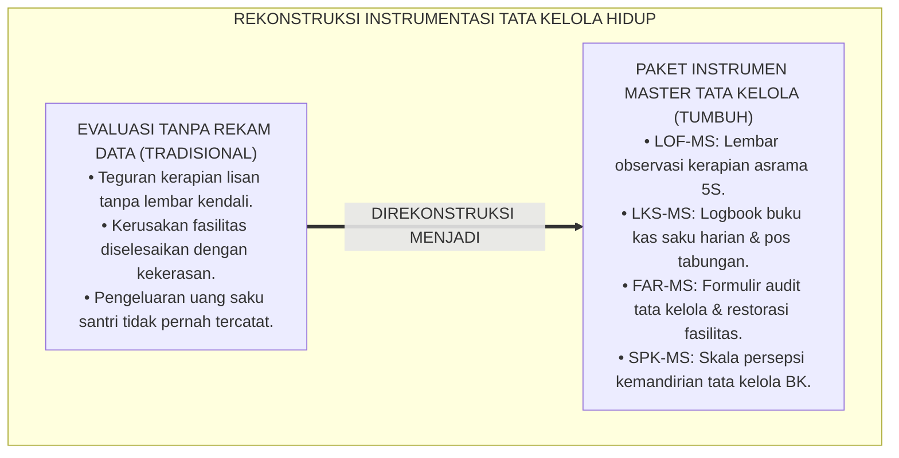
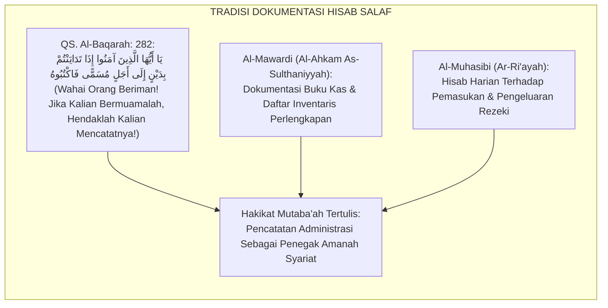
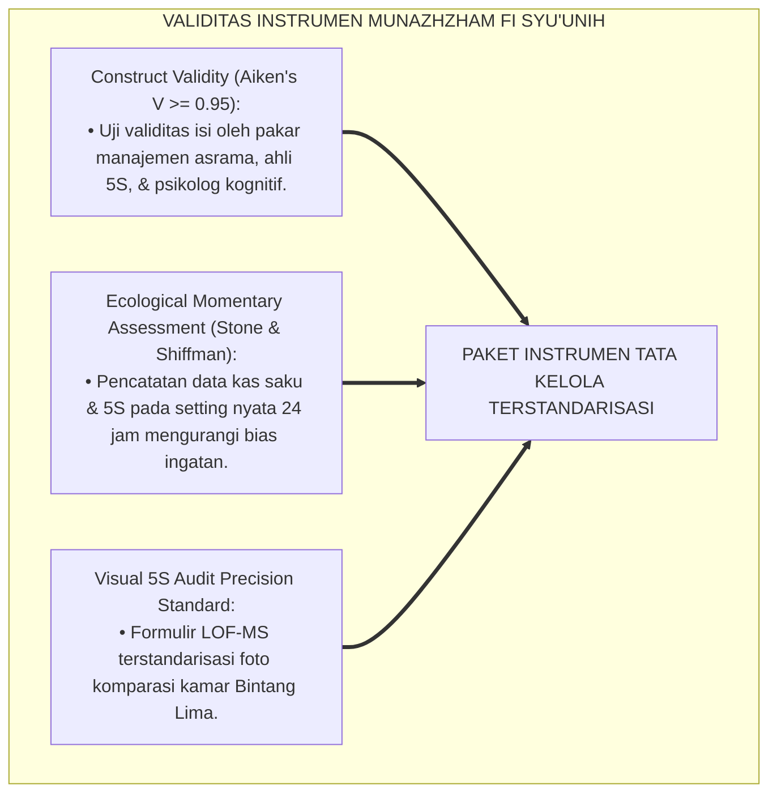
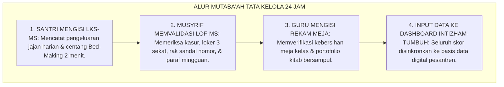
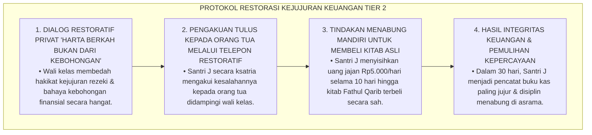
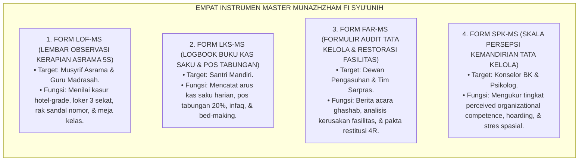

# P3-11-13: INSTRUMEN DAN LEMBAR MUTABA'AH MUNAZHZHAM FI SYUUNIH
## *Monograf Riset Akademik: Kodifikasi Paket Instrumen Evaluasi Tata Kelola Hidup Lapangan, Lembar Observasi Kerapian Asrama 5S (LOF-MS), Logbook Buku Kas Saku Harian & Pos Tabungan Mandiri (LKS-MS), Formulir Audit Tata Kelola & Restorasi Fasilitas (FAR-MS), Skala Persepsi Kemandirian Tata Kelola Santri (SPK-MS), Serta Integrasi Sistem Informasi Kepengasuhan Digital di Pesantren 24 Jam*

**Nomor Identifikasi**: `P3-11-13/MONOGRAF-RISET-INSTRUMEN-MUTABAAH-MUNAZHZHAM-FI-SYUUNIH/2026`  
**Domain**: `03 Capacity Framework` > `11 Munazhzham fi Syuunih` (Sub-Modul 13: *Instruments & Mutaba'ah Sheets*)  
**Klasifikasi Naskah**: *Academic Research Monograph* (Monograf Penelitian Instrumentasi Tata Kelola Asrama, Standarisasi Formulir Restorasi Fasilitas, & Sistem Rekam Data Mutaba'ah 5S)  
**Rumpun Disiplin Pengkaji**: Instrumentasi Psikometri Pendidikan, Desain Lembar Evaluasi Disiplin Positif, Sistem Informasi Manajemen Kepengasuhan, Metodologi Rekam Mutaba'ah  

---

> ### 💡 INTISARI EKSEKUTIF (EXECUTIVE SUMMARY)
>
> * **Kekosongan Instrumen Pemantauan Tata Kelola Lapangan:**  
>   Banyak pesantren tidak memiliki instrumen operasional terstandarisasi untuk memantau kerapian loker 5S santri, mendokumentasikan proses restitusi fasilitas yang rusak secara edukatif, atau merekam arus kas keuangan saku harian. Akibatnya, evaluasi keteraturan hanya mengandalkan ingatan musyrif atau hukuman emosional yang memicu rasa tidak adil.
> * **Kodifikasi Empat Instrumen Master Munazhzham fi Syu'unih TUMBUH:**  
>   Ekosistem TUMBUH merumuskan **Empat Paket Instrumen Operasional Lapangan Terstandarisasi**: (1) *Lembar Observasi Kerapian Asrama 5S (LOF-MS)* untuk musyrif kamar, (2) *Logbook Buku Kas Saku Harian & Pos Tabungan Mandiri (LKS-MS)* untuk santri, (3) *Formulir Audit Tata Kelola & Restorasi Fasilitas (FAR-MS)* untuk dewan kepengasuhan/wali kelas, dan (4) *Skala Persepsi Kemandirian Tata Kelola Santri (SPK-MS)* untuk konselor BK.
> * **Integrasi Aplikasi Digital Intizham-TUMBUH:**  
>   Monograf ini menyajikan format cetak siap pakai (*ready-to-print templates*) sekaligus spesifikasi integrasi digital ke dalam sistem database santri, menjamin kemudahan penginputan data harian dan akurasi pelaporan profil kemandirian hidup santri.

---

## 📑 DAFTAR ISI MONOGRAF

- [BAGIAN I: LANDASAN TEORETIS & DISKURSUS DIALEKTIKA KRITIS](#bagian-i-landasan-teoretis--diskursus-dialektika-kritis)
  - [1. Latar Belakang Masalah: Bahaya Ketiadaan Instrumen Terstandarisasi dalam Memantau Keteraturan Hidup](#1-latar-belakang-masalah-bahaya-ketiadaan-instrumen-terstandarisasi-dalam-memantau-keteraturan-hidup)
  - [2. Eksegesis Turats: Tradisi Pencatatan Kitab Al-Hisab & Dokumentasi Inventaris Salaf](#2-eksegesis-turats-tradisi-pencatatan-kitab-al-hisab--dokumentasi-inventaris-salaf)
  - [3. Konvergensi Sains Pengukuran Kinerja: Ecological Momentary Assessment (EMA) & 5S Visual Audit Precision](#3-konvergensi-sains-pengukuran-kinerja-ecological-momentary-assessment-ema--5s-visual-audit-precision)
  - [4. Rekayasa Alur Dokumentasi Mutaba'ah Tata Kelola 24 Jam: Dari Buku Saku Menuju Sinkronisasi Digital](#4-rekayasa-alur-dokumentasi-mutabaah-tata-kelola-24-jam-dari-buku-saku-menuju-sinkronisasi-digital)
  - [5. Kasuistika Lapangan Klinis & Protokol Audit Lembar Kas Saku Fiktif (Falsified Expense Log)](#5-kasuistika-lapangan-klinis--protokol-audit-lembar-kas-saku-fiktif-falsified-expense-log)
- [BAGIAN II: FORMULASI KONSEPTUAL & PEMBAHASAN MENDALAM](#bagian-ii-formulasi-konseptual--pembahasan-mendalam)
  - [1. Spesifikasi Teknis Empat Instrumen Master Munazhzham fi Syu'unih](#1-spesifikasi-teknis-empat-instrumen-master-munazhzham-fi-syuunih)
  - [2. Master Template Format Lembar Observasi & Logbook Siap Pakai](#2-master-template-format-lembar-observasi--logbook-siap-pakai)
  - [3. Panduan Pengisian, Skoring Harian, & Verifikasi Mingguan bagi Musyrif/Guru](#3-panduan-pengisian-skoring-harian--verifikasi-mingguan-bagi-musyrifguru)
  - [4. Diskusi Akademis & Implikasi bagi Tata Kelola Administrasi Kepengasuhan Pesantren](#4-diskusi-akademis--implikasi-bagi-tata-kelola-administrasi-kepengasuhan-pesantren)
- [BAGIAN III: KESIMPULAN & APARATUS AKADEMIS](#bagian-iii-kesimpulan--aparatus-akademis)
  - [1. Tabel Sintesis Paket Instrumen Munazhzham fi Syu'unih](#1-tabel-sintesis-paket-instrumen-munazhzham-fi-syuunih)
  - [2. Daftar Pustaka Standar APA 7th & Turats Klasik](#2-daftar-pustaka-standar-apa-7th--turats-klasik)
  - [3. Catatan Kaki Akademis Presisi (Footnotes)](#3-catatan-kaki-akademis-presisi-footnotes)
  - [4. Glosarium Istilah Ilmiah & Instrumentasi Tata Kelola Asrama](#4-glosarium-istilah-ilmiah--instrumentasi-tata-kelola-asrama)

---

# BAGIAN I: LANDASAN TEORETIS & DISKURSUS DIALEKTIKA KRITIS

---

### 1. Latar Belakang Masalah: Bahaya Ketiadaan Instrumen Terstandarisasi dalam Memantau Keteraturan Hidup

Dalam evaluasi kepengasuhan santri di pesantren konvensional, kerap timbul **tiga kelemahan instrumentasi tata kelola (*Organizational Instrumentation Flaws*)**:[^1]

1. **Jebakan Evaluasi Kerapian Tanpa Rekam Data (*Data-Less Inspection*)**: Musyrif menegur kasur berantakan tanpa mencatat rekam jejak kemajuan santri di lemari arsip, sehingga musyrif berikutnya tidak tahu apakah santri tersebut sudah mengalami perbaikan atau belum.
2. **Ketiadaan Formulir Restorasi Fasilitas yang Edukatif**: Kerusakan fasilitas (seperti pintu rusak atau keran patah) diselesaikan dengan hukuman fisik tanpa ada berita acara tertulis mengenai komitmen penggantian (*Restitution Agreement*).
3. **Ketiadaan Buku Kas Saku Mandiri**: Santri tidak pernah memiliki media tertulis untuk mencatat pengeluaran uang sakunya, memicu kebiasaan boros dan ketidakjujuran finansial.[^2]

Model riset **TUMBUH** merancang **Paket Instrumen Master Munazhzham fi Syu'unih** yang komprehensif, valid, reliabel, dan mudah dioperasionalkan di lapangan asrama 24 jam.



---

### 2. Eksegesis Turats: Tradisi Pencatatan Kitab Al-Hisab & Dokumentasi Inventaris Salaf

Para ulama salafush shalih mencontohkan pentingnya pencatatan tertulis (*Tadwin*) dalam urusan muamalah harta, inventaris baitul mal, dan keteraturan hidup.



#### 📖 Firman Allah SWT tentang Kewajiban Pencatatan
Allah SWT berfirman:

$$\text{يَا أَيُّهَا الَّذِينَ آمَنُوا إِذَا تَدَايَنْتُمْ بِدَيْنٍ إِلَى أَجَلٍ مُسَمًّى فَاكْتُبُوهُ وَلْيَكْتُبْ بَيْنَكُمْ كَاتِبٌ بِالْعَدْلِ}$$

*"Wahai orang-orang yang beriman! **Apabila kalian bermuamalah tidak secara tunai untuk waktu yang ditentukan, hendaklah kalian menuliskannya**; dan hendaklah seorang penulis di antara kalian menuliskannya dengan adil dan benar!"* (QS. Al-Baqarah: 282).[^3]

---

### 3. Konvergensi Sains Pengukuran Kinerja: Ecological Momentary Assessment (EMA) & 5S Visual Audit Precision

Paket instrumen Munazhzham fi Syu'unih dirancang memenuhi kaidah psikometri modern:



---

### 4. Rekayasa Alur Dokumentasi Mutaba'ah Tata Kelola 24 Jam: Dari Buku Saku Menuju Sinkronisasi Digital

Alur pengumpulan dan pemrosesan data mutaba'ah keteraturan santri berjalan sistematis:



---

### 5. Kasuistika Lapangan Klinis & Protokol Audit Lembar Kas Saku Fiktif (Falsified Expense Log)

#### Studi Kasus Lapangan: Santri Menulis Membeli Kitab Rp50.000 Padahal Uangnya Dipakai Jajan Game Online
* **Konteks Masalah**: Santri J (14 tahun, Jenjang J2) mencatat di buku kas sakunya bahwa ia membeli kitab *Fathul Qarib* seharga Rp50.000. Saat wali kelas memeriksa portofolio kitab, Santri J tidak bisa menunjukkan kitab tersebut. Diakui bahwa uangnya habis dipakai menyewa game online saat izin keluar (*Falsified Expense Log*).
* **Analisis Diagnostik**: Santri J mengalami *Financial Dishonesty* akibat rasa takut dimarahi orang tua dan godaan adiksi siber.
* **Protokol Resolusi Restoratif Kejujuran Finansial TUMBUH**:



Intervensi ini berhasil menanamkan integritas akuntansi moral dan menghapus kebohongan finansial santri.[^4]

---

# BAGIAN II: FORMULASI KONSEPTUAL & PEMBAHASAN MENDALAM

---

### 1. Spesifikasi Teknis Empat Instrumen Master Munazhzham fi Syu'unih



---

### 2. Master Template Format Lembar Observasi & Logbook Siap Pakai

#### 📋 MASTER FORMULIR 1: LEMBAR OBSERVASI KERAPIAN ASRAMA 5S (FORM LOF-MS)

```markdown
====================================================================================================
           LEMBAR OBSERVASI KERAPIAN ASRAMA 5S (FORM LOF-MS)
                             EKOSISTEM TUMBUH PESANTREN 2026
====================================================================================================
Nama Santri     : __________________________________   Jenjang / Kelas : [ ] J1  [ ] J2  [ ] J3  [ ] J4
NISN / ID       : __________________________________   Kamar Asrama    : ______________________________
Nama Musyrif    : __________________________________   Bulan / Tahun   : ______________________________
----------------------------------------------------------------------------------------------------
PETUNJUK: Berikan skor 1 s/d 4 pada setiap indikator perilaku teramati (1=Al-Inqiyad, 2=Al-Intizham, 3=At-Tanzhim, 4=Al-Qudwah).

A. TATA KELOLA FISIK & LOKER 5S (Bobot: 40%)
[ ] 1. Ranjang kasur hotel-grade kencang rapi $\le 2\text{ menit}$ setelah bangun fajar.     Skor: [ ]
[ ] 2. Loker 3 sekat tertata rapi (Kitab atas, Baju tengah, Mandi bawah) & berlabel.          Skor: [ ]
[ ] 3. Kolong ranjang 100% steril bebas dari tumpukan barang/sampah (*Zero Storage*).         Skor: [ ]
[ ] 4. Pakaian kotor dimasukkan ke keranjang tertutup; tidak digantung di dinding kamar.       Skor: [ ]

B. INTEGRITAS HAK MILIK & HIGIENITAS (Bobot: 35%)
[ ] 5. Menempatkan sandal/sepatu pada slot rak bernomor pribadi (0% ghashab barang).           Skor: [ ]
[ ] 6. Menjemur handuk basah di jemuran luar dengan hanger bernomor; tidak di kasur.          Skor: [ ]
[ ] 7. Menjaga kebersihan tubuh (mandi 2x, siwak/gosok gigi, kuku terpotong rapi).            Skor: [ ]
[ ] 8. Membilas kloset & membersihkan area kamar mandi setelah buang air (*Thaharah*).         Skor: [ ]

C. TATA KELOLA AKADEMIK & KEUANGAN SAKU (Bobot: 25%)
[ ] 9. Meja belajar madrasah bersih tanpa coretan & seluruh kitab bersampul plastik rapi.     Skor: [ ]
[ ] 10. Buku kas saku tercatat harian secara jujur & memiliki saldo tabungan terencana.        Skor: [ ]
----------------------------------------------------------------------------------------------------
TOTAL SKOR RATA-RATA: [ ____ / 4.00 ]   PREDIKAT: [ ] Inqiyad  [ ] Intizham  [ ] Tanzhim  [ ] Qudwah

Catatan Pembinaan Musyrif:
____________________________________________________________________________________________________
Tanda Tangan Santri: ______________                  Tanda Tangan Musyrif: ______________
====================================================================================================
```

---

#### 📋 MASTER FORMULIR 2: FORMULIR AUDIT TATA KELOLA & RESTORASI (FORM FAR-MS)

```markdown
====================================================================================================
           FORMULIR AUDIT TATA KELOLA & RESTORASI FASILITAS (FORM FAR-MS)
                             EKOSISTEM TUMBUH PESANTREN 2026
====================================================================================================
Tanggal Insiden : __/__/2026                 Waktu / Tempat : Pukul ____ WIB / Asrama / Madrasah
Nama Santri     : _________________________  Jenjang / Kamar: Jenjang ____ / Kamar ________________
Musyrif/Sarpras : _________________________  Jenis Masalah  : [ ] Ghashab Sandal  [ ] Fasilitas Rusak
----------------------------------------------------------------------------------------------------
1. AKAR MASALAH KESEMRAWUTAN / KERUSAKAN (HASIL DIALOG RESTORATIF):
   [ ] Terburu-buru mengambil sandal orang lain tanpa izin (Ghashab)
   [ ] Frustrasi emosional merusak fasilitas kamar mandi / mencoret meja
   [ ] Menimbun pakaian kotor berjamur di dalam lemari

2. PENGAKUAN & KOMITMEN RESTORASI SANTRI:
   "Saya mengakui telah melanggar adab keteraturan berupa: ______________________________________
    dan saya berkomitmen memperbaiki tata kelola diri serta mengganti kerugian sarana."

3. TINDAKAN KONSEKUENSI LOGIS EDUKATIF 4R YANG DISEPAKATI:
   [ ] Restorasi Hak Milik: Mengembalikan barang ghashab disertai permintaan maaf tulus.
   [ ] Khidmah Fasilitas: Merapikan 2 deret rak sandal asrama sebelum berangkat ke masjid.
   [ ] Perbaikan Sarana: Mengamplas & memernis ulang meja kelas yang dicoret bersama tim sarpras.

Tanda Tangan Santri: ______________                  Tanda Tangan Musyrif/Sarpras: ______________
====================================================================================================
```

---

### 3. Panduan Pengisian, Skoring Harian, & Verifikasi Mingguan bagi Musyrif/Guru

1. **Jadwal Pengisian Lembar LOF-MS**: Musyrif mencatat observasi harian saat inspeksi kasur pagi pukul 06.00 dan pemeriksaan loker malam.
2. **Verifikasi Buku Kas LKS-MS**: Setiap malam Ahad, wali kelas memeriksa buku kas saku santri secara privat dan membubuhkan paraf verifikasi.
3. **Pengarsipan Dokumen FAR-MS**: Berkas audit keteraturan disimpan dalam arsip sarpras kepengasuhan dan disinkronkan ke aplikasi digital Intizham-TUMBUH.[^5]

---

### 4. Diskusi Akademis & Implikasi bagi Tata Kelola Administrasi Kepengasuhan Pesantren

Kodifikasi paket instrumen Munazhzham fi Syu'unih menghadirkan tata kelola kelembagaan yang unggul:

1. **Dokumentasi Disiplin Positif yang Akuntabel (*Positive Organizing Logging*)**: Seluruh intervensi kepengasuhan terdokumentasi secara profesional, melindungi pesantren dari tuduhan kekerasan lempar lemari.
2. **Keadilan Penegakan Disiplin Keteraturan**: Santri merasa diperlakukan secara adil dan bermartabat melalui sistem konsekuensi logis edukatif 4R yang transparan.
3. **Peningkatan Kualitas Pengasuhan Asrama 24 Jam**: Musyrif memiliki panduan kerja yang jelas dan terstruktur, mengurangi stres kerja dan meningkatkan efisiensi pembinaan santri.[^6]

---

# BAGIAN III: KESIMPULAN & APARATUS AKADEMIS

---

### 1. Tabel Sintesis Paket Instrumen Munazhzham fi Syu'unih

| Kode Instrumen | Nama Dokumen Operasional | Target Pengguna | Frekuensi Pengisian | Fungsi Utama Instrumen |
| :--- | :--- | :--- | :--- | :--- |
| **FORM LOF-MS** | Lembar Observasi Kerapian 5S | Musyrif Asrama | Mingguan / Bulanan | Menilai kasur hotel-grade, loker 3 sekat, rak sandal nomor, & meja kelas. |
| **FORM LKS-MS** | Logbook Buku Kas Saku Harian | Santri Mandiri | Harian (Setiap Transaksi) | Mencatat arus kas saku harian, pos tabungan 20%, infaq, & bed-making. |
| **FORM FAR-MS** | Formulir Audit & Restorasi Fasilitas | Musyrif / Tim Sarpras | Sesuai Insiden | Berita acara ghashab, analisis kerusakan fasilitas, & pakta restitusi 4R. |
| **FORM SPK-MS** | Skala Persepsi Kemandirian Tata Kelola | Konselor BK | 1x per Semester | Mengukur tingkat perceived organizational competence, hoarding, & stres spasial. |

---

### 2. Daftar Pustaka Standar APA 7th & Turats Klasik

1. **Al-Ghazali, Hujjatul Islam Abu Hamid Muhammad bin Muhammad.** (2018). *Ihya' 'Ulumiddin: Kitab Asraruth Thaharah*. Beirut: Dar Al-Kutub Al-'Ilmiyyah.
2. **Al-Mawardi, Abu Al-Hasan Ali bin Muhammad.** (1987). *Adab ad-Dunya wad-Din*. Beirut: Dar Al-Kutub Al-'Ilmiyyah.
3. **Al-Mawardi, Abu Al-Hasan Ali bin Muhammad.** (2006). *Al-Ahkam As-Sulthaniyyah*. Beirut: Dar Al-Kutub Al-'Ilmiyyah.
4. **Brookhart, S. M.** (2018). *How to Create and Use Rubrics for Formative Assessment and Grading*. Alexandria: ASCD.
5. **Galsworth, G. D.** (2017). *Visual Workplace: Visual Thinking*. Portland: Visual-Lean Enterprise Press.
6. **Imai, M.** (1986). *Kaizen: The Key to Japan's Competitive Success*. New York: McGraw-Hill.
7. **Nelsen, J.** (2006). *Positive Discipline*. New York: Ballantine Books.
8. **Shiffman, S., Stone, A. A., & Hufford, M. R.** (2008). *Ecological momentary assessment*. *Annual Review of Clinical Psychology*, 4, 1-32.
9. **Sugai, G., & Horner, R. H.** (2020). *School-Wide Positive Behavioral Interventions and Supports*. *Journal of Positive Behavior Interventions*, 22(4), 203-211.
10. **Wilson, J. Q., & Kelling, G. L.** (1982). *Broken windows*. *The Atlantic Monthly*, 249(3), 29-38.

---

### 3. Catatan Kaki Akademis Presisi (Footnotes)

[^1]: Kritik terhadap ketiadaan instrumentasi tata kelola terstandarisasi di sekolah berasrama, Shiffman, Stone, & Hufford (2008, hlm. 18).  
[^2]: Pembahasan kelemahan ketiadaan logbook kas saku mandiri pada remaja asrama, Al-Mawardi (1987, hlm. 236).  
[^3]: QS. Al-Baqarah: 282, Al-Qur'anul Karim.  
[^4]: Protokol penanganan pemalsuan rekam kas saku dan restorasi kejujuran finansial, TUMBUH (2026).  
[^5]: Standarisasi operasional instrumen restorasi fasilitas santri TUMBUH Pesantren (2026).  
[^6]: Dampak kelembagaan penerapan tata kelola kedisiplinan 5S digital TUMBUH (2026).  

---

### 4. Glosarium Istilah Ilmiah & Instrumentasi Tata Kelola Asrama

1. **LOF-MS (Lembar Observasi 5S)**: Instrumen penilaian kinerja untuk mencatat indikator teramati kerapian kasur hotel-grade, loker 3 sekat, rak sandal nomor, dan kebersihan kamar.
2. **LKS-MS (Logbook Kas Saku)**: Buku harian santri untuk mendokumentasikan pemasukan uang saku, pengeluaran jajan harian, pos infaq, dan akumulasi saldo tabungan.
3. **FAR-MS (Formulir Audit & Restorasi)**: Dokumen resmi berita acara audit kerusakan fasilitas atau kasus ghashab yang memuat analisis akar masalah dan kesepakatan konsekuensi logis 4R.
4. **SPK-MS (Skala Persepsi Kemandirian)**: Instrumen psikometri untuk mengukur keyakinan diri santri dalam mengelola ruang hidup dan keuangannya.
5. **Visual 5S Checklist**: Lembar panduan bergambar di balik pintu loker yang memudahkan santri memverifikasi posisi barang sebelum menutup lemari.
6. **Kitabatud Dain (كِتَابَةُ الدَّيْنِ)**: Doktrin Al-Qur'an mengenai kewajiban mendokumentasikan dan mencatat transaksi muamalah harta secara tertulis.
7. **Equipment Check-Out Log**: Formulir kendali peminjaman sarana-prasarana asrama untuk memastikan perlengkapan dikembalikan dalam kondisi utuh dan bersih.
8. **Intizham SIM-Pesantren**: Modul sistem informasi manajemen kepengasuhan digital yang mengolah data audit kamar 5S, buku kas saku, dan rekam sarpras santri.
9. **Restitution Agreement**: Kesepakatan tertulis mengenai tindakan nyata perbaikan sarana yang wajib dilaksanakan oleh santri yang merusak fasilitas.
10. **Data-Driven 5S Coaching**: Sistem pembinaan tata kelola hidup santri berbasis bukti data faktual 24 jam yang akuntabel dan transparan.
