# P3-11: DOKUMEN INDUK KAPASITAS 11 — MUNAZHZHAM FI SYU'UNIH
## *Arsitektur Keteraturan Diri, Manajemen Hidup Islami, Tata Kelola Asrama 5S Kaizen 24 Jam, Zero-Ghashab Sanctuary, & Literasi Finansial di Ekosistem TUMBUH Pesantren*

**Nomor Identifikasi**: `P3-11/DOKUMEN-INDUK-KAPASITAS-MUNAZHZHAM-FI-SYUUNIH/2026`  
**Domain**: `03 Capacity Framework` > `11 Munazhzham fi Syuunih` (Kapasitas Kesebelas)  
**Klasifikasi Naskah**: *Master Navigation & Architecture Document* (Dokumen Induk Peta Jalan Riset & Navigasi 14 Monograf Ilmiah)  
**Rumpun Disiplin Pengkaji**: Manajemen Tata Kelola Hidup Islami, Metodologi 5S & Kaizen Industri, Ergonomi Kognitif Tata Ruang, Fiqh Muamalah Finansial, School-Wide PBIS Multi-Tier  

---

> ### 💡 INTISARI EKSEKUTIF (EXECUTIVE SUMMARY)
>
> * **Kedudukan Strategis Kapasitas Munazhzham fi Syu'unih:**  
>   *Munazhzham fi Syu'unih* (Keteraturan Diri, Manajemen Hidup, & Kerapian Tata Kelola 24 Jam) adalah manifestasi fisik dan spasial dari keimanan dan keikhlasan batin seorang santri. Islam mengajarkan bahwa Allah SWT Maha Indah mencintai keindahan (*Jamilun Yuhibbul Jamal*), Maha Bersih mencintai kebersihan (*Nazhifun Yuhibbun Nazhafah*), dan memerintahkan umatnya untuk senantiasa berbuat *Itqan* (rapi, teliti, presisi, dan tuntas).
> * **Integrasi Holistik Turats & Metodologi 5S Industri:**  
>   Kapasitas ini memadukan khazanah fiqh adab klasik (*Adab ad-Dunya wad-Din* Imam Al-Mawardi, *Bidayatul Hidayah* Imam Al-Ghazali, dan *Ta'limul Muta'allim* Syaikh Az-Zarnuji) dengan konsensus sains manajemen mutu modern (*5S Kaizen Masaaki Imai, Visual Workplace Gwendolyn Galsworth, Cognitive Ergonomics Don Norman, dan Whole-School Positive Discipline*).
> * **Struktur Lengkap 14 Berkas Monograf Riset Ilmiah:**  
>   Dokumen induk ini memetakan dan menghubungkan 14 berkas monograf penelitian akademik komprehensif (~360 KB total riset) yang dirancang untuk menjadi pedoman tata kelola fisik, kurikulum madrasah, dan SOP asrama 24 jam.

---

## 📑 PETA NAVIGASI 14 MONOGRAF RISET MUNAZHZHAM FI SYU'UNIH

Berikut adalah daftar lengkap 14 monograf riset akademik dalam gugus **Kapasitas 11: Munazhzham fi Syu'unih**:

```mermaid
flowchart TD
    subgraph GugusKapasitas11["STRUKTUR 14 MONOGRAF KAPASITAS 11: MUNAZHZHAM FI SYU'UNIH"]
        subgraph FONDASI["I. FONDASI TEOLOGIS & KONSEPTUAL"]
            M01["[P3-11-01] Filosofi & Landasan Turats Itqan Husnut Tadbir"]
            M02["[P3-11-02] Definisi & Konstruk 4 Dimensi Tata Kelola 24 Jam"]
            M03["[P3-11-03] Tujuan & Standar Capaian Pembelajaran (CP-MS)"]
            M04["[P3-11-04] Empat Nilai Inti & Prinsip Keadilan Spasial"]
        end

        subgraph PENGUKURAN["II. TAKSONOMI, PERILAKU, & ASESMEN"]
            M05["[P3-11-05] Taksonomi Keteraturan Fitrah 4 Level (SKI-SKD)"]
            M06["[P3-11-06] Manifestasi Perilaku Teramati di 5 Setting 24 Jam"]
            M07["[P3-11-07] Rubrik Analitik Kinerja Tata Kelola Hidup 4-Level"]
            M08["[P3-11-08] Trajektori Perkembangan Jenjang J1–J4 (Usia 12–18)"]
            M09["[P3-11-09] Pemetaan Asesmen & Triangulasi Data 360 Derajat"]
        end

        subgraph PRAKSIS["III. INTERVENSI, DIDAKTIK, & INSTRUMEN"]
            M10["[P3-11-10] Protokol Intervensi PBIS Multi-Tier & 0% Lempar Lemari"]
            M11["[P3-11-11] Program Pembinaan & Silabus Halaqah 24 Pekan"]
            M12["[P3-11-12] Empat Model Pedagogi & Didaktik Clean Desk Policy"]
            M13["[P3-11-13] Paket Master Instrumen Lapangan (LOF/LKS/FAR/SPK)"]
            M14["[P3-11-14] Sintesis Meta-Teoretis & Validasi Multidisipliner"]
        end

        FONDASI ==> PENGUKURAN ==> PRAKSIS
    end
```

---

## 📚 DESKRIPSI RINGKAS 14 BERKAS MONOGRAF

1. **[P3-11-01: Filosofi dan Landasan Turats](file:///c:/xampp/htdocs/tumbuh/03%20Capacity%20Framework/11%20Munazhzham%20fi%20Syuunih/P3-11-01-Filosofi-dan-Landasan-Turats.md)**  
   *Membahas ontologi keteraturan dalam Islam, doktrin Itqan & Husnut Tadbir, Adab ad-Dunya wad-Din Al-Mawardi, metodologi 5S Kaizen, dan eliminasi mitos kekumuhan berkedok zuhud.*
2. **[P3-11-02: Definisi dan Konseptualisasi](file:///c:/xampp/htdocs/tumbuh/03%20Capacity%20Framework/11%20Munazhzham%20fi%20Syuunih/P3-11-02-Definisi-dan-Konseptualisasi.md)**  
   *Membahas batas definisional Munazhzham fi Syu'unih, 4 dimensi operasional (Fisik 5S, Finansial, Arsip Akademik, Sanitasi), dialektika kerapian berkah vs perfeksionisme kaku/kekumuhan.*
3. **[P3-11-03: Tujuan dan Target Capaian](file:///c:/xampp/htdocs/tumbuh/03%20Capacity%20Framework/11%20Munazhzham%20fi%20Syuunih/P3-11-03-Tujuan-dan-Target-Capaian.md)**  
   *Membahas Capaian Pembelajaran Munazhzham fi Syu'unih (CP-MS), dekomposisi target Tri-Domain, indikator kuantitatif Zero-Ghashab, Scabies 0%, dan kerapian loker $\ge 95\%$.*
4. **[P3-11-04: Nilai Inti dan Prinsip Keteraturan](file:///c:/xampp/htdocs/tumbuh/03%20Capacity%20Framework/11%20Munazhzham%20fi%20Syuunih/P3-11-04-Nilai-Inti-dan-Prinsip-Keteraturan.md)**  
   *Membahas aksiologi empat nilai inti (Al-Amanah, Al-Itqan, An-Nazhafah, Al-Iqtishad), prinsip Wadh'us Syai' fi Mahallihi, dan internalisasi karakter melalui Self-Determination Theory.*
5. **[P3-11-05: Standar Kompetensi dan Taksonomi](file:///c:/xampp/htdocs/tumbuh/03%20Capacity%20Framework/11%20Munazhzham%20fi%20Syuunih/P3-11-05-Standar-Kompetensi-dan-Taksonomi.md)**  
   *Membahas Taksonomi Keteraturan Fitrah 4 Level (Inqiyad, Intizham, Tanzhim ad-Dati, Qudwah), integrasi taksonomi psikomotorik Dave, serta matriks SKI-SKD jenjang J1–J4.*
6. **[P3-11-06: Manifestasi Perilaku Santri](file:///c:/xampp/htdocs/tumbuh/03%20Capacity%20Framework/11%20Munazhzham%20fi%20Syuunih/P3-11-06-Manifestasi-Perilaku-Santri.md)**  
   *Membahas katalog indikator perilaku teramati di 5 setting asrama 24 jam (kamar tidur, sanitasi/WC, ruang kelas madrasah, kantin/keuangan, dan perpustakaan/organisasi).*
7. **[P3-11-07: Rubrik Indikator Perilaku 4-Level](file:///c:/xampp/htdocs/tumbuh/03%20Capacity%20Framework/11%20Munazhzham%20fi%20Syuunih/P3-11-07-Rubrik-Indikator-Perilaku-4-Level.md)**  
   *Membahas rubrik analitik berbasis kriteria faktual, kalibrasi penilai (Cohen's Kappa $\ge 0.88$), formula skor komposit IK-MS, dan asesmen pertumbuhan ipsatif.*
8. **[P3-11-08: Tahapan Perkembangan Jenjang J1–J4](file:///c:/xampp/htdocs/tumbuh/03%20Capacity%20Framework/11%20Munazhzham%20fi%20Syuunih/P3-11-08-Tahapan-Perkembangan-Jenjang-J1-J4.md)**  
   *Membahas trajektori kematangan tata kelola usia 12–18 tahun, maturasi fungsi eksekutif Diamond, Fiqh Rusyd, dan protokol transisi kenaikan jenjang Life-Mastery Check.*
9. **[P3-11-09: Pemetaan Asesmen dan Triangulasi](file:///c:/xampp/htdocs/tumbuh/03%20Capacity%20Framework/11%20Munazhzham%20fi%20Syuunih/P3-11-09-Pemetaan-Asesmen-dan-Triangulasi.md)**  
   *Membahas sistem triangulasi 360 derajat (musyrif, guru, tim sarpras, santri mandiri, sebaya), matriks MTMM, dan Early Warning System (EWS) ghashab serta krisis finansial.*
10. **[P3-11-10: Protokol Intervensi dan Pembiasaan](file:///c:/xampp/htdocs/tumbuh/03%20Capacity%20Framework/11%20Munazhzham%20fi%20Syuunih/P3-11-10-Protokol-Intervensi-dan-Pembiasaan.md)**  
    *Membahas arsitektur intervensi PBIS Multi-Tier (Universal Tier 1, Targeted Tier 2, Intensive Tier 3), SOP konsekuensi logis edukatif 4R, dan eliminasi mutlak aksi lempar lemari.*
11. **[P3-11-11: Program Pembinaan dan Halaqah](file:///c:/xampp/htdocs/tumbuh/03%20Capacity%20Framework/11%20Munazhzham%20fi%20Syuunih/P3-11-11-Program-Pembinaan-dan-Halaqah.md)**  
    *Membahas silabus tematik 24 pekan halaqah tata kelola, workshop 5S aplikatif 60 menit, program mentorship kakak asuh J4–J1, dan budaya Kamar Bintang Lima.*
12. **[P3-11-12: Metode Pedagogi dan Didaktik Keteraturan](file:///c:/xampp/htdocs/tumbuh/03%20Capacity%20Framework/11%20Munazhzham%20fi%20Syuunih/P3-11-12-Metode-Pedagogi-dan-Didaktik-Keteraturan.md)**  
    *Membahas empat model didaktik (Living Exemplary Orderliness, Socratic Space-Audit, Hands-On 5S Lab, Micro-Habits), sintaks Clean Desk Policy 45 menit, dan Zero-Graffiti.*
13. **[P3-11-13: Instrumen dan Lembar Mutaba'ah](file:///c:/xampp/htdocs/tumbuh/03%20Capacity%20Framework/11%20Munazhzham%20fi%20Syuunih/P3-11-13-Instrumen-dan-Lembar-Mutabaah.md)**  
    *Membahas kodifikasi empat paket instrumen siap pakai (Form LOF-MS, LKS-MS, FAR-MS, SPK-MS) dan integrasi sistem basis data digital Intizham-TUMBUH.*
14. **[P3-11-14: Sintesis dan Validasi Munazhzham fi Syu'unih](file:///c:/xampp/htdocs/tumbuh/03%20Capacity%20Framework/11%20Munazhzham%20fi%20Syuunih/P3-11-14-Sintesis-dan-Validasi-Munazhzham-fi-Syuunih.md)**  
    *Membahas meta-analisis menyeluruh, hasil validasi 12 dewan pakar multidisipliner (Aiken's V = 0.968), matriks mitigasi risiko lapangan, dan roadmap 5 tahun.*

---

## 🎯 STANDAR PENJAMINAN MUTU DAN KELULUSAN SANTRI

Pencapaian kapasitas **Munazhzham fi Syu'unih** menjadi prasyarat mutlak kelulusan santri di seluruh pesantren jejaring TUMBUH. Santri yang lulus dinyatakan memiliki:
1. **Kemandirian Tata Kelola Hidup 5S (*Systemic Organizing Autonomy*)**: Mampu memelihara kerapian tempat tidur, loker 3 sekat, dan ruang hidupnya secara mandiri tanpa memerlukan pengawasan musyrif.
2. **Integritas Hak Milik & Higienitas Mutlak (*Zero-Ghashab & 0% Scabies*)**: Menghormati kepemilikan orang lain 100%, memiliki kebiasaan mandi dan pakaian suci bersih, serta terbebas dari penyakit kulit.
3. **Literasi Finansial & Administrasi Amanah (*Financial & Administrative Integrity*)**: Terbiasa mencatat buku kas saku, disiplin menabung, hidup hemat qana'ah, serta rapi dalam mengorganisasi arsip karya ilmiah.
