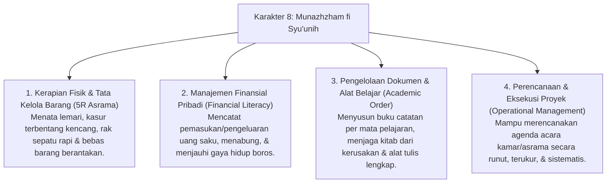

# P3-11-Munazhzham-fi-Syuunih-Induk (Karakter 8: Keteraturan Urusan Hidup)

## Tujuan
Menetapkan kerangka kapasitas menyeluruh untuk **Karakter 8: Munazhzham fi Syu'unih (Keteraturan & Manajemen Urusan Hidup)** dalam ekosistem pesantren TUMBUH: membentuk santri yang terampil menata urusan pribadi dan komunal secara rapi, apik, teratur, menguasai metode 5R di asrama, bijak mengelola uang saku, serta memiliki keterampilan manajerial kepemimpinan yang terstruktur.

---

## 1. 4 Dimensi Karakter Munazhzham fi Syu'unih

---

## 2. Matriks Rubrik 4 Level Capaian Munazhzham fi Syu'unih

| Dimensi Perilaku | Level 1: Emerging (T1) | Level 2: Developing (T2) | Level 3: Proficient (T3) | Level 4: Exemplary (T4 - Qudwah) |
| :--- | :--- | :--- | :--- | :--- |
| **Kerapian Lemari & Ranjang** | Pakaian menumpuk acak-acakan di lemari, kasur berantakan saat bangun tidur. | Merapikan kasur & lemari jika ada instruksi inspeksi dari musyrif. | Konsisten menerapkan 5R, lemari terlipat rapi bersusun & kasur selalu rapi. | Menjadi rujukan standar kerapian kamar, membimbing santri junior menata lemari. |
| **Pengelolaan Uang Saku** | Menghabiskan uang saku bulanan dalam hitungan hari, sering berhutang. | Mampu mengatur belanja harian, namun belum mencatat pengeluaran. | Disiplin mencatat buku kas keuangan pribadi & menyisihkan uang tabungan/infaq. | Mengedukasi rekan sekamar tentang literasi keuangan syariah & hemat pangkal kaya. |
| **Tata Kelola Belajar & Proyek** | Buku pelajaran sering tertinggal / hilang, catatan berserakan tidak rapi. | Membawa buku sesuai jadwal pelajaran, catatan cukup rapi. | Memiliki binder catatan terstruktur, arsip modul rapi & alat belajar terawat. | Mengkoordinir kepanitiaan acara asrama dengan dokumen SOP & timeline kerja presisi. |

---

## 3. Status Dokumen
* **Status**: 🌟 **A+ (Dokumen Induk Munazhzham fi Syu'unih)**
* **Level**: Project 3 - `03 Capacity Framework / 11 Munazhzham fi Syuunih`
* **Langkah Berikutnya**: Melengkapi sub-modul 01 hingga 14.
