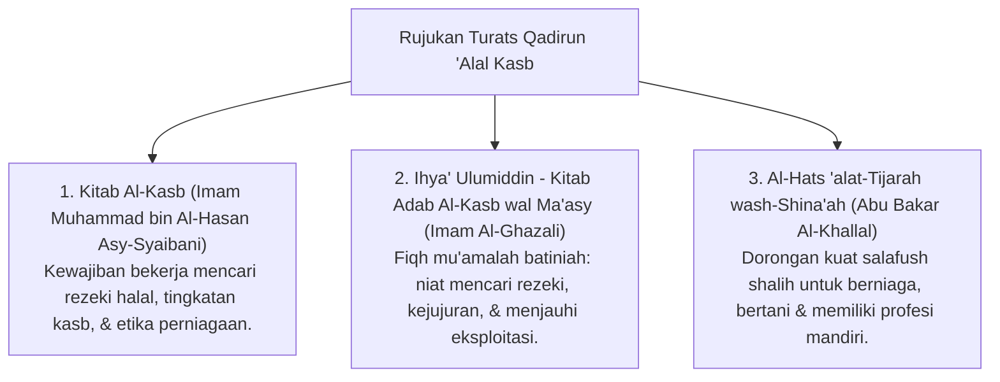

# P3-12-01-Filosofi-dan-Landasan-Turats (Qadirun 'Alal Kasb)

## Tujuan
Membedah landasan filosofis kemuliaan bekerja mencari rezeki yang halal (*Izzatul Mukmin bil 'Amal*), dalil Al-Qur'an/Hadits, dan rujukan kitab Turats tentang etos kerja perniagaan Islam.

---

## 1. Landasan Nash Al-Qur'an & As-Sunnah

### 1. QS. Al-Mulk [67]: 15
> هُوَ الَّذِي جَعَلَ لَكُمُ الْأَرْضَ ذَلُولًا فَامْشُوا فِي مَنَاكِبِهَا وَكُلُوا مِنْ رِزْقِهِ ۖ وَإِلَيْهِ النُّشُورُ
> *"Dialah yang menjadikan bumi untuk kamu yang mudah dijelajahi, maka jelajahilah di segala penjurunya dan makanlah sebagian dari rezeki-Nya. Dan hanya kepada-Nya-lah kamu (kembali setelah) dibangkitkan."*

### 2. HR. Bukhari (No. 2072)
> مَا أَكَلَ أَحَدٌ طَعَامًا قَطُّ، خَيْرًا مِنْ أَنْ يَأْكُلَ مِنْ عَمَلِ يَدِهِ، وَإِنَّ نَبِيَّ اللَّهِ دَاوُدَ عَلَيْهِ السَّلَامُ كَانَ يَأْكُلُ مِنْ عَمَلِ يَدِهِ
> *"Tidaklah seseorang memakan makanan yang lebih baik daripada apa yang dihasilkan dari jerih payah tangannya sendiri. Dan sesungguhnya Nabi Allah Daud 'alaihissalam biasa makan dari hasil karya tangannya sendiri."*

---

## 2. Rujukan Khazanah Turats Klasik

---

## 3. Status Dokumen
* **Status**: 🌟 **A+ (Tervalidasi & Siap Diimplementasikan)**
* **Level**: Project 3 - `03 Capacity Framework / 12 Qadirun Alal Kasb / 01 Philosophy`
