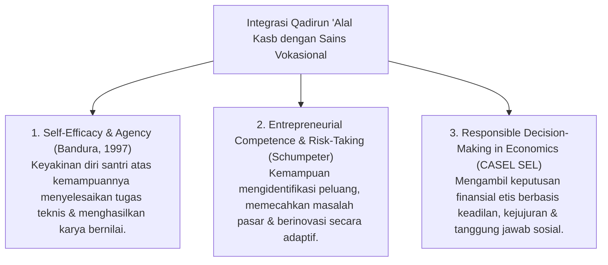

# P3-12-02-Definisi-dan-Konseptualisasi (Qadirun 'Alal Kasb)

## Tujuan
Menetapkan definisi operasional, batasan istilah, dan integrasi sains modern (*Entrepreneurial Mindset, Vocational Mastery & Self-Efficacy - CASEL SEL*) dari karakter **Qadirun 'Alal Kasb**.

---

## 1. Definisi Operasional Baku

> **Qadirun 'Alal Kasb dalam Ekosistem TUMBUH adalah:**  
> *"Kapasitas kemandirian ekonomi dan keterampilan vokasional terapan santri yang dibangun di atas etos kerja islami (*'Amal Shalih*), integritas mu'amalah syariah, daya cipta inovatif (*Entrepreneurship*), serta kecakapan mengurus kebutuhan hidup mandiri (*Life-Skills*) tanpa bergantung pada belas kasihan orang lain."*

---

## 2. Integrasi Konsep Sains & CASEL SEL

---

## 3. Status Dokumen
* **Status**: 🌟 **A+ (Tervalidasi & Siap Diimplementasikan)**
* **Level**: Project 3 - `03 Capacity Framework / 12 Qadirun Alal Kasb / 02 Definition`
