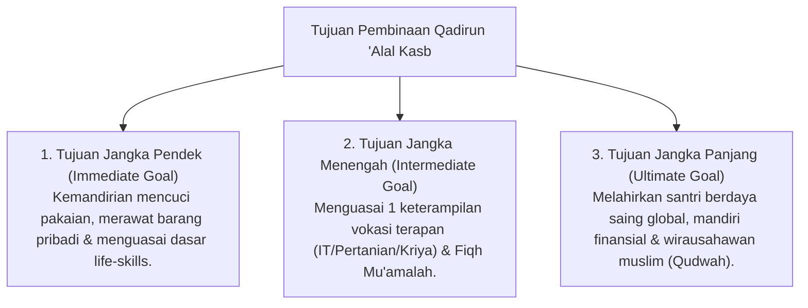

# P3-12-03-Tujuan-dan-Target-Capaian (Qadirun 'Alal Kasb)

## Tujuan
Menetapkan tujuan jangka pendek, menengah, dan panjang pembinaan karakter **Qadirun 'Alal Kasb** pada santri di lingkungan pesantren TUMBUH.

---

## 1. 3 Tingkatan Tujuan Pembinaan Kemandirian

---

## 2. Target Capaian Kuantitatif & Kualitatif

1. **Target Kuantitatif**:
   - 100% santri menguasai sekurang-kurangnya **1 sertifikasi keterampilan vokasi** saat lulus.
   - 100% santri mandiri tanpa ketergantungan jasa cuci pakaian berbayar di asrama.
2. **Target Kualitatif**:
   - Santri memiliki mental tangguh, bangga bekerja halal, dan memiliki orientasi kemandirian ekonomi umat (*Iqtishad Islamy*).

---

## 3. Status Dokumen
* **Status**: 🌟 **A+ (Tervalidasi & Siap Diimplementasikan)**
* **Level**: Project 3 - `03 Capacity Framework / 12 Qadirun Alal Kasb / 03 Purpose`
