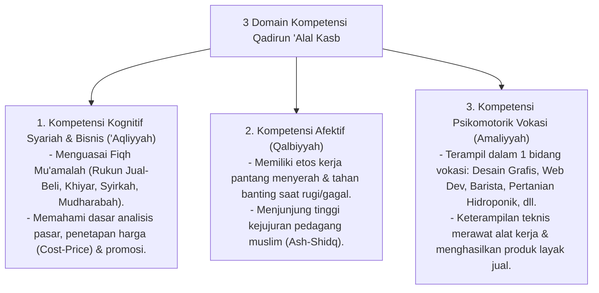

# P3-12-05-Standar-Kompetensi-dan-Taksonomi (Qadirun 'Alal Kasb)

## Tujuan
Menetapkan **Standar Capaian Pembelajaran & Taksonomi Kompetensi** karakter Qadirun 'Alal Kasb untuk seluruh jenjang santri di pesantren TUMBUH.

---

## 1. 3 Domain Kompetensi Qadirun 'Alal Kasb

---

## 2. Matriks Capaian Berjenjang Sesuai Tangga TUMBUH

* **Jenjang T1 (Kelas 7 / 10 Baru)**: Menguasai kemandirian cuci pakaian dan setrika sendiri, menjahit kancing, merawat alat sekolah mandiri.
* **Jenjang T2 (Kelas 8 / 11)**: Memilih peminatan vokasi (IT/Pertanian/Kriya/Kuliner), praktik dasar produksi karya, memahami Fiqh jual beli.
* **Jenjang T3 (Kelas 9 / 12)**: Menjalankan proyek wirausaha santri skala kecil (bazar/kantin jujur), menyusun laporan laba rugi mandiri.
* **Jenjang T4 (Santri Akhir / Teladan)**: Mengelola unit usaha pesantren, magang profesional, menghasilkan karya bernilai ekonomi tinggi (*Qudwah Kasb*).

---

## 3. Status Dokumen
* **Status**: 🌟 **A+ (Tervalidasi & Siap Diimplementasikan)**
* **Level**: Project 3 - `03 Capacity Framework / 12 Qadirun Alal Kasb / 05 Competencies`
