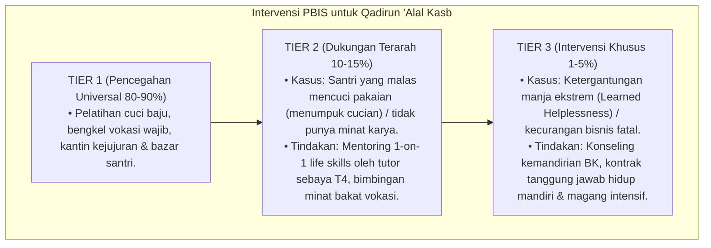

# P3-12-10-Protokol-Intervensi-dan-Pembiasaan (Qadirun 'Alal Kasb)

## Tujuan
Menetapkan protokol pembiasaan kemandirian asrama (*Independence SOP*) dan pemetaan intervensi bertingkat (*PBIS Multi-Tier Intervention*) untuk menghilangkan ketergantungan hidup santri.

---

## 1. Protokol Pembiasaan Rutin Asrama (Tier 1: Universal 100%)

1. **Jadwal Mencuci Mandiri Terjadwal (*Laundry Schedule*)**:
   - Seluruh santri mencuci pakaian secara mandiri pada hari yang telah dijadwalkan (3x sepekan).
2. **Kantin Kejujuran & Mini-Market Santri**:
   - Sarana latihan transaksi jujur, menimbang barang mandiri, dan membayar pas di kotak uang.
3. **Pemberian Apresiasi Karya Produk Terbaik (*Product of The Month*)**:
   - Menampilkan dan memamerkan karya santri berprestasi di etalase lobi pesantren.

---

## 2. Pemetaan Intervensi Khusus PBIS

---

## 3. Status Dokumen
* **Status**: 🌟 **A+ (Tervalidasi & Siap Diimplementasikan)**
* **Level**: Project 3 - `03 Capacity Framework / 12 Qadirun Alal Kasb / 10 Intervention Mapping`
