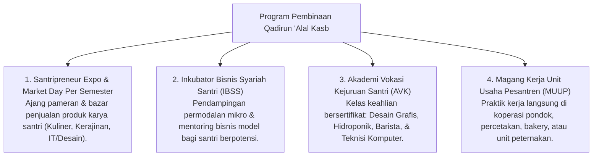

# P3-12-11-Program-Pembinaan-dan-Halaqah (Qadirun 'Alal Kasb)

## Tujuan
Menetapkan daftar program pembinaan vokasional terstruktur, inkubator bisnis, dan kegiatan wirausaha santri di pesantren TUMBUH.

---

## 1. 4 Program Unggulan Pembinaan Kemandirian

---

## 2. Status Dokumen
* **Status**: 🌟 **A+ (Tervalidasi & Siap Diimplementasikan)**
* **Level**: Project 3 - `03 Capacity Framework / 12 Qadirun Alal Kasb / 11 Programs`
