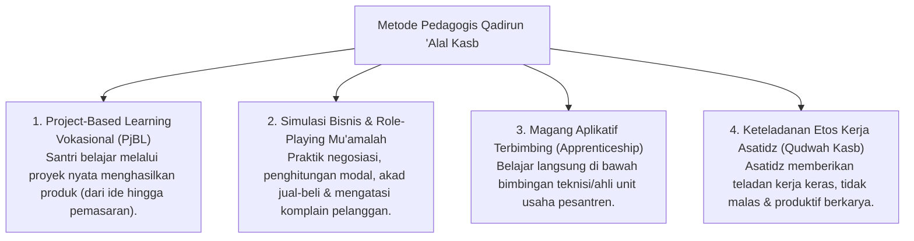

# P3-12-12-Metode-Pedagogi-dan-Didaktik-Kemandirian (Qadirun 'Alal Kasb)

## Tujuan
Menetapkan metode pedagogis dan pendekatan didaktik dalam melatihkan keterampilan vokasi, jiwa kewirausahaan, dan kemandirian praktis bagi santri.

---

## 1. 4 Metode Pedagogi Pengajaran Kemandirian

---

## 2. Status Dokumen
* **Status**: 🌟 **A+ (Tervalidasi & Siap Diimplementasikan)**
* **Level**: Project 3 - `03 Capacity Framework / 12 Qadirun Alal Kasb / 12 Methods`
