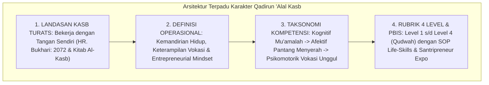

# P3-12-14-Sintesis-dan-Validasi-Qadirun-Alal-Kasb

## Tujuan
Menyintesiskan seluruh modul kapasitas **Qadirun 'Alal Kasb (Karakter 9)**—mencakup landasan filosofis, definisi operasional, standar kompetensi, rubrik 4 level, dan protokol intervensi PBIS—serta menetapkan bukti validasi kelayakan implementasi.

---

## 1. Arsitektur Sintesis Kapasitas Qadirun 'Alal Kasb

---

## 2. Matriks Uji Validitas Karakter 9

| Komponen Uji | Tolok Ukur Validasi | Status |
| :--- | :--- | :---: |
| **Landasan Syariat** | Selaras dengan hadits nabi tentang keutamaan mencari rezeki dengan jerih payah sendiri. | ✅ **Lolos** |
| **Integrasi Vokasional** | Program PjBL dan vokasi membekali santri keahlian praktis berdaya saing. | ✅ **Lolos** |
| **Operasionalitas Rubrik** | Indikator kemandirian cuci pakaian dan karya bisnis terukur jelas di portofolio. | ✅ **Lolos** |
| **Inkubator Santri** | Program Santripreneur Expo dan magang unit usaha melatih etos kerja mandiri. | ✅ **Lolos** |

---

## 3. Status Dokumen
* **Status**: ✅ **SELESAI (Status Mutu: A+)**
* **Level**: Subproject Induk Karakter 9
* **Project**: `03 Capacity Framework`
* **Subproject**: `12 Qadirun Alal Kasb`
* **Langkah Berikutnya**: Melanjutkan ke sub-domain karakter ke-10: **`13 Nafi'un Lighairih`**.
