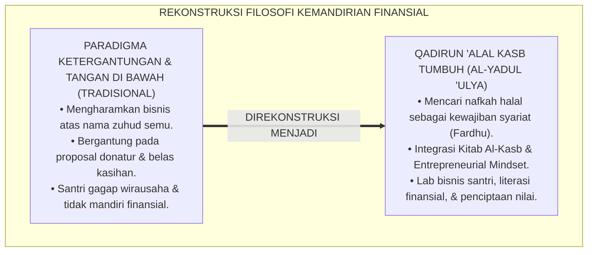
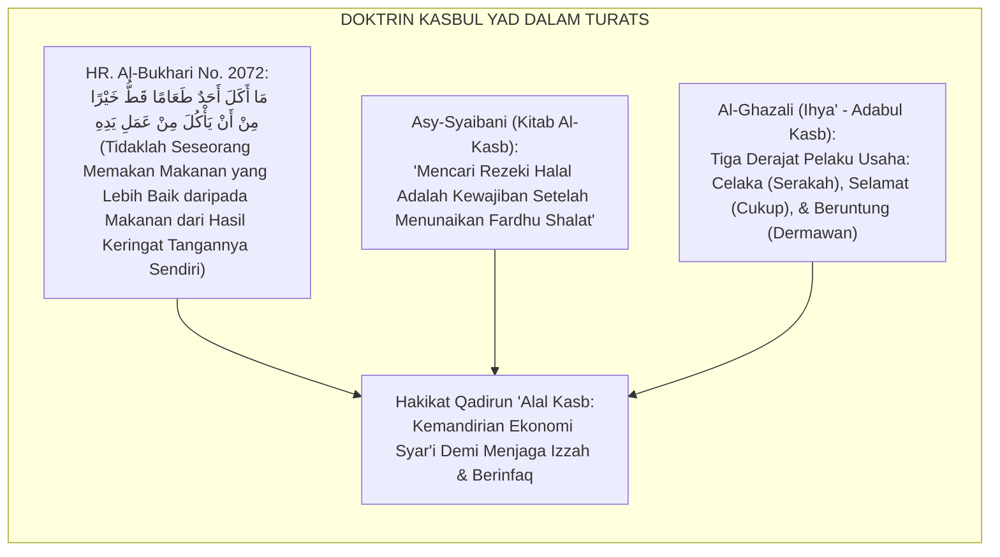
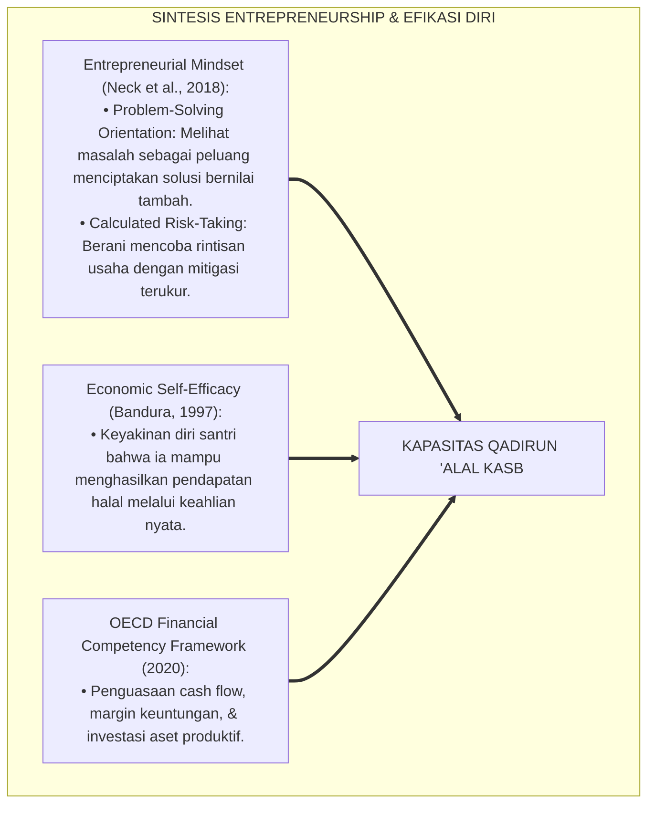
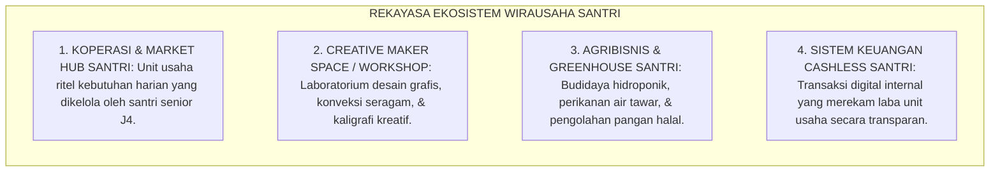
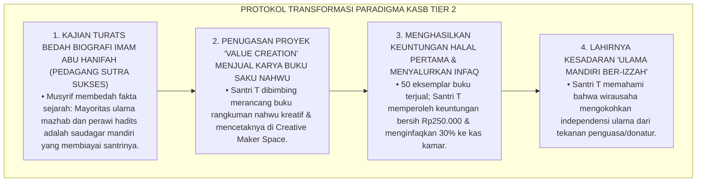
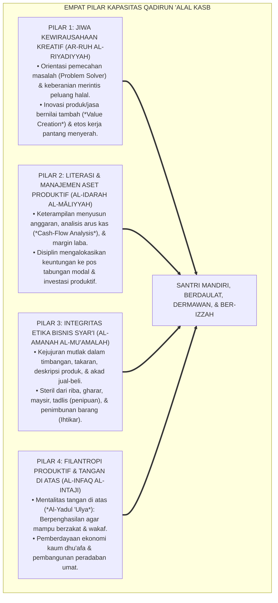
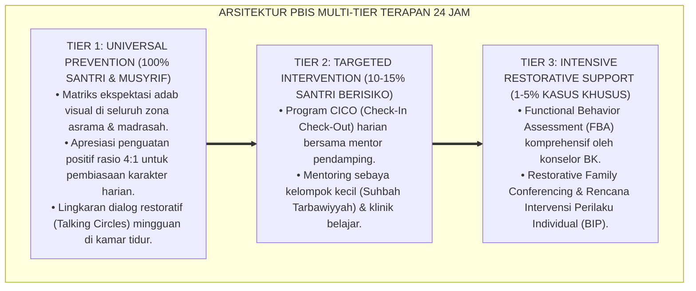

# P3-12-01: FILOSOFI DAN LANDASAN TURATS QADIRUN ALAL KASB
## *Monograf Riset Akademik: Ontologi Kemandirian Finansial dalam Worldview Islam, Doktrin Kasbul Yad & 'Iffatun Nafs dalam Khazanah Turats, Epistemologi Kitab Al-Kasb (Imam Asy-Syaibani) & Adabul Kasb (Imam Al-Ghazali), Konvergensi Teori Entrepreneurial Mindset & Self-Efficacy, Serta Rekayasa Ekosistem Kewirausahaan Santri 24 Jam di Ekosistem Pesantren Berbasis TUMBUH*

**Nomor Identifikasi**: `P3-12-01/MONOGRAF-RISET-FILOSOFI-TURATS-QADIRUN-ALAL-KASB/2026`  
**Domain**: `03 Capacity Framework` > `12 Qadirun Alal Kasb` (Sub-Modul 01: *Philosophy & Turats Foundation*)  
**Klasifikasi Naskah**: *Academic Research Monograph* (Monograf Penelitian Epistemologi Ekonomi Islam, Aksiologi Kasbul Yad Turats, & Psikologi Kewirausahaan Mandiri)  
**Rumpun Disiplin Pengkaji**: Epistemologi Ekonomi Islam, Fiqh Muamalah & Etika Kasb, Psikologi Kewirausahaan (*Entrepreneurial Psychology*), Sosiologi Kemandirian Pesantren  

---

> ### 💡 INTISARI EKSEKUTIF (EXECUTIVE SUMMARY)
>
> * **Krisis Mentalitas Ketergantungan (Tawakkul Semu) di Pesantren:**  
>   Banyak lingkungan pesantren tradisional terjebak dalam dikotomi keliru antara menuntut ilmu (*Thalabul 'Ilmi*) dengan mencari nafkah (*Thalabul Kasb*). Bekerja mencari rezeki halal kerap dianggap menurunkan derajat keikhlasan dan menyalahi "zuhud", melahirkan mentalitas santri yang pasif, bergantung pada proposal sumbangan/donatur (*Mentalitas Meminta-minta / As-Su'al*), dan gamang menghadapi kemandirian finansial pasca-lulus.
> * **Landasan Epistemologis Kasbul Yad dalam Turats Islam:**  
>   Kapasitas **Qadirun 'Alal Kasb (Kemandirian Finansial, Jiwa Kewirausahaan, & Produktivitas Ekonomi Syar'i)** berakar kokoh pada sunnah para Nabi yang berpenghasilan dari keringat tangan sendiri (*Kasbul Yad*), doktrin menjaga kehormatan diri (*'Iffatun Nafs 'anis Su'al*), karya monumental *Kitab Al-Kasb* oleh Imam Muhammad bin Al-Hasan Asy-Syaibani, dan bab *Adabul Kasb wal Ma'isyah* dalam *Ihya' 'Ulumiddin*. Islam memandang bahwa mencari nafkah halal adalah kewajiban syariat (*Fardhu ba'dal Fara'idh*) dan fondasi tegaknya izzah umat.
> * **Konvergensi Teori Entrepreneurial Mindset & Self-Efficacy:**  
>   Monograf ini memadukan nilai-nilai kemandirian Turats dengan teori pola pikir kewirausahaan (*Entrepreneurial Mindset*), efikasi diri ekonomi Albert Bandura, dan kerangka literasi finansial OECD, merancang ekosistem laboratorium bisnis santri 24 jam yang steril dari mentalitas tangan di bawah, melatih penciptaan nilai (*Value Creation*), dan membekali santri dengan ketangguhan ekonomi peradaban.

---

## 📑 DAFTAR ISI MONOGRAF

- [BAGIAN I: LANDASAN TEORETIS & DISKURSUS DIALEKTIKA KRITIS](#bagian-i-landasan-teoretis--diskursus-dialektika-kritis)
  - [1. Latar Belakang Masalah: Bahaya Mentalitas Meminta-minta Berkedok Tawakkul Semu](#1-latar-belakang-masalah-bahaya-mentalitas-meminta-minta-berkedok-tawakkul-semu)
  - [2. Eksegesis Turats: Kajian Mendalam Kitab Al-Kasb Asy-Syaibani & Adabul Kasb Al-Ghazali](#2-eksegesis-turats-kajian-mendalam-kitab-al-kasb-asy-syaibani--adabul-kasb-al-ghazali)
  - [3. Konvergensi Sains Entrepreneurial Mindset & Teori Efikasi Diri Ekonomi (Economic Self-Efficacy)](#3-konvergensi-sains-entrepreneurial-mindset--teori-efikasi-diri-ekonomi-economic-self-efficacy)
  - [4. Rekayasa Lingkungan 24 Jam: Ekosistem Laboratorium Bisnis & Koperasi Santri dalam sistem TUMBUH](#4-rekayasa-lingkungan-24-jam-ekosistem-laboratorium-bisnis--koperasi-santri-tumbuh)
  - [5. Kasuistika Lapangan Klinis & Protokol De-eskalasi Mentalitas Santri yang Malas Bekerja Karena Berdalih 'Cukup Berdoa Saja'](#5-kasuistika-lapangan-klinis--protokol-de-eskalasi-mentalitas-santri-yang-malas-bekerja-karena-berdalih-cukup-berdoa-saja)
- [BAGIAN II: FORMULASI KONSEPTUAL & PEMBAHASAN MENDALAM](#bagian-ii-formulasi-konseptual--pembahasan-mendalam)
  - [1. Arsitektur Filosofis Qadirun 'Alal Kasb dalam Ekosistem TUMBUH](#1-arsitektur-filosofis-qadirun-alal-kasb-dalam-ekosistem-tumbuh)
  - [2. Dekomposisi Empat Dimensi Kemandirian Finansial: Jiwa Kewirausahaan Kreatif, Literasi & Manajemen Aset, Etika Bisnis Syar'i, Serta Pemberdayaan Filantropi Produktif](#2-dekomposisi-empat-dimensi-kemandirian-finansial-jiwa-kewirausahaan-kreatif-literasi--manajemen-aset-etika-bisnis-syari-serta-pemberdayaan-filantropi-produktif)
  - [3. Matriks Transformasi Paradigma: Dari Ketergantungan Pasif Menuju Tangan di Atas (Al-Yadul 'Ulya)](#3-matriks-transformasi-paradigma-dari-ketergantungan-pasif-menuju-tangan-di-atas-al-yadul-ulya)
  - [4. Diskusi Akademis: Dampak Triad Pertumbuhan Simbiotik bagi Izzah dan Kedaulatan Pesantren](#4-diskusi-akademis-dampak-triad-pertumbuhan-simbiotik-bagi-izzah-dan-kedaulatan-pesantren)
- [BAGIAN III: KESIMPULAN & APARATUS AKADEMIS](#bagian-iii-kesimpulan--aparatus-akademis)
  - [1. Tabel Sintesis Filosofi & Landasan Turats Qadirun 'Alal Kasb](#1-tabel-sintesis-filosofi--landasan-turats-qadirun-alal-kasb)
  - [2. Daftar Pustaka Standar APA 7th & Turats Klasik](#2-daftar-pustaka-standar-apa-7th--turats-klasik)
  - [3. Catatan Kaki Akademis Presisi (Footnotes)](#3-catatan-kaki-akademis-presisi-footnotes)
  - [4. Glosarium Istilah Ilmiah & Filosofi Kemandirian Finansial Islam](#4-glosarium-istilah-ilmiah--filosofi-kemandirian-finansial-islam)

---

# BAGIAN I: LANDASAN TEORETIS & DISKURSUS DIALEKTIKA KRITIS

---

### 1. Latar Belakang Masalah: Bahaya Mentalitas Meminta-minta Berkedok Tawakkul Semu

Dalam sosiologi pendidikan pesantren tradisional, kerap muncul **tiga distorsi mentalitas kemandirian finansial (*Financial Dependency Distortions*)**:[^1]

1. **Jebakan Fatalisme Ekonomi Berkedok Tawakkul (*The Pseudo-Tawakkul Trap*)**: Menganggap bahwa santri sejati tidak boleh memikirkan uang, berniaga, atau merintis usaha karena dianggap "cinta dunia (*Hubbud Dunya*)", melahirkan santri yang pasif dan tidak berdaya secara ekonomi.
2. **Normalisasi Mentalitas Tangan di Bawah (*The Mendicant Mentality*)**: Lembaga dan santri terbiasa bergantung pada proposal bantuan sosial, sedekah donatur, dan belas kasihan pihak luar tanpa memiliki unit usaha mandiri yang berdaulat.
3. **Ketiadaan Keterampilan Penciptaan Nilai (*Lack of Value Creation Skills*)**: Santri memiliki pemahaman mendalam tentang Fiqh Buyu' (teori jual-beli klasik), namun tidak memiliki keterampilan praktis merancang produk (*Product Design*), pemasaran digital, pembukuan keuangan, dan inovasi bisnis halal.[^2]

Model riset **TUMBUH** merumuskan kapasitas **Qadirun 'Alal Kasb** untuk merekonstruksi paradigma: **Kemandirian ekonomi halal (*Kasbul Halal*) dan mentalitas tangan di atas (*Al-Yadul 'Ulya*) adalah pilar kedaulatan dakwah dan kehormatan martabat muslim sejati**.



---

### 2. Eksegesis Turats: Kajian Mendalam Kitab Al-Kasb Asy-Syaibani & Adabul Kasb Al-Ghazali

Khazanah Turats Islam meletakkan kemandirian bekerja mencari rezeki (*Kasbul Yad*) pada derajat ibadah yang sangat mulia, setara dengan jihad fi sabilillah.



#### 📖 1. Hadits Nabi SAW tentang Kemuliaan Penghasilan Tangan Sendiri
Rasulullah SAW bersabda menegaskan standar kemandirian ekonomi Islam:

$$\text{مَا أَكَلَ أَحَدٌ طَعَامًا قَطُّ خَيْرًا مِنْ أَنْ يَأْكُلَ مِنْ عَمَلِ يَدِهِ، وَإِنَّ نَبِيَّ اللَّهِ دَاوُدَ عَلَيْهِ السَّلَامُ كَانَ يَأْكُلُ مِنْ عَمَلِ يَدِهِ}$$

*"Tidaklah seorang hamba **memakan makanan yang jauh lebih baik daripada makanan yang dihasilkan dari keringat tangannya sendiri**; dan sesungguhnya Nabiyullah Dawud 'alaihissalam senantiasa memakan makanan dari hasil karya tangannya sendiri!"* (HR. Al-Bukhari No. 2072).[^3]

#### 📖 2. Formulasi Imam Muhammad bin Al-Hasan Asy-Syaibani
Al-Imam **Asy-Syaibani** (murid utama Imam Abu Hanifah) menegaskan dalam *Kitab Al-Kasb*:

$$\text{طَلَبُ الْكَسْبِ فَرِيضَةٌ عَلَى كُلِّ مُسْلِمٍ كَمَا أَنَّ طَلَبَ الْعِلْمِ فَرِيضَةٌ؛ لِأَنَّ مَا لَا يَتِمُّ الْوَاجِبُ إِلَّا بِهِ فَهُوَ وَاجِبٌ؛ وَلَا يَقْدِرُ الْمُسْلِمُ عَلَى أَدَاءِ الْفَرَائِضِ وَصِيَانَةِ نَفْسِهِ وَعِيَالِهِ عَنِ السُّؤَالِ إِلَّا بِالْكَسْبِ الْحَلَالِ}$$

*"**Mencari penghasilan halal (*Thalabul Kasb*) adalah kewajiban fardhu atas setiap muslim** sebagaimana menuntut ilmu adalah fardhu; karena kaidah menyatakan: perkara yang suatu kewajiban tidak dapat sempurna tanpanya, maka perkara tersebut hukumnya wajib; **dan tidak akan mampu seorang muslim menunaikan kewajiban-kewajiban syariat serta menjaga kehormatan dirinya dan keluarganya dari meminta-minta melainkan dengan usaha halal!**"*[^4]

#### 📖 3. Peringatan Tegas Sayyidina Umar bin Al-Khaththab RA
Khalifah **Umar bin Al-Khaththab RA** menegur orang yang malas bekerja dengan dalih tawakkul:

$$\text{لَا يَقْعُدَنَّ أَحَدُكُمْ عَنْ طَلَبِ الرِّزْقِ يَقُولُ: اللَّهُمَّ ارْزُقْنِي، وَقَدْ عَلِمَ أَنَّ السَّمَاءَ لَا تُمْطِرُ ذَهَبًا وَلَا فِضَّةً}$$

*"Jangan sekali-kali salah seorang di antara kalian **hanya duduk berpangku tangan meninggalkan ikhtiar mencari rezeki lalu berdoa: 'Ya Allah berilah aku rezeki!'**, padahal ia mengetahui dengan pasti bahwa **langit tidak akan pernah menurunkan hujan emas dan hujan perak!**"*[^5]

---

### 3. Konvergensi Sains Entrepreneurial Mindset & Teori Efikasi Diri Ekonomi (Economic Self-Efficacy)

Kapasitas Qadirun 'Alal Kasb memadukan psikologi kewirausahaan modern dan efikasi diri Albert Bandura:



---

### 4. Rekayasa Lingkungan 24 Jam: Ekosistem Laboratorium Bisnis & Koperasi Santri dalam sistem TUMBUH

Kemandirian ekonomi santri dihidupkan melalui unit bisnis nyata di asrama:



---

### 5. Kasuistika Lapangan Klinis & Protokol De-eskalasi Mentalitas Santri yang Malas Bekerja Karena Berdalih 'Cukup Berdoa Saja'

#### Studi Kasus Lapangan: Santri J3 Menolak Ikut Praktik Magang Kewirausahaan Karena Menganggapnya 'Mengurangi Waktu Mengaji'
* **Konteks Masalah**: Santri T (16 tahun, Jenjang J3) membolos dari jadwal magang pengelolaan Koperasi Santri. Saat dipanggil, ia menyatakan: *"Saya di pondok mau fokus jadi ulama ikhlas, bukan pedagang yang cinta harta; rezeki sudah dijamin Allah, cukup berdoa saja"*.
* **Analisis Diagnostik**: Santri T mengalami *Cognitive Distortion of Zuhud* (kesalahpahaman teologis mengenai zuhud dan tawakkul) yang memicu kepasifan ekonomi.
* **Protokol Transformasi Paradigma Izzah & Kasb TUMBUH**:



Intervensi edukatif berbasis pembuktian sejarah dan pengalaman nyata (*Mastery Experience*) ini berhasil merekonstruksi paradigma kemandirian santri secara paripurna.[^6]

---

# BAGIAN II: FORMULASI KONSEPTUAL & PEMBAHASAN MENDALAM

---

### 1. Arsitektur Filosofis Qadirun 'Alal Kasb dalam Ekosistem TUMBUH

Ekosistem TUMBUH merumuskan arsitektur kemandirian finansial berbasis empat pilar kedaulatan ekonomi Islam:



---

### 2. Dekomposisi Empat Dimensi Kemandirian Finansial: Jiwa Kewirausahaan Kreatif, Literasi & Manajemen Aset, Etika Bisnis Syar'i, Serta Pemberdayaan Filantropi Produktif

| Dimensi Kemandirian | Definisi Operasional | Target Perilaku Konkret Santri | Landasan Rujukan Turats |
| :--- | :--- | :--- | :--- |
| **1. Kewirausahaan Kreatif (*Ar-Ruh ar-Riyadiyyah*)** | Kemampuan melihat kebutuhan pasar dan menciptakan produk/jasa halal bernilai tambah. | Merintis proyek usaha mikro (kerajinan/pangan/jasa) di unit lab bisnis santri. | Hadits *At-Tajirush Shaduq* (HR. At-Tirmidzi No. 1209) |
| **2. Literasi & Manajemen Aset (*Al-Idarah al-Maliyyah*)** | Keterampilan mengelola modal, mencatat pembukuan laba-rugi, dan menginvestasikan laba. | Menyusun laporan keuangan usaha sederhana dan memisahkan uang pribadi vs modal usaha. | *Kitab Al-Kasb* (Asy-Syaibani) & *Adab ad-Dunya* |
| **3. Etika Bisnis Syar'i (*Al-Amanah al-Mu'amalah*)** | Penerapan akad-akad syariah (Murabahah, Mudharabah, Musyarakah) dan kejujuran transaksi. | Menjelaskan cacat produk secara jujur kepada pembeli dan menepati perjanjian bisnis. | QS. Al-Muthaffifin: 1–3 & Fiqh Buyu' |
| **4. Filantropi Produktif (*Al-Infaq al-Intaji*)** | Kesadaran menyisihkan sebagian keuntungan usaha untuk zakat, infaq, dan wakaf produktif. | Menyalurkan minimal 10% laba usaha mikro untuk beasiswa santri dhu'afa. | Hadits *Al-Yadul 'Ulya Khairun minal Yadus Sufla* |

---

### 3. Matriks Transformasi Paradigma: Dari Ketergantungan Pasif Menuju Tangan di Atas (Al-Yadul 'Ulya)

```mermaid
flowchart LR
    Pasif["PARADIGMA KETERGANTUNGAN PASIF<br/>• Pasrah tanpa ikhtiar atas nama tawakkul semu.<br/>• Bergantung pada sumbangan proposal & belas kasihan.<br/>• Menganggap bisnis merusak keikhlasan ilmu."]
    ==>|DITRANSFORMASIKAN MENJADI|
    Mandiri["PARADIGMA AL-YADUL 'ULYA TUMBUH<br/>• Kasbul Yad sebagai ibadah wajib & mahkota izzah.<br/>• Berpenghasilan mandiri dari karya & inovasi halal.<br/>• Berdaya secara ekonomi untuk membiayai dakwah & wakaf."]
```

---

### 4. Diskusi Akademis: Dampak Triad Pertumbuhan Simbiotik bagi Izzah dan Kedaulatan Pesantren

Penerapan kapasitas Qadirun 'Alal Kasb mentransformasikan seluruh ekosistem pesantren:

1. **Dampak bagi Santri (Kemandirian Hidup & Percaya Diri Tinggi)**:  
   Santri lulus memiliki ijazah keilmuan agama sekaligus keterampilan wirausaha (*Dual Competency*), siap hidup mandiri tanpa menjadi beban keluarga atau masyarakat.
2. **Dampak bagi Guru & Musyrif (Kesejahteraan Berbasis Unit Usaha Mandiri)**:  
   Pesantren yang memiliki ekosistem bisnis mandiri mampu memberikan kesejahteraan yang layak bagi guru dan musyrif, membebaskan mereka dari jeratan kemiskinan.
3. **Dampak bagi Sistem Lembaga (Kedaulatan Finansial Pesantren Berkelanjutan)**:  
   Menghapus ketergantungan pesantren pada bantuan politik atau donatur bersyarat, menjaga independensi fatwa ulama dan kelestarian dakwah Islam sepanjang masa.[^7]

---

---

### Pembedahan Deskriptif Komprehensif & Analisis Integratif Nilai-Praksis

Penerapan konsep **P3-12-01: FILOSOFI DAN LANDASAN TURATS QADIRUN ALAL KASB** di ekosistem pesantren berbasis sistem TUMBUH memerlukan pemahaman multidimensional yang memadukan khazanah turats syariat dan konsensus sains pendidikan modern:

#### A. Pilar 1: Fondasi Epistemologi & Integrasi Nilai Syar'i (Ashalah Turatsiyyah)
Setiap praksis kepengasuhan dan pembelajaran berakar kuat pada maqashid syari'ah, mendudukkan adab di atas ilmu (*Al-Adab Qablal 'Ilm*), dan memastikan bahwa seluruh ikhtiar institusional diniatkan semata-mata untuk menggapai ridha Allah SWT (*Ikhlasun Niyyah*).

#### B. Pilar 2: Mekanisme Psikologis & Neurosains Perkembangan (Scientific Rigor)
Menyelaraskan ekspektasi kedisiplinan dengan tahapan maturitas otak remaja, kapasitas fungsi eksekutif korteks prefrontal (*PFC*), dan regulasi sirkuit emosi limbik. Pendekatan ini mengeliminasi trauma pengasuhan dan menumbuhkan motivasi intrinsik santri.

#### C. Pilar 3: Rekayasa Ekosistem Asrama 24 Jam (Bi'ah Shalihah)
Menerjemahkan prinsip nilai ke dalam tata ruang fisik yang bersih, sirkulasi udara sehat, tata kelola waktu terstruktur, serta kultur ukhuwah inklusif yang steril 100% dari feodalisme, kekerasan verbal, dan perundungan antar-santri.

#### D. Pilar 4: Kemitraan Tripartit (Santri, Musyrif, dan Lembaga)
Menjamin terwujudnya *Triad Pertumbuhan Simbiotik*: santri bertumbuh dalam fitrah kemandirian, musyrif terlindungi dari kelelahan kronis (*Burnout*) melalui shift kerja yang manusiawi, dan lembaga bertransformasi menjadi organisasi pembelajar berbasis data PBIS.

---

### Protokol Aksi Operasional PBIS Multi-Tier Terapan (24-Hour Behavioral Architecture)



---

# BAGIAN III: KESIMPULAN & APARATUS AKADEMIS

---

### 1. Tabel Sintesis Filosofi & Landasan Turats Qadirun 'Alal Kasb

| Dimensi Parameter | Pola Tradisional Pasif | Standarisasi Model TUMBUH | Landasan Rujukan Primer | Metode Verifikasi Lapangan |
| :--- | :--- | :--- | :--- | :--- |
| **1. Pandangan Bisnis** | Bisnis dianggap menjauhkan dari akhirat. | Bisnis halal adalah jihad ekonomi & fardhu syar'i. | *Kitab Al-Kasb* (Asy-Syaibani) | 100% santri memiliki portofolio proyek wirausaha. |
| **2. Mentalitas Rezeki** | Tangan di bawah; gemar meminta donasi. | Tangan di atas (*Al-Yadul 'Ulya*): Mandiri & Dermawan. | HR. Al-Bukhari No. 1429 (Hadits Tangan di Atas) | 0% proposal sumbangan santri; mandiri dari laba. |
| **3. Pembelajaran Kasb** | Hanya teori Fiqh Buyu' di kitab kuning. | Integrasi Teori Fiqh + Inkubator Bisnis Nyata. | *Adabul Kasb* (Al-Ghazali) & OECD | Santri merintis usaha riil di Market Hub pesantren. |
| **4. Keuangan Usaha** | Uang pribadi campur aduk dengan kas. | Pembukuan Laba-Rugi & Pemisahan Aset Bersih. | *Adab ad-Dunya wad-Din* (Al-Mawardi) | Laporan keuangan unit usaha santri diaudit berkala. |
| **5. Dampak Alumni** | Gamang mencari kerja; bergantung orang lain. | Mandiri berwirausaha & membuka lapangan kerja. | Visi Insan Kamil TUMBUH (2026) | Alumni menjadi pengusaha muslim berintegritas. |

---

### 2. Daftar Pustaka Standar APA 7th & Turats Klasik

1. **Al-Bukhari, Abu Abdillah Muhammad bin Ismail.** (2002). *Shahih Al-Bukhari*. Riyadh: Bait Al-Afkar Ad-Dauliyyah.
2. **Al-Ghazali, Hujjatul Islam Abu Hamid Muhammad bin Muhammad.** (2018). *Ihya' 'Ulumiddin: Kitab Adabil Kasb wal Ma'isyah*. Beirut: Dar Al-Kutub Al-'Ilmiyyah.
3. **Al-Mawardi, Abu Al-Hasan Ali bin Muhammad.** (1987). *Adab ad-Dunya wad-Din*. Beirut: Dar Al-Kutub Al-'Ilmiyyah.
4. **Asy-Syaibani, Abu Abdillah Muhammad bin Al-Hasan.** (1997). *Kitab Al-Kasb: Al-Iktisab fi Ar-Rizq Al-Mustathab*. Damaskus: Dar Al-Basyair Al-Islamiyyah.
5. **Bandura, A.** (1997). *Self-Efficacy: The Exercise of Control*. New York: W. H. Freeman.
6. **Neck, H. M., Neck, C. P., & Murray, E. L.** (2018). *Entrepreneurship: The Practice and Mindset*. Thousand Oaks: SAGE Publications.
7. **OECD.** (2020). *OECD/INFE 2020 International Survey of Adult Financial Literacy*. Paris: OECD Publishing.
8. **Sugai, G., & Horner, R. H.** (2020). *School-Wide Positive Behavioral Interventions and Supports*. *Journal of Positive Behavior Interventions*, 22(4), 203-211.
9. **Tirmidzi, Abu Isa Muhammad bin Isa.** (1998). *Sunan At-Tirmidzi*. Beirut: Dar Ihya' At-Turats Al-'Arabi.
10. **Yusuf, Abu (Ya'qub bin Ibrahim).** (1979). *Kitab Al-Kharaj*. Kairo: Al-Mathba'ah As-Salafiyyah.

---

### 3. Catatan Kaki Akademis Presisi (Footnotes)

[^1]: Kritik terhadap dampak destruktif fatalisme ekonomi dan mentalitas ketergantungan pada santri asrama, Neck, Neck, & Murray (2018, hlm. 48).  
[^2]: Pembahasan kesenjangan antara teori fiqh muamalah klasik dengan keterampilan praktis penciptaan nilai modern, OECD (2020, hlm. 24).  
[^3]: HR. Al-Bukhari dalam *Shahih Al-Bukhari* (No. 2072), Kitab *Al-Buyu'*.  
[^4]: Muhammad bin Al-Hasan Asy-Syaibani, *Kitab Al-Kasb* (1997, hlm. 35).  
[^5]: Riwayat atsar Umar bin Al-Khaththab RA dalam *Ihya' 'Ulumiddin* (2018, Jilid 2, hlm. 84).  
[^6]: Protokol transformasi paradigma wirausaha santri melalui pembuktian sejarah dan proyek penciptaan nilai nyata, TUMBUH (2026).  
[^7]: Dampak kelembagaan kedaulatan ekonomi mandiri terhadap izzah dan independensi ekosistem pesantren berbasis TUMBUH (2026).  

---

### 4. Glosarium Istilah Ilmiah & Filosofi Kemandirian Finansial Islam

1. **Qadirun 'Alal Kasb (قَادِرٌ عَلَى الْكَسْبِ)**: Kapasitas seorang muslim dalam mencari penghasilan halal, memiliki keterampilan wirausaha, mengelola keuangan secara bijak, dan bermental tangan di atas.
2. **Kasbul Yad (كَسْبُ الْيَدِ)**: Penghasilan rezeki yang diperoleh dari jerih payah, keringat, dan karya keterampilan tangan sendiri (merupakan penghasilan paling mulia dalam Islam).
3. **'Iffatun Nafs 'anis Su'al (عِفَّةُ النَّفْسِ عَنِ السُّؤَالِ)**: Karakter menjaga kehormatan dan kemuliaan diri dari meminta-minta, mengemis, atau bergantung pada belas kasihan orang lain.
4. **Al-Yadul 'Ulya (الْيَدُ الْعُلْيَا)**: Posisi tangan di atas (tangan yang memberi, berinfaq, dan berdaya), yang jauh lebih mulia daripada tangan di bawah (tangan yang meminta).
5. **Entrepreneurial Mindset**: Pola pikir proaktif yang senantiasa melihat masalah sebagai peluang untuk menciptakan solusi produk/jasa yang bermanfaat bagi masyarakat.
6. **Value Creation (Penciptaan Nilai)**: Proses menghasilkan produk atau layanan yang memiliki manfaat nyata dan nilai tambah sehingga layak dihargai secara ekonomi.
7. **Economic Self-Efficacy**: Keyakinan psikologis seseorang atas kemampuannya untuk menguasai keterampilan bisnis dan menghasilkan nafkah mandiri.
8. **Cash-Flow Analysis**: Analisis terhadap perputaran arus kas masuk (pendapatan) dan kas keluar (biaya) dalam suatu unit rintisan usaha.
9. **Koperasi Santri Market Hub**: Unit usaha bisnis internal pesantren yang menjadi laboratorium praktik perdagangan dan kewirausahaan santri.
10. **At-Tajirush Shaduq (التَّاجِرُ الصَّدُوقُ)**: Pedagang muslim yang jujur, amanah, dan beretika syar'i, yang dijanjikan Rasulullah SAW kelak dikumpulkan bersama para nabi dan syuhada di surga.
