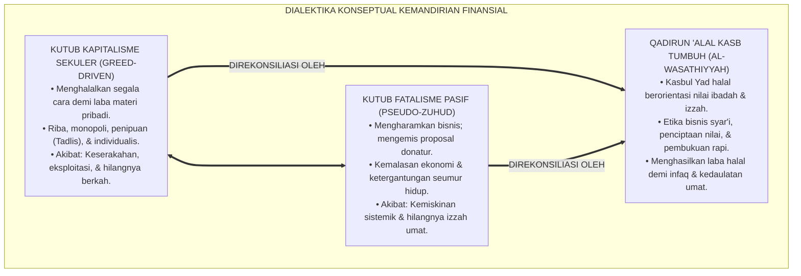
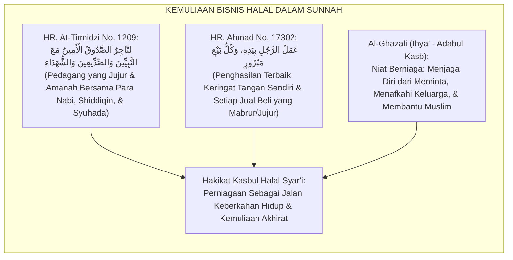
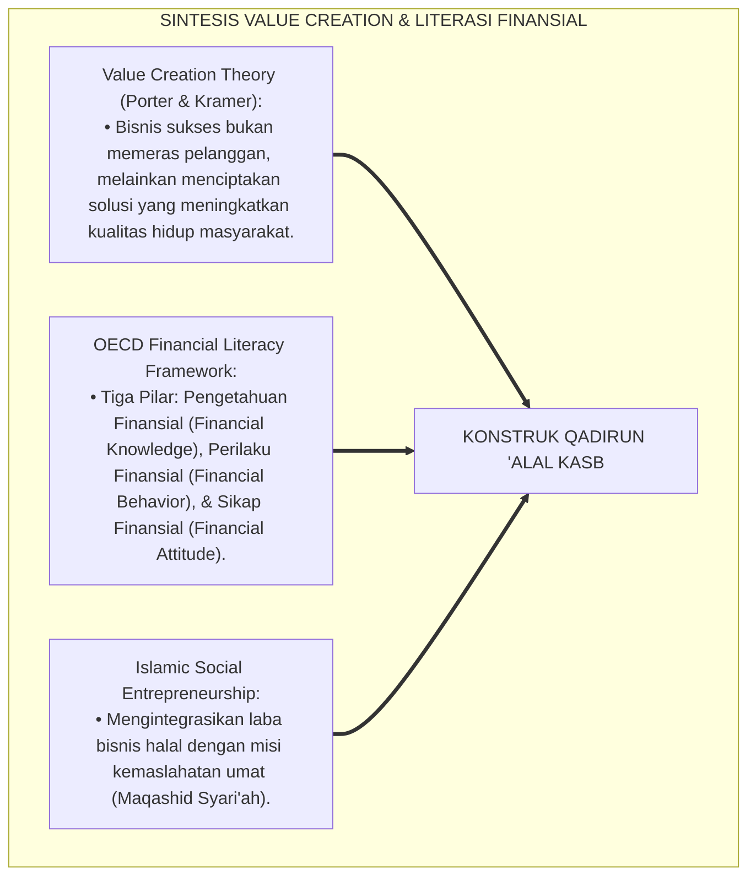
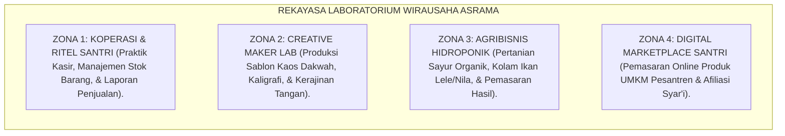
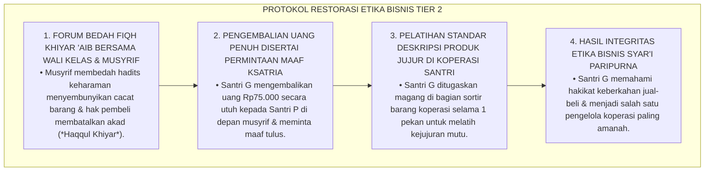
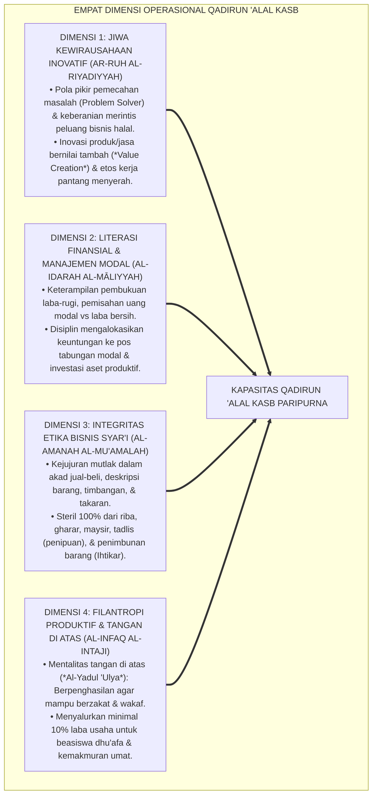
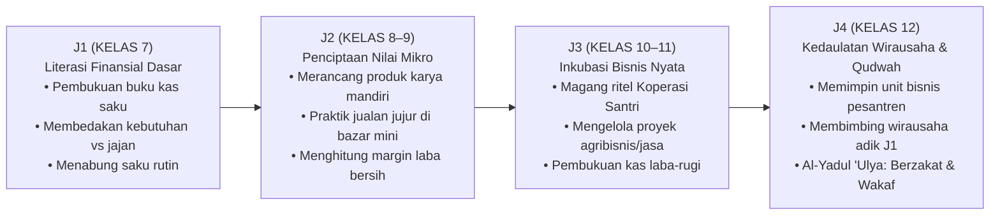
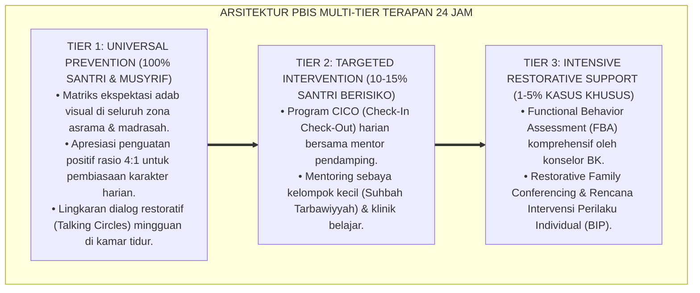

# P3-12-02: DEFINISI DAN KONSEPTUALISASI QADIRUN ALAL KASB
## *Monograf Riset Akademik: Ontologi & Batas Definisional Kemandirian Finansial Islami, Konstruk Empat Dimensi Produktivitas Ekonomi 24 Jam (Jiwa Kewirausahaan Inovatif, Literasi Finansial & Pembukuan Kas, Etika Muamalah Bebas Riba/Gharar, Serta Filantropi Produktif Berdaya), Dialektika Kemandirian Berkah vs Kapitalisme Serakah Sekuler / Fatalisme Pasif Feodal, Serta Formulasi Operasional di Pesantren TUMBUH*

**Nomor Identifikasi**: `P3-12-02/MONOGRAF-RISET-DEFINISI-KONSEPTUALISASI-QADIRUN-ALAL-KASB/2026`  
**Domain**: `03 Capacity Framework` > `12 Qadirun Alal Kasb` (Sub-Modul 02: *Definition & Conceptualization*)  
**Klasifikasi Naskah**: *Academic Research Monograph* (Monograf Penelitian Konstruk Teoretis, Taksonomi Definisi Operasional, & Integrasi Ekonomi Islam-Kewirausahaan Modern)  
**Rumpun Disiplin Pengkaji**: Manajemen Kewirausahaan Islami, Psikologi Ekonomi Terapan, Fiqh Muamalah Finansial, Sosiologi Kedaulatan Pesantren  

---

> ### 💡 INTISARI EKSEKUTIF (EXECUTIVE SUMMARY)
>
> * **Kelemahan Definisi Kemandirian Finansial Konvensional:**  
>   Banyak pengasuh memandang "kemandirian ekonomi" santri hanya sebatas bazar makanan tahunan (*Bazaar Day*) atau kegiatan kerja bakti asrama, tanpa sistem inkubasi bisnis, pembukuan laba-rugi, dan pendidikan etika muamalah syariah yang aplikatif. Di sisi lain, sebagian memandang bisnis secara materialistis (*Capitalistic Greed*) yang mengikis nilai-nilai ketakwaan dan keikhlasan santri.
> * **Definisi Konseptual Qadirun 'Alal Kasb TUMBUH:**  
>   Ekosistem TUMBUH mendefinisikan **Qadirun 'Alal Kasb** sebagai: *Kapasitas kesadaran tauhid, keterampilan wirausaha, dan kecakapan tata kelola finansial seorang santri dalam menciptakan nilai tambah (Value Creation) melalui ikhtiar halal yang profesional, mengelola aset secara amanah dan produktif, beretika syar'i steril dari riba dan penipuan, serta memiliki kedaulatan ekonomi untuk berinfaq dan membangun kemakmuran peradaban umat.*
> * **Empat Dimensi Operasional Berkelanjutan:**  
>   Konstruk ini diartikulasikan ke dalam 4 dimensi inti: (1) *Jiwa Kewirausahaan Inovatif & Penciptaan Nilai*, (2) *Literasi Finansial, Pembukuan Kas, & Manajemen Modal*, (3) *Integritas Etika Bisnis Syar'i (Bebas Riba, Gharar, & Tadlis)*, dan (4) *Filantropi Produktif & Mentalitas Tangan di Atas (Al-Yadul 'Ulya)*.

---

## 📑 DAFTAR ISI MONOGRAF

- [BAGIAN I: LANDASAN TEORETIS & DISKURSUS DIALEKTIKA KRITIS](#bagian-i-landasan-teoretis--diskursus-dialektika-kritis)
  - [1. Latar Belakang Masalah: Bahaya Bazar Seremonial vs Kebutuhan Sistem Inkubasi Bisnis Nyata](#1-latar-belakang-masalah-bahaya-bazar-seremonial-vs-kebutuhan-sistem-inkubasi-bisnis-nyata)
  - [2. Eksegesis Turats: Konsep Al-Kasbul Halal & Kehormatan Harta dalam Hadits & Kitab Fiqh](#2-eksegesis-turats-konsep-al-kasbul-halal--kehormatan-harta-dalam-hadits--kitab-fiqh)
  - [3. Konvergensi Teori Penciptaan Nilai (Value Creation) & Literasi Finansial Remaja (OECD)](#3-konvergensi-teori-penciptaan-nilai-value-creation--literasi-finansial-remaja-oecd)
  - [4. Rekayasa Ekosistem 24 Jam: Laboratorium Ritel Koperasi & Agribisnis Santri](#4-rekayasa-ekosistem-24-jam-laboratorium-ritel-koperasi--agribisnis-santri)
  - [5. Kasuistika Lapangan Klinis & Protokol De-eskalasi Santri yang Menjual Barang dengan Menipu Kawan Sekamar (Tadlis & Gharar)](#5-kasuistika-lapangan-klinis--protokol-de-eskalasi-santri-yang-menjual-barang-dengan-menipu-kawan-sekamar-tadlis--gharar)
- [BAGIAN II: FORMULASI KONSEPTUAL & PEMBAHASAN MENDALAM](#bagian-ii-formulasi-konseptual--pembahasan-mendalam)
  - [1. Formulasi Konstruk Teoretis Empat Dimensi Qadirun 'Alal Kasb](#1-formulasi-konstruk-teoretis-empat-dimensi-qadirun-alal-kasb)
  - [2. Matriks Dialektika: Kemandirian Finansial Syar'i vs Kapitalisme Serakah vs Fatalisme Pasif](#2-matriks-dialektika-kemandirian-finansial-syari-vs-kapitalisme-serakah-vs-fatalisme-pasif)
  - [3. Matriks Progresi Kemandirian Wirausaha Jenjang J1–J4](#3-matriks-progresi-kemandirian-wirausaha-jenjang-j1j4)
  - [4. Diskusi Akademis: Integrasi Spiritualitas Taqwa dan Kedaulatan Ekonomi di Pesantren](#4-diskusi-akademis-integrasi-spiritualitas-taqwa-dan-kedaulatan-ekonomi-di-pesantren)
- [BAGIAN III: KESIMPULAN & APARATUS AKADEMIS](#bagian-iii-kesimpulan--aparatus-akademis)
  - [1. Tabel Sintesis Definisi & Konseptualisasi Qadirun 'Alal Kasb](#1-tabel-sintesis-definisi--konseptualisasi-qadirun-alal-kasb)
  - [2. Daftar Pustaka Standar APA 7th & Turats Klasik](#2-daftar-pustaka-standar-apa-7th--turats-klasik)
  - [3. Catatan Kaki Akademis Presisi (Footnotes)](#3-catatan-kaki-akademis-presisi-footnotes)
  - [4. Glosarium Istilah Ilmiah & Konseptualisasi Kemandirian Finansial](#4-glosarium-istilah-ilmiah--konseptualisasi-kemandirian-finansial)

---

# BAGIAN I: LANDASAN TEORETIS & DISKURSUS DIALEKTIKA KRITIS

---

### 1. Latar Belakang Masalah: Bahaya Bazar Seremonial vs Kebutuhan Sistem Inkubasi Bisnis Nyata

Dalam dinamika pembinaan kewirausahaan di pesantren tradisional, kerap timbul **tiga paradoks konseptual (*Conceptual Paradoxes*)**:[^1]

1. **Jebakan Bazar Seremonial Tahunan (*The Annual Bazaar Trap*)**: Kewirausahaan hanya diajarkan sekali setahun dalam bentuk bazar makanan ringan di mana santri menjual barang titipan orang tua tanpa memahami analisis margin laba, pencatatan modal, dan kepuasan pelanggan.
2. **Ketiadaan Pembelajaran Literasi Finansial & Risiko Bisnis**: Santri tidak diajarkan cara membedakan omset kotor vs laba bersih, sehingga uang modal terpakai habis untuk jajan konsumtif.
3. **Keterpisahan Teori Fiqh Muamalah dengan Realitas Bisnis Modern**: Santri menghafal matan fiqh tentang akad *Saram* dan *Mudharabah*, namun bingung menerapkannya saat merintis usaha desain grafis atau penjualan madu halal di asrama.[^2]

Model riset **TUMBUH** merumuskan **Sistem Inkubasi Kewirausahaan Santri Berkelanjutan**: kewirausahaan bukanlah event hiburan sesaat, melainkan **keterampilan hidup (*Life Skill*) dan mentalitas kemandirian dakwah sepanjang hayat**.

---

### 2. Eksegesis Turats: Konsep Al-Kasbul Halal & Kehormatan Harta dalam Hadits & Kitab Fiqh

Rasulullah SAW memuji pedagang yang jujur dan amanah serta meletakkan kedudukan mereka bersama para nabi dan syuhada di akhirat.

#### 📖 1. Hadits Riwayat Abu Sa'id Al-Khudri RA
Rasulullah SAW bersabda:

$$\text{التَّاجِرُ الصَّدُوقُ الْأَمِينُ مَعَ النَّبِيِّينَ وَالصِّدِّيقِينَ وَالشُّهَدَاءِ}$$

*"**Pedagang yang senantiasa jujur dan terpercaya (*Ash-Shaduq Al-Amin*)** kelak di hari kiamat akan dikumpulkan **bersama para Nabi, kaum Shiddiqin, dan para Syuhada!**"* (HR. At-Tirmidzi No. 1209).[^3]

#### 📖 2. Hadits Riwayat Rafi' bin Khadij RA
Rasulullah SAW ditanya tentang jenis penghasilan terbaik:

$$\text{سُئِلَ النَّبِيُّ صَلَّى اللَّهُ عَلَيْهِ وَسَلَّمَ: أَيُّ الْكَسْبِ أَطْيَبُ؟ قَالَ: عَمَلُ الرَّجُلِ بِيَدِهِ، وَكُلُّ بَيْعٍ مَبْرُورٍ}$$

*"Nabi SAW ditanya: 'Pekerjaan/penghasilan apakah yang paling thayyib (paling suci dan berkah)?' Beliau menjawab: **'Karya usaha seseorang dengan tangannya sendiri, dan setiap perniagaan yang mabrūr (jujur, bersih dari riba, dan tanpa penipuan)!'**"* (HR. Ahmad No. 17302).[^4]

---

### 3. Konvergensi Teori Penciptaan Nilai (Value Creation) & Literasi Finansial Remaja (OECD)

Konsep Qadirun 'Alal Kasb memadukan teori penciptaan nilai bisnis dan standar literasi keuangan global:

---

### 4. Rekayasa Ekosistem 24 Jam: Laboratorium Ritel Koperasi & Agribisnis Santri

Penerapan konsep kemandirian didukung oleh unit usaha nyata di asrama:

---

### 5. Kasuistika Lapangan Klinis & Protokol De-eskalasi Santri yang Menjual Barang dengan Menipu Kawan Sekamar (Tadlis & Gharar)

#### Studi Kasus Lapangan: Santri J2 Menjual Jam Tangan Rusak Kepada Santri Junior J1 dengan Harga Normal
* **Konteks Masalah**: Santri G (14 tahun, Jenjang J2) menjual jam tangan bekas miliknya seharga Rp75.000 kepada adik kelas Santri P (12 tahun, Jenjang J1). Santri G menyembunyikan fakta bahwa jarum jam tersebut sering macet (*Tadlis / Concealment of Defect*). Dua hari kemudian, jam tersebut mati total, memicu tangisan santri junior dan kemarahan orang tuanya.
* **Analisis Diagnostik**: Santri G mengalami *Ethical Muamalah Blindspot* (terdorong mencari keuntungan cepat tanpa mengindahkan kejujuran syariat).
* **Protokol Resolusi Restoratif Khiyar 'Aib TUMBUH**:

Intervensi fiqh aplikatif ini menanamkan integritas moral perniagaan dan melindungi santri dari dosa memakan harta batil.[^5]

---

# BAGIAN II: FORMULASI KONSEPTUAL & PEMBAHASAN MENDALAM

---

### 1. Formulasi Konstruk Teoretis Empat Dimensi Qadirun 'Alal Kasb

Kapasitas Qadirun 'Alal Kasb dibangun di atas empat dimensi operasional terukur:

---

### 2. Matriks Dialektika: Kemandirian Finansial Syar'i vs Kapitalisme Serakah vs Fatalisme Pasif

| Parameter Evaluasi | Kapitalisme Serakah (*Greed-Driven*) | Fatalisme Pasif (*Pseudo-Zuhud*) | Kemandirian Syar'i (TUMBUH) |
| :--- | :--- | :--- | :--- |
| **1. Orientasi Tujuan** | Akumulasi kekayaan materi & kemewahan. | Menolak uang; menganggap harta sumber fitnah. | Meraih ridha Allah, izzah diri, & sarana infaq. |
| **2. Cara Memperoleh** | Menghalalkan riba, monopoli, & penipuan. | Pasrah tanpa kerja; meminta donasi proposal. | *Kasbul Yad* halal, jujur, profesional, & mabrur. |
| **3. Perlakuan Keuntungan** | Ditimbun untuk foya-foya konsumtif (*Israf*). | Tidak ada keuntungan; hidup serba kekurangan. | Dibagi proporsional: Modal, tabungan, & wakaf. |
| **4. Mentalitas Diri** | Sombong (*Kibr*), materialistis, kikir. | Rendah diri, pasif, bermental tangan di bawah. | Percaya diri, mulia (*'Iffah*), dermawan, ber-izzah. |
| **5. Dampak Dakwah** | Dakwah dikomersialisasi demi uang. | Dakwah lemah karena bergantung pada donatur. | Dakwah berdaulat, mandiri, dan berwibawa tinggi. |

---

### 3. Matriks Progresi Kemandirian Wirausaha Jenjang J1–J4

---

### 4. Diskusi Akademis: Integrasi Spiritualitas Taqwa dan Kedaulatan Ekonomi di Pesantren

Konseptualisasi Qadirun 'Alal Kasb membuktikan bahwa:

1. **Kemandirian Finansial Memperkuat Ketakwaan & Keikhlasan**: Ulama yang memiliki kemandirian ekonomi tidak dapat dibeli fatwanya oleh penguasa zalim atau kepentingan politik donatur.
2. **Keterampilan Wirausaha Meningkatkan Ketahanan Hidup Santri**: Santri siap menghadapi tantangan disrupsi ekonomi global dengan mentalitas kreatif dan tangguh (*Resilient Entrepreneur*).
3. **Penyempurnaan Wajah Peradaban Pesantren yang Berdaulat**: Menjadikan pesantren sebagai pusat pemberdayaan ekonomi umat yang makmur, mandiri, dan bermartabat tinggi.[^6]

---

---

### Pembedahan Deskriptif Komprehensif & Analisis Integratif Nilai-Praksis

Penerapan konsep **P3-12-02: DEFINISI DAN KONSEPTUALISASI QADIRUN ALAL KASB** di ekosistem pesantren TUMBUH memerlukan pemahaman multidimensional yang memadukan khazanah turats syariat dan konsensus sains pendidikan modern:

#### A. Pilar 1: Fondasi Epistemologi & Integrasi Nilai Syar'i (Ashalah Turatsiyyah)
Setiap praksis kepengasuhan dan pembelajaran berakar kuat pada maqashid syari'ah, mendudukkan adab di atas ilmu (*Al-Adab Qablal 'Ilm*), dan memastikan bahwa seluruh ikhtiar institusional diniatkan semata-mata untuk menggapai ridha Allah SWT (*Ikhlasun Niyyah*).

#### B. Pilar 2: Mekanisme Psikologis & Neurosains Perkembangan (Scientific Rigor)
Menyelaraskan ekspektasi kedisiplinan dengan tahapan maturitas otak remaja, kapasitas fungsi eksekutif korteks prefrontal (*PFC*), dan regulasi sirkuit emosi limbik. Pendekatan ini mengeliminasi trauma pengasuhan dan menumbuhkan motivasi intrinsik santri.

#### C. Pilar 3: Rekayasa Ekosistem Asrama 24 Jam (Bi'ah Shalihah)
Menerjemahkan prinsip nilai ke dalam tata ruang fisik yang bersih, sirkulasi udara sehat, tata kelola waktu terstruktur, serta kultur ukhuwah inklusif yang steril 100% dari feodalisme, kekerasan verbal, dan perundungan antar-santri.

#### D. Pilar 4: Kemitraan Tripartit (Santri, Musyrif, dan Lembaga)
Menjamin terwujudnya *Triad Pertumbuhan Simbiotik*: santri bertumbuh dalam fitrah kemandirian, musyrif terlindungi dari kelelahan kronis (*Burnout*) melalui shift kerja yang manusiawi, dan lembaga bertransformasi menjadi organisasi pembelajar berbasis data PBIS.

---

### Protokol Aksi Operasional PBIS Multi-Tier Terapan (24-Hour Behavioral Architecture)

---

# BAGIAN III: KESIMPULAN & APARATUS AKADEMIS

---

### 1. Tabel Sintesis Definisi & Konseptualisasi Qadirun 'Alal Kasb

| Dimensi Konstruk | Definisi Operasional | Landasan Nash Turats | Indikator Kinerja Lapangan |
| :--- | :--- | :--- | :--- |
| **1. Kewirausahaan Kreatif** | Kemampuan melihat masalah pasar dan menciptakan produk/jasa halal bernilai tambah. | *Al-Kasbul Halal Fardhun* (Kitab Al-Kasb) | 100% santri memiliki portofolio produk wirausaha. |
| **2. Literasi Finansial** | Mengelola modal usaha, mencatat pembukuan laba-rugi, dan memisahkan uang pribadi. | QS. Al-Baqarah: 282 & *Adab ad-Dunya* | Laporan keuangan unit usaha santri seimbang & rapi. |
| **3. Etika Bisnis Syar'i** | Menerapkan akad-akad syariah dan kejujuran mutlak bebas riba, gharar, & tadlis. | Hadits *At-Tajirush Shaduq* (HR. At-Tirmidzi) | 0% kasus penipuan / sengketa jual-beli di asrama. |
| **4. Filantropi Produktif** | Menyalurkan sebagian laba usaha untuk zakat, infaq, dan wakaf kemaslahatan umat. | Hadits *Al-Yadul 'Ulya* (HR. Al-Bukhari) | Minimal 10% laba proyek disalurkan ke kas filantropi. |

---

### 2. Daftar Pustaka Standar APA 7th & Turats Klasik

1. **Ahmad bin Hanbal.** (2001). *Musnad Al-Imam Ahmad bin Hanbal*. Kairo: Mu'assasat Ar-Risalah.
2. **Al-Bukhari, Abu Abdillah Muhammad bin Ismail.** (2002). *Shahih Al-Bukhari*. Riyadh: Bait Al-Afkar Ad-Dauliyyah.
3. **Al-Ghazali, Hujjatul Islam Abu Hamid Muhammad bin Muhammad.** (2018). *Ihya' 'Ulumiddin: Kitab Adabil Kasb wal Ma'isyah*. Beirut: Dar Al-Kutub Al-'Ilmiyyah.
4. **Al-Mawardi, Abu Al-Hasan Ali bin Muhammad.** (1987). *Adab ad-Dunya wad-Din*. Beirut: Dar Al-Kutub Al-'Ilmiyyah.
5. **Asy-Syaibani, Abu Abdillah Muhammad bin Al-Hasan.** (1997). *Kitab Al-Kasb: Al-Iktisab fi Ar-Rizq Al-Mustathab*. Damaskus: Dar Al-Basyair Al-Islamiyyah.
6. **Neck, H. M., Neck, C. P., & Murray, E. L.** (2018). *Entrepreneurship: The Practice and Mindset*. Thousand Oaks: SAGE Publications.
7. **Nelsen, J.** (2006). *Positive Discipline*. New York: Ballantine Books.
8. **OECD.** (2020). *OECD/INFE 2020 International Survey of Adult Financial Literacy*. Paris: OECD Publishing.
9. **Porter, M. E., & Kramer, M. R.** (2011). *Creating shared value*. *Harvard Business Review*, 89(1/2), 62-77.
10. **Tirmidzi, Abu Isa Muhammad bin Isa.** (1998). *Sunan At-Tirmidzi*. Beirut: Dar Ihya' At-Turats Al-'Arabi.

---

### 3. Catatan Kaki Akademis Presisi (Footnotes)

[^1]: Kritik terhadap kelemahan bazar seremonial tanpa sistem inkubasi bisnis berkelanjutan, Neck, Neck, & Murray (2018, hlm. 56).  
[^2]: Pembahasan pentingnya kurikulum literasi finansial praktis berbasis penciptaan nilai, OECD (2020, hlm. 30).  
[^3]: HR. At-Tirmidzi dalam *Sunan At-Tirmidzi* (No. 1209), Kitab *Al-Buyu'*.  
[^4]: HR. Ahmad dalam *Musnad Al-Imam Ahmad bin Hanbal* (No. 17302).  
[^5]: Protokol penanganan de-eskalasi penipuan jual-beli melalui penegakan fiqh khiyar 'aib, TUMBUH (2026).  
[^6]: Dampak kelembagaan penerapan konsep kemandirian finansial syar'i TUMBUH Pesantren (2026).  

---

### 4. Glosarium Istilah Ilmiah & Konseptualisasi Kemandirian Finansial

1. **Value Creation (Penciptaan Nilai)**: Proses inovatif merancang produk atau layanan halal yang memecahkan masalah nyata masyarakat sehingga menghasilkan nilai ekonomi.
2. **Ar-Ruh ar-Riyadiyyah (الرُّوحُ الرِّيَادِيَّةُ)**: Jiwa kewirausahaan Islam yang bercirikan keberanian berikhtiar, pantang menyerah, kreatif, dan berorientasi manfaat peradaban.
3. **Al-Amanah al-Mu'amalah (الْأَمَانَةُ الْمُعَامَلِيَّةُ)**: Integritas moral dan kepatuhan syariah dalam seluruh transaksi perdagangan, bebas dari riba, penipuan, dan monopoli.
4. **Tadlīs (التَّدْلِيسُ)**: Tindakan menyembunyikan cacat atau kelemahan barang dagangan dari pandangan pembeli (diharamkan secara mutlak dalam syariat Islam).
5. **Gharar (الْغَرَرُ)**: Ketidakjelasan, spekulasi berlebih, atau kerancuan dalam akad jual-beli yang berpotensi merugikan salah satu pihak.
6. **Khiyārul 'Aib (خِيَارُ الْعَيْبِ)**: Hak syar'i pembeli untuk membatalkan transaksi atau meminta pengurangan harga apabila ditemukan cacat tersembunyi pada barang.
7. **Bay'un Mabrūr (بَيْعٌ مَبْرُورٌ)**: Perniagaan yang bersih dari sumpah palsu, riba, dan penipuan, serta membuahkan keberkahan rezeki di dunia dan akhirat.
8. **Al-Infaq al-Intaji (الْإِنْفَاقُ الْإِنْتَاجِيُّ)**: Penyaluran keuntungan bisnis ke dalam pos zakat dan wakaf produktif yang memberdayakan ekonomi kaum dhu'afa.
9. **Creative Maker Lab**: Ruang inkubasi kreatif di asrama pesantren untuk melatih santri merancang produk kerajinan tangan, sablon, konveksi, dan kaligrafi.
10. **Al-Yadul 'Ulya Sanctuary**: Ekosistem pesantren yang mendidik seluruh santri bermental tangan di atas (pemberi dan pemberdaya), bukan tangan di bawah (peminta-minta).
