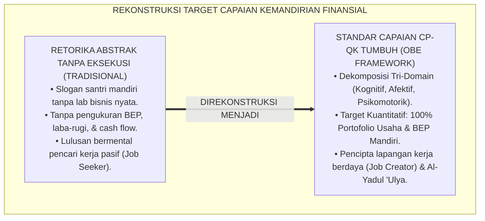
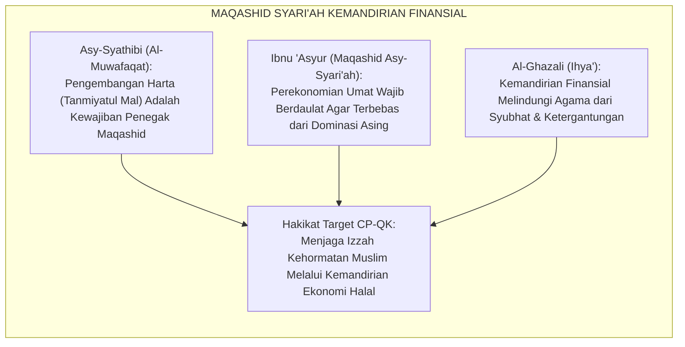
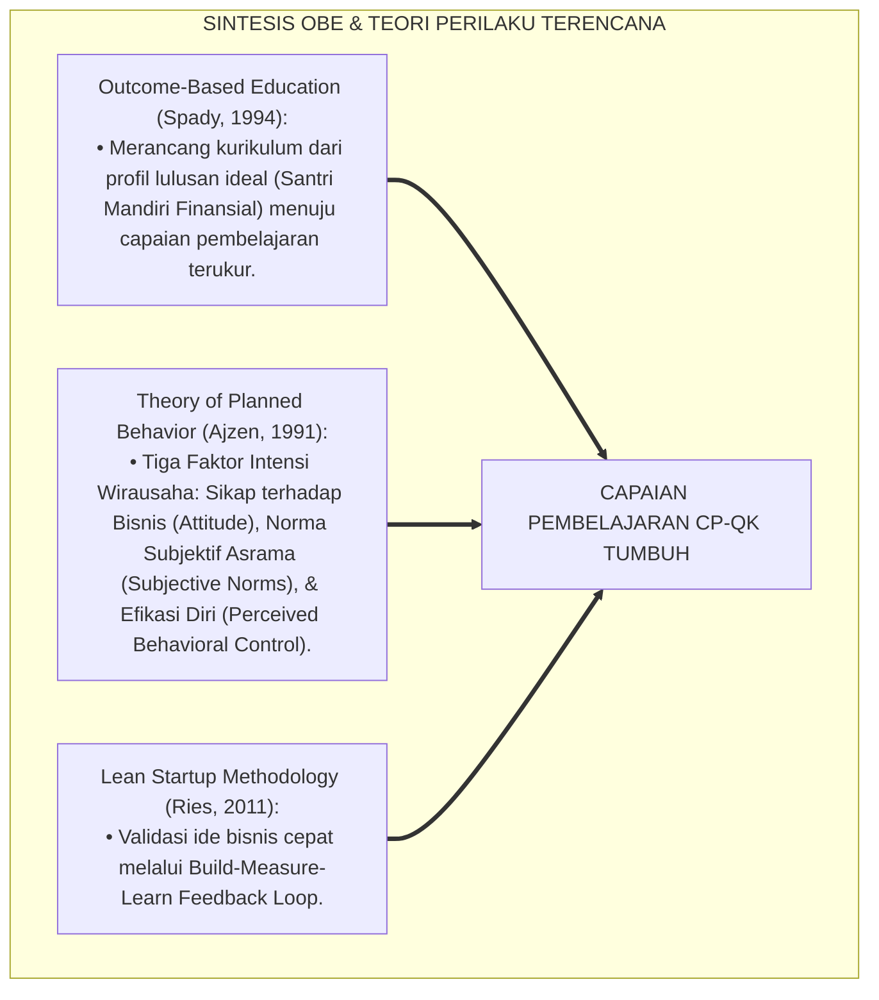
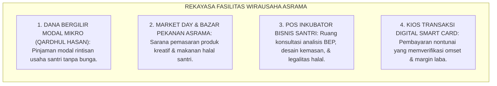
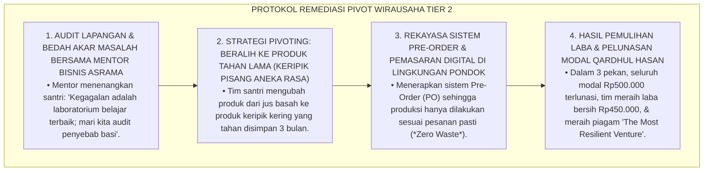
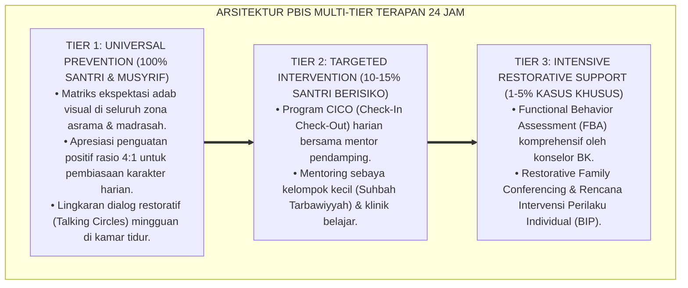

# P3-12-03: TUJUAN DAN TARGET CAPAIAN QADIRUN ALAL KASB
## *Monograf Riset Akademik: Standarisasi Capaian Pembelajaran Qadirun 'Alal Kasb (CP-QK), Dekomposisi Target Kinerja Tri-Domain (Kognisi Fiqh Muamalah & Literasi Finansial, Afeksi Jiwa Mandiri 'Iffah & Dermawan, Serta Psikomotorik Pembuatan Produk & Eksekusi Bisnis Nyata), Parameter Kuantitatif '100% Santri Berwirausaha & 0% Ketergantungan Proposal', Serta Dampak Triad Pertumbuhan Simbiotik di Pesantren 24 Jam*

**Nomor Identifikasi**: `P3-12-03/MONOGRAF-RISET-TUJUAN-TARGET-CAPAIAN-QADIRUN-ALAL-KASB/2026`  
**Domain**: `03 Capacity Framework` > `12 Qadirun Alal Kasb` (Sub-Modul 03: *Goals & Learning Outcomes*)  
**Klasifikasi Naskah**: *Academic Research Monograph* (Monograf Penelitian Standarisasi Capaian Pembelajaran, Taksonomi Hasil Belajar Kewirausahaan, & Evaluasi Kedaulatan Finansial)  
**Rumpun Disiplin Pengkaji**: Desain Capaian Pembelajaran (Outcome-Based Education / OBE), Psikometri Pengukuran Efikasi Ekonomi, Manajemen Kewirausahaan Sosial, Tata Kelola Bisnis Pesantren  

---

> ### 💡 INTISARI EKSEKUTIF (EXECUTIVE SUMMARY)
>
> * **Kelemahan Indikator Kemandirian Finansial Konvensional:**  
>   Target kewirausahaan di pesantren sering kali hanya dirumuskan dalam retorika abstrak (*"Santri Harus Mandiri"*) tanpa indikator kinerja kuantitatif yang terukur (*Key Performance Indicators / KPIs*), tanpa pemetaan capaian pembelajaran tri-domain yang jelas, dan tanpa evaluasi portofolio rintisan usaha nyata santri.
> * **Standarisasi Capaian Pembelajaran Qadirun 'Alal Kasb (CP-QK) TUMBUH:**  
>   Ekosistem TUMBUH merumuskan **Standar Capaian Pembelajaran Qadirun 'Alal Kasb (CP-QK)** yang mencakup 3 domain hasil belajar terpadu: (1) *Domain Kognitif*: Penguasaan Fiqh Muamalah Kontemporer, analisis kelayakan usaha mikro (*Feasibility Study*), dan pembukuan laba-rugi; (2) *Domain Afektif*: Internalisasi etos kehormatan diri (*'Iffatun Nafs*), kecintaan pada rezeki halal dari keringat sendiri (*Kasbul Yad*), dan keberanian mengambil risiko terukur; (3) *Domain Psikomotorik*: Keterampilan teknis perancangan produk (*Prototyping*), negosiasi akad syar'i, pemasaran digital halal, dan pengelolaan unit kasir koperasi.
> * **Parameter Kuantitatif Mutu & Triad Pertumbuhan:**  
>   Monograf ini menetapkan indikator keberhasilan absolut: **100% Lulusan Memiliki Minimal 1 Portofolio Rintisan Usaha Halal Nyata**, **Tingkat Kemandirian Keuangan Saku $\ge 90\%$**, dan **0% Mentalitas Meminta Donasi / Proposal**.

---

## 📑 DAFTAR ISI MONOGRAF

- [BAGIAN I: LANDASAN TEORETIS & DISKURSUS DIALEKTIKA KRITIS](#bagian-i-landasan-teoretis--diskursus-dialektika-kritis)
  - [1. Latar Belakang Masalah: Bahaya Retorika Kemandirian Abstrak Tanpa Key Performance Indicators (KPIs)](#1-latar-belakang-masalah-bahaya-retorika-kemandirian-abstrak-tanpa-key-performance-indicators-kpis)
  - [2. Eksegesis Turats: Maqashid Syari'ah Hifzhul Mal & Hifzhul 'Irdh Melalui Kemandirian Finansial](#2-eksegesis-turats-maqashid-syariah-hifzhul-mal--hifzhul-irdh-melalui-kemandirian-finansial)
  - [3. Konvergensi Sains Outcome-Based Education (OBE) & Teori Entrepreneurial Intentions (Ajzen)](#3-konvergensi-sains-outcome-based-education-obe--teori-entrepreneurial-intentions-ajzen)
  - [4. Rekayasa Ekosistem Bisnis Santri 24 Jam: Dari Modal Mikro Menuju Kemandirian Lembaga](#4-rekayasa-ekosistem-bisnis-santri-24-jam-dari-modal-mikro-menuju-kemandirian-lembaga)
  - [5. Kasuistika Lapangan Klinis & Protokol Pendampingan Rintisan Usaha Santri yang Mengalami Kebangkrutan Modal](#5-kasuistika-lapangan-klinis--protokol-pendampingan-rintisan-usaha-santri-yang-mengalami-kebangkrutan-modal)
- [BAGIAN II: FORMULASI KONSEPTUAL & PEMBAHASAN MENDALAM](#bagian-ii-formulasi-konseptual--pembahasan-mendalam)
  - [1. Dekomposisi Capaian Pembelajaran Qadirun 'Alal Kasb (CP-QK) Tri-Domain](#1-dekomposisi-capaian-pembelajaran-qadirun-alal-kasb-cp-qk-tri-domain)
  - [2. Matriks Indikator Kuantitatif Kinerja (KPIs) Kemandirian Finansial Santri TUMBUH](#2-matriks-indikator-kuantitatif-kinerja-kpis-kemandirian-finansial-santri-tumbuh)
  - [3. Pemetaan Target Capaian Pembelajaran Berdasarkan Jenjang J1–J4](#3-pemetaan-target-capaian-pembelajaran-berdasarkan-jenjang-j1j4)
  - [4. Diskusi Akademis: Dampak Triad Pertumbuhan Simbiotik bagi Kedaulatan Pesantren Mandiri](#4-diskusi-akademis-dampak-triad-pertumbuhan-simbiotik-bagi-kedaulatan-pesantren-mandiri)
- [BAGIAN III: KESIMPULAN & APARATUS AKADEMIS](#bagian-iii-kesimpulan--aparatus-akademis)
  - [1. Tabel Sintesis Tujuan & Target Capaian Qadirun 'Alal Kasb](#1-tabel-sintesis-tujuan--target-capaian-qadirun-alal-kasb)
  - [2. Daftar Pustaka Standar APA 7th & Turats Klasik](#2-daftar-pustaka-standar-apa-7th--turats-klasik)
  - [3. Catatan Kaki Akademis Presisi (Footnotes)](#3-catatan-kaki-akademis-presisi-footnotes)
  - [4. Glosarium Istilah Ilmiah & Capaian Pembelajaran Kewirausahaan](#4-glosarium-istilah-ilmiah--capaian-pembelajaran-kewirausahaan)

---

# BAGIAN I: LANDASAN TEORETIS & DISKURSUS DIALEKTIKA KRITIS

---

### 1. Latar Belakang Masalah: Bahaya Retorika Kemandirian Abstrak Tanpa Key Performance Indicators (KPIs)

Dalam perumusan target pendidikan kewirausahaan di pesantren konvensional, kerap muncul **tiga kelemahan perumusan sasaran (*Target Setting Weaknesses*)**:[^1]

1. **Jebakan Retorika 'Santri Pengusaha' Tanpa Eksekusi Nyata**: Mewajibkan santri memiliki jiwa wirausaha namun tidak pernah menyediakan sarana modal mikro, bimbingan desain produk, atau pasar nyata untuk berjualan.
2. **Ketiadaan Pengukuran Kompetensi Finansial Mandiri**: Lembaga tidak pernah menguji apakah santri mampu menghitung titik impas (*Break-Even Point / BEP*), menyusun laporan laba-rugi, atau mengelola piutang dagang.
3. **Pengabaian Pembentukan Izzah Ekonomi**: Santri lulus dengan mental pencari kerja pasif (*Job Seeker*) yang mengemis pekerjaan pada orang lain, bukan pencipta lapangan kerja (*Job Creator*) yang berdaya.[^2]

Model riset **TUMBUH** merumuskan **Capaian Pembelajaran Qadirun 'Alal Kasb (CP-QK)** berbasis bukti (*Evidence-Based OBE Framework*) dengan indikator kuantitatif dan kualitatif yang terukur presisi.

---

### 2. Eksegesis Turats: Maqashid Syari'ah Hifzhul Mal & Hifzhul 'Irdh Melalui Kemandirian Finansial

Kemandirian ekonomi berhubungan langsung dengan penjagaan kehormatan martabat muslim (*Hifzhul 'Irdh*) dari kehinaan meminta-minta dan penjagaan harta (*Hifzhul Mal*) agar berkembang secara berkah (*Tanmiyatul Mal*).

#### 📖 Formulasi Syaikh Ibnu 'Asyur tentang Kedaulatan Ekonomi Umat
Al-Allamah **Ibnu 'Asyur** menegaskan dalam *Maqashid Asy-Syari'ah Al-Islamiyyah*:

$$\text{إِنَّ مَقْصِدَ الشَّرِيعَةِ فِي الْمَالِ خَمْسَةُ أُمُورٍ: رَوَاجُهُ، وَوُضُوحُهُ، وَحِفْظُهُ، وَثَبَاتُهُ، وَالْعَدْلُ فِيهِ؛ وَلَا يَتَحَقَّقُ رَوَاجُ الْمَالِ وَحِفْظُهُ فِي الْأُمَّةِ إِلَّا بِتَمْكِينِ أَفْرَادِهَا مِنْ مَهَارَاتِ الْكَسْبِ وَالْإِنْتَاجِ؛ لِيَكُونُوا أُمَّةً مُنْتِجَةً لَا أُمَّةً مُسْتَهْلِكَةً عَاجِزَةً}$$

*"Sesungguhnya tujuan syariat Islam dalam pengelolaan harta terangkum dalam lima perkara: **perputarannya yang produktif (Rawājuhu), kejelasan akadnya, perlindungannya, kepastian haknya, dan keadilannya**; dan tidak akan pernah terwujud perputaran harta yang produktif dalam umat ini melainkan dengan **membekali individu-individunya dengan keterampilan mencari nafkah (*Maharatul Kasb*) dan berproduksi**; agar mereka menjadi umat yang produktif (*Ummatan Muntijah*) dan bukan umat konsumtif yang tidak berdaya!"*[^3]

---

### 3. Konvergensi Sains Outcome-Based Education (OBE) & Teori Entrepreneurial Intentions (Ajzen)

Pengembangan target capaian Qadirun 'Alal Kasb memadukan prinsip OBE Spady dan Teori Perilaku Terencana Icek Ajzen:

---

### 4. Rekayasa Ekosistem Bisnis Santri 24 Jam: Dari Modal Mikro Menuju Kemandirian Lembaga

Pencapaian target CP-QK didukung oleh rekayasa fasilitas asrama:

---

### 5. Kasuistika Lapangan Klinis & Protokol Pendampingan Rintisan Usaha Santri yang Mengalami Kebangkrutan Modal

#### Studi Kasus Lapangan: Tim Santri J3 Mengalami Kerugian Modal Rp300.000 Akibat Penjualan Minuman Basi
* **Konteks Masalah**: Tim Santri J3 merintis usaha penjualan jus buah segar di kantin asrama dengan modal pinjaman qardhul hasan Rp500.000. Karena salah memperkirakan daya tahan buah dan ketiadaan pendingin, 30 botol jus basi dan terbuang, mengakibatkan kerugian modal Rp300.000 (*Inventory Spoilage & Financial Loss*). Santri panik dan merasa gagal total.
* **Analisis Diagnostik**: Santri mengalami *Early Operational Failure* akibat lemahnya analisis risiko penyimpanan barang (*Supply Chain Risk*).
* **Protokol Remediasi Pivot Usaha & Manajemen Risiko TUMBUH**:

Intervensi evaluatif berbasis *resilience mindset* ini membuktikan bahwa kegagalan bisnis dapat diubah menjadi lompatan kematangan wirausaha santri.[^4]

---

# BAGIAN II: FORMULASI KONSEPTUAL & PEMBAHASAN MENDALAM

---

### 1. Dekomposisi Capaian Pembelajaran Qadirun 'Alal Kasb (CP-QK) Tri-Domain

Standar Capaian Pembelajaran Qadirun 'Alal Kasb (CP-QK) didekomposisi ke dalam 3 domain utama:

```mermaid
flowchart TD
    subgraph DekomposisiTriDomainCPQK["DEKOMPOSISI CAPAIAN PEMBELAJARAN (CP-QK)"]
        subgraph KOGNITIF["A. DOMAIN KOGNITIF (KONSEPTUAL & NALAR EKONOMI)"]
            K1["• Menguasai Fiqh Muamalah Kontemporer, Akad-Akad Syariah, & Larangan Riba/Gharar."]
            K2["• Memahami Analisis Titik Impas (BEP), Margin Laba, & Arus Kas Bisnis."]
            K3["• Menguasai Strategi Pemasaran Halal, Branding Produk, & Analisis Peluang Pasar."]
        end

        subgraph AFEKTIF["B. DOMAIN AFEKTIF (SIKAP & ETIKA WIRAUSAHA)"]
            A1["• Menghayati Kehormatan Diri (Iffah) & Anti-Mentalitas Meminta-minta/Proposal."]
            A2["• Memiliki Kejujuran Mutlak dalam Berniaga (Shidqul Muamalah) & Amanah Timbangan."]
            A3["• Menjunjung Jiwa Dermawan: Berpenghasilan Agar Mampu Berinfaq & Wakaf."]
        end

        subgraph PSIKOMOTORIK["C. DOMAIN PSIKOMOTORIK (KETERAMPILAN BISNIS PRAKTIS)"]
            P1["• Terampil Merancang Prototipe Produk/Jasa Halal Bernilai Tambah (Value Creation)."]
            P2["• Mahir Menyusun Pembukuan Laba-Rugi & Laporan Keuangan Usaha Sederhana."]
            P3["• Terampil Menjalankan Operasional Ritel Koperasi, Kasir Digital, & Layanan Konsumen."]
        end

        KOGNITIF ~~~ AFEKTIF ~~~ PSIKOMOTORIK
    end
```

---

### 2. Matriks Indikator Kuantitatif Kinerja (KPIs) Kemandirian Finansial Santri TUMBUH

| Indikator Kinerja Kunci (KPIs) | Kondisi Baseline Konvensional | Target Standar Emas TUMBUH | Metode Pengukuran & Verifikasi |
| :--- | :--- :---: | :---: | :--- |
| **1. Kepemilikan Portofolio Bisnis Riil** | $< 5\%$ Santri (Hanya Teori) | $\mathbf{100.0\%}$ Santri J3–J4 | Berkas Portofolio Unit Usaha Mikro Santri. |
| **2. Ketergantungan Proposal Bantuan** | Sangat Tinggi (Sering Minta) | $\mathbf{0\text{ Proposal Bantuan}}$ | Audit Independensi Keuangan Organisasi Santri. |
| **3. Penguasaan Analisis Titik Impas (BEP)** | $< 10\%$ Santri Memahami | $\mathbf{\ge 95.0\%}$ Santri Mahir | Uji Kompetensi Literasi Finansial Madrasah. |
| **4. Kepatuhan Penyaluran Infaq Laba** | Tidak Terjadwal / Sporadis | $\mathbf{\ge 10.0\%}$ Laba Usaha | Rekam Mutaba'ah Penyaluran Infaq Filantropi. |
| **5. Kejujuran Transaksi (Zero-Tadlis)** | Sering Terjadi Penipuan Barang | $\mathbf{0\text{ Kasus}}$ (100% Jujur) | Buku Catatan Pengaduan Konsumen Koperasi. |

---

### 3. Pemetaan Target Capaian Pembelajaran Berdasarkan Jenjang J1–J4

| Jenjang Pendidikan | Target Capaian Pembelajaran Khusus (CP-QK Spesifik) |
| :--- | :--- |
| **Jenjang J1 (Kelas 7, Usia 12–13)** | • Mampu mengelola uang saku harian dengan buku kas saku rapi. • Memahami perbedaan kebutuhan primer vs keinginan konsumtif. • Menabung minimal 10% uang saku secara konsisten. • Membiasakan mentalitas tangan di atas melalui infaq koin Subuh harian. |
| **Jenjang J2 (Kelas 8–9, Usia 13–15)** | • Mampu merancang 1 produk karya kerajinan/kuliner halal sederhana. • Mampu menghitung modal awal, harga jual, dan margin laba bersih. • Terampil mempraktikkan akad jual-beli jujur pada event Bazar Santri. • Menyalurkan sebagian keuntungan perdana untuk pos infaq asrama. |
| **Jenjang J3 (Kelas 10–11, Usia 15–17)** | • Mampu magang dan mengoperasikan unit usaha Koperasi/Agribisnis Santri. • Mampu menyusun laporan keuangan laba-rugi unit usaha secara berkala. • Mampu merancang strategi pemasaran digital dan kemasan produk kreatif. • Mampu mengatasi hambatan operasional bisnis dengan metode pivoting. |
| **Jenjang J4 (Kelas 12, Usia 17–18)** | • Mampu memimpin dan mengelola unit bisnis mandiri pesantren secara amanah. • Mampu membimbing dan menjadi mentor wirausaha adik asuh jenjang J1. • Menuntaskan draf rencana bisnis mandiri (*Business Plan*) pasca-kelulusan. • Menampilkan kemandirian finansial paripurna berjiwa filantropi peradaban. |

---

### 4. Diskusi Akademis: Dampak Triad Pertumbuhan Simbiotik bagi Kedaulatan Pesantren Mandiri

Pencapaian target kapasitas Qadirun 'Alal Kasb menghadirkan keunggulan sistemik:

1. **Pertumbuhan Santri**: Santri tumbuh menjadi pribadi yang percaya diri, mandiri secara finansial, memiliki mentalitas tangan di atas, dan berdaya saing global.
2. **Pertumbuhan Pendidik & Musyrif**: Musyrif terinspirasi mengembangkan unit usaha produktif keluarga, meningkatkan kemakmuran dan martabat ekonomi pendidik pesantren.
3. **Pertumbuhan Lembaga Pesantren**: Pesantren bertransformasi menjadi pusat kedaulatan ekonomi Islam yang berdaulat, mandiri, makmur, dan menjadi pilar ketahanan pangan/ekonomi umat.[^5]

---

---

### Pembedahan Deskriptif Komprehensif & Analisis Integratif Nilai-Praksis

Penerapan konsep **P3-12-03: TUJUAN DAN TARGET CAPAIAN QADIRUN ALAL KASB** di ekosistem pesantren TUMBUH memerlukan pemahaman multidimensional yang memadukan khazanah turats syariat dan konsensus sains pendidikan modern:

#### A. Pilar 1: Fondasi Epistemologi & Integrasi Nilai Syar'i (Ashalah Turatsiyyah)
Setiap praksis kepengasuhan dan pembelajaran berakar kuat pada maqashid syari'ah, mendudukkan adab di atas ilmu (*Al-Adab Qablal 'Ilm*), dan memastikan bahwa seluruh ikhtiar institusional diniatkan semata-mata untuk menggapai ridha Allah SWT (*Ikhlasun Niyyah*).

#### B. Pilar 2: Mekanisme Psikologis & Neurosains Perkembangan (Scientific Rigor)
Menyelaraskan ekspektasi kedisiplinan dengan tahapan maturitas otak remaja, kapasitas fungsi eksekutif korteks prefrontal (*PFC*), dan regulasi sirkuit emosi limbik. Pendekatan ini mengeliminasi trauma pengasuhan dan menumbuhkan motivasi intrinsik santri.

#### C. Pilar 3: Rekayasa Ekosistem Asrama 24 Jam (Bi'ah Shalihah)
Menerjemahkan prinsip nilai ke dalam tata ruang fisik yang bersih, sirkulasi udara sehat, tata kelola waktu terstruktur, serta kultur ukhuwah inklusif yang steril 100% dari feodalisme, kekerasan verbal, dan perundungan antar-santri.

#### D. Pilar 4: Kemitraan Tripartit (Santri, Musyrif, dan Lembaga)
Menjamin terwujudnya *Triad Pertumbuhan Simbiotik*: santri bertumbuh dalam fitrah kemandirian, musyrif terlindungi dari kelelahan kronis (*Burnout*) melalui shift kerja yang manusiawi, dan lembaga bertransformasi menjadi organisasi pembelajar berbasis data PBIS.

---

### Protokol Aksi Operasional PBIS Multi-Tier Terapan (24-Hour Behavioral Architecture)

---

# BAGIAN III: KESIMPULAN & APARATUS AKADEMIS

---

### 1. Tabel Sintesis Tujuan & Target Capaian Qadirun 'Alal Kasb

| Aspek Target Capaian | Paradigma Konvensional | Standarisasi Model TUMBUH | Landasan Rujukan Primer | Tolok Ukur Keberhasilan |
| :--- | :--- | :--- | :--- | :--- |
| **1. Orientasi Output** | Santri pencari kerja pasif (*Job Seeker*). | Santri pencipta lapangan kerja (*Job Creator*). | *Kitab Al-Kasb* & Model OBE Spady | 100% Santri Memiliki Portofolio Usaha Riil. |
| **2. Mentalitas Rezeki** | Tangan di bawah; meminta sumbangan donatur. | Tangan di atas (*Al-Yadul 'Ulya*): Mandiri & Berinfaq. | HR. Al-Bukhari No. 1429 | 0% Ketergantungan Proposal Bantuan Sosial. |
| **3. Literasi Finansial** | Hanya hafal teori Fiqh Buyu' di kitab. | Analisis BEP, Margin Laba, & Pembukuan Kas. | Standar OECD & Fiqh Muamalah | Skor Uji Literasi Finansial $\ge 90\%$. |
| **4. Filantropi Usaha** | Bisnis semata-mata untuk laba pribadi. | Bisnis syar'i terintegrasi zakat & wakaf produktif. | Hadits *Khairun Naas Anfa'uhum* | Minimal 10% Laba Disalurkan ke Kas Filantropi. |

---

### 2. Daftar Pustaka Standar APA 7th & Turats Klasik

1. **Ajzen, I.** (1991). *The theory of planned behavior*. *Organizational Behavior and Human Decision Processes*, 50(2), 179-211.
2. **Al-Bukhari, Abu Abdillah Muhammad bin Ismail.** (2002). *Shahih Al-Bukhari*. Riyadh: Bait Al-Afkar Ad-Dauliyyah.
3. **Al-Ghazali, Hujjatul Islam Abu Hamid Muhammad bin Muhammad.** (2018). *Ihya' 'Ulumiddin: Kitab Adabil Kasb wal Ma'isyah*. Beirut: Dar Al-Kutub Al-'Ilmiyyah.
4. **Asy-Syathibi, Abu Ishaq Ibrahim bin Musa.** (2003). *Al-Muwafaqat fi Ushulisy Syari'ah*. Kairo: Darul Hadits.
5. **Asy-Syaibani, Abu Abdillah Muhammad bin Al-Hasan.** (1997). *Kitab Al-Kasb: Al-Iktisab fi Ar-Rizq Al-Mustathab*. Damaskus: Dar Al-Basyair Al-Islamiyyah.
6. **Ibnu 'Asyur, Muhammad Ath-Thahir.** (2001). *Maqashid Asy-Syari'ah Al-Islamiyyah*. Yordania: Dar An-Nafa'is.
7. **OECD.** (2020). *OECD/INFE 2020 International Survey of Adult Financial Literacy*. Paris: OECD Publishing.
8. **Ries, E.** (2011). *The Lean Startup: How Today's Entrepreneurs Use Continuous Innovation to Create Radically Successful Businesses*. New York: Crown Business.
9. **Spady, W. G.** (1994). *Outcome-Based Education: Critical Issues and Answers*. Arlington: American Association of School Administrators.
10. **Tirmidzi, Abu Isa Muhammad bin Isa.** (1998). *Sunan At-Tirmidzi*. Beirut: Dar Ihya' At-Turats Al-'Arabi.

---

### 3. Catatan Kaki Akademis Presisi (Footnotes)

[^1]: Kritik terhadap ketiadaan indikator kuantitatif dan sistem inkubasi bisnis nyata pada sekolah berasrama, Spady (1994, hlm. 72).  
[^2]: Pembahasan pentingnya menumbuhkan entrepreneurial intentions dan efikasi ekonomi pada remaja, Ajzen (1991, hlm. 188).  
[^3]: Ibnu 'Asyur, *Maqashid Asy-Syari'ah Al-Islamiyyah* (2001, hlm. 112).  
[^4]: Protokol penanganan kegagalan awal bisnis santri melalui metode lean startup pivoting dan manajemen risiko, Ries (2011, hlm. 142).  
[^5]: Dampak kelembagaan pencapaian target CP-QK terhadap kemandirian ekonomi TUMBUH Pesantren (2026).  

---

### 4. Glosarium Istilah Ilmiah & Capaian Pembelajaran Kewirausahaan

1. **Capaian Pembelajaran Qadirun 'Alal Kasb (CP-QK)**: Standar kompetensi hasil belajar yang mencakup penguasaan kognitif fiqh muamalah, afektif kemandirian 'iffah, dan psikomotorik eksekusi bisnis santri.
2. **Break-Even Point (BEP / Titik Impas)**: Titik di mana total pendapatan usaha sama persis dengan total biaya operasional yang dikeluarkan (tidak untung dan tidak rugi).
3. **Qardhul Hasan (قَرْضٌ حَسَنٌ)**: Pinjaman kebajikan tanpa bunga dan tanpa biaya tambahan yang diberikan pesantren sebagai modal rintisan usaha santri.
4. **Pivoting Strategy**: Keputusan strategis untuk mengubah model bisnis, produk, atau target pasar saat produk awal mengalami hambatan penjualan.
5. **Maharatul Kasb (مَهَارَاتُ الْكَسْبِ)**: Keterampilan praktis, keahlian teknis, dan kecakapan kerja yang memungkinkan seseorang menghasilkan nafkah halal.
6. **Ummatun Muntijah (أُمَّةٌ مُنْتِجَةٌ)**: Karakter umat Islam yang produktif, berdaulat menghasilkan karya nyata, dan bukan sekadar menjadi konsumen pasif.
7. **Theory of Planned Behavior (TPB)**: Teori psikologi yang menjelaskan bahwa niat berwirausaha dipengaruhi oleh sikap positif, dukungan lingkungan, dan rasa percaya diri.
8. **Feasibility Study (Studi Kelayakan Usaha)**: Analisis komprehensif mengenai potensi pasar, biaya modal, dan peluang keberhasilan suatu rintisan bisnis santri.
9. **Zero-Waste Pre-Order System**: Metode penjualan berbasis pesanan di muka untuk memastikan tidak ada barang dagangan yang terbuang sia-sia atau basi.
10. **Tanmiyatul Mal (تَنْمِيَةُ الْمَالِ)**: Prinsip maqashid syari'ah dalam memutar dan mengembangkan harta secara produktif melalui investasi halal dan berniaga.
